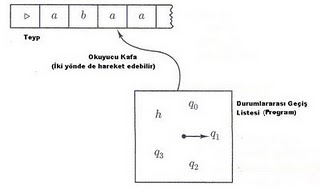
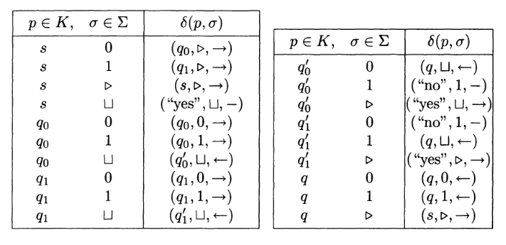
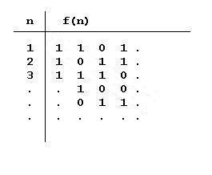
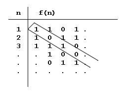

# Hesapsal Karmaşıklık Teorisi (Computational Complexity)

Bu bilim dalı algoritmaların yer ve zaman gibi kaynakları ne kadar
kullandığından hareketle bu algoritmaları kategorize etmeye uğraşır. Diğer
bazı amaçlar, hangi algoritmaların çözümsüz olacağı, hangi algoritmaların
çok zaman alacak olsa bile, eninde sonunda bir sonuca varabileceği gibi
konulardır.

Algoritma türlerinin arasındaki benzerlikleri bulmak zorluk teorisin ana
eylemlerinden; mesela problem $A$ için bir algoritma yazmamız gerektiğini
düşünelim, ve aynı gün kuramsal bir bilgisayar bilim makâlesinde, bizim
problemin diğer bir "$B$ problemi" ile tıpatıp aynı olduğunu okuduk. Bu makâleye
göre, $B$ probleminin kabakuvvet çözümünün "yavaş" olduğu belirtilmiş olabilir,
ve hızlı çözümün imkansız olduğu da ispat edilebiliyor. Bu bilgiden hareketle,
$A$'nın da hızlı cözümünün olamayacağını daha baştan anlarız, akıllı tahmin
(heuristic) ekleyerek çözümü biraz olsun hızlandırmaya çalışabiliriz.

P (Polinom) Grubu

Bir algoritmanın P grubu içinde olduğu söyleniyorsa, bu algoritma polinom
zamanda işliyor demektir, yani algoritma karmaşıklığı $O(n^2)$ gibi bir
şekilde belirtilebiliyordur; polinom ifadesi herhalde $n^2$ ifadesinin bir
polinom olmasından, $O(n)$, yani eleman sayısına direk orantılı / lineer
zamanda işleyen algoritmalar de tabii ki bu grupta ($n^1$ de bir polinom
(!) ). P grubu en hızlı işleyen algoritmalar grubudur, algoritmalarımızı bu
grupta görmek isteriz, ve ona göre tasarlamaya çabalarız. En iyi bilinen,
"iyi'' algoritmaların hepsi bu gruptadır, mesela tüm popüler sıralama
(sorting) algoritmaları, aritmetik hesaplar, lineer cebirdeki çoğu matris
işlemi, kısayol bulma algoritmaları, vs.

NP-Zor (NP-Hard) ve NP-Tam (NP-Complete)

Bilgisayar bilimde öyle problemler vardır çözümlerini bulmak için mümkün
girdinin tüm kombinasyonlarını denemek gerekir. 3SAT bu problemlerden
biri. Diyelim ki $x_1,..,x_n$ değişkenlerini kullanıp en fazla üç öğeli, ve
grup içinde VEYA ile birbirine bağlı, gruplararası ise VE ile birbirine
bağlı bir ifade zinciri oluşturuyoruz.

$$
(x_1 \lor x_2 \lor \bar{x_3}) \land 
(\bar{x_1} \lor \bar{x_2} \lor \bar{x_3}) \land
(x_1 \lor \bar{x_2}) \land
(\bar{x_1} \lor \bar{x_2})
$$

ki $\lor$ işareti VEYA (OR), $\land$ işareti ise VE (AND), değişken
üzerinde çizgi olması onun tersinin alınması (NOT) demek. Soru şu, bu
ifadenin doğru yani 1 sonucunu vermesini sağlayacak girdiler / onu tatmin
edecek (satisfy -SAT kısaltması buradan geliyor-) var mıdır? Ve bu sonuç
polinom zamanda bulunabilir mi?

Bu ufak örnekte tahmin etmeye uğraşırsak, $x_1=1,x_2=0,x_3=0$ bu formülü
"tatmin eder'', yani üstteki ifade 1 sonucunu verebilen bir
ifadedir. Fakat bu sonuca "kesinlikle'' erişmek ve bunu her tür 3SAT
problemi için yapabilmek için bir programın tüm girdi kombinasyonlarını
denemesi gerekir. Tüm seçeneklerin denenme mecburiyeti bir problemi zor
kategorisine sokar. Kısayol, cinlik, envai türden tahmin (heuristic) her
zaman ise yaramaz, bazı problemlerde yarayabilir, fakat hesapsal zorluk her
zaman en kötü şartın performansını baz alır.

3SAT o kadar temel bir problemdir ki, zor problemler kategorisinde temsili bir
özelliği vardır. Tüm zor problemler 3SAT'a indirgenebilirler. Bu tür problemlere
ayrıca NT-Tam ismi de verilir, çünkü çok zor problemleri "tam'' olarak temsil
ederler.

Turing Makinaları

Şimdi Turing makinalarına, onların baştan planlı (deterministic), baştan
plansız (nondeterministic) şekillerinin üzerinden geçelim.

Algoritma başı sonu belli, her muhtemel seçenek için önceden belirlenmiş bir kod
parçasının devreye girdiği bir veri ve eylemler dizisidir. Bu algoritmayı
yazarken içinde bulunduğumuz evren, değişkenler, girdi, çıktı aletleri,
eğer/eylem çiftleri, gibi kavramların olduğu bir evren. Bu dili işleten makinayı
bir soyut makina olarak görelim. Fakat göreceğiz ki, halâ teorik iş yapmamız
için bu makina yeteri kadar basit değildir. Kullandığımız 'esnek' dili
destekleyen makinamız oldukça çetrefil hâlde. Ayrıca, dili değiştirirsek (Java
yerine LISP gibi) makinın da değişmesi gerekir, bütün dilleri temsil edebilen
bir makina bulamaz mıyız?  Teorik iş yapabilmemiz için böyle evrensel bir
makinaya ihtiyacımız var.

Dili basitleştirelim. Direk erişimli (random access) belleği olan, komutları ve
verisi aynı gözüken bir makina yapalım ve onun kullandığı dili tasarlayalım. (Bu
makina günümüzde kullanılan bilgisayardır).

Peki bu makina daha da basit olamaz mı?

Olur. Tek bir teyp üzerinde girdisini tutan, her an, önceden belirli ve sayılı
konum/durum içinde olabilen, komutlarını, durumdan/duruma geçiş listesi olarak
tutan bir makina düşünelim.

Öyle gözüküyor ki, artık bilgisayar işleminin ruhuna indik. Bundan daha basit
bir makina tasarlamamız mümkün gözükmüyor. Durum, geçiş, ve teyp kavramlarını
kullanarak her türlü bilgisayar hesabını temsil edebileceğimizi düşünürsek
(bunun ispatları yapılmıştır), en basit temsil şeklinde varmış olduğumuzu
görüyoruz.

İşte bu makina, Turing makinası olarak bilinir.



Formel olarak, Turing makinası M şu dörtlüyü içerir: 

$$ M = (K,\Sigma,\delta, s) $$

$K$ = makina durumu (state)

$\delta$ = gecis fonksiyonu 

$\Sigma$ = teyp alfabesi 

$s$: teyp verisi 

Dörtlü içindeki bütün terimler birer kümedir. K terimi, M makinasının içerdiği
durumların kümesi, delta bütün geçişlerin listesi, sigma, alfabe olduğu için
teypin kullandığı harflerin kümesi ve s, giriş için M makinasına verilen
harflerin kümesidir.

Şimdi programa dönelim: Geçiş fonksiyonu olan delta, yani program, K x Sigma
ile, (K U {dur, "evet", "hayır"}) x Sigma x {Sol, Sağ, Hareketsiz} küme
üyelerini birbirine eşler. Yani geçiş fonksiyonu, durum+teyp sembolu
ikililerini, durum+teyp sembolu+teyp hareketi üçlülerine eşlemektedir.

Not: 'x' operasyonu, iki küme arasında kartezyen eşleme yapmaktadır. Yâni,
A x B, A kümesinin her elemanı ile B kümesinin her elemanını eşleyerek,
|A|*|B| sayıda yeni bir küme oluşturur. SQL dilini bilenler JOIN komutu ile
bağlantı kurabilirler)

Turing makinasının işlevi, makinanın o anda gördüğü, kafasının okuduğu sembol,
ve o an içinde olunan duruma göre başka bir duruma geçmek, ve (gerekiyorsa)
teype yeni bir harf yazmak, sonra da teyp kafasını gene programa göre sağa ya da
sola hareket ettirmekten ibarettir. Teyp kafasını hareketsiz bırakmakta
mümkündür.

Bu kadar basit temel işlemlere dayanan bir modelin dünyadaki bütün
algoritmaları temsil edebilmesi ilginç değil mi?

Örnek Turing makinası olarak, aşağıda teyp üzerinden verilen bir metnin
palındrom olup olmadığını anlayabilen bir Turing Makinayı görebiliriz. Bu
program (makina), eğer metin palındrom ise "evet" cevabı verecek, değil ise
"hayır" cevabı verecektir. Palındrom metni, "arabaabara" gibi, içinde
"araba" kelimesinin ters yüz edilerek yanyana konulduğu metne verilen
isimdir. Palındrom tanımak çok kolay olmayıp çok zor da olmayan bir örnek
olduğu için hesapsal karmaşıklık teorisi kitaplarında oldukca
kullanılmaktadır [1]. Alttaki örnek ikisel veri üzerinde işliyor, yani
$M(0000) = 'evet'$, $M(011) = 'hayır'$, ve $M(0110) = 'evet'$ cevaplarını
hesaplayacak. 



$\Sigma$ her zaman özel karakterler $\sqcup$ ve $\rhd$'yi içerir, bunlar
sırasıyla "boş'' ve verinin başını temsil eden ilk semboldur. Program
denen şey $\delta$'dir, $\delta(q,\sigma) = (p,\rho,D)$ olarak belirtilir,
yani her $q \in K$ ve o anda üzerinde olunan sembol $\sigma \in \Sigma$
için sonraki konum $p$'yi, $\sigma$ üzerine yazılacak (bir önceki
silinerek) sembol $\rho$'yu, ve teyp üzerinde hangi yöne hareket
edileceğini gösteren $D \in \{ \leftarrow, \rightarrow, -\}$'yi
üretir. Eğer başlangıçta isek bu sembolü silmeden hep sağa gitmek
istiyoruz, o sebeple programın değişmeyen tek parçası
$\delta(q,\rhd) = (p,\rho,D)$ $p=\rhd$, $D=\rightarrow$.

Program nasıl başlar? İlk önce konum $s$'dir. Girdi $\rhd$'ye getirilir, bu
sembol arkasında sonlu (finite) bir karakter dizisi vardır,
$x \in (\Sigma-\{\sqcup\} )$. $x$'e Turing makinasının girdisi adı
verilir. Başta teyp kafası $\rhd$ üzerindedir. 

İşleyiş şöyle devam eder: $s$ konumunda girdinin ilk sembolü aranır,
bulununca bu sembol bir $\rhd$ haline getirilir (böylece sanki girdi sola
doğru çekilmiş gibi olur, daha doğrusu girdinin ilk öğesini "işlenmiş''
hale getirdik, onu sildik -ama konumda onu hatırlıyoruz-). Konumda
hatırlamak ilk karakter 0 ise $q_0$ konumuna 1 ise $q_1$ konumuna girmek
ile oluyor. Sonsuz olmayan girdi öğelerini konum üzerinden hatırlanması
Turing makinalarının önemli numaralarından biridir bu arada, ve pek çok
farklı yerde kullanılır. Ardından $M$ teyp kafasını $\sqcup$ bulununcaya
kadar sağa doğru gönderecektir, bir kez sona gelinince en sondan bir önceki
sembole bakılır. Tabii "sona gitmek'' te belli programsal adımlar ile
yapılıyor, ilk sembol 0'dı diyelim, sağa geldik 0 ise 0 yaz, sağa git, 1
ise 1 yaz, sağa git adımları bu gidişi hallediyorlar. 

Sona gelinince akılda tutulan $q_0'$ ya da $q_1'$'e geçilir, böylece hem
sona gelmiş olduğumuzu, ve başta ne okumuş olduğumuzu hatırlamış oluyoruz,
sonra teyp kafasını sola hareket ettiriyoruz. Buradaki öğe hatırlanan öğe
ile uyumlu ise oraya $\sqcup$ yazıyoruz, böylece bu öğeyi bir bakıma
"işlenmiş'' olarak siliyoruz. Eğer uyumsuzluk var ise, 'hayır' cevabı
verip duruyoruz. Devam ediyorusak bu noktada eldeki dizi hem soldan hem
soldan hem sağdan küçülmüş oldu, ve geri kalan veri üzerinde aynı işleme
devam edebiliriz, veri küçülecek, küçülecek, eğer elde bir palındrom var
ise elde hiç girdi kalmayana kadar bu işlem devam edecek.

Church-Turing Tezi

Araştırmacılar uzun süre Turing makinasından daha basit bir model bulmaya
uğraştılar, ve bu uğraşıda başarısız oldular.

Daha sonra araştırmacılar, kaç değişik makina modelinin mevcut olabileceğini
anlamak için, en basit Turing makinasının çözemeyeceği problemleri çözecek
makinalar tasarlamaya da uğraştılar. Mesela RAM, birden fazla teyp, vs. gibi
ekler koyarak, basit modeli güçlendirmeye çabaladılar. Eğer en basit modelin
çözemeyeceği bir problemi çözen bir model bulsalardı, bu model yeni ve
alternatif bir model olabilirdi. Yeni modelin değişik olup olmadığını nasıl
anlamak için, kuramcılar indirgeme denen bir tekniği kullandılar. İndirgeme,
yeni modelle kurulmuş olan makinayı, eski modelle kurulmuş makina aracılığı ile,
yani onun dili ile, simule etmektir.

Bu simulasyonun 'dönüşüm' denen aşamasında, simule edilen makinanın
girdisi, ötekine çok hızlı bir şekilde dönüştürülür. Hemen ardından simule
eden makinaya girdi olarak verilir. Çıktı da aynı şekilde dönüştürülür.

Eğer çok hızlı (polinom zamanlı) olarak dönüşümü yapabildiysek, ve simule
de çalışır ise, indirgeme başarılı olmuş demektir.

Fakat, görülmüştür ki, envai türden ekler ile güçlenen her 'sözde yeni' model en
basit Turing makinasına indirgenebilmiştir. Demek ki bu 'yeni' modeller
gerçekten yeni model değillerdi, ve işte bu bu sayede bilgisayarlar için en
basit Turing makinasından alternatif bir model olamacağı kanıtlanmış oldu.

Bütün bu bulgulara dayanarak Church ve Turing şu tezi kabul etmeye karar
verdiler.

"Bir algoritma ile, (bütün girdilerine "evet" ve "hayır" cevabı verebilen) bir
Turing makinası tamamen aynıdır. Birbirleri arasında direk ilişki vardır. "

Yani, algoritma denen soyut kavram, en basit Turing makinası üzerinde yazılan
bir program demektir, bütün teorik hesaplar ve kuramlar bu en basit makina
üzerinden yapılabilir.

Bu ortak bilgisayar kavramında fikirbirliğine varılmasının ne kadar önemli
olduğunu vurgulamak istiyorum. Teorik dünyada, 'bilgisayar' denince, formel bir
kavram akla gelmelidir. En basit makinalar arasında en güçlüsü seçilerek, bu
makinayı baz alan kuramların da aynı şekilde basit olması
sağlanmıştır. Basitlik, bilim dünyasında önemli yer tutar.

"Her girdiye evet ya da hayır cevabı veren" makinaların özellikle belirtilmesi
ilginçtir. Bunun sebebi şudur; Her Turing makınasının (yani programın)
işleyişini biterek durması garanti değildir. Sonsuz döngüye giren programları
hepimiz biliyoruz. Eğer evrendeki her Turing makinasını 11001010... gibi bir
ikili düzen kodu ile belirtiliyorsak, bu makinalardan her biri durup, "evet" ya
da "hayır" cevabı veriyor olamaz (bu söylemin ispatını algoritma çetrefilliğini
işlediğimiz yazıda bulunabilir).

Church-Turing tezi, duran ve "evet" ya da "hayır" cevabı veren makinaların bir
algoritma ile eşgörülmesini belirtmiştir.

Ek olarak belirtmek gerekir ki, Church-Turing tezi sadece bir tezdir, yani bir
önkabuldür. Aynen matematikteki bir aksiyom gibidir, yani ispatlanmış teori
değildir. Bu sebeple doğruluğu veya yanlışlığı ispat edilemez. Geometride nokta,
çizgi gibi kavramların en baştan ispatsız olarak kabul edildiği gibi,
Church-Turing tezi bir başlangıç önkabuludur. Bu önkabul olmadan geri kalan
teorileri bir temele oturtmamız mümkün olmazdı.

Tabii, Church-Turing tezi bir tez olduğuna göre, başka bir tez gelecek olsa
değişik bir bilgisayar bilim teorisi kurulabilirdi. Fakat araştırmacılar bunun
mümkün olduğunu düşünmüyor.

Sonsuza Giden İkili Sayıların Kümesi

Aşağıda gösterilen küme, sayılamayan sonsuz bir kümedir.

```
B =
{1101 ....... }
{1011 ....... }
{1110 ....... }
{.100 ....... }
{.011 ....... }
...
```

Teori: B sayılamayan sonsuzluktadır.

İspat:

B'nin sayılabilir olduğunu farzedelim.

Kullanılan matematiksel teknik: Bir teorinin "karşıtının" doğru olduğunu, yani
B'nin sayılabilir bir sonsuzluk olduğunu farzedip yola devam eder, ve anlamsız /
saçma / absürt bir sonuca varırsak, tersini farzettiğimizi teori doğru
demektir. Bu, yanlışın yanlışlığının doğruyu vermesidir bir anlamda.

Bu teknik, matematikte "karşıtlık ile ispat etmek" diye bilinir. Teorinin
tersini kabul edip yanlış bir sonuca vardıysak, demek ki teori doğrudur .

Devam edelim. B'nin sayılabilir olduğunu farzettiğimize göre, aşağıdaki
gibi bir eşleme mümkün olabilir.



Şimdi, doğal sayılar ile olan eşlemeyi yanlış çıkartmak için öyle bir sayı
bulacağız ki, hiçbir n ile eşlenemeyecek.

Bu sayı, köşegen üzerindeki sayının ikili aritmetiğe göre tam tersi olsun
(köşegen aşağıda gösterilmiştir)



Yani köşegendeki 1010.. yerine, 0101... kullanacağız. Bu sayı, bir n ile
eşlenebilir mi?

Hayır! Neden olduğunu görelim. Bu eşlemenin imkansız olmasının sebebi, sol
tarafta 1,2,..n diye giderken, n'in karşısındaki f(n)'in (terslik kuralımız
yüzünden) n'inci değerinin her zaman gerekenden ters bir değer olacağıdır.

Halbuki, elimizde sonsuz tane 0 ve 1 var, ve elimizdeki 0101.. değerini bir
yerlere koyabilmeliydik. Fakat elimizdeki gayet masum ve basit kurala göre
bile bunu yapamıyoruz. Demek ki, başta yapılan faraziye, yanlış idi, bu da
teorinin doğruluğunu ispatlar. B sayılamayan büyüklükte bir sonsuz kümedir.

Sonsuzluklar Arasındaki Farklar

İki sonsuzluk arasındaki en bariz fark, bir sonsuzluğun sayılabilir
ötekinin de sayılamayan türden olduğu zaman ortaya çıkar. Sayılabilen
sonsuzlukları tanımlamak için, ünlü matematikçi Kurt Gödel, incelediği
kümeyi doğal sayılar ile eşleme tekniğini denedi. Doğal sayılar bildiğimiz
gibi 1'den başlayarak sonsuza kadar birer birer artan tam sayıların
kümesidir.

Sayılabilir Sonsuzluklar

Zaten herhangi bir şeyi sayarken de yaptığımiz bu değil midir? Parmakla
gösterip, söyleriz "bir..iki..üç...vs.", ve kullandığımız bütün bu sayılar
birer doğal sayıdır. Yani sayarken biz de gösterdiğimiz şeyi, bir doğal
sayı ile eşleriz.

Bu eşlemenin geçerli olabilmesi için, en güçlü matematiksel hâlinde olması
gerekiyor, yani bize lazım olan birebir ve örten türden bir eşlemedir... A
ve B kümesi düşünürsek; Birebir eşleme, iki değişik A elemanının hiçbir
zaman aynı B elemanına eşlenmediği zaman ortaya çıkar, örten eşleme ise,
B'nin bütün elemanlarının A'nın bir elemanı ile muhakkak eşlendiği zaman
ortaya çıkar.

Bu iki tür eşlemenin olduğu zaman, elimizde tekabül etme (correspondence)
ilişkisi çıkar.

Şimdi tekabül tekniği kullanarak örnek kümeleri inceleyelim: Mesela,
2,4,6,... olarak ikişer ikişer artan sayılar kümesi sayılabilir bir
sonsuzluk mudur?

Bu soruyu, yeni bilgilerimiz ışığında değiştirerek tekrar soruyoruz; Doğal
sayılar ile {2,4,...} kümesi arasında ilişki varmı dır?

Ek not: Lise matematiğinden hatırlayacağımız fonksiyon kavramı, aslında bir
tekabül ilişkisidir.

Demek ki, doğal sayılar ile {2,4,...N} arasında bir fonksiyon bulabilirsek,
tekabül ilişkisini kurmuş olacağız, ve {2,4,...N}'in sayılabilir bir küme
olduğunu ispatlamış olacağız.

Bu fonksiyonu bulmak oldukça basit: f(x) = 2x. Demek ki {2,4,6..} kümesi
sayılabilir bir sonsuzluktur.

Sayılamayan Sonsuzluklar

Gerçek sayılar, noktadan sonra kesire devam eden sayılardır, mesela pi
sayısı 3.1415926.. ya da 2'nin karekökü 1.4142135... sayıları gerçek
sayılardır. Cantor, R kümesinin sayılamaz olduğunu köşegenleştirme
(diagonalization) tekniğini kullanarak ispat etmiştir.

Teori: Gerçek sayılar kümesi R (real numbers), sayılamaz bir kümedir.

İspat: R'ın sayılamaz olduğunu ispat etmek için, R ile N (doğal sayılar)
arasında tekabül ilişkisi olmadığını ispat etmek zorundayız. İspat,
karşıtlık ile ispat etme tekniğini kullanacak. Düşünelim ki, N ile R
arasında f denen bir tekabül ilişkisi mümkün. Bizim yapmamız gereken, f'in
gerektiği gibi çalışamacağını ispat etmekten ibaret.

F'in doğru bir tekabül ilişkisi olabilmesi için, f bütün N'in elemanlarını,
tüm R elemanları ile eşlemelidir. Ama biz öyle bir x bulacağız ki, bu x
hiçbir N elemanı ile eşlenemeyecek. Aradığımız karşıtlıkta işte bu x
olacak.

Bu x'i arayıp bulamayız tabii, ama inşa edebiliriz.

Şimdi, tekabül ilişkisinin olduğu farzından yola çıkarak, aşağıdaki türden
bir ilişkinin mevcut olduğunu varsayalım.

$$
\begin{array}{cc}
n & f(n) \\
\hline
1 &  3.14159 \dots \\
\hline
2 &  55.555555 \dots \\
\hline
3 &  0.12345 \dots \\
\hline
4 &  0.5000000 \dots \\
\hline
\dots & \dots 
\end{array}
$$

Bu tekabül ilişkisi, f(1) = 3.14159...., f(2) = 55.55555..., f(3) =
.. .olarak devam ediyor. Yani, f işlevi 1 sayısını 3.14159 ile eşliyor, 2
sayısını 55.55555 ile eşliyor, vs.

Baştaki farzla ilerleyip geri kalan sonuçları patlatmak için, amacımız
f(n)'in üyesi olamayacak bir x bulmak idi. Bunun için şöyle bir x
kurgulayabiliriz.

X'in inşa kuralını şöyle saptayalım: X'in 1. basamağındaki sayı, f(1)'in
noktadan sonraki 1. basamağındaki sayıdan farklı olsun. Ne olursa olsun
(önemli değil) ama farklı olsun. Yukarıdaki f(1) örneğinde bu sayı 1
(3.14159..), o zaman x'in noktadan sonraki 1. sayısı, 1'den farklı olması
gerekiyor; mesela, rasgele seçiyoruz, 4.

Aynı şekilde, x'in f(2)'de olamamasını zorlamak için, x'in 2. basmağındaki
sayının f(2)'nin 2. basamağındaki sayıdan farklı seçiyoruz. Yani, 5 yerine
(55.55555..) diyelim 6.

Gene aynı şekilde, x'in f(3) için, 3 yerine 4 seçebiliriz, vs..

Bu şekilde f(n)'in köşegeni üzerinde devam ederek bir x oluşturmuş oluruz.

$$
\begin{array}{cc}
n & f(n) \\
\hline
1 &  3.[1]4159 \dots \\
\hline
2 &  55.5[5]5555 \dots \\
\hline
3 &  0.12[3]45 \dots \\
\hline
4 &   0.500[0]000 \dots \\
\hline
\dots & \dots
\end{array}
$$

x = 0.464...

X'in f(n)'in üyesi olamayacağını bu şekilde ispatlamış oluyoruz, çünkü x'in
n'inci basamağı, f(n)'in noktadan sonraki n'inci basamağından *her zaman*
değişik olacaktır.

Not: Biraz daha görsel olan ispatlar, şunu da ekleyebiliyor: X'i f(n) içine
sokuşturmuş olduğumuzu düşünelim;


$$
\begin{array}{cc}
n & f(n) \\
\hline
1 & \enspace 3. [1]4159 \dots \\
\hline
2 & 55.5[5]5555 \dots \\
\hline
3 & \enspace 0.12[3]45 \dots \\
\hline
4 & \enspace 0.500[0]000 \dots \\
\hline
\dots & \dots  \\
\hline
\dots & 0.464 ???
\end{array}
$$

Soru işareti yerine hangi sayı gelmelidir? :) Soru işareti yerine
istediğiniz sayıyı koyalim, bir taraf o sayıyı öyle kabul etmekte, x sırası
ise ne olursa olsun o sayı olmasın (!)  demektedir. Bu bir çakışma,
uyuşmazlı, absürdlük ve saçmalıktır. Demek ki baştaki faraziyemiş
yanlıştır. Demek ki, R kümesi olan f(n), doğal sayılar (n) ile eşlenemiyor;
O zaman R sayılamayan büyüklükte sonsuz bir küme olmaktadır.

Durmayan Turing Makinaları Var mıdır?

Bilgisayar bilimde, bir dil (language) ile algoritma (Turing makinası) arasında
çok sıkı bir bağlantı vardır.

Algoritma, belli bir problemi çözmek için yazılır. Bu problemi çözmek
demek, önceden kararlaştırılmış bir alfabe üzerinden oluşturulabilecek bir
girdinin işlenmesi, ve bu girdiye ve programın mantığına göre bir cevabın
verilmesidir.

Algoritma ile eş görülen Turing makinalarının yaptığı (bkz. Church-Turing
tezi), girdiye "ret" vermek, ya da "kabul" etmektir.

O zaman, bir Turing makinasının kabul ettiği tüm girdilerin toplamını
düşünürsek; bu toplama bir dil diyebiliriz.

Formel olarak

$M = (K,\Sigma,\delta,s)$

$\Sigma$: Teyp Alfabesi

$\Sigma^\ast$: Teyp alfabesi ile oluşturulabilecek tüm girdilerin kümesi

$s$: Teyp verisi

$L \in \Sigma^\ast$, ki $x \in L$, $M(x)='evet'$, ve $x \cancel{\in} L$,
$M(x)='hayır'$ olacak şekilde.

Demek ki, bir evet/hayır türünden karar problemini, aynı zamanda "bir dilin
karar verilme" problemi gibi de görebiliriz. Bilgisayara verilen girdiyi
(bir dile ait olan bir girdiyi) anlayabiliyor muyuz? Anlamaktan öte, evet
ya da hayır diyebiliyor muyuz? Verilen girdinin, beklediğimiz dile ait olup
olmadığına kesin evet ya da hayır diyebiliyor muyuz?

Diller, Problemler

Bunu takiben şu soru sorulabilir: Bütün bunlar iyi de, bilgisayarların işi
çoğu zaman evet/hayır cevabı veren programlar değil ki. Çoğu problem,
hesaplanmış bir değer istiyor, bir sonuç, çıktı veriyor. Dünyadaki her
problemi bir karar problemine çevirebilir miyiz?

Bu da kritik bir sorudur. Bunun da cevabı da "evet" olacak. Mesela bir
optimizasyon problemini düşünelim. Şu ünlü seyahat eden satıcı problemi. N
sayıda şehir arasındaki uzaklıklar biliniyor, bütün şehirleri ziyaret etmek
kaydıyla, en kısa katedilebilecek yolu bulmamız lazım. Yani cevap, en kısa
olan güzergahın raporudur.

Başlangıçta evet/hayır cevabı verilmesi mümkün gözükmeyen bu problemi,
aslında bir eşik değeri vererek bir karar problemine
dönüştürebiliriz. Yani, "en kısa yolu bul" yerine, "katedilen en kısa yol
1-4-3-3 şehirleri mi?" sorusuna evet ya da hayır cevabı verilmesi gibi.

Her Problem = Dil Ama Her Dil=Problem Mi?

Bu kadar girişi, bir problemin (makinanın) bir dil ile aynı olduğunu
belirtmek için yaptık. Fakat bunun tersi, her zaman geçerli değildir.

*Dünyadaki her dile karar verebilen bir Turing makinası olmayabilir*.

Bu uyuşmazlığın sebebi ne olabilir? 

Basit bir sayı farkı bu uyuşmazlığa yol açacaktır. Eğer evrendeki tüm
mümkün dillerin sayısı, tüm mümkün Turing makinalarından fazla ise, demek
ki bazı diller için Turing makinası olamaz, ve bu diller karar verilen
diller kategorisine giremezler.

İyice kafaların karıştığını görür gibi oluyorum. Tüm diller derken bir
sonsuzluktan bahsediyoruz, aynı şekilde tüm Turing makinaları derken de
sonsuzluktan bahsediyoruz.. Bir sonsuzluk öteki sonsuzluktan nasıl büyük
olabilir?

Evet olabiliyor! Bazı sonsuzlukların bazı sonsuzluklardan daha büyük olduğu
matematiksel olarak ispatlandı, ve tabii ki bu çok büyük bir buluş oldu.

Bu yazıda numaralar üzerinden gördüğümüz örnekte olduğu gibi, tüm Turing
makinalarının sayılabilir olduğunu, ama tüm dillerin sayılamayan kadar
olduğunu ispatlayabilirsek, aradaki bariz farktan hareketle, bazı dilleri
karar verebilecek bir Turing makinasının olamayacağını da ispatlamış
oluruz.

Teori: Her dil karar verilebilen bir dil değildir.

İspat: Bütün Turing makinalarının sayılabilir kadar olduğunu biliyoruz. Turing
makinası bir program olduğuna göre, her programın bir metin olarak kodlanması
mümkündür. Bu kodlamayı ${0,1}$ gibi bir alfabe ile yapacak olsak, tüm Turing
makinaları ${0,1}^\ast$ kümesine dahil olduğunu söyleyebiliriz. ${0,1}^\ast$
kümesi, ${0,1,00,01,11,000,...}$ olarak sonsuza giden bir kümedir. Bu kümenin
içinden geçerli olmayan (bozuk) Turing makinalarını atsak, geriye kalan hâla
sayılabilir bir sonsuzluktadır.

Şimdi, tüm dillere dönelim. Bir dil, mesela gene aynı sigma alfabesi üzerinde
${0,1,00,01,11,000,...}$ olarak giden bir kümede "sadece 1 ile başlayan
metinler" olabilir. Aynı şekilde "sadece 0 ile başlayan metinler" bir başka dil
olabilir, vs. Yani, sayılabilir sonsuz olduğunu bildiğimiz ${0,1}^\ast$
üzerinden, sonsuz kadar altküme oluşturuyoruz, tüm diller işte bu kümede oluyor.

Bu yeni küme, sayılamayan bir sonsuzluktur. İspat için, yeni kümeyi, B
adını vereceğimiz sayılamayan sonsuz başka bir küme ile birebir ve örten
türden eşleyelim.

B kümesi, sigma alfabesi üzerinden yarattığımız ve her bir üyesi sonsuza
giden, ayrıca bu üyelerden sonsuz kadar olan bir kümedir.

Eğer eşleme başarı ile sonuçlanırsa, tüm dillerin de sayılamayan kadar
sonsuz olduğu ispatlanmış olacaktır.

Aşağıda bu eşlemenin bir örneğini görüyoruz. A ile gösterilen bir dildir. A
dili, 0 ile başlayan bütün ikili düzenli sayıların dili olsun. Şimdi, bu
dilin elemanlarına tekabül eden hemen altındaki Xa sırasına bakın. Bu
sırada, eğer bir öğe o dile ait ise, bu öğenin o sıradaki bit değeri 1
olacak. Ait değil ise 0.


Nereye gelmeye çalıştığımızı herhalde görüyoruz. $X_A$ numarasının tamâmı,
A dilinin bir nevi "temsilci numarası" olmaktadır. Aynı şekilde "1 ile
başlayan metinlerin toplamı olan dil"'in temsilci no'su başka olacaktır
(mesela $X_C$). Temsilci no'su, aynen B kümesinin elemanları gibi, sonsuza
giden bir ikili sayıdır. Bütün dillerin temsilci no'larının kümesi, B ile
tekabül eden bir ilişki içindedir.

Demek ki bütün diller sayılamayan sonsuzluktadır, çünkü B'nin sayılamayan
sonsuzlukta olduğunu ispatlamıştık. Kıyasla, Turing makinaları sayılabilir
sonsuz olduğuna göre, aradaki fark, karar verilemeyen diller olacaktır. Bu
dilleri karar verebilen Turing makinasının yazılması mümkün değildir.

Kaynaklar 

[1] Papadimitrou, *Computational Complexity*


