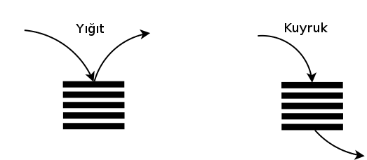
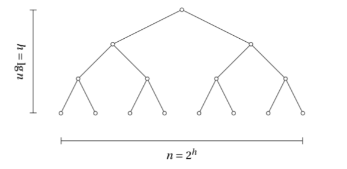
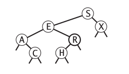

# Temel Algoritmalar, Veri Yapıları

Bilgisayar Bilimdeki (Computer Science) pek çok algoritmanın kullandığı
bazı temel yapılar var. Bu yapıları görelim. 

Sözlükler, Böleç Anahtarları (Hash Keys)

Elde anahtarlar ve değerlerden oluşan bir liste var, bize bir anahtar
verilince o anahtara tekabül eden değeri geri getirmek istiyoruz. Bu
anahtarları ve değerleri bildik düz listeye koyabiliriz, ama düz listeler
indis bazlı erişim sağlarlar, bu durumda arama yapmak gerekince listeyi
sürekli baştan sona kadar taramak gerekecektir. Hesapsal karmaşıklık
$O(n)$.

Daha iyi bir yöntem anahtardan dizin indisi üretmek, boylece dizin indisi
ile direk aradığımız elemana gidebiliriz. Eğer anahtarlar, mesela, meyve
isimleri ise "portakal'' anahtarını bir sayı indisine nasıl çeviririz?

Tüm harflerin sayısal karşılığını kullanabiliriz, ve bu sayıları bir
şekilde daha büyük bir sayıya çevirerek her anahtar değerinden bir sayısal
indis üretebiliriz. Bu indis değeri bir dizine direk erişim
sağlayacaktır. Not: Sayı değeri bazen dizinin nihai kapasitesinden daha
büyük bir değer döndürebilir, o zaman matematiksel modülo kullanarak (yani
bölümden arta kalan) indisin sürekli belli bir aralıkta kalmasını
sağlayabiliriz. 

Tabii bu durumda farklı anahtarlar aynı indisi değerine gidebilir (çarpışma
-collision- durumu, problemler bitmiyor (!)), o zaman çarpışma olan yere
bir alt liste ekleriz, arama o noktadan sonra kaba kuvvet ile devam eder.

Programlama dillerinin çoğunda böleç kabiliyeti vardır;

```python
print (hash('portakal'))
print (hash('armut'))
```

```text
1625896577505283192
7027255142208074575
```

Modülo uygulayalım, 

```python
print (hash('portakal') % 15) # dizin 15 buyuklugunde 
print (hash('armut') % 15)
```

```text
7
10
```

Yığıt (Stacks)

Bu yapı bir listedir, fakat özel bir tür listedir. Ona eklenen öğe en
tepeye / sona eklenir, yani "yığılmış'' olur, bir saman yığını gibi,
eklenen her şey en tepeye eklenir. Öğe alınması gerektiğinde de en son
eklenen öğe alınır, yani en tepedeki / sondaki öğe. Bu yaklaşıma
ilk-giren-son-çıkar (first-in-last-out, FILO) ismi de veriliyor. Python ile
düz listeler direk yığıt olarak kullanılabiliyor, ve üzerinde ekleme icin
`extend`, çıkarma için `pop` çağrıları yapılabiliyor. 

```python
a  = []
a.extend(["ddd"])
a.extend(["eddd"])
print (a)
print (a.pop())
print (a)
```

```text
['ddd', 'eddd']
eddd
['ddd']
```

Kuyruk (Queue)

Bu yapı da yine liste gibi, dizili öğeler var, ama eklenen öğe başa
eklenir, alınan öğe sondan alınır. Kuyruklara ilk-eklenen-ilk-çıkar
(first-in-first-out, FIFO) ismi veriliyor.

```python
from collections import deque
class Queue(deque):
    pull = deque.popleft
    push = deque.append

q = Queue([3,4,5,4])
print (q.pull())
q.push(44)
print (q.pull())
print (q)
```

```text
3
4
Queue([5, 4, 44])
```



Hem yığıt hem de kuyrukların farklı kodlama şekilleri görülebiliyor.
Üstteki örnekte basitlik amaçlı olarak liste bazlı bir kodlama gösterdik,
fakat bağlanmış liste (linked list) kullanan çok hızlı işleyen, etkili
kodlar da vardır. Bağlanmış listeler bilindiği gibi hafızada öğeler arası
göstergeç (pointer) kullanarak öğede öğeye çok hızlı şekilde
atlayabilirler, iki öğe arasına yeni öğe sokmak çok kolaydır,
vs. Bağlantılı öğe kullanınca, ayrıca, dizinlerde olduğu gibi illa önceden
belli bir büyüklükteki yeri ayırmak gerekmiyor.

Bağlanmış Listeler

Eğer bir listede başa, sona ya da araya öğe sokmak hızlı olsun istiyorsak
bağlantılı liste kullanabiliriz. Listede öğeler (node) vardır, ve her öge
kendinden sonra gelecek diğer öğeye bir referans tutmakla
yükümlüdür. Referans derken bir objeye olan referanstan bahsediyoruz;
Python gibi yorumlanan, dinamik, temiz diller arka planda neler olduğunu
biraz saklıyorlar aslında, fakat C, C++ gibi diller ile uğraşanlar
bilirler, bir referans, ya da göstergeç (pointer) bir hafıza adresidir. O
adresin gösterdiği bir başka obje vardır. Göstergecin hangi objeye işaret
ettiği rahatlıkla değiştirilebilir.

Alttaki kodda düğüm (node) sınıfını görüyoruz, ve bağlantılı liste bu
düğümleri tutan (daha doğrusu sadece en baştakini tutan) bir objeden
ibaret. Başa yeni bir eleman eklemek demek başlangıç referansı
`head`'i bu yeni düğüme doğru "göstertmek'' ile olur, aynı şekilde
yeni elemanın sonraki obje referansı `next` daha önceki baş elemana
doğru yönlendirilir. 

```python
class Node(object):
    def __init__(self, value, next=None):
        self.value = value
        self.next = next
    def __str__(self): return str(self.value)
        
class LinkedList(object):
    def __init__(self):
        self.head = None
  
    def _add(self, value):
        self.head = Node(value, self.head)
            
    def _printList(self):
        node = self.head
        while node:
            print (node.value,)
            node = node.next
        print 
            
    def _find(self, index):
        prev = None
        node = self.head
        i = 0
        while node and i < index:
            prev = node
            node = node.next
            i += 1
        return node, prev, i

    def _insert_middle(self, index, value):
        node, prev, i = self._find(index)
        tmp = Node(value, node)
        prev.next = tmp
        
    def _delete(self, prev, node):
        if not prev:
            self.head = node.next
        else:
            prev.next = node.next
    
    def deleteNode(self, index):
        node, prev, i = self._find(index)
        if index == i:
            self._delete(prev, node)
        else:
            print('Node with index {} not found'.format(index))

ll = LinkedList()
ll._add(37)
ll._add(99)
ll._add(12)
ll._printList()
node, prev, i = ll._find(1)
print (str(node), 'bulundu')
```

```text
12
99
37
99 bulundu
```


Şimdi yeni bir örnekte araya bir öğe sokmayı görelim. Ortalarda bir yerde
öğe sokmak için önce indis değerine göre eski eleman bulunur, bu öğeden
sonra eleman sokulacak, ve daha önce `head` ile yapılan ekleme
örneğinde olduğu gibi, bu eski elemanın göstergeci yeni objeye, yeni
objenin göstergeci eski objenin gösterdiği objeye yönlendirilecek.


```python
ll = LinkedList()
ll._add(99)
ll._add(12)
ll._insert_middle(1,37)
ll._printList()
```

```text
12
37
99
```

Aradan bir öğe silelim. Silmek için yine göstergeç cambazlığı; silinecek
öğeye işaret eden göstergeç silinecek öğenin gösterdiği objeye işaret
ettiriliyor, böylece silinecek objeye kimse işaret etmez hale
geliyor. Erişilemez hale gelen obje silinmiş demektir. 

Not: Bellek idaresi açısından hiç işaret edilmeyen objelere ne olur? Bu
objeler dinamik programlama dillerinde etrafta hala bir süre daha kalmaya
devam edebilirler, ne zaman dilin çöp toplayıcısı devreye girerse o zaman
silinirler. Yani bellekten gerçekten çıkartıldıkları an çöp toplama işlemi
sonrasıdır. C gibi dillerde bellekten silme işlemi programcı tarafından
tetiklenir, çöp toplayıcı yoktur. 


```python
ll = LinkedList()
ll._add(37)
ll._add(99)
ll._add(12)
ll._printList()
node, prev, i = ll._find(1)
ll._delete(prev, node)
ll._printList()
```

```text
12
99
37
12
37
```

Bağlantılı listelerin yığıt, kuyruk gibi yapıların kodlaması için ne kadar
faydalı olabileceği sürpriz değil; yığıt ya da kuyruk için hem baş hem
sondaki düğümlere referans tutulur, sona, başa ekleme, oradan obje alma
gibi işlemler biraz göstergeç cambazlığı ile çok hızlı bir şekilde kodlanabilir.

İki Yönlü Bağlantılı Liste

Üstteki örnek tek yönlü bağlantılı listeydi, iki yönlü referans tutmak ta
mümkün. 


Önce Genişliğine (Breadth-First) ve Önce Derinliğine (Depth-First) Arama

Elimizde alttaki gibi bir çizit olsun, 

```python
graph = {'A': set(['B', 'C']),
         'B': set(['A', 'D', 'E']),
         'C': set(['A', 'F']),
         'D': set(['B']),
         'E': set(['B', 'F']),
         'F': set(['C', 'E'])}
```


Arama için bir başlangıç düğümünü alıyoruz, onun komşularını, komşuların
komşularını ziyaret ede ede tüm çiziti ziyaret etmiş oluyoruz. Ama bu
ziyaret hangi sırada olmalı?

Bu sırayı belirlemek için bir yığıt kullanabiliriz. Yığıt kullanınca
aslında önce derinliğe türden bir arama kodlamış oluyoruz. Her ziyaret
öncesi bir düğümün komşularını alıp, onları yığıta koyuyoruz, sonra yığıtın
en üstündeki düğümü alıp onu ziyaret ediyoruz. Bu işlem aynı seviyedeki tüm
komşuları ziyaret etmeden sürekli komşunun komşusu, vs. aldığı için bu bir
derinliğe iniş kodlar. 

```python
import collections

def dfs(graph, start):
    visited, stack = collections.OrderedDict(), [start]
    while stack: # yigit bos ise bu ifade false olur
        vertex = stack.pop()
        # bu kontrol hizli olsun diye OrderedDict kullandik
        # boylece hem ziyaret sirasi hatirlanacak, hem de
        # dugum ziyaret edilip edilmedigi sorusu cok hizli cevaplanacak
        if vertex not in visited:
            visited[vertex] = ''
            stack.extend(graph[vertex])
    return visited
print (dfs(graph, 'A'))
```

```text
OrderedDict({'A': '', 'B': '', 'E': '', 'F': '', 'C': '', 'D': ''})
```

Özyineli formda da yazabiliriz, eğer her komşu için teker teker
`dfs`'in kendisini çağırırsak derinleme dalış yapmış oluruz, çünkü
komşu listesinde ilk elemanda özyineli çağrı yapınca o geri gelene kadar o
çağrı içindeyiz, o çağrı da bir komşu listesi alıp öğelerde özyineli çağrı
yapacak, böyle derinleme devam edecek... Tabii bu durumda gidilen yolu
hatırlamak için onu bir liste olarak sürekli bir sonraki özyineli çağrıya
geçeriz ve her çağrıdan da geriye döndürürüz.

```python
import collections
def dfs(graph,curr,path = collections.OrderedDict()):
    path[curr] = ''
    for edge in graph[curr]:
        if edge not in path:
            path = dfs(graph,edge,path)
    return path

print (dfs(graph,'A'))
```

```text
OrderedDict({'A': '', 'C': '', 'F': '', 'E': '', 'B': '', 'D': ''})
```

Şimdi diğer arama şekline, önce genişliğine aramaya gelelim. Bunu yapmak
için yığıt veri yapısı yerine kuyruk kullanmak yeterli. Bu durumda
komşuları kuyruğa koyduğumuz zaman o komşuların işlenmesi bitmeden sonraki
düğümlere geçilmeyecektir, çünkü kuyruğa ilk konan ilk önce işlenir, yani
komşuların kendisinin işlenmesi bitmeden onların alt çocuklarına sıra
gelmeyecektir. Bu, ziyareti seviye seviye işlem yapmaya zorlar.

```python
def bfs(graph, start):
    visited, queue = collections.OrderedDict(), Queue([start])
    while queue:
        vertex = queue.pull()
        if vertex not in visited:
            visited[vertex] = ''
            for x in graph[vertex]: queue.push(x)
    return visited
print (bfs(graph, 'A'))
```

```text
OrderedDict({'A': '', 'C': '', 'B': '', 'F': '', 'D': '', 'E': ''})
```

İkisel Arama Ağaçları (Binary Search Trees -BST-)

Bir BST şu özelliklere sahiptir: bir düğümün sadece iki tane alt düğümü
vardır, bu alt düğümlerden solda olanı üst düğümden her zaman küçük, sağda
olanı her zaman büyüktür. Ağaçta tekrarlanan öğe yoktur. Ağaç eğer dengeli
ise (yani birkaç düğümün altı sürekli dallanarak gittiği ama ötekilerin
aynı seviyede kaldığı durum yok ise) o zaman ağaç derinliği $n$ öğe için
$\log n$ olacaktır. 



Böyle bir yapının pek çok farklı şekildeki aramalar için ne kadar elverişli
olduğunu görmek zor olmaz; mesela "belli bir aralıktaki tüm düğümleri
getir'' algoritması hızlı işler [3, sf. 403]. Üst düğümden başlarız,
baktığımız düğümün eldeki değerden küçük ya da büyük olduğuna göre sola ya
da sağa gideriz, vs. Bir özellik daha; mesela alttaki gibi bir ağaca
bakalım (harfler arasında da küçüktür / büyüktür irdelemesi yapılabiliyor
tabii ki),



Şimdi bu ağacı üstten alta doğru "yassılaştırdığımızı'' düşünelim, bu bize
anahtarları sıralanmış bir düz yapı vermez mi? Evet. Yani bir ağaç
yapısının doğal bir sonucu olarak her zaman bize çok hızlı bir şekilde
sıralanmış bir liste verebilir. Üstelik ağaca ekleme, silme işlemleri de
hızlı olduğu için bu sıralanmışlık kalıcı olacaktır. Altta
`_printInorder` bu özelliği gösteriyor. 

```python
class Node:
    def __init__(self, val):
        self.l = None
        self.r = None
        self.v = val

class BST:
    def __init__(self):
        self.root = None
        
    def add(self, val):
        if(self.root == None):
            self.root = Node(val)
        else:
            self._add(val, self.root)

    def _add(self, val, node):
        if(val < node.v):
            if(node.l != None):
                self._add(val, node.l)
            else:
                node.l = Node(val)
        else:
            if(node.r != None):
                self._add(val, node.r)
            else:
                node.r = Node(val)

    def find(self, val):
        if(self.root != None):
            return self._find(val, self.root)
        else:
            return None

    def _find(self, val, node):
        if(val == node.v):
            return node
        elif(val < node.v and node.l != None):
            return self._find(val, node.l)
        elif(val > node.v and node.r != None):
            return self._find(val, node.r)

    def printInOrder(self):
        if(self.root != None):
            self._printInOrder(self.root)

    def _printInOrder(self, node):
        if(node != None):
            self._printInOrder(node.l)
            print (str(node.v) + ' ')
            self._printInOrder(node.r)

    def printPreOrder(self):
        if(self.root != None):
            self._printPreOrder(self.root)

    def _printPreOrder(self, node):
        if(node != None):
            print (str(node.v) + ' ')
            self._printPreOrder(node.l)
            self._printPreOrder(node.r)            
                        
    def printPostOrder(self):
        if(self.root != None):
            self._printPostOrder(self.root)

    def _printPostOrder(self, node):
        if(node != None):
            print (str(node.v) + ' ')
            self._printPostOrder(node.l)
            self._printPostOrder(node.r)
                        
    def closest(self, target):
        gap = float("inf")
        closest = float("inf")
        curr = self.root
        while curr:
            if abs(curr.v - target) < gap:
                gap = abs(curr.v - target)
                closest = curr
            if target == curr.v:
                break
            elif target < curr.v:
                curr = curr.l
            else:
                curr = curr.r
        return closest.v

bst = BST()
print ("Adding nodes 1 to 10 in the tree...")
for i in range(1, 11):
    bst.add(i)

print
print ("Searching for nodes 16 and 6")
f = bst.find(16)
if f: print (f.v)
f = bst.find(6)
if f: print (f.v)

print
print ("Printing preorder...")
bst.printInOrder()
```

```text
Adding nodes 1 to 10 in the tree...
Searching for nodes 16 and 6
6
Printing preorder...
1 
2 
3 
4 
5 
6 
7 
8 
9 
10 
```

En yakın öğe arama fonksiyonu `closest` ilginç; BST'de bir öğeyi tam
eşitlik üzerinden aramak zaten oldukca hızlı. Şimdi düğümler arasında aynı
gezinme tekniğini kullanarak istenen yaklaşık bir değere olan o gezilen
düğümlere "yakınlığı'' hesaplayıp, en yakın olanı sürekli akılda tutup iş
bittiğinde bu elemanı geri döndürmek bize en yakın öğeyi verecektir. 

Vektörler ve İkisel Arama (Binary Search)

Aslında ağaç üzerinde gördüğümüz sağa ya da sola gitme kavramı
genelleştirilerek bir dizin üzerinde arama yapmak için
kullanılabilir. Elimizde sıralanmış (bu önemli) bir dizin olduğunu
düşünelim. Şimdi eldeki bir test noktasının bu dizinde olup olmadığını
merak ediyoruz. Şöyle bir algoritma kullanabiliriz: dizinin tam ortasındaki
öğesine bakarız, eğer aranan eleman o ise, iş biter. Eğer değil ise ve
elimizdeki öğe bakılan orta noktadan küçük ise o orta noktanın solundaki
hiçbir öğeye artık bakmaya gerek yoktur. Sağ kısma geçeriz, ve aynı işlemi
tekrarlarız. 

```python
def binary_search(alist, item):
    first = 0
    last = len(alist)-1
    found = False

    while first<=last and not found:
        midpoint = (first + last)//2 # // tamsayi bolumu demek, 5//2=2
        if alist[midpoint] == item:
            found = True
        else:
            if item < alist[midpoint]:
                last = midpoint-1
            else:
                first = midpoint+1

    return found, midpoint

testlist = [0, 1, 2, 8, 13, 17, 19, 32, 42,]
print(binary_search(testlist, 3))
print(binary_search(testlist, 13))
print(binary_search(testlist, 20))
```

```text
(False, 3)
(True, 4)
(False, 7)
```

Yakın öğe bulmak benzer mantığı kullanır. 

Bakılan kısımlar sürekli yarıya bölündüğü için bakılan kısım çok hızlı bir
şekilde küçülecektir, bu işlem hızını arttırır. Karmaşıklık $O(\log
N)$. Lineer arama yapmaktan (kaba kuvvet) daha hızlı. 

Yarıya bölüp arama hakkında ilginç bir hikaye: bir projede bir arkadaşımın
üzerinde çalıştığı aşağı yukarı 1000 satırlık bir CSS dosyası vardı (CSS'i
web sayfaları ile uğraşanlar bilirler). Her nasılsa dosya bir şekilde
değişime uğramış, ve işleyen dosya artık işlemez hale gelmiş. Bu dosya
üzerinde kaynak kod deposu da kullanılmamış, yani değişimin ne olduğunu
depoya sorma şansı yok. CSS'in bir tarafı bozuk ama neresi?

Benim fikrim ikiye bölme tekniği ile hatayı bulmaktı; CSS'in bir yarısını
iptal edip diğer kısmını kullan, işliyorsa öteki kısımda devam et, aynı
şekilde onu yarıla, ta ki hata ortadan yokoluncaya kadar. Bu şekilde birkaç
deneme ile hatalı satırı bulduk. 

Öncelik Kuyruğu (Priority Queue)

Bu tür kuyruklarda öğe alma işlemi her zaman en küçük öğeyi verir. Bir öğe
eklediğimiz zaman o öğe büyüklüğüne göre kuyruk içindeki yerine otomatik
olarak sokulur. Öncelik kuyrukları arka planda ikisel ağaç (binary tree)
üzerinden kodlanırlar, en küçük öğeyi almak sabit, müthiş hızlıdır çünkü en
küçük öğe her zaman ağacın en tepesindeki düğümdedir. Ekleme de oldukca iyi
çalışır. Yani öncelik kuyrukları dışarıdan ikidebir "sırala'' komutu
verilmeden sürekli kendilerini sıralı halde tutan bir yapıdırlar. Bu
kuyruklar pek çok bilgisayar bilim algoritmasının demirbaşıdır.

```python
from heapq import heappush, heappop
from random import randrange

class pqueue():
    def __init__(self): self.data = []
    def push(self,x): heappush(self.data,x)
    def pull(self): return heappop(self.data)
    def __str__(self): return ''.join(str(self.data))

pq = pqueue()
# rasgele degerler
for i in range(10): pq.push(randrange(100))
print (pq)
print (pq.pull())
pq.push(100)
print (pq)
```

```text
[3, 8, 86, 50, 19, 91, 97, 90, 62, 70]
3
[8, 19, 86, 50, 70, 91, 97, 90, 62, 100]
```

Biraz daha kapsamlı bir kod `pqdict` paketinde, bu önemsel kuyruğa anahtar /
değerler veriliyor, anahtar değerleri mesela araba modelleri, önem ise fiyatları
olabilir, ve değerler çekildiğinde değeri en az (önemi en fazla) olan değer
çekilecektir. Ayrıca bu kuyruğu bir döngüyle "gezmek'' kuyruktan değerlerin
çekilmesini de sağlıyor. Kuyruğun iç kodlamasında kullandığı temel yapı ikisel
yığın (binary heap) adlı bir yapıdır.

```python
from pqdict import pqdict
Q = pqdict() 
Q['toyota'] = 4
Q['mercedes'] = 10
Q['bmw'] = 6
for c in Q: print (c)
```

```text
toyota
mercedes
bmw
```

Bir ilginç özellik daha: bir döngü içinde değilsek `[]`  operatörü hem
öncelik değerine bakılmasını hem de o değerin, anahtar kuyruktan
çekilmeden, değiştirilebilmesini sağlıyor.

```python
Q['toyota'] = 4
Q['mercedes'] = 10
Q['bmw'] = 6
print (len(Q))
Q['bmw'] = 1
print ('hala', len(Q))
for c in Q: print (c)
```

```text
3
hala 3
bmw
mercedes
toyota
```

Silmeden bakabilmek ve güncelleyebilmek önemli bir özellik (Java karşılığı
`PG.java` dosyasında).

Bellek Kullanımı

Bitirmeden önce bellek kullanımı hakkında birkaç paragraf
yazalım. Algoritmalarımız için veri yapısı seçerken o veri yapısının
belleği nasıl idare ettiğini bilmek iyi olur. Mesela sayı indisli bir dizin
/ liste kullanıyoruz, dizinlere indis bazlı erişim çok hızlıdır, burası
güzel. Fakat dizinin sürekli büyümesi gerekiyorsa bu büyüme arka planda
nasıl idare ediliyor? Bazı kodlamalar vardır ki dizinleri parça parça
büyütür, yani 10'dan 20'ye büyümek gerekiyorsa 20 öğelik yeni yer ayrılır,
ve 10 öğe yeni listeye kopyalanır. O zaman parçalar küçük ise bu kopyalama
işleminde sırasında zaman kaybı olabilir. Eğer başa, sona sürekli ekleme
yapıldığı dinamik bir durum var ise belki bağlantılı liste kullanmak daha
iyidir.


Kaynaklar

[1] Heatland, *Python Algorithms*

[2] Wahl, *Algorithms in Python*

[3] Sedgewick, *Algorihms, 4th Edition*


