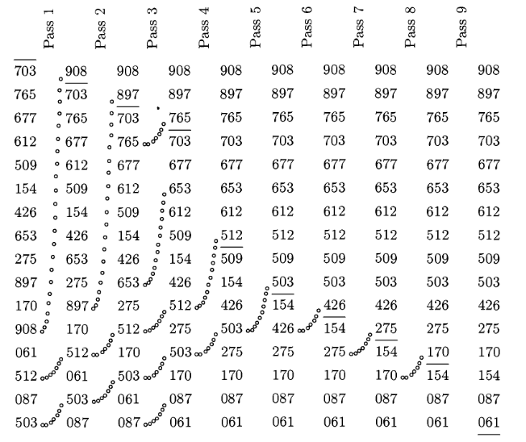
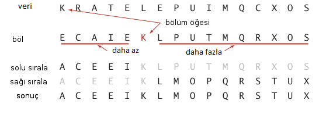

# Sıralama (Sorting)

Kabarcık Sıralaması (Bubblesort)

Kabarcık Sıralaması (KS) öğe değiştirerek sıralama yapan bir algoritma. Yer
değiştirerek sıralamanın en kolay yolu baştan başlayarak bir dizin içindeki iki
öğeyi karşılaştırmak, ve eğer soldaki öğe sağdakinden büyük ise iki öğenin
yerini değiştirmek. $A$ dizini içinde $A_1,A_2,..,A_n$ öğeleri için $A_1,A_2$
ile başlarız, sonra $A_2,A_3$ diye gideriz, böyle devam eder. Bu işlem sırasında
tüm dizindeki büyük öğeler sağda toparlanmaya başlar, hatta en büyük öğe en sağa
gidip $A_n$ olacaktır. Bu işlemi ardı ardına tekrarlamak (ikinci sefer ilk $n-1$
öğe üzerinde, sonra $n-2$, vs) dizinin tamamen sıralanmasını sağlayacaktır.

Anlatım amaçlı olarak $A_1$'i en altta $A_n$'i en üstte olacak şekilde
gösterelim,



Algoritma ismindeki "kabarcık'' ismi büyük değerlerin sanki su içindeki bir
hava kabarcığı gibi üste doğru çıkmalarından geliyor.

```python
def bubble_sort(l):
    last = len(l)-1  
    for passes_left in range(len(l)-1, 0, -1):
        if passes_left > last: continue # atla
        for index in range(passes_left):
            if l[index] < l[index + 1]:
               # hucredeki degerlerin yerini degistir
               l[index], l[index + 1] = l[index + 1], l[index]
               # for dongusu bittiginde en son degisim yapilan indis
               # alttaki deger icinde olacak, bu indisten yukari cikmaya
               # gerek yok, onun ustunu siralanmis kabul ederiz
               last = index        
    return l

arr = [703, 765, 677, 612, 509, 154, 426, 653, 275, 897, \
       170, 908, 61, 512, 87, 503]

print (bubble_sort(arr))
```

```
[908, 897, 765, 703, 677, 653, 612, 512, 509, 503, 426, 275, 170, 154, 87, 61]
```

KS en kötü ihtimalde dizin üzerinde o dizin sayısı kadar geçiş (pass)
yapar. Fakat her geçiş bittiğinde en son değişimi yapılan en üstteki öğeyi bir
sınır kabul edebiliriz, ve onun üstündekilerin sıralamasının tamamlanmış
olduğunu kabul edebiliriz, bu bize performans açısından fayda sağlar. Bu bilgiyi
sonraki geçişte kullanabiliriz, en son değişimi yapılmış en üst indis yukarısına
sonraki geçişte gitmeye gerek yoktur. Algoritmik olarak bu faraziye doğrudur,
çünkü en üstteki değişim sınır noktası olmasa, kabarcık o geçiş sırasında yukarı
çıkmaya devam ederdi.  Etmediğine göre o geçişteki en üst değişim o demektir.

KS'nin hesapsal çetrefilliği $O(N^2)$.

Quicksort

En ünlü ve hızlı işleyen sıralama algoritması hızlı sıralama anlamına gelen
quicksort. Quicksort böl-ve-ele-geçir (divide-and-conquer) usulü sıralama
yöntemlerinden biridir. Bir dizini alır, ve iki parçaya (partition) böler,
her parçayı ayrı ayrı sıralar. Peki alt parçaların sıralaması nasıl
yapılır? Quicksort'un kendisiyle! Yani bir özyineli çağrı var.

Bu noktada pivot kavramını anlamak lazım: pivot seçilen bir dizi öğesi sadece;
her geçişte eldeki dizinin ilk öğesi olarak seçilebilir; sonra iki parçayı
yaratırken pivottan az ve fazla olan değerler olarak parçalar
yaratılır. Ardından her parça üzerinde o parçayı sıralamak için özyineli çağrı
yapılır, her iki özyineden geri döndükten sonra ve bir üst seviyeye geri
vermeden önce "az olan değerler + pivot + fazla olan değerler'' olarak tüm
parçaları birleştiriyoruz. Her alt özyineli çağrının kendi işini yaptığını
tümevarımsal olarak biliyoruz, o zaman birleştirme de doğru olduğu için en
tepede çağrıyı başlatan her şey bittikten sonra elinde tamamen sıralanmış bir
dizin bulacaktır.

Peki her iki parça üzerindeki özyineli çağrının kendi işini yaptığından nasıl
emin oluruz? Özyineli bir şekilde daha küçük, daha küçük ikili parçalara gide
gide en sonra tekil öğeler seviyesine ineriz, ve bu seviyede pozisyonlandırma
artık sıralamanın ta kendisidir, ardından özyineli çağrılar geri sarılırken
artık dizin sıralanmış olacaktır.



```python
def partition(seq):
    # pivot'u bul ve ana dizinden cikart
    pivot, seq = seq[0], seq[1:] 
    # pivot'tan tum kucuk ogeler
    lo = [x for x in seq if x <= pivot]
    # pivot'tan tum buyuk ogeler
    hi = [x for x in seq if x > pivot]
    return lo, pivot, hi 

def quicksort(seq):
    if len(seq) <= 1: return seq 
    lo, pivot, hi = partition(seq)
    # lo ve hi parcalarinin ayri ayri sirala, siralanmis
    # kucuk ogeler + ortada pivot + siralanmis buyuk ogeler
    # olacak sekilde birlesimi geri dondur
    return quicksort(lo) + [pivot] + quicksort(hi) 
    
array = [97, 200, 100, 101, 211, 107]
res = quicksort(array)
print (res)
letters = list('KRATELEPUIMQCXOS')
res = quicksort(letters)
print (res)
```

```
[97, 100, 101, 107, 200, 211]
['A', 'C', 'E', 'E', 'I', 'K', 'L', 'M', 'O', 'P', 'Q', 'R', 'S', 'T', 'U', 'X']
```

HS'nin hesapsal çetrefilliği $N\log(N)$. 

Kaynaklar

[1] Sedgewick, *Algorithms, 4th Edition*

[2] Knuth, *The Art of Computer Programming, Volume 3, 2nd Edition*

[3] Heatland, *Python Algorithms*


