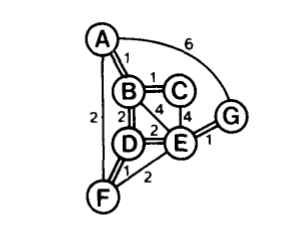
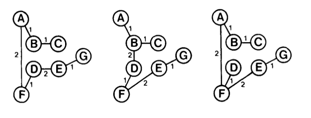
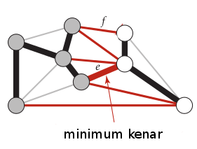
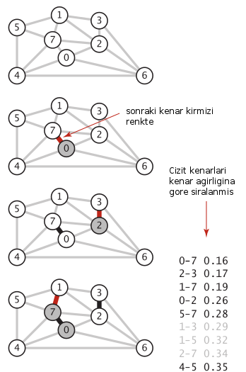
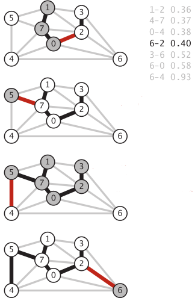

# Minimum Kapsamlı Ağaç (Minimum Spanning Tree -MST-)

MST algoritması kenar ağırlıklarına (weights) sahip olan bir çizit (graph)
yapısı içinde minimal ve kapsayan ağacı (MST) bulan algoritmaya verilen
isimdir. Mesela alttaki çizit içinde



MST öyle bir bağlantı yapısıdır ki baştan sona, herhangi bir noktadan
(node) bir diğerine geçiş yapılabilsin, ve bu tüm yolların toplamı en
minimal olsun. Dikkat, herhangi bir noktadan diğerine giden yol en az olsun
demiyoruz, bu durumda problem en kısa yol (shortest path) problemi
olurdu, ki bu problemi *Dinamik Programlama* yazısında gördük. Burada
göreceğimiz kapsayan ağacın *toplamının* minimal olmasıdır. 

Kapsayan ağaç (spanning tree) kavramını tanımlamak gerekirse, bir çizitin
kapsayan ağacı orijinal çizitin tüm noktalarına sahip olmalıdır, ağaç
içinde hiçbir döngü (cycle) olmamalıdır. Döngü derken bir noktadan diğerine
atlaya atlaya giderken bizi dönüp tekrar aynı yere getirebilecek türden
"kapalı devre'' tür bir döngüden bahsediyoruz - bu mümkün
olmamalıdır. Ayrıca çizit bağlantılı olmalıdır, yani bir kısmı diğer
kısmından kopuk bir çizit üzerinde MST bulunamaz. 

Minimum kapsayıcı ağaç ise bu tür pek çok alternatif ağaçların içinde en az
ağırlıklı olanıdır. Not, bir çizitin MST çözümü özgün (unique) olmayabilir, aynı
ağırlıkta birden fazla değişik ağaç mümkündür. Mesela üstteki çizit için mümkün
MST'ler altta görülüyor,



Kontrol edilebilir, üstteki her ağacın kenar toplamı 8'dır. Bu ağaçların
her biri bir MST olarak kabul edilebilir.

Uygulama bağlamında MST bulma algoritmasının ne kadar kullanışlı olacağı
görülüyor herhalde; mesela elektrik hatları, telefon iletişim hatları
tasarlarken MST kullanılabilir, toplam bağlantısı en az olan bir ağ yapısı
her iki durumda da kullanışlı olur. Biyolojik, kimyasal ağların analizinde
bile MST kullanılmaktadır.

Ağaçların Özellikleri (Properties of Trees)

Başlamadan önce bir ağacı ağaç yapan iki önemli özelliği belirtelim

1) Tanım itibariyle ağaç olan bir şeye, arasında bağlantı olmayan iki
noktayı birleştiren bir kenar koyarsak bu ağaçta bir döngü yaratmış
oluruz.

2) Elde olan bir ağacın herhangi bir kenarını çıkartırsak bu ağacı
"kopartmış'' oluruz, birbiriyle bağlantısız iki alt-ağaç ortaya çıkar.


Resimde her iki durumu görüyoruz. Bu iki özellik çok önemli, çünkü onları
MST'lerin çok temel özelliklerini ispatlamak için kullanacağız. Ondan önce
bazı tanımlar,

Tanım

Kesik (cut): Bir çizit üzerindeki yapılan kesik, o çiziti birbiriyle
alakasız, bağlantısız iki parçaya / kümeye böler. *Not*: Bir kesik
birden fazla kenarın üzerinden geçebilir / kapsayabilir, çünkü bir çiziti
tamamen ikiye ayırmaktan bahsediyoruz. Bir ağaçtan bahsediyor olsaydık,
yukarıda belirttiğimiz gibi, tek bir kenarı kesmek yeterli olurdu.

Birleştiren kenar (crossing edge): birbirinden bağlantısız iki kümedeki
herhangi bir noktayı diğer kümedeki herhangi bir diğer noktayla birleştiren
bir kenardır.

Önerme (Proposition)

Herhangi bir çiziti alalım, ve bu çizitteki bir kesik içindeki (yani
kopardığı tüm kenarlar) içindeki minimum birleştiren kenara bakalım. Bu
kenar o çizitin MST'sinde *kesinlikle* olmalıdır.

İspat

Bu ispat tersini yanlışlama (proof by contradiction) yöntemini
kullanacak. Diyelim ki bir kesik var, ve o kesikteki $e$ minimum
birleştiren kenar. Bu çizitin MST'si $T$ olsun. Şimdi $e$'nin $T$'nin
içinde olmadığı durumu düşünelim (yani önermenin dediğinin tersi), ve
diyelim ki şimdi $e$'yi alıp $T$'ye ekliyoruz. Yeni bir çizit ortaya
çıkardı, fakat daha önce dediğimiz gibi, $T$'ye bir kenar eklemek ona aynı
zamanda bir döngü eklemek demektir, ki bu döngünün içinde en az bir diğer
kenar $f$ olacaktır (çünkü $e$ MST'de olmadığına göre orada başka bir şey
var), ki bu $f$, $e$'den büyüktür. Fakat o zaman $f$'yi kesip onun yerine
daha az ağırlıkta olan $e$'yi ekleyince MST'yi, hem de daha az ağırlıkla
elde etmiş olmaz mıydık? Evet. Demek ki $e$'nin MST içinde olmaması
imkansızdır çünkü MST tanım itibariyle en minimal ağırlığa sahip olmalıdır.

Alttaki resimde gri ve beyaz ile gösterilen ayrı kümelerdeki noktaları bir
kesik ile ayrılmışlar ve bu kümelerin arasındaki birleştiren kenarlar
kırmızı ile gösteriliyor. Burada $e$ ile gösterilen kenar MST içinde
olmalıdır. 



Üstteki kavramlar Kruskal'ın MST bulan algoritmasının temelini
oluşturmaktadır (bu algoritmaya kısaca Kruskal diyeceğiz). Kruskal (ilk
başta) birbirinden bağımsız ağaçları yavaş yavaş yaratır, onları
büyütür. Aynı anda sürekli o ağaçları minimal bir kenar ile birleştirip
onları daha büyük bir ağaç yapma fırsatına bakar. 

Ufak ufak ağaçlar üstteki durumda gri ve beyaz noktaları kapsayan ağaçlar
gibi görülebilir, bunlar çizitin farklı bölgelerinde ayrı ayrı
büyürler. Eğer bu ayrı ayrı bölgelerde, onlara ait MST'ler
oluşturabilmişsek, Onları minimal şekilde birleştirmek (üstte $e$ ile) bize
daha büyük bir MST sağlar. 

Kruskal kenarları teker teker işler, önce onları ağırlıklarına göre
sıralar, ve en küçük kenarları önce alır. Bu yüzden ağaçları bağlanayan
"birleştiren kenarın'' minimal kalması, ve önce alınması da sağlanır.

Birleşim-Buluş (Union-Find)

Kruskal'ın kodlama bağlamında önemli bir püf noktası, sırayla bakılan bir
kenarın mevcut alt-ağaçlardan birine eklenme durumunda döngü oluşturup
oluşturmadığını hızlı bir şekilde anlayabilmesidir. Bunun için şu diğer
soruyu cevaplamak yeterlidir: bir kenara baktığımızda, bu kenarın iki
ucundaki iki noktayı alırız, ve bu iki noktanın herhangi bir alt-ağaç
içinde, yani aynı alt-ağaç içinde, olup olmadığına bakarız (hatırlarsak pek
çok alt-ağaç olabiliyor). Eğer bu iki nokta herhangi bir alt-ağaç içinde
bulunursa, bu kenarı çöpe atabiliriz, çünkü bu noktalar başka bir şekilde
bir alt-MST oluşturmuştur, ve bu alt-MST optimaldir (bkz üstteki ispat).

"İki noktanın aynı alt ağaç içinde olup olmadığını anlamak'' ise şu
alt-ağaçların sürekli bir "temsili noktaya'' işaret etmesiyle
halledilebilir (bu işaret, kenarlardan farklı). Eğer iki nokta, aynı,
temsili noktaya işaret ediyorsa, onlar aynı ağaç içindedir, vep dolaylı
olarak bu demektir ki bu noktalar bir şekilde "bağlanmıştırlar'' çünkü her
alt-ağaç aynı zamanda ufak bir MST'dir. Bu durumda yeni kenarı eklemek
tanım itibariyle bir döngü oluşturur, ve gereksizdir. Eğer noktalar farklı
ağaçlarda iseler, bu ağaçları birleştirmek iki temsili noktadan birinin bir
diğerine işaret etmesiyle halolabilir. Evet birleştirme sonrası bazı üyeler
yeni temsili noktaya işaret etmiyor olabilirler, bu durum, noktadan noktaya
atlanıp temsili noktaya erişmek ile halolur. Bu arada, arama sırasında,
yeni temsili noktaya olan işaretler değiştirilir, ki bu "düzeltme'' işlemi
yol sıkıştırma (path compression) olarak anılıyor.

Alttaki kod tüm bu numaraları kullanıyor. Örnek olarak yazının başında
verilen çiziti kodladık ve MST'sini bulduk. Çizit formatı iki yönlü
kenar bilgisi gerektirmez, iki nokta arasındaki geçişi bir kere belirtmek
yeterlidir. 

```python
G1 = {
  'a': {'b':1, 'f':2, 'g': 6},
  'b': {'c':1},
  'c': set(),
  'd': {'f':1, 'e':2},
  'e': {'g':1},
  'f': set(),
  'g': set()
}
```

```python
def find(C, u):
    if C[u] != u:
        C[u] = find(C, C[u])                    # Path compression
    return C[u]

def union(C, R, u, v):
    u, v = find(C, u), find(C, v)
    if R[u] > R[v]:                             # Union by rank
        C[v] = u
    else:
        C[u] = v
    if R[u] == R[v]:                            # A tie: Move v up a level
        R[v] += 1

def kruskal(G):
    E = [(G[u][v],u,v) for u in G for v in G[u]]
    T = set()
    C, R = {u:u for u in G}, {u:0 for u in G}   # Comp. reps and ranks
    print (list(sorted(E)))
    for _, u, v in sorted(E):
        if find(C, u) != find(C, v):
            T.add((u, v))
            print (u, v)
            union(C, R, u, v)
    return T

mst = list(kruskal(G1))
print ('MST', mst)
```

```
[(1, 'a', 'b'), (1, 'b', 'c'), (1, 'd', 'f'), (1, 'e', 'g'), (2, 'a', 'f'),
 (2, 'd', 'e'), (6, 'a', 'g')]
('a', 'b')
('b', 'c')
('d', 'f')
('e', 'g')
('a', 'f')
('d', 'e')
MST [('d', 'e'), ('e', 'g'), ('d', 'f'), ('b', 'c'), ('a', 'f'), ('a', 'b')]
```

Bu işleyiş (yine başta gösterdiğimiz) alternatif MST'lerden birincisini
buldu (`a-f` bağlı, `e-f` bağlı değil). Güzel! Kruskal'ın işleyiş
hızı $O(E \log E)$ seviyesindedir, $E$ kenar sayısıdır. Bu çok iyi bir
performanstır, bu performansın mesela $O(N^2)$'den farkını göstermek için
alttaki hesaba bakalım, eğer 100,000 tane kenar olsaydı,

```python
e = 100 * 1000
print ('n^2', e**2)
print ('log', np.log(e))
print ('kruskal', e*np.log(e))
```

```
n^2 10000000000
log 11.512925465
kruskal 1151292.5465
```

Kruskal 1 milyon kusur operasyona orantılı bir sonuç verirdi, kıyasla
$O(N^2)$ 10 milyar operasyon ortaya çıkartıyor! 

Bir diğer örnek: Altta MST'nin adım adım oluşturulmasını da
göreceğiz. Kırmızı ile işaretlenen kenar o adımda seçilen kenarı
gösteriyor, siyah olanlar mevcut MST(lerde) olan kenarları.





```python
G2 = {
  0: {7: 0.16, 4: 0.38, 2: 0.26, 6: 0.58},
  1: {5: 0.32, 2: 0.36, 3: 0.29, 7: 0.19},
  2: {3: 0.17, 6: 0.40, 7: 0.34},
  3: {6: 0.52},
  4: {5: 0.35, 7: 0.37, 6: 0.93},
  5: {7: 0.28},
  6: set(),
  7: set()
} 

mst = list(kruskal(G2))
print ('MST', mst)
```

```
[(0.16, 0, 7), (0.17, 2, 3), (0.19, 1, 7), (0.26, 0, 2), (0.28, 5, 7), (0.29, 1, 3), (0.32, 1, 5), (0.34, 2, 7), (0.35, 4, 5), (0.36, 1, 2), (0.37, 4, 7), (0.38, 0, 4), (0.4, 2, 6), (0.52, 3, 6), (0.58, 0, 6), (0.93, 4, 6)]
(0, 7)
(2, 3)
(1, 7)
(0, 2)
(5, 7)
(4, 5)
(2, 6)
MST [(2, 6), (4, 5), (5, 7), (0, 7), (2, 3), (1, 7), (0, 2)]
```

Şekilde `5-7`'yi birbirine bağlayan 6. adım sonrası `1-3`'un
çözüme dahil edilmediğine dikkat edelim. Bu noktada 1 ve 3 düğümleri artık
aynı ağaç içindedirler, ve bu kenarı eklemek bir döngü oluşturacaktır. 

Kruskal algoritması, ve ona benzer Prim, ya da "bir sonraki adımda hep en
yakını işleyen'' algoritmalar açgözlü (greedy) algoritmalar olarak
bilinirler. Mesela *Dinamik Programlama* yazısında gördüğümüz üzere,
açgözlü yöntem en kısa yolu vermeyebiliyordu. MST durumunda açgözlülük
faydalıdır, açgözlülüğün faydalı olduğu mutlu örneklerden biridir diyelim! 

Not: Bazılarına tanıdık gelebilecek bilgisayar bilimin demirbaş
problemlerinden Seyahat Eden Satış Görevlisi (Traveling Salesman Problemi
-TSP-) NP-Tam olarak bilinir. MST, ki çok hızlı işleyen bir algoritma,
yaklaşıksal olarak TSP'yi çözmekte kullanılabilmektedir. 

Kaynaklar

[1] Sedgewick, R. *Algorithms*, sf. 409

[2] Sedgewick, R. *Algorithms, 4th Edition*, sf. 624

[3] Heatland, *Python Algorithms*


