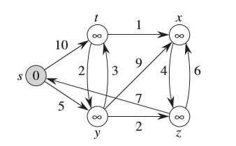

# Dijkstra Algoritması ile En Kısa Yol

Elimizde alttaki gibi bir ağ yapısı var; bu yapı belli noktalar arasındaki
yolları, ya da elektrik devrelerindeki bağlantıları, ya da şehirler arası
nehirleri temsil ediyor olabilir. Ağ yapısında yolların ne kadar uzak, ya
da "pahalı'' olduğu da verilmiş, ve bizim merak ettiğimiz bir noktadan
diğerine diğerine en kısa şekilde nasıl gidileceği.



Üstteki resimdeki örnekte başlangıç noktası s'den bitiş noktası x'e diyelim
en kısa yol hangisi? Acaba s-y-z-x gidişi mi? Bu yolun toplamı 5+2+6=13
ediyor. Daha kısa yol var mıdır?

Dijkstra (telafuz *Daykstra*) algoritması bu sorunun cevabını veriyor
[1, sf. 659]. Algoritmanın işleyiş şekli şöyledir; elde bir öncelik kuyruğu
vardır, bakılacak olan yollar önce oraya konulur. Her noktanın, düğümün
sayısal ağırlığı onun başlangıca olan uzaklığıdır. Dikkat: onun bağlı
olduğu komşu düğümler değil, *başlangıca* olan uzaklığı. Algoritma işleyişi
sırasında bu ağırlığı değiştirebilir, eğer bir düğüme başlangıçtan daha
kısa bir yol bulunursa bu ağırlıkta değişim yapılacaktır, bu işleme
gevşetme (relaxing) ismi veriliyor.

Neyse; müstakbel düğümler kuyruğa konur. İlk başta kuyrukta sadece
başlangıç noktası s olacaktır, o kuyruktan çekilir, komşuları geri
konur. Komşuların ağırlığı tabii ki s ile komşular arasındaki
mesafedir. Öncelik kuyruğu ağırlık değerine göre otomatik olarak sıralama
yaptığı için bir düğüm çekildiğine en kısa yollu olan gelir. Kuyruktan
çekilen her düğümün ağırlığı artık o düğüme olan en kısa yol olarak kabul
edilir (niye - sebebine birazdan geleceğiz). Algoritma aynı şekilde devam
eder, çekilen düğümün komşuları alınıp kuyruğa konur, böyle gider.

Bazen aynı düğüme farklı yollardan erişmek mümkündür, bu durumda farklı
yolan erişilen düğümün ağırlığı daha "gevşetilebilir'', mesela 10 iken 8
haline getirilebilir (örnekte t düğümünde bu oluyor), tabii ki bu durumda
düğümün kuyruktaki yeri de değişebilecekir, belki bir başka düğümün önüne
geçer.

```python
from pqdict import pqdict

def dijkstra(G,basla,bitis):
    # nihai uzakliklarin sozlugu
    D = {}  
    # ebeveyn dugumlerin sozlugu
    P = {}  
    # dugumlerin baslangica olan tahmini uzakliginin kuyrugu
    Q = pqdict() 

    Q[basla] = 0

    while len(Q)>0:
       (v,vv) = Q.popitem()
       D[v] = vv
       for w in G[v]:
          vwLength = D[v] + G[v][w]
          if w in D:
              if vwLength < D[w]:
                  raise ValueError("sonuca giden daha iyi yol bulundu")
          elif w not in Q or vwLength < Q[w]:
              Q[w] = vwLength
              P[w] = v
    path = []
    while 1:
       path.append(bitis)
       if bitis == basla: break
       bitis = P[bitis]
    path.reverse()
    return path

G = {'s':{'t':10, 'y':5}, 't':{'x':1, 'z':2}, 'x':{'z':4}, \
     'y':{'t':3, 'x':9, 'z':2}, 'z':{'s':7, 'x':6}}
path = dijkstra(G, 's', 'x')
print (path)
```

```
['s', 'y', 't', 'x']
```

Kod en kısa yolu buldu. Bu algoritmanın hesaplama karmaşıklığı $m$ kenar
$n$ düğüm içeren bir çizit için $O((m+n) \log n)$'dir. Bu karmaşıklık hiç
fena değil. 


Şekillerde görülen düğümler siyah renkli olunca  kuyruktan çekilmiş
demektir, ve onlara olan en kısa yol hesaplanmıştır. 

Peki Dijkstra algoritmasının doğruluğundan nasıl emin olacağız?
Dijkstra'nın işleyişi sırasında sürekli iki tane kümeyi idare ettiğini
söyleyebiliriz. Bir küme öncelik kuyruğu içindeki müstakbel, diğeri ise ona
olan başlangıç uzaklığının artık bilindiği bitmiş düğümlerdir. İddia şu ki
öncelik kuyruğundan (en tepedeki, en yakın, ağırlığı en az) çektiğimiz her
düğüm ikinci kümeye transfer edilebilir, yani ona olan uzaklıktan
eminiz. Neden? Şimdi o düğüme gidebilecek daha kısa bir yol olduğunu farz
edelim. Fakat elimizdeki düğüme erişilirken diğer komşular değil ona
gelindi, çünkü ona gelen yol daha kısaydı, bu demektir ki komşular
üzerinden tur atarak elimizeki düğüme erişmek demek tanım itibariyle yolu
uzatmak demektir. Bu durumda kuyruktan çekilen düğümün ağırlığının ona
giden en kısa yol olduğuna güvenebiliriz. İspat tamamlandı.

Alttaki alternatif kod [2]'yi temel alıyor.

```python
from heapq import heappush, heappop

inf = float('inf')
def relax(W, u, v, D, P):
    d = D.get(u,inf) + W[u][v]                  # Muhtemel kisayol tahmini
    if d < D.get(v,inf):                        # Bu hakikaten bir kisa yol mu?
        D[v], P[v] = d, u                       # Tahmini ve ebeveyni guncelle
        return True                             # Degisim oldu

def dijkstra2(G, s, e):
    D, P, Q, S = {s:0}, {}, [(0,s)], set()      # Tahmin, agac, kuyruk, ziyaret?
    while Q:                                    # Hala islenmemis dugum?
        _, u = heappop(Q)                       # En dusuk tahminli dugum
        if u in S: continue                     # Coktan ziyaret edildi? Atla
        S.add(u)                                # Simdi ziyaret ettik
        for v in G[u]:                          # Tum komsularina bak
            relax(G, u, v, D, P)                # Disari cikan baglantiyi gevset
            heappush(Q, (D[v], v))              # Tahminiyle beraber kuyruga ekle
    path = []
    while 1:
        path.append(e)
        if e == s: break
        e = P[e]
    path.reverse()
    return path

path = dijkstra2(G, 's','x')
print (path)
```

```
['s', 'y', 't', 'x']
```

Not: Aslında Dijkstra'nın ana hesabı bir düğüme olan başlangıçtan olan
uzaklıktır. Fakat çoğunlukla net bir "kısa yol'', x,t,z,vs.. şeklinde
gerektiğinden algoritma işleyişi sırasında her düğüme giden bir önceki
düğüme geriye doğru bir işaret konur, bu ebeveyn düğümü eldeki düğüme
nereden gelindiğini hatırlamamızı sağlar. Sonra algoritma bitince bu yolu
geriye doğru takip ederek en kısa yolu buluruz.

Not: Eğer elimizdeki çizit yapısı öyle ki iki düğüm arasında iki yönlü
gidiş te mümkün ise algoritma değişir mi? Bu durumda algoritmaya dokunmadan
çizit ağ yapısında ufak bir değişiklik yeterli; a,b arasında bağlantı varsa
aynı şekilde bir b,a bağlantısı da ekleriz. 

Java kodu `Dijkstra.java` dosyasında bulunabilir.

Kaynaklar

[1] Stein, *Introduction to Algorithms*

[2] Heatland, *Python Algorithms*


