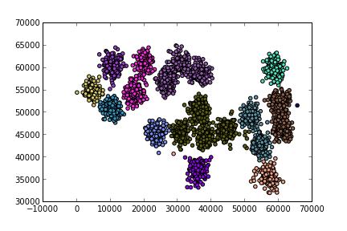

### Felzenszwalb Clustering

Using a distance matrix containing pairwise distances (which could use
any measure) Felzenszwalb Clustering will print cluster membership per
datapoint. 

The code is based on Felzenszwalb and Huttenlocher paper and shared
C++ code. I simply took out the clustering code from inside the
segmentation, so this project does not have any references to image
processing, it simply does clustering with any given distance matrix.

http://cs.brown.edu/~pff/segment/

The C++ version reads sparse matrices from mtx (money market
format). Python version can be used as any clustering algorithm found
in `scikit-learn`, through constructor and `fit` function.

The main advantage of the algorithm is its ability to use any distance
metric, its accuracy (as known from Felzenszwalb image segmentation),
its speed, and determining the number of clusters on its own. The
algorithm which is at the root of Felzenszwalb clustering is Minimum
Spanning Tree which is known to have O(E log E) complexity where E is
the number of edges in a graph. In comparison, other clustering
methods presented here,

http://scikit-learn.org/stable/modules/clustering.html

such as Affinity Propagation, or Spectral Clustering do not enjoy the
same level of performance and cannot handle large datasets.


## Building

`cd felzclust`

`make`

For Python version simple import is sufficient.

## Running

See `doc/test.pdf` or `felzclust/test.py` for details. The distance
matrix should be in sparse form, in mtx format. A simple use case

`felzclust/felzclust felzclust/simple.mtx 1.0 1`

You will see output

```
point;cluster
0;2
1;2
2;2
3;4
4;4
```

A bigger example




## Pure Python

Pure Python version of the code can be found under `felz.py` and `test_felz.py`

## LICENSE

The software is licensed under GPL v2. See COPYING for details.
