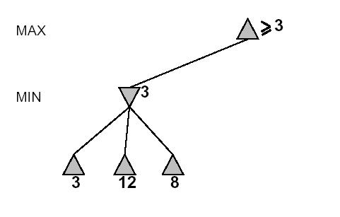

# Yapay Zeka ile Problem Çözümü

Zeka nedir? Bu kavramın tanımı uzun süre filozofları, matematikçileri ve en
sonunda yazılım bilim adamlarını uğraştırdı.

Yapay Zeka olgusu, uzun bir değişim ve ne olduğunu tam bilmeyen bir
süreçten geçerek bu günlere geldi. En sonunda üzerinde mutabakat kurulan
tanım, yapay zekayı genel ve temel olarak iki kategoriye ayırdı.

Genel zeka altında, insanların bütün zihni güçlerini ve özelliklerini
birgün bilgisayar ile kopyalama, yapabilme çabası var. Tabii ki bu arayış
uzun bir zaman alacak.

Öteki dal temel zeka adı altında "sadece belli problemler için özel"
algoritmalar yaratarak, problem çözebilen bir zeka türü peşinde
koşmaktadır. Yani zeki bir vekil yaratıp onu problemin üzerine atmak, ya da
ufak bir temsilcimizi, bize benzeyen ufak bir kısmımızı yaratıp, onu
problem çözmek ile görevlendirmek diye nitelendirebileceğimiz bir zeka
türüdür aranan.

Teknik olarak detaya inersek, gerçek zamanda, sürekli girdi bilgisi
işleyerek hareket etmek zorunda olan zeka şeklini temel zeka altında
inceliyoruz. Karar verme olgusu bu vekil zeka için çok önemlidir, özellikle
belirsizlik altında bile karar verebilmek, vekil sistemler hayati önem
taşır.

Örnek Problem

Araştırmacılar, yapay zeka kodlarını denemek için bir deney ortamı ararken,
şunu düşündüler. Eğer hayat bir problemler dizisi, çözüm bekleyen sorunlar,
takip etmemiz gereken kurallar, ve plan gerektiren çözümler içeriyorsa, bu
ortamı benzetimlemenin en rahat yolu nedir?

Şans oyunları! Öyle ya, bir oyun hayatın ufak bir kopyası gibidir, kurallar
içerir, bir amaç vardır, plan gerektirir. Yapay zeka araştırmalarının oyun
oynamak üzerinde bu kadar durmasının sebebi budur.

8 Taş Oyunu


Yukarıdaki 8 taş oyununu, bilgisayara şöyle tanımlayabiliriz. Başlangıç
durumu olan taşları (solda) sonuç durumuna (sağa) dönüştürmek için gerekli
olan taş hareketleri bul ve raporla kullanıcıya bildir. Bilgisayar bu
sonuca birkac değişik algoritma takip ederek ulaşabilir.

Kör Arama

Kör, ya da mekanik, bir şekilde arama algoritmaları, başlangıç tahta durumu
üzerinde yapılabilecek bütün taş hareketlerini işletir ve sonuç tahtasını
kayıt eder. Mesela, başlangıç tahtasında 8 yukarı çıkabilir, 4 sağa
gidebilir. (Not: Kodlama açısından daha rahat olması için her taşın
hareketini değil, boşluğun hareketini baz almak daha rahat olur. Sonuç
aynı, ama kodlama daha rahat. Yani, boşluk sola gidebilir, aşagı
inebilir). Bu iki mümkün işlemden sonuç olarak iki yeni tahta
çıkacak. Onların da üzerinde olası bütün işlemleri yaparsak, daha da fazla
tahtalar çıkacak, vs. Bunu yaparken bir yandan sonuç tahtasına gelip
gelmediğimizi kontrol edersek, kör bir arama algoritması yazmış olacağız.

Bu işlemlerin sonuçlarını bir ağaç veri yapısı olarak temsil etmek uygun
olacak. Yani resimde görülen soldaki tahta üst düğüm, iki hareketten çıkan
olası yeni tahtalar o üst düğümün iki çocuğu olarak gösterilebilir. Böyle
giderek elimize bir ağaç yapısı çıkacak. Örneği aşağıda,


Ağaç yapısı, birazdan göreceğimiz bütün arama algoritmalarının temelini
oluşturacak. Ama, bu ağacı yaratmanın değişik yolları var. Mesela, ağacın
her katını mı önce oluşturmak istersiniz, yoksa bir dalı sonuna kadar
derinliğine takip etmek, yoksa geri dönüp başka bir dalı mı tekrar
derinliğine aramak istersiniz.

LISP'e Giriş

Bu iki yolu, LİSP örnek kodu ile derinliğine inceleyelim. LİSP en eski
2. bilgisayar dilidir, ve Yapay Zeka araştırmaları için
yaratılmıştır. LİSP, fonksiyonları bile dinamik olarak yaratıp bildirgeç olarak
işlemlere verebilen bir dildir. Bu esnek yapısı yapay zeka
araştırmacılarının çok işine yaramıştır.

LISP dilinde temel veri yapısı "listedir". Mesela, yukarıdaki başlangıç
tahtasını LISP'de şöyle tanımlanabiliriz.

```python
(setf tahta-baslangic '((5 4 nil)(6 1 8)(7 3 2)))
```

Bu kullanımda dikkat ederseniz, bir listenin listesini tanımladık. Yani,
liste içeren bir liste. LISP referans kaynaklarından rahatça öğrenilebilir,
böylece LISP'in çoğu işleminin liste yapısı üzerinde tanımlanan işlemler
için olduğunu göreceksiniz. Zaten LISP'in ismi bile buradan gelir, LIST
Processing, türkçesi "liste işlemek".

Örnek diğer bazı liste işlemleri: (car liste) komutu listenin başındaki
değeri, (cdr liste) listenin geri kalan kısmını verir. (nth 2 liste)
listenin baştan 3. değerini getirir, (setf liste (append 'a liste)) liste
değişkenine 'a harfini ekler, vs..

Ağac yapısındaki her düğümün, arama algoritması için, üst düğümünü
hatırlaması gerekiyor. Ayrıca hangi taş kaydırma ile o tahta durumuna
geldiğini de hatırlaması gerekiyor. Çünkü sonuca geldiğimizde, oradan
tekrar başlangıca dönerek (üstü izleyerek) kaydırma işlemlerini ekrana
basarak göstereceğiz. Algoritmanın da amacı bu değil mi? Bilgisayarın
sonuca nasıl geldiğini bize göstermesi!

Bu sebeple, yeni büyütülmüş liste (listenin listesi) şu hale geldi. Örnek
olarak boşluğu aşağı kaydırarak, geldiğimiz bir tahtayı şöyle gösterelim.

```python
;; listenin icine bakabilen islemler
(Defun Durum (dugum) (first dugum))
(Defun Kaydir (dugum) (second dugum))
(Defun Ust (dugum) (third dugum))

;; ornek bir tahta
(setq baslangic (((1 3 2)(5 4 6)(7 8 nil)) 
  'asagi (((1 3 2)(5 4 nil)(7 8 6))))

;; tahtayi ve islemleri kullanarak dugum hakkinda bazi raporlar
(print "kaydir islemi")
(kaydir baslangic)

(print "ust dugum")
(ust baslangic)

(print "tahta durumu")
(durum baslangic)
```

"Üst" düğümün, çocuk düğümü içine nasıl konduğunu görüyoruz. Ağaçta daha
derine indikçe, liste içinde liste, onun içinde liste, onun da içinde liste
gibi bu yapı daha da derinleşecektir. C ya da Java gibi dillerinde imleç
(pointer) kullanarak aynı şey yapılabilir. Ama LISP bu ağaç yapısı için
bile liste kullanıyor. Merak etmeyin, imleç kullanımı kadar da etkili
oluyor.

Önce Genişliğine (Breadth-First) ve Önce Derinliğine (Depth-First) Arama

Ağaç yapısını tanımladıktan sonra, algoritmaya gelelim. Kat kat arama
algoritmasında, çocuk düğümleri yarattıktan sonra onları "işlenmek üzere
beklettiğimiz" bir listeye koyarız. (gene mi liste?) :)

Evet. Bu yapı üzerine ekleme yaparken, ya sonra, ya başa ekleme yapmak
mümkün. Eğer sona koyarsak, çocuklar en son girdiği yerden en son çıkacak,
eğer başa koyarsak girdiği gibi hemen çıkacaktır. Bu şekilde kullanımın
birincisi, listeyi kuyruk (queue) olarak, ikincisi yığıt (stack) olarak
kullanmak anlamına gelir. Yazılım bilimde bu iki olgu çok temeldir. Her
algoritma kitabında kuyruklar ve yığıtlar hakkında bilgi
alabilirsiniz. Sonuçta, çocukları yığıt üzerinde bekletmişsek, arama önce
genişliğine arama olur, kuyruk olarak bekletmişsek arama "önce derinliğine"
arama olur.

Bu iki arama şeklinin farkı niçin önemlidir? Burada esas sormamız gereken
şu olacak. Hangi arama şekli daha başarılıdır?

Bu sorunun cevabı algoritmik analiz ile verilebilir, fakat özet olarak
belirtmek gerekir ki, önce genişliğine aramak istatistiki olarak daha
başarılı oluyor. Derinliğine arama, ek başka algoritmalar ile destekli
olarak da başarılı olabiliyor.

Gereken Kodlar ve Programlar

Ekteki dosyalar LISP derleyicisi/yorumlayıcısi ve örnek kodlar
içeriyor. 

Önce genişliğine aramayı, derinliğine aramaya çevirmek için tek yapmanız
gereken yığıtı, kuyruğa çevirmektir.

Bir önceki yapay zeka yazısı, akıllı bilgisayarlar hakkında hayal kırıklığı
yaratmış olabilir. Sonuçta gösterdiğimiz algoritma, derinliğine ya da önce
genişliğine arasa bile, "bütün" sonuçları deniyor! Yani insan ile yarışmak
için aslında hafıza genişliğinden ve hesap hızından yararlanıyor. Peki
nerede zeka?

Bunu düşündüyseniz haklısınız. Hakikaten de, bu ilk bahsettiğimiz
algoritmalar "kaba-kuvvet algoritmaları" diye anılır. Direk ileri giderler,
ve gayet mekanik şekilde sonuca ulaşmaya uğraşırlar.

Fakat, bir insan olarak biliyoruz ki, akıllı olmanın bir özelliği de
öğrenmektir. Yani, bazı kısa yollar bulmak, bir takım dersler çıkartarak
sonuca daha hızlı ulaşmayı sağlamak insanların gayet doğal yaptığı
şeylerdir. Eğer bunlar kodlanmamışsa, oyun oynayan algoritmamız kaba
kuvvetten daha ileri gidemeyecek. Üstelik büyük problemler için o üstün
hızı bile yetişmeyebilir!

Pekala. Hadi o zaman şu programa biraz akıl verelim.

İzlenen Yolun Fiyatı

Algoritmamızın "arama" algoritmasını olarak isimlendirilmesinin sebebi,
mümkün olan birçok seçenek arasından kısa olanı bulmak için "arama"
yapmasıdır. Bilgisayarın önünde olan birçok seçeneğin her birinin fiyatı,
yani uzunluğu, birbirinden farklıdır. Akıllı bir programa lazım olan, bu
yollardan en kısa olanını bulmaktır. İnsanlar da, kendi düşüncelerini
hızlandırmak için birtakım yan algoritmalar geliştirirler ve çabuk sonuca
ulaşmaya uğraşırlar.

Bu fiyatı iki türlü ölçebiliriz. Birincisi, karar ağacında çözümü ararken o
an üzerinde bulunduğumuz düğüme gelmek için ödediğimiz fiyat (katedilen
yol), öteki de önümüzde katedeceğimiz geri kalan yoldur.

Katedilen yolun seçimde (arayışta) ne yararı var diye
düşünebilirsiniz. Eklemek gerekir ki, özellikle önce-derinliğine arama
algoritması bazen aynı düğüme değişik yollardan ulaşabiliyor. Bu gibi
durumlarda tuttuğumuz kayıtlarda aynı düğümü bulursak, ve bu düğümün
içerdiği yol daha pahalı ise, eskiyi listeden atıp, yerine yeni düğümü
koymamız gerekiyor.

Nihayet akıllı bir "seçim" yaptık.

Fakat hala geriye bakıyoruz. İleriye bakarak, bilgili bir tahminde hala
bulunmadık. İleriye dönük bir tahmin fonksiyonunu nasıl bilgisayarda kodlarız?
8'li Bulmaca oyununu düşünürsek; oyunun herhangi bir seviyesinde tahtaya
bakarak, en iyi yapılacak hareketi nasıl bulabiliriz?

Akıllı Tahmin

Öyle bir fonksiyon bulalım ki, elimizde olan düğümden yarattığımız çocuk
düğümler arasında hangisini takip edeceğimizi bize söylesin. Sözde program
şöyle olabilir.


   * Düğümü al
   * Düğümün bütün olası çocuklarını yarat
   * Her çocuk için, sonuç tahtasına olan tahmini bir uzaklık değeri
     hesapla
   * Bu çocuk düğümler arasında sonuca en yakın olanı seç


Pekala, nedir bu uzaklık değeri? İşte akıl devreye burada giriyor.

Her tahta durumunun sonuca uzaklığı, tahmini olarak şöyle
hesaplanabilir. Mesela, başlangıçtaki her taşı, sonuç tahtasına bakarak
bulalım. Eğer sonuç tahtasındaki taş, başlangıçtaki aynı yerde değil ise,
ne kadar uzakta olduğunu bulalım.


Üstteki iki tahta arasında, bu uzaklık değeri "5" taşı için "4"
olacaktır. Çünkü 1,1 eksen konumundan 3,3 konumuna gitmiştir. Ve aradaki
fark 2 aşağı 2 sağa gittiğimiz için 4'tür. Bu tür uzaklık hesabına
Manhattan uzaklığı deniyor, çünkü hepsi eşit bloklar arasında yürüyerek
giderken ölçülen türden bir hesap çeşididir.

Bu uzaklık hesabı, bir nevi şunu beyan etmektir - bu tahtayı, sonuç
tahtasına çevirmek için bu kadar hamle yapmak gerekiyor. Tabii ki bu hesap
kesin bir hesap değildir. Tam doğru da değildir, ama, olması da
gerekmez. Yeteri kadar doğru, ve en önemlisi, hiç bir zaman fazla keseden
atmayan bir hesap doğru seçim için yeterlidir. Çünkü, aynı şekilde "tam
doğru olmayan hesapları" öteki seçenekler için de yapıyoruz! Yani,
birbirine olan izafi bir doğruluk, sayının tamamen doğru olması etkisi
yapar.

LISP kodu

Ekteki kodlarda göreceğiniz gibi, LISP kodu için 2 tane fonksiyon tanımlamak
gerekti. G-güncel değişkeni 'geriye bakan' türden olan fiyatı-sabit-arama
algoritması için zaten gerekiyordu. Ekte olmayan, ama konu hakkında
görebileceğiniz bir algoritma sırf tahmine dayanarak seçim yapmaya uğraşır,
yani sadece t-guncel değerini kullanır. En güçlü olan yöntem, g-guncel ve
t-guncel'in 'toplamına' dayanarak seçim yapmaktır. Böylece hem o ana kadar
gözlediğimiz ölçümü, hem de ileriye bakarak yaptığımız tahmini aynı anda
gözönüne almıs oluyoruz.

İki hesabın birleşimine dayanarak seçim yapan arama algoritmasına A* (a
yıldız) algoritması denir. Bu kodu da a-yildiz-arama.lisp altında
bulabilirsiniz.

Ayrıca, ödev olarak (yapay zeka dersi için) bizim kodladığımız, A*'ı kendi
akıl fonksiyonu ile genişletip, kendi t-guncel kodunu yazmamız
gerekiyordu. 

Bu yeni A* t-guncel hesabı, hem taş uzaklığına dayanıyor, fakat bir toplam
daha ekliyor. Eğer iki taşı değiş tokuş yaptırmamız gerekiyorsa, bu normal
uzaklıktan çok daha pahalı bir işlemdir, ve 2 sayılması gerekir! Bu şekilde
yapılan toplamın, ve akabinde t-guncel değerinin, algoritmayı daha
geliştirdiğini göreceksiniz.

Yani biraz daha akıl kullanarak, işimizi kolaylaştırmış oluyoruz.

```python
(defvar s0)
(defvar s1)
(defvar hata-bulma-seansi nil)
(defvar kaydir-sayisi 0)

(Defun Durum (dugum) (first dugum)) 
(Defun Kaydir (dugum) (second dugum)) 
(Defun Ust (dugum) (third dugum)) 
(defun nx (durum) (nth 0 (nth 4 durum)) )
(defun ny (durum) (nth 1 (nth 4 durum)) )

(defun nil-yerini-guncellestir (dugum x y)
  (setf dugum (remove (list (nx dugum) (ny dugum)) 
		      dugum :test #'equal ))
  (setf dugum (append dugum (list (list x y))))
  )

;;
;; X ve Y eksen degerlerine bore liste uzerinde degis tokus 
;; yap. Boylece LISP'de cok kullanilan bir suru car ve cdr 
;; kullanmaya gerek kalmiyor. 
;;
(defun degis-tokus-xy (matris x1 y1 x2 y2)
  (let (( gecici (nth y1 (nth x1 matris))))
    (setf (nth y1 (nth x1 matris)) (nth y2 (nth x2 matris)))
    (setf (nth y2 (nth x2 matris)) gecici)
    matris
  ))

;;
;; Eger verilen noktada MIL var ise, geriye T (dogru) cevabi gonder.
(defun null-xy(matris x y)
  (null (nth y (nth x matris))))


;;
;; cocuklari toplayan (yaratan) islem.
;;
(defun cocuklari-getiren-islem (dugum) 
(let ( (result-son-dugums nil) (son-durum nil) (durum (first dugum)) )

  (setf son-durum (kaydir-yukari durum))
  (setf result-son-dugums (list (list son-durum 'yukari dugum)))
  
  (setf son-durum (kaydir-asagi durum))
  (setf result-son-dugums
	(append result-son-dugums (list (list son-durum 'asagi dugum))))
  
  (setf son-durum (kaydir-saga durum))
  (setf result-son-dugums
	(append result-son-dugums (list (list son-durum 'saga dugum))))
  
  (setf son-durum (kaydir-sola durum))
  (setf result-son-dugums
	(append result-son-dugums (list (list son-durum 'sola dugum))))

  (setq kaydir-sayisi (+ kaydir-sayisi (length result-son-dugums)))
  
  result-son-dugums)) ;;and that's it Son-dugums is returned  
                      ;;by the function 

;;
;; copy wan't provided in my version of lisp.
;;
(defun copy (obj)
 (cond ( (null obj) nil)
       ( (listp obj)  (cons  (copy (first obj)) (copy (rest obj))))
       ( t obj) ) )

;;
;; My lisp has not defined this macro
;;
(defun caadddr (x)
  (car(car(cdr(cdr(cdr x))))))

;;
;; the yukari kaydir
(defun kaydir-yukari (Ust-durum)
  (let ((durum (copy Ust-durum))) 
    (cond 
     ((eql (nx durum) 0) nil) 
     (t
      (degis-tokus-xy durum
	       (- (nx durum) 1)
	       (ny durum)
	       (nx durum)
	       (ny durum))
      (setf durum (nil-yerini-guncellestir durum (- (nx durum) 1) 
					   (ny durum)))
      )
     )
    durum))

;;
;; the asagi kaydir
(defun kaydir-asagi (Ust-durum)
  (let ((durum (copy Ust-durum))) 
    (cond 
     ((eql (nx durum) 3) nil)
     (t
      (degis-tokus-xy durum
	       (+ 1 (nx durum))
	       (ny durum)
	       (nx durum)
	       (ny durum))
      (setf durum (nil-yerini-guncellestir 
		   durum (+ (nx durum) 1) (ny durum)))))
    durum))

;;
;; the saga kaydir
(defun kaydir-saga (Ust-durum)
  (let ((durum (copy Ust-durum))) 
    (cond 
     ((eql (ny durum) 3) nil)
     (t
      (degis-tokus-xy durum
	       (nx durum)
	       (+ 1 (ny durum))
	       (nx durum)
	       (ny durum))
    (setf durum (nil-yerini-guncellestir 
		 durum (nx durum) (+ 1 (ny durum))))))

    durum))

;;
;; the sola kaydir
(defun kaydir-sola (Ust-durum) 
  (let ((durum (copy Ust-durum))) 
    (cond 
     ((eql (ny durum) 0) nil)
     (t
      (degis-tokus-xy durum
	       (nx durum)
	       (- (ny durum) 1)
	       (nx durum)
	       (ny durum))
      (setf durum (nil-yerini-guncellestir 
		   durum (nx durum) (- (ny durum) 1) ))))
    durum))

;;
;; Trace
(defun sonuc-izini-bul (dugum)
  (cond ((null dugum) (print "Cozumun Baslangici") nil) 
	(t 
	 (sonuc-izini-bul (Ust dugum)) 
	 (print (Kaydir dugum)))))

;;
;; funds the difference between two sets
(defun diff (x y)
  (cond ((null x) nil)
	((not (member (first x) y  :test #'equal ))
	 (cons (first x)
	       (diff (rest x) y)))
	(t (diff (rest x) y))))

;;
;; show # of elements in lists and number of dugums generated.
(defun sonuc-raporu-ver (acik tamamlanan baslangic)
  (print "ACIK listesindeki dugum sayisi")
  (print (length acik))
  (print "TAMAMLANAN listesindeki dugum sayisi")
  (print (length tamamlanan))
  (print "Toplam Yaratilan Dugum Sayisi")
  (print kaydir-sayisi)
  )

;;
;; show # of elements depending on the debug flag status
(defun kac-dugum-yarattik()
  (when (eql hata-bulma-seansi T)
    (print "Su anda hafizada bu kadar dugum var")
    (print kaydir-sayisi))
  )

;;
;; test evaluator function
(defun test (isim exp sonuc)
  (cond
   ((equal exp sonuc) t)
   (t (print isim) (error "HATA! Birim test calismadi! "))  
   ))

;;
;; tests
;;
(setq s0 '((1 3 3 1) (2 6 4 1) (5 8 2 1)))
(test "copy" (copy s0) '((1 3 3 1) (2 6 4 1) (5 8 2 1)))

(setq s0 '((1 3 3) (2 6 4) (5 8 nil)(2 2)))
(test "degis-tokus xy 1" (degis-tokus-xy s0 2 2 1 2) 
      '((1 3 3) (2 6 NIL) (5 8 4)(2 2)))

(setq s0 '((1 3 3) (2 6 4) (5 8 nil)(2 2)))
(test "null xy" (null-xy s0 2 2) t)

(setq s0 '((1 3 3 1) (2 6 4 1) (5 8 nil 1)(1 1 1 1)(2 2)))
(test "yukari kaydir 1 test" (kaydir-yukari s0)
      '((1 3 3 1)(2 6 nil 1)(5 8 4 1)(1 1 1 1)(1 2)))

(setq s0 '((1 3 3 1) (2 6 4 1) (5 nil 4 1)(1 1 1 1)(2 1)))
(test "yukari kaydir 2 test" (kaydir-yukari s0)
      '((1 3 3 1)(2 nil 4 1)(5 6 4 1)(1 1 1 1)(1 1)))

(setq s0 '((1 3 nil 1) (2 6 4 1) (5 8 4 1)(1 1 1 1)(0 2)))
(test "asagi kaydir 1 test" (kaydir-asagi s0)
      '((1 3 4 1)(2 6 nil 1)(5 8 4 1)(1 1 1 1)(1 2)))

(setq s0 '((1 3 3 1)(2 6 4 1)(5 8 nil 1)(1 1 1 1)(2 2)))
(test "degis-tokus xy 2" (degis-tokus-xy s0 1 1 2 1)
      '((1 3 3 1)(2 8 4 1)(5 6 nil 1)(1 1 1 1)(2 2)))

(setq s0 '((1 3 3 1) (2 nil 4 1) (5 5 4 1)(1 1 1 1)(1 1)))
(test "asagi kaydir 2 test" (kaydir-asagi s0)
      '((1 3 3 1)(2 5 4 1)(5 nil 4 1)(1 1 1 1)(2 1)))

(setq s0 '((1 nil 3 1) (2 3 4 1) (5 5 4 1)(1 1 1 1)(0 1)))
(test "saga kaydir 1 test" (kaydir-saga s0)
      '((1 3 nil 1)(2 3 4 1)(5 5 4 1)(1 1 1 1)(0 2)))

(setq s0 '((1 3 3 1) (2 nil 4 1) (5 5 4 1)(1 1 1 1)(1 1)))
(test "saga kaydir 2 test" (kaydir-saga s0)
      '((1 3 3 1)(2 4 nil 1)(5 5 4 1)(1 1 1 1)(1 2)))

(setq s0 '((1 nil 3 1) (2 3 4 1) (5 5 4 1)(1 1 1 1)(0 1)))
(test "sola kaydir 1 test" (kaydir-sola s0)
      '((nil 1 3 1)(2 3 4 1)(5 5 4 1)(1 1 1 1)(0 0)))

(setq s0 '((1 3 3 1) (2 nil 4 1)(5 5 4 1)(1 1 1 1)(1 1)))
(test "sola kaydir 2 test" (kaydir-sola s0)
      '((1 3 3 1)(nil 2 4 1)(5 5 4 1)(1 1 1 1)(1 0)))

(setq s0 '((1 3 3) (2 nil 4) (5 5 4)))
(setq s0 (append s0 '((2 3 4))))
(test "ekleme testi" s0 '((1 3 3) (2 nil 4) (5 5 4)(2 3 4)) )

(setq s0 '((1 3 3 1) (2 nil 4 1) (5 5 4 1)(1 1 1 1)(1 1)))
(setq s0 (list s0 nil nil))
(setq s1 '((((1 NIL 3 1) (2 3 4 1) (5 5 4 1) (1 1 1 1) (0 1)) YUKARI
	    (((1 3 3 1) (2 NIL 4 1) (5 5 4 1) (1 1 1 1) (1 1)) NIL NIL))
	   (((1 3 3 1) (2 5 4 1) (5 NIL 4 1) (1 1 1 1) (2 1)) ASAGI
	    (((1 3 3 1) (2 NIL 4 1) (5 5 4 1) (1 1 1 1) (1 1)) NIL NIL))
	   (((1 3 3 1) (2 4 NIL 1) (5 5 4 1) (1 1 1 1) (1 2)) SAGA
	    (((1 3 3 1) (2 NIL 4 1) (5 5 4 1) (1 1 1 1) (1 1)) NIL NIL))
	   (((1 3 3 1) (NIL 2 4 1) (5 5 4 1) (1 1 1 1) (1 0)) SOLA
	    (((1 3 3 1) (2 NIL 4 1) (5 5 4 1) (1 1 1 1) (1 1)) NIL NIL))))
(test "cocuk dugum bulucu islemi test" (cocuklari-getiren-islem s0) s1)


(setq s0 '((1 NIL 3 1) (2 3 4 1) (5 5 4 1)(1 1 1 1)(0 1)))
(setq s1 '((1 NIL 3 1) (2 3 4 1) (5 5 4 1)(1 1 1 1)(0 1)))
(test "durum equality" (equal s0 s1) t)

(setq s0 '(((1 NIL 3 1) (2 3 4 1) (5 5 4 1)(1 1 1 1))
	   YUKARI (((1 3 3 1) (2 NIL 4 1) (5 5 4 1)(1 1 1 1)) NIL NIL)))
(test "durum test" (equal (durum s0)
			  '((1 NIL 3 1) (2 3 4 1) (5 5 4 1)(1 1 1 1))) t)

(setf s0 '((((1 3 3 1) (2 NIL 4 1) (5 5 4 1)(1 1 1 1 )(1 1)) NIL NIL)
	   (((1 3 3 1) (2 3 4 1) (5 5 4 1)(1 1 1 1)(1 1)) NIL NIL)
	   (((1 3 3 1) (2 5 4 1) (5 5 4 1)(1 1 1 1)(1 1)) NIL NIL)))
(setq s1 '((((1 3 3 1) (2 NIL 4 1) (5 5 4 1)(1 1 1 1)(1 1)) NIL NIL)
	   (((1 3 3 1) (2 5 4 1) (6 6 6 1)(1 1 1 1)(1 1)) NIL NIL)) )
(test "diff test" (diff s1 s0)
      '((((1 3 3 1) (2 5 4 1) (6 6 6 1)(1 1 1 1)(1 1)) NIL NIL))   )

(print "OLDU. Ortak Birim Testler Basari Ile Calisti")

```

```python
(load "ortak.lisp")

;;
;; her kati arayip, bitince sonraki katta arama yapmak. 
(defun kat-kat-ara (d0 ds cocuklar)

  ;; dikkat edin, icerideki liste bir dugum
  (let ( ( acik (list (list d0 nil nil) ) ) 
	 ( tamamlanmis nil ) 
	 ( n nil ) 
	 ( kizlar nil )) 
    (setq kaydir-sayisi 0)
    (loop 
     (if (null acik) (return 'hata)) ;;hata var, geri rapor ver
       
     (setf n (pop acik)) ;; ilk dugumu cikart

     ;; tamamlanmis listesine n dugumunu koy, cunku birazdan onu 
     ;; isleyecegiz
     (push n tamamlanmis) 

     ;; sonuc dugumune geldik mi? (bulduk mu?)
     (when (equal (durum n) ds)
       (print "Sonuc bulundu. Nasil buldugumuz asagida")
       (sonuc-raporu-ver acik tamamlanmis d0)
       (return (sonuc-izini-bul n))
       )

     ;; iste burada yeni cocuk dugumler cikartiyoruz
     (setf kizlar (apply cocuklar (list n)))

     ;; hata ayiklama icin lazim olabilir
     (kac-dugum-yarattik)

     ;; iki kere tekrar eden dugumleri cikar. (DIFF=fark demektir, iki
     ;; liste arasindaki benzerleri cikartir, farki getirir.
     (setf kizlar 
	   (DIFF kizlar (append acik tamamlanmis))) 

     ;; dikkat: yeni dugumleri listenin SONUNA koyuyoruz yazilim
     ;; bilimde buna 'kuyruk' veri yapisi denir. Yani, kuyruga son
     ;; giren, son cikar. Yukarida 'pop (cikart)' deyince su anda
     ;; koydugumuz deger gelmeyecek. (liste dolu ise). Eger bu noktada
     ;; kuyruk yapisi kullaniliyorsa, bu algoritmayi kat-kat arama
     ;; haline cevirecek.
     (setf acik (append acik kizlar))	

    )))

;;
;; testler
;;
(setq d0 '((1 NIL 3 1) (2 3 4 1) (5 5 4 1)(1 1 1 1)(0 1)))
(setq ds '((1 3 4 1) (2 3 NIL 1) (5 5 4 1)(1 1 1 1)(1 2)))
(test "basit kat-kat-ara"
      (not (eql (kat-kat-ara d0 ds #'cocuklari-getiren-islem) 'hata)) t )

(print "OLDU. KAT-KAT-ARA Testleri Calisti")
```

```python
(load "ortak.lisp")

(defun kat-engelli-da (node goal succesors depth)

  ;;Hmmmm...where did Open, Closed and N go?
  (block
   DBDFS (let ((daughters nil) )
	   
	   (if (equal (durum node) goal)
	       (return-from DBDFS (sonuc-izini-bul node)))

	   ;;bottomed out in the search space
	   (if (= depth 1) (return-from DBDFS nil)) 
	   ;;without finding a goal down this path

	   ;;presumably we have a LIST of derived
	   (setf daughters (cocuklari-getiren-islem node))
	   ;;here we generate new derived durums

	   ;; debugging
	   (kac-dugum-yarattik)

	   (loop ;;so we iterate down them looking for 
	    ;;a solution path...this could easily
	    ;;be changed to a do form....

	    ;;failed to find a solution
	    (if (null daughters) (return-from DBDFS nil))

	    (if (kat-engelli-da ;;recursive call with
		 (pop daughters) ;;the first of daughters& daughters updated
		 goal ;;same old goal durum
		 daughters ;;same old set of operators
		 (- depth 1)) ;;but a shallower depth!

		;;here we did find a solution so we leave happy
		(return-from DBDFS t)

	      )	;;;;end if
	    ) ;;;;ends loop
	   ) ;;ends let
   ) ;; ends block
  ) ;;ends defun  {otherwise known as "]"  :)  }


;;
;; outside method
;;
(defun kat-kat-arama (d0 ds cocuklar derinlik-limiti)
  (setf kaydir-sayisi 0)
  (kat-engelli-da (list d0 nil nil) ds cocuklar derinlik-limiti)
  (print "kac dugum yaratildi")
  (print kaydir-sayisi)
  )

;;
;; outside method for iterative deepening
;;
(defun gitgide-icin-kka (d0 dg cocuklar derinlik-limiti)
  (kat-engelli-da (list d0 nil nil) ds cocuklar derinlik-limiti)
  )


;;
;; tests
;;
(setq s0 '((1 NIL 3 1) (2 3 4 1) (5 5 4 1)(1 1 1 1)(0 1)))
(setq s1 '((1 3 4 1) (2 3 NIL 1) (5 5 4 1)(1 1 1 1)(1 2)))
(test "kka derinlik limiti" (not (eql (kat-kat-arama s0 s1 nil 3) 'fail)) t )

(print "OLDU. Kat Engelli Kat-Kat Arama Basari Ile Gecti")
```

```python
(load "ortak.lisp")

(defun iki-yonlu-ara (di ds ileriden-cocuklar geriden-cocuklar)
  (let ( ( acik-i   (list  (list di nil nil) ) ) ;;dikkat ic liste bir
						 ;;dugum
	 ( acik-g   (list  (list ds nil nil) ) ) 
	 ;;tamamlanan listesine ihtiyac yok
	 ( nf      nil )
	 ( nb      nil )
	 ( kizlar-i nil )
	 ( kizlar-g nil )
	 ( ortak-dugum nil  ))

    (setq kaydir-sayisi 0)
    
    (loop
     (cond
      ((or (null acik-i) (null acik-g)) ;;arama uzayini bitirdik mi?
       (print "Sorry, the problem posed is insoluable")
       (return nil)))

     ;;Evet. Ilk dugumu cikart ve Acik listeyi guncellestir
     (setf nf (pop acik-i)) 

     ;;agaclar icin tamamlanan listesine ihtiyac yok
     (setf ortak-dugum (member nf acik-g :test #'durum-karsilastirici))
     (when ortak-dugum
       ;; bu dugumu, geri gelen tarafta bulduk mu?
       (print "Harika. Sonuc Bulundu:")
       (sonuc-izini-bul nf)
       (sonuc-izini-bul-geri (first ortak-dugum))
       (sonuc-raporu-ver acik-i acik-g nil nil)
       (return ortak-dugum))
     
     ;; burada yeni dugumler cikartiyoruz
     (setf kizlar-i (apply ileriden-cocuklar (list nf)))

     ;; hata bulmak icin rapor
     (kac-dugum-yarattik)
     
     ;; acik liste kuyruk olarak kullaniliyor, o yuzden algoritma
     ;; esasen kat-kat arama.
     (setf acik-i (append acik-i kizlar-i)) 

     ;;Tamam, ilk dugumu cikar, acik listeyi guncellestir
     (setf nb (pop acik-g)) 

     (setf ortak-dugum (member nb acik-i  :test #'durum-karsilastirici))
     (when ortak-dugum
       ;; durum, ileri giden kisimda bulundu mu?
       (print "Harika. Sonuc Bulundu:")
       (sonuc-izini-bul nb)
       (sonuc-izini-bul-geri (first ortak-dugum))
       (sonuc-raporu-ver acik-i acik-g nil nil)
       (return ortak-dugum))

     ;;burada yeni cocuklar yaratiyoruz
     (setf kizlar-g (apply geriden-cocuklar (list nb))) 

     ;; hata bulmak icin rapor
     (kac-dugum-yarattik)
     
     ;;acik kuyruk olarak kullaniliyor, o yuzden kat-kat arama yapmis
     ;;oluyoruz
     (setf acik-g (append acik-g kizlar-g)) 
     
     ) ;;closes loop
    ) ;;closes let
  ) ;; closes defun

;;
;; geri giden algorithmanin izini buluyor
;;
(defun sonuc-izini-bul-geri (dugum)
  (cond ((null dugum) (print "Geri giden sonucu izliyoruz") nil) 
	(t 
	 (if (equal 'north (Kaydir dugum)) (print 'asagi))
	 (if (equal 'east (Kaydir dugum)) (print 'sola))
	 (if (equal 'west (Kaydir dugum)) (print 'saga))
	 (if (equal 'south (Kaydir dugum)) (print 'yukari))
	 (sonuc-izini-bul-geri (Ust dugum)) 
	 )))


;;
;; iki dugumun 'icine bakarak' durumlarini karsilastiriyor
;;
(defun durum-karsilastirici (a b)
  (if (equal (durum a)(durum b)) b))

;;
;; iki yonlu arama icin bu islemi tekrar tanimlamak gerekti..
;;
(defun sonuc-raporu-ver (acik-i acik-g start end)
  (print "# of items in OPEN FORWARD")
  (print (length acik-i))
  (print "# of items in OPEN BACKWARD")
  (print (length acik-g))
  (print "# of items in TOTAL nodes")  
  (print kaydir-sayisi)  
  )

;;
;; testler
;;
(setq d0 '((1 2 3 4) (5 6 0 8) (9 10 7 11) (13 14 15 12) (1 2)))
(setq ds '((1 2 3 4) (5 6 7 8) (9 10 11 12) (13 14 15 0) (3 3)))
(test "bi-directional" 
      (not (eql (iki-yonlu-ara d0
			       ds
			       'cocuklari-getiren-islem
			       'cocuklari-getiren-islem) 'hata)) t )

(print "Oldu. Iki Yonlu Arama Testleri Gecti")
```

```python
(load "ortak.lisp")
(load "kat-engelli-da.lisp")

;;
;; Bu sekilde kat-kat arama, kat-engelli-kka islemini cagiriyor. Bu
;; cagirmayi yaparken, her seferinde yeni bir derinlik limiti veriyor. 
;; Yani, kat engeli 1 ile cagiriyoruz, sonuc bulursak guzel.
;; Bulamazsak, kat engeli 2 ile.. vs, vs. 
(defun gitgide-derinlesen-kka (s0 sg sons depth ARTIS-OLCUSU)
  
  (block B
   (if (gitgide-icin-kka s0 sg sons depth) ;call dfs directly to depth
       (return-from B t)) ;solution found if dfs is true, so return t

   (gitgide-derinlesen-kka       ;else, try again but more deeply!
    s0			     	;the same initial state
    sg			      	;the same old goal state
    sons		       	;the same old set of operators
    (+ depth ARTIS-OLCUSU)	     	;but now a deeper search!
    ARTIS-OLCUSU)    ;and increment again later if you don't succeed

   ) ;; ends block
   
  );ends defun

(defun gitgide-derinlesen-kka-disyuz (s0 sg sons depth ARTIS-OLCUSU)
  (setf kaydir-sayisi 0)
  (gitgide-derinlesen-kka s0 sg sons depth ARTIS-OLCUSU)
  (print "# of nodes")
  (print kaydir-sayisi)  
)

;;
;; tests
;;
(setq s0 '((1 NIL 3 1) (2 3 4 1) (5 5 4 1)(1 1 1 1)(0 1)))
(setq s1 '((1 3 4 1) (2 3 NIL 1) (5 5 4 1)(1 1 1 1)(1 2)))
(test "dfs iterative deepening"
      (not (eql (gitgide-derinlesen-kka-disyuz s0 s1 nil 1 1) 'fail)) t )


(print "OK. Gitgide Derinlesen DA Testleri Isliyor")
```

```python
(load "ortak.lisp")


;; Fiyati sabit arama islemi, baslangictan sonuca giden en kisa yolu
;; bulmaya ugrasir. En kisa derken, bahsettigimiz, algoritmanin daldan
;; dala atlarken (dugumleri takip ederken) her dal fiyatinin 1 degeri
;; tasidigi algoritmadan bahsediyoruz. Bu '1' degerleri her atlayista
;; toplanir, ve, ayni dugume degisik bir yoldan gelinecek olursa, eski
;; deger (ve eski dugumun) atilip, en kisa dugumun, yani yolun,
;; kullanilmasi gerekir.  Katedilen yol miktari, G-Guncel
;; degiskeninde, her dugum icinde saklanir.

;; Dugum temsil seklini
;; (Durum Kaydir-Ismi G-Guncel Ust-Dugum)
;; olarak degistirmemiz gerekiyor.

;; bu yuzden yeni erisim islemlerini tanimlayalim.
(Defun Durum (node) (first node))
(Defun Kaydir (node) (second node))
(Defun G-guncel (node) (third node))
(Defun Ust (node) (fourth node))

;;
;; Fiyati sabit arama sirasinda her dugumun fiyati, ust dugum
;; fiyati + 1 olarak hesaplanir. Burada sadece 1 degeri geri veriyoruz. 
(defun FIYAT (ust cocuk) 1)

;;
;; Unutmayalim; cocuklari-yaratan islemi de degistirmemiz gerekecek. 
;; Cunku artik FIYAT degeri, problem cozumunun bir parcasi oldu.
;;

(defun fiyati-sabit-arama (d0 ds cocuklar)
  (let ( ( acik   ;; ic-liste aslinda bir dugum
	   (list  (list s0 nil 0 nil)))
	 ;;g-guncel burada 0 
	 ( tamamlanan nil )
	 ( n      nil )
	 ( kizlar nil )) 

    (setq kaydir-sayisi 0)
    (loop
     (if (null acik) (return 'hata)) 
     
     (setf n (pop acik)) ;; Oldu. Ilk dugumu cikart.

     ;; acik listesini guncellestir
     (push n tamamlanan) ;; n dugumunu tamamlanan listesine ekle

     ;; Dikkat ederseniz, acik ve tamamlanan listelerini tutmamizin
     ;; sebebi, ayni dugumlere tekrar tekrar gelmeyi engellemek.  Bu
     ;; listelerde kaydedilmis dugumleri bir daha islemiyoruz.
     (if (equal (durum n) ds) ;;have we found our goal state?
	 (let () 
	   (print "Sonuc Bulundu. Iste Asagida:")
	   (return (sonuc-izini-bul n)))) 

     ;; yeni cocuk dugumler yaratiyoruz
     (setf kizlar (apply cocuklar (list n))) 
     
     ;; rapor verme kismi
     (kac-dugum-yarattik)

     (setf kizlar
	   (DIFF kizlar tamamlanan)) ;; Tekrar eden dugumleri cikart.

     ;; Unutmayin, ayni dugume tekrar geldiysek, bu yeni yol
     ;; mutlaka eskisinden daha uzun olacaktir. Boylece, tek yapmamiz
     ;; gereken bu dugumu acik listesinden cikartmak.

     (setf acik (UPDATE kizlar acik)) 

     ;; Acik listesini her dugumun G-guncel degerine gore
     ;; siraya diz. En azdan, en coga gore.
     (setf acik	
	   (sort acik #'(lambda(dugum1 dugum2)
			  (< (g-guncel dugum1) (g-guncel dugum2))) ))

     ;; Boylece ilk dugumu aldigimizda, bu dugumun fiyati en az
     ;; olan dugum oldugu garanti.

     ) ;; loop sonu
    ) ;;let sonu
  ) ;;defun sonu


(defun UPDATE (kizlar acik)
 
  (let  ( ( m  nil ) (bulunmus-eski-m nil) )

    (loop 

     ;; hepsini islediysek, isimiz bitti..
     (if (null kizlar) (return acik)) 

     (setf m (pop kizlar)) ;;ilk dugum uzerinde islem yapalim
  
     (setf bulunmus-eski-m 
	   (MEMBER-DURUM (durum m) acik)) ;; acikta bulduk mu?

     ;; oyle ise, bulunmus-eski-m degeri acik listesinin bir
     ;; alt-listesi olacak.
     (if bulunmus-eski-m ;; eski m acik listede bulundu ise
	 ;; durum degeri ayni olan dugumu al
	 (let ((old-m (first bulunmus-eski-m))) 
	   ;;yeni cocuk degeri g-guncel degeri 
	   (if (< (g-guncel m) (g-guncel old-m)) 
	       ;; daha ucuz ise yeni dugumu tutmak lazim
	       ;; eski dugumu ise yaramaz haline cevir
	       ;; yeni cocuk m ile degistir
	       ;; Dikkat edelim, bu sonuc ACIK listesine 
	       ;; kalici bir degisiklik yapacak.
	       (setf (first bulunmus-eski-m) m) ))

       ;; yoksa ayni degerde eski dugum bulamadik
       (push m acik)     
       )

     ;; o zaman m dugumunu acik listeye ekle. 

     ) ;; loop sonu, sonraki dugumu dene
    ) ;;let sonu
  ) ;;defun sonu

;;
;;Bu islem, sadece icinde dugum bulunan alt-listeyi geri getiriyor.
;;Yani bu listenin icindeki 'durum' bildirgec olarak verilen durum
;;ile ayni ise geri veriliyor
(Defun MEMBER-DURUM (durum dugum-listesi)
  (if (null dugum-listesi) ;;if exhausted then
      nil ;;return nil
    (if (equal durum (first dugum-listesi))	;;else if we find one
	dugum-listesi ;;return where we found it
      ;;else keep looking recursively      
      (MEMBER-DURUM durum (rest dugum-listesi))))) 


(defun cocuklari-getiren-islem (dugum)
  (let ( (butun-cocuk-dugumler nil)
	 (cocuk-dugumler nil)
	 (cocuk-durumlar nil)
	 (durum (first dugum)) )

    ;;Dikkat: Yeni ogul dugumun G-guncel degeri nasil degistiriliyor.
    ;;Ust dugumun g-guncel degeri, arti oglan dugume gelmenin fiyati
    ;;Bu FIYAT formulu her algoritmaya gore degisik
    ;;olabilir. Fiyati-sabit-arama icin tanim boyledir.

    ;; yukari
    ;;apply problem dependent operator 1
    (setf cocuk-durumlar (kaydir-yukari durum)) 

    (setf cocuk-dugumler (list (list
			   cocuk-durumlar 'north
			   (+ (g-guncel dugum)
			      (FIYAT (durum dugum) cocuk-durumlar))
			   dugum)))        

    (setf butun-cocuk-dugumler (append butun-cocuk-dugumler cocuk-dugumler))


    ;; south
    ;;apply problem dependent operator 1
    (setf cocuk-durumlar (kaydir-asagi durum)) 

    (setf cocuk-dugumler (list (list
			   cocuk-durumlar 'south
			   (+ (g-guncel dugum)
			      (FIYAT (durum dugum) cocuk-durumlar))
			   dugum)))        

    (setf butun-cocuk-dugumler 
	  (append butun-cocuk-dugumler cocuk-dugumler))


    ;; east
    ;;apply problem dependent operator 1
    (setf cocuk-durumlar (kaydir-saga durum)) 

    (setf cocuk-dugumler (list (list
			   cocuk-durumlar 'east
			   (+ (g-guncel dugum)
			      (FIYAT (durum dugum) cocuk-durumlar))
			   dugum)))        

    (setf butun-cocuk-dugumler (append butun-cocuk-dugumler cocuk-dugumler))

    ;; west
    ;;apply problem dependent operator 1
    (setf cocuk-durumlar (kaydir-sola durum)) 

    (setf cocuk-dugumler (list (list
			   cocuk-durumlar 'west
			   (+ (g-guncel dugum)
			      (FIYAT (durum dugum) cocuk-durumlar))
			   dugum)))        

    (setf butun-cocuk-dugumler 
	  (append butun-cocuk-dugumler cocuk-dugumler))
    
    (setq kaydir-sayisi 
	  (+ kaydir-sayisi (length butun-cocuk-dugumler)))

    ;;and that's it. cocuk-dugumler is returned by the function
    butun-cocuk-dugumler))

;;
;; tests
;;
(setq s0 '((1 NIL 3 1) (2 3 4 1) (5 5 4 1)(1 1 1 1)(0 1)))
(setq s1 '((1 3 4 1) (2 3 NIL 1) (5 5 4 1)(1 1 1 1)(1 2)))
(test "uniform cost search"
      (not (eql (fiyati-sabit-arama s0 s1 #'cocuklari-getiren-islem) 'fail)) t)

(print "OK. Uniform Cost Tests Passed")
```

```python
(load "ortak.lisp")

(Defun Durum (dugum) (first dugum))
(Defun Kaydir (dugum) (second dugum))
(Defun G-guncel (dugum) (third dugum))
;; tguncel 'tahmin guncel' den
;; geliyor.
(Defun t-guncel (dugum) (fourth dugum))	
(Defun Ust (dugum) (fifth dugum))

(defun FIYAT (ust cocuk) 1) 

;;
;; sinifta tanimlanan tahmin islevi (function). baslangic 
;; tahtasindaki her tas icin, ayni tasin sonuc tahtasindaki 
;; pozisyonuna olan uzakliklari toplayan bir islev.
;;
(defun tguncel-hesapla (su-anki-durum sonuc-durumu)
  (let ((i 0)(j 0)(toplam 0)(su-anki nil)(uzaklik 0))
    (loop
     (setq i 0)
     (loop
      (setf su-anki (nth i (nth j su-anki-durum)))
      
      (cond ((member su-anki (first sonuc-durumu))
	     (setf 
	      uzaklik
	      (+ (abs (- 0 j))
		 (abs (- i (position su-anki 
				     (first sonuc-durumu)))))))
	
	    ((member su-anki (second sonuc-durumu))
	     (setf 
	      uzaklik
	      (+ (abs (- 1 j))
		 (abs (- i (position su-anki 
				     (second sonuc-durumu)))))))

	    ((member su-anki (third sonuc-durumu))
	     (setf 
	      uzaklik
	      (+ (abs (- 2 j))
		 (abs (- i (position su-anki 
				     (third sonuc-durumu)))))))
	     
	    ((member su-anki (fourth sonuc-durumu))
	     (setf 
	      uzaklik
	      (+ (abs (- 3 j))
		 (abs (- i (position su-anki 
				     (fourth sonuc-durumu)))))))
	    )
     
      (setf toplam (+ toplam uzaklik))
      
      (setq i (incf i))	;; increment
      (if (eql i 4) (return)))
     (setq j (incf j))
     (if (eql j 4) (return))
     ) toplam)
  )

;; bu algoritma, fiyati-sabit-arama islevi temel alinarak yazilmistir.
;; yani, algoritma asagi yukari aynidir. Tek fark, FIYAT islevinin
;; hesaplanmasi.
(defun a-yildiz-arama (s0 sg sons)
  (let ( ( acik   (list  (list s0 nil 0 0 nil) ) ) 
	 ;;g-guncel set to 0
	 ( tamamlanan nil )
	 ( n      nil )
	 ( kizlar nil )) 
    (setq kaydir-count 0)
    (loop
     (if (null acik) (return 'hata))
     
     (setf n (pop acik)) 

     (push n tamamlanan)

     (if (equal (durum n) sg) 

	 (let () 
	   (print "Great. I found a solution. Here it is:")
	   (sonuc-raporu-ver acik tamamlanan s0)
	   (return (sonuc-izini-bul n)))) 

     (setf kizlar (cocuklari-getiren-islem n))

     (kac-dugum-yarattik)

     (setf kizlar
	   (DIFF kizlar tamamlanan)) 


     (setf acik (UPDATE kizlar acik)) 
     (setf acik	
	   (sort acik #'(lambda(dugum1 dugum2)
			  (< (+ (g-guncel dugum1) (t-guncel dugum1))
			     (+ (g-guncel dugum2) (t-guncel dugum2)) 
			     ))))
				

     ) 
    ) 
  ) 

(defun UPDATE (kizlar acik)
 
  (let  ( ( m  nil ) (bulunan-eski-d nil) )

    (loop 

     (if (null kizlar) (return acik))

     (setf m (pop kizlar)) 
  
     (setf bulunan-eski-d (MEMBER-DURUM (durum m) acik)) 

     (if bulunan-eski-d 
	 (let ((eski-d (first bulunan-eski-d)))

	   (if (< (g-guncel m) (g-guncel eski-d)) 
	       (setf (first bulunan-eski-d) m) ))

       (push m acik)     
       )
     

     ) 
    )
  ) 

(Defun MEMBER-DURUM (durum list-of-nodes)
  (if (null list-of-nodes) 
      nil 
    (if (equal durum (first list-of-nodes))
	list-of-nodes 
      (MEMBER-DURUM durum (rest list-of-nodes))))) 

(defun cocuklari-getiren-islem (dugum)
  (let ( (butun-cocuklar nil)
	 (cocuk-dugumler nil)
	 (ogul-dugumler nil)
	 (durum (first dugum)) )

    (setf ogul-dugumler (kaydir-yukari durum)) 
    (setf cocuk-dugumler (list (list
				ogul-dugumler
				'yukari
				(+ (g-guncel dugum)
				   (FIYAT (durum dugum) ogul-dugumler))
				(tguncel-hesapla (durum dugum) sg )
				dugum)))        

    (setf butun-cocuklar (append butun-cocuklar cocuk-dugumler))

    (setf ogul-dugumler (kaydir-asagi durum)) 

    (setf cocuk-dugumler (list (list
				ogul-dugumler
				'asagi
				(+ (g-guncel dugum)
				   (FIYAT (durum dugum) ogul-dugumler))
				(tguncel-hesapla (durum dugum) sg)
				dugum)))        

    (setf butun-cocuklar (append butun-cocuklar cocuk-dugumler))

    (setf ogul-dugumler (kaydir-saga durum)) 

    (setf cocuk-dugumler (list (list
				ogul-dugumler
				'saga
				(+ (g-guncel dugum)
				   (FIYAT (durum dugum) ogul-dugumler))
				(tguncel-hesapla (durum dugum) sg)
				dugum)))        

    (setf butun-cocuklar (append butun-cocuklar cocuk-dugumler))

    (setf ogul-dugumler (kaydir-sola durum)) 

    (setf cocuk-dugumler (list (list
				ogul-dugumler
				'sola
				(+ (g-guncel dugum)
				   (FIYAT (durum dugum) ogul-dugumler))
				(tguncel-hesapla (durum dugum) sg)
				dugum)))        

    (setf butun-cocuklar (append butun-cocuklar cocuk-dugumler))

    (setq kaydir-count (+ kaydir-count (length butun-cocuklar)))
    
    butun-cocuklar))


(setq s0 '((1 2 3 4) (5 6 0 8) (9 10 7 11) (13 14 15 12) (1 2)))
(setq sg '((1 2 3 4) (5 6 7 8) (9 10 11 12) (13 15 14 0) (3 3)))
(test "calc hhat test A*" (tguncel-hesapla s0 sg) 8)

(setq s0 '((1 2 3 4) (5 6 0 8) (9 10 7 11) (13 14 15 12) (1 2)))
(setq sg '((1 2 3 4) (5 6 7 8) (9 10 11 12) (13 14 15 0) (3 3)))
(test "A* Search test"
      (not (eql (a-yildiz-arama s0 sg nil) 'hata)) t )

(print "OK. A*  Tests Passed")
```

Yapay Zeka ve Müsabaka

Bilgisayarlar bir problemi yapay zeka kullanarak çözerken, kullandıkları
teknikler; Karar ağacı, akıllı tahmin yeteneği ve o ana kadar geçilen yolu
hatırlamaktır.

Karar ağacı kullanırken, seçeceğimiz yolun doğru yol mu olup olmadığı
tahmin etmek için değerlendirme fonksiyonuna sorarız. Bu fonksiyon gerçek bir
tahmin mantığına ne kadar yakın ise, (yani uzman bir insana) arama da o
kadar başarılı olur.

Bu örnekten yola çıkarsak, karşılıklı müsabakalar da bir arama problemi
gibi görülebilir. Bir başlangıç noktası vardır, belli seçenekler vardır, bu
seçenekleri takip etmek için karar ağacı tekniği uygulanabilir.

Tek bir değişiklik ile: Artık kararların hepsi bize ait değil.

Altüst (Minimax) Algoritması

Mesela müsabaka, bir dama oyunu olsun. Oyun sırasında sıra bir bilgisayara,
bir karşı tarafa geçer. Bu yüzden iyi bir yapay zeka algoritması, hem kendi
hareketlerinin arasında "değerlendirme fonksiyonunun" en iyi bulduğunu seçmeli,
hem de, aynı zamanda rakibi için en kötü olacak yolu takip etmelidir.

Bu iki seçeneğe göre karar arama yapan algoritmaya altüst algoritması
diyoruz. Çünkü rakip için an alt değer ile, bilgisayar için en üst değeri
aynı anda arıyoruz.

Normal tek kişili arama algoritmalarında sadece "bir" ileriye bakarak
değerlendirme yapmış, ve en fazla olan seçeneği takip etmiştik. Altüst için
arama yaparken derinliğine ineceğiz, ve bu derinliği hafızamızın elverdiği kadar
yapabileceğiz. Çünkü, hamleye karşı hamle, ona karşı hamle derken en iyi
seçeneği bulabilmek için bazen oldukça derinlere inmek gerekebilir. 10 seviye
altta çok iyi gözüken bir birleşim olabilir, ama belki de 11. seviyede maçı
kaybediyoruz! Tabii dallanma seviyesi fazla olan oyunlarda (mesela satranç) bu
şekilde derinlik birçok bilgisayarı donanım olarak zorlayacaktır. Bu yüzden
Kasparov gibi bir ustayla ancak IBM'in satranç için özel yapılmış makinesi
rekabet edebiliyor.

Oyun: İtalyan Daması

Altüst algoritmasını dallanma faktörünün fazla olmadığı bir oyun üzerinde
göreceğiz. Bu oyunun ismi italyan daması. Bildiğimiz dama oyununa çok
benziyor, sadece taşlar düz olarak ileri, geri, sağa, sola gitmek yerine
çapraz hareket ediyorlar. Aynen damada olduğu gibi, en sona ulaşan taş kral
oluyor ve uzun sıçramalar yapabiliyor.

Ekte verilen LISP kodu üzerinde göreceğimiz gibi, programı temel
hareketler, değerlendirme fonksiyonu, algoritma ve ekrandan giriş yaparak
oynanabilen kısımlara ayırdık.

Altüst algoritması, özyineli olarak çalışan bir algoritmadır. Altüst, önce
derinliğine bir sekilde müsaade edildiği kadar (programcı tarafından)
derinliğe iner, ve vardığı en uç noktalardaki tahtaları değerlendirir. Geri
dönerken, bu değerlerden bazen "en az" olanı bazen "en fazla" olanı
seçer. En az/en fazla kıstası her seviyede bir değişir. Rakip hareketlerini
gösteren seviyede bulunuyorsak, enalt, kendi seviyemizde bulunuyorsak enüst
seçimi yaparız.

Üzerinde karşılaştırma yaptığımız sayı, değerlendirme fonksiyonunun tahta
hakkında biçtiği değerden başkası değildir. Bu tür değerlendirme fonksiyonlarını
A* algoritması altında görmüştük.

Tahta değerlerinin arasındaki seçimi özyineden geriye "dönerken"
yaptığımıza özellikle dikkat edin. Yani, 10. seviyeye indiysek ve bütün
önce-derinliğine olarak bir dalı açmış isek, ancak ondan sonra değerleri
birbirleri ile karşılaştırarak ve seçerek döndürmeye
başlıyoruz. Değerlendirme işleminin kendisi, derinliğin en sonundaki
tahtalar üzerinde yapılıyor. "Ara tahtaların" üzerinde değerlendirme
yapmıyoruz. (Bkz. `tahta-degerlendir` fonksiyonu).


Örnekteki resimde 2. seviyeye 99 ve 100'ün dönmüş olduğunu
görüyoruz. 1. seviye de sırasıyla önce 99, sonra 100'ün dönmesi gerekir, ve
bunlardan 100 değeri 99'un üzerine çıkacaktır. Çünkü 1. seviye 'üst'
seviyesidir. Alt seviyesi olsa idi, 99 seçilecekti.

Ayrıca, seviyeye göre bazen alt, bazen üst değerler aradığımız için, hangi
seviyede olduğumuza bağlı olarak <> operatörlerini kullanmak yerine, hep aynı
operatörü (>) kullansak, ve karşılaştırma yaptığımız değeri sonraki seviyeye
aktarmadan önce eksi (-) ile çarpsak kod daha temiz olacak. Bunu ufak bir
algoritma numarası olarak görebilirsiniz. Değeri eksiye dönen bir değerin
üzerinde uygulanan büyüktür/küçüktür karşılaştırmalarının sonucu
otomatikman tersine döner (basit aritmetik). Eksiyi eksi ile çarpınca sayı
tekrar artıya döndüğü için özyineli olarak bu çarpımı tekrar tekrar
yapmamız mümkün olabiliyor. Ne güzel. Böylece iki tane if (ya da LISP cond)
ifadesi yazmaktan kurtulmuş olduk. Kod daha temiz hale geldi. Bahsedilen
çağırım şekli dama-alg.lisp dosyasındaki aşağıdaki satırda.

```python
(setf dene (eniyi-hareket (tas-oynat 
   (first hareket-listesi) konumn)
(- derinlik 1)
(* onun-eniyi -1) ;; eksi carpimina dikkat
(* enyuksek-deger -1))) ;; ;; eksi carpimina dikkat
```

Bir başka ilginç bir nokta da şudur: Rakibimizin tahtalarını ve kendi
tahtalarına değer biçerken hep aynı fonksiyonu kullanıyoruz. (Kod üzerinde
`tahta-degeri(tahta)` LISP fonksiyonu). Bunun demektir ki Kendi oyun
bilgimize dayanarak rakibimizin ne yapacağını tahmin etmeye
uğraşıyoruz. Yani zihnen, sanal bir alemde "rakibimizin yerine" hamle
yapıyoruz ve bu sanal hamleye kendimize göre bir cevap veriyoruz. Hakikaten
de satranç, dama, kağıt oynarken yaptığımız da bu değil midir?

Eniyileştirme

Gördüğümüz gibi, altüst'ün temeli oldukça basit. Bundan sonrası, altüst'ü
hız ve hafıza bakımından eniyileştirme için yapılmıştır. Alfa-beta budaması
denen altüst uzantısı bu çerçevede düşünülmüştür.

Dama tahtaları arasında alt/üst irdelemesi yaparken, şunu düşünebiliriz:
Ağacın herhangi yerindeki oyuncunun varabileceği bir yer olarak bir n adlı
bir düğüm olduğunu düşünün; Eğer oyuncunun n'in bir üstü ya da daha
tepesinde (dallanma olarak) m adında daha iyi seçeneği var ise, n düğümü
oyun sırasında asla erişilmeyecektir. Bu yüzden n hakkında yeteri kadar
bilgiye sahip olduğumuzda (cocuklarından birkaçına bakarak), bu düğümü
tümden budayabiliriz.

Daha detaylı (ve matematiksel) bir örnekte göstermemiz gerekirse:

```python
altust-degeri(en tepe) = 
   üst ( alt(3, 12, 8), alt(2, x, y), alt(14, 5, 2) )
altust-degeri(en tepe) = 
   üst ( 3, alt(2, x, y), 2)
altust-degeri(en tepe) = 
   üst ( 3, z, 2)
altust-degeri(en tepe) = 3
```

Alt (2, x, y) fonksiyonunun değeri Z'ye eşitlendi (ve atıldı), x ve y'nin ne
olduğuna bile bakılmadan. Çünkü alt(2, x, y) dediğimiz zaman aynı anda şunu
söylemiş oluyoruz: "alt (2, x, y) en fazla 2 olabilir". Değil mi? Çünkü alt
fonksiyonunun gereği olarak zaten en aşağı olan değeri seçeceğiz. X ya da y
daha az olsa, onları seçerdik, daha fazla olsalar 2'yi seçeceğiz. Fakat,
elimizde KESİN bir 2 değeri "zaten" var ise, alt(2, x, y)'yi bir tarafa
atabiliriz, çünkü nasıl olsa alt(2, x, y)'nin sonucu 2'den daha iyi
olamazdı. DAHA İYİ'den kastımız üst fonksiyonu bakımından daha iyi demektir,
çünkü alt() fonksiyonlarının sonucu üst() fonksiyonuna gidiyor, biliyorsunuz.

Sonuçta, soyut olarak düşünerek alt(2, x, y)'nin üzerinde 2 yönlü bir
traşlama yapıyoruz denebilir. X ve Y'nin 2'den fazla olmasını fonksiyonun
kendisi traşlıyor. Daha az olabilme ihtimallerini'de, elimizde zaten olan 2
değeri traşlıyor, çünkü bu iki değerinin ne yaparsak yapalım üstüne
çıkamayacağız. Alt değerleri, üstte toplandığı için...

Alfa beta budaması ismini ağaçta gezinirken o ana kadar en üst bulunmuş
olan değeri alfa değişkeninde, ve en alt bulunmuş değeri beta değişkeninde
sürekli olarak yanında gezdirmesinden alır. En alt ve en üst değerler
aranırken sürekli alfa ve beta'ya karşılaştırma yapılır. Alfa/beta
penceresinin içine düşmeyen seçenekler ve onların alt-ağaçları tamamen
budanır. Bu şekilde yer ve zamandan oldukça istifade etmemiz mümkündür.




```python
(load "dama-temel.lisp")

;;
;; Cok basit bir degerlendirme fonksiyonu.  Degerlendirme islemleri
;; tahtaya bakarak bu tahtanin bilgisayar icin ne kadar iyi durdugunu
;; (oldugunu) bir rakam ile rapor ederler. *enust-renk* bilgisayarin
;; hangi oyuncuyu oynadigini gosterir. Burada kullanilan degerlendirme
;; cok basit, "daha zoru" degerlendirme icin ozel olan dosyada olacak.
;; Bu islevin raporladigi rakam, zaten tahtanin en sonunda tutulmakta.
(defun tahta-degeri(tahta)
  (cond ((equal *enust-renk* *beyaz*)
	 (caadr tahta))
	(t (cadadr tahta))
  ))

;;
;; disardan cagirilan islev
(defun altust-arama(dugum)
  (setf benim-eniyi -999999)
  (setf onun-eniyi +999999)
  (eniyi-hareket (copy-tree dugum) 10 benim-eniyi onun-eniyi)
  )

;; Simdi, altust (minimax) algoritmasinin alfa-beta seklini gosteriyoruz. 
(defun eniyi-hareket(konumn derinlik benim-eniyi onun-eniyi)

  ;; Dikkat ederseniz normal altust algoritmasina iki yeni
  ;; bildirgec ekledik. Baslarken Benim-Eniyi -sonsuz'a (eksi sonsuz)
  ;; esitlenmeli. Onun-eniyi ise +sonsuz'a esitlenmeli.
  (let ((hareket-listesi nil)(enyuksek-deger nil)
	(eniyim nil)(dene nil)(denenen-deger nil))

    ;; Bu kontrol, ozyineli cagirimi karar agacin sonuna geldigimizde
    ;; bitirebilmek icindir. Iki elemanli bir liste geriye
    ;; getiriyoruz. 
    (if (eql derinlik 0)
	(return-from eniyi-hareket (list (tahta-degeri konumn) nil)))

    ;; Oyun kurallarina gore uygun olan, tahta'nin o anki konumuna
    ;; gore olan butun muhtemel hareketleri buluyoruz. 
    (setq hareket-listesi (hareket-listesi-hesapla *enust-renk* konumn))
    
    (setq enyuksek-deger benim-eniyi)
    (setq eniyim nil)

    ;; Artik hareket-listesi'ni taramaya haziriz. En iyi
    ;; hareketi bu listeden sececegiz. Enyuksek-deger ve eniyim
    ;; degerlerini nasil yukledigimize dikkat edin.

    (do () ((equal hareket-listesi nil))
      
      ;; Burasi ana ozyineli cagirimin yapildigi yer. Bu cagiri ile
      ;; siradaki hareketin arama alanini 'aciyoruz'. Iki yeni
      ;; bildirgeci gectigimize dikkat edin. 
      (setf dene (eniyi-hareket (tas-oynat (first hareket-listesi) konumn)
			  (- derinlik 1)
			  (* onun-eniyi -1)
			  (* enyuksek-deger -1)))
      
      ;; eniyi-hareket iki deger geri getirir, unutmayin..
      (setq denenen-deger (first dene))

      ;; Simdi, elimizdeki hareketin otekilere daha iyi olup olmadigina
      ;; karar verelim. Elimizdeki hareketi 'su ana kadar en iyi' olarak
      ;; secip secmeyecegimiz buna bagli.

      (if (> denenen-deger enyuksek-deger)
	  (progn
	    (setq enyuksek-deger denenen-deger)
	    (setq eniyim (first hareket-listesi))
	    ))      

      ;; Iste 'kesit' islemi alfa-beta algoritmasi icin burada
      ;; yapilir. Eger iyi bir hareket bulamadiysak, arayisi burada
      ;; durduruyoruz. Return fonksiyonu, donguyu yarida kesiyor
      ;; ve bir onceki ozyine seviyesine donuyor. 

      (if (> enyuksek-deger onun-eniyi)
	  (return-from eniyi-hareket (list enyuksek-deger eniyim)))

      ;; Listede taramaya devam ediyoruz, bakalim elimizdekinden daha
      ;; iyi bir hareket bulabilecekmiyiz
      (setq hareket-listesi (cdr hareket-listesi))
      
      ) 

    ;; Butun hareket-liste'sini aradiktan sonra, en iyi
    ;; hareketi bulmus bulunuyoruz. Geriye cevap olarak
    ;; bu hareketi bildirecegiz. 
    (return-from eniyi-hareket (list enyuksek-deger eniyim))
    
    ) ;; let sonu
  
  )  ;; defun sonu


;;
;; testler

(oyuna-basla *beyaz*)
(test "degerlendir testi" (tahta-degeri *tahta*) 12)

(oyuna-basla *beyaz*)
(test "altust basit test" (altust-arama *tahta*) '(12 ((1 5) (0 4))))

(setq *enust-renk* "b")
(setf hic-siyah-kalmadi
  '(((nil ("b" nil)  nil ("b" nil)  nil ("b" nil)  nil ("b" nil) )
     (("b" nil)  nil ("b" nil)  nil ("b" nil)  nil ("b" nil)  nil)
     (nil ("b" nil)  nil ("b" nil)  nil ("b" nil)  nil ("b" nil) )
     (nil nil nil nil nil nil nil nil)(nil nil nil nil nil nil nil nil)
     (nil nil nil nil nil nil nil nil)(nil nil nil nil nil nil nil nil )
     (nil nil nil nil nil nil nil nil)) (12 0)))
(test "basit degerlendir 1" (tahta-degeri hic-siyah-kalmadi) 12)

(setq *enust-renk* "s")
(setf hic-siyah-kalmadi
  '(((nil ("b" nil)  nil ("b" nil)  nil ("b" nil)  nil ("b" nil) )
     (("b" nil)  nil ("b" nil)  nil ("b" nil)  nil ("b" nil)  nil)
     (nil ("b" nil)  nil ("b" nil)  nil ("b" nil)  nil ("b" nil) )
     (nil nil nil nil nil nil nil nil)(nil nil nil nil nil nil nil nil)
     (nil nil nil nil nil nil nil nil)(nil nil nil nil nil nil nil nil )
     (nil nil nil nil nil nil nil nil)) (12 0)))
(test "basit degerlendir 2" (tahta-degeri hic-siyah-kalmadi) 0)

(oyuna-basla *beyaz*)
(setq tahta-kopyasi (copy-tree *tahta*))
(altust-arama *tahta*)
(test "tahta degismemesi gerekir testi" (equal tahta-kopyasi *tahta*) t)

(print "Tamam. Algoritma Birim Testleri Gecti")

```

```python
(load "dama-alg.lisp")

;; Bu islev, atak oyun halinde mi, yoksa defans oyun halinde mi
;; oldugumuzu hesaplar. Eger defans agirlikli oynuyorsak, ki program
;; bunu oyunun basinda yapmak uzere yazildi, her tahtanin degeri
;; hesaplanirken agirliklar defansif olculere gore secilir.  Atak
;; oyununda bu agirliklar degisiyor.  Defans/Atak karari su ana kadar
;; kac hamle yapildigina gore veriliyor; Belli bir tetik degerinden
;; sonra, (7 hamle) bilgisayar atak oynamaya basliyor.
(defun atak-oyun? ()
  (cond ((> bilgisayar-hamle-sayisi 7) t)
	(t nil)))

;; Alttaki degerlendirme islevini goruyoruz. Bu islev oyunun
;; akillica secim yapmasina yardim edecek.
(defun tahta-degeri(tahta)   
  (let (
	(y-sayac 0) (x-sayac 0)
	;; sayac degiskenler
	(benim-tas-sayim (caadr tahta))(rakibin-tas-sayisi (cadadr tahta))
	(benim-kral-sayim 0)(rakibin-kral-sayisi 0)
	(mevcut-hamlelerim 0)(rakibin-mevcut-hamleleri 0)
	;; agirliklar
	(kralin-agirligi nil)(mevcut-hamle-agirligi nil)
	(benim-kalan-tas-agirligim nil)(rakibin-kalan-tas-agirligi nil)
	;; sonuc
	(degerlendirme-toplami 0)
	)

    ;; Atak/defans halimize gore agirlik degerlerini
    ;; degistir
    (cond ((equal (atak-oyun?) nil)
	   (progn
	     (setq kralin-agirligi 50)
	     (setq mevcut-hamle-agirligi 60)
	     (setq benim-kalan-tas-agirligim 70)
	     (setq rakibin-kalan-tas-agirligi 30)
	     ))
	  (t
	   (progn
	     (setq kralin-agirligi 100)
	     (setq mevcut-hamle-agirligi 60)
	     (setq benim-kalan-tas-agirligim 20)
	     (setq rakibin-kalan-tas-agirligi 70)
	     )
	   ))

    ;; butun tahtayi tararken..
    (dotimes (x-sayac 8)
      (dotimes (y-sayac 8) 
	(setq konum-degeri (tas-degeri-ver (list x-sayac y-sayac) tahta))
	(if (not (equal konum-degeri nil))
	    (progn
	      ;; tas degeri ve kral gosterge degerine eris
	      (setq renk (car konum-degeri))
	      (setq kral-mi (cadr konum-degeri))

	      ;; saymaya basla
	      	      
	      ;; krallari say
	      (if (and (equal *enust-renk* renk)
		       (equal kral-mi t))
		  (setq benim-kral-sayim (+ 1 benim-kral-sayim)))
		
	      (if (and (equal *enalt-renk* renk)
		       (equal kral-mi t))
		       (setq rakibin-kral-sayisi (+ rakibin-kral-sayisi 1)))

	      ;; mevcut hareketleri say (hareket sahamiz ne kadar genis?)
	      (setq mevcut-hamlelerim
		    (length (hareket-listesi-hesapla *enust-renk* tahta)))
	      (setq rakibin-mevcut-hamleleri
		    (length (hareket-listesi-hesapla *enalt-renk* tahta)))
	      ))
	))

    ;; hepsini topla
    (setf degerlendirme-toplami
	  (+ degerlendirme-toplami
	     (* benim-tas-sayim benim-kalan-tas-agirligim)))
    (setq degerlendirme-toplami
	  (+ degerlendirme-toplami
	     (* rakibin-tas-sayisi rakibin-kalan-tas-agirligi)))
    (setq degerlendirme-toplami
	  (+ degerlendirme-toplami
	     (* benim-kral-sayim kralin-agirligi)))
    (setq degerlendirme-toplami
	  (+ degerlendirme-toplami
	     (* mevcut-hamlelerim mevcut-hamle-agirligi)))

    ;; sonuc degeri geri bildir
    degerlendirme-toplami)
  )

;;
;; testler
(setq bilgisayar-hamle-sayisi 0)
(test "atak mi defans mi? 1" (atak-oyun?) nil)

(setq bilgisayar-hamle-sayisi 10)
(test "atak mi defans mi? 2" (atak-oyun?) t)

(oyuna-basla *beyaz*)
(test "atak mi defans mi? 3" (atak-oyun?) nil)

(oyuna-basla *beyaz*)
(test "tahta degerlendir" (tahta-degeri *tahta*) 1620)

(print "Tamam. Degerlendirme Birim Testleri Gecti")
```

```python
(load "dama-deger.lisp")

(oyuna-basla *beyaz*)

(print "----------------------------------------------------")
(print "Hamleleri mesela siyah icin '((0 2)(1 3)) seklinde girmek gerekli")
(print "Bu, x=0 y=2'deki tasi x=1, y=3 pozisyonuna getirecektir")
(print "----------------------------------------------------")

(loop
 (goster *tahta*)
 (print "Hamlenizi giriniz")
 (setq insan-hamlesi (eval (read)))
 (cond ((equal (hamle-kurallara-uygunmu insan-hamlesi *tahta* "b") t)
	(progn
	  (tas-oynat insan-hamlesi *tahta*)
	  (print "su hareketi yaptiniz")
	  (print insan-hamlesi)
	  (goster *tahta*) 
	  (setq bilgisayar-hamlesi (cadr (altust-arama *tahta*)))
	  (print "bilgisayarin hareketi")
	  (print bilgisayar-hamlesi)
	  (tas-oynat bilgisayar-hamlesi *tahta*)
	  (setf bilgisayar-hamle-sayisi (+ bilgisayar-hamle-sayisi 1))
	  ))
	(t (print "HATALI HAREKET")))
 )

```

```python
;; Oyun tahtasi liste icinde liste olarak temsil edildi. Her tahta
;; konumu, eger uzerinde bir tas var ise, bir liste nesnesi
;; tasir. Eger bu tas normal bir tas ise, bu liste ("b" nil) gibi
;; olur. Eger bu tas kral tasi ise, ("b" T) olarak temsil
;; edilecektir. Yani, ikinci T ya da NIL degeri krallik
;; gostergesidir. Eger konum uzerinde hic tas yok ise, liste nesnesi
;; yerine NIL bulacaksiniz, dikkat edin (nil nil) degil. Listenin en
;; sonundaki iki rakam, tahta uzerinde o anda her renkten kac tas
;; kaldigini gosterir.  Birinci rakam beyaz, ikincisi siyah icin. Bunu
;; yapmamizin sebebi algoritmayi hizlandirmak icin, boylece ikidebir
;; tahtayi bastan sona taramak gerekmiyor.

(setq *beyaz*                  "b")
(setq *siyah*                  "s")
(setq *enust-renk*              nil)
(setq *enalt-renk*              nil)
(setq *tahta*                  nil)

(setq bilgisayar-hamle-sayisi 0)

;;
;; test isleten islev
(defun test (isim deyim sonuc)
  (cond
   ((equal deyim sonuc) t)
   (t (print isim) (error "HATA! Birim test bir yanlis buldu! "))  
   ))

;;
;; Tahta silbastan baslayinca, enust-renk bilgisayara aittir.
(defun oyuna-basla (renk)
  (setq bilgisayar-hamle-sayisi 0)
  (setq *tahta* (copy-tree (tahtayi-hazirla)))
  (cond
   ((equal renk *beyaz*)
    (progn (setq *enust-renk* "b")
	   (setq *enalt-renk* "s")))
   (t (progn  (setq *enust-renk* "s")
	      (setq *enalt-renk* "b")
	      )
      )
   )
  )

;;
;; tahtayi sifirla
(defun tahtayi-hazirla ()
  '(((nil ("b" nil)  nil ("b" nil)  nil ("b" nil)  nil ("b" nil) )
     (("b" nil)  nil ("b" nil)  nil ("b" nil)  nil ("b" nil)  nil)
     (nil ("b" nil)  nil ("b" nil)  nil ("b" nil)  nil ("b" nil) )
     (nil nil nil nil nil nil nil nil)
     (nil nil nil nil nil nil nil nil)
     (("s" nil)  nil ("s" nil)  nil ("s" nil)  nil ("s" nil)  nil)
     (nil ("s" nil)  nil ("s" nil)  nil ("s" nil)  nil ("s" nil) )
     (("s" nil)  nil ("s" nil)  nil ("s" nil)  nil ("s" nil)  nil)
     ) (12 12))
  )

;;
;; tahtanin o anki durumunu ekrana metin olarak bas (hata bulmak
;; icin cok yararli oldu)
(defun goster (tahta)
  (terpri)
  (write-line "+=0===1===2===3===4===5===6===7-+")
  (let ((y-sayici 8))
    (dotimes (y-ozyine 8)
      (princ (- y-sayici 1))
      (let ((x-sayici 7))
	(dolist (kon (nth (- 7 (- y-sayici 1)) (car tahta)))
	  (princ " ")
	  (cond
	   ((equal kon nil) (princ " "))
	   ((and (equal (car kon) "b") (null (cadr kon))) (princ "b"))
	   ((and (equal (car kon) "b") (cadr kon)) (princ "B"))
	   ((and (equal (car kon) "s") (null (cadr kon))) (princ "s"))
	   ((and (equal (car kon) "s") (cadr kon)) (princ "S"))
	   )
	  (princ " ")
	  (if (null (equal x-sayici 0)) (princ "|"))
	  (setq x-sayici (- x-sayici 1))
	  )
	)
      (write-line "|")
      (if (null (equal y-sayici 1))
	  (write-line "|===============================|"))
      (setq y-sayici (- y-sayici 1))
      )
    )
  (write-line "+=0===1===2===3===4===5===6===7=+")
  nil
  )

;;
;; her hamle su sekilde temsil edilir, mesela '((0 2)(1 2))
;; Yani, hamle  X=1, Y=2 konumundan X=1, Y=2 konumuna yapilacak.
(defun tas-oynat (hamle tahta)

  (setq gecici-tas1 (tas-degeri-ver (car hamle) tahta))
  (setq gecici-tas2 (tas-degeri-ver (cadr hamle) tahta))

  ;; hamle
  (setq tahta 
	(tas-degeri-degis (cadr hamle) 
			  (tas-cikart (car hamle) tahta) gecici-tas1))
  (setq atlanan-konum 
	(atlayarak-gidilen-konumlar (car hamle) (cadr hamle))) 

  ;; eger gerekiyorsa krala cevir
  (cond
   ((and (equal (car gecici-tas1) "s") (equal 7 (cadadr hamle))) 
    (setf (cadr gecici-tas1) t))
   ((and (equal (car gecici-tas1) "b") (equal 0 (cadadr hamle))) 
    (setf (cadr gecici-tas1) t))
   )
    
  (cond
   (atlanan-konum ;; hareket atlama ise
    (progn 
      (if (equal (car (tas-degeri-ver atlanan-konum tahta)) "b")
	  (setf (caadr tahta) (- (caadr tahta) 1))
	(setf (cadadr tahta) (- (cadadr tahta) 1)))
      (setq tahta (tas-cikart atlanan-konum tahta))
      (cond
       ((caddr hamle) ;; birkac atlama var ise, ozyineli olarak cagir
	(progn
	  (tas-oynat (cdr hamle) tahta)
	  )
	)
       (t
	tahta ))
      )
    )
   (t ;; atlama degil
    tahta
    )  
   )
  ) 

;;
;; tas degerini geri getir
(defun tas-degeri-ver (kon tahta)
  (nth (car kon) (nth (- 7 (cadr kon)) (car tahta)))
  )

;;
;; tasin degerini tahtaya koy
(defun tas-degeri-degis (kon tahta eleman)
  (setf (nth (car kon) (nth (- 7 (cadr kon)) (car tahta))) eleman)
  tahta
  )

;;
;; tasi tahtadan al
(defun tas-cikart (kon tahta)
  (setf (nth (car kon) (nth (- 7 (cadr kon)) (car tahta))) nil)
  tahta
  )

;;
;; 
(defun atlayarak-gidilen-konumlar (kon_a kon_b)
  (setq x (car kon_a))
  (setq y (cadr kon_a))
  (cond
   ((equal kon_b (list (+ x 1) (+ y 1))) nil)
   ((equal kon_b (list (+ x 1) (- y 1))) nil)
   ((equal kon_b (list (- x 1) (+ y 1))) nil)
   ((equal kon_b (list (- x 1) (- y 1))) nil)
   ;; ya da ortada kalan taslarin kordinatlarini getir
   (t 
    (cond
     ((< x (car kon_b)) (setq gecici_x (+ 1 x)))
     (t (setq gecici_x (- x 1)))
     )
    (cond
     ((< y (cadr kon_b)) (setq gecici_y (+ 1 y)))
     (t (setq gecici_y (- y 1)))
     )
    (list gecici_x gecici_y)
    )
   )
  )

(defun hamle-kurallara-uygunmu (hareket tahta renk)
  ;; hareket menzilin disinda ise, bu kural disi bir hareket
  (cond
   ((null (menzildemi (cadr hareket)))
    nil
    )
   ;; gitmeye ugrastigimiz yerde zaten bir tas var ise,
   ;; bu da kural disi bir harekettir
   ((tas-degeri-ver (cadr hareket) tahta) 
    nil
    )
   (t 
    (let (
	  (eleman (tas-degeri-ver (car hareket) tahta))
	  (baslax (caar hareket))
	  (baslay (cadar hareket))
	  (bitisx   (caadr hareket))
	  (bitisy   (cadadr hareket)))

      (cond 
       ;; eger hareket ziplama hareketi ise
       ((equal 2 (abs (- baslax bitisx)))
	(cond
	 ((equal eleman (list "s" nil))
	  (if (and (equal 2 (- bitisy baslay))
		   (equal (car (tas-degeri-ver
				(atlayarak-gidilen-konumlar 
				 (car hareket)
				 (cadr hareket)) tahta)) "b"))
	      t
	    )
	  )
	 ((equal eleman (list "b" nil))
	  (if (and (equal -2 (- bitisy baslay))
		   (equal (car (tas-degeri-ver
				(atlayarak-gidilen-konumlar 
				 (car hareket)
				 (cadr hareket)) tahta)) "s"))
	      t
	    )
	  )
	 ((equal (cadr eleman) t)
	  (if (and (equal 2 (abs (- bitisy baslay)))
		   (equal (car (tas-degeri-ver
				(atlayarak-gidilen-konumlar 
				 (car hareket)
				 (cadr hareket)) tahta))
			  (renk-degistir renk)))
	      t
	    )
	  )
	 )
	)
       ;; ziplama degil ise
       ((equal 1 (abs (- baslax bitisx)))
	(cond
	 ((equal eleman (list "s" nil))
	  (if (equal 1 (- bitisy baslay))
	      t
	    )
	  )
	 ((equal eleman (list "b" nil))
	  (if (equal -1 (- bitisy baslay))
	      t
	    )
	  )
	 ((equal (cadr eleman) t)
	  (if (equal 1 (abs (- baslay bitisy))) t)
	  )
	 )
	)
       )
      )
    )
   )
  )

(defun menzildemi (kon)
  (let ((x (car kon)) (y (cadr kon)))
    (cond 
     ((and (< x 8) (< y 8) (> x -1) (> y -1)) t)
     (t nil)
     )
    )
  )

(defun renk-degistir (color)
  (cond
   ((equal "b" color) "r")
   (t "b")
   )
  )

;;
;; girilen renk ve tahtaya gore, oyuncunun yapabilecegi
;; butun hareketleri geri getir
(defun hareket-listesi-hesapla (renk tahta)
  (setq tas-konumlari (tas-yerlerini-ver renk tahta))
  (let ((muhtemel-hareketler nil) (mumkun-atlamalar nil))
    (dolist (kon tas-konumlari)
      (setq mumkun-atlamalar 
	    (append mumkun-atlamalar
		    (mecburi-hareketleri-ver kon tahta renk)))
      (if (null mumkun-atlamalar) 
	  (progn
	    (if (hamle-kurallara-uygunmu
		 (list kon (list (- (car kon) 1)
				 (- (cadr kon) 1))) tahta renk)
		(setq muhtemel-hareketler
		      (append 
		       muhtemel-hareketler
		       (list (list kon (list (- (car kon) 1)
					     (- (cadr kon) 1)))))))
	    (if (hamle-kurallara-uygunmu
		 (list kon (list (- (car kon) 1)
				 (+ (cadr kon) 1))) tahta renk)
		(setq muhtemel-hareketler
		      (append 
		       muhtemel-hareketler
		       (list (list kon (list (- (car kon) 1)
					     (+ (cadr kon) 1)))))))
	    (if (hamle-kurallara-uygunmu
		 (list kon (list (+ (car kon) 1)
				 (- (cadr kon) 1))) tahta renk)
		(setq muhtemel-hareketler
		      (append 
		       muhtemel-hareketler
		       (list (list kon (list (+ (car kon) 1)
					     (- (cadr kon) 1)))))))
	    (if (hamle-kurallara-uygunmu
		 (list kon (list (+ (car kon) 1)
				 (+ (cadr kon) 1))) tahta renk)
		(setq muhtemel-hareketler
		      (append 
		       muhtemel-hareketler
		       (list (list kon (list (+ (car kon) 1)
					     (+ (cadr kon) 1)))))))
	    ) ;; progn sonu
	) ;; if sonu
      )
    (if mumkun-atlamalar mumkun-atlamalar muhtemel-hareketler)
    )
  )

(defun tas-yerlerini-ver (renk tahta)
    (setq konumlar nil)

    (if (equal renk (car (tas-degeri-ver '(0 0) tahta)))
        (setq konumlar (append konumlar '((0 0)))))
    (if (equal renk (car (tas-degeri-ver '(0 1) tahta)))
        (setq konumlar (append konumlar '((0 1)))))
    (if (equal renk (car (tas-degeri-ver '(0 2) tahta)))
        (setq konumlar (append konumlar '((0 2)))))
    (if (equal renk (car (tas-degeri-ver '(0 3) tahta)))
        (setq konumlar (append konumlar '((0 3)))))
    (if (equal renk (car (tas-degeri-ver '(0 4) tahta)))
        (setq konumlar (append konumlar '((0 4)))))
    (if (equal renk (car (tas-degeri-ver '(0 5) tahta)))
        (setq konumlar (append konumlar '((0 5)))))
    (if (equal renk (car (tas-degeri-ver '(0 6) tahta)))
        (setq konumlar (append konumlar '((0 6)))))
    (if (equal renk (car (tas-degeri-ver '(0 7) tahta)))
        (setq konumlar (append konumlar '((0 7)))))

    (if (equal renk (car (tas-degeri-ver '(1 0) tahta)))
        (setq konumlar (append konumlar '((1 0)))))
    (if (equal renk (car (tas-degeri-ver '(1 1) tahta)))
        (setq konumlar (append konumlar '((1 1)))))
    (if (equal renk (car (tas-degeri-ver '(1 2) tahta)))
        (setq konumlar (append konumlar '((1 2)))))
    (if (equal renk (car (tas-degeri-ver '(1 3) tahta)))
        (setq konumlar (append konumlar '((1 3)))))
    (if (equal renk (car (tas-degeri-ver '(1 4) tahta)))
        (setq konumlar (append konumlar '((1 4)))))
    (if (equal renk (car (tas-degeri-ver '(1 5) tahta)))
        (setq konumlar (append konumlar '((1 5)))))
    (if (equal renk (car (tas-degeri-ver '(1 6) tahta)))
        (setq konumlar (append konumlar '((1 6)))))
    (if (equal renk (car (tas-degeri-ver '(1 7) tahta)))
        (setq konumlar (append konumlar '((1 7)))))

    (if (equal renk (car (tas-degeri-ver '(2 0) tahta)))
        (setq konumlar (append konumlar '((2 0)))))
    (if (equal renk (car (tas-degeri-ver '(2 1) tahta)))
        (setq konumlar (append konumlar '((2 1)))))
    (if (equal renk (car (tas-degeri-ver '(2 2) tahta)))
        (setq konumlar (append konumlar '((2 2)))))
    (if (equal renk (car (tas-degeri-ver '(2 3) tahta)))
        (setq konumlar (append konumlar '((2 3)))))
    (if (equal renk (car (tas-degeri-ver '(2 4) tahta)))
        (setq konumlar (append konumlar '((2 4)))))
    (if (equal renk (car (tas-degeri-ver '(2 5) tahta)))
        (setq konumlar (append konumlar '((2 5)))))
    (if (equal renk (car (tas-degeri-ver '(2 6) tahta)))
        (setq konumlar (append konumlar '((2 6)))))
    (if (equal renk (car (tas-degeri-ver '(2 7) tahta)))
        (setq konumlar (append konumlar '((2 7)))))

    (if (equal renk (car (tas-degeri-ver '(3 0) tahta)))
        (setq konumlar (append konumlar '((3 0)))))
    (if (equal renk (car (tas-degeri-ver '(3 1) tahta)))
        (setq konumlar (append konumlar '((3 1)))))
    (if (equal renk (car (tas-degeri-ver '(3 2) tahta)))
        (setq konumlar (append konumlar '((3 2)))))
    (if (equal renk (car (tas-degeri-ver '(3 3) tahta)))
        (setq konumlar (append konumlar '((3 3)))))
    (if (equal renk (car (tas-degeri-ver '(3 4) tahta)))
        (setq konumlar (append konumlar '((3 4)))))
    (if (equal renk (car (tas-degeri-ver '(3 5) tahta)))
        (setq konumlar (append konumlar '((3 5)))))
    (if (equal renk (car (tas-degeri-ver '(3 6) tahta)))
        (setq konumlar (append konumlar '((3 6)))))
    (if (equal renk (car (tas-degeri-ver '(3 7) tahta)))
        (setq konumlar (append konumlar '((3 7)))))

    (if (equal renk (car (tas-degeri-ver '(4 0) tahta)))
        (setq konumlar (append konumlar '((4 0)))))
    (if (equal renk (car (tas-degeri-ver '(4 1) tahta)))
        (setq konumlar (append konumlar '((4 1)))))
    (if (equal renk (car (tas-degeri-ver '(4 2) tahta)))
        (setq konumlar (append konumlar '((4 2)))))
    (if (equal renk (car (tas-degeri-ver '(4 3) tahta)))
        (setq konumlar (append konumlar '((4 3)))))
    (if (equal renk (car (tas-degeri-ver '(4 4) tahta)))
        (setq konumlar (append konumlar '((4 4)))))
    (if (equal renk (car (tas-degeri-ver '(4 5) tahta)))
        (setq konumlar (append konumlar '((4 5)))))
    (if (equal renk (car (tas-degeri-ver '(4 6) tahta)))
        (setq konumlar (append konumlar '((4 6)))))
    (if (equal renk (car (tas-degeri-ver '(4 7) tahta)))
        (setq konumlar (append konumlar '((4 7)))))

    (if (equal renk (car (tas-degeri-ver '(5 0) tahta)))
        (setq konumlar (append konumlar '((5 0)))))
    (if (equal renk (car (tas-degeri-ver '(5 1) tahta)))
        (setq konumlar (append konumlar '((5 1)))))
    (if (equal renk (car (tas-degeri-ver '(5 2) tahta)))
        (setq konumlar (append konumlar '((5 2)))))
    (if (equal renk (car (tas-degeri-ver '(5 3) tahta)))
        (setq konumlar (append konumlar '((5 3)))))
    (if (equal renk (car (tas-degeri-ver '(5 4) tahta)))
        (setq konumlar (append konumlar '((5 4)))))
    (if (equal renk (car (tas-degeri-ver '(5 5) tahta)))
        (setq konumlar (append konumlar '((5 5)))))
    (if (equal renk (car (tas-degeri-ver '(5 6) tahta)))
        (setq konumlar (append konumlar '((5 6)))))
    (if (equal renk (car (tas-degeri-ver '(5 7) tahta)))
        (setq konumlar (append konumlar '((5 7)))))

    (if (equal renk (car (tas-degeri-ver '(6 0) tahta)))
        (setq konumlar (append konumlar '((6 0)))))
    (if (equal renk (car (tas-degeri-ver '(6 1) tahta)))
        (setq konumlar (append konumlar '((6 1)))))
    (if (equal renk (car (tas-degeri-ver '(6 2) tahta)))
        (setq konumlar (append konumlar '((6 2)))))
    (if (equal renk (car (tas-degeri-ver '(6 3) tahta)))
        (setq konumlar (append konumlar '((6 3)))))
    (if (equal renk (car (tas-degeri-ver '(6 4) tahta)))
        (setq konumlar (append konumlar '((6 4)))))
    (if (equal renk (car (tas-degeri-ver '(6 5) tahta)))
        (setq konumlar (append konumlar '((6 5)))))
    (if (equal renk (car (tas-degeri-ver '(6 6) tahta)))
        (setq konumlar (append konumlar '((6 6)))))
    (if (equal renk (car (tas-degeri-ver '(6 7) tahta)))
        (setq konumlar (append konumlar '((6 7)))))

    (if (equal renk (car (tas-degeri-ver '(7 0) tahta)))
        (setq konumlar (append konumlar '((7 0)))))
    (if (equal renk (car (tas-degeri-ver '(7 1) tahta)))
        (setq konumlar (append konumlar '((7 1)))))
    (if (equal renk (car (tas-degeri-ver '(7 2) tahta)))
        (setq konumlar (append konumlar '((7 2)))))
    (if (equal renk (car (tas-degeri-ver '(7 3) tahta)))
        (setq konumlar (append konumlar '((7 3)))))
    (if (equal renk (car (tas-degeri-ver '(7 4) tahta)))
        (setq konumlar (append konumlar '((7 4)))))
    (if (equal renk (car (tas-degeri-ver '(7 5) tahta)))
        (setq konumlar (append konumlar '((7 5)))))
    (if (equal renk (car (tas-degeri-ver '(7 6) tahta)))
        (setq konumlar (append konumlar '((7 6)))))
    (if (equal renk (car (tas-degeri-ver '(7 7) tahta)))
        (setq konumlar (append konumlar '((7 7)))))

    konumlar
)


(defun mecburi-hareketleri-ver (kon tahta renk)
  (let ((muhtemel-hareketler nil) (eleman (tas-degeri-ver kon tahta)))
    (if (cadr eleman)
	;;
	;;  KRALLAR
	;;
	(progn
	  (setq muhtemel-hareketler
		(atlamalari-bul
		 (copy-tree tahta) kon (+ (car kon) 2)
		 (+ (cadr kon) 2) renk muhtemel-hareketler))
	  (setq muhtemel-hareketler
		(atlamalari-bul
		 (copy-tree tahta) kon (+ (car kon) 2)
		 (- (cadr kon) 2) renk muhtemel-hareketler))
	  (setq muhtemel-hareketler
		(atlamalari-bul
		 (copy-tree tahta) kon (- (car kon) 2)
		 (+ (cadr kon) 2) renk muhtemel-hareketler))
	  (setq muhtemel-hareketler
		(atlamalari-bul
		 (copy-tree tahta) kon (- (car kon) 2)
		 (- (cadr kon) 2) renk muhtemel-hareketler))
	  )
      ;;
      ;;  NORMAL
      ;;
      (progn
	(if (equal renk "b") 
	    (progn
	      ;;
	      ;;  BEYAZ  :: Bu demektir ki normal parcalar icin + kullan
	      ;;
	      (setq muhtemel-hareketler
		    (atlamalari-bul
		     (copy-tree tahta) kon (+ (car kon) 2)
		     (- (cadr kon) 2) renk muhtemel-hareketler))
	      (setq muhtemel-hareketler
		    (atlamalari-bul
		     (copy-tree tahta) kon (- (car kon) 2)
		     (- (cadr kon) 2) renk muhtemel-hareketler))
	      )
	  (progn
	    ;;
	    ;;  SIYAH  :: Buna gore normal parcalar icin '-' kullan
	    ;;
	    (setq muhtemel-hareketler
		  (atlamalari-bul
		   (copy-tree tahta) kon (+ (car kon) 2)
		   (+ (cadr kon) 2) renk muhtemel-hareketler))
	    (setq muhtemel-hareketler
		  (atlamalari-bul
		   (copy-tree tahta) kon (- (car kon) 2)
		   (+ (cadr kon) 2) renk muhtemel-hareketler))
	    )
	  )
	)
      )
    muhtemel-hareketler
    )
  )

;;
;; 
(defun atlamalari-bul (gecici_tahta kon yenix yeniy renk m-hareketler)
  (let ((muhtemel-hareketler nil))
    (if (hamle-kurallara-uygunmu 
	 (list kon (list yenix yeniy)) gecici_tahta renk)
	(progn
	  (setq gecici_tahta 
		(tas-oynat (list kon (list yenix yeniy)) gecici_tahta))
	  (setq gecici 
		(mecburi-hareketleri-ver 
		 (list yenix yeniy) gecici_tahta renk))
	  (if gecici 
	      (dolist (b gecici)
		(setq a (list kon (list yenix yeniy)))
		(if muhtemel-hareketler
		    (setq muhtemel-hareketler
			  (append 
			   muhtemel-hareketler 
			   (list (append a (cdr b)))))
		  (setq muhtemel-hareketler
			(list (append muhtemel-hareketler a (cdr b))))
		  )
		)
	    (setq muhtemel-hareketler (list (list kon (list yenix yeniy))))
	    )
	  ))
    (if muhtemel-hareketler 
	(append m-hareketler muhtemel-hareketler) m-hareketler)
    )
  )

;; Oyunun bitip bitmedigine karar veren islev budur. Cagirmak icin
;; bir renk ve tahtanin durumu bildirilir, eger renk icin hic bir
;; hareket kalmadi ise, bu oyuncu icin oyun bitmis demektir.
;; Bu oyuncunun belki taslarinin onu kapanmistir, ya da hic
;; tasi kalmamistir. Her iki halde de hareket-listesi-hesapla
;; hic hareket listesi geri getirmez. 
(defun oyun-bitti-mi?(renk tahta)
  (cond
   ((equal (hareket-listesi-hesapla renk tahta) nil) t)
   (t nil))
  )


;; -------------------------------------------------------------
;;
;; testler

(oyuna-basla *beyaz*)
(setf sonuc (tas-oynat '((0 2)(1 2)) *tahta*))
(setf beklenen-sonuc
      '(((nil ("b" nil) nil ("b" nil) nil ("b" nil) nil ("b" nil))
	 (("b" nil) nil ("b" nil) nil ("b" nil) nil ("b" nil) nil)
	 (nil ("b" nil) nil ("b" nil) nil ("b" nil) nil ("b" nil))
	 (nil nil nil nil nil nil nil nil) (nil nil nil nil nil nil nil nil)
	 (nil ("s" nil) ("s" nil) nil ("s" nil) nil ("s" nil) nil)
	 (nil nil nil ("s" nil) nil ("s" nil) nil ("s" nil))
	 (("s" nil) nil ("s" nil) nil ("s" nil) nil ("s" nil) nil))
	(12 11)) )
(test "tek hareket yap" (equal beklenen-sonuc sonuc) t)

(oyuna-basla *beyaz*)
(test "yanlis hareket yap"
      (hamle-kurallara-uygunmu '((0 2)(1 2)) *tahta* *beyaz*) nil)

(oyuna-basla *beyaz*)
(test "dogru hamle yap" 
      (hamle-kurallara-uygunmu '((0 2)(1 3)) *tahta* 'USER::BLACK) T)

(oyuna-basla *beyaz*)
(setf beklenen-hareket-listesi 
      '(((1 5) (0 4)) ((1 5) (2 4)) ((3 5) (2 4))
	((3 5) (4 4)) ((5 5) (4 4)) ((5 5) (6 4)) ((7 5) (6 4))))
(setf sonuc (hareket-listesi-hesapla "b" *tahta*))
(test "oyuna uygun hareket" (equal sonuc beklenen-hareket-listesi ) t)

(oyuna-basla *beyaz*)
(setf gecici-sonuc (tas-oynat '((0 2)(2 7)) *tahta*))
(setf beklenen-tahta
      '(((nil ("b" nil) ("s" T) ("b" nil) nil ("b" nil) nil ("b" nil))
	 (("b" nil) nil ("b" nil) nil ("b" nil) nil ("b" nil) nil)
	 (nil ("b" nil) nil ("b" nil) nil ("b" nil) nil ("b" nil))
	 (nil nil nil nil nil nil nil nil) 
	 (nil nil nil nil nil nil nil nil)
	 (nil nil ("s" nil) nil ("s" nil) nil ("s" nil) nil)
	 (nil ("s" nil) nil ("s" nil) nil ("s" nil) nil ("s" nil))
	 (("s" nil) nil ("s" nil) nil ("s" nil) nil ("s" nil) nil))
	(12 11)))
(test "kral yap" (equal gecici-sonuc beklenen-tahta) t)

(setf hic-siyah-tassiz-tahta
  '(((nil ("b" nil)  nil ("b" nil)  nil ("b" nil)  nil ("b" nil) )
     (("b" nil)  nil ("b" nil)  nil ("b" nil)  nil ("b" nil)  nil)
     (nil ("b" nil)  nil ("b" nil)  nil ("b" nil)  nil ("b" nil) )
     (nil nil nil nil nil nil nil nil)(nil nil nil nil nil nil nil nil)
     (nil nil nil nil nil nil nil nil)(nil nil nil nil nil nil nil nil )
     (nil nil nil nil nil nil nil nil)) (12 0)))
(test "siyah icin oyun bitti" 
      (oyun-bitti-mi? *siyah* hic-siyah-tassiz-tahta) t)

(print "Tamam. Temel Birim Testler Gecti")
```

```python
(load "dama-deger.lisp")

(oyuna-basla *beyaz*)

(goster *tahta*)
(setq insan-hamlesi '((0 2)(1 3)))
(cond ((equal (hamle-kurallara-uygunmu insan-hamlesi *tahta* "b") t)
       (progn
	 (tas-oynat insan-hamlesi *tahta*)
	 (print "su hareketi yaptiniz")
	 (print insan-hamlesi)
	 (goster *tahta*) 
	 (setq bilgisayar-hamlesi (cadr (altust-arama *tahta*)))
	 (print "bilgisayarin hareketi")
	 (print bilgisayar-hamlesi)
	 (tas-oynat bilgisayar-hamlesi *tahta*)
	 (setf bilgisayar-hamle-sayisi (+ bilgisayar-hamle-sayisi 1))
	 (goster *tahta*) 
	 ))
      (t (print "HATALI HAREKET")))

```

Tek hamlelik bir oyun oynayalım, ve bilgisayarın karşılığını görelim, 

```python
!clisp dama-test.lisp
```

```

"Tamam. Temel Birim Testler Gecti" 
"Tamam. Algoritma Birim Testleri Gecti" 
WARNING: DEFUN/DEFMACRO: redefining function TAHTA-DEGERI in
         /home/burak/Documents/classnotes/app-math-tr/probsolve/dama-deger.lisp,
         was defined in
         /home/burak/Documents/classnotes/app-math-tr/probsolve/dama-alg.lisp
"Tamam. Degerlendirme Birim Testleri Gecti" 
+=0===1===2===3===4===5===6===7-+
7   | b |   | b |   | b |   | b |
|===============================|
6 b |   | b |   | b |   | b |   |
|===============================|
5   | b |   | b |   | b |   | b |
|===============================|
4   |   |   |   |   |   |   |   |
|===============================|
3   |   |   |   |   |   |   |   |
|===============================|
2 s |   | s |   | s |   | s |   |
|===============================|
1   | s |   | s |   | s |   | s |
|===============================|
0 s |   | s |   | s |   | s |   |
+=0===1===2===3===4===5===6===7=+

"su hareketi yaptiniz" 
((0 2) (1 3)) 
+=0===1===2===3===4===5===6===7-+
7   | b |   | b |   | b |   | b |
|===============================|
6 b |   | b |   | b |   | b |   |
|===============================|
5   | b |   | b |   | b |   | b |
|===============================|
4   |   |   |   |   |   |   |   |
|===============================|
3   | s |   |   |   |   |   |   |
|===============================|
2   |   | s |   | s |   | s |   |
|===============================|
1   | s |   | s |   | s |   | s |
|===============================|
0 s |   | s |   | s |   | s |   |
+=0===1===2===3===4===5===6===7=+

"bilgisayarin hareketi" 
((1 5) (0 4)) 
+=0===1===2===3===4===5===6===7-+
7   | b |   | b |   | b |   | b |
|===============================|
6 b |   | b |   | b |   | b |   |
|===============================|
5   |   |   | b |   | b |   | b |
|===============================|
4 b |   |   |   |   |   |   |   |
|===============================|
3   | s |   |   |   |   |   |   |
|===============================|
2   |   | s |   | s |   | s |   |
|===============================|
1   | s |   | s |   | s |   | s |
|===============================|
0 s |   | s |   | s |   | s |   |
+=0===1===2===3===4===5===6===7=+
```

Biz siyah (s) tarafıyız ve ilk hamleyi `0,2` kordinatından `1,3`
kordinatına dogru yaptık. Bilgisayar buna karşılık `1,5`'ten
`0,4`'e doğru bir hamle yapti. %


