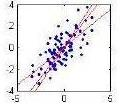
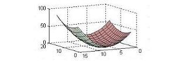
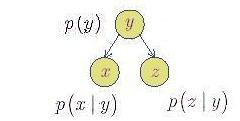
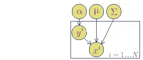

# Yapay Ögrenime Giriş

Bu makalede, yapay öğrenim (machine learning) konusunun amacından, motive eden
faktörlerden bahsedeceğiz, ve yapay öğrenimde istatistiki yöntemler ve
grafik modelleri savunan/yeğleyen bir açı ile yaklaşmaya çalışacağız. 

Yapay ögrenim, doğada görülen/gözlemlenen herhangi bir veriyi, veriden daha ufak
şekilde temsil etmemize yardım eder. Ve bunları, gözlemlenen olay için net bir
matematiksel model olmadığı zaman yapmaya uğraşır. Modeli bilgisayara
oluşturttuktan sonra, bu modeli kullanarak, diğer yapay öğrenim araçlarını
kullanmaya başlayabiliriz: Bunlar kümeleme (clustering), anormallik farketme
(anomaly detection), regresyon (regression) ve özellik seçme (feature selection)
gibi uygulamalardır.

YÖ'de iki ana kavram denetimli ve denetimsiz eğitim kavramı. Çok boyutlu
bir girdiyle beraber onun etiketi, ya da eşlendiği bir hedef değeri var
ise, ve algoritmamızı bu iki veriyi kullanarak eğitiyorsak, bu denetimli
(supervised) bir eğitim. İstatistikteki regresyon aslında bir çeşit
denetimli eğitim olarak görülebilir. İki boyutta çizgi uyduruyoruz, $x,y$
girdileri var, $x$ ana girdi, $y$ ise hedef / etiket. Ya da lojistik
regresyonla bir email içeriği verisini o email spam'mı değil mi etiketi
(0/1 değerleri ile) beraber eğitmek bir diğer örnek. Denetimsiz
(unsupervised) eğitim örneği veriyi kümelere ayırmak; kümelemeyi başka bir
veriden öğrenip bir diğerine uygulamıyoruz, elde hiç eğitilmiş bir yapı
olmadan her veride mevcut kümeleri keşfetmeye uğraşıyoruz.

Bu makalede $\mathbf{x}$ vektörü bir boyuttaki girdiyi temsil etmek için,
$\mathbf{X}$ çok boyutlu girdiyi temsil etmek için kullanılacak. Vektör
$\mathbf{x}$'in bütün elemanları tek bir özelliği ölçen büyüklükler olarak
kabul edelim, ve tersi belirtilmezse bağımsız özdeşçe dağılmış (iid) olarak
görelim.

Regresyon Bazlı Yöntemler

Model

Yapay öğrenim için uygun bir başlangıç noktası, doğrusal regresyondur (linear
regression). Veri olarak alınan $\mathbf{x}$ açıklamak için, hedef işlevi olarak
eğriliği ve başlangıç noktasını bilmediğimiz bir doğru olan f(x)'i öğrenmeye
çalışalım. 

$$
  f(x;\theta) = \sum_{i=1}^N \theta_{1}x_{i} + \theta_{0}
  \qquad (1)
$$

ki $\theta_{0}$ ve $\theta_{1}$ bilinmeyen değişkenleri temsil ediyorlar. Birçok
muhtemel $f(x;\theta)$ arasından araya araya en optimal $\theta$'yı bulmamız
gerekiyor. Altta doğrusal regresyon grafini goruyoruz.

 
İlk önce (1)'i matris formuna çeviriyoruz, ki doğrusal cebir
notasyonu kullanmamız mümkün olsun. Doğrusal cebir sayesinde, denklemi daha
ileride çok boyutta işler hâle getirmek çok basit olacak. 

$$
  f(x;\theta) = \sum_{i=1}^N 
  \left[ \begin{array}{cc}
      1 & x_{i}
  \end{array} \right]
  \left[ \begin{array}{c}
      \theta_{0} \\
      \theta_{1}
  \end{array} \right]
  \qquad (2)
$$

$$
  f(\mathbf{x};\theta) = 
  \left[ \begin{array}{cc}
      1 & x_{1} \\
      \vdots \\
      1 & x_{N} \\      
  \end{array} \right]
  \left[ \begin{array}{c}
      \theta_{0} \\
      \theta_{1}
  \end{array} \right]
  \qquad (3)
$$

(2)'de gösterilen toplama dikkat edersek, (3) formülünden kaybolduğunu
göreceğiz. Toplamın yerine ilk matriste ek boyutlar geldi. Doğrusal cebirin
biraz daha eklenmesi, tüm formülü daha da temiz hâle getirecektir.

$$  
  f(\mathbf{X};\theta) = \mathbf{X}\theta
$$

Arama işleminin sonuca varması için, hesaplanmış $f(x;\theta)$ ile verilen
$\mathbf{y}$'i karşılaştırması gerekir. Bu karşılaştırmayı matematiksel olarak
yapmanın karşılığı bir kayıp fonksiyonu (loss function) tanımlamaktır. Bu
fonksiyon, başarı/başarısızlık kriterimizi tanımladığımız yer olacaktır. Diyelim
ki kayıp kriteri (yâni bizim o an elimizde olan en iyi tahminin ne kadar yanlış
olduğu) $f(x;\theta)$ işlevinin sonucu ile, veri olarak elimizde olan
$\mathbf{y}$'nin farkının karesi olsun. Bu kayıp fonksiyonunu baz
alarak, tüm noktalar için bu hesabı yapıp sonucu toplarsak, tüm riski
hesaplamış oluruz.  

$$
  R(\theta) = \frac{1}{2N}|\mathbf{y} - \mathbf{X}\theta|^2
$$

Not: $2$ teriminin kullanılma sebebi, cebirsel işlemlerin ileri safhalarında
$^2$ ile otomatikman iptal olması içindir. Risk fonksiyonunu herhangi bir sayı
ile çarpmak, en alt (minima) noktasının nerede olduğunu değiştirmez. 

Yapay öğrenim literatüründe $R(\theta)$ fonksiyonu ölçümsel risk olarak bilinir. 
Bizim amacımız R'yi minimize etmektir, ve bu şekilde, ve aynı zamanda, en iyi
$\theta$'yı aramaktır. Altta 3 boyutlu risk fonksiyonu grafigi.

Risk'in en az olduğu nokta, fonksiyon değişimin en az olduğu noktadır, bunu
analiz dersinden biliyoruz. Bu demektir ki, bu noktada $R(\theta)$'nin gradyan
sıfır olacaktır. Gradyan, $R(\theta)$'nın bütün parça türevlerini (partial
derivatives) vektör halindeki şeklidir. Bir işlevin gradyanını almanın sonucu
elimize geçen vektör, her zaman o fonksiyonun, o noktadan hareketle en yüksek
değişimin/artışın/azalışın olacağı yönü gösterecektir. Eğer bu gradyan sıfır
olmuş ise, demek ki bir tam yatay düzleme geldik, ve hiç artış ve azalış imkanı
kalmamış. 

Bazı çeşit risk formüllerinin türevi cebirsel olarak çözülmesi zor bir sonuç
verebilir. Bu gibi durumlarda, yaklaşıksal (approximate) tekniklerden birini
kullanarak hesaplamayı yapabiliriz: Bir bilgisayar programı ile gradyanın işaret
ettiği yöne doğru *yürüyen* bir yöntem takip ederiz. Bu sayede gradyanın
sıfır olduğu bölgeye erişmeye uğraşırız. Program gradyan = 0 gördüğü anda
duracaktır. Önümüzdeki örnek için çıkardığımız türev, cebirsel olarak temiz
olacak, o yüzden yaklaşıksal, algoritmik tekniklere şimdilik ihtiyacımız yok.

$$ 
  \bigtriangledown_{\theta} R\left(\theta\right) = \left[ \begin{array}{c}
      0 \\
      0 
    \end{array} \right]
 $$

$$ 
  \bigtriangledown_{\theta}\left( \frac{1}{2N}||\mathbf{y} -
  \mathbf{X}\theta||^2\right) = 0 
 $$

$$ 
  \frac{1}{2N}  \bigtriangledown_{\theta} \left(
  \left(\mathbf{y} -  \mathbf{X}\theta \right) ^T
  \left( \mathbf{y} -  \mathbf{X}\theta \right)
  \right) = 0 
 $$

$$ 
  \frac{1}{2N}  \bigtriangledown_{\theta} \left(
  \left(\mathbf{y}^T -  \left(\mathbf{X}\theta\right)^T \right)
  \left( \mathbf{y} -  \mathbf{X}\theta \right)
  \right) = 0 
 $$

$$ 
  \frac{1}{2N}  \bigtriangledown_{\theta} \left(
  \mathbf{y}^T\mathbf{y} -
  \mathbf{y}^T\mathbf{X}\theta -
  \left( \mathbf{X}\theta \right)^T\mathbf{y} +
  \theta^T\mathbf{X}^T\mathbf{X}\theta
  \right) = 0 
 $$

İkinci ve üçüncü terimler aslında birbirine eşittir, çünkü vektör
çarpım kurallarına göre, $\mathbf{u}^T \mathbf{v} = \mathbf{v}^T \mathbf{u}$.

$$ 
  \frac{1}{2N}  \bigtriangledown_{\theta} \left(
  \mathbf{y}^T\mathbf{y} -2
  \mathbf{y}^T\mathbf{X}\theta +
  \theta^T\mathbf{X}^T\mathbf{X}\theta
  \right) = 0
 $$

$$ 
  \frac{1}{2N} \left(
  -2\mathbf{y}^T\mathbf{X}
  +2\theta\mathbf{X}^T\mathbf{X} \right) = 0
 $$

$$ 
  \frac{1}{N} \left(
  -\mathbf{y}^T\mathbf{X}
  +\theta\mathbf{X}^T\mathbf{X} \right) = 0
 $$

$$ 
  \theta\mathbf{X}^T\mathbf{X} =
  \mathbf{y}^T\mathbf{X} 
 $$

$$ 
  \theta = \left(\mathbf{X}^T\mathbf{X}\right)^{-1}
  \mathbf{y}^T\mathbf{X}
 $$

$\theta$ hesaplandıktan sonra, artık bu değeri $f(x;\theta)$ içine
koyabilir ve gelecekte bilinmeyen verileri tahmin için
kullanabiliriz. 

Yüksek Boyutlar

Doğrusal regresyon rahat bir şekilde çok boyutlu çalışacak şekilde
uzatılabilir. 

$$
  \mathbf{X} = 
  \left[ \begin{array}{cccc}
      1 & x_{1} & \cdots & x_{1}(D) \\
      \vdots & \vdots & \vdots & \vdots \\
      1 & x_{N} & \cdots & x_{N}(D) \\
  \end{array} \right] 
  \qquad (7)
$$

$$ 
  R\left(\theta\right) = \frac{1}{2N}
  \left|
  \left[ \begin{array}{c}
      y_{1} \\
      \vdots \\
      y_{N}
  \end{array} \right]
  -
  \mathbf{X}
  \left[ \begin{array}{c}
      \theta_{0} \\
      \theta_{1} \\
      \vdots \\
      \theta_{D} 
  \end{array} \right]
  \right|^2 
 $$

Yeni risk hesabı, N veri değeri ve D boyutu için kullanılabilir. $\theta$
hesabını ise gene aynen (7) denklemi üzerinden gerçekleştirebiliriz. Bu
denklemden gelen sonuç, N boyutlu bir hiper düzlemin hâm veriye en uygun
(fit) hâli olacaktır.

Baz Fonksiyonlar

Eğitim verisini modellemenin diğer bir yolu baz fonksiyonları olarak
bilinen fonksiyonlardır. Bu yöntem ile, bir polinom, sinüsyen (sinüs
bazlı) ya da radyal bir *baz* fonksiyon seçilir, ve her veri noktası 
$\mathbf{x}_{i\in N}$, baz fonksiyonundan geçirtilerek yeni bir
$\mathbf{x}$ oluşturulur. Bu noktadan sonra uygulanacak regresyon
işlemi, N baz fonksiyonunun en optimal hâldeki toplamının bulunma
işlemine dönüşecektir. Baz fonksiyonları arasında en popüler olan
radyal fonksiyonlardır, çünkü çok boyutlu veriyi modellememize izin
verirler. Karşılaştırma olarak polinom bazlı fonksiyonlarda tek
boyutun üzerine çıkamayız. 

Bir radyal baz fonksiyonu hesaplamak, bir bakıma her nokta yerine bir
tepe fonksiyonu yerleştirmektir. Bu tepe şöyle gösterilir:

$$
  \phi_{i}(\mathbf{x}) = exp\left(
  -\frac{1}{2\sigma}\left|\mathbf{x} - \mathbf{x}_{i}\right|^2
  \right)
$$

ki $\mathbf{x}$ bir ya da çok boyutlu olabilir. Tepenin genişliği
$\sigma$ parametresi ile kontrol edilir, ve regresyon işlemi
başlamadan modelci tarafından seçilen bir değerdir. Bundan sonra risk
fonksiyonu şu hâle gelecektir. 

$$
  R(\theta) = \frac{1}{2N}|\mathbf{y} - Q\theta|^2
$$

ki Q değeri şuna eşittir:

$$
  \left[ \begin{array}{cccc}
      1 & \phi_{0}(x_{1}) & \cdots & \phi_{D}(x_{1}) \\
      \vdots & \vdots & \vdots & \vdots \\
      1 & \phi_{0}(x_{N}) & \cdots & \phi_{D}(x_{N}) \\
  \end{array} \right]
$$

Ve hâla (7) denklemini regresyon için kullanabiliriz. 

Yapay Sinir Ağları

Düzeltici fonksiyonların eklenmesi ile regresyon biraz daha işe yarar hâle
gelir. Bunun da üstüne, regresyonu değişik seviyelerde birkaç kez yapar ve
her seviyede değişik düzeltici (ya da aynı) düzeltici fonksiyonlar
kullanırsak, Alttaki sekilde gördüğümüz daha çetrefilli ayrıcı problemleri
çözmemiz mümkün olacaktır. Bu tür yaklaşımlara ağa benzer yapısı sebebiyle
yapay sinir ağları (neural network) adı verilmiştir. 

Düzeltici fonksiyonların ağ yapısına eklenmesiyle birlikte, gradyan
yöntemini kullanarak pür cebirsel olarak en alt noktayı bulmak zorlaşır. Bu
yüzden yaklaşıksal yöntemler kullanmaya mecbur oluyoruz. Bu yöntemlerden
biri gradyan inişi (gradient descent) adı verilen bir yöntemdir. Çok
katmanlı bir yapay sinir ağ için gradyan inişi her katmana sırayla
uygulanır, ki YSA eğitmekte kullanılan ünlü BACKPROP algoritmasının altında
yatan temel fikir budur. BACKPROP birçok uygulama alanında başarı ile
kullanılmıştır.

Bu ek gücüne rağmen, YSA'nın bazı limitasyonları hâlen mevcuttur. Öncelikle
YSA'ların matematiksel analizi hala zordur. Ağ yapısına yeni bir katman
eklediğimizde bunun sonuçlarının ne olacağını hâlen bilmiyoruz. Ayrıca
analiz bir tarafa, YSA ile çözülmesi mümkün olmayan problemler de
mevcuttur. Meselâ $x^2+y^2=1$ formülünü öğrenmek bunlardan biridir çünkü,
bu formül bir fonksiyon değil, bir *ilişkidir*. Diğer bir ünlü problem
balistikten Gülle Atmanın Açısı ve Uzaklığı problemidir ve regresyon bazlı
bir yöntem kullanarak çözmek imkansızdır. Bu tür problemler en rahat
şekilde Bayes Ağları gibi bir istatistiki yaklaşım ile çözülebilir.

İstatistiki Yaklaşım

İstatistiki yaklaşım, veriyi daha iyi ve kesin özetleyebilmemizi
sağlar. İki boyutlu bir veri için regresyon yapınca, bilinmeyen bir
doğrunun sadece açısını öğrenmiş oluyoruz. İstatistiki yaklaşım ile bir
Gauss Normal dağılımın parametrelerini veriden çıkartınca, elimize geçenler
merkez nokta $\mu$ (ortalama), dağılımın genişliği $\sigma$ (varyans), ve
elipsin açısı $\Sigma$ (kovaryans) olacaktır. İstatistiki yaklaşım, aynı
zamanda, olasılık kuramının bütün araçlarını kullanmamıza imkan verdiği
için, altyapı daha sağlam olacaktır, ve böylece rasgele yöntemlere daha az
başvurmuş olacağız, ve ileride modeli analiz etmemiz kolaylaşacak.

Olasılık modellerinde, tek bir parametreyi öğrenmek yerine, o parametrenin
üstünden tanımlanan bir dağılımı öğreniyoruz. Yâni $y$ yerine $p(y)$
kullanıyoruz. Diğer taraftan, eski yöntemde $p(y)$ yerine $y$ kullanmak,
bütün ağırlığı tek bir noktada toplanmış bir dağılım öğrenmek ile aynı şey
oluyor.

Bir dağılıma birden fazla bilinmeyen eklemenin sonucu elimize bir ortak
dağılım (joint distribution) geçmesidir. Ayrıksal (discrete) şartlarda
ortak dağılım bir tablo olarak gösterilebilir ve belli (sonlu) sayıda
elemanı vardır.

Rasgele (random) değişkenler arasındaki bağımlılık ve bağımsızlık da ortak
dağılım tablo büyüklüğünde etkileyici bir faktördür. Eğer iki olayın, ve bu
sebeple bu olayların rasgele değişkenlerinin arasında bir ilişki var ise,
modelimizin bu ilişkiyi yansıtması isabetli olacaktır. Fakat basitleştirmek
için (meselâ) bütün değişkenlerin arasında bir ilişki kuracak olsaydık,
bunun sonucu tablomuzun büyüklüğünde üstel bir patlama olurdu. Örnek olarak
D bilinmeyenli ve hepsi birbiri ile ilişkili rasgele değişkenler üstünden
bir dağılımın tablo büyüklüğü $2^D$ iken, bütün rasgele değişkenler
birbirinden bağımsız olduğu durumda ise büyüklük $2D$'a inecektir.

Bu yüzden verimli bir yöntem şöyle olabilir: $2D$, yâni tam bağımsızlık ile
başlarız ve bağımlılık ilişkisini yavaş yavaş modele
tanıştırırız. Değişkenler arasındaki bağımlılık ilişkisi $p(y|x)$ olarak
gösterilir, ve okunuşu"x verildiğinde $y$'nin olasılığı'' olarak
tanımlanır. Ortak dağılım $p(x,y) = p(y|x)p(x)$ olarak bilinir ve bu
eşitlik olasılık kuramından iyi bilinen bir eşitliktir. Çok bilinmeyen
içeren bir problemde bütün bağımlılıkların formül olarak yazılması karışık
olabileceğinden, genelde çizit notasyonu kullanılır. Alttaki sekilde
görülen ortak dağılım $p(x,y,z)$, bütün olasılıkların çarpımına eşittir,
yâni $p(x)p(y|x)p(z|x)$.

Dikkat edilirse, bu modele göre $p(x,y,z)$ ortak dağılımı $p(x)p(y)p(z)$
çarpımına eşit değildir. Bu sonuç sadece ve sadece bütün değişkenler
birbirinden bağımsız ise ortaya çıkacaktır.

Olasılık dağılımlarını kullanırken, modelin bilinmeyenlerini, yâni
parametrelerini bile bir rasgele değişken olarak gösterilebilir. Böylece
diğer rasgele değişkenler ile bu tür değişkenler arasında bağımlılık
ilişkisi kurulabilir. Meselâ, alttaki sekildeki noktaları sınıflandırma
örneğinden başlayalım.

Bu örnekte, $x \in \mathbf{R}^D$ girdi verisidir, ve $y \in \{0,1\}$ de
sonuçtur. Değişken y ikili sistemde olduğu için, bu dağılımı bir Bernoulli
Dağılımı olarak modelleyebiliriz.

$$
p(y_{i}|\alpha)=\alpha^y_{i}(1-\alpha)^{1-y_{i}}
$$
  
ki $i=1...N$. Bir dağılım tablosu yerine dağılım *formülü* kullanmak
bize dağılımı cebirsel olarak manipüle etme avantajını sağlar. Bu sayede
formülü En Büyük Olurluk (Maximum Likelihood) gibi bir metoda girdi olarak
verebiliriz, formülün türevini alabiliriz, vs.

X'leri temsil etmek için Gaussian dağılımını seçeceğiz. 

$$
p(x_{i}|y_{i},\mu,\Sigma)=N(x_{i}|\mu_{y},\Sigma_{y})  
\qquad (11)
$$

Ortak dağılım da alttaki gibi gözükecektir. 

Gördüğümüz gibi $\mu,\alpha,\Sigma$ değişkenleri de rasgele değişkeni hâline
getirildi. Grafiğe bakarak cebirsel ortak dağılımı $p(x,y,\mu,\alpha,\Sigma)$
şöyle gösterebiliriz.

$$
p(y|\alpha)p(x|y,\mu,\Sigma)p(\Sigma)p(\mu)p(\alpha) 
\qquad (12)
$$

Sınıflandırma amacımıza erişebilmek için (12) formülünü,
$p(x,y|\alpha,\mu,\Sigma)$ sorusunu cevaplandırabilen bir hâle
getirmeliyiz. Olasılık kuramından bilinen bir değişim ile pür cebirsel
olarak şöyle devam edebiliriz.

$$
p(x,y|\alpha,\mu,\Sigma) =
\frac{p(x,y,\alpha,\mu,\Sigma)}
     {p(\alpha)p(\mu)p(\Sigma)} 
\qquad (13)
$$

Şimdi (13)'deki bölüneni, grafik modelden gelen ortak dağılım (12) ile
değiştireceğiz.

$$
p(x,y|\alpha,\mu,\Sigma) =
\frac{p(y|x)p(x|y,\mu,\Sigma)p(\alpha)p(\mu)p(\Sigma)}
     {p(\alpha)p(\mu)p(\Sigma)} \nonumber \\
= p(y|x)p(x|y,\mu,\Sigma) 
\qquad (14)
$$

Eğitim (hâm) verisine en uygun olan parametreleri bulmak için, En Büyük
Olurluk yöntemini kullanacağız. Bu metoda göre (14) formülünün her N veri
noktası ile hesabından sonra birbiri ile çarparız. O zaman, bilinmeyen
parametrelerin en iyi hesapsal tahmini (estimation), bu süper ortak
dağılımın en yüksek olduğu noktada bulunabilir.

$$
Olurluk = \prod_{i=1}^N p(y|x)p(x|y,\mu,\Sigma)
\qquad (15)
$$

Olurluğun en yüksek olduğu nokta, olurluk formülünün türevinin sıfır olduğu
noktadadır.

İleride yapılacak türev alma işlemini rahatlatmak için, (15) içindeki
terimlerin log'unu alırız. Bu işlem, çarpım işaretini toplam işaretine
dönüştürecektir. Bunu yapmamız en yüksek noktayı bulma açısından bir fark
yaratmaz, çünkü (15) formülünün değişim hızı, toplamlı olan formülünkiyle
aynıdır.

$$
l = \sum_{i=1}^N \log (p(y_{i}|x_{i})) + \sum_{i=1}^N \log
(p(x_{i}|y_{i},\mu,\Sigma))
$$

Son terimi iki toplama çevirebiliriz. Bunun için $y$ üzerinden özetlemeyi
(marginalize) iki parça halinde, $y$'nin mümkün her değeri için yapacağız.

$$
l = \sum_{i=1}^N \log(p(y_{i}|\alpha)) + 
\sum_{y_{i}\in 0} \log(p(x_{i}|\mu_{0},\Sigma_{0})) + 
\sum_{y_{i}\in 1} \log(p(x_{i}|\mu_{1},\Sigma_{1}))
\qquad (16)
$$

Şimdi, olurluğun gradyanını $\alpha, \Sigma, \mu$'a göre (ayrı ayrı)
alırsak ve bu sonuç formülleri sıfıra eşitleyip çözersek, elimize geçen
parametre değerleri veriyi açıklayan en mümkün parametre değerleri
olacaktır. Örnek olarak $\frac{\partial l}{\partial \alpha}$ gradyanını
alalım. Parçalı türevi $\alpha$'ya göre aldığımız için, birincisi hariç
(16) içindeki bütün terimler yokolur. Sonuç olarak şu olur:

$$ 
  \frac{\partial l}{\partial \alpha} =
  \frac{\partial }{\partial \alpha}
  \sum_{i=1}^N \log (p(y_{i}|\alpha)) 
$$

$$ 
  0 =
  \frac{\partial}{\partial \alpha}
  \sum_{i=1}^N \log\left(\alpha^y_{i}(1-\alpha)^{1-y_{i}}\right) 
$$

$$  
  0 =
  \frac{\partial}{\partial \alpha}
  \sum_{i=1}^N y_{i}\log(\alpha) + (1-y_{i})\log(1-\alpha) 
$$

Problem alanından bildiğimiz üzere, bazı $y_{i}$'ler 0 olacak, bazılari ise
1. Sıfır değerler $y_{i}\log(\alpha)$'yi iptal edecektir, bir değerleri de
$(1-y_{i})\log(1-\alpha)$'i iptal edecektir. O zaman, $y_{i}$'leri
formülden yoketmek için tüm formülü şöyle değiştirebiliriz.

$$ 
0 =
\frac{\partial}{\partial \alpha}\
\left(
\sum_{i\in class1} \log(\alpha) +
\sum_{i\in class0} \log(1-\alpha)
\right)
$$

$$ 
0 =
\sum_{i\in class1}\frac{1}{\alpha} -
\sum_{i\in class0}\frac{1}{1-\alpha}
$$

Eğer $N_{0}$ değişkenini 0 sınıfında olan i'ların toplamı, $N_{1}$'i 1
sınıfında olan i'ların sayısı olarak alırsak

$$ 
0 = \frac{N_{1}}{\alpha}-\frac{N_{0}}{1-\alpha} 
$$

$$ 
\alpha = \frac{N_{1}}{N_{1}+N_{0}} = \frac{N_{1}}{N}
$$

olur. Bu sonuç, $y_{i}=1$ olan $y_{i}$'leri, toplam veri noktası sayısına
bölünce $\alpha$'nın bulunabileceği şeklindeki önseziyi de desteklemiş
oluyor. Bunu tahmin de edebilirdik, ama bu önsezinin En Büyük Olurluk yöntemi
tarafından matematiksel olarak doğrulanmış olması daha rahatlatıcı oldu. 

Diğer bilinmeyenler $\mu_{0}, \mu_{1}, \Sigma_{0}, \Sigma_{1}$ için benzer
yöntemi takip edebiliriz. (16)'in türevini bilinmeyen rasgelen değişkene
göre alırız, sıfıra eşitleriz ve çözeririz. Bu işlem yer darlığı sebebiyle
burada gösterilmeyecektir. Bu işlemlerin sonunda formül (11)'deki tüm
bilinmeyenleri bulabiliriz. (11)'i daha önce bulunmuş olan $p(y)$ ile
kullanınca, (14)'u nihayet sınıflama için kullanmamız mümkün
olacaktır. Yapay Öğrenim literatüründe $p(y)$, ilk tahmin (prior guess)
olarak da bilinir.

Sınıflama

Sınıflama için bir formül daha türetmemiz gerekiyor: $p(y|x)$. Bu formül,
sonraki tahmin (posterior) olarak bilinir, ve bilindikten sonra bize
verilen ve sınıflandırılmamış yeni veri $x$'i $p(y|x=yeni deger)$ şeklinde
bu formülden geçiririz, ve $y$'nin olurluğunu hesaplarız.

Şimdi sonraki tahmin, $p(y|x)$'i türetelim. Olasılık kuramından,

$$
p(y|x) = \frac{p(x,y)}{p(x)} 
$$

Bunun işlemesi için $p(x)$'e ihtiyacımız var. $p(x,y)$'i alalım, ve $y$
üzerinden özetleyelim.

$$ 
p(y|x) = \frac{p(x,y)}{\sum_{y}p(x,y)}  
$$

$$   
= \frac{p(x,y)}{p(x,y=0) + p(x,y=1)}
$$ 

Artık sınıflama işlemi, $p(y=1|x)$ ve $p(y=0|x)$ formüllerini ayrı ayrı
hesaplamaktan ibarettir. Hangi olasılık daha büyük ise, o y değeri $x$'in
ait olduğu sınıf olacaktır.

Kaynaklar
  
[1] C. Bishop *Neural Networks for Pattern Recognition*, Oxford University Press, 1995.

[2] R. O. Duda, P. E. Hart \& D. G. Stork *Pattern Classification (2nd ed)*, Wiley, 2000.

[3] M. Jordan, C. Bishop, *Introduction to  Graphical Models (Online)*, not yet published.

[4] T. Mitchell, *Machine Learning*, McGraw-Hill, 1997.

