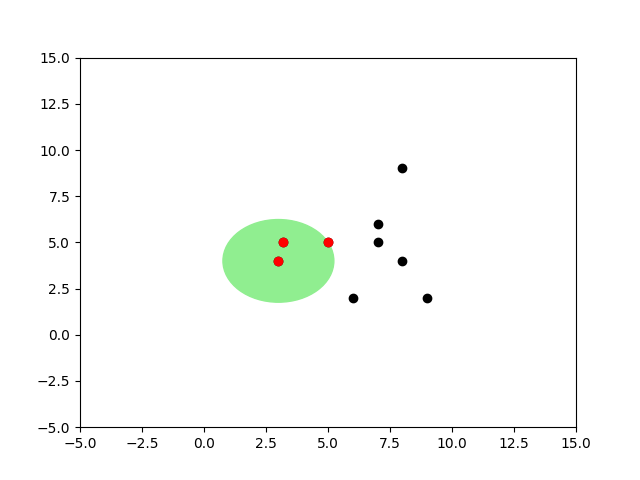
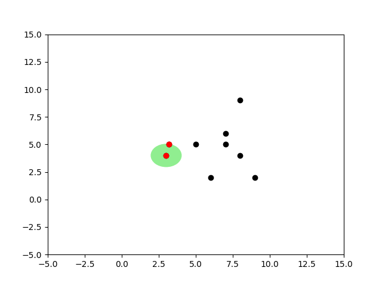

# En Yakın k-Komşu (k-Nearest Neighbor), Geometrik Yakınlık Hesabı

Yapay Öğrenim alanında örnek bazlı öğrenen algoritmalardan bilinen KNN, eğitim
verinin kendisini sınıflama (classification) amaçlı olarak kullanır, yeni bir
model ortaya çıkartmaz. Algoritma şöyle işler: etiketleri bilinen eğitim verisi
alınır ve bir kenarda tutulur. Yeni bir veri noktası görülünce bu veriye geri
dönülür ve o noktaya "en yakın'' k tane nokta bulunur. Daha sonra bu noktaların
etiketlerine bakılır ve çoğunluğun etiketi ne ise, o etiket yeni noktanın
etiketi olarak kabul edilir. Mesela elde `1` kategorisi altında
`[2 2]`, `2` kategorisi altında `[5 5]`  var ise, yeni nokta
`[3, 3]` için yakınlık açısından `[2 2]` bulunmalı ve etiket olarak
`1`  sonucu döndürülmelidir.

Üstte tarif edilen basit bir ihtiyaç, yöntem gibi görülebilir. Fakat yapay
öğrenim ve yapay zeka çok boyutlarda örüntü tanıma (pattern recognition)
ile uğraşır, ve milyonlarca satırlık veri, onlarca boyut (üstteki örnekte
2, fakat çoğunlukla çok daha fazla boyut vardır) işler hakikaten
zorlaşabilir. Mesela görüntü tanımada veri `M x N` boyutundaki dijital
imajlar (düzleştirilince $M \cdot N$ boyutunda), ve onların içindeki
resimlerin kime ait olduğu etiket bilgisi olabilir. KNN bu tür multimedya,
çok boyutlu veri ortamında başarılı şekilde çalışabilmektedir. Ayrıca en
yakın k komşunun içeriği tarifsel bilgi çıkarımı (knowledge extraction)
amacıyla da kullanılabilir [2].

"En yakın'' sözü bir kordinat sistemi anlamına geliyor, ve KNN, aynen GMM
ve diğer pek çok kordinatsal öğrenme yöntemi gibi eldeki çok boyutlu veri
noktalarının elemanlarını bir kordinat sistemindeymiş gibi görür. Kıyasla
mesela APriori gibi bir algoritma metin bazlı veriyle olduğu gibi
çalışabilirdi.

Peki arama bağlamında, bir veri öbeği içinden en yakın noktaları bulmanın
en basit yolu nedir? Listeyi baştan sonra taramak (kaba kuvvet yöntemi
-brute force-) listedeki her nokta ile yeni nokta arasındaki mesafeyi teker
teker hesaplayıp en yakın k taneyi içinden seçerdi, bu bir yöntemdir.. Bu
basit algoritmanın yükü $O(N)$'dir. Eğer tek bir nokta arıyor olsaydık,
kabul edilebilir olabilirdi. Fakat genellikle bir sınıflayıcı (classifier)
algoritmasının sürekli işlemesi, mesela bir online site için günde
milyonlarca kez bazı kararları alması gerekebilir. Bu durumda ve $N$'in çok
büyük olduğu şartlarda, üstteki hız bile yeterli olmayacaktır.

Arama işlemini daha hızlı yapmanın yolları var. Akıllı arama algoritmaları
kullanarak eğitim verilerini bir ağaç yapısı üzerinden tarayıp erişim
hızını $O(\log N)$'e indirmek mümkündür.

K-D Ağaçları (k-d tree)

Bilgisayar bilimde K-D ağaçları (k-boyutlu ağaçlar kelimesinin
kısaltılmışı) bir çok boyutlu bölümlere ayırma yaklaşımıdır, eldeki çok
boyutlu veri noktaları bölgelere ayrılarak arama ile bulunmaları
kolaylaştırılmaya uğraşılır. Bu yapı belli bir noktaya en yakın k nokta
bulmaya yardımcı olur.

Yapı şöyledir: K-D ağaçları bir ikisel ağaç olarak kodlanır, ağacın her
düğümü k boyutlu uzayı sadece tek bir kordinat üzerinden ikiye böler. Eğer
3 boyutta isek mesela 1. kordinat üzerinden bu ikiye bölüm
yapılabilir. Ardından o düğümde seçilen kordinat üzerinden bakılan öğeden
daha küçük olan veri noktaları sol dala büyük olanları sağ dala verilir. Bu
işleyiş ağacın altına doğru benzer şekilde devam eder, her seviyede farklı
bir kordinat seçilir.

```python
# -*- coding: utf-8 -*-
from __future__ import print_function

import operator, math
from collections import deque
from functools import wraps
from bpq import BoundedPriorityQueue

class Node(object):
    def __init__(self, data=None, left=None, right=None):
        self.data = data
        self.left = left
        self.right = right

    @property
    def is_leaf(self):
        return (not self.data) or \
               (all(not bool(c) for c, p in self.children))


    def preorder(self):
        if not self:
            return
        yield self
        if self.left:
            for x in self.left.preorder():
                yield x
        if self.right:
            for x in self.right.preorder():
                yield x

    def inorder(self):
        if not self:
            return
        if self.left:
            for x in self.left.inorder():
                yield x
        yield self
        if self.right:
            for x in self.right.inorder():
                yield x


    def postorder(self):
        if not self:
            return
        if self.left:
            for x in self.left.postorder():
                yield x
        if self.right:
            for x in self.right.postorder():
                yield x
        yield self

    @property
    def children(self):
        if self.left and self.left.data is not None:
            yield self.left, 0
        if self.right and self.right.data is not None:
            yield self.right, 1

    def set_child(self, index, child):
        if index == 0:
            self.left = child
        else:
            self.right = child

    def height(self):
        min_height = int(bool(self))
        return max([min_height] + [c.height()+1 for c, p in self.children])


    def get_child_pos(self, child):
        for c, pos in self.children:
            if child == c:
                return pos

    def __repr__(self):
        return '<%(cls)s - %(data)s>' % \
            dict(cls=self.__class__.__name__, data=repr(self.data))

    def __nonzero__(self):
        return self.data is not None

    __bool__ = __nonzero__

    def __eq__(self, other):
        if isinstance(other, tuple):
            return self.data == other
        else:
            return self.data == other.data

    def __hash__(self):
        return id(self)


def require_axis(f):
    @wraps(f)
    def _wrapper(self, *args, **kwargs):
        if None in (self.axis, self.sel_axis):
            raise ValueError('%(func_name) requires the node %(node)s '
                    'to have an axis and a sel_axis function' %
                    dict(func_name=f.__name__, node=repr(self)))

        return f(self, *args, **kwargs)

    return _wrapper


class KDNode(Node):
    def __init__(self, data=None, left=None, right=None, axis=None,
            sel_axis=None, dimensions=None):
        super(KDNode, self).__init__(data, left, right)
        self.axis = axis
        self.sel_axis = sel_axis
        self.dimensions = dimensions


    @require_axis
    def add(self, point):
        current = self
        while True:
            check_dimensionality([point], dimensions=current.dimensions)

            if current.data is None:
                current.data = point
                return current

            if point[current.axis] < current.data[current.axis]:
                if current.left is None:
                    current.left = current.create_subnode(point)
                    return current.left
                else:
                    current = current.left
            else:
                if current.right is None:
                    current.right = current.create_subnode(point)
                    return current.right
                else:
                    current = current.right


    @require_axis
    def create_subnode(self, data):
        return self.__class__(data,
                axis=self.sel_axis(self.axis),
                sel_axis=self.sel_axis,
                dimensions=self.dimensions)


    @require_axis
    def find_replacement(self):
        if self.right:
            child, parent = self.right.extreme_child(min, self.axis)
        else:
            child, parent = self.left.extreme_child(max, self.axis)

        return (child, parent if parent is not None else self)

    def should_remove(self, point, node):
        if not self.data == point:
            return False

        return (node is None) or (node is self)


    @require_axis
    def remove(self, point, node=None):
        if not self:
            return

        if self.should_remove(point, node):
            return self._remove(point)

        if self.left and self.left.should_remove(point, node):
            self.left = self.left._remove(point)

        elif self.right and self.right.should_remove(point, node):
            self.right = self.right._remove(point)

        if point[self.axis] <= self.data[self.axis]:
            if self.left:
                self.left = self.left.remove(point, node)

        if point[self.axis] >= self.data[self.axis]:
            if self.right:
                self.right = self.right.remove(point, node)

        return self

    @require_axis
    def _remove(self, point):
        if self.is_leaf:
            self.data = None
            return self

        root, max_p = self.find_replacement()

        tmp_l, tmp_r = self.left, self.right
        self.left, self.right = root.left, root.right
        root.left, root.right = tmp_l if tmp_l is not root else self, tmp_r if tmp_r is not root else self
        self.axis, root.axis = root.axis, self.axis

        if max_p is not self:
            pos = max_p.get_child_pos(root)
            max_p.set_child(pos, self)
            max_p.remove(point, self)

        else:
            root.remove(point, self)

        return root


    @property
    def is_balanced(self):
        left_height = self.left.height() if self.left else 0
        right_height = self.right.height() if self.right else 0

        if abs(left_height - right_height) > 1:
            return False
        return all(c.is_balanced for c, _ in self.children)

    def rebalance(self):
        return create([x.data for x in self.inorder()])

    def axis_dist(self, point, axis):
        return math.pow(self.data[axis] - point[axis], 2)


    def dist(self, point):
        r = range(self.dimensions)
        return sum([self.axis_dist(point, i) for i in r])


    def search_knn(self, point, k, dist=None):
        if dist is None:
            get_dist = lambda n: n.dist(point)
        else:
            get_dist = lambda n: dist(n.data, point)

        results = BoundedPriorityQueue(k)

        self._search_node(point, k, results, get_dist)

        # We sort the final result by the distance in the tuple
        # (<KdNode>, distance)
        BY_VALUE = lambda kv: kv[1]
        return sorted(results.items(), key=BY_VALUE)


    def _search_node(self, point, k, results, get_dist):
        if not self:
            return

        nodeDist = get_dist(self)
        results.add((self, nodeDist))
        split_plane = self.data[self.axis]
        plane_dist = point[self.axis] - split_plane
        plane_dist2 = plane_dist * plane_dist
        if point[self.axis] < split_plane:
            if self.left is not None:
                self.left._search_node(point, k, results, get_dist)
        else:
            if self.right is not None:
                self.right._search_node(point, k, results, get_dist)

        if plane_dist2 < results.max() or results.size() < k:
            if point[self.axis] < self.data[self.axis]:
                if self.right is not None:
                    self.right._search_node(point, k, results, get_dist)
            else:
                if self.left is not None:
                    self.left._search_node(point, k, results, get_dist)

    @require_axis
    def search_nn(self, point, dist=None):
        return next(iter(self.search_knn(point, 1, dist)), None)


    @require_axis
    def search_nn_dist(self, point, distance, best=None):
        if best is None:
            best = []

        if self.dist(point) < distance:
            best.append(self)

        children = sorted(self.children, key=lambda c_p1: c_p1[0].dist(point))

        for child, p in children:
            if self.axis_dist(point, self.axis) < math.pow(distance, 2):
                child.search_nn_dist(point, distance, best)

        return best


    @require_axis
    def is_valid(self):
        if not self:
            return True
        if self.left and self.data[self.axis] < self.left.data[self.axis]:
            return False
        if self.right and self.data[self.axis] > self.right.data[self.axis]:
            return False
        return all(c.is_valid() for c, _ in self.children) or self.is_leaf


    def extreme_child(self, sel_func, axis):
        max_key = lambda child_parent: child_parent[0].data[axis]
        me = [(self, None)] if self else []
        child_max = [c.extreme_child(sel_func, axis) for c, _ in self.children]
        child_max = [(c, p if p is not None else self) for c, p in child_max]
        candidates =  me + child_max
        if not candidates:
            return None, None

        return sel_func(candidates, key=max_key)

def create(point_list=None, dimensions=None, axis=0, sel_axis=None):
    if not point_list and not dimensions:
        raise ValueError('either point_list or dimensions must be provided')
    elif point_list:
        dimensions = check_dimensionality(point_list, dimensions)
    sel_axis = sel_axis or (lambda prev_axis: (prev_axis+1) % dimensions)

    if not point_list:
        return KDNode(sel_axis=sel_axis, axis=axis, dimensions=dimensions)

    point_list = list(point_list)
    point_list.sort(key=lambda point: point[axis])
    median = len(point_list) // 2

    loc   = point_list[median]
    left  = create(point_list[:median], dimensions, sel_axis(axis))
    right = create(point_list[median + 1:], dimensions, sel_axis(axis))
    return KDNode(loc, left, right, axis=axis, sel_axis=sel_axis, dimensions=dimensions)


def check_dimensionality(point_list, dimensions=None):
    dimensions = dimensions or len(point_list[0])
    for p in point_list:
        if len(p) != dimensions:
            raise ValueError('All Points in the point_list must have the same dimensionality')
    return dimensions


def level_order(tree, include_all=False):
    q = deque()
    q.append(tree)
    while q:
        node = q.popleft()
        yield node

        if include_all or node.left:
            q.append(node.left or node.__class__())

        if include_all or node.right:
            q.append(node.right or node.__class__())

```

```python
import bpq, kdtree
tree = kdtree.create([[2,3,4], [4,5,6], [5,3,2]])
print tree.search_nn( (1, 2, 3) )
```

```
(<KDNode - [2, 3, 4]>, 3.0)
```

```python
x = np.random.random((1000,2)) * 100.
kx = [list(xxx) for xxx in x]
tree = kdtree.create(kx)
kres = tree.search_knn( [39, 39], k=7 )
for kx in kres: print kx
```

```
(<KDNode - [37.944809008167091, 36.859556115064997]>, 5.694928053800966)
(<KDNode - [36.282279773622861, 39.25727857203173]>, 7.452195492486094)
(<KDNode - [36.011835939092215, 39.387237685986818]>, 9.07907748034933)
(<KDNode - [38.766178732185438, 34.670053651771802]>, 18.803107763817117)
(<KDNode - [39.443975626797602, 34.581772823651235]>, 19.7178457390171)
(<KDNode - [42.733856969186199, 36.292326352854367]>, 21.27318444578728)
(<KDNode - [43.489959416330848, 37.855783990677935]>, 21.468965836286962)
```

Küre Agaçları (Ball Tree, BT) 

Bir noktanın diğer noktalara yakın olup olmadığının hesabında yapılması
gereken en pahalı işlem nedir? Mesafe hesabıdır. BT algoritmasının püf
noktası bu hesabı yapmadan, noktalara değil, noktaları kapsayan "kürelere"
bakarak hız kazandırmasıdır. Noktaların her biri yerine o noktaları temsil
eden kürenin pivot noktasına (bu nokta küre içindeki noktaların ortalamasal
olarak merkezi de olabilir, herhangi bir başka nokta da) bakılır, ve oraya
olan mesafeye göre bir küre altındaki noktalara olabilecek en az ve en
fazla uzaklık hemen anlaşılmış olur.

Not: Küre kavramı üç boyutta anlamlı tabii ki, iki boyutta bir çemberden
bahsetmek lazım, daha yüksek boyutlarda ise merkezi ve çapı olan bir
"hiper yüzeyden'' bahsetmek lazım. Tarifi kolaylaştırdığı için çember ve
küre tanımlarını kullanıyoruz.

Mesela elimizde alttaki gibi noktalar var ve küreyi oluşturduk. 


Bu küreyi kullanarak küre dışındaki herhangi bir nokta $q$'nun küredeki
"diğer tüm noktalar $x$'e" olabileceği en az mesafenin ne olacağını
üçgensel eşitsizlik ile anlayabiliriz.

Üçgensel eşitsizlik 

$$ |x-y| \le |x-z| + |z-y| $$

Operatör $|
|$ norm anlamına gelir ve uzaklık hesabının
genelleştirilmiş halidir. Konu hakkında daha fazla detay {\em Fonksiyonel
  Analiz} ders notlarında. Kısaca söylenmek istenen iki nokta arasında
direk gitmek yerine yolu uzatırsak, mesafenin artacağıdır. Tabii uzaklık,
yol, nokta gibi kavramlar tamamen soyut matematiksel ortamda da işleyecek
şekilde ayarlanmıştır. Mesela mesafe (norm) kavramını değiştirebiliriz,
Öklitsel yerine Manhattan mesafesi kullanırız (blok mesafesi, binalar
etrafından dolaşılıyor, direk gidiş yok), fakat bu kavram bir norm olduğu
ve belirttiğimiz uzayda geçerli olduğu için üçgensel eşitsizlik üzerine
kurulmuş tüm diğer kurallar geçerli olur.


Şimdi diyelim ki dışarıdaki bir $q$ noktasından bir küre içindeki diğer tüm
$x$ noktalarına olan mesafe hakkında bir şeyler söylemek istiyoruz. Üstteki
şekilden bir üçgensel eşitsizlik çıkartabiliriz,

$$ |x-c| + |x-q| \ge |q-c|  $$

Bunun doğru bir ifade olduğunu biliyoruz. Peki şimdi yarıçapı bu işe dahil
edelim, çünkü yarıçap hesabı bir kere yapılıp küre seviyesinde depolanacak
ve bir daha hesaplanması gerekmeyecek, yani algoritmayı hızlandıracak bir
şey olabilir bu, o zaman eğer $|x-c|$ yerine yarıçapı (radius) kullanırsak,
eşitsizlik hala geçerli olur, sol taraf zaten büyüktü, şimdi daha da büyük
olacak, 

$$ radius + |x-q| \ge |q-c|  $$

Bunu nasıl böyle kesin bilebiliyoruz? Çünkü BT algoritması radius'u
$|x-c|$'ten kesinlikle daha büyük olacak şekilde seçer). Şimdi yarıçapı
sağa geçirelim,

$$ |x-q| \ge |q-c| - radius $$

Böylece güzel bir tanım elde ettik. Yeni noktanın küredeki herhangi bir
nokta $x$'e olan uzaklığı, yeni noktanın pivota olan uzaklığının yarıçapı
çıkartılmış halinden *muhakkak* fazladır. Yani bu çıkartma işleminden
ele geçen rakam yeni noktanın $x$'e uzaklığına bir "alt sınır (lower
bound)" olarak kabul edilebilir. Diğer tüm mesafeler bu rakamdan daha büyük
olacaktır. Ne elde ettik? Sadece bir yeni nokta, pivot ve yarıçap
kullanarak küredeki "diğer tüm noktalar hakkında" bir irdeleme yapmamız
mümkün olacak. Bu noktalara teker teker bakmamız gerekmeyecek. Bunun nasıl
ise yaradığını algoritma detaylarında göreceğiz.

Benzer şekilde 


Bu ne diyor? 

$$ |q-c| + |x-c| \ge |q-x| $$

$|x-c|$ yerine yarıçap kullanırsak, sol taraf büyüyeceği için büyüklük hala
büyüklük olarak kalır, 

$$ |q-c| + radius \ge |q-x| $$

Ve yine daha genel ve hızlı hesaplanan bir kural elde ettik (önceki
ifadeye benzemesi için yer düzenlemesi yapalım)

$$ |q-x| \le |q-c| + radius $$

Bu ifade ne diyor? Yeni noktanın pivota olan uzaklığına yarıçap
"eklenirse'' bu uzaklıktan, büyüklükten daha büyük bir yeni nokta / küre
 mesafesi olamaz, küredeki hangi nokta olursa olsun. Bu eşitsizlik te bize
 bir üst sınır (upper bound) vermiş oldu. 

Algoritma `ball_knn`$\left(PS^{in},node\right)$


* Eğer alttaki şart geçerli ise node içindeki bir noktanın daha önce
  keşfedilmiş $k$ en yakın komşudan daha yakın olması imkansızdır

* `if` $D^{node}_{minp} \ge D_{sofar}$ `return`  $PS_{in}$
  değişmemiş halde;

* `else if` $node$ bir çocuk noktası ise

  
   *  $PS_{out} = PS_{in}$
   * Her $\forall x \in points(node)$ için
   
     * `if` $\left( |x-q| < D_{sofar} \right)$, basit lineer arama yap
     * $x$'i $PS_{out}$'a ekle
     * `if` $|PS^{out}| == k+1$ o zaman en uzak olan komşuyu
       $PS^{out}$'tan çıkart ve $D_{sofar}$'i güncelle
   

  

* Eğer uç nokta değil ise iki çocuk düğümden daha yakın olanını
  incele, sonra daha uzakta olanına bak. büyük bir ihtimalle arama devam
  ettirilirse bu arama kendiliğinden kesilecektir.

  * `else`
    
      * $node_1 = node$'un $q$'ya en yakın çocuğu;
      * $node_2 = node$'un $q$'dan en uzak çocuğu;
      * $PS^{temp}$ = `ball_knn`($PS^{in},node_1)$;
      * $PS^{out}$ = `ball_knn`($PS^{temp},node_2);$

        


Küre Ağaçları (BT) metotu önce küreleri, ağaçları oluşturmalıdır. Bu
küreler hiyerarşik şekilde planlanır, tüm noktaların içinde olduğu bir "en
üst küre" vardır her kürenin iki tane çocuk küresi olabilir. Belli bir
(dışarıdan tanımlanan) minimum $r_{min}$ veri noktasına gelinceye kadar
sadece noktaları geometrik olarak kapsamakla görevli küreler oluşturulur,
küreler noktaları sahiplenmezler. Fakat bu $r_{min}$ sayısına erişince
(artık oldukça alttaki) kürelerin üzerine noktalar konacaktır.

Önce tek kürenin oluşturuluşuna bakalım. Bir küre oluşumu için eldeki veri
içinden herhangi bir tanesi pivot olarak kabul edilebilir. Daha sonra bu
pivot'tan diğer tüm noktalara olan uzaklık ölçülür, ve en fazla, en büyük
olan uzaklık yarıçap olarak kabul edilir (her şeyi kapsayabilmesi için).

Not: Bu arada "tüm diğer noktalara bakılması" dedik, bundan kaçınmaya
çalışmıyor muyduk?  Fakat dikkat, "küre oluşturulması" evresindeyiz, k
tane yakın nokta arama evresinde değiliz. Yapmaya çalıştığımız aramaları
hızlandırmak - eğitim / küre oluşturması bir kez yapılacak ve bu eğitilmiş
küreler bir kenarda tutulacak ve sürekli aramalar için ardı ardına
kullanılacaklar.

Küreyi oluşturmanın algoritması şöyledir: verilen noktalar içinde herhangi
birisi pivot olarak seçilir. Sonra bu noktadan en uzakta olan nokta $f_1$,
sonra $f_1$'den en uzakta olan nokta $f_2$ seçilir. Sonra tüm noktalara
teker teker bakılır ve $f_1$'e yakın olanlar bir gruba, $f_2$'ye yakın
olanlar bir gruba ayrılır. 

```python
import balltree, pprint

points = np.array([[3.,3.],[2.,2.]])
q = [1.,1.]
print 'diff', points-q
print 'dist', balltree.dist(points,q)
```

```
diff [[ 2.  2.]
 [ 1.  1.]]
dist [ 2.82842712  1.41421356]
```

```python
# k-nearest neighbor Ball Tree algorithm in Python

import itertools, numpy as np

__rmin__ = 2

def dist(vect,x):
    return np.fromiter(itertools.imap
                       (np.linalg.norm, vect-x),dtype=np.float)

def norm(x,y): return np.linalg.norm(x-y)

# node: [pivot, radius, points, [child1,child2]]
def new_node():
    return  [None,None,None,[None,None]]

def zero_if_neg(x):
    if x < 0: return 0
    else: return x

def form_tree(points,node,all_points,plot_tree=False):    
    pivot = points[0]
    radius = np.max(dist(points,pivot))
    if plot_tree: plot_circles(pivot, radius, points, all_points)
    node[0] = pivot
    node[1] = radius
    if len(points) <= __rmin__:
        node[2] = points
        return
    idx = np.argmax(dist(points,pivot))
    furthest = points[idx,:]
    idx = np.argmax(dist(points,furthest))
    furthest2 = points[idx,:]
    dist1=dist(points,furthest)
    dist2=dist(points,furthest2)
    diffs = dist1-dist2
    p1 = points[diffs <= 0]
    p2 = points[diffs > 0]
    node[3][0] = new_node() # left child
    node[3][1] = new_node() # right child
    form_tree(p1,node[3][0],all_points)
    form_tree(p2,node[3][1],all_points)

# knn: [min_so_far, [points]]
def search_tree(new_point, knn_matches, node, k):
    pivot = node[0]
    radius = node[1]
    node_points = node[2]
    children = node[3]

    # calculate min distance between new point and pivot
    # it is direct distance minus the radius
    min_dist_new_pt_node = norm(pivot,new_point) - radius
    
    # if the new pt is inside the circle, its potential minimum
    # distance to a random point inside is zero (hence
    # zero_if_neg). we can only say so much without looking at all
    # points (and if we did, that would defeat the purpose of this
    # algorithm)
    min_dist_new_pt_node = zero_if_neg(min_dist_new_pt_node)
    
    knn_matches_out = None
    
    # min is greater than so far
    if min_dist_new_pt_node >= knn_matches[0]:
        # nothing to do
        return knn_matches
    elif node_points != None: # if node is a leaf
        print knn_matches_out
        knn_matches_out = knn_matches[:] # copy it
        for p in node_points: # linear scan
            if norm(new_point,p) < radius:
                knn_matches_out[1].append([list(p)])
                if len(knn_matches_out[1]) == k+1:
                    tmp = [norm(new_point,x) \
                               for x in knn_matches_out[1]]
                    del knn_matches_out[1][np.argmax(tmp)]
                    knn_matches_out[0] = np.min(tmp)

    else:
        dist_child_1 = norm(children[0][0],new_point)
        dist_child_2 = norm(children[1][0],new_point)
        node1 = None; node2 = None
        if dist_child_1 < dist_child_2:
            node1 = children[0]
            node2 = children[1]
        else:
            node1 = children[1]
            node2 = children[0]

        knn_tmp = search_tree(new_point, knn_matches, node1, k)
        knn_matches_out = search_tree(new_point, knn_tmp, node2, k)
            
    return knn_matches_out
                   
```

```python
points = np.array([[3.,4.],[5.,5.],[9.,2.],[3.2,5.],[7.,5.],
                 [8.,9.],[7.,6.],[8,4],[6,2]])
tree = balltree.new_node()
balltree.form_tree(points,tree,all_points=points)
pp = pprint.PrettyPrinter(indent=4)
print "tree"
pp.pprint(tree)
newp = np.array([7.,7.])
dummyp = [np.Inf,np.Inf] # it should be removed immediately
res = balltree.search_tree(newp,[np.Inf, [dummyp]], tree, k=2)
print "done", res
```

```
tree
[   array([ 3.,  4.]),
    7.0710678118654755,
    None,
    [   [   array([ 8.,  9.]),
            3.1622776601683795,
            array([[ 8.,  9.],
       [ 7.,  6.]]),
            [None, None]],
        [   array([ 3.,  4.]),
            6.324555320336759,
            None,
            [   [   array([ 9.,  2.]),
                    3.6055512754639891,
                    None,
                    [   [   array([ 7.,  5.]),
                            1.4142135623730951,
                            array([[ 7.,  5.],
       [ 8.,  4.]]),
                            [None, None]],
                        [   array([ 9.,  2.]),
                            3.0,
                            array([[ 9.,  2.],
       [ 6.,  2.]]),
                            [None, None]]]],
                [   array([ 3.,  4.]),
                    2.2360679774997898,
                    None,
                    [   [   array([ 5.,  5.]),
                            0.0,
                            array([[ 5.,  5.]]),
                            [None, None]],
                        [   array([ 3.,  4.]),
                            1.019803902718557,
                            array([[ 3. ,  4. ],
       [ 3.2,  5. ]]),
                            [None, None]]]]]]]]
None
done [1.0, [[[8.0, 9.0]], [[7.0, 6.0]]]]
```

Bu iki grup, o anda işlemekte olduğumuz ağaç düğümün (node) iki
çocukları olacaktır. Çocuk noktaları kararlaştırıldıktan sonra artık
sonraki aşamaya geçilir, fonksiyon `form_tree` bu çocuk
noktaları alarak, ayrı ayrı, her çocuk grubu için özyineli (recursive)
olarak kendi kendini çağırır. Kendi kendini çağıran
`form_tree`, tekrar başladığında kendini yeni (bir) nokta
grubu ve yeni bir düğüm objesi ile başbaşa bulur, ve hiçbir şeyden
habersiz olarak işleme koyulur. Tabii her özyineli çağrı yeni düğüm
objesini yaratırken bir referansı üstteki ebeveyn düğüme koymayı
unutmamıştır, böylece özyineli fonksiyon dünyadan habersiz olsa bile,
ağacın en üstünden en altına kesintisiz bir bağlantı zinciri hep
elimizde olur.

Not: `form_tree` içinde bir numara yaptık, tüm noktaların $f_1$'e olan
uzaklığı `dist1`, $f_2$'e olan uzaklığı ise `dist2`. Sonra
`diffs = dist1-dist2` ile bu iki uzaklığı birbirinden çıkartıyoruz ve
mesela `points[diffs <= 0]`  ile $f_1$'e yakın olanları buluyoruz,
çünkü bir tarafta $f_1$'e yakınlık 4 diğer tarafta $f_2$'ye yakınlık 6 ise,
4-6=-2 ie o nokta $f_1$'e yakın demektir. Ufak bir numara ile numpy
dilimleme (slicing) tekniğini kullanabilmiş olduk ve bu önemli çünkü
böylece `for` döngüsü yazmıyoruz, numpy'in arka planda C ile yazılmış
hızlı rutinlerini kullanıyoruz.

Tekrar hatırlatalım: kürelerin sınırları kesişebilir.

Arama 

Üstte sözde program (pseudocode) `ball_knn` olarak gösterilen ve bizim
kodda `search_tree` olarak anılan fonksiyon arama fonksiyonu. Aranan
`new_point`'e olan k en yakın diğer veri noktalar. Dışarıdan verilen
değişken `knn_matches` üzerinde fonksiyon özyineli bir şekilde arama
yaparken "o ana kadar bulunmuş en yakın k nokta" ve o noktaların
`new_point`'e olan en yakın mesafesi saklanır, arama işleyişi
sırasında `knn_matches`, `knn_matches_out` sürekli verilip geri
döndürülen değişkenlerdir, sözde programdaki $P^{in},P^{out}$'un
karşılığıdırlar.

Arama algoritması şöyle işler: şimdi önceden oluşturulmuş küre
hiyerarşisini üstten alta doğru gezmeye başlarız. Her basamakta yeni nokta
ile o kürenin pivot'unu, yarıçapını kullanarak bir "alt sınır mesafe
hesabı" yaparız, bu mesafe hesabının arkasında yatan düşünceyi yazının
başında anlatmıştık. Bu mesafe küre içindeki tüm noktalara olan bir en az
mesafe idi, ve eğer eldeki `knn_matches`  üzerindeki şimdiye kadar
bulunmuş mesafelerin en azından daha az ise, o zaman bu küre "bakmaya
değer" bir küredir, ve arama algoritması bu küreden işleme devam
eder. Şimdiye kadar bulunmuş mesafelerin en azı `knn_matches` veri
yapısı içine `min_so_far`  olarak saklanıyor, sözde programdaki
$D_{sofar}$.

Bu irdeleme sonrası (yani vs küresinden yola devam kararı arkasından)
işleme iki şekilde devam edilebilir, çünkü bir küre iki türden
olabilir; ya nihai en alt kürelerden biridir ve üzerinde gerçek
noktalar depolanmıştır, ya da ara kürelerden biridir (sona gelmedik
ama doğru yoldayız, daha alta inmeye devam), o zaman fonksiyon yine
özyineli bir şekilde bu kürenin çocuklarına bakacaktır - her çocuk
için kendi kendini çağıracaktır. İkinci durumda, kürede noktalar
depolanmıştır, artık basit lineer bir şekilde o tüm noktalara teker
teker bakılır, eldekilerden daha yakın olanı alınır, eldeki liste
şişmeye başlamışsa (k'den daha fazla ise) en büyük noktalardan biri
atılır, vs.

Not: Silme işlemi örnek kodumuzda Python `del` ile
gerçekleştirildi. Eğer bu işlem de hızlandırılmak istenirse, en alt küre
seviyesindeki veriler bir öncelik kuyruğu (priority queue) üzerinde
tutulabilir, ve silme işlemi hep en sondaki elemanı siler, ekleme işlemi
ise yeni elemanı (hep sıralı olan) listede doğru yere koyar.

Daha alta inmemiz gereken birinci durumda yapılan iki çağrının bir
özelliğine dikkat çekmek isterim. Yeni noktanın bu çocuklara olan
uzaklığı da ölçülüyor, ve en önce, en yakın olan çocuğa doğru bir
özyineleme yapılıyor.  Bu nokta çok önemli: niye böyle yapıldı? Çünkü
içinde muhtemelen daha yakın noktaların olabileceği kürelere doğru
gidersek, özyineli çağrıların teker teker bitip yukarı doğru çıkmaya
başlaması ve kaldıkları yerden bu sefer ikinci çocuk çağrılarını
yapmaya başlaması ardından, elimizdeki `knn_matches`
üzerinde en yakın noktaları büyük bir ihtimalle zaten bulmuş
olacağız. Bu durumda ikinci çağrı yapılsa bile tek bir alt sınır
hesabı o kürede dikkate değer hiçbir nokta olamayacağını ortaya
çıkaracak (çünkü en iyiler zaten elimizde), ve ikinci çocuğa olan
çağrılar hiç alta inmeden pat diye geri dönecektir, hiç aşağı
inilmeyecektir.

Bu müthiş bir kazanımdır: zaten bu stratejiye litetürde "budamak (pruning)"
adı veriliyor, bu da çok uygun bir kelime aslında, çünkü ağaçlarla
uğraşıyoruz ve bir düğüm (küre) ve onun altındaki hiçbir alt küreye
uğramaktan kurtularak o dalların tamamını bir nevi "budamış" oluyoruz. Bir
sürü gereksiz işlemden de kurtuluyoruz, ve aramayı hızlandırıyoruz.

Model

KNN'in model kullanmayan, model yerine verinin kendisini kullanan bir
algoritma olarak tanıttık. Peki "eğitim'' evresi sonrası ele geçen küreler
ve ağaç yapısı bir nevi model olarak görülebilir mi? 

Bu önemli bir soru, ve bir bakıma, evet ağaç yapısı sanki bir modelmiş gibi
duruyor. Fakat, mesela istatistiksel, grafiksel, yapay sınır ağları (neural
net) bağlamında bakılırsa bu yapıya tam bir model denemez. Model bazlı
metotlarda model kurulunca veri atılır, ona bir daha bakılmaz. Fakat KNN,
küre ve ağaç yapısını hala eldeki veriye erişmek için kullanmaktadır. Yani
bir bakıma veriyi "indeksliyoruz'', ona erişimi kolaylaştırıp
hızlandırıyoruz, ama ondan model çıkartmıyoruz. 

Not: Verilen Python kodu ve algoritma yakın noktaları hesaplıyor sadece,
onların etiketlerinden hareketle yeni noktanın etiketini tahmin etme
aşamasını gerçekleştirmiyor. Fakat bu son aşama işin en basit tarafı,
eğitim veri yapısına eklenecek bir etiket bilgisi ve sınıflama sonrası k
noktanın ağırlıklı etiketinin hesabı ile basit şekilde
gerçekleştirilebilir.

```python
!python plot_circles.py
```

Ağaç oluşumu sırasındaki kürelerin grafiği alttadır. 






Kaynaklar

[1] Liu, Moore, Gray, {\em New Algorithms for Efficient High Dimensional
  Non-parametric Classification}

[2] Alpaydın, *Introduction to Machine Learning*

[3] *A simple kd-tree in Python*, [https://github.com/stefankoegl/kdtree](https://github.com/stefankoegl/kdtree)


