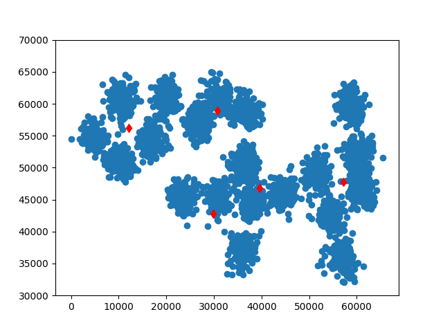
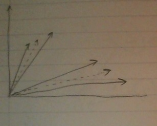
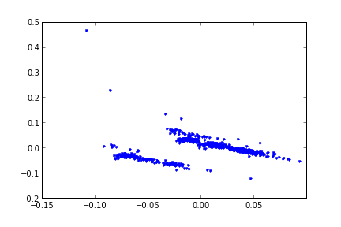

# K-Means Kümeleme Metodu

Popüler kümeleme algoritmalarından biri k-means algoritması. Bu metotta kaç
tane kümenin olması gerektiği baştan tanımlanır ($k$ parametresi ile),
algoritma bunu kendisi bulmaz. Metotun geri kalanı basit - bir döngü
(iteration) içinde her basamakta:

1) Her nokta için, eldeki küme merkezleri teker teker kontrol edilir
ve o nokta en yakın olan kümeye atanır.

2) Atamalar tamamlandıktan sonra her küme içinde hangi noktaların
olduğu bilindiği için her kümedeki noktaların ortalaması alınarak yeni
küme merkezleri hesaplanır. Eski merkez hesapları atılır.

3) Başa dönülür. Döngü tekrar ilk adıma döndüğünde, bu sefer yeni küme
merkezleri kullanılarak aynı adımlar tekrarlanacaktır.

Fakat bir problem yok mu? Daha birinci döngü başlamadan küme
merkezlerinin nerede olduğunu nereden bileceğiz? Burada bir
tavuk-yumurta problemi var, küme merkezleri olmadan noktaları
atayamayız, atama olmadan küme merkezlerini hesaplayamayız.

Bu probleme pratik bir çözüm ilk başta küme merkezlerini (ya da küme
atamalarını) rasgele bir şekilde seçmektir. Pratikte bu yöntem çok iyi
işliyor. Tabii bu rasgelelik yüzünden K-means'in doğru sonuca
yaklaşması (convergence) garanti değildir, ama gerçek dünya
uygulamalarında çoğunlukla kullanışlı kümeler bulunur. Bu potansiyel
problemlerden kaçınmak için k-means pek çok kez işletilebilir (her
seferinde yeni rasgele başlangıçlarla yani) ve aynı sonuca ulaşılıp
ulaşılmadığı kontrol edilebilir.

Pek en iyi k nasıl bulunur? SVD kullanarak grafiğe bakmak (bu yazının
sonunda anlatılıyor) mesela, fakat en iyisi K-Means yerine GMM kulanmak!
Bkz. yazı sonundaki referans.

K-Means EM algoritmasının bir türevi olarak kabul edilebilir, EM
kümeleri bir Gaussian (ya da Gaussian karışımı) gibi görür, ve her
basamakta bu dağılımların merkezini, hem de kovaryansını
hesaplar. Yani kümenin "şekli" de EM tarafından saptanır. Ayrıca EM
her noktanın tüm kümelere olan üyeliklerini "hafif (soft)" olarak
hesaplar (bir olasılık ölçütü üzerinden), fakat K-Means için bu atama
nihai (hard membership). Nokta ya bir kümeye aittir, ya da
değildir.

EM'in belli şartlarda yaklaşıksallığı için matematiksel ispat
var. K-Means akıllı tahmin yaparak (heuristic) çalışan bir algoritma
olarak biliniyor. Sonuca yaklaşması bu sebeple garanti değildir, ama
daha önce belirttiğimiz gibi pratikte faydalıdır. Bir sürü alternatif
kümeleme yöntemi olmasına rağmen hala K-Means kullanışlı. 
Burada bir etken de K-Means'in çok rahat paralelize edilebilmesi. Bu
konu başka bir yazıda işlenecek.

Örnek test verisi altta

```python
import pandas as pd
data = data = pd.read_csv("synthetic2.txt",names=['a','b'],sep=';')
print (data.shape)
data = np.array(data)
```

```text
(3000, 2)
```

```python
plt.scatter(data[:,0],data[:,1])
plt.savefig('kmeans_1.png')
```


```python
import random

def euc_to_clusters(x,y):
    return np.sqrt(np.sum((x-y)**2, axis=1))

class KMeans():
    def __init__(self,n_clusters,n_iter=10):
        self.k = n_clusters
        self.iter = n_iter
    def fit(self,X):
        # her veri noktasi icin rasgele kume merkezi ata
        labels = [random.randint(0,self.k-1) for i in range(X.shape[0])]
        self.labels_ = np.array(labels)
        self.centers_ = np.zeros((self.k,X.shape[1]))
        for i in range(self.iter):
            # yeni kume merkezleri uret
            for j in range(self.k):
                # eger kume j icinde hic nokta yoksa, ortalama (mean)
                # hesabi yapma, cunku o zaman nan degeri geliyor, ve
                # hesabin geri kalani bozuluyor.
                if len(X[self.labels_ == j]) == 0: continue
                center = np.mean(X[self.labels_ == j],axis=0)
                self.centers_[j,:] = center
            # her nokta icin kume merkezlerine gore kume atamasi yap
            self.labels_ = []
            for point in X:
                c = np.argmin(euc_to_clusters(self.centers_, point))
                self.labels_.append(int(c))

            self.labels_ = np.array(self.labels_)
```

```python
cf = KMeans(n_clusters=5,n_iter=20)
cf.fit(data)
print (cf.labels_)
```

```text
[2 2 2 ... 1 1 1]
```

Üstteki sonucun içinde iki ana vektör var, bu vektörlerden birincisi içinde
2,1, gibi sayılar görülüyor, bu sayılar her noktaya tekabül eden küme
atamaları.  İkinci vektör içinde iki boyutlu $k$ tane vektör var, bu
vektörler de her kümenin merkez noktası. Merkez noktalarını ham veri
üzerinde grafiklersek (kırmızı noktalar)

```python
plt.scatter(data[:,0],data[:,1])
plt.ylim([30000,70000])
for x in cf.centers_: plt.plot(x[0],x[1],'rd')
plt.savefig('kmeans_2.png')
```



Görüldüğü gibi 5 tane küme için üstteki merkezler bulundu. Fena
değil. Eğer 10 dersek

```python
cf = KMeans(n_clusters=10,n_iter=30)
cf.fit(data)
plt.scatter(data[:,0],data[:,1])
plt.ylim([30000,70000])
for x in cf.centers_: plt.plot(x[0],x[1],'rd')
plt.savefig('kmeans_3.png')
```


Kategorik ve Sayısal Öğeler İçeren Karışık Veriler

Bazen verimiz hem kategorik hem de sayısal (numeric) değerler içeriyor
olabilir, KMeans yeni küme merkezlerini hesaplarken ortalama operasyonu
kullandığı için sadece sayısal veriler üzerinde çalışabilir (kategorik
verilerin nasıl ortalamasını alalım ki?). Bu durumda ne yapacağız?

Bir seçenek şu olabilir, kategorik her kolonu her değişik değeri bir yeni
kolona tekabül edecek şekilde sağa doğru açarız, ve o değerin yeni kolonuna
1 değeri diğerlerine 0 değeri veririz. Bu kodlamaya 1-in-q kodlaması,
1-in-n kodlaması, ya da İngilizce 1-hot encoding ismi veriliyor.

Örnek olarak UCI veri bankasından Avustralya Kredi Verisine bakalım:

```python
import pandas as pd
df = pd.read_csv("crx.csv")
print (df[:2])
```

```text
  A1     A2    A3 A4 A5 A6 A7    A8 A9 A10  A11 A12 A13    A14  A15 A16
0  b  30.83  0.00  u  g  w  v  1.25  t   t    1   f   g  00202    0   +
1  a  58.67  4.46  u  g  q  h  3.04  t   t    6   f   g  00043  560   +
```

Bu veride A1, A2, gibi kolon isimleri var, kategorik olanlarda 'g','w' gibi
değerler görülüyor. Bu kolonları değiştirmek için

```python
from sklearn.feature_extraction import DictVectorizer
def one_hot_dataframe(data, cols):
    vec = DictVectorizer()
    mkdict = lambda row: dict((col, row[col]) for col in cols)
    vecData = pd.DataFrame(vec.fit_transform(data[cols].to_dict(orient='records')).toarray())
    vecData.columns = vec.get_feature_names_out()
    vecData.index = data.index
    data = data.drop(cols, axis=1)
    data = data.join(vecData)
    return data

df2 = one_hot_dataframe(df,['A1','A4','A5','A6','A7','A9','A10','A12','A13'])
print (df2.iloc[0])
```

```text
A2       30.83
A3         0.0
A8        1.25
A11          1
A14      00202
A15          0
A16          +
A10=f      0.0
A10=t      1.0
A12=f      1.0
A12=t      0.0
A13=g      1.0
A13=p      0.0
A13=s      0.0
A1=?       0.0
A1=a       0.0
A1=b       1.0
A4=?       0.0
A4=l       0.0
A4=u       1.0
A4=y       0.0
A5=?       0.0
A5=g       1.0
A5=gg      0.0
A5=p       0.0
A6=?       0.0
A6=aa      0.0
A6=c       0.0
A6=cc      0.0
A6=d       0.0
A6=e       0.0
A6=ff      0.0
A6=i       0.0
A6=j       0.0
A6=k       0.0
A6=m       0.0
A6=q       0.0
A6=r       0.0
A6=w       1.0
A6=x       0.0
A7=?       0.0
A7=bb      0.0
A7=dd      0.0
A7=ff      0.0
A7=h       0.0
A7=j       0.0
A7=n       0.0
A7=o       0.0
A7=v       1.0
A7=z       0.0
A9=f       0.0
A9=t       1.0
Name: 0, dtype: object
```

İşlem sonucunda A12=f mesela için 1 verilmiş, ama A12=t (ve diğer her
mümkün değer için yani) 0 değeri verilmiş (sadece bu tek satır
için). Böylece kategorik veriyi sayısal hale çevirmiş olduk.

Fakat işimiz bitti mi? Hayır. Şimdi KMeans bu tür veriyle acaba düzgün
çalışır mıydı onu kendimize soralım. İçinde pek çok 0, bazen 1 içeren 
veri satırları arasında uzaklık hesabı yapmak ise yarar mı?

Yapay Öğrenim literatüründe bu tür veriler üzerinde kosinüs benzerliği
(cosine similarity) kullanmak daha yaygındır. Bu konuyu {\em SVD, Toplu
  Tavsiye} yazısında daha iyi görülebilir. Kosinüs benzerliği bize 0 ile 1
arasında bir değer döndürür. Benzerliği uzaklığa çevirmek için basit bir
şekilde 1-benzerlik formülünü kullanabiliriz. O zaman şöyle bir çözüm
kullanabilir: normal sayısal değerler için Öklitsel, kategorik 1-hot
kodlanmış kolonlar için Kosinüs uzaklığı kullanılır, bu uzaklıklar bazı
ağırlıklar üzerinden birleştirilir, ve KMeans bu uzaklık ile iş
yapar. Teknik olarak imkansız değil; KMeans merkez bulmak için ortalama
alır ve Kosinüs uzaklığının verdiği aradaki açı, ortalama alma işlemi ile
uyumludur. Yani içinde hem Öklitsel hem 1-hot kodlanmış verilerin olduğu
vektörlerin ortalamasını alabiliriz, demek ki KMeans işleyebilir.



Problem şudur, iki uzaklığı birleştiren ağırlıklar ne olmalıdır?  Bu
yöntemi denediğimizde bu ağırlıkların ne seçildiğinin çok önemli olduğunu
farkettik, ve kümeleme gibi denetimsiz (unsupervised) bir yöntemde bu
hiperparametreleri deneme / yanılma yöntemi ile bulma şansımız yoktur.

Bu durumda kullanılabilecek bir yöntem şudur: SVD kullanarak tüm matrisi
azaltmak ve onun üzerinde pür Öklitsel uzaklıklar kullanmak. Sayısal ve
kategorik karışık verileri içeren verileri kümelemek için tavsiye edilen
yöntem şudur:

1) Kategorik veriler üzerinde 1-hot kodlama yap. 

2) Önce kolonları sonra satırları normalize et.

3) Tüm matris üzerinde çok küçük olmayan bir $k$ ile SVD al (mesela alttaki
veri seti için önce 10)

4) $S$ vektörüne bak, ortalamadan büyük olan kaç tane hücre olduğunu gör.

5) Bu sayı yeni $k$ değerimiz olacak, SVD'yi tekrar bu $k$ ile işlet. 

6) Elde edilen $U$ üzerinde kümeleme yap,

```python
from sklearn.preprocessing import normalize
import scipy.sparse.linalg as slin
import scipy.linalg as lin
import pandas as pd

df = pd.read_csv("crx.csv",sep=',',na_values=['?'])
df = df.dropna()

df['A16'] = df['A16'].str.replace('+','1')
df['A16'] = df['A16'].str.replace('-','0')
df['A16'] = df['A16'].astype(int)

df2 = one_hot_dataframe(df,['A1','A4','A5','A6','A7','A9','A10','A12','A13'])
df2 = df2.drop('A16',axis=1)
df2 = np.array(df2)
df3 = df2.copy()
df3 = normalize(df3, norm='l2', axis=0)
df3 = normalize(df3, norm='l2', axis=1)

u,s,v=slin.svds(df3,k=10)
print (s)
```

```text
[ 4.45826083  4.49654025  4.68382638  4.93391665  4.98604314  5.153349
  5.63521289  5.70490968  6.68558115 14.81145675]
```

Bakıyoruz, averajdan yüksek olan en büyük sadece iki kolon var. SVD
literatüründe bu kolonların matrisin "enerjisini'' içerdiği söylenir,
hakikaten eğer SVD ayrıştırma sonrası bu ilk kolona bu kadar önem verdiyse,
onlar önemli, "enerjiyi içeriyor'' olmalıdırlar. Şimdi SVD'yi $k=2$ ile
tekrar işletiyoruz,

```python
u,s,v=slin.svds(df3,k=2)
print (s)
```

```text
[ 6.68558115 14.81145675]
```

Şimdi $U$ üzerinde kümeleme yapacağız, ve kontrol için kenara koyduğumuz
bilinen etiketler üzerinden kümeleme başarımızı ölçeceğiz. Avustralya Kredi
Verisi aslında izlenen (supervised) algoritmalar için kullanılır, ama biz
onu izlenmeyen kümeleme problemi için kullandık, bilinen etiketleri veri
içinden çıkartıp bir kenara koyuyoruz, ve sonra kümeleme tahmini yaparak bu
etiketlerle olan uyumu ölçüyoruz. 

```python
clf = KMeans(n_clusters=2)
clf.fit(u)
labels_true = np.array(df['A16'])
labels_pred = clf.labels_
match = np.sum((labels_true == labels_pred).astype(int))
print (float(match)/len(df), 1-float(match)/len(df))
```

```text
0.7856049004594181 0.2143950995405819
```

Başarı yüzde \%78. Çok iyi. Üstteki örnek küme sayısının (dikkat SVD
$k$'sinden farklı) bilindiğini farz etti. Bazı durumlarda küme sayısını
grafiksel olarak görmek mümkündür (ama en iyisi Gaussian Karışım Modeli
kullanıp mümkün K'leri AIC ile test etmek, bkz {\em İstatistik, GMM ile
  Kümelemek} yazısı). 

Mesela üstteki veri seti için ortalamayı çıkartıp varyansa bölersek ve SVD
işletirsek en büyük iki $U$ kolonun grafiği alttaki gibi çıkıyor,



Eğer rasgele yansıtma (random projection) kullansaydık ne olurdu? Bu işlemi
birkaç kez yapalım ki rasgele matris `Omega` değişik şekillerde (ama
hala rasgele) üretilince sonuç değişir miydi görelim.

```python
import numpy.random as rand
for i in range(5):
     Omega = rand.randn(df3.shape[1],30)
     u = np.dot(df3,Omega)
     clf = KMeans(n_clusters=2)
     clf.fit(u)
     labels_true = np.array(df['A16'])
     labels_pred = clf.labels_
     match = np.sum((labels_true == labels_pred).astype(int))
     print (float(match)/len(df), 1-float(match)/len(df))
```

```text
0.7580398162327718 0.24196018376722817
0.5712098009188361 0.4287901990811639
0.3001531393568147 0.6998468606431854
0.44716692189892804 0.552833078101072
0.6125574272588055 0.38744257274119454
```

Görüldüğü gibi bazen çok iyi sonuçlar alıyor olsak bile bazen çok kötü
sonuçlar da alabiliyoruz. Demek ki bu veri setinde SVD tekniği daha
başarılı. 

Kaynaklar

[1] Corrada, *Practicum: Kernelized K-means*, [nbviewer.ipython.org/url/cbcb.umd.edu/~hcorrada/PML/src/kmeans.ipynb](nbviewer.ipython.org/url/cbcb.umd.edu/~hcorrada/PML/src/kmeans.ipynb)

[2] UCI Machine Learning Repository, *Statlog (Australian Credit Approval) Data Set *, [https://archive.ics.uci.edu/ml/datasets/Statlog+%28Australian+Credit+Approval%29](https://archive.ics.uci.edu/ml/datasets/Statlog+%28Australian+Credit+Approval%29)


