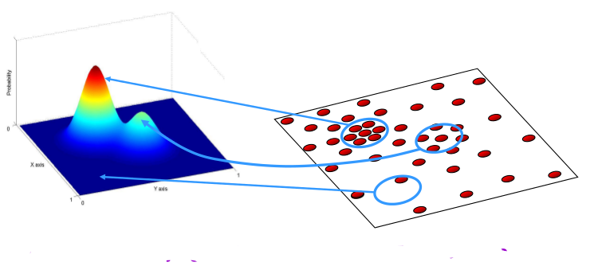
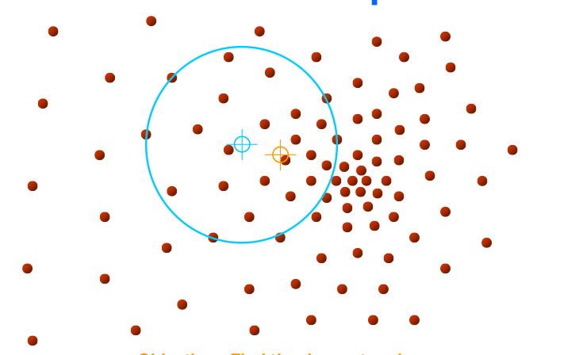
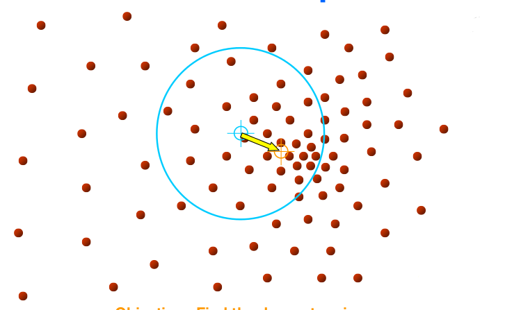
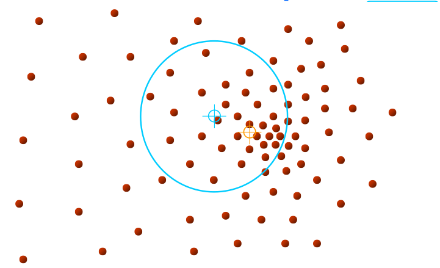
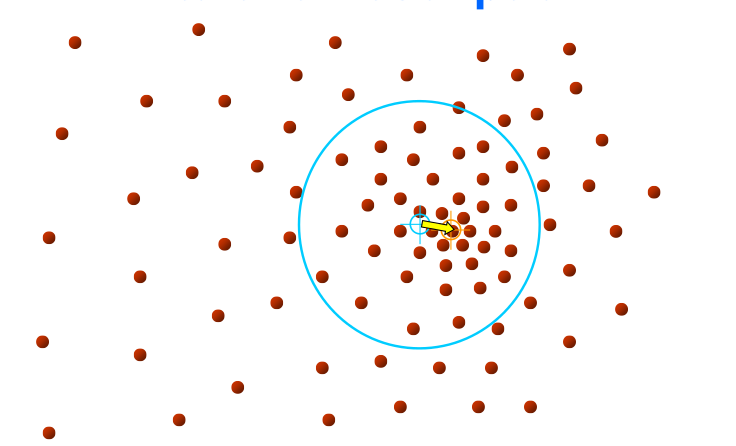
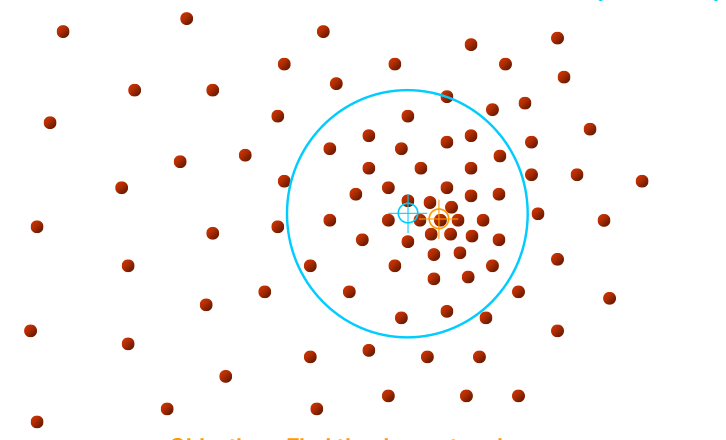
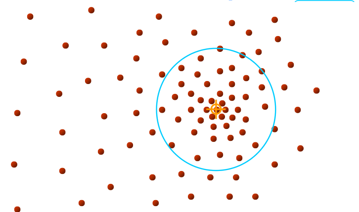
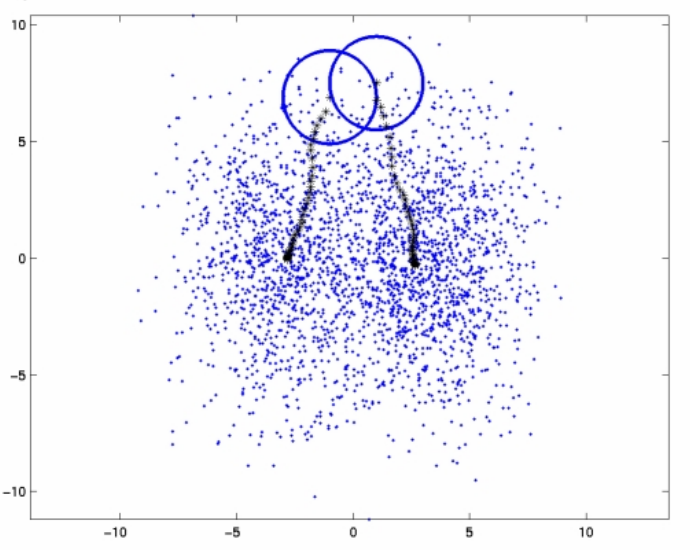
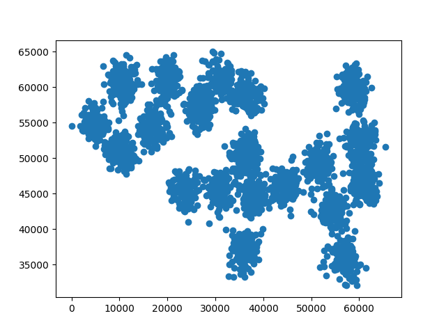

# Ortalama Kaydırma ile Kümeleme (Mean Shift Clustering)

Kümeleme yapmak için bir metot daha: Ortalama Kaydırma metotu. Bu metodun
mesela GMM gibi bir metottan farkı, küme sayısının önceden belirtilmeye
ihtiyacı olmamasıdır, küme sayısı otomatik olarak metot tarafından
saptanır.

"Küme" olarak saptanan aslında veri içindeki tüm yoğunluk bölgelerinin
merkezleridir, yani alttaki resmin sağ kısmındaki bölgeler.



Başlangıç neresidir? Başlangıç tüm noktalardır, yani her noktadan
başlanarak

1. O nokta etrafında (yeterince büyük) bir pencere tanımla

2. Bu pencere içine düşen tüm noktaları hesaba katarak bir ortalama yer hesapla

3. Pencereyi yeni ortalama noktayı merkezine alacak şekilde kaydır

Metotun ismi buradan geliyor, çünkü pencere yeni ortalamaya doğru
"kaydırılıyor". Altta bir noktadan başlanarak yapılan hareketi
görüyoruz.  Kaymanın sağa doğru olması mantıklı çünkü tek pencere
içinden bakınca bile yoğunluğun "sağ tarafa doğru" olduğu
görülmekte. Yöntemin püf noktası burada.










Eğer yoğunluk merkezine çok yakın bir noktadan / noktalardan
başlamışsak ne olur?

O zaman ilerleme o başlangıç noktası için anında bitecek, çünkü hemen
yoğunluk merkezine gelmiş olacağız. Diğer yönlerden gelen pencereler
de aynı yere gelecekler tabii, o zaman aynı / yakın yoğunluk
merkezlerini aynı küme olarak kabul etmemiz gerekir. Bu "aynı küme
irdelemesi" sayısal hesaplama açısından ufak farklar gösterebilir
tabii, ve bu ufak farkı gözönüne alarak "küme birleştirme" mantığını da
eklemek gerekiyor.

Ortalama Kaydırma sisteminde pencere büyüklüğü kullanıcı tarafından
tanımlanır.  Optimal pencere büyüklüğünü nasıl buluruz? Deneme yanılma
yöntemi, verinin tarifsel istatistiklerine kestirme bir hesap (estimate)
etmek, ya da kullanıcının aynı istatistiklere bakarak tahminde
bulunması. Birkaç farklı pencere büyüklüğü de denenebilir. Bu konu
literatürde (İng. bandwidth selection) adı altında uzun uzadıya
tartışılmaktadır.

Eğer yoğunluk merkezine çok yakın bir noktadan / noktalardan
başlamışsak ne olur?

O zaman ilerleme o başlangıç noktası için anında bitecek, çünkü hemen
yoğunluk merkezine gelmiş olacağız. Diğer yönlerden gelen pencereler
de aynı yere gelecekler tabii, o zaman aynı / yakın yoğunluk
merkezlerini aynı küme olarak kabul etmemiz gerekir. Bu "aynı küme
irdelemesi" sayısal hesaplama açısından ufak farklar gösterebilir
tabii, ve bu ufak farkı gözönüne alarak "küme birleştirme" mantığını da
eklemek gerekiyor.



Altta örnek veri ve kodu bulunabilir. Metot küme sayısı 17'yi otomatik
olarak buluyor (gerçek küme sayısı 20, bkz [7]  yazısı).

Alternatif bir kod `meanshift_alternatıve.py` dosyasında
bulunabilir, bu kod pencereler kaydırırken onların üzerinden geçtiği
noktaları "sahiplenen" türden bir kod. Yani [encere hareketini
durdurduğunda hem küme merkezini hem de o kümenin altındaki noktaları
bulmuş oluyoruz.  Tabii sonraki pencereler bazı noktaları önceki
kümelerden çalabilirler. Neyse, işlemin normal işleyişine göre bir
sonraki pencere seçilecektir ve bu pencere "geriye kalan noktalar"
üzerinden işlem yapacaktır.  Beklenir ki, işlem ilerledikçe işlenmesi
gereken noktalar azalacaktır ve yöntemin bu sebeple klasik yönteme
göre daha hızlı işleyeceği tahmin edilebilir. Hakikaten de böyledir.

```python
from pandas import *
data = read_csv("../kmeans/synthetic.txt",comment='#',header=None,sep="   ")
print data.shape
data = np.array(data)
```

```
(3000, 2)
```

```python
plt.scatter(data[:,0],data[:,1])
plt.savefig('meanshift_1.png')
```


```python
from sklearn.neighbors import NearestNeighbors
from sklearn.utils import extmath

def mean_shift(X, bandwidth=None, max_iterations=300):
    
    seeds = X
    n_samples, n_features = X.shape
    stop_thresh = 1e-3 * bandwidth  # when mean has converged
    center_intensity_dict = {}
    nbrs = NearestNeighbors(radius=bandwidth).fit(X)

    # For each seed, climb gradient until convergence or max_iterations
    for my_mean in seeds:
        completed_iterations = 0
        while True:
            # Find mean of points within bandwidth
            i_nbrs = nbrs.radius_neighbors([my_mean], bandwidth,
                                           return_distance=False)[0]
            points_within = X[i_nbrs]
            if len(points_within) == 0:
                break  # Depending on seeding strategy this condition may occur
            my_old_mean = my_mean  # save the old mean
            my_mean = np.mean(points_within, axis=0)
            # If converged or at max_iterations, addS the cluster
            if (extmath.norm(my_mean - my_old_mean) < stop_thresh or
                    completed_iterations == max_iterations):
                center_intensity_dict[tuple(my_mean)] = len(points_within)
                break
            completed_iterations += 1

    # POST PROCESSING: remove near duplicate points
    # If the distance between two kernels is less than the bandwidth,
    # then we have to remove one because it is a duplicate. Remove the
    # one with fewer points.
    sorted_by_intensity = sorted(center_intensity_dict.items(),
                                 key=lambda tup: tup[1], reverse=True)
    sorted_centers = np.array([tup[0] for tup in sorted_by_intensity])
    unique = np.ones(len(sorted_centers), dtype=np.bool)
    nbrs = NearestNeighbors(radius=bandwidth).fit(sorted_centers)
    for i, center in enumerate(sorted_centers):
        if unique[i]:
            neighbor_idxs = nbrs.radius_neighbors([center],
                                                  return_distance=False)[0]
            unique[neighbor_idxs] = 0
            unique[i] = 1  # leave the current point as unique
    cluster_centers = sorted_centers[unique]

    # ASSIGN LABELS: a point belongs to the cluster that it is closest to
    nbrs = NearestNeighbors(n_neighbors=1).fit(cluster_centers)
    labels = np.zeros(n_samples, dtype=np.int)
    distances, idxs = nbrs.kneighbors(X)
    labels = idxs.flatten()
    
    return cluster_centers, labels

cluster_centers, labels = mean_shift(np.array(data), 4000)

print len(cluster_centers)
```

```
17
```

```python
plt.scatter(data[:,0],data[:,1])
plt.hold(True)
for x in asarray(cluster_centers): plt.plot(x[0],x[1],'rd')
plt.savefig('meanshift_2.png')
```


Teorik Konular

Bu metotu teorik bir yapıya oturtmak için onu yazının ilk başındaki
resimde olduğu gibi görmek gerekiyor, yani mesela o ilk resmin
sağındaki 2 boyuttaki veri dağılımı (ki ayrıksal, sayısal), 3
boyuttaki sürekli (continuous) bir başka dağılımın yansıması sanki, ki
o zaman 2 boyuttaki yoğunluk bölgeleri sürekli dağılımdaki tepe
noktalarını temsil ediyorlar, ve biz o sürekli versiyondaki tepe
noktalarını bulmalıyız. Fakat kümeleme işleminin elinde sadece 2
boyuttaki veriler var, o zaman sürekli dağılımı bir şekilde yaratmak
lazım.

Bunu yapmak için problem / veri önce bir Çekirdek Yoğunluk Kestirimi
(Kernel Density Estimation -KDE-) problemi gibi görülüyor, ki her
nokta üzerine bir çekirdek fonksiyonu koyularak ve onların toplamı
alınarak sayısal dağılım pürüzsüz bir hale getiriliyor. Ortalama
Kaydırma için gerekli kayma "yönü" ise işte bu yeni sürekli
fonksiyonun gradyanıdır deniyor (elimizde bir sürekli fonksiyon olduğu
için türev rahatlıkla alabiliyoruz), ve gradyan yerel tepe noktasını
gösterdiği için o yöne yapılan hareket bizi yavaş yavaş tepeye
götürecektir. Bu hareketin yerel tepeleri bulacağı, ve tüm yöntemin
nihai olarak sonuca yaklaşacağı (convergence) matematiksel olarak
ispat edilebilir.

KDE ile elde edilen teorik dağılım fonksiyonunun içbükey olup olmadığı
önemli değil (ki mesela lojistik regresyonda bu önemliydi), çünkü
nihai tepe noktasını değil, birkaç yerel tepe noktasından birini
(hatta hepsini) bulmakla ilgileniyoruz. Gradyan bizi bu noktaya
taşıyacaktır.

Kaynaklar

[1] Babu, *Mean-Shift : Theory*, [http://www.serc.iisc.ernet.in/~venky/SE263/slides/Mean-Shift-Theory.pdf](http://www.serc.iisc.ernet.in/~venky/SE263/slides/Mean-Shift-Theory.pdf)

[2] Thirumuruganathan, *Introduction To Mean Shift Algorithm*, [http://saravananthirumuruganathan.wordpress.com/2010/04/01/introduction-to-mean-shift-algorithm/](http://saravananthirumuruganathan.wordpress.com/2010/04/01/introduction-to-mean-shift-algorithm/)

[3] Derpanis, *Mean Shift Clustering*, [http://www.cse.yorku.ca/~kosta/CompVis_Notes/mean_shift.pdf](http://www.cse.yorku.ca/~kosta/CompVis_Notes/mean_shift.pdf)

[4] Fisher, *Mean Shift Clustering*, [http://homepages.inf.ed.ac.uk/rbf/CVonline/LOCAL_COPIES/TUZEL1/MeanShift.pdf](http://homepages.inf.ed.ac.uk/rbf/CVonline/LOCAL_COPIES/TUZEL1/MeanShift.pdf)

[5] Scikit Learn, *Documentation*, [http://scikit-learn.org](http://scikit-learn.org)

[6] Gingold, [http://yotamgingold.com/code/MeanShiftCluster.py](http://yotamgingold.com/code/MeanShiftCluster.py)

[7] Bayramlı, Istatistik, *GMM ile Kümelemek*


