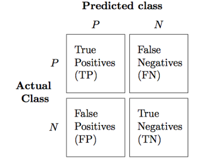
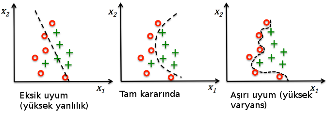
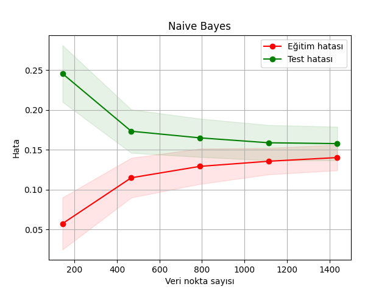
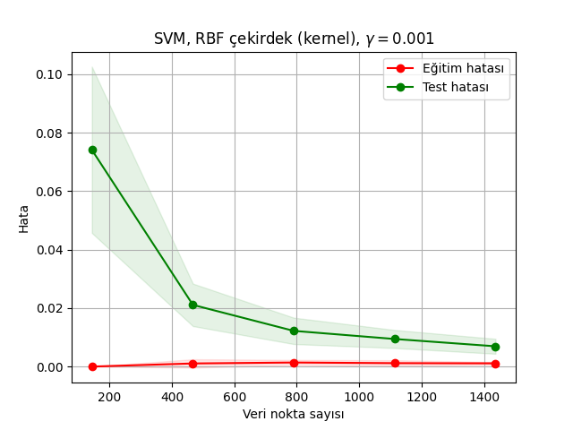
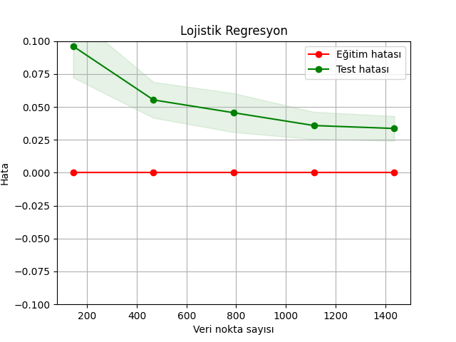

# Model Başarısını Ölçmek

Eğitim ve kontrol (validation) verisini ayrı tutmak iyi fikirdir, model
eğitim verisinde eğitilir, kontrol verisinde kontrol edilir. Yani modelin
hiç görmediği veriler üzerinde kontrolünün yapılması gerekir. Bazen bu
ayrışmanın veri üzerinde olan bir değer üzerinden olması da istenebilir,
mesela parakende satış verileri üzerinde eğitim yapıyorsak, bir müşterinin
hem eğitim hem kontrol verisinde olmasını istemeyebiliriz. Bu durumda
ayırma nasıl yapılır? Çok basit bir yöntem kullanıcı kimliği üzerinde
`hash` çağrısı yapmak ve sonuç üzerinde 2 üzerinden (mesela) modülo
uygulamak. Eğer çift sayı ise eğitim tek ise kontrol. Böylece ayrı bir
liste tutmadan kimliğe bakarak direk ayrımı yapabilmiş oluruz.  

Kafa Karışıklığı Matrisi (Confusion Matrix) 

İki ya da daha fazla etiketli tahmin problemlerinin sonuçlarını irdelemek
için kafa karışıklığı matrisi (KKM) kullanılabilir. Bu matrisin dikey
eksenini test verisinde gerçekten olan etiket, yatay eksenini tahmin edilen
etiket olarak düşünürsek, kordinat kesişimleri her özgün etiket değeri
için tahmin etme başarısını gösterecektir. Mesela herhangi bir yapay
öğrenim algoritmasından `y_tahmin` üretilmiş olsun,

```python
from sklearn.metrics import confusion_matrix
y_gercek = ["kedi", "sinek", "kedi", "kedi", "sinek", "balik"]
y_tahmin = ["sinek", "sinek", "kedi", "kedi", "sinek", "kedi"]
print (confusion_matrix(y_gercek, y_tahmin, labels=["sinek", "balik", "kedi"]))
```

```
[[2 0 0]
 [0 0 1]
 [1 0 2]]
```

Bakıyoruz gerçekten sinek olduğu zaman 2 kere sinek tahmin edilmiş
(matriste sol üst köşe), kedi aynı şekilde iki, ama bir defa kedi için
sinek denmiş, bu matrisin sol alt köşesinde. KKM matrisi tüm bu doğruları,
hataları tek bir yerde gösterebilen faydalı bir raporlama aracıdır. 

Eger sadece iki etiket varsa, matris alttaki gibi olur,



İki etiket durumunda matristeki sayıların özel isimleri var. Her eksende
ilk hücre 1 tahmini, diğeri 0 tahmini olursa, üst sol köşedeki tahmin
gerçekten 1 olduğu ve 1 tahmin edildiği durum, buna doğru pozitif (true
positive) ismi veriliyor. 0 tahmin yapılmış ama aslında etiket 1 ise buna
yanlış negatif (false negative), 1 tahmini yapılmış ama 0 ise buna yanlış
pozitif (false positive), 0 tahmini yapılmış ve gerçekten 0 ise buna doğru
negatif (true negative) ismi veriliyor. Kısaltılmış olarak sırasıyla TP,
FN, FP, TN [1, sf. 190].

Doğruluk (Accuracy)

Üstteki değerler ile bazı özet hesaplar var, bunlardan biri
doğruluk. Formülü

$$ 
ACC = \frac{FP + FN}{FP + FN + TP + TN}
$$

Kesinlik (Precision)

Diyelim ki bir fotografta 12 kedi, birkac tane fare var. Bir program 8 tane
kedi var diyor, ama kedi denen objelerden sadece 5 tanesi gercekten kedi. O
zaman programin kesinligi 5/8. 

$$ 
PRE = \frac{TP}{TP + FP}
$$

Hatırlama (Recall)

Üstteki örnekte hatırlama 5/12

$$ 
REC = \frac{TP}{FN + TP}
$$

F1 Skoru

Cogu zaman kesinlik ve hatirlamayi birlestirmek iyi bir fikirdir, bu bize
F1-Skoru verir, 

$$ 
F1 = 2 \frac{PRE \cdot REC}{PRE + REC}
$$

Özetlemek gerekirse doğruluk tahminlerimizin ne oranda doğru olduğudur,
fakat bu ölçü eğer eğitim verisinde dengesizlik var ise başarısız olur (100
içinde 90 resim kedi ise sürekli "kedi'' cevarı vermek yüzde 90 doğruluk
verir ama bu iyi bir algoritma değildir). Kesinlik ise algoritmamiz
"kedi'' dediği zaman bu cevaplar içindeki doğruluk oranıdır. Yani pozitif
tahmin edebilme oranıdır. Hatırlama ise sistemin tüm kediler içinde kaçıni
bulabildiğidir, yani doğru pozitif oranı.

AUC

Eğitim verisindeki dengesizliği dikkate alarak başarı hesaplamanın bir yolu
şu: algoritmalar 0/1 tahmini yerine "1 olma olasılığı'' üretirler, yani 0
ile 1 arası bir sayı. Bu olasılıkları 0/1 tahminine çevirmek kolay, bir
eşik değeri kararlaştırırız, ondan büyük olanlar 1 küçükler 0 olur; mesela
eşik değeri 0.5 olabilir. AUC hesabı için eşik değerini sürekli
değiştirerek bir döngü içinde doğru pozitif oranı, yanlış pozitif oranı
hesaplarız, bunu grafikleyince ortaya bir eğri çıkar. Bu eğri 45 derece
eğimli düz çizgi ne kadar üzerinde ise algoritmamiz o kadar başarılıdır. 

Matthews Korelasyon Katsayısı

AUC kadar iyi işleyen, verideki dengesizliklere dayanıklı bir diğer ölçüt
budur. Detaylar için [4] yazısı.


Yanlılık-Varyans Dengesi  (Bias-Variance Trade-off)



```python
from sklearn.svm import SVC
from sklearn.naive_bayes import GaussianNB
from sklearn import linear_model
from sklearn import ensemble
from sklearn.model_selection import ShuffleSplit
from sklearn.datasets import load_digits
import lcurve

digits = load_digits()
X, y = digits.data, digits.target

title = "Naive Bayes"
cv = ShuffleSplit(n_splits=100, test_size=0.2, random_state=0)
estimator = GaussianNB()
lcurve.plot(estimator, title, X, y, cv=cv, n_jobs=2)
plt.savefig('modeval_02.png')

title = u'SVM, RBF çekirdek (kernel), $\gamma=0.001$'
cv = ShuffleSplit(n_splits=10, test_size=0.2, random_state=0)
estimator = SVC(gamma=0.001)
lcurve.plot(estimator, title, X, y, cv=cv, n_jobs=2)
plt.savefig('modeval_03.png')

title = "Lojistik Regresyon"
cv = ShuffleSplit(n_splits=10, test_size=0.2, random_state=0)
estimator = linear_model.LogisticRegression()
lcurve.plot(estimator, title, X, y, ylim=(-0.1,0.1), cv=cv, n_jobs=2)
plt.savefig('modeval_04.png')

title = "RandomForestClassifier"
cv = ShuffleSplit(n_splits=10, test_size=0.2, random_state=0)
estimator = ensemble.RandomForestClassifier()
lcurve.plot(estimator, title, X, y, ylim=(-0.1,0.1), cv=cv, n_jobs=2)
plt.savefig('modeval_05.png')
```








Kaynaklar

[1] Raschka, *Python Machine Learning*

[2] Ng, Diagnosing Bias vs Variance, [https://www.youtube.com/watch?v=ymg03eGEBds](https://www.youtube.com/watch?v=ymg03eGEBds)

[3] Ng, Regularization and Bias Variance, [https://www.youtube.com/watch?v=yzS8bl75FV0](https://www.youtube.com/watch?v=yzS8bl75FV0)

[4] Bayramlı, İstatistik, *Beklenti, Varyans, Kovaryans ve Korelasyon*


