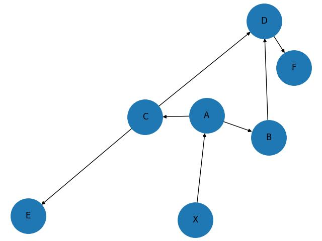

# Çizit Analizi (Graph Analysis)

Ağ yapı kavramı sosyal ağ sitelerinin arkadaşlık ağı analizi sayesinde
yaygınlaştı, fakat sosyal ağlar diğer alanlarda da kullanılabilir.

Ağ analizi için güzel bir paket NetworkX. Basit bir ağ üzerinde görelim,

```python
import networkx as net
import networkx.generators.small
g = networkx.generators.small.krackhardt_kite_graph()
print (g.number_of_edges())
net.draw(g,with_labels=True)
plt.savefig('net1.jpg')
```

```text
18
```


Gruplararası Bağlantılar

Sosyal ağ araştırmalarında bir kavram büyük gruplar arasında bağlantı
oluşturan insanların önemli olabileceği, çünkü bu kişiler iki ya da
daha fazla grup arasındaki iletişimi sağlıyor. Aracı Merkezlik
(Betweenness Centrality) ölçütü bu durumu saptamak için bulunmuş.  BC
ölçümünün algoritmasını [1, sf. 52]'de görebiliriz.

NetworkX ile bu hesap,

```python
print (net.betweenness_centrality(g))
```

```text
{0: 0.023148148148148143, 1: 0.023148148148148143, 2: 0.0, 3:
0.10185185185185183, 4: 0.0, 5: 0.23148148148148148, 6:
0.23148148148148148, 7: 0.38888888888888884, 8: 0.2222222222222222, 9:
0.0}
```

şeklinde yapılabilir.

PageRank

Bu algoritma Google ile ünlendi, ve kavram olarak aslında BC'nin tam
tersi.  PR için önemli olan "gelen" bağlantılar, ya da düğümleri Web
sayfaları bağlantıları Web bağlantıları olarak düşünürsek Web'i
rasgele gezen herhangi birinin o sayfaya gelme olasılığı. Tabii bunun
için sadece o sayfaya tek geçişle (tıklamayla) gelişi değil, o
sayfanın tüm komşularına gelişi, ve onların komşularına da gelişi, vs.
şekilde zincirleme şekilde bakabilecek, hesaplayabilecek bir algoritma
bu. PR konusunu daha önce işlemiştik [2]. 

```python
print (net.pagerank(g))
```

```text
{0: 0.1019196696364895, 1: 0.10191966963648949, 2:
0.07941791239513805, 3: 0.14714751310196444, 4: 0.07941791239513805,
5: 0.12890718095072973, 6: 0.12890718095072973, 7:
0.09524765350111203, 8: 0.0856958031065524, 9: 0.05141950432565652}
```

Klikler

Birbiri ile iç bağlantıları çok ama dış bağlantıları az olan gruplara
verilen isim. Detaylı tanım için [1, sf. 79].

```python
cliques = list(net.find_cliques(g))
print (cliques)
```

```text
[[8, 9], [8, 7], [3, 0, 1], [3, 0, 2, 5], [3, 4, 1, 6], [3, 6, 5], [7, 5, 6]]
```

Üçlü Gruplar (Triad)

Birbirine bağlı üç düğüm bir üçlü grup oluşturabilir. Üçlü grupların
ikili gruplara (dyad) kıyasla kendine has bazı sosyal özellikleri
olduğu saptanmıştır. Bu tür yapılar çizit analizi ile saptanabilir.
Üstteki örnek çizit üzerinde,

```python
import triadic
census, node_census = triadic.triadic_census(g)
print (census)
```

```text
{'003': 22.0, '012': 0, '102': 63, '021D': 0, '021U': 0,
'021C': 0, '111D': 0, '111U': 0, '030T': 0, '030C': 0, '201': 24,
'120D': 0, '120U': 0, '120C': 0, '210': 0, '300': 11}
```

9/11 teröristlerinin ağ yapısı altta. M. Atta kişinin merkezi bir figür olduğu
görülüyor.

```python
import csv 
import networkx as net
fig, axs = plt.subplots(1, 1, figsize=(10, 8))
in_file=csv.reader(open('9_11_edgelist.txt', newline='\n'), delimiter=',')
g=net.Graph()
for line in in_file:
    g.add_edge(line[0],line[1],weight=line[2],conf=line[3])

for n in g.nodes: g._node[n]['flight']='None'

attrb=csv.reader(open('9_11_attrib.txt'))
for line in attrb:
    g._node[line[0]]['flight']=line[1]
net.draw_random(g,ax=axs,with_labels=True,font_size=15,width=2,alpha=0.6)
plt.savefig('net2.jpg')
```


Eğer üçlü grupları hesaplarsak,

```python
import networkx as nx
import triadic 

connected_component_nodes = list(nx.connected_components(g))

first_component_nodes = connected_component_nodes[0]
cc = g.subgraph(first_component_nodes).copy() 

census, node_census = triadic.triadic_census(cc)

closed_triads = [[-k,v] for k,v in sorted([[-node_census[k]['300'],k] for k in node_census.keys()])]

print("Census for the first connected component:", census)
print("Node census for the first connected component:", node_census)
print("Kapali Uclu Gruplar:", closed_triads)
```

```text
Census for the first connected component: {'003': 31288.0, '012': 0, '102': 7585, '021D': 0, '021U': 0, '021C': 0, '111D': 0, '111U': 0, '030T': 0, '030C': 0, '201': 705, '120D': 0, '120U': 0, '120C': 0, '210': 0, '300': 133}
Node census for the first connected component: {'Hani Hanjour': {'003': 0, '012': 0, '102': 590, '021D': 0, '021U': 0, '021C': 0, '111D': 0, '111U': 0, '030T': 0, '030C': 0, '201': 102, '120D': 0, '120U': 0, '120C': 0, '210': 0, '300': 23}, 'Majed Moqed': {'003': 0, '012': 0, '102': 161, '021D': 0, '021U': 0, '021C': 0, '111D': 0, '111U': 0, '030T': 0, '030C': 0, '201': 13, '120D': 0, '120U': 0, '120C': 0, '210': 0, '300': 3}, 'Nawaf Alhazmi': {'003': 0, '012': 0, '102': 428, '021D': 0, '021U': 0, '021C': 0, '111D': 0, '111U': 0, '030T': 0, '030C': 0, '201': 60, '120D': 0, '120U': 0, '120C': 0, '210': 0, '300': 7}, 'Khalid Al-Mihdhar': {'003': 0, '012': 0, '102': 164, '021D': 0, '021U': 0, '021C': 0, '111D': 0, '111U': 0, '030T': 0, '030C': 0, '201': 6, '120D': 0, '120U': 0, '120C': 0, '210': 0, '300': 1}, 'Lotfi Raissi': {'003': 0, '012': 0, '102': 188, '021D': 0, '021U': 0, '021C': 0, '111D': 0, '111U': 0, '030T': 0, '030C': 0, '201': 42, '120D': 0, '120U': 0, '120C': 0, '210': 0, '300': 3}, 'Bandar Alhazmi': {'003': 0, '012': 0, '102': 58, '021D': 0, '021U': 0, '021C': 0, '111D': 0, '111U': 0, '030T': 0, '030C': 0, '201': 1, '120D': 0, '120U': 0, '120C': 0, '210': 0, '300': 0}, 'Rayed Mohammed Abdullah': {'003': 0, '012': 0, '102': 58, '021D': 0, '021U': 0, '021C': 0, '111D': 0, '111U': 0, '030T': 0, '030C': 0, '201': 0, '120D': 0, '120U': 0, '120C': 0, '210': 0, '300': 0}, 'Salem Alhazmi': {'003': 0, '012': 0, '102': 188, '021D': 0, '021U': 0, '021C': 0, '111D': 0, '111U': 0, '030T': 0, '030C': 0, '201': 29, '120D': 0, '120U': 0, '120C': 0, '210': 0, '300': 3}, 'Hamza Alghamdi': {'003': 0, '012': 0, '102': 304, '021D': 0, '021U': 0, '021C': 0, '111D': 0, '111U': 0, '030T': 0, '030C': 0, '201': 34, '120D': 0, '120U': 0, '120C': 0, '210': 0, '300': 2}, 'Ahmed Alnami': {'003': 0, '012': 0, '102': 56, '021D': 0, '021U': 0, '021C': 0, '111D': 0, '111U': 0, '030T': 0, '030C': 0, '201': 3, '120D': 0, '120U': 0, '120C': 0, '210': 0, '300': 0}, 'Saeed Alghamdi': {'003': 0, '012': 0, '102': 162, '021D': 0, '021U': 0, '021C': 0, '111D': 0, '111U': 0, '030T': 0, '030C': 0, '201': 8, '120D': 0, '120U': 0, '120C': 0, '210': 0, '300': 1}, 'Abdussattar Shaikh': {'003': 0, '012': 0, '102': 59, '021D': 0, '021U': 0, '021C': 0, '111D': 0, '111U': 0, '030T': 0, '030C': 0, '201': 0, '120D': 0, '120U': 0, '120C': 0, '210': 0, '300': 0}, 'Osama Awadallah': {'003': 0, '012': 0, '102': 0, '021D': 0, '021U': 0, '021C': 0, '111D': 0, '111U': 0, '030T': 0, '030C': 0, '201': 0, '120D': 0, '120U': 0, '120C': 0, '210': 0, '300': 0}, 'Mohamed Atta': {'003': 0, '012': 0, '102': 723, '021D': 0, '021U': 0, '021C': 0, '111D': 0, '111U': 0, '030T': 0, '030C': 0, '201': 169, '120D': 0, '120U': 0, '120C': 0, '210': 0, '300': 33}, 'Abdul Aziz Al-Omari': {'003': 0, '012': 0, '102': 301, '021D': 0, '021U': 0, '021C': 0, '111D': 0, '111U': 0, '030T': 0, '030C': 0, '201': 19, '120D': 0, '120U': 0, '120C': 0, '210': 0, '300': 10}, 'Marwan Al-Shehhi': {'003': 0, '012': 0, '102': 519, '021D': 0, '021U': 0, '021C': 0, '111D': 0, '111U': 0, '030T': 0, '030C': 0, '201': 56, '120D': 0, '120U': 0, '120C': 0, '210': 0, '300': 19}, 'Ziad Jarrah': {'003': 0, '012': 0, '102': 251, '021D': 0, '021U': 0, '021C': 0, '111D': 0, '111U': 0, '030T': 0, '030C': 0, '201': 13, '120D': 0, '120U': 0, '120C': 0, '210': 0, '300': 4}, 'Said Bahaji': {'003': 0, '012': 0, '102': 215, '021D': 0, '021U': 0, '021C': 0, '111D': 0, '111U': 0, '030T': 0, '030C': 0, '201': 9, '120D': 0, '120U': 0, '120C': 0, '210': 0, '300': 2}, 'Ramzi Bin al-Shibh': {'003': 0, '012': 0, '102': 304, '021D': 0, '021U': 0, '021C': 0, '111D': 0, '111U': 0, '030T': 0, '030C': 0, '201': 22, '120D': 0, '120U': 0, '120C': 0, '210': 0, '300': 1}, 'Zakariya Essabar': {'003': 0, '012': 0, '102': 0, '021D': 0, '021U': 0, '021C': 0, '111D': 0, '111U': 0, '030T': 0, '030C': 0, '201': 0, '120D': 0, '120U': 0, '120C': 0, '210': 0, '300': 0}, 'Essid Sami Ben Khemais': {'003': 0, '012': 0, '102': 507, '021D': 0, '021U': 0, '021C': 0, '111D': 0, '111U': 0, '030T': 0, '030C': 0, '201': 42, '120D': 0, '120U': 0, '120C': 0, '210': 0, '300': 6}, 'Waleed Alshehri': {'003': 0, '012': 0, '102': 217, '021D': 0, '021U': 0, '021C': 0, '111D': 0, '111U': 0, '030T': 0, '030C': 0, '201': 5, '120D': 0, '120U': 0, '120C': 0, '210': 0, '300': 4}, 'Wail Alshehri': {'003': 0, '012': 0, '102': 108, '021D': 0, '021U': 0, '021C': 0, '111D': 0, '111U': 0, '030T': 0, '030C': 0, '201': 4, '120D': 0, '120U': 0, '120C': 0, '210': 0, '300': 1}, 'Satam Suqami': {'003': 0, '012': 0, '102': 156, '021D': 0, '021U': 0, '021C': 0, '111D': 0, '111U': 0, '030T': 0, '030C': 0, '201': 6, '120D': 0, '120U': 0, '120C': 0, '210': 0, '300': 1}, 'Fayez Ahmed': {'003': 0, '012': 0, '102': 107, '021D': 0, '021U': 0, '021C': 0, '111D': 0, '111U': 0, '030T': 0, '030C': 0, '201': 1, '120D': 0, '120U': 0, '120C': 0, '210': 0, '300': 0}, 'Mohand Alshehri': {'003': 0, '012': 0, '102': 0, '021D': 0, '021U': 0, '021C': 0, '111D': 0, '111U': 0, '030T': 0, '030C': 0, '201': 0, '120D': 0, '120U': 0, '120C': 0, '210': 0, '300': 0}, 'Mustafa Ahmed al-Hisawi': {'003': 0, '012': 0, '102': 0, '021D': 0, '021U': 0, '021C': 0, '111D': 0, '111U': 0, '030T': 0, '030C': 0, '201': 0, '120D': 0, '120U': 0, '120C': 0, '210': 0, '300': 0}, 'Ahmed Alghamdi': {'003': 0, '012': 0, '102': 54, '021D': 0, '021U': 0, '021C': 0, '111D': 0, '111U': 0, '030T': 0, '030C': 0, '201': 1, '120D': 0, '120U': 0, '120C': 0, '210': 0, '300': 0}, 'Ahmed Al Haznawi': {'003': 0, '012': 0, '102': 0, '021D': 0, '021U': 0, '021C': 0, '111D': 0, '111U': 0, '030T': 0, '030C': 0, '201': 0, '120D': 0, '120U': 0, '120C': 0, '210': 0, '300': 0}, 'Zacarias Moussaoui': {'003': 0, '012': 0, '102': 315, '021D': 0, '021U': 0, '021C': 0, '111D': 0, '111U': 0, '030T': 0, '030C': 0, '201': 19, '120D': 0, '120U': 0, '120C': 0, '210': 0, '300': 5}, 'Djamal Beghal': {'003': 0, '012': 0, '102': 375, '021D': 0, '021U': 0, '021C': 0, '111D': 0, '111U': 0, '030T': 0, '030C': 0, '201': 21, '120D': 0, '120U': 0, '120C': 0, '210': 0, '300': 3}, 'Jerome Courtaillier': {'003': 0, '012': 0, '102': 115, '021D': 0, '021U': 0, '021C': 0, '111D': 0, '111U': 0, '030T': 0, '030C': 0, '201': 2, '120D': 0, '120U': 0, '120C': 0, '210': 0, '300': 0}, 'David Courtaillier': {'003': 0, '012': 0, '102': 0, '021D': 0, '021U': 0, '021C': 0, '111D': 0, '111U': 0, '030T': 0, '030C': 0, '201': 0, '120D': 0, '120U': 0, '120C': 0, '210': 0, '300': 0}, 'Ahmed Ressam': {'003': 0, '012': 0, '102': 58, '021D': 0, '021U': 0, '021C': 0, '111D': 0, '111U': 0, '030T': 0, '030C': 0, '201': 1, '120D': 0, '120U': 0, '120C': 0, '210': 0, '300': 0}, 'Kamel Daoudi': {'003': 0, '012': 0, '102': 57, '021D': 0, '021U': 0, '021C': 0, '111D': 0, '111U': 0, '030T': 0, '030C': 0, '201': 1, '120D': 0, '120U': 0, '120C': 0, '210': 0, '300': 0}, 'Tarek Maaroufi': {'003': 0, '012': 0, '102': 273, '021D': 0, '021U': 0, '021C': 0, '111D': 0, '111U': 0, '030T': 0, '030C': 0, '201': 12, '120D': 0, '120U': 0, '120C': 0, '210': 0, '300': 1}, 'Faisal Al Salmi': {'003': 0, '012': 0, '102': 0, '021D': 0, '021U': 0, '021C': 0, '111D': 0, '111U': 0, '030T': 0, '030C': 0, '201': 0, '120D': 0, '120U': 0, '120C': 0, '210': 0, '300': 0}, 'Mohamed Abdi': {'003': 0, '012': 0, '102': 0, '021D': 0, '021U': 0, '021C': 0, '111D': 0, '111U': 0, '030T': 0, '030C': 0, '201': 0, '120D': 0, '120U': 0, '120C': 0, '210': 0, '300': 0}, 'Mamoun Darkazanli': {'003': 0, '012': 0, '102': 58, '021D': 0, '021U': 0, '021C': 0, '111D': 0, '111U': 0, '030T': 0, '030C': 0, '201': 0, '120D': 0, '120U': 0, '120C': 0, '210': 0, '300': 0}, 'Ahmed Khalil Ibrahim Samir Al-Ani': {'003': 0, '012': 0, '102': 0, '021D': 0, '021U': 0, '021C': 0, '111D': 0, '111U': 0, '030T': 0, '030C': 0, '201': 0, '120D': 0, '120U': 0, '120C': 0, '210': 0, '300': 0}, 'Agus Budiman': {'003': 0, '012': 0, '102': 57, '021D': 0, '021U': 0, '021C': 0, '111D': 0, '111U': 0, '030T': 0, '030C': 0, '201': 0, '120D': 0, '120U': 0, '120C': 0, '210': 0, '300': 0}, 'Mounir El Motassadeq ': {'003': 0, '012': 0, '102': 0, '021D': 0, '021U': 0, '021C': 0, '111D': 0, '111U': 0, '030T': 0, '030C': 0, '201': 0, '120D': 0, '120U': 0, '120C': 0, '210': 0, '300': 0}, 'Abdelghani Mzoudi': {'003': 0, '012': 0, '102': 0, '021D': 0, '021U': 0, '021C': 0, '111D': 0, '111U': 0, '030T': 0, '030C': 0, '201': 0, '120D': 0, '120U': 0, '120C': 0, '210': 0, '300': 0}, 'Imad Eddin Barakat Yarkas': {'003': 0, '012': 0, '102': 55, '021D': 0, '021U': 0, '021C': 0, '111D': 0, '111U': 0, '030T': 0, '030C': 0, '201': 1, '120D': 0, '120U': 0, '120C': 0, '210': 0, '300': 0}, 'Nabil al-Marabh': {'003': 0, '012': 0, '102': 57, '021D': 0, '021U': 0, '021C': 0, '111D': 0, '111U': 0, '030T': 0, '030C': 0, '201': 1, '120D': 0, '120U': 0, '120C': 0, '210': 0, '300': 0}, 'Raed Hijazi': {'003': 0, '012': 0, '102': 58, '021D': 0, '021U': 0, '021C': 0, '111D': 0, '111U': 0, '030T': 0, '030C': 0, '201': 0, '120D': 0, '120U': 0, '120C': 0, '210': 0, '300': 0}, 'Abu Qatada': {'003': 0, '012': 0, '102': 56, '021D': 0, '021U': 0, '021C': 0, '111D': 0, '111U': 0, '030T': 0, '030C': 0, '201': 0, '120D': 0, '120U': 0, '120C': 0, '210': 0, '300': 0}, 'Mamduh Mahmud Salim': {'003': 0, '012': 0, '102': 0, '021D': 0, '021U': 0, '021C': 0, '111D': 0, '111U': 0, '030T': 0, '030C': 0, '201': 0, '120D': 0, '120U': 0, '120C': 0, '210': 0, '300': 0}, 'Mohammed Belfas': {'003': 0, '012': 0, '102': 0, '021D': 0, '021U': 0, '021C': 0, '111D': 0, '111U': 0, '030T': 0, '030C': 0, '201': 0, '120D': 0, '120U': 0, '120C': 0, '210': 0, '300': 0}, 'Abu Walid': {'003': 0, '012': 0, '102': 0, '021D': 0, '021U': 0, '021C': 0, '111D': 0, '111U': 0, '030T': 0, '030C': 0, '201': 0, '120D': 0, '120U': 0, '120C': 0, '210': 0, '300': 0}, 'Nabil Almarabh': {'003': 0, '012': 0, '102': 0, '021D': 0, '021U': 0, '021C': 0, '111D': 0, '111U': 0, '030T': 0, '030C': 0, '201': 0, '120D': 0, '120U': 0, '120C': 0, '210': 0, '300': 0}, 'Haydar Abu Doha': {'003': 0, '012': 0, '102': 58, '021D': 0, '021U': 0, '021C': 0, '111D': 0, '111U': 0, '030T': 0, '030C': 0, '201': 1, '120D': 0, '120U': 0, '120C': 0, '210': 0, '300': 0}, 'Mohamed Bensakhria': {'003': 0, '012': 0, '102': 115, '021D': 0, '021U': 0, '021C': 0, '111D': 0, '111U': 0, '030T': 0, '030C': 0, '201': 1, '120D': 0, '120U': 0, '120C': 0, '210': 0, '300': 0}, 'Lased Ben Heni': {'003': 0, '012': 0, '102': 0, '021D': 0, '021U': 0, '021C': 0, '111D': 0, '111U': 0, '030T': 0, '030C': 0, '201': 0, '120D': 0, '120U': 0, '120C': 0, '210': 0, '300': 0}, 'Mehdi Khammoun': {'003': 0, '012': 0, '102': 0, '021D': 0, '021U': 0, '021C': 0, '111D': 0, '111U': 0, '030T': 0, '030C': 0, '201': 0, '120D': 0, '120U': 0, '120C': 0, '210': 0, '300': 0}, 'Essoussi Laaroussi': {'003': 0, '012': 0, '102': 0, '021D': 0, '021U': 0, '021C': 0, '111D': 0, '111U': 0, '030T': 0, '030C': 0, '201': 0, '120D': 0, '120U': 0, '120C': 0, '210': 0, '300': 0}, 'Samir Kishk': {'003': 0, '012': 0, '102': 0, '021D': 0, '021U': 0, '021C': 0, '111D': 0, '111U': 0, '030T': 0, '030C': 0, '201': 0, '120D': 0, '120U': 0, '120C': 0, '210': 0, '300': 0}, 'Fahid al Shakri': {'003': 0, '012': 0, '102': 0, '021D': 0, '021U': 0, '021C': 0, '111D': 0, '111U': 0, '030T': 0, '030C': 0, '201': 0, '120D': 0, '120U': 0, '120C': 0, '210': 0, '300': 0}, 'Seifallah ben Hassine': {'003': 0, '012': 0, '102': 0, '021D': 0, '021U': 0, '021C': 0, '111D': 0, '111U': 0, '030T': 0, '030C': 0, '201': 0, '120D': 0, '120U': 0, '120C': 0, '210': 0, '300': 0}, 'Nizar Trabelsi': {'003': 0, '012': 0, '102': 0, '021D': 0, '021U': 0, '021C': 0, '111D': 0, '111U': 0, '030T': 0, '030C': 0, '201': 0, '120D': 0, '120U': 0, '120C': 0, '210': 0, '300': 0}, 'Jean-Marc Grandvisir': {'003': 0, '012': 0, '102': 0, '021D': 0, '021U': 0, '021C': 0, '111D': 0, '111U': 0, '030T': 0, '030C': 0, '201': 0, '120D': 0, '120U': 0, '120C': 0, '210': 0, '300': 0}, 'Abu Zubeida': {'003': 0, '012': 0, '102': 0, '021D': 0, '021U': 0, '021C': 0, '111D': 0, '111U': 0, '030T': 0, '030C': 0, '201': 0, '120D': 0, '120U': 0, '120C': 0, '210': 0, '300': 0}, 'Madjid Sahoune': {'003': 0, '012': 0, '102': 0, '021D': 0, '021U': 0, '021C': 0, '111D': 0, '111U': 0, '030T': 0, '030C': 0, '201': 0, '120D': 0, '120U': 0, '120C': 0, '210': 0, '300': 0}}
Kapali Uclu Gruplar: [[33, 'Mohamed Atta'], [23, 'Hani Hanjour'], [19, 'Marwan Al-Shehhi'], [10, 'Abdul Aziz Al-Omari'], [7, 'Nawaf Alhazmi'], [6, 'Essid Sami Ben Khemais'], [5, 'Zacarias Moussaoui'], [4, 'Waleed Alshehri'], [4, 'Ziad Jarrah'], [3, 'Djamal Beghal'], [3, 'Lotfi Raissi'], [3, 'Majed Moqed'], [3, 'Salem Alhazmi'], [2, 'Hamza Alghamdi'], [2, 'Said Bahaji'], [1, 'Khalid Al-Mihdhar'], [1, 'Ramzi Bin al-Shibh'], [1, 'Saeed Alghamdi'], [1, 'Satam Suqami'], [1, 'Tarek Maaroufi'], [1, 'Wail Alshehri'], [0, 'Abdelghani Mzoudi'], [0, 'Abdussattar Shaikh'], [0, 'Abu Qatada'], [0, 'Abu Walid'], [0, 'Abu Zubeida'], [0, 'Agus Budiman'], [0, 'Ahmed Al Haznawi'], [0, 'Ahmed Alghamdi'], [0, 'Ahmed Alnami'], [0, 'Ahmed Khalil Ibrahim Samir Al-Ani'], [0, 'Ahmed Ressam'], [0, 'Bandar Alhazmi'], [0, 'David Courtaillier'], [0, 'Essoussi Laaroussi'], [0, 'Fahid al Shakri'], [0, 'Faisal Al Salmi'], [0, 'Fayez Ahmed'], [0, 'Haydar Abu Doha'], [0, 'Imad Eddin Barakat Yarkas'], [0, 'Jean-Marc Grandvisir'], [0, 'Jerome Courtaillier'], [0, 'Kamel Daoudi'], [0, 'Lased Ben Heni'], [0, 'Madjid Sahoune'], [0, 'Mamduh Mahmud Salim'], [0, 'Mamoun Darkazanli'], [0, 'Mehdi Khammoun'], [0, 'Mohamed Abdi'], [0, 'Mohamed Bensakhria'], [0, 'Mohammed Belfas'], [0, 'Mohand Alshehri'], [0, 'Mounir El Motassadeq '], [0, 'Mustafa Ahmed al-Hisawi'], [0, 'Nabil Almarabh'], [0, 'Nabil al-Marabh'], [0, 'Nizar Trabelsi'], [0, 'Osama Awadallah'], [0, 'Raed Hijazi'], [0, 'Rayed Mohammed Abdullah'], [0, 'Samir Kishk'], [0, 'Seifallah ben Hassine'], [0, 'Zakariya Essabar']]
```

CheiRank

PageRank bir çizit yapısındaki art arda etki eden (cascading) geliş
bağlantı kuvvetini hesaplayabilir. Fakat bazen, eğer tek yönlü bir
çizit kenarını etki etme bağlamında ele alırsak, en etkili olan bir
anlamda "çıkış noktası" düğümü, düğümleri bulmak isteyebiliriz. Mesela
A düğümü B'ye işaret ediyor (onu etkiliyor), o da C'ye işaret ediyor,
bu durumda A düğümü daha etkilidir, çünkü zincirin başında A vardır,
halbuki tek adımlık çıkışları sayıyor olsak (`out_değree` ile) A ve B
seviyesi aynı olmalıydı.

Yön değişimine gelince, PageRank gelişleri hesaplar, CheiRank denen
kavram gidişleri. Bu iki kavram birbirinin zıttıdır, bu sebeple CR
için çiziti tersine çevirip onun üzerinde PR hesaplayabiliriz.

Alttaki örnek çizit üzerinde görelim,

```python
import networkx as nx

G = nx.DiGraph()
G.add_edges_from([
    ('A', 'B'),
    ('A', 'C'),
    ('B', 'D'),
    ('C', 'D'),
    ('C', 'E'),
    ('D', 'F'),
    ('X', 'A') 
])

nodelist = sorted(G.nodes())
adj_matrix = nx.to_numpy_array(G, nodelist=nodelist)
print("Adjacency Matrix:")
print(adj_matrix,'\n')

print("Original Graph Nodes:", G.nodes(), '\n')
print("Original Graph Edges:", G.edges(), '\n')

nx.draw(G,with_labels=True,node_size=2500)
plt.savefig('net3.jpg')
```

```text
Adjacency Matrix:
[[0. 1. 1. 0. 0. 0. 0.]
 [0. 0. 0. 1. 0. 0. 0.]
 [0. 0. 0. 1. 1. 0. 0.]
 [0. 0. 0. 0. 0. 1. 0.]
 [0. 0. 0. 0. 0. 0. 0.]
 [0. 0. 0. 0. 0. 0. 0.]
 [1. 0. 0. 0. 0. 0. 0.]] 

Original Graph Nodes: ['A', 'B', 'C', 'D', 'E', 'F', 'X'] 

Original Graph Edges: [('A', 'B'), ('A', 'C'), ('B', 'D'), ('C', 'D'), ('C', 'E'), ('D', 'F'), ('X', 'A')] 

```



Tersine cevirip PR hesaplayalim,

```python
G_reversed = G.reverse()

print("Ters çevrilmiş çizit dügümleri:", G_reversed.nodes())
print("Ters çevrilmiş çizit kenarları:", G_reversed.edges())

pagerank_reversed = nx.pagerank(G_reversed)

print("Çıkış derecesi (out-degrees):")
for node in sorted(G.nodes()):
    print(f"Node {node}: {G.out_degree(node)}")

pagerank_reversed = nx.pagerank(G_reversed)
print("CheiRank:")
for node, pr in sorted(pagerank_reversed.items()):
    print(f"Node {node}: {pr:.4f}")
```

```text
Ters çevrilmiş çizit dügümleri: ['A', 'B', 'C', 'D', 'E', 'F', 'X']
Ters çevrilmiş çizit kenarları: [('A', 'X'), ('B', 'A'), ('C', 'A'), ('D', 'B'), ('D', 'C'), ('E', 'C'), ('F', 'D')]
Çıkış derecesi (out-degrees):
Node A: 2
Node B: 1
Node C: 2
Node D: 1
Node E: 0
Node F: 0
Node X: 1
CheiRank:
Node A: 0.2633
Node B: 0.0988
Node C: 0.1458
Node D: 0.1023
Node E: 0.0553
Node F: 0.0553
Node X: 0.2791
```

Görüldüğü gibi X'in çıkış derecesi A'dan az olmasına rağmen X'in
CheiRank değeri A'dan yüksek çıktı.

Kodlar

[triadic.py](triadic.py)

Kaynaklar

[1] Kouznetsov, *Social Network Analysis for Startups*

[2] Bayramli, Lineer Cebir,
    *Google İşleyişi, Ekonomi Teknikleri, Özdeğer, Özvektörler*

