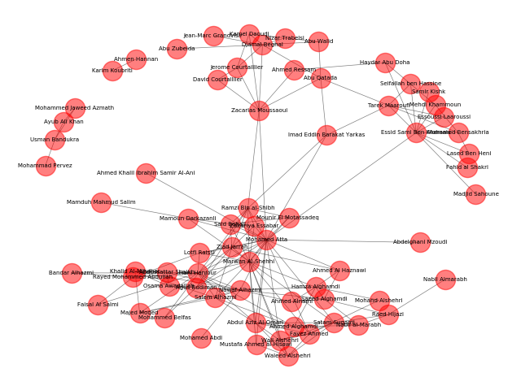

# Çizit Analizi (Graph Analysis)

Ağ yapı kavramı sosyal ağ sitelerinin arkadaşlık ağı analizi sayesinde
yaygınlaştı, fakat sosyal ağlar diğer alanlarda da kullanılabilir.

Ağ analizi için güzel bir paket NetworkX. Basit bir ağ üzerinde görelim,

```python
import networkx as net
import networkx.generators.small
g = networkx.generators.small.krackhardt_kite_graph()
print (g.number_of_edges())
net.draw(g,with_labels=True)
plt.savefig('net1.jpg')
```

```text
18
```


Gruplararası Bağlantılar

Sosyal ağ araştırmalarında bir kavram büyük gruplar arasında bağlantı
oluşturan insanların önemli olabileceği, çünkü bu kişiler iki ya da
daha fazla grup arasındaki iletişimi sağlıyor. Aracı Merkezlik
(Betweenness Centrality) ölçütü bu durumu saptamak için bulunmuş.  BC
ölçümünün algoritmasını [1, sf. 52]'de görebiliriz.

NetworkX ile bu hesap,

```python
print (net.betweenness_centrality(g))
```

```text
{0: 0.023148148148148143, 1: 0.023148148148148143, 2: 0.0, 3:
0.10185185185185183, 4: 0.0, 5: 0.23148148148148148, 6:
0.23148148148148148, 7: 0.38888888888888884, 8: 0.2222222222222222, 9:
0.0}
```

şeklinde yapılabilir.

PageRank

Bu algoritma Google ile ünlendi, ve kavram olarak aslında BC'nin tam
tersi.  PR için önemli olan "gelen" bağlantılar, ya da düğümleri Web
sayfaları bağlantıları Web bağlantıları olarak düşünürsek Web'i
rasgele gezen herhangi birinin o sayfaya gelme olasılığı. Tabii bunun
için sadece o sayfaya tek geçişle (tıklamayla) gelişi değil, o
sayfanın tüm komşularına gelişi, ve onların komşularına da gelişi, vs.
şekilde zincirleme şekilde bakabilecek, hesaplayabilecek bir algoritma
bu. PR konusunu daha önce işlemiştik [2]. 

```python
print (net.pagerank(g))
```

```text
{0: 0.1019196696364895, 1: 0.10191966963648949, 2:
0.07941791239513805, 3: 0.14714751310196444, 4: 0.07941791239513805,
5: 0.12890718095072973, 6: 0.12890718095072973, 7:
0.09524765350111203, 8: 0.0856958031065524, 9: 0.05141950432565652}
```

Klikler

Birbiri ile ic baglantilari cok ama dis baglantilari az olan gruplara
verilen isim. Detayli tanim icin [1, sf. 79].

```python
cliques = list(net.find_cliques(g))
print (cliques)
```

```text
[[8, 9], [8, 7], [3, 0, 1], [3, 0, 2, 5], [3, 4, 1, 6], [3, 6, 5], [7, 5, 6]]
```

Triad

```python
import triadic
census, node_census = triadic.triadic_census(g)
print (census)
```

```text
{'003': 22.0, '012': 0, '102': 63, '021D': 0, '021U': 0,
'021C': 0, '111D': 0, '111U': 0, '030T': 0, '030C': 0, '201': 24,
'120D': 0, '120U': 0, '120C': 0, '210': 0, '300': 11}
```

9/11 teröristlerinin ağ yapısı altta. M. Atta kişinin merkezi bir figür olduğu
görülüyor.

```python
import csv ## we'll use the built-in CSV library
import networkx as net
fig, axs = plt.subplots(1, 1, figsize=(10, 8))
in_file=csv.reader(open('9_11_edgelist.txt', newline='\n'), delimiter=',')
g=net.Graph()
for line in in_file:
    g.add_edge(line[0],line[1],weight=line[2],conf=line[3])

for n in g.nodes: g._node[n]['flight']='None'

attrb=csv.reader(open('9_11_attrib.txt'))
for line in attrb:
    g._node[line[0]]['flight']=line[1]
net.draw_random(g,ax=axs,with_labels=True,font_size=15,width=2,alpha=0.6)
plt.savefig('net2.jpg')
```



Kaynaklar

[1] Kouznetsov, *Social Network Analysis for Startups*

[2] Bayramli, Lineer Cebir,
    *Google İşleyişi, Ekonomi Teknikleri, Özdeğer, Özvektörler*

