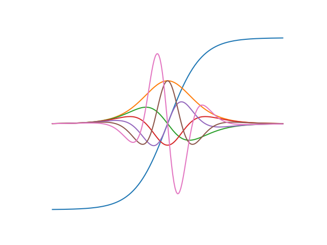
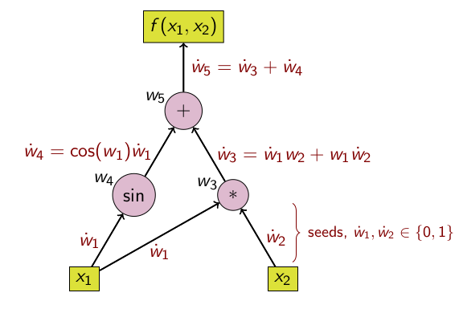
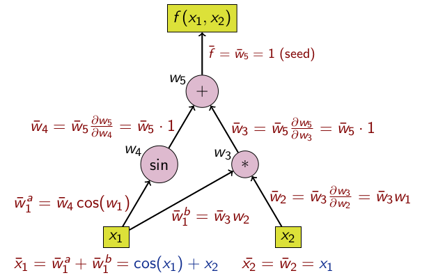
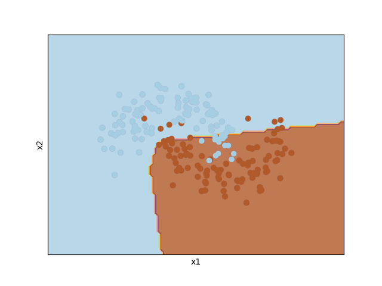

# Otomatik Türev Almak (Automatic Differentiation -AD-)

Matematikte türev hesaplamanın birkaç yöntemi var; bunlardan birincisi
Calculus'ta öğretilen sembolik türevdir, diğeri sayısal türevdir. AD üçüncü
bir yöntem sayılıyor, özellikle programlama bağlamında çok faydalı bir
özelliği var, *herhangi* bir yazılım fonksiyonunu alıp, bir veri
noktası bağlamında, o fonksiyonun içinde ne türlü temel diğer fonksiyonlar
olursa olsun onu kendi türevini hesaplayacak hale çevirebiliyor. Burada kod
değişimi söz konusu, değişim işlem anında dinamik, ya da kaynak kod
seviyesinde derleme öncesi yapılabiliyor. Fonksiyon `if`, `goto`
gibi dallanma, koşulsal ifadeler içeriyor olabilir (ama bu ifadeler
üzerinden türev alınan değişkene bağlı olmamalıdır), $\cos,\sin$ gibi
trigonometrik ifadeler, polinomlar, $\max,\min$ gibi gayrı-lineer ifadeler,
ya da başka herhangi temel hesapları kullanıyor olabilir, son derece
çetrefil bir takım hesaplar zincirleme yapılıyor olabilir. Eğer hesap
deterministik bir şekilde yapılabiliyorsa (aynı girdiler için hep aynı
değer hesaplanıyor) AD onu alıp kendi türevini hesaplayabilen hale
çevirebiliyor.

Bu son derece kuvvetli bir özellik. Pek çok optimizasyon yaklaşımında,
mesela gradyan inişi (gradient descent) minimum noktası bulmak için bir
fonksiyonun türevine ihtiyaç duyar. Eğer $f(x)$ basit, analitik olarak
türevi kolay alınabilen bir fonksiyon ise problem yok. Olmadığı zaman AD
iyi bir çözümdür.

İkiz Sayılar (Dual Numbers)

Lineer Cebir'de ikiz sayılar reel sayıları genişleterek yeni bir öğe
eklerler, bu öğe üzerinde tanımlanan cebire göre $\epsilon^2 = 0$
olmalıdır, ve $\epsilon \ne 0$ [1]. Bu yeni öğe üzerinden her sayı artık
ikiz şekilde belirtilir, $z = a + b\epsilon$, ki $a,b$ birer reel
sayıdır. Herhangi bir matematikçi kendisine göre bir cebir tanımlayabilir,
bunu biliyoruz, operasyonlar tablolar ile tanımlanır, vs.  $\epsilon^2=0$
kavramı hayali sayılardaki $i^2 = -1$'e benzetilebilir. İkiz sayıları
yazılımda depolamak için $(a,b)$ gibi bir çift yeterlidir.

AD amacı için $x \mapsto x + \dot{x} \epsilon$ olarak tanımlarız, ki
$\epsilon^2 = 0, d \ne 0$ kullanıyoruz, yani $x$'in kırpılmış Taylor
açılımını yapıyoruz, ayrıca bu tanım bir ikiz sayı. Taylor açılımını
hatırlarsak bir fonksiyon için herhangi bir $a$ noktasında
$f(t) = f(a) + f'(a)(t-a)$ idi, bu durumda fonksiyon $x$'in kendisi,
$f(x)=x$, açılım $x$ noktasında yani $a=x$, ve $f(x)=x=f(x)+f'(x)(x-a)$, ve
$=x+f'(x)(x-a)$. Açılımdaki $x-a$ bir $\epsilon$ olarak görülebilir, zaten
normal Taylor açılımı için de çok ufak bir adım olarak hesaplanmalıdır, ve
bu ufak adımın karesi de normal olarak sıfıra yaklaşır. Gerçi $a=x$ olunca
$x-a=0$ olur ama yeni bir cebir yaratarak bu problemden kurtulmak
istemişler herhalde.

Bu şekilde oluşan aritmetiğe bakarsak,

$$ 
x + y \mapsto 
(x+\dot{x}\epsilon)  + (y+\dot{y}\epsilon) = 
xy + x\dot{y}\epsilon + \dot{x}y\epsilon +
\underbrace{\dot{x}\dot{y}\epsilon^2}_{=0} 
$$
$$  = xy + (x\dot{y} + \dot{x}y)\epsilon  $$

Başka bir işlem

$$ xy \mapsto (x+\dot{x}\epsilon)(y+\dot{y}\epsilon)  =
(xy) + (x\dot(y) + \dot{x}y)\epsilon
$$

Bir diğeri

$$ -(x+\dot{x}\epsilon) = -x - \dot{x}\epsilon$$ 

Ya da

$$ 
\frac{1}{x+\dot{x}\epsilon} = 
\frac{1}{x} - \frac{\dot{x}}{x^2}\epsilon, \quad (x \ne 0)
$$

Dikkat edilirse $\epsilon$'nin katsayıları sembolik türev sonuçlarını
birebir takip ediyorlar. Bu sonuçtan istifade edebiliriz, fonksiyonları şu
şekilde tanımlarız,

$$ 
g(x + \dot{x}d) = g(x) + g'(\dot{x}d) 
\qquad (1)
$$

O zaman mesela $\sin,\cos$ ya da pek çok diğer fonksiyonu $g$ olarak
alırsak onları şu şekilde açmak mümkün

$$ sin(x + \dot{x}d) = sin(x) + cos(x)\dot{x}d $$

$$ \cos(x+\dot{x}d) = \cos(x) - \sin(x)\dot{x}d$$

$$ e^{x+\dot{x}d} = e^x + e^x \dot{x}d$$

$$ \log(x + \dot{x}d) = \log(x) + \frac{\dot{x}}{x}d , \quad x \ne 0$$

Zincirleme Kanunu, yani $f(g(..))$, üstteki açılımı da kullanarak beklenen
şekilde işleyecek,

$$ f(g(x + \dot{x}\epsilon)) =  f(g(x) + g'(x)\dot{x}\epsilon)  $$

$$ = f(g(x)) + f'(g(x))g'(x)\dot{x} \epsilon$$

Dikkat edersek $\epsilon$'un katsayısı aynen önce olduğu gibi
$f(g(..))$'nin türevini taşıyor. 

Demek ki ikiz sayıları türevi alınmamış fonksiyon sonucu ve türevi alınmış
değeri program içinde taşıyan veri yapıları olarak kullanabiliriz. O
zaman temel bazı operasyonları (fonksiyonları) (1) formülasyonuna uyacak
şekilde kodlarsak, bu temel fonksiyonları içeren her türlü diğer
kompozisyon Zincir Kuralı üzerinden aynı şekilde türev alınmamış ve alınmış
değerler taşınıyor olacaktır.

Örnek

Elimizde 

$$ f(x_1,x_2) = x_1x_2 + \sin(x_1)$$

var. İkiz sayılar ile açalım, 

$$ f(x_1 + \dot{x_1}\epsilon_1, x_1 + \dot{x_2}\epsilon_2) = 
(x_1 + \dot{x_1}\epsilon_1)(x_2 + \dot{x_2}\epsilon_2) \sin(x_1+x_1\dot{x_1}\epsilon_1)
$$

$$ 
= x_1x_2 + (x_2 + \cos(x_1))\dot{x_1}\epsilon_1 
+ x_1\dot{x_2}\epsilon_2
+ x_2\dot{x_1}\epsilon_1
$$

ki $\epsilon_1\epsilon_2 = 0$. 

O zaman bir fonksiyonun türevini hesaplamak için türevi bu standart olmayan
şekilde hesaplayıp, ilgilendiğimiz türevin değişkenini 1 olarak atarsak,
istediğimiz türev değerini $x=a$ noktasında elde ederiz.

Eğer kod için düşünürsek, değişim şu şekilde olacak (soldaki orijinal
program, sağdaki ikiz program) 


Yazılmış kodu görelim,

```python
def f(x1, x2):
    w3 = x1 * x2
    w4 = np.sin(x1)
    w5 = w3 + w4
    return w5

print ('f', f(10, 20))
h = 0.01
print (u'sayısal türev', (f(10+h, 20)-f(10, 20)) / h)
```

```text
f 199.45597888911064
sayısal türev 19.163662538264248
```

```python
def f(x1, x2, dx1, dx2):
    df = [0.,0.]
    w3 = x1 * x2
    dw3 = dx1*x2 + x1*dx2    
    w4 = np.sin(x1)
    dw4 = np.cos(x1) * dx1    
    w5 = w3 + w4
    dw5 = dw3 + dw4
    df[0] = w5
    df[1] = dw5
    return df
print ('AD', f(10,20,1,0))
```

```text
AD [np.float64(199.45597888911064), np.float64(19.160928470923547)]
```

Sembolik olarak türevin $\frac{\partial f}{\partial x_2} = x_1$ olduğunu biliyoruz Üstteki program aynı 
sonuca erişti. 

AD için Python'da `autograd` paketi otomatik türev alınmasını
sağlar. Önceki örnek için

```python
import autograd.numpy as np
from autograd import elementwise_grad
from autograd import grad

def f(x1, x2):
    w3 = x1 * x2
    w4 = np.sin(x1)
    w5 = w3 + w4
    return w5

fg = grad(f)
print (fg(10.0,20.0))
```

```text
19.160928470923547
```

Dikkat: üstteki kod daha önce gösterilen ile aynı tek bir fark ile,
`numpy` kütüphanesini `autograd`'den alıyoruz, çünkü o üzerinde
AD değişimi yapılmış olan `numpy`.

Gradyanı, yani $x$'in her boyutu için kısmi türevi içeren vektörel olarak
türevleri görmek istiyorsak, 

$$ \nabla f = \left[\begin{array}{r}
\frac{\partial f}{\partial x_1} \\
\frac{\partial f}{\partial x_2}
\end{array}\right]$$

Yani bir değişkeni sabit tutup diğerini değiştirince elde edilen türev
bu. Şimdi $x_0 = \left[\begin{array}{cc}10&20\end{array}\right]$ noktasında
gradyan değerini hesaplayalım,

```python
def f(xvec):
    w3 = xvec[0] * xvec[1]
    w4 = np.sin(xvec[0])
    w5 = w3 + w4
    return w5

fg = grad(f)
x0 = np.array([10.,20.])
print (fg(x0))
```

```text
[19.16092847 10.        ]
```

Daha bitmedi: Altta $\tanh$'nin türevini alıyoruz, hatta türevin türevi,
onun türevi derken arka arkaya 6 defa zincirleme türev alıyoruz, AD bana
mısın demiyor (!).

```python
import autograd.numpy as np
import matplotlib.pyplot as plt
from autograd import elementwise_grad

def tanh(x):
    return (1.0 - np.exp(-x))  / (1.0 + np.exp(-x))

d_fun      = elementwise_grad(tanh)       # 1. Türev
dd_fun     = elementwise_grad(d_fun)      # 2. Türev
ddd_fun    = elementwise_grad(dd_fun)     # 3. Türev
dddd_fun   = elementwise_grad(ddd_fun)    # 4. Türev
ddddd_fun  = elementwise_grad(dddd_fun)   # 5. Türev
dddddd_fun = elementwise_grad(ddddd_fun)  # 6. Türev

x = np.linspace(-7, 7, 200)
plt.plot(x, tanh(x),
         x, d_fun(x),
         x, dd_fun(x),
         x, ddd_fun(x),
         x, dddd_fun(x),
         x, ddddd_fun(x),
         x, dddddd_fun(x))

plt.axis('off')
plt.savefig("autodiff_03.png")
```



İleri, Geri

Üstte gösterilen teknik aslında ileri mod (forward mode) AD olarak
biliniyor. Hesap ağaçı üzerinde göstermek gerekirse,



Geriye gitmek te mümkün, buna geri mod'u (reverse mode) ismi veriliyor. 



Yapay Sinir Ağları ve AD

Derin Öğrenim için oluşturulan YSA'lar oldukca çetrefil olabilir (bkz {\em
  Yapay Sinir Ağları (Neural Networks)}), $\max$, evrişim (convolution)
gibi operasyonlar içeriyor olabilirler. Bu ağları eğitmek için türevi elle
hesaplamak çok zordur. Fakat AD tüm gereken gradyanları hesaplar, ve
hataları geriye yayarak (backpropagation) ağırlıkları optimal değerlerine
getirir. Şimdi basit YSA'nın AD ile kodlamasını görelim [4],

```python
import autograd.numpy as np  # Thinly wrapped version of numpy
from autograd import grad
import matplotlib.pyplot as plt
from sklearn import datasets, linear_model

np.random.seed(0)
X, y = datasets.make_moons(200, noise=0.20)
n = 2 # dimensionality
points_per_class =100 
num_classes = 2 
m = points_per_class*num_classes   
    
fig = plt.figure()
plt.scatter(X[:, 0], X[:, 1], c=y, s=40, cmap=plt.cm.Spectral)
plt.xlim([-1,1])
plt.ylim([-1,1])

h = 0.05
x_min, x_max = X[:, 0].min() - 1, X[:, 0].max() + 1
y_min, y_max = X[:, 1].min() - 1, X[:, 1].max() + 1
xx, yy = np.meshgrid(np.arange(x_min, x_max, h),
                     np.arange(y_min, y_max, h))

X_test = np.c_[xx.ravel(), yy.ravel()]

def plot_model(scores):
    Z = scores.reshape(xx.shape)
    plt.contourf(xx, yy, Z, cmap=plt.cm.Paired, alpha=0.8)
    plt.scatter(X[:, 0], X[:, 1], c=y, cmap=plt.cm.Paired)
    plt.xlabel('x1')
    plt.ylabel('x2')
    plt.xlim(xx.min(), xx.max())
    plt.ylim(yy.min(), yy.max())
    plt.xticks(())
    plt.yticks(())

# ReLU: "rectified linear unit" nonlinearity
def relu(z):
    return np.maximum(0, z)

# Initialize parameters randomly
h  = 10 # size of hidden layer
W1 = 0.01 * np.random.randn(n,h)
b1 = np.zeros((1,h))
W2 = 0.01 * np.random.randn(h,num_classes)
b2 = np.zeros((1,num_classes))

# Select hyperparameters
iters      = 1000
eta  = 1e-0
lambda_val = 1e-3 # regularization strength

def compute_loss(params):
    W1, b1, W2, b2 = params
    
    hidden = relu(np.dot(X, W1) + b1)
    scores = np.dot(hidden, W2) + b2
    exp_scores = np.exp(scores)
    probs = exp_scores / np.sum(exp_scores, axis=1, keepdims=True)
    logprob_correct_class = -np.log(probs[range(m),y])
    data_loss = np.sum(logprob_correct_class)/m    # cross-entropy
    reg_loss = 0.5 * lambda_val * (np.sum(W1*W1) + np.sum(W2*W2))    
    return data_loss + reg_loss

# This is the gradient of the entire feedforward training
gradient = grad(compute_loss)

# Gradient descent loop
for i in range(iters):  
    # Print diagnostic
    loss = compute_loss((W1, b1, W2, b2))      
    if i % 200 == 0: print ("iteration %d: loss %f" % (i, loss))
    dW1, db1, dW2, db2 = gradient((W1, b1, W2, b2))    
    # perform a parameter update
    W1 += -eta * dW1
    b1 += -eta * db1
    W2 += -eta * dW2
    b2 += -eta * db2
    
def predict(X):
    hidden = relu(np.dot(X, W1) + b1)
    scores = np.dot(hidden, W2) + b2
    pred = np.argmax(scores, axis=1)
    return pred

plot_model(predict(X_test))
plt.savefig('autodiff_01.png')
```

```text
iteration 0: loss 0.693097
iteration 200: loss 0.291406
iteration 400: loss 0.277980
iteration 600: loss 0.276930
iteration 800: loss 0.276666
```



Daha basit bir örnek görelim, mesela Lojistik Regresyon. Elle türev almaya
gerek kalmadan çok basit bir şekilde tahmin, kayıp fonksiyonları üzerinden
direk rasgele gradyan inişi ile kodlamayı yapabiliyoruz.

```python
import autograd.numpy as np
from autograd import grad
from autograd.util import quick_grad_check
from builtins import range

def sigmoid(x):
    return 0.5*(np.tanh(x) + 1)

def logistic_predictions(weights, inputs):
    return sigmoid(np.dot(inputs, weights))

def training_loss(weights):
    preds = logistic_predictions(weights, inputs)
    label_probabilities = preds * targets + (1 - preds) * (1 - targets)
    return -np.sum(np.log(label_probabilities))

inputs = np.array([[0.52, 1.12,  0.77],
                   [0.88, -1.08, 0.15],
                   [0.52, 0.06, -1.30],
                   [0.74, -2.49, 1.39]])
targets = np.array([True, True, False, True])


training_gradient_fun = grad(training_loss)
weights = np.array([0.0, 0.0, 0.0])
for i in range(100):
    weights -= training_gradient_fun(weights) * 0.1
print("Trained loss:", training_loss(weights))
print (weights)
```

```text
Trained loss: 0.04217239766807184
[ 1.40509236 -0.37749486  2.34249055]
```

Kaynaklar

[1] Wikipedia, *Dual number*, 
    [https://en.wikipedia.org/wiki/Dual_number](https://en.wikipedia.org/wiki/Dual_number)

[2] Berland, *Automatic Differentiation*, 
    [http://www.robots.ox.ac.uk/~tvg/publications/talks/autodiff.pdf](http://www.robots.ox.ac.uk/~tvg/publications/talks/autodiff.pdf)

[3] Griewank, *Evaluating Derivatives*

[4] Sheldon, *Neural Net Example*, 
    [https://people.cs.umass.edu/~sheldon/teaching/cs335/lec/neural-net-case-studies.html](https://people.cs.umass.edu/~sheldon/teaching/cs335/lec/neural-net-case-studies.html)

[5] Ghaffari, *Automatic Differentiation*, 
    [http://www.cas.mcmaster.ca/~cs777/presentations/AD.pdf](http://www.cas.mcmaster.ca/~cs777/presentations/AD.pdf)

[6] Autograd, [https://github.com/HIPS/autograd](https://github.com/HIPS/autograd)


