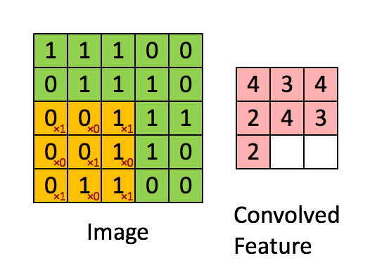
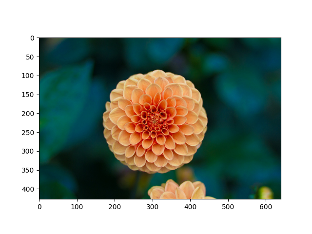

# Evrişimsel Ağlar, Derin Öğrenim (Convolutional Nets -Convnet-, Deep Learning)

Convnet'ler YSA'lara yeni bazı özellikler ekledi. Öncelikle gizli katman
artık ikiden daha fazla derinliğe gidebiliyor. Diğer bir ek, mesela veriye
ilk dokunan katmanı sadece evrişim operasyonu için kullanmak. 

Evrişim boyutu önceden belli bir matrisi tüm veri üzerinde kaydırarak sonuç
değerleri kaydetmekten ibaret, görüntü işlemede yapılan çoğu filtreleme
işlemi bir evrişim operasyonu. Mesela 2 x 2 boyutlu bir filtre matrisini
tüm veri üzerinde kaydırırız, her kaydırma sırasında o bölgede filtre
matrisini değerler ile çarparız, sonucu hatırlarız, çarpılan bölgeye
tekabül eden sonuç matrisinde sonucu yazarız. Evrişim matrisi 

$$ A = \left[\begin{array}{rrr}
1 &  0 & 1 \\ 0 & 1 & 0 \\ 1 & 0 & 1
\end{array}\right]$$

olsun, görüntü (image) üzerinde çarpım işlemini adım adım gösterelim,
sonuç evriştirilmiş özellik (convolved feature) içinde,





Üstteki örnekte kaydırma (stride) sayısı 1. Kaydırma sayısı evrişim
matrisini uyguladıktan sonra bir sonraki işlem için kaç hücre yana
kayacağımızı kontrol eder. Evrişim matrisinin boyutunun, kaydırma sayısının
sonuç matrisin boyutu üzerinde etkileri olacaktır. 5 x 5 matrisi üzerinden
1 kaydırma ile 3 x 3 evrişim uygulayınca 3 x 3 boyutunda bir sonuç elde
ettik. 

Görüntü işlemede yatay, dikey çizgileri daha belirgin hale getiren, ortaya
çıkartan türden, bilinen filtreler vardır, diğer türler de mevcuttur.  Fakat
derin öğrenim bu evrişim matrisinin içeriğini, ayrıca onu diğer katmanlara
bağlayan ağırlıkları da otomatik olarak öğrenir!  Çünkü eğer çizgileri
ortaya çıkartmak öğrenme işleminin bütününe fayda getiriyorsa öğrenme
süreci sırasında evrişim matrisinin değerleri o değerlere
evrilir. Evrişimleri bu şekilde ağda kullanmanın convnet'lerin alt
katmanlarındaki hata düzeltme işlemini daha rahatlaştırdığı keşfedildi.

Bir yenilik aktivasyon için ReLu (doğrultan lineer ünite -rectified linear
unit-) kullanmak, bir diğer katman "aşağı örnekleme (downsampling)'' yapan
katman, mesela $2 \times 2$ içindeki bir pencere içine düşen öğelerin
maksimumunu almak. Bir başkası "veri atma (dropout)'' katmanı, veri içinde
bir katmandan gelen bağlantıların bir kısmı (dışarıdan ayarlanabilir)
rasgele şekilde yoksayılıyor, bu durumda model elde kalanlar ile uydurma
işlemini yapmaya uğraşacak, böylece modelde aşırı uygunluk (överfitting)
problemlerinden kaçınılmış olunuyor, potansiyel olarak daha sağlam (robust)
bir modelin ortaya çıkması sağlanıyor.


Böyle gide gide bir derin ağ yapısı ortaya çıkartmış oluyoruz. 

Not: Çoğunlukla evrişim tabakasından sonra ReLu aktviyasyonuna bağlantı
yapılır, çünkü eğer aktivasyon olmasa, evrişim sonuçta ağırlıklarla çarpım
ve toplam işlemidir, ve bu bir lineer işlemdir, o zaman tüm NN'in işlemi
ardı ardına matrislerin çarpımı olarak ta görülebilirdi, ve bu bir lineer
işlem olurdu, o zaman NN gayri-lineerligi modelleyemezdi.

TensorFlow ile Evrişim

Şimdi TF kullanarak evrişim yapalım, iki resim üzerinde örneği görelim,

```python
import numpy as np
import tensorflow as tf
from sklearn.datasets import load_sample_images

# Load sample images
dataset = np.array(load_sample_images().images, dtype=np.float32)
batch_size, height, width, channels = dataset.shape
print 'veri tensor boyutu', dataset.shape
plt.imshow(dataset[0,:,:,:] / 255.) 
plt.savefig('conv-9.png')
plt.imshow(dataset[1,:,:,:] / 255.) 
plt.savefig('conv-10.png')
```

```
veri tensor boyutu (2, 427, 640, 3)
```




Bu iki resmi bir "tensor'' yani çok boyutlu matris içine koyduk, resmin
boyutları 640 x 427, eğer tek bir resme bakıyor olsaydık (640,427) boyutlu
tek bir matris ile iş yapabilirdik, fakat TF ardı ardına gelen verileri de
bir tensorun ayrı boyutları olarak kabul edebiliyor. Ayrıca tensorun son
boyutu renk kanalları, üç tane var, RGB renk sistemı için kırmızı (red),
yeşil (green) ve mavi (blue) için. Böylece üstteki tensor boyutlarını elde
ettik.

Evrişim için 4 tane filtre tanımlayacağız. Bu filtrelerin içeriğinin elle
burada tanımlayacağız, yapay öğrenme bağlamında bu içerik eğitim sırasında
otomatik olarak öğrenilir, şimdi örnek amaçlı olarak filtre değerlerini biz
atıyoruz. Ayrıca istediğimiz kadar filtre tanımlayabilirdik, yapay
öğrenmede istenen o'dur ki bu filtreler doğru değerlere doğru evrilir, her
filtre görüntünün değişik yerlerine, biçimlerine odaklanmaya
başlayabilirler. 

```python
in_channels = channels
out_channels = 4
W = np.zeros(shape=(7, 7, in_channels, out_channels), dtype=np.float32)
W[:, 3, :, 0] = 1  # yatay cizgi
W[3, :, :, 1] = 1  # dikey cizgi
W[5, :, :, 2] = 1  
W[2, :, :, 3] = 1  

X = tf.placeholder(tf.float32, shape=(None, height, width, channels))
convolution = tf.nn.conv2d(X, W, strides=[1,2,2,1], padding="SAME")
with tf.Session() as sess:
    output = sess.run(convolution, feed_dict={X: dataset})
    print u'evrişimden gelen tensor', output.shape
```

```
evrişimden gelen tensor (2, 214, 320, 4)
```

Filtrelerin ilkinde mesela sadece yatay bir çizgi var, bu filtre yatay
piksellerin bir ortalamasını alıyor olacak, vs. Parametrelerden kaydırma
yatay 2 dikey olarak tanımlı, o zaman her imaj kabaca yarısına inecek,
dolgu (padding) için `SAME` diyerek dolgu yap demişiz, yani kaydırma
olmasaydı giren çıkan tensor aynı olurdu. Peki 3 tane ayrı kanal bilgisine
ne oldu? Görüntü boyutlar azalarak (320,214) oldu, 4 tane filtre çıkışı
var, 2 tane imaj. Kanallar üzerinden bir toplam alındı, yani ayrı kanal
bilgisi artık yok. Bu aslında istenen bir şey çünkü bir görüntünün R,G,B
kanalları üzerinde ayrı ayrı irdeleme yapmak istemeyiz, sınıflama, karar
mekanizmasını tüm imaj üzerinden işletmek isteriz.

Sonuçlar altta, iki tane filtre sonucu örnek olarak seçildi.

```python
def plot_image(image):
    plt.imshow(image, cmap="gray", interpolation="nearest")
    plt.axis("off")
    
image_index = 0; feature_map_index = 2
plot_image(output[image_index, :, :, feature_map_index])
plt.savefig('conv-out-%d-%d.png' % (image_index,feature_map_index))

image_index = 1; feature_map_index = 1
plot_image(output[image_index, :, :, feature_map_index])
plt.savefig('conv-out-%d-%d.png' % (image_index,feature_map_index))
```


Cok kanallı durum için açık olmadıysa bir daha vurgulayalım, evrişim
katmanı evrişim operatörünü imaj ya da başka bir tensor üzerinde
gezdirirken üzerinde olduğu tüm girdi tabakalarını, tüm kanalları
kapsayacak şekilde, çarpıp sonucu tek bir öğeye götürür. Bu çarpım için
herhalde kanallar bir şekilde düzleştirilip ağırlıklara eşleniyor. Neyse,
filtreyi kaydırdıkça çarpım sonucu çıktıda farklı öğeler elde edilir, ve bu
bize tek boyutlu bir sonuç kesiti verir. Eğer birden fazla evrişim filtresi
uygularsak onların sonuçları farklı sonuç tabakaları olarak diğer
tabakaların üzerinde istiflenir.


Mesela altta 20x30 boyutlu ve 3 kanallı bir tensor girdimiz olsun, bu
tensorlardan kaç tane olduğunu şimdilik tanımlamadık (mini girdi yığınında
yani). Şimdi girdi üzerinde 16 tane filtre gezdiriyoruz, ve 20x30x16
boyutlu çıktı elde ediyoruz.

```python
import tensorflow as tf
tf.reset_default_graph()
input = tf.placeholder(tf.float32, [None, 20, 30, 3])
conv_layer = tf.layers.conv2d(inputs=input, filters=16, 
                              kernel_size=(2,2), padding='same')
print conv_layer
```

```
Tensor("conv2d/BiasAdd:0", shape=(?, 20, 30, 16), dtype=float32)
```

MNIST

Altta MNIST verisini işleyebilen mimarının TF olmadan pür Python kullanan
kodunu görüyoruz. Bu yapı ünlü YSA araştırmacısı Yann LeCun'un LeNet adı
verilen mimarisi. Veri [5]'ten indirilebilir.

```python
"""Convolutional neural net on MNIST, modeled on 'LeNet-5',
http://yann.lecun.com/exdb/publis/pdf/lecun-98.pdf"""
from __future__ import absolute_import
from __future__ import print_function

import autograd.numpy as np
import autograd.numpy.random as npr
import autograd.scipy.signal
from autograd import grad
from builtins import range
import gzip
import struct
import array

convolve = autograd.scipy.signal.convolve

class WeightsParser(object):
    """A helper class to index into a parameter vector."""
    def __init__(self):
        self.idxs_and_shapes = {}
        self.N = 0

    def add_weights(self, name, shape):
        start = self.N
        self.N += np.prod(shape)
        self.idxs_and_shapes[name] = (slice(start, self.N), shape)

    def get(self, vect, name):
        idxs, shape = self.idxs_and_shapes[name]
        return np.reshape(vect[idxs], shape)

def make_batches(N_total, N_batch):
    start = 0
    batches = []
    while start < N_total:
        batches.append(slice(start, start + N_batch))
        start += N_batch
    return batches

def logsumexp(X, axis, keepdims=False):
    max_X = np.max(X)
    return max_X + np.log(np.sum(np.exp(X - max_X), axis=axis, keepdims=keepdims))

def make_nn_funs(input_shape, layer_specs, L2_reg):
    parser = WeightsParser()
    cur_shape = input_shape
    for layer in layer_specs:
        N_weights, cur_shape = layer.build_weights_dict(cur_shape)
        parser.add_weights(layer, (N_weights,))

    def predictions(W_vect, inputs):
        """Outputs normalized log-probabilities.
        shape of inputs : [data, color, y, x]"""
        cur_units = inputs
        for layer in layer_specs:
            cur_weights = parser.get(W_vect, layer)
            cur_units = layer.forward_pass(cur_units, cur_weights)
        return cur_units

    def loss(W_vect, X, T):
        log_prior = -L2_reg * np.dot(W_vect, W_vect)
        log_lik = np.sum(predictions(W_vect, X) * T)
        return - log_prior - log_lik

    def frac_err(W_vect, X, T):
        return np.mean(np.argmax(T, axis=1) != \
                       np.argmax(predictions(W_vect, X), axis=1))

    return parser.N, predictions, loss, frac_err

class conv_layer(object):
    def __init__(self, kernel_shape, num_filters):
        self.kernel_shape = kernel_shape
        self.num_filters = num_filters

    def forward_pass(self, inputs, param_vector):
        # Input dimensions:  [data, color_in, y, x]
        # Params dimensions: [color_in, color_out, y, x]
        # Output dimensions: [data, color_out, y, x]
        params = self.parser.get(param_vector, 'params')
        biases = self.parser.get(param_vector, 'biases')
        conv = convolve(inputs, params,
                        axes=([2, 3], [2, 3]),
                        dot_axes = ([1], [0]),
                        mode='valid')
        return conv + biases

    def build_weights_dict(self, input_shape):
        # Input shape : [color, y, x] (don't need to know number of data yet)
        self.parser = WeightsParser()
        self.parser.add_weights('params', (input_shape[0], self.num_filters)
                                          + self.kernel_shape)
        self.parser.add_weights('biases', (1, self.num_filters, 1, 1))
        output_shape = (self.num_filters,) + \
                       self.conv_output_shape(input_shape[1:], self.kernel_shape)
        return self.parser.N, output_shape

    def conv_output_shape(self, A, B):
        return (A[0] - B[0] + 1, A[1] - B[1] + 1)

class maxpool_layer(object):
    def __init__(self, pool_shape):
        self.pool_shape = pool_shape

    def build_weights_dict(self, input_shape):
        # input_shape dimensions: [color, y, x]
        output_shape = list(input_shape)
        for i in [0, 1]:
            assert input_shape[i + 1] % self.pool_shape[i] == 0, \
                "maxpool shape should tile input exactly"
            output_shape[i + 1] = input_shape[i + 1] / self.pool_shape[i]
        return 0, output_shape

    def forward_pass(self, inputs, param_vector):
        new_shape = inputs.shape[:2]
        for i in [0, 1]:
            pool_width = self.pool_shape[i]
            img_width = inputs.shape[i + 2]
            new_shape += (pool_width, img_width // pool_width)
        result = inputs.reshape(new_shape)
        return np.max(np.max(result, axis=2), axis=3)

class full_layer(object):
    def __init__(self, size):
        self.size = size

    def build_weights_dict(self, input_shape):
        # Input shape is anything (all flattened)
        input_size = np.prod(input_shape, dtype=int)
        self.parser = WeightsParser()
        self.parser.add_weights('params', (input_size, self.size))
        self.parser.add_weights('biases', (self.size,))
        return self.parser.N, (self.size,)

    def forward_pass(self, inputs, param_vector):
        params = self.parser.get(param_vector, 'params')
        biases = self.parser.get(param_vector, 'biases')
        if inputs.ndim > 2:
            inputs = inputs.reshape((inputs.shape[0], np.prod(inputs.shape[1:])))
        return self.nonlinearity(np.dot(inputs[:, :], params) + biases)

class tanh_layer(full_layer):
    def nonlinearity(self, x):
        return np.tanh(x)

class softmax_layer(full_layer):
    def nonlinearity(self, x):
        return x - logsumexp(x, axis=1, keepdims=True)

def mnist():
    def parse_labels(filename):
        with gzip.open(filename, 'rb') as fh:
            magic, num_data = struct.unpack(">II", fh.read(8))
            return np.array(array.array("B", fh.read()), dtype=np.uint8)

    def parse_images(filename):
        with gzip.open(filename, 'rb') as fh:
            magic, num_data, rows, cols = struct.unpack(">IIII", fh.read(16))
            return np.array(array.array("B", fh.read()),
                            dtype=np.uint8).reshape(num_data, rows, cols)

    base_dir = '/home/burak/Documents/Dropbox/Public/data'
    train_images = parse_images(base_dir + '/train-images-idx3-ubyte.gz')
    train_labels = parse_labels(base_dir + '/train-labels-idx1-ubyte.gz')
    test_images  = parse_images(base_dir + '/t10k-images-idx3-ubyte.gz')
    test_labels  = parse_labels(base_dir + '/t10k-labels-idx1-ubyte.gz')

    return train_images, train_labels, test_images, test_labels
    

if __name__ == '__main__':
    np.random.seed(0)
    # Network parameters    
    L2_reg = 1.0
    input_shape = (1, 28, 28)
    layer_specs = [conv_layer((5, 5), 6),
                   maxpool_layer((2, 2)),
                   conv_layer((5, 5), 16),
                   maxpool_layer((2, 2)),
                   tanh_layer(12),
                   tanh_layer(84),
                   softmax_layer(10)]

    # Training parameters
    param_scale = 0.1
    learning_rate = 1e-3
    momentum = 0.9
    batch_size = 500
    num_epochs = 50

    # Load and process MNIST data
    print("Loading training data...")
    add_color_channel = lambda x : x.reshape((x.shape[0], 1, x.shape[1], x.shape[2]))
    one_hot = lambda x, K : np.array(x[:,None] == np.arange(K)[None, :], dtype=int)
    train_images, train_labels, test_images, test_labels = mnist()
    train_images = add_color_channel(train_images) / 255.0
    test_images  = add_color_channel(test_images)  / 255.0
    train_labels = one_hot(train_labels, 10)
    test_labels = one_hot(test_labels, 10)

    test_sampler = np.random.permutation(len(test_labels))[:100]
    train_sampler = np.random.permutation(len(train_labels))[:1000]
    train_images = train_images[train_sampler]
    train_labels = train_labels[train_sampler]
    test_images = test_images[test_sampler]
    test_labels = test_labels[test_sampler]
    N_data = train_images.shape[0]
    
    from sklearn import neighbors
    train_images_3 = np.reshape(train_images, (1000,28*28))
    test_images_3 = np.reshape(test_images, (100,28*28))
    clf = neighbors.KNeighborsClassifier()
    clf.fit(train_images_3,train_labels)
    res = clf.predict(test_images_3)
    res2 = [np.all(x) for x in (res==test_labels)]
    print ('KNN')
    print ( np.sum(res2) / 100.)
    
    # Make neural net functions
    N_weights, pred_fun, loss_fun, \
        frac_err = make_nn_funs(input_shape, layer_specs, L2_reg)
    loss_grad = grad(loss_fun)

    # Initialize weights
    rs = npr.RandomState()
    W = rs.randn(N_weights) * param_scale

    print("    Epoch      |    Train err  |   Test error  ")
    def print_perf(epoch, W):
        test_perf  = frac_err(W, test_images, test_labels)
        train_perf = frac_err(W, train_images, train_labels)
        print("{0:15}|{1:15}|{2:15}".format(epoch, train_perf, test_perf))

    # Train with sgd
    batch_idxs = make_batches(N_data, batch_size)
    cur_dir = np.zeros(N_weights)

    for epoch in range(num_epochs):
        print_perf(epoch, W)
        for idxs in batch_idxs:
            grad_W = loss_grad(W, train_images[idxs], train_labels[idxs])
            cur_dir = momentum * cur_dir + (1.0 - momentum) * grad_W
            W -= learning_rate * cur_dir

    np.savetxt('W',W)
```

```
Loading training data...
KNN
0.82
    Epoch      |    Train err  |   Test error  
              0|           0.92|           0.93
              1|           0.89|            0.9
              2|          0.798|           0.82
              3|          0.767|           0.74
              4|          0.727|           0.67
              5|          0.678|           0.71
              6|          0.627|           0.65
              7|          0.563|           0.56
              8|          0.503|           0.53
              9|          0.445|           0.49
             10|          0.418|           0.45
             11|          0.357|           0.41
             12|           0.34|           0.39
             13|          0.322|           0.36
             14|          0.287|           0.32
             15|          0.258|           0.29
             16|          0.261|           0.33
             17|          0.232|           0.27
             18|          0.216|           0.25
             19|          0.206|           0.25
             20|          0.188|           0.22
             21|          0.171|           0.23
             22|          0.164|           0.23
             23|          0.175|           0.25
             24|          0.121|           0.21
             25|          0.152|           0.19
             26|          0.169|           0.21
             27|          0.145|           0.18
             28|          0.119|           0.22
             29|          0.099|           0.18
             30|          0.073|           0.16
             31|          0.083|            0.2
             32|          0.066|           0.17
             33|           0.06|           0.18
             34|          0.052|           0.18
             35|          0.042|           0.18
             36|          0.034|           0.16
             37|          0.034|           0.18
             38|          0.027|           0.17
             39|          0.023|           0.15
             40|          0.026|           0.18
             41|          0.017|           0.16
             42|          0.012|           0.16
             43|          0.011|           0.14
             44|          0.011|           0.12
             45|          0.008|           0.14
             46|          0.009|           0.13
             47|          0.007|           0.15
             48|          0.006|           0.12
             49|          0.005|           0.15
```

Tarih

Convnet'lerin son zamanlarda başarılı olmaya başlamasında bazı etkenler
şunlar: en önemlisi araştırmacıların dışbükey olmayan kayıp
fonksiyonlarından (non-convex loss functions) korkmadan (!) onların
minimumunu rasgele gradyan inişi üzerinden bulabilmeye
başlamaları. Convnet, HMM, Gaussian karışımlar gibi pek çok alanda dışbükey
olmayan bir durum vardır, hatta bir bakıma ciddi her yapay öğrenim alanında
bu durum ortaya çıkar. Bu optimizasyon problemi rasgele gradyan inişi ile
çözülmeye başlandı. Gerçi rasgele gradyan inişi çok basit bir yöntemdir,
fakat araştırmacılar yıllarca bu yöntemi dışbükey olmayan yerlerde
kullanmadılar çünkü yakınsama (convergence) garantileri teorik olarak
mümkün değildi. Kıyasla bir dışbükey fonksiyonun minimumuna varmak doğru
yöntemler ile garantidir. Fakat son araştırmalara göre rasgele gradyan
inişi ile optimizasyon eğitim verisi üzerinden yakınsama garantisi olmasa
bile test verisi üzerinde bazı garantilerin olduğu ortaya çıktı, ki test
skoru eğitim skorundan daha önemli.

Bir diğer gelişme ağ yapısında gizli katmandaki nöron sayısını
genişletince, minimum noktasının pek çok yerde ortaya çıkabilmesi, ve bu
noktaların birbiriyle aşağı yukarı aynı olması. Yani gradyan inişi bu
noktalardan birini bulduğunda iş bitmiş sayılabiliyor. Ayrıca çok boyut
olunca yerel minima'da takılıp kalmadan bir yan boyuta atlayıp önümüzdeki
tepenin etrafından dolaşabilme şansı ortaya çıkıyor [4].

Ek bir gelişme herhangi bir yazılım fonksiyonun türevinin alınabilmesini
sağlayan otomatik türev alma (automatic differentiation) tekniğinin
yaygınlaşması, ki bu teknik çetrefil nöron fonksiyonları içerebilen
convnet'ler için faydalı oldu. Not: dikkat otomatik türev ile {\em her
  türlü} fonksiyon hatta `if, while` komutları içeren bir kod
parçasının bile türevi alınabiliyor (bkz [2] yazısı). Türevler önemli çünkü
gradyan inişi minimuma gidebilmek için türev kullanmalı. Üstteki kodda
dikkat çekmiş olabilir, sinir ağında aslında yaptığımız tek hesap ileri
doğru beslemeli (feed-forward) olan hesap; her veri noktası için ağın
başından başlayarak girdi / işlem / sonuçları ardı ardına bir sonraki
katmana aktarıyoruz, otomatik türev pek çok katmanlı bu işlemlerin türevini
alarak bize o gidişin yaptığı tahminlerin hatasını düzeltmek için gidilmesi
gereken gradyan yönünü veriyor.

Bazı negatifler: Convnet'lerin eğitimi hızlı değildir, ciddi kullanımlar
için GPU, ya da paralel CPU kullanmak şart. Ayrıca convnet'lerin bir fark
yaratması için oldukça çok veriye ihtiyaçları var, normal ölçek veri
ortamında diğer yaklaşımlar da convnet'ten çok daha kötü değiller. Bir
diğeri bir YSA'nın, yapı olarak, istatistiki bir anlamının olmaması: Bir ağ
yapısı var, fakat bu ağın tamamının olasılıksal olarak irdelenmesi mümkün
değil. Kıyasla bir GMM bir olasılığı temsil eder, bu sebeple yaptığı
hesapların mesela güven aralığını hesaplamak mümkündür. Diğer yanda mesela
tıbbi bir uygulama bağlamında YSA bir tahmin yapınca bundan "ne kadar emin
olduğu'' sorusunun direk cevabı alınamıyor. Bu alanda araştırmalar var
tabii, ilginç bazı buluşlar bunu mümkün kılabilir.

Kaynaklar

[2] Bayramlı, Bilgisayar Bilim, *Otomatik Türev*

[3] *Machine learning algorithms*, https://github.com/rushter/MLAlgorithms

[4] LeCun, *Who is Afraid of Non-Convex Loss Functions?*, [https://youtu.be/8zdo6cnCW2w](https://youtu.be/8zdo6cnCW2w)

[5] LeCun, *MNIST Verisi*, [http://yann.lecun.com/exdb/mnist](http://yann.lecun.com/exdb/mnist)


