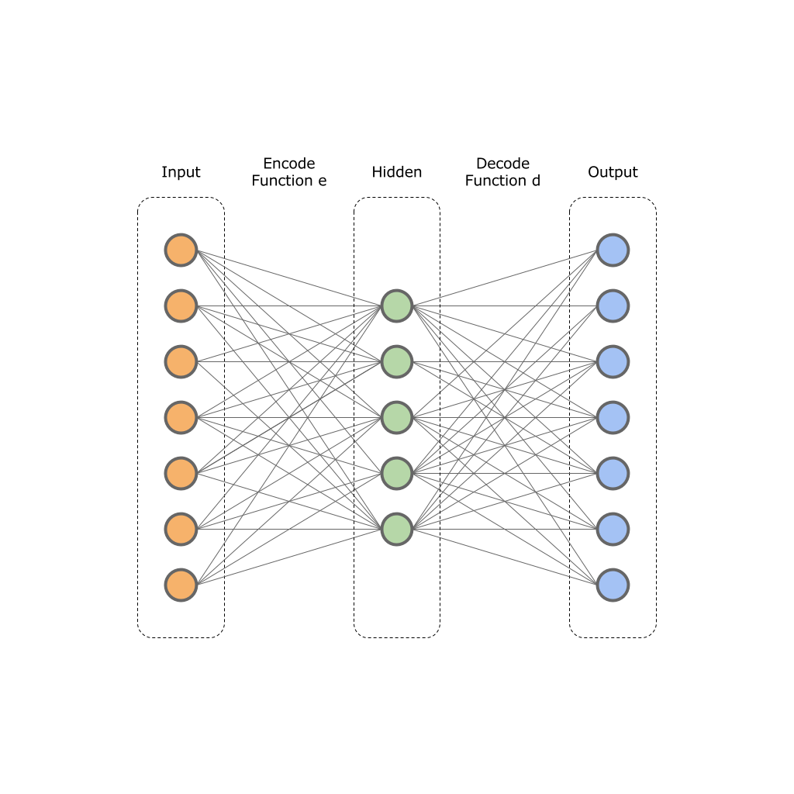
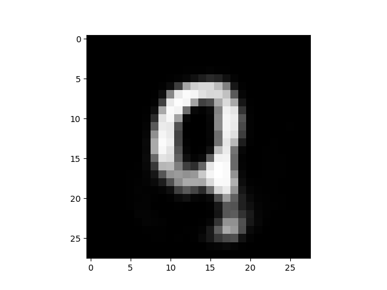

# Ozkodlama (Autoencoding)




```python
from keras.datasets import mnist
(x_train, _), (x_test, _) = mnist.load_data()
x_test = x_test.astype('float32') / 255.

import mnist_autoenc

autoencoder, encoder, decoder = mnist_autoenc.get_model()
encoder.load_weights("mod-enc-1.h5")
decoder.load_weights("mod-dec-1.h5")
```

```python
tmp = x_test[1090, :, :].reshape(1,28*28)
encoded = encoder.predict(tmp)
print (encoded.shape)
decoded = decoder.predict(encoded).reshape(28,28)
print (decoded.shape)
plt.imshow(decoded)
plt.gray()
plt.savefig('autoenc_01.png')
```

```text
(1, 32)
(28, 28)
```




```python
import mnist_autoenc_rnn_simple

seq_autoencoder, encoder = mnist_autoenc_rnn_simple.get_model()
seq_autoencoder.load_weights("mod-rnn-autoenc-sim.h5")
encoder.load_weights("mod-rnn-enc-sim.h5")
```

```python
decoded = seq_autoencoder.predict(tmp).reshape(28,28)
print (decoded.shape)
plt.imshow(decoded)
plt.gray()
plt.savefig('autoenc_03.png')
```

```text
(28, 28)
```


```python
import mnist_lstm_vae

vae, enc, gen = mnist_lstm_vae.create_lstm_vae(mnist_lstm_vae.input_dim, 
    timesteps=mnist_lstm_vae.timesteps, 
    batch_size=mnist_lstm_vae.batch_size, 
    intermediate_dim=mnist_lstm_vae.latent_dim,
    latent_dim=mnist_lstm_vae.latent_dim,
    epsilon_std=1.)
vae.load_weights('mnist_lstm_vae.h5')
enc.load_weights('mnist_lstm_enc.h5')
    
```

```text
Tensor("input_14:0", shape=(?, 28, 28), dtype=float32)
Tensor("lstm_10/TensorArrayReadV3:0", shape=(?, 30), dtype=float32)
Tensor("lambda_2/add:0", shape=(?, 30), dtype=float32)
Tensor("repeat_vector_3/Tile:0", shape=(?, 28, 30), dtype=float32)
Tensor("lstm_11/transpose_1:0", shape=(?, ?, 30), dtype=float32)
Tensor("lstm_12/transpose_1:0", shape=(?, ?, 28), dtype=float32)
Tensor("input_15:0", shape=(?, 30), dtype=float32)
Tensor("repeat_vector_4/Tile:0", shape=(?, 28, 30), dtype=float32)
Tensor("lstm_11_1/transpose_1:0", shape=(?, ?, 30), dtype=float32)
```

```python
import random
idx = 400
print (tmp.shape)
x_test_tmp = x_test[idx]
res = vae.predict(x_test_tmp.reshape((1, 28, 28)))

plt.figure()
ax = plt.subplot(1, 2, 1)
pixels = res.reshape((28, 28))
plt.imshow(pixels)
plt.gray()
ax = plt.subplot(1, 2, 2)
plt.imshow(x_test_tmp)
plt.gray()

plt.savefig('autoenc_04.png')
```

```text
(1, 28, 28)
```


Kaynaklar

[1] https://blog.keras.io/building-autoencoders-in-keras.html

[2] adverserial autoencoder keras https://github.com/bstriner/keras-adversarial/blob/master/examples/example_aae.py

[3] https://towardsdatascience.com/intuitively-understanding-variational-autoencoders-1bfe67eb5daf

[4] https://hsaghir.github.io/data_science/denoising-vs-variational-autoencoder/

[5] Doersch, Tutorial on Variational Autoencoders, https://arxiv.org/pdf/1606.05908.pdf

[6] Goodfellow, Adversarial Autoencoders, https://arxiv.org/pdf/1511.05644.pdf

[7] What is Adversarial Autoencoder?, https://www.quora.com/What-is-Adversarial-Autoencoder


