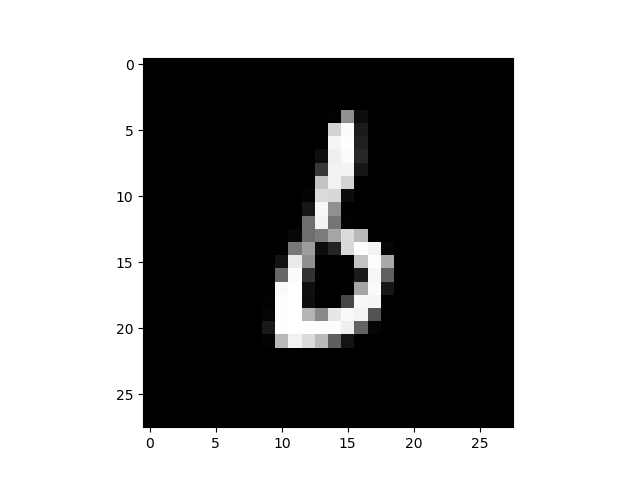

# Uretici Hasimsal Aglar (Generative Adverserial Networks)

```python
import mnist_dcgan
generator, discriminator, gan = mnist_dcgan.get_model()
generator.load_weights("dcgan_generator_epoch_50.h5")
noise = np.random.randn(1,200)
pixels = generator.predict(noise).reshape((28,28))
print (pixels.shape)

plt.imshow(pixels)
plt.gray()
plt.savefig('gan_01.png')
```

```text
(28, 28)
```




Kaynaklar

[1] https://towardsdatascience.com/gans-n-roses-c6652d513260

[2] https://towardsdatascience.com/gan-by-example-using-keras-on-tensorflow-backend-1a6d515a60d0


