# Ders 1

Bir vektör, yön ve büyüklük (magnitude) bilgisi taşıyan bir ölçümdür.

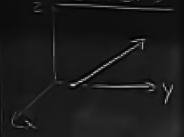

Üç boyutlu bir ortamda x,y,z eksenleri üzerinden üstteki gibi bir vektör
çizebiliriz. Bu vektör (ok istikametinde) bir yönü gösteriyor, ayrıca bir
büyüklüğü de var. Vektörü bu eksenler içinde çizince, o vektörü her
eksendeki yansımasına göre temsil edebilirim demektir; x yönünde ne kadar
değişim var, y yönünde ne kadar var, vs. gibi.

Bir vektörün temsili için, $\vec{A}$ gibi üzerinde ok işareti bulunan bir büyük
harf kullanacağız. Bazı kitaplarda üzerinde ok bulunan bir harf yerine koyu
puntoyla yazılmış harfler kullanılıyor olabilir. Bunun tarihi sebepleri vardır,
eski zamanlarda matbaalarda basım yaparken koyu harf (bold) yapmak üzerine ok
çizmekten çok daha kolaydı.

Biraz önce de bahsettiğimiz gibi, bir vektörü bir uzayın eksenleri üzerindeki
yansı-maları yardımıyla ifade edebiliriz. Mesela aşağıda gösterildiği gibi, üç
boyutlu uzayda tanımlanmış bir vektörü bu şekilde uzayın eksenleri üzerine
yaptığı yansı-maların büyüklüğü ve uzayın eksenlerinin yönünü belirten bir
birimlik birim vektörler yardımıyla gösterebiliriz.

$$
\vec{A} = a_1 \hat{i} + a_2 \hat{j} + a_3 \hat{k}
$$

Burada dikkat etmemiz gereken şey, birim vektörler sadece kendi eksenlerinin
yönünü göstermek üzere tasarlanmıştır. Bu yüzden diğer eksenler üzerinde hiç bir
değişime (büyüklüğe) sahip değillerdir. Mesela $\hat{i}$, x ekseni üzerinde 1
adımlık bir büyüklüktür, diğerlerinde değişim sıfırdır, gelin $\hat{i} = < 1,0,0 >$
ifadesinin gerçekten doğru olup olmadığına bakalım. Eğer $< 2,3,5 >$
vektörünü eksenlerine ayırıp göstermek isteseydik, bunu $2\cdot< 1,0,0 > +
3\cdot< 0,1,0 > + 5\cdot< 0,0,5 >$ ile yapabilirdik. Toplam $< 2,3,5 >$ olacaktır.

Hazır bahsetmişken, diğer vektör notasyonu şu şekildedir

$$
\vec{A} = < a_1, a_2, a_3 >
$$

Farketmiş olacağınız gibi $a_1$, $a_2$ ve $a_3$, sırasıyla $\vec{A}$
vektörünün $\hat{i}$, $\hat{j}$, $\hat{k}$ eksenleri üzerindeki yansımalarının
büyüklüğüdür. Bir vektörün büyüklüğü $|\vec{A}|$ ifadesi ile gösterilir, ki
$|\cdot|$ işareti mutlak değer gösterimi (absolute value) ile aynıdır. Bir
vektörün büyüklüğü skaler (scalar) bir sayı ile ifade edilir. Bir vektörün yönü,
ki bu bazen $dir(\vec{A})$ ile gösterilir, vektörün birim vektör haline
getirilmesi ile elde edilir, yani vektörün tüm öğelerinin vektörün büyüklüğüne
bölünmesi ile. Bu yapılınca vektör büyüklük bilgisi kaybolmuş olur tabii, geriye
sadece yön bilgisi kalır.

Herhangi bir uzayda $P$ ve $Q$ gibi iki nokta arasındaki bir vektörü $\vec{PQ}$
olarak gösterebilirim. Fakat bu illa ki $P$'den başlayıp $Q$'ye gelmem gerektiği
anlamına gelmez, aynı yönde aynı uzunlukta paralel bir başka vektör de
$\vec{PQ}$ vektörü olabilir. Bu derste pek çok vektörü orijin (başlangıç)
noktasından (0,0,0) başlayarak çizeceğiz, fakat aslında bunu yapmak zorunda
değiliz. Fakat görsel ifadenin basit olması açısından öyle yapacağız.

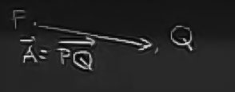

Şimdi alttaki grafiğe bakalım. Uzunluk nedir?


Yani $\vec{A} = <3,2,1>$'in uzunluğu nedir?  Bu uzunluğu bulmak için ikinci bir
resme bakalım:

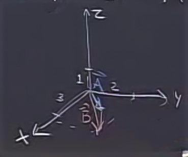

Burada $\vec{A}$'nin xy düzlemine olan yansımasını $\vec{B}$ olarak düşünelim,
$\vec{A}$'nın sadece xy değerlerini taşıyan hali yani $\vec{B} = <3,2>$.  Şimdi
$\vec{A}$ ve $\vec{B}$'nin ikisinin de üzerinde olduğu ve bir tarafı z ekseni
olan bir kesiti hayal edelim. Bu kesiti ayırıp alttaki gibi çizebiliriz:

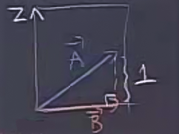

Görüldüğü gibi $\vec{A}$ ve $\vec{B}$ arasında z bağlamında 1 birimlik bir fark
var, bu da $\vec{A} = <3,2,1>$ vektörünü $\vec{B}=<3,2>$ olarak alırken dahil
etmediğimiz 1 değeri.

Üstteki grafiğe bakarsak Pisagor teoremini kullanarak $|\vec{A}|$'yi
bulabiliriz. Pisagor teoremine göre $|\vec{A}|^2 = |\vec{B}|^2 + 1^2$'dir. Demek
ki problem $|\vec{B}|$'nin hesaplanmasına indirgendi,çünkü onu bulursak üstteki
formülden $|\vec{A}|$'yi da bulabiliriz. Peki $|\vec{B}|$ nedir? Onu da xy
düzleminde / kesitinde Pitagor kullanarak bulabiliriz, $|\vec{B}|$, x ekseninde
3 birimlik, y ekseninde ise 2 birimlik adımlar içeriyor.

Pisagor Teoremi'ni kullanarak

$$
|\vec{B}| = \sqrt{3^2 + 2^2} = \sqrt{13}
$$

$$
|\vec{A}| = \sqrt{|\vec{B}|^2 + 1^2} = \sqrt{13 + 1} = \sqrt{14}
$$

Genel formülü ise

$$
|\vec{A}| = \sqrt{a_1 ^2 + a_2^2 + a_3^2}
$$

olarak ifade edebiliriz.Vektörlerle başka ne yapabiliriz? Onları ekleyebiliriz, 
veya ölçeklendirebiliriz. 

Ekleme işlemi

Elimizde $\vec{A}$ ve $\vec{B}$ var ise, $\vec{A} + \vec{B}$ 
işlemini gerçekleştirebiliriz. 

Bu noktada şu yorumu eklemek gerekir, vektörler iki farklı dünyada
yaşarlar, bir tanesi geometrik dünya, diğeri cebirsel dünya. Bu sebeple 
vektörler hakkındaki her sorunun iki
cevabı vardır, geometrik ve cebirsel cevap.

Geometrik cevap ile başlayalım: 

Diyelim ki iki vektörü aynı noktadan çıkacak şekilde çizmiştim

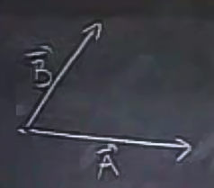

Toplamı almak için $\vec{B}$'yi alıp hareket ettiririm (başlangıç bitiş
noktalarının önemli olmadığını söylemiştik), ve $\vec{A}$'nin bittiği
noktadan başlamasını sağlarım.

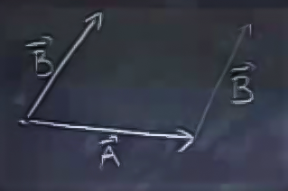

Bunun bir paralelogram ortaya çıkardığını görüyoruz. 

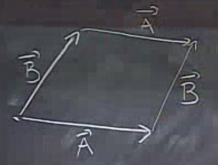

Eğer bu paralelogramın köşegenini hesaplarsak / çizersek, işte bu köşegen
$\vec{A} + \vec{B}$ olarak nitelenebilir. 

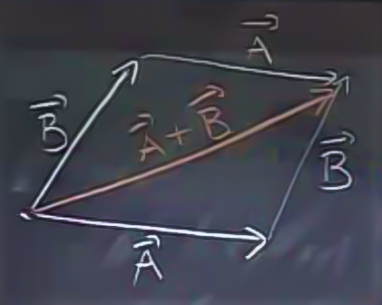

Yani bu iki vektörün birbiriyle toplanması için öteleme işlemini ister $\vec{A}$
vektörü için, isterse de $\vec{B}$ vektörü için yapayım sonuç
farketmeyecektir. Böylece, $\vec{A} + \vec{B} = \vec{B} + \vec{A}$ eşitliğini
grafiksel olarak böylece doğrulamış olduk.

Sayısal olarak düşünürsek:

$$ \vec{A} = < a_1, a_2, a_3 > $$

$$ \vec{B} = < b_1, b_2, b_3 > $$

$$ \vec{A} + \vec{B} = < a_1+b_1, a_2+b_2, a_3+b_3 > $$

Ölçeklendirme(sayı ile çarpım) işlemi

Eğer elimizde $\vec{A}$ var ise, $2 \cdot \vec{A}$ işlemi ile vektörün aynı 
yöndeki büyüklüğünü iki katına çıkarabiliriz. Ya da $0.5$ ile çarparak 
büyüklüğünü yarıya düşürebiliriz veya negatif bir sayı ile çarparak vektörün 
yönünü tersine çevirip büyüklüğünü de negatif sayının büyüklüğü kadar 
değiştirebiliriz.


Şimdi vektörler hakkında birkaç yeni operasyon daha öğreneceğiz. Bu
operasyonlar geometriye daha detaylı şekilde başlayınca işimize
yarayacak. İleride göreceğimiz gibi, geometri vektörler üzerinden
yapılabilir, hatta pek çok açıdan, geometri ile çalışmak için vektörlerin
"en uygun dil'' olduğu söylenebilir. Özellikle fonksiyonlar konusuna
gelince vektörler kullanmak, diğer tür geometrik işlemleri kullanmaktan
daha faydalı olacak. 

Tüm bunlar bir tür "dil'', bir şeyin farklı bir şekillerde temsilinden
ibaret, vektörler, fonksiyonlar, vs. gibi temsili objeler. Fakat farklı 
gösterimler, bazı şeyleri kolaylaştırmak açısından kolaylık sağlayabiliyor.

Nokta çarpım (Skalar çarpım)

Nokta çarpım, iki veya daha fazla vektörün bileşenlerinin çarpılıp toplanması
ile bulunur. Burada dikkat edilmesi gereken nokta, bu işlemin sonucunun bir
vektör değil, skaler bir sayı olmasıdır. Nokta çarpımın matematiksel gösterimi
ise

$$
\vec{A} \cdot \vec{B} = \sum a_ib_i = a_1b_1 + a_2b_2 + a_3b_3 
\qquad (1)
$$

şeklindedir.

Peki bu operasyon niye kullanılır? Neye yarar? Aslında biraz garip bir
operasyon. Bu sorunun cevabını vermeden önce belki de geometrik olarak ne
yaptığını göstermek daha iyi olur. Aşağıdaki eşitlik nokta çarpımın geometrik
bir özelliğidir.

$\theta$ iki vektör arasındaki açı olmak üzere;

$$
\vec{A} \cdot \vec{B} = |\vec{A}||\vec{B}| \cos \theta 
\qquad (2)
$$

gibi bir eşitlik sağlanabilir.

Fakat dediğimiz gibi, bu operasyon çok suni bir şey gibi duruyor. Niye bu
çetrefilli operasyonu yapalım ki? Şu sebepten ki, elde ettiğimiz sonuç,
$\vert\vec{A}\vert \vert\vec{B}\vert \cos \theta$ eşitliği üzerinden bize hem
büyüklükler anlamında, hem de açısal anlamda bilgi veriyor. Ekstra bir bonus ise
bu hesabın çok kolay yapılabilmesi, iki vektörün öğelerini teker teker
birbiriyle çarpınca noktasal çarpım sonucunu elde ediyoruz.

Fakat noktasal çarpım ve büyüklük, açı içeren formül arasında ne bağlantı var?
Matematikte bu tür bağlantıların ispatlanması gerekir. Üstteki eşitlik bir
teoridir (bu dersin ilk teorisi!). Hadi bunu ispatlayalım. İçinde büyüklük ve
açı içeren geometrik tanım ne anlama geliyor? Alttaki ifade üzerinden kontrol
edelim. Eğer $\vec{A}$'nin kendisi ile noktasal çarpımını alsak ne olurdu?

$$\vec{A} \cdot \vec{A} = |A|^2\cos(0) = |A|^2$$

$\cos(0)$ çünkü, vektörün kendisi ile arasındaki açı sıfırdır. Sıfırın $\cos$
değeri 1'dir. Peki diğer formu kullansaydık ne olacaktı? O zaman

$$ a_1^2 + a_2^2 + a_3^2 $$

ifadesini elde edecektik, ki bu ifade $|A|^2$'ye eşittir çünkü büyüklüğün
tanımını hatırlarsak

$$ |\vec{A}| = \sqrt{a_1 ^2 + a_2^2 + a_3^2} $$

iki tarafın da karesini alırsak

$$ |\vec{A}|^2 = a_1 ^2 + a_2^2 + a_3^2$$

bu ifadenin sağ tarafı noktasal çarpımdan elde ettiğimizle aynı. 

Peki ya elimizde iki farklı vektör varsa? 

İddiam şu ki formül (1) ve (2) arasındaki ilişkiyi Kosinüs Kanunu ile
kurabilirim. Bu kanunu yazalım

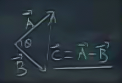

$$ |\vec{C}|^2 = |\vec{A}|^2 + |\vec{B}|^2 - 2|\vec{A}||\vec{B}|\cos(\theta) $$

Bu arada, eğer bu formülü 

$$ |\vec{C}|^2 = |\vec{A}|^2 + |\vec{B}|^2  $$

şeklinde yazsaydım Pisagor Formülü olurdu, fakat burada Pisagor kullanamayız
çünkü arada dik açı yok, o yüzden üçüncü terimi eklemek gerekti.

İspata gelirsek,

Şöyle başlayalım

$$ |\vec{C}|^2 = \vec{C} \cdot \vec{C} $$

Bunun doğru olduğunu biliyoruz, daha önce ispatladık. $\vec{C}$'nin
üstteki tanımını yerine koyarsak

$$ = (\vec{A} - \vec{B}) \cdot (\vec{A} - \vec{B})  $$

Şimdi bu çarpımı açarak 4 terimin toplamı haline getirmek isterdik, ama bunu
yapabilir miyiz? Daha bilmiyoruz, noktasal çarpım operasyonunu daha yeni gördük,
gizemli yeni bir operasyon bizim için şu anda. Fakat cevap evet, çünkü formül
(1)'deki tanıma bakarsak, açılım yapmak için bize gerekli şekilde davranacağını
görebiliriz. O zaman

$$  =
\vec{A}\cdot\vec{A} - 
\vec{A}\cdot\vec{B} -
\vec{B}\cdot\vec{A} +
\vec{B}\cdot\vec{B} 
$$

İlk ve son terimin karşılığını hemen yazabiliriz, alttaki ilk iki terim
onlar zaten

$$ = |\vec{A}|^2 + |\vec{B}|^2 - 2\vec{A} \cdot \vec{B} $$

Geride kalan en son terimi, son formül içindeki $\cos$ içeren formül ile
karşılaştıralım, aralarındaki tek fark, bir tarafta $2\vec{A} \cdot \vec{B}$
diger tarafta $2|\vec{A}||\vec{B}|\cos(\theta)$ olması.. Ve formül (2)'deki
eşitlikten bu iki terimin de aslında birbirine eşit olduğunu biliyoruz.

Uygulamalar

1) Uzunlukları ve açıları (özellikle açıları) hesaplamak.

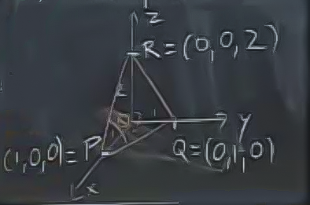

Diyelim ki sol alt köşedeki $\theta$ açısını hesaplamak istiyoruz. 

$$ \vec{PQ} \cdot \vec{PR} = |\vec{PQ}||\vec{PR}|\cos(\theta)  $$

Bu formülde bilinmeyen $\theta$, özellikle de $\cos(\theta)$. Uzunlukları
hesaplayabiliriz, formülünü biliyoruz. Noktasal çarpımları da hesaplayabiliriz,
onun da basit bir formülü var.

$$ \cos\theta = \frac{\vec{PQ} \cdot \vec{PR}}{|\vec{PQ}||\vec{PR}|}$$

$$ = \frac{<-1,1,0>\cdot<-1,0,2>}
{  \sqrt{(-1)^2+1^2+0^2 }\sqrt{(-1)^2+0^2+2^2 }   } 
$$

$$ = \frac{1+0+0}{\sqrt{2}\sqrt{5}}  $$

$$ = \frac{1}{\sqrt{10}} $$

$$ \theta = \cos^{-1}(\frac{1}{\sqrt{10}}) \approx 71.5^o $$

Burada $\vec{A}\cdot\vec{B}$'nin işaretine (artı mı eksi mi) dikkat
çekelim. 

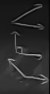

Eğer işaret $>0$ ise, o zaman $\theta < 90^o$ (üstteki resimdeki
1. figür). 

Eğer işaret $=0$ ise, o zaman $\theta = 90^o$ (üstteki resimdeki
2. figür). 

Eğer işaret $<0$ ise, o zaman $\theta > 90^o$ (üstteki resimdeki
3. figür). 

Yani noktasal çarpım bir nevi iki vektörün ne kadar "üst üste bindiğini''
ölçüyor. Üstte 1. şekilde birinci vektör ikinci vektör üzerine az da olsa binmiş 
bir şekilde görünüyor, bu yüzden de işaret pozitif. 2. şekilde ise birinci 
vektör ikincisine tam dik konumda bu yüzden üzerine binme gibi bir durum söz 
konusu değil. 3. şekilde ise birinci vektör ikinci vektörün negatif yönü üzeri 
binmiş görünüyor, bu yüzden de işareti negatif. 

2) Diklik Kontrolu

Diyelim ki size 

$$ x + 2y + 3z = 0 $$

şeklinde bir formül verildi. Sizce bu formül nasıl bir şekli ortaya çıkartır?
Cevaplar:


   * Boş küme (çözüm yok)
   * Tek bir nokta
   * Bir çizgi
   * Bir düzlem
   * Bir küre (sphere)
   * Üsttekilerin hiçbiri
   * Bilmiyorum


Düşünün.. 

Doğru cevap:  Bir düzlem. 

Bunun bir düzlem olduğunu nasıl görebiliriz? Vektörler burada yardımımıza
yetişiyor. Bir $\vec{OP}$ vektörü olduğunu düşünelim, ki bu vektörün öğeleri
$x,y,z$ olsun.


$x + 2y + 3z = 0$ ifadesine bakarsak, onu bir noktasal çarpım olarak temsil
edebiliriz, bu çarpım $\vec{OP}$ ile "bir başka vektörün'' çarpımı
olabilir. Bu diğer vektör $\vec{A} = <1,2,3>$ vektörü olabilir. O zaman şu koşul

$$ x + 2y + 3z = 0 $$

Aslında

$$ \vec{OP} \cdot \vec{A} = 0 $$

olarak ta temsil edilebilir.

Peki üstteki noktasal çarpımın sıfıra eşit olması ne demektir? Vektörler
hakkındaki bilgilerimizi kullanırsak, sıfıra eşitlik bu iki vektörün
birbirine dik olması anlamına gelir. O zaman düzlemin ne olduğu hakkında
bir ek bilinç daha geliştirmiş olduk. Elde ettiğimiz orijin noktasından
geçen bir düzlem ve $\vec{A}$'ya dik. 

Fakat elimize geçen özgün (unique) bir düzlem mi yoksa seçeneklerden sadece
biri mi? Çünkü şu akla gelebilir: eğer bir vektör başlangıç olarak herhangi
bir yere konulabiliyorsa, o zaman herhangi bir yerden başlayabilecek
$< 1,2,3 >$'ye dik olmak ne demektir?

İyi bir soru fakat şunu hatırlayalım: Başlangıç değişse de yön değişmiyor,
yani farklı düzlemler olsa bile birbirlerine paralel olurlar. Ayrıca $x +
2y + 3z = 0$ formülüne iyi bakalım, bu formülü sağlayan pek çok $x,y,z$
değerlerinden birisi $0,0,0$ değeridir, yani orijin noktasıdır. O zaman bu
düzlem orijinden kesinlikle geçmeli, ki bu mümkün düzlemleri tek bir
seçeneğe indiriyor.

Düzlem formülü $ax + by + cz + d= 0$ diye gider, bizim formülde $d=0$. Bu
form orijinden geçme zorundadır.

Bu düzlemi grafiklemek için alttaki programı kullanalım

```python
# plotting ax + by + cz = 0, or (ax + by)/-c  = z 
# ax + by + cz = 0 formulu grafikliyoruz ya da, (ax + by)/-c  = z 

from mpl_toolkits.mplot3d import Axes3D

fig = plt.figure()
ax = Axes3D(fig)
X = np.arange(-10, 10, 0.5)
Y = np.arange(-10, 10, 0.5)
X, Y = np.meshgrid(X, Y)

Z = (X + 2*Y ) / -3

surf = ax.plot_surface(X, Y, Z,rstride=1, cstride=1, alpha=0.3, color='yellow')

ax.set_xlim3d(-10, 10)
ax.set_ylim3d(-10, 10)
ax.set_zlim3d(0, 30)

x, y, z = np.array([[-10,0,0],[0,-10,0],[0,0,0]])
u, v, w = np.array([[10,0,0],[0,10,0],[0,0,10]])
ax.quiver(x,y,z,u,v,w,arrow_length_ratio=0.1, color="black")

plt.savefig('plane.jpg')
```


