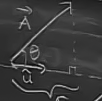
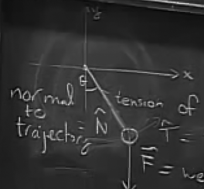
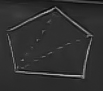
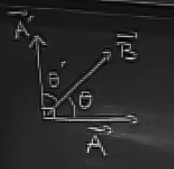
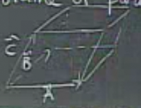
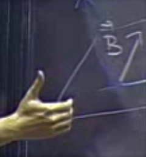
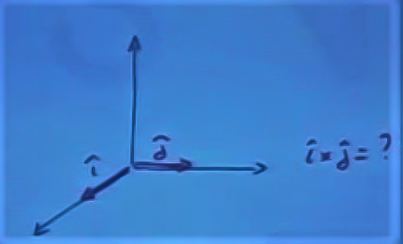
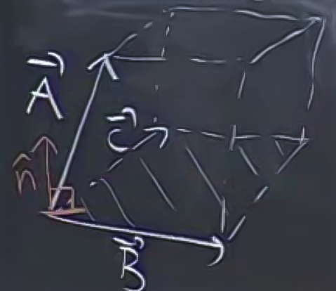

# Ders 2

Önceki derste vektörler üzerine uygulanan iki farklı işlemi gördük. Şimdi üçüncü
bir işlem olan, bir $\vec{A}$ vektörünün $\vec{u}$ vektörü ile aynı yönde olan
bileşenlerini (components) bulmayı öğreneceğiz.

Üstteki şekilde $\vec{A}$'nin $\vec{u}$ yönündeki "yansımasını'' görüyoruz ve
bu yansıma $\vec{A}$'nın $\vec{u}$ yönündeki bileşenidir, büyüklüğüdür.

Aradaki açı $\theta$ olduğuna göre, eğer üçgen dik ise, o zaman bu yansıma

$$ |\vec{A}| \cos \theta $$

olarak hesaplanacaktır. Bu formülün ilk hali aslında

$$ |\vec{A}| |\vec{u}| \cos \theta $$

fakat $\vec{u}$ birim vektör olduğuna göre uzunluğu bir birimdir. O zaman bu
büyüklük çarpımdan atılabilir.  Üstteki formül aynı zamanda
$\vec{A}\cdot\vec{u}$ noktasal çarpımına eşittir.

Eğer bir vektörün mesela $\hat{i}$ yönündeki yansımasını almak isteseydik,

$$ \vec{A} \cdot \hat{i} $$

işlemini kullanırdık, bu da

$$ \vec{A} \cdot <1,0,0>$$

olurdu. Bu çarpım $x$ yönünde 1 ile çarpar diğer tüm eksenleri sıfırlar, yani
diğer bir değişle $\vec{A}$'nin $x$ yönündeki bileşenini hesaplamış oluruz. Bu
arada $\hat{i}$ tabii ki bir birim vektördür ve uzunluğu bir birimdir.

Uygulama

Fizikte, yuvarlak bir şekilde dönebilen bir sarkaç problemini düşünelim. Bu
sistemi analiz etmek için Newton Kanunu, mekanik vs. kullanmanız gerekir, fakat 
vektörler geometrik olarak bu sistemi anlamak için çok faydalıdır.

Bu sarkacın ileri geri sallanmasının sebebi üstte takip edilen yuvarlak
yoldur. Analiz için $x, y$ yönündeki bileşenlere bakmak yerine belki de
resimdeki iki birim vektör yönüne bakmamız lazım, ki bu vektörlerden biri takip
edilen yola teğet yönü gösteren $\vec{T}$, diğeri ise yuvarlağın tanjantına dik
olan $\vec{N}$. O zaman ağırlığı temsil eden $\vec{F}$'in bu iki vektör
yönündeki bileşenlerine bakabiliriz.

Resimdeki ipin gerginliğinin (tension of string) yönü $\vec{N}$ vektörü
yönündedir, bu yöndeki gerginlik vektörünün büyüklüğünü belirleyen faktör ise,
$\vec{F}$'in $\vec{N}$ yönündeki bileşenin büyüklüğüdür. $\vec{F}$'in teğet
yöndeki, yani $\vec{T}$ yönündeki bileşeni ise ileri geri hareketi sağlayan
faktördür.

Muhakkak sarkacın $y$ ekseni ile oluşturduğu bir $\theta$ açısını kullanarak bir
sürü $\cos, \sin$ terimleri içeren denklemler ortaya çıkartabilirdiniz, bu
ilginç olurdu, fakat eğer daha kısa bir yolu takip etmek istiyorsak, noktasal
çarpım kullanırız.

Vektörler bağlamında anlamamız gereken bir diğer kavram, alan kavramı. Diyelim
ki elimizde bir pentagon şekli var. Bu şeklin alanını vektörler kullanarak
hesaplayabilir miydik?

Evet, hesaplayabiliriz. Problemi basitleştirelim ve pentagonu üçgenlere
ayıralım. 

Sonra, bu alanları toplayalım. Üçgenin alanını nasıl hesaplarız? Şöyle bir
üçgen düşünelim

Bu üçgenin alanını

$$
\frac{1}{2}|\vec{A}||\vec{B}|\sin(\theta)
$$

ifadesi ile bulabiliriz. Bu formül $\cos$ içeren diğer formülümüze benziyor.
Belki bundan istifade edebiliriz. Önce $\cos(\theta)$'yı buluruz, sonra
$\sin^2\theta + \cos^2\theta = 1$ eşitligini kullanarak $\sin(\theta)$'yı
buluruz.

Fakat bu gereğinden fazla iş yaratır. Daha kolay bir yöntem var. Bu yöntem için
ise determinantları kullanmak gerekir.

Devam edelim, madem açıların $\cos$ değerlerini bulmayı biliyoruz, belki öyle
bir diğer açı bulabiliriz ki o açının $\cos$ değeri bizim aradığımız açının
$\sin$ değeri olur, çünkü alan için $\sin$ gerekiyor, ama biz $\cos$'yı
hesaplayabiliyoruz.

Birbirini tamamlayıcı açılar (complemantary angles) kavramını biliyor olmalıyız.

Diyelim ki elimizde $\vec{A}$ var, onu $90^o$ çevirip üstteki hale getirelim,
yeni vektöre ise $\vec{A'}$ diyelim. O vektör ile $\vec{B}$ arasındaki açıya da
$\theta'$ diyelim.

$$ \theta' = \frac{\pi}{2} - \theta $$

$$ \cos \theta' = \sin \theta $$

Bu da demektir ki 

$$ |\vec{A}||\vec{B}|\sin\theta = |\vec{A'}||\vec{B}|\cos\theta'  $$

$|\vec{A}|$ yerine $|\vec{A'}|$ koymakla hiçbir şey değiştirmiyorum çünkü bu
vektörlerin yönleri değişik olsa da büyüklükleri aynı. Devam edelim, üstteki
formüle bakarak aşağıdaki eşitliği yazabiliriz.

$$ |\vec{A'}||\vec{B}|\cos\theta' = \vec{A'} \cdot \vec{B} $$

Bu temiz bir formüldür. Tek eksik, $\vec{A'}$'nin ne olduğunu hala
hesaplamadık. Fakat bunu yapmak o kadar zor değil. Bunun için $\vec{A}$'yı
çevirebilmemiz lazım. Alttaki resme bakalım,

acaba $\vec{A'}$ ne olur?  Seçenekler [Hocamız böyle ufak sınavları seviyor,
faydalı aslında, bu sınavlara gelince siz de cevabını vermeye çalışın].

   * $< a_2,a_1 >$
   * $< a_2,-a_1 >$
   * $< -a_2,a_1 >$
   * $< -a_1,a_2 >$
   * Hicbiri

Doğru cevap: $< -a_2,a_1 >$ . 

Bu nasıl oldu? Alttaki resme bakalım

$\vec{A}$'nin etrafında bir dikdörtgen hayal edelim, ve dikdörtgeni içindeki
vektör ile beraber alıp sola doğru çeviriyoruz. O zaman uzun kenar artık yukarı
doğru bakıyor olur, yani $a_1$ yukarı bakıyor olur, $a_2$ nin de yeri değişmiş
olur, yani bu büyüklükler yer değiştirmiş olurlar. Ayrıca $a_2$ artık ters yöne
gittiği için işareti değişmiş olur. Normalde

$$ \vec{A}\cdot\vec{B} = a_1b_1 + a_2b_2 $$

olur, üstteki çizimden hareketle ise

$$ \vec{A'} \cdot \vec{B} = a_1b_2 - a_2b_1 $$

eşitliğini elde ediyoruz. Bu formül determinantlardan tanıdık gelebilecek bir 
formül, 

$$ = det(\vec{A},\vec{B}) $$

$\vec{A},\vec{B}$ ile bu vektörlerini yanyana kolonlara koyduğumuz şu formu
düşünüyoruz ve onun determinantını alıyoruz

$$ =
\left|\begin{array}{rr}
a_1 & a_2 \\
b_1 & b_2 \\
\end{array}\right|
 $$

Bu hesabın sonucu kenarları $\vec{A}$ ve $\vec{B}$ olan bir paralelogramın
alanıdır.  Tabii paralelogram içindeki üçgeni istiyorsak bu sonucu ikiye
böleriz. Üçgen hesabının içinde $\sin$ içeren bir formül olduğunu nereden 
biliyoruz?
Şekle bakalım

Yükseklik $h=|w|\sin\theta$'dir. Alan ise

$$ \textit{ Alan } = \frac{1}{2}|v||w|\sin\theta $$

Not: Alan pozitif bir şeydir, fakat $a_1b_2 - a_2b_1$'in kesinlikle pozitif
çıkmasının garantisi yoktur. Eksi değerli terimler büyüyüp artı değerlileri
aşabilirler. O zaman ifadelerimizin tam doğru olması için üstteki determinant
hesabı -alan ya da +alan değerine eşittir demek lazım.

İlerleyelim, uzayda (3 boyutta, koordinat sisteminde, vs.) yapabileceğimiz iki
tür hesap var. Bunlar objelerin ya yüzey alanlarının hesabı (surfaces) ya da 
hacimlerinin (volume) 
hesabı. Daha kolay olan hacim hesabıyla başlayalım.

İddia ediyorum ki, bu iş için uzay ortamında kullanılabilecek bir tür
determinant var. Elimizde üç vektör $\vec{A},\vec{B},\vec{C}$ var ve 
bu vektörlerin determinantı

$$ det(\vec{A},\vec{B},\vec{C}) = 
\left|\begin{array}{rrr}
a_1 & a_2 & a_3 \\
b_1 & b_2 & b_3 \\
c_1 & c_2 & c_3 
\end{array}\right|
 $$

$$ = 
a_1
\left|\begin{array}{rr}
b_2 & b_3 \\
c_2 & c_3
\end{array}\right|
-
a_2
\left|\begin{array}{rr}
b_1 & b_3 \\
c_1 & c_3
\end{array}\right|
+
a_3
\left|\begin{array}{rr}
b_1 & b_2 \\
c_1 & c_2
\end{array}\right|
$$

Üstteki gibi 2 x 2 determinantların açılımını biliyoruz zaten. O açılımı üstteki
formül için yapınca elimize 6 tane terim geçmiş olacak. Üstteki formülü, yani
bir 3 x 3 determinantın 2 x 2 açılımını hatırlamanın kısa yolu nedir peki? Üstte
kullandığımız birinci satıra göre açılım. Birinci satırda sırayla gideriz,
$a_1$'e bakarız, onun olduğu satırı ve kolonu (zihnimizde) sileriz ve geriye
kalan 2 x 2 determinantı hemen hesaplarız. Böyle devam ederiz. Ayrıca ikinci 2 x
2 determinantın önünde bir eksi işareti olduğuna dikkat. Bunun niye olduğunun
matematiksel sebebine burada girmeyeceğiz.

Peki bu formül bize ne sağlayacak? Şu teoriyi sağlayacak:

Teori

Geometrik olarak $det(\vec{A},\vec{B},\vec{C}) = \pm \textrm{paralelyüz'ünhacmi}$.
Paralelyüz nedir? Bu obje bir nevi paralelkenarın 3 boyuttaki halidir.  Alttaki gibi

Çapraz Çarpım (Vektörel Çarpım)

Tanım

$$ \vec{A} \times \vec{B} =
\left|\begin{array}{rrr}
\hat{i}& \hat{j}& \hat{k} \\
a_1 & a_2 & a_3 \\
b_1 & b_2 & b_3 
\end{array}\right|
 $$

şeklindedir ve bu işlemin sonucu bir vektördür. Bu işlemin noktasal çarpımdan 
farkı, noktasal çarpım sonuç olarak bir skalar sayı verirken, çapraz çarpım 
sonuç olarak bir vektör verir.

Fakat bu determinant biraz garip. İçindeki elementler $\hat{i}$, $\hat{j}$ gibi
birim vektörler. Bu tür determinantın öğeleri tek sayılar değil midir?  Ama
aslında amaç $\hat{i}$'yi olduğu gibi hesaba dahil etmek değil, bu bir gösterim
sadece, böylece açılımı yaptığımızda

$$ = 
\left|\begin{array}{rr}
b_2 & b_3 \\
c_2 & c_3
\end{array}\right| 
\hat{i}
-
\left|\begin{array}{rr}
b_1 & b_3 \\
c_1 & c_3
\end{array}\right|
\hat{j}
+
\left|\begin{array}{rr}
b_1 & b_2 \\
c_1 & c_2
\end{array}\right|
\hat{k}
$$

$\hat{i}$, $\hat{j}$, $\hat{k}$'nin nereye gideceğini hatırlamak kolay oluyor.

Teoriler

1. Teori

$|\vec{A} \times \vec{B}|$ bu vektörlerin oluşturduğu paralelogramın alanına
eşittir. Yani alan hesabı için çapraz çarpım yaparız, bir vektör elde ederiz,
sonra bu vektörün uzunluğunu buluruz (tüm öğelerinin karesini alıp toplarız ve
karekökünü alırız). Burada artı, eksi ile uğraşmamıza gerek yok çünkü bir
vektörün büyüklüğü hep pozitiftir.

Yani dersin ilk kısmıyla bağlamak gerekirse, aslında $det(\vec{A},\vec{B}) =
|\vec{A} \times \vec{B}|$ demiş oluyoruz. Kontrol edelim. Çapraz çarpımı şu 
şekilde ifade ediyoruz

$$ \vec{A} \times \vec{B} =
\left|\begin{array}{rrr}
\hat{i}& \hat{j}& \hat{k} \\
a_1 & a_2 & a_3 \\
b_1 & b_2 & b_3 
\end{array}\right|
 $$

Determinant formülünü hatırlayalım

$$ = det(\vec{A},\vec{B}) $$

$$ =
\left|\begin{array}{rr}
a_1 & a_2 \\
b_1 & b_2 \\
\end{array}\right|
 $$

Bu formülde sadece $a_1,a_2,b_1,b_2$ var, o zaman çapraz çarpımı o hale getirmek
için $a_3=0,b_3=0$ eşitliklerini kullanabiliriz, çünkü iki vektörü her zaman
alıp xy düzlemi üzerine koyabiliriz [1,2]. Açılımı yaptığımız zaman ise
determinant sonucu ile aynı şeyi elde ettiğimizi görürüz.

2. Teori

Sadece büyüklüğü değil, $\vec{A} \times \vec{B}$'nin yönü de çok
ilginç. $dir(\vec{A} \times \vec{B})$ ifadesi paralelkenarın üzerinde olduğu
düzleme tam dik yönü gösteriyor. Yani $\vec{A} \times \vec{B}$ ikisinin çıktığı
noktadan, bu iki vektöre de dik olan 3. bir vektörü yaratıyor.

Peki $\vec{A} \times \vec{B}$ hesabının hangi yönde bir vektör yaratacağını
nereden bileceğiz? Sağ el kuralını kullanarak.

Bu kurala göre el $\vec{A}$ yönünü gösterecek şekilde tutulur, parmaklar
bükülerek $\vec{B}$ yönüne çevirilir. Bu haldeyken başparmak kaldırılır, ve bu
başparmak $\vec{A} \times \vec{B}$'nin yönünü gösterecektir.

Soru: Aşağıdaki işlemin sonucu nedir?

Seçenekler

   * $\hat{k}$
   * $-\hat{k}$
   * $1$
   * $0$
   * Bilmiyorum

Doğru cevap $\hat{k}$'dir. Yani $\hat{i} \times \hat{j} = \hat{k}$

Kontrol edelim. 

$$ 
\left|\begin{array}{rrr}
\hat{i}& \hat{j}& \hat{k} \\
1 & 0 & 0 \\
0 & 1 & 0 \\
\end{array}\right| = 
0 \hat{i} - 0 \hat{j} + 1 \hat{k}  = 
\hat{k}
 $$

Hakikaten de sonuç sağ el kuralını kullandığımızda başparmağımızın göstereceği
yön olan $\hat{k}$'yi gösteriyor.

Şimdi hacim hesabına geri dönelim. Determinant kullanmadan nasıl hacim hesabı
yapabiliriz?

Parallelyüz'ün hacminin taban alanı çarpı yüksekliği olduğunu biliyoruz
herhalde. Alanı nasıl hesaplayabiliriz? Tabanın kenarı olan $\vec{B}$, ve
$\vec{C}$'yi kullanırız, onların çapraz çarpımını alırız, yani $\vec{B}\times
\vec{C}$. Fakat çapraz çarpımın sonucunun bir başka vektör olduğunu söylemiştik,
o zaman o vektörün sadece büyüklüğünü kullanırız, $|\vec{B}\times \vec{C}|$.

Peki yüksekliği nasıl hesaplarız? Yüksekliği en azından yönsel olarak, bir birim
vektör olarak bildiğimizi varsayalım, ve bu birim vektör $\vec{n}$ olsun. O
zaman $\vec{A}\cdot\vec{n}$ yüksekliği hesaplayabilirdik. Şöyle.

Peki $\vec{n}$'i nasıl hesaplarız?  $\vec{B}\times \vec{C}$ yükseklik yönünde
üçüncü bir vektör üretmez mi? Bu vektör $\vec{n}$ ile aynı yönde olmaz mı? O
zaman $\vec{B}\times \vec{C}$'yi kullanırım. Ama bu çarpım birimsel değildir, o
zaman onu kendi büyüklüğü ile bölerim, ve istediğim birim vektörü elde ederim.

$$ \vec{n} = \frac{\vec{B}\times \vec{C}}{|\vec{B}\times \vec{C}|} $$

O zaman

$$ |\vec{B}\times \vec{C}| \vec{A}\cdot\vec{n} $$

$$  = |\vec{B}\times \vec{C}| \vec{A}\cdot \frac{\vec{B}\times 
\vec{C}}{|\vec{B}\times \vec{C}|}  $$

$$  = \vec{A}\cdot (\vec{B}\times \vec{C})  $$

olur. İşin ilginci $det(\vec{A},\vec{B},\vec{C})$'nin üstteki formülle 
aynı sonucu vermesidir. 

Problem

Eksenler $x,y,z$ üzerinde $x=a,y=b,z=c$ noktalarını kesen düzlemin
$Ax+By+Cz=1$ formundaki formülü nedir?

Cevap

Düzlemin üzerinde bulunan iki vektörü kullanarak düzleme dik olan üçüncüyü bulma
tekniğini kullanabiliriz, çünkü düzlemin üzerindeki vektörler düzleme paraleldir
ve onların çapraz çarpımının sonucu kesinlikle düzleme dik bir vektör verir.
Böylece düzleme dik olan normali de bulmuş oluruz. Düzlem üzerindeki iki
vektörü, düzlem üzerindeki üç noktayı kullanarak bulabiliriz. Çıkış noktası
olarak $x$ eksenini kullanalım, o noktanın kordinatı $(a,0,0)$ olsun. Bu
başlangıç noktasından $(0,0,c)$'a ve $(0,b,0)$ noktasına giden iki vektör
bulunabilir. Vektörleri çıkarma işlemi kullanarak bulabiliriz

$$
\vec{A} = (a,0,0) - (0,0,c) = < a,0,-c >
$$

$$
\vec{B} = (a,0,0) - (0,b,0) = < a,-b,0 >
$$

Çapraz çarpım

$$ \vec{A} \times \vec{B} =
\left|\begin{array}{rrr}
\hat{i}& \hat{j}& \hat{k} \\
a & 0 & -c \\
a & -b & 0 
\end{array}\right|
 $$

$$ = 
\left|\begin{array}{rr}
0 & -c \\
-b & 0
\end{array}\right| 
\hat{i}
-
\left|\begin{array}{rr}
a & -c \\
a & 0
\end{array}\right|
\hat{j}
+
\left|\begin{array}{rr}
a & 0 \\
a & -b
\end{array}\right|
\hat{k}
$$

$$ = -cb\hat{i} + -ca\hat{j} -ab \hat{k} $$

O zaman düzlemi şu denklem ile ifade ederiz 

$$ -cbX + -caY -abZ = d $$

$d$'yi hesaplamak için ise bilinen bir noktayı bu formüle sokarız, mesela
$(a,0,0)$, 

$$ -cba  = d $$

O zaman düzlem

$$ -cbX + -caY -abZ = -cba $$

ya da

$$ cbX + caY + abZ = cba $$

olarak ifade edilebilir. Problem eşitliğin sağ tarafında 1 olsun diyor, iki 
tarafı $cba$'ya bölersek

$$ \frac{1}{a}X + \frac{1}{b}Y + \frac{1}{c}Z = 1 $$

Problem

$P=(1,0,1)$ ve $Q=(0,1,1)$ noktalarından geçen $\hat{i}-\hat{j}+2\hat{k}$
vektörüne paralel olan düzlemin denklemi nedir.

Cevap

Bir düzlemin normali, o düzleme paralel olan diğer vektörlere diktir. Bunu nasıl
kullanabiliriz? Daha önce düzlem üzerindeki iki vektöre dik olan üçüncü vektörü
bulduk. Burada düzleme paralel olan bir ikinci vektör var, fakat bu vektörü de
aynı şekilde kullanabiliriz. Sonuç olarak denklemimiz $x+y =1$ çıkacak.

Ekler

$|A \times B|$ Büyüklük İspatı

Üç boyutta iki vektör A ve B'nin çapraz çarpımı üçüncü bir vektör verir,
bu vektörün büyüklüğü

$$
|A \times B| = |A||B|\sin\theta
$$

ki $\theta$ iki vektörün oluşturduğu düzlemde duran vektörün oluşturduğu açı.

İspat

Vektör büyüklük hesabında karekök var, ondan kurtulmak [3, sf. 324] için işlemin
çoğunu $|A \times B|^2$ için yapacağız, kareyi en sonda atacağız.

$A=[\begin{array}{ccc} a_1&a_2&a_3 \end{array}]$ ve
$B=[\begin{array}{ccc} b_1&b_2&b_3 \end{array}]$ olacak şekilde,

$$
|A \times B|^2 = (a_2 b_3 - b_2 a_3)^2 + (b_1 a_3 - a_1 b_3)^2 + (a_1 b_2 - b_1 a_2)^2
$$

$$
= a_2^2 b_3^2 - 2a_2b_3b_2a_3 + b_2^2 a_3^2 + b_1^2 a_3^2 - 2b_1 a_3 a_1 b_3 +
a_1^2 b_3^2 + a_1^2 b_2^2 - 2a_1 b_2 b_1 a_2 + b_1^2 a_2^2
$$

Çok bariz olmayabilir ama üstteki ifadeyi basitleştirmek mümkün,

$$
= (a_1^2 + a_2^2 + a_3^2) (b_1^2 + b_2^2 + b_3^2 ) - (a_1 b_1 + a_2 b_2 a_3 b_3)^2
$$

$$
= |A|^2 |B|^2 - (A \cdot B)^2
$$

$$
= |A|^2 |B|^2 - |A|^2 |B|^2 \cos^2\theta
$$

$$
= |A|^2 |B|^2 (1-\cos^2\theta)
$$

$$
= |A|^2 |B|^2 \sin^2\theta
$$

Şimdi kare ifadesinden kurtulabiliriz çünkü bu noktada rahat,

$$
|A \times B| = |A||B|\sin\theta
$$

Kaynaklar

[1] Anton, Rorres, {\em Elementary Linear Algebra with Applications, 9th 
Edition}

[2] Michael Corral, *Vector Calculus, sf. 21*

[3] Guichard, *Single and Multivariable Calculus, Late Transcendentals*,
    [https://www.whitman.edu/mathematics/multivariable_late/multivariable_late.pdf](https://www.whitman.edu/mathematics/multivariable_late/multivariable_late.pdf)

