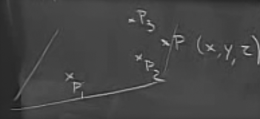
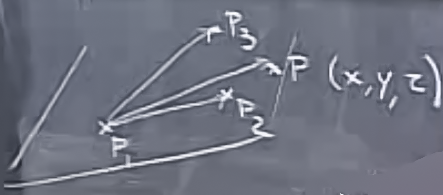
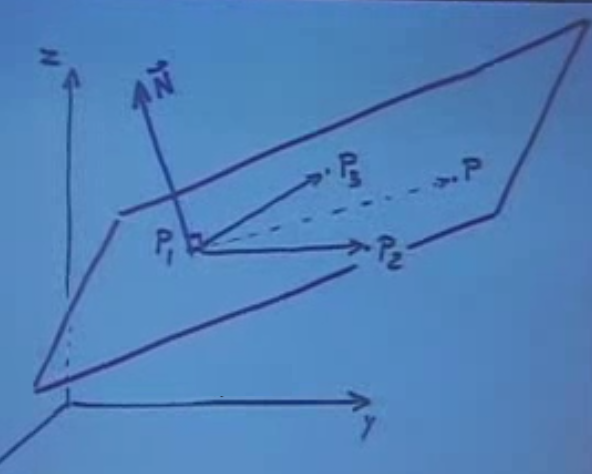
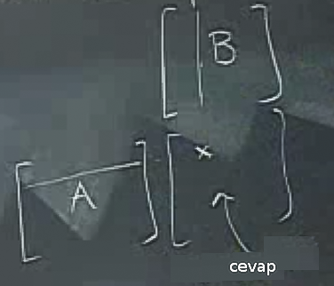

# Ders 3

Çapraz çarpımlar hakkında bilinmesi gereken bazı şaşırtıcı gelebilecek kurallar
var. Bunlardan bir tanesi $\vec{A} \times \vec{B} \ne \vec{B} \times \vec{A}$
işlemi. Peki neden böyle? Bunu incelemenin yollarından bir tanesi geometrik
olarak düşünmek. Sağ el kuralını düşünürsek, yönün neden farklı olabileceğini
anlarız. İşaretler tam terstir, yani

$$  \vec{A} \times \vec{B} = - \vec{B}\times \vec{A} $$

Determinant açılımını da düşünürsek, ikinci terim eksi işareti taşır, ama çarpım
sırası değişince eksi işaretinin yeri değişir.

Peki $\vec{A} \times \vec{A}$ nedir? Çapraz çarpım alan hesabında önemli
olduğuna göre ve $\vec{A} \times \vec{A}$ bir paralelkenar oluşturamayacağına
göre (ya da sıfır alanlı bir paralelkenar oluşturacağına göre) cevap sıfır, daha
doğrusu sıfır "vektörü'' (o vektörün büyüklüğü de tabii ki sıfır).

Uygulamalar

Diyelim ki bize uzayda üç nokta verildi, ve bu noktaları içeren bir düzlemin
formülünü bulmamız gerekiyor. Üç nokta, üç boyutlu uzayda bir düzlem yaratmak
için yeterli, bunu biliyoruz. Bunun için bir dördüncü nokta $P$ hayal edelim ki
bu noktanın öğeleri $x,y,z$ olsun.



Şimdi düzlemi tanımlayalım. Şu şekilde 3 tane vektör
yaratalım



Bu vektörlerin aynı düzlem üzerinde olması, aynı zamanda bu vektörlerin
tanımladığı paralelyüz'ün hacimsiz olması demektir. Yani birisi üzerinden
bastırıp onu dümdüz etmiştir sanki, sadece alanı kalmıştır.

Bunu matematiksel olarak ifade etmenin yolu şudur:

$$ det(\vec{P_1P},\vec{P_2P},\vec{P_3P}) = 0 $$

Gerçek uygulama bağlamında problem bize $P_1,P_2,P_3$ sayılarını vermiş
olurdu.Biz bu sayıları üstteki formüle yerleştirdiğimizde ise tanımsız olan
sadece $x,y,z$ kalırdı ve bu $x,y,z$'ler ile beraber elde edilecek formül bu
noktaların tanımladığı alan olurdu.

Bu hesabı daha da hızlı yapmanın bir yolu var. Alttaki resmi
düşünelim.



Düzlem üzerindeki iki vektöre dik bir $\vec{N}$'i nasıl hesaplayacağımızı
biliyoruz (çarpraz çarpım ile).  Ayrıca, $x,y,z$ değişkenlerini içeren üçüncü
bir vektör $\vec{P_1P}$'in aynı düzlemde olması demek, bu $\vec{N}$ vektörüne
dik olması demektir ($\vec{N}$ "normal vektör'' olarak isimlendirilir). Bunu
matematiksel olarak nasıl ifade ederiz? Dikliğin matematiksel karşılığını
biliyoruz, noktasal çarpım sıfır olmalı.

$$ \vec{P_1P} \cdot \vec{N} = 0 $$

$\vec{N}$ hesabı için

$$ \vec{N} = \vec{P_1P_2} \times \vec{P_1P_3}$$

Bu kadar.

Ek not, eğer çapraz çarpımın sırasını değiştirmiş olsaydım, o zaman üstteki
hesabın ters yönünde bir başka dik vektör elde ederdim, düzlem yine aynı olurdu,
sadece başka bir normal vektör olurdu. Bu problem değil, herhangi bir düzlemin
sonsuz sayıda normal vektörü olabilir. Elde ettiğimiz bir normal vektörü
herhangi bir sabit ile çarpınca yeni bir normal vektör elde etmiş olurum çünkü.

$$ \vec{P_1P} \cdot \vec{N} =
\vec{P_1P} \cdot (\vec{P_1P_2} \times \vec{P_1P_3})
$$

Eşitliğin sağındaki çarpıma üçlü çarpım (triple product) deniyor.

Eğer dikkat ettiyseniz, denklemin sağ tarafındaki çapraz çarpım işlemine tabi
tutulan vektörler aynı düzlem içerisinde bulunduğu için, çapraz çarpımın sonucu
bize bulundukları düzleme dik bir vektör verir. Bu vektör, denklemin sol
tarafındaki $\vec{N}$ ile aynı doğrultuda olduğu için bu eşitlik her zaman
sağlanır.


Matrisler

$AB$ şeklindeki bir matris çarpımında herhangi bir hücrenin, hangi kolon hangi
satırın noktasal çarpımının sonucu olduğunu hayal edebilmek için alttaki şekil
faydalı olabilir. $AB$ çarpımını gerçekleştirdikten sonra ortaya çıkan matriste,
herhangi bir hücreyi ele alalım. Mesela, beşinci satır, dördüncü kolon. Bu sayı,
$A$ matrisinin beşinci satırı ile, $B$ matrisinin dordüncü kolonunun noktasal
çarpımının sonucudur. İşte bu kadar basit.



Sezgisel olarak $AB$ çarpımı neyi temsil eder? Bu çarpımı şöyle düşünebiliriz,
önce $B$ transformu yap, sonra $A$ transformu yap. Bu biraz acaip gelebilir,
çünkü normalde işlemleri soldan sağa yapmaya alışığızdır. Fakat $AB$'yi belki de
sıralı fonksiyon işlemleri olarak görmek daha doğru olur, mesela $f(g(x))$
gibi. Burada önce $g$ uygulanır, sonra $f$ uygulanır.

$$ (AB)X = A(BX) $$

Üstteki özelliğe birleşim özelliği diyoruz. Bu arada, üstteki çarpımın noktasal
değil, matris çarpımı olduğuna dikkat edelim.

Not: $AB \ne BA$. En azından sağdaki çarpımın olabileceğini beklemememiz
gerekir. $AB$ çarpımı boyutlar uyduğu için mümkün olmuştur, fakat bu uyumlu
boyutlar yerler değişince belki mümkün olmaz. Boyutlar olsa bile sonuç farklı
çıkabilir, o sebeple eşitlik farz edilemez. Ufak bir Python kodu ile test
edelim:

```python

a = [[2,3,4],[4,4,5],[9,3,2]]
b = [[2,3,9],[4,2,5],[9,3,2]]

print (np.dot(a,b))

print (np.dot(b,a))
```

```
[[ 52  24  41]
[ 69  35  66]
[ 48  39 100]]
[[97 45 41]
[61 35 36]
[48 45 55]]
```

Sonuçlar farklı çıkacak.

Örnek

Çevirmek / Rotasyon

Bir düzlem üzerinde bir vektörü $90^o$, saat yönü tersine
çevirmek için

$$ R =
\left[\begin{array}{rr}
0 & -1 \\
1 & 0
\end{array}\right]
$$

İlginç bir durum

$$ R^2 =
\left[\begin{array}{rr}
-1 & 0 \\
0 & -1
\end{array}\right]
$$

Yani birim matrisinin negatifi. Niye böyle oldu? Düşünelim, eğer bir vektörü 90
derece döndürürsem, sonra bir daha 90 derece döndürürsem, sonuç olarak 180
derece döndürmüş olurum, yani tam tersi yöne gitmiş olurum. Birim matrisin
negatifi de budur zaten.

Matrisler denklem sistemlerini temsil edebilirler, alttaki gibi


Bu tür sistemlerde belki $X$ değerleri verilmiştir, $U$'yu hesaplamamız
isteniyordur, ya da tam tersi de olabilir, $U$ verilmiştir, $X$ hesaplamamız
isteniyordur. Ters yönde gitmek için matris tersini (inverse) almak gerekir.

Not: Bir matrisin tersini alabilmemiz için onun kare matrisi olması gerekir,
yani boyutu $n$ x $n$ olmalıdır.

Ters yönde çözüme gelelim. Mesela elimizde şöyle bir sistem
var

$$  AX = B$$

$$  A^{-1}(AX) = A^{-1}B$$

$$  X = A^{-1}B$$

Böylece $X$'i elde edebilmiş oluruz. O zaman $A$ matrisinin tersini alma
operasyonunu yapabiliyorsak, istediğimiz herhangi bir lineer denklem
sistemini çözebiliriz demektir.

Aşağıdaki eşitlik de bir matrisin tersini bulabilmek adına
geçerlidir.

$$ A^{-1} = \frac{1}{det(A)}  = adj(A)$$

Üstte $adj$ diye tanımlanan bir matrisin bitişiğini (adjoint matrix) nasıl
buluruz?

Mesela

$$
\left[\begin{array}{rrr}
2 & 3 & 3 \\
2 & 4 & 5 \\
1 & 1 & 2
\end{array}\right]
$$

Adımlar:

1) Bu matrisin "minörlerini'' bulmak lazım. O nedir? Aslında minörleri
determinant işlemini işlediğimizde görmüştük, sadece bu ismi vermemiştik.  Onlar
en üst satırdaki matris hücrelerini teker teker merkez alıp, onun satırını,
kolonunu iptal ettikten sonra geri kalan daha ufak bölgenin
determinantlarıydı. Bitişiklik için bu hesabı sadece üst satır için değil, tüm
hücreler için yapacağız. Üstteki örnek için

$$
\left[\begin{array}{rrr}
3 & -1 & -2 \\
3 & 1 & -1 \\
3 & 4 & 2
\end{array}\right]
$$


2) Katsayıları bulma işlemi. Determinant işlemini bir matrisin minörlerini
toplayarak buluyoruz. Ve her minörün önüne şimdi göstereceğimiz kurala göre "+"
veya "-" işareti geliyor. Katsayı kuralımızın formülü şu şekildedir
$(-1)^{m+n}$. Bu formülde "m" satır numarası, "n" ise kolon numarasıdır. Formülü
daha iyi kavrayabilmek adına dama tahtası gibi bir şekil düşünelim, bunun
üzerinde +,- işaretleri olsun.

$$
\begin{array}{rr}
+ - + - + \\
- + - + - \\
+ - + - + \\
- + - + - \\
\end{array}
$$


Örnekteki bitişiklik ise şu hale gelir:

$$
\left[\begin{array}{rrr}
3 & 1 & -2 \\
-3 & 1 & 1 \\
3 & -4 & 2
\end{array}\right]
$$

3) Devriğini Al (Transpose)

Satırlar ve kolonların yerini değiştir.

$$
\left[\begin{array}{rrr}
3 & -3 & 3 \\
1 & 1 & -4 \\
-2 & 1 & 2
\end{array}\right]
$$

4) Her şeyi $det(A)$'ya böl

$$
\left|\begin{array}{rrr}
2 & 3 & 3 \\
2 & 4 & 5 \\
1 & 1 & 2
\end{array}\right| = 3
$$

$$ A^{-1} =
\frac{1}{3}
\left[\begin{array}{rrr}
3 & -3 & 3 \\
1 & 1 & -4 \\
-2 & 1 & 2
\end{array}\right]
$$

Ekler

Bazı Çapraz Çarpım Kuralları [1, sf. 222]

BAC-CAB

`BAC-CAB açılımı'' denen teknik soyle 

$$
A \times (B \times C) = B(A \cdot C) - C(A \times B)
$$

Dağılım (Distributive) Kuralı

$$
(A+B) \times C = (A \times C) + (B \times C)
$$

$(A+B) \times (C+D)$ açılımı da üstteki açılımdan türetilebilir.

Yerbağımsızlık

Normal çarpma toplamadaki yerbağımsızlık yok, çünkü işaret değişiyor,

$$
B \times A = - A \times B
$$

Kaynaklar

[1] *Mathematical Methods for Physics Engineering*


