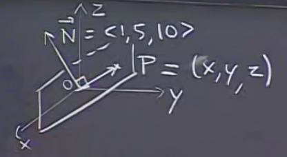
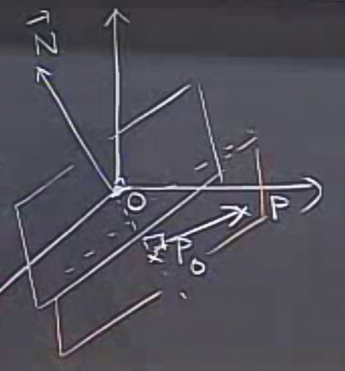
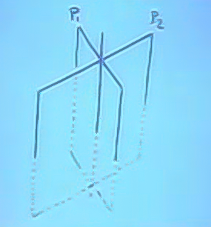
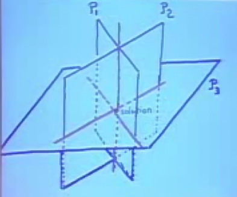
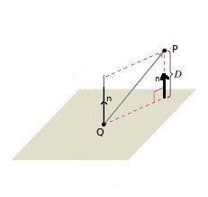
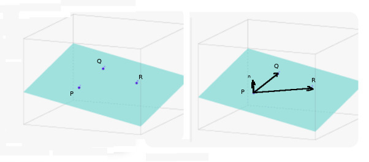
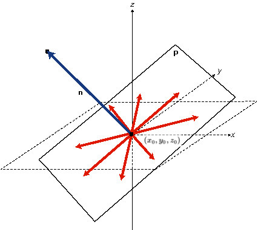

# Ders 4

Düzlemin formülüne bakalım.

$$ ax + by + cz = d $$

Bu formül $x,y,z$ noktalarının bir düzlem üzerinde olma şartını tarif
ediyor. 

Şu problemlere bir göz atalım. Diyelim ki 

1) Orijinden, yani $(0,0,0)$ noktasından geçen ve normal vektörü $\vec{N} =
< 1,5,10 >$ olan bir düzlem yaratmak istiyoruz. Yani alttaki gibi bir şekil:



Herhangi bir nokta $P = (x,y,z)$ ne zaman bu düzlem üzerindedir? Eğer orijinden
$P$'ye giden vektör -$\vec{OP}$ vektörü-, düzlem normali ile doksan derece açı
oluşturuyorsa. Bunun nedeni, eğer $P$ noktası düzlem üzerinde ise, orijinden $P$
noktasına giden vektör düzleme paralel olacaktır. Düzlemin normal vektörünün de
düzleme kesinlikle dik olduğunu bildiğimiz için, $P$ noktası düzlem üzerinde
olduğu koşul için $\vec{OP} \cdot \vec{N} = 0$ ifadesini rahatlıkla yazabiliriz.

Dikkat edelim, $x,y,z$ kordinatlarını tek başlarına kullanır kullanmaz aslında
$\vec{OP}$'nin orijinden başlamasını şart koşmuş oluyorum, çünkü $x,y,z$
kordinatları sadece $(0,0,0)$ noktasına referansla anlamlılar.

Her neyse, bu çarpımı normal için verdiğimiz örnek sayılar için yaparsak,
sonuç $x+5y+10 = 0$ olacaktır.

2) Şimdi düzlem $P_0 = (2,1,-1)$ noktasından geçsin (orijinden değil), ve normal
yine aynı olsun, $\vec{N} = < 1,5,10 >$. Bu durumu zihnimizde canlandırmak için
yeni bir düzlemi hayal etmemiz lazım, ve $P$ noktası bu yeni düzlem üzerinde
olacak.



$P$ ne zaman düzlem üzerinde? Bu soruyu incelemeden önce bir konuya dikkat
etmeliyiz. Resimden de farkedebileceğiniz gibi, normalleri paralel olan
düzlemler birbirlerine paraleldir. Bu yüzden, $P_0$ noktasından geçen diğer
düzlem üzerinde çizeceğimiz bir vektör -ki resimde bu vektör $\vec{P_0P}$
vektörüdür- orijinden geçen düzlemin normaline diktir. Şimdi sorumuza tekrar
dönecek olursak, eğer

$$ \vec{P_0P} \cdot \vec{N} = 0 $$

ise. O zaman 

$$ < x-2, y-1, z+1 > \cdot < 1,5,10 > = 0 $$

$$ x+5y + 10z = -3 $$

$x,y,z$ üzerinde çıkartma işlemini niye yaptım? Çünkü vektörün bir ucu hala
$x,y,z$ içeren $P$ noktasında, diğer ucu başlangıç noktası olan $P_0$'da.

İlk problemdeki sonuçtakiyle aradaki tek fark eşitliğin sağındaki -3 değeri. Bir
benzerlik ise her iki durumda da $x,y,z$ katsayılarının normal vektörün
değerlerine tekabül ediyor olması. Bu düzlemler hakkında önemli bir püf noktası,
eğer orjinden geçiyorlarsa eşitliğin sağ tarafı sıfır, başka bir yerden
geçiyorlarsa, başka bir değer. Peki bu -3 değerini daha hızlı bir şekilde
bulamaz mıydık? Bulabilirdik. Çünkü eşitliğin sol tarafının katsayılarını hızlı
bir şekilde bulabiliyoruz, orası tamam. Ayrıca düzlemdeki bir noktanın
kordinatlarını da biliyoruz, bu nokta düzlemin içinden geçmesini şart koştuğumuz
$P_0$ noktası. O zaman bu kordinatı $x,y,z$ terimlerini içeren formüle koyarsak,
eşitliğin sağ tarafını hemen hesaplarız.

$$ x+5y + 10z = 1(2) + 5(1) + 10(-1) = 2 + 5 -10 = -3$$

Bu arada bir düzlemin tek bir formülü yoktur, sonsuz tane denklemi
vardır. Mesela her şeyi 2 ile çarpsaydım

$$ 2x+10y+20z = -6 $$

olurdu, ve bu formülde aynı denklemin formülü olurdu. Bunun çokluğun sebebi
normal vektörlerin herhangi bir "boyda'' olabilmesi, diklik için yön yeterli
olduğu için, farklı boylar ama değişmeyen yön hala aynı düzlemi tanımlıyor.

Düzlemi tanımlamak için normal vektör en önemlisi. Bir önceki derste düzlem
üzerindeki noktalar, onların ortaya çıkardığı iki vektör o vektörlerin çapraz
çarpımı üzerinden nasıl normal vektör hesaplanabileceğini görmüştük.

Soru:

Vektör $< 1,2,-1 >$ ve düzlem $x+y+3z = 5$ birbirine


   * Paralel
   * Dik
   * Hiçbiri


Cevaplayin. 

Vektörü ve düzlemin normal vektörünü çarptık. $< 1,2,-1 >\cdot< 1,1,3 > =
0$. 

Dogru cevap: "Paralel".

Şimdi bir lineer denklem sistemini inceleyelim.

$$ x + z = 1  $$

$$ x + y = 2 $$

$$ x + 2y + 3z = 3 $$

İlk iki denkleme bakalım. Bu denklem belli, özel iki $x,z$ noktasından
bahsediyor. İkinci denklemi de gözönüne alınca, aynı $x,z$ noktalarının ikinci
denklem için de geçerli olması gerekir.



İlk iki denklemleri ayrı düzlemler olarak düşünürsek, çözüm olacak $x,y,z$ iki
düzlemin kesiştiği yerdedir. Peki üçüncü denklem, yani üçüncü düzlem ne yapar?



O da iki düzlemin kesimindeki çizgiyi keser. Kesişimin kesimi bir
noktadır. O nokta da, üstteki lineer sistemin çözümü olan noktadır. 

Soru: 

Eğer 3 x 3 boyutlarındaki bir lineer sistemin çözümü bir nokta değilse,
nedir? 

 
* Çözüm yoktur
* İki nokta (2 çözüm)
* Bir çizgi ($\infty$ tane çözüm)
* Bir tetrahedron
* Bir düzlem
* Bilmiyorum


Diyelim ki ilk iki düzlemin kesişmesi bir çizgi ortaya çıkardı, ama bu çizgi
üçüncü düzlem ile paralel. O zaman çözüm yok demektir. Fakat şu da doğru
olabilir, belki bu çizgi üçüncü denklemin "üzerindedir''. Bu durum cebirsel
olarak iki denklemin ortaya çıkardığı bir denklemin üçüncü denklemin katı
olmasıdır. Bu durumda üçüncü denklem bize hiçbir yeni bilgi sağlamamıştır. Bu
durumda sonsuz tane çözüm vardır, kesişmeden ortaya çıkan çizgi üzerindeki
"her'' nokta bir çözümdür, ve sonsuza kadar uzayan bir çizgi üzerinde sonsuz
tane nokta vardır.

O zaman doğru cevap "Çözüm yoktur", "Bir çizgi ($\infty$ tane çözüm)" ve "Bir 
düzlem".

5 niye doğru? Aynen iki denklemden ortaya çıkan denklemin üçüncü denklemin bir
katı olması gibi, her üç denklem ayrı ayrı birbirinin katı olabilir. O zaman bu
denklemler aslında aynı düzlemdirler. Çözüm bu tek düzlemdir, ve sonsuz
tanedir. Yani size aynı denklemi üç kere vermişim demektir, bu pek ilginç bir
sistem sayılmaz, ama yine de bu bir lineer sistemdir.


Peki $x + y + z = ..$ gibi bir denklemin sağındaki sıfır olmayan değerlerin
geometrik anlamı nedir? Cevap: Daha önce gördüğümüz $x + y + z = 0$ orijinden
geçer. Sağ taraf sıfır değilse, sıfırdan geçen aynı düzleme paralel ama ondan
belli miktarda uzakta bir düzlemden bahsediyoruz demektir. Ne kadar uzakta? Her
zaman eşitliğin sağındaki büyüklük kadar değil. O uzaklık için hesabın ayrıca
yapılması lazım. Şimdilik sadece orijinden uzakta olduğunu bilelim.

Şimdi matrislere dönelim. Önceki derste gördüğümüz lineer cebir formülünü
hatırlayalım

$$ AX = B $$

$$ X = A^{-1}B $$

Buradaki problem, bir matrisin her zaman tersini alamayacağımız gerçeği. 

Hatırlarsak 

$$ A^{-1} = \frac{1}{det(A)}adj(A) $$

Bu hesapta eğer determinant sıfır çıkarsa üstteki bölme işlemini yapamayız. Yani
bir önceki derste aslında şunu söylememiştik; bir matris şadece determinanti
sıfır değilse tersine çevirilebilir.

Geometrik olarak çözümün tek nokta olduğu durum, $A$'nin tersine çevirilebilir
olduğu durum. Kesişim çizgisinin üçüncü düzleme paralel olduğu durum ise
determinantın sıfır, yani tersine çevirim yapılamadığı durum.

Homojen Durum:

$AX = 0$ homojen durumdur, eşitliğin sağı sıfırdır, yani üç denklem
örneğinde tüm denklemlerin sağ tarafı sıfırdır. 

Örnek:

$$ x + z = 0 $$

$$ x + y = 0 $$

$$ x + 2y + 3z = 0 $$

Aslında bu denklemin bariz ve hep mevcut bir çözümünü zaten
biliyoruz. $x,y,z$'nin hepsi sıfır. Matematiksel terminolojide bu çözüme "basit
çözüm (trivial solution)'' denir. Geometrik anlamı nedir? Her denklemin sıfıra
eşit olması, onların temsil ettiği her düzlemin orijinden geçtiği anlamına
gelir. Eh hepsi orijinden geçiyorsa, hepsi orada kesiyorlar da demektir. Basit
çözüm budur.

Burada iki durum daha var. 

1) Eğer $det(A) \ne 0$ o zaman $A$ tersine çevirilebilir, o zaman $X =
A^{-1} \ 0 = 0$. 

Başka hiçbir çözüm yoktur.

2) Eğer $det(A) = 0$ o zaman $det(\vec{N_1},\vec{N_2},\vec{N_3}) = 0$'dır. Her
iki hesap ta sıfır çünkü normal vektörün öğeleri her denklemin $x,y,z$ katsayısı
aynı zamanda, o katsayıları alıp $A$ içine koyuyoruz, bu matrisin determinantını
hesaplamak bir bağlamda normal vektörlerin determinantını hesaplamakla eşdeğer
oluyor. Devam edelim, üç formülü temsil eden üç düzlemin normal vektörleri
determinanti sıfır ise, o zaman $\vec{N_1},\vec{N_2},\vec{N_3}$ aynı
düzlemdedir.


$det(\vec{N_1},\vec{N_2},\vec{N_3})$ hesabının paralelyüzün hacmini
hesapladığını hatırlayalım, ve bu hacim sıfır ise vektörlerin oluşturduğu hacim
sıfırdır, yani paralelyüz tamamen yassı demektir. O zaman vektörler aynı
düzlemdedir.

$\vec{N_1},\vec{N_2},\vec{N_3}$'nin aynı düzlemde ise, bu vektörlere aynı
anda dik olan bir çizgiyi düşünelim şimdi. İddia ediyorum ki o çizgi,
kesişme çizgisidir.

Niye? Çünkü kesişme çizgim tüm normal vektörlere aynı anda dik, yani o
normal vektörlerin temsil ettiği düzlemlerin hepsine aynı anda
paralel. Peki niye parallellik ötesinde, o düzlemlerin "üzerinde''? Çünkü
çizgi orijinden geçiyor, ve tüm düzlemler de orijinden geçiyor. Bunun
olabilmesi için çizgimiz düzlemlerin üzerinde olmalı.

O zaman elimde $\infty$ tane çözüm vardır. 

Peki bu çözümleri nasıl bulurum? $\vec{N_1} \times \vec{N_2}$ hesabı
$\vec{N_1},\vec{N_2}$'ye dik bir üçüncü vektör hesaplar, bunu biliyoruz, bu
vektör de $\vec{N_3}$'e aynı şekilde dik olmalıdır çünkü bu üç vektörün
aynı düzlemde olduğunu biliyoruz. Bu basit olmayan çözümdür.

Üsttekiler homojen durum içindi. Şimdi homojen olmayan, genel duruma duruma
bakalım.

Genel Durum (General Case):

Eğer $det(A) \ne 0$ işe özgün (unique) bir çözüm vardır, $X = A^{-1}B$. 

Eğer $det(A) = 0$ işe, ya hiç çözüm yoktur ya da sonsuz tane çözüm
vardır. Tek bir çözüm olması mümkün değildir. 

Destek Dersleri (Recitation)

Nokta Düzlem Uzaklığı

Diyelim ki elimizde bir $P$ noktası $(0,0,0)$ var, bu noktanın denklemi $2x + y
- 2z = 4$ olan düzleme olan uzaklığını bulmak istiyoruz.



Tabii uzaklık derken "en yakın mesafe'' demek istiyoruz, yani $P$'den düzleme
en yakın olacak şekilde direk bir çizgi çekince ortaya çıkan uzaklık.

Bu yön bir vektör gerektirir, ama bu yönü biliyoruz, elimizde düzlemin normal
vektörü var, $n = (2,1,-2)$. Dikkat bu normal halen birim değil, ama onu birim
vektörü yapmak kolay.

Fakat bir problem şu, normal vektörü özgün değil, düzleme direk olan herhangi
bir vektör normal vektördür, resimde iki tane gösterdik mesela. Yani $P$'dan
düzleme doğru bir çizgi çekmek istiyoruz ama o çizginin düzlemdeki başlangıç
noktasını bilmiyoruz. 

Bir çözüm şu olabilir, düzlem üzerinde kordinatları bilinen herhangi bir nokta
seçeriz, bunu basit bir tahmin ile bulabiliriz, sonra o nokta ve $P$ arasındaki
vektörü normal vektör üzerine yansıtırız, ve bu yansıtma sonucu elde edilen
vektörün büyüklüğü bize mesafeyi verecektir.

Düzlem üzerinde herhangi bir $Q$ noktası bulmak zor değil, $x=0,y=0$ diye bir
rasgele seçim yaparız, bu değerleri düzlem formülüne sokarak $x$ için çözeriz,
$2x + 0 + 0 = 4 \to x = 2$, yani $Q = (2,0,0)$.

Böylece $PQ$ vektörü elde edebiliriz, $Q - P$, tabii $P = (0,0,0)$ seçtiğimiz
için $\vec{QP} = Q - P = (2,0,0)$. Yansıtma için $PQ$ ile birim vektörüne
çevrilmiş $n$ arasında bir yansıtma yapmak yeterli, bu noktasal çarpımla
yapılabilir,

$$
D =  \bigg| \vec{PQ} \cdot \frac{n}{||n||} \bigg|
$$

Dikkat formül dışındaki dik çizgiler mutlak değer demek, bölümde gözüken $||n||$
vektör büyüklüğü. Devam edelim,

$$
= \frac{2 \cdot 2 + 0 \cdot 1 + 0 \cdot (-2) }{ \sqrt{2^2 + (-1)^2 + (-2)^2} } 
$$

$$
= \frac{4}{3} = 1.3333
$$

Fakat üstteki yaklaşımı daha da geliştirebiliriz. Aslında düzlem üzerinde bir
nokta seçmeden de uzaklık hesabı yapabiliyoruz [1]. Formülü tekrar hatırlarsak
$Q,P$ noktaları arasında bir vektör oluşturmuştuk, $v = (x_1-x_0, y_1-y_0, z_1-z_0)$
ve bu vektörü düzlem normalı üzerine yansıtarak mesafeyi bulmuştuk. Normal
vektörü $n = (A,B,C)$ olarak tanımlayalım, yani düzlem formülü $Ax+By+Cz=D$
olsun, o zaman mesafe hesabı $d$ açılımı şöyle olurdu,

$$
d = | v \cdot n|
$$

$$
= | (x_1-x_0, y_1-y_0, z_1-z_0) \cdot n | 
$$

$$
\frac{ | A(x_1-x_0) + B(y_1-y_0) + C(z_1-z_0) | }{ \sqrt{ A^2 + B^2 + C^2 } }
\qquad (1)
$$

$\sqrt{ A^2 + B^2 + C^2 }$ hesabı normal vektörü birimselleştirmek için yapıldı.
Fakat hatırlarsak eğer bir $x,y,z$ noktası düzlem üzerinde ise o $Ax+By+Cz+D=0$
sonucu elde edilmelidir değil mi? Bu sebeple ve $x_0,y_0,z_0$ düzlem üzerinde
olmasını şart koştuğumuzdan, o zaman $Ax_0+By_0+Cz_0+D=0$ olmalıdır,
ya da $D = -Ax_0-By_0-Cz_0$.

Şimdi bakalım (1) formülündeki bölüneni açıp tekrar düzenlersek,

$$
= \frac{ | Ax_1 - Ax_0 + By_1 - By_0 + Cz_1 - Cz_0 | }{ \sqrt{ A^2 + B^2 + C^2 } }
$$

$$
= \frac{ | Ax_1 + By_1 + Cz_1 + (-Ax_0 - By_0 - Cz_0) | }{ \sqrt{ A^2 + B^2 + C^2 } }
$$

Parantez içindeki kısım için $D$ kullanabiliriz,

$$
= \frac{ | Ax_1 + By_1 + Cz_1 + D | }{ \sqrt{ A^2 + B^2 + C^2 } }
$$

Nihai mesafe formülü budur. Görüldüğü gibi düzlem üzerindeki $Q=(x_0,y_0,z_0)$
noktasına ihtiyaç yok. Biraz önceki aynı örnek üzerinde kontrol edelim,

```python
# Duzlem 2x + y - 2z = 4
n = np.array([2,1,-2])
P = np.array([0,0,0])
d = (np.dot(n,P) + 4) / np.sqrt(2**2+1**2+(-2)**2)
print (d)
```

```
1.3333333333333333
```

Aynı sonuca eriştik.

Üç Nokta ile Düzlem Formülü Bulmak

Üç boyutta üç nokta bir düzlem tanımlamak için yeterlidir. Bu noktaları
kullanarak $P$, $Q$, $R$ diyelim, iki tane vektör oluştururuz. Noktalar düzlem
üzerinde olduğu için onları kullanarak hesaplanan vektörler de aynı düzlem
üzerinde olmalıdır. Vektörler $a = P-Q$ ve $b = P-R$ ile hesaplanır.

Örnek olarak $P = (2,1,4)$, $Q = (4,-2,7)$, $R = (5,3,-2)$ kullanalım,

$$
a = PQ = (4-2, -2-1, 7-4) = (2,-3,3)
$$

$$
b = PR = (5-2, 3-1, -2-4) = (3,2,-6)
$$

Bu vektörleri bulduktan sonra düzlemin normal vektörünü bulmak için çapraz
çarpım yeterli,

```python
n = np.cross( np.array([2,-3,3]), np.array([3,2,-6])  )
print (n)
```

```
[12 21 13]
```



Şimdi sıra düzlem formülünü bulmaya geldi. Bu formül için düzlem üzerinde bir
nokta ve normal vektör yeterli. Eğer düzlem noktasını $x_0,y_0,z_0$ olarak
alırsak, bu başlangıç noktasından düzlem üzerindeki herhangi bir noktaya,
$x,y,z$ diyelim, giden vektör normal vektöre dik olmalıdır, yani bu iki
vektörün noktasal çarpımı sıfır olmalıdır.



Üstteki resimde bu mümkün vektörler görülüyor, düzlem üzerindeki herhangi bir
$x,y,z$ noktası görülen kırmızı vektörlerden birini ortaya çıkartabilir.

Cebirsel olarak şunu söylüyoruz, $n = (n_1,n_2,n_3)$ olacak şekilde,

$$
n_1 (x - x_0) + n_2 (y-y_0) + n_3 (z-z_0) = 0
$$

Bu formülü açınca doğal olarak düzlem cebirsel formunda eşitliğin sağında olan
bir $d$ elde edeceğiz, ve bu değeri $c_1 x + c_2 y + c_3 z = d$, ya da
$\vec{c} \cdot [x,y,z] = d$ formundaki düzlem formülü için kullanabileceğiz.

Neyse üstteki hesabı yapalım, $x_0,y_0,z_0$ için $P$ noktasını kullanabiliriz,

$$
12(x-2) + 21(y-1) + 13(z-4) = 0
$$

Burada parantez açılımını yapıp sabitleri toplarız, ve $d$ yi bulabiliriz, fakat
aslında üstte gizli bir vektör işlemi var, $d$ değerine şu şekilde de erişilebilir,

$$
d = \vec{n} \cdot P = [12,21,13] \cdot [2,1,4]
$$

```python
d = np.dot( np.array([12,21,13]), np.array([2,1,4]))
print ('d =',d)
```

```
d = 97
```

Geri kalan değişken katsayıları da üstteki açılımdan belli oldu, ama o formülü
de vektörel formda zaten biliyoruz, $\vec{n} \cdot [\begin{array}{ccc} x&y&z \end{array}] = d$. 
Değerleri yerine koyarak $[\begin{array}{ccc} 12&21&13 \end{array}] \cdot [\begin{array}{ccc} x&y&z \end{array}] = 97$.  
Açılmış formda $12x + 21y + 13x = 97$.

Çizgi Parçasına Noktanın En Yakın Mesafesi

Elimizde verili iki nokta arasında tanımlı çizgi parçası var. Herhangi bir
noktanın bu parçaya en yakın mesafesi nedir? Ayrıca o noktadan parçaya bir düz
çizgi çekilse kesişimin olduğu nokta nerededir?

Şu metota bakalım [5]. Çizgiyi $\vec{z} = \vec{a} + t \vec{b}$ olarak
tanımlayabiliriz. O zaman bu çizgi ile bir diğer nokta $\vec{x}$ arasındaki
mesafe $\vec{x} - \vec{z}$ vektörünün uzunluğudur, yani

$$
\vert\vert \vec{x} - (\vec{a} + t' \vec{b}) \vert\vert
$$

olarak tanımlanabilir, ki burada $t'$ özel bir $t$ değeri oluyor. Bu değer öyle
bir $t$ değeri ki o noktaya kadar gelen $\vec{z}$'nin bolumu $\vec{x}$'e dik. Bu
noktayı ve ardından çizgiye olan (dik) mesafeyi nasıl buluruz?

Şimdi üstteki çizgi formülünde kesişim anına kadar olan bölümdeki, $t'$'ye
tekabül eden kısma $\vec{r}$ diyelim, ve onu

$$
\vec{r} = \vec{a} + t' \vec{b}
$$

olarak gösterelim. İstediğimiz $||\vec{r}-\vec{x}||$ uzunluğunu bulmak. $t'$
değerinde aradaki vektör $\vec{b}$'ye dik olduğuna göre

$$
(\vec{x} - \vec{r}) \cdot \vec{b} = 0
$$

$\vec{r}$ formülünü açalım,

$$
= (\vec{x} - \vec{a} - t' \vec{b}) \cdot \vec{b} = 0
$$

$$
= \vec{x}\cdot\vec{b} - \vec{a}\cdot\vec{b} - t'||b||^2 = 0
$$

$$
t' = \frac{\vec{x}\cdot\vec{b} - \vec{a}\cdot\vec{b}}{||b||^2}
$$

Örnek

$< 2,2 >$ ve $< 5,5 >$ noktaları noktalarından geçen çizgiye $< 4,1 >$ noktasının
uzaklığı nedir? Kesişim nerede olur?

```python
def dist(x1,y1,x2,y2,px,py):
    a = np.array([[x1,y1]]).T
    b = np.array([[x2,y2]]).T
    x = np.array([[px,py]]).T
    tp = (np.dot(x.T, b) - np.dot(a.T, b)) / np.dot(b.T, b)
    tp = tp[0][0]
    tmp = x - (a + tp*b)
    d = np.sqrt(np.dot(tmp.T,tmp)[0][0])
    return d, a+tp*b

x1,y1=2.,2.
x2,y2=5.,5.
px,py=4.,1.

d, inters = dist(x1,y1, x2,y2, px,py)
print (d)
print (inters)
```

```
2.1213203435596424
[[2.5]
 [2.5]]
```

Not: Üstteki metot 2, 3 üzeri boyutlar için de işleyecektir. 

Kaynaklar

[1] Math Insight, *Distance from point to plane*,
    [https://mathinsight.org/distance_point_plane](https://mathinsight.org/distance_point_plane)


