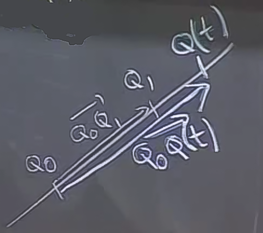
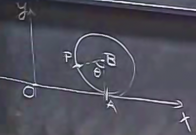
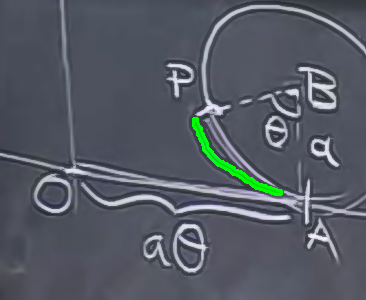
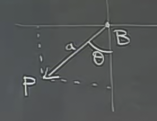

# Ders 5

Bir çizginin formülünü iki düzlemin kesişimi olarak gördük, fakat bu
şekilde bir tanım çoğunlukla bir çizgiyi tanımlamak için en rahat / uygun
yol değildir, çünkü elinizde bazı denklemler var, bunları çözmekle uğraşmak
lazım, vs. 

Şöyle bir yöntem daha iyi olmaz mıydı? Herhangi çizgi üzerinde bir nokta hayal 
edelim, ve bu noktanın herhangi bir t(zaman) değeri için bu çizgi üzerinde 
farklı bir konuma sahip olduğunu düşünelim. Herhangi bir t değeri için, çizgi 
üzerindeki konumu bulabiliriz. Bu şekilde çizgi üzerindeki tüm noktaların 
konumlarını tanımlayabiliriz. Bu tür parametreye bağlı denklemlere -ki bu 
örneğimizde parametre t'dir- parametrik denklemler denir. 

Örnek:

Çizgi üzerinde iki nokta belirleyelim. 

$$ Q_0 = (-1,2,2) $$

$$ Q_1 = (1,3,-1) $$

Güzel, bu iki nokta var ama ötekilerini nasıl tanımlarız? Bu iki noktasının
arasında, sonrasında, öncesinde olan tüm noktalar da çizgiye dahildir. 

Zaman aralıklarını öyle düşünelim ki, zaman indeksi sıfır ($t=0$) noktasında
iken, çizgi $Q_0$ üzerinde, tek birim adım atıldığında ($t=1$) ise $Q_1$
üzerinde olsun. O zaman yarım birim zamanda denklemimiz iki noktanın tam
ortasını işaret eder.

Böylece çizgiyi temsil etmenin yolu onu $t$ bazında hareket eden noktanın
geçtiği yerler olarak tanımlamaktır. Bu temsilin en basit hali eğer hareket
sabit hızda olursa olur. 

$t$ anındaki pozisyon $Q(t)$ nedir? 

Sorunun cevabını şöyle vermeye başlayabiliriz: $\vec{Q_0Q(t)}$ vektörü
$\vec{Q_0Q_1}$ birbiriyle orantılıdır. Bu orantı neye eşittir?

Bu oran $t$'ye eşittir. O zaman,

$$ \vec{Q_0Q(t)} = t \ \vec{Q_0Q_1}  $$

O zaman iddia ediyorum ki bu formülü kullanarak örneğimizdeki hareket eden
noktanın yer formülünü bulabilirim.

$$ \vec{Q_0Q(t)} = t \ <2,1,-3>  $$

Şimdi çizgi üzerinde hareket eden noktanın formülü $Q(t)$'yi şu şekilde
temsil edelim

$$ Q(t) = <x(t),y(t),z(t)> $$

O zaman

$$ x(t) + 1 = 2t $$

$$ y(t) - 2 = t $$

$$ z(t) - 2 = -3t $$

Üsttekiler, alttaki şu formun açılımından ibaret aslında

$$ Q(t) = Q_0 + t \ \vec{Q_0Q_1}  $$

Üstteki üç formül bu derste gördüğümüz ilk parametrik çizgi formülü. Aslında
formüle baktığımız zaman t sıfır değeri için denklemin $Q_0$ noktasını işaret
ettiğini görebiliyoruz. Bu değer, bizim başlangıç noktamızdır, ve t'nin pozitif
veya negatif oluşuna göre pozitif veya negatif yönde ilerleyebiliriz.  Formülün
parçaları olan $x(t),y(t),z(t)$ sadece $t$'nin fonksiyonudurlar, ve hep $t$ ile
bir katsayının çarpımı, artı bir sabit formundadırlar. $t$'nin katsayıları çizgi
üzerindeki vektör hakkında bilgi verir, ve sabitler ise $t=0$ anında nerede
olduğumuzu gösteren başlangıç değerleridirler.

Uygulama - Bir Düzlem ile Kesişme

Düzlem $x+2y+4z=7$. Çizgi biraz önceki formül olsun. Kesişme var mıdır, var
ise nerededir? 

Önce şu soruyu soralım kendimize. $x+2y+4z=7$ düzlemine göre, 
$Q_0 =(-1,2,2)$ ve $Q_1 = (1,3,-1)$ noktaları düzlemin

   * Aynı tarafında
   * Farklı taraflarında
   * Bir tanesi düzlem üzerinde
   * Karar veremiyorum

Cevaplayın. 

$Q_0$ ve $Q_1$ noktalarını düzlem formülünün sol tarafına sokarız. $Q_0$ için
sonuç $>7$, düzlem üzerinde değil, $Q_1$ için sonuç $<7$, yine düzlem üzerinde
değil. Peki noktalar düzlemin hangi tarafında? Farklı tarafında, çünkü biri
$<7$, öteki $>7$ sonuç verdi. Bir düzlem uzayı iki yarı-parçaya ayırır ve
noktalar bu ayrı parçalardadırlar. Doğru cevap "Farklı tarafında"dır.

Uygulamamızda cevaplanmayan bir soru daha var. Kesişme noktası neresidir?
$Q(t)$ nedir? Şöyle

$$ x(t) + 2y(t) + 4z(t) $$

$$ = (-1+2t) + 2(2+t) + 4(2-3t) $$

Basitleştirelim

$$ = -8t + 11 $$

Bu formülü $7$ ile karşılaştıralım çünkü $Q(t)$ nin düzlem üzerinde olduğu
an $-8t + 11 = 7$ olduğu andır. Cebirsel olarak $t$'yi elde edebiliriz,
sonuç $t=1/2$. Bu değeri $Q(t)$'ye koyarsak

$$ Q(\frac{1}{2}) = (0,\frac{5}{2},\frac{1}{2}) $$

Kesişim noktası eşitliğin sağındaki değerdir.

Yani eğer çizginin parametrik denklemini biliyorsak, onu düzlem formülüne
sokarız, ve kesişimin hangi noktada olduğunu hemen hesaplayabiliriz. 

Şimdiye kadar gördüklerimizden parametrik denklemlerin çizgileri temsil
etmek için iyi bir yöntem oldukları belli olmuştur herhalde. Bunun ötesinde
parametrik denklemler uzaydaki herhangi bir eğriyi (curve), herhangi bir
hareketi (trajectory), yolu temsil etme kabiliyetine de sahiptir. 

Genel bağlamda söylemek gerekirse, parametrik denklemleri bir uzayın içindeki 
veya bir
düzlem üzerindeki herhangi (arbitrary) bir hareketi temsil etmek için
kullanabiliriz.

Cycloid (Yuvarlanma Eğrisi)

$a$ yarı çapındaki bir tekerlek yerde -x ekseninde- dönerek ilerliyor, $P$ bu
tekerleğin dış yüzeyinde (rim) bir noktadır ve başlangıç noktası 0 üzerindedir.
Bu durumda ne olur? Daha detaylı olarak sormak gerekirse, $P$ noktasının
hareketini $t$'nin bir fonksiyonu $x(t),y(t)$ olarak ifade ebebilir miyiz?

(x ekseni biraz sağa yatik çıkmış ama bu video kamerasının açısı yüzünden). Bu
örneği bir bisikletin tekerliğine takılmış bir ışığın, bisiklet gece giderken
ortaya çıkartabileceği görüntüyü düşünürek te hayal edebiliriz. Yani hem dönüş
hareketi var, hem de yatay olarak düz bir gidiş hareketi var.

Bu $P$ noktasının gidiş yolunu hesaplamak için tekerleğin ne kadar hızlı
döndüğü önemli mi? Hayır değil. Yavaş da döndürsek hızlı da döndürsek, $P$ aynı
noktalardan geçecektir. 

Bu problemde en önemli faktör zaman değil, mesafe, tekerleğin ne kadar mesafe
katettiği. Ya da daha bile iyisi, mesafe ile dönüş birbirine bağlantılı olduğuna
göre, ayrıca problemdeki en çetrefilli, girift oluşturan hareket dönme hareketi
(rotation) olduğu için, belki de tekerleğin ne kadar döndüğünü gösteren bir açı
değeri kullanırsak belki daha faydalı olacak. Pek çok değişik temsil yöntemi
olabilir, fakat açıya göre parametrize edersek en temiz formülü elde etmek
mümkün olur. O zaman $x(t),y(t)$ yerine $x(\theta),y(\theta)$ kullanalım.

Yani $x(\theta),y(\theta)$ ile tekerleğin ne kadar dönmüş olduğunu
belirleyen $\theta$ açı üzerinden tanımlı bir fonksiyon kullanalım. 

Tekerleğin nerede olduğu bilgisini ise $\vec{OP}$ vektörü ile temsil
edebilirim. Buradaki tek problem vektör $\vec{OP}$ hakkında hiç bir şey
bilmiyorum. Ama belki daha basit vektörler hakkında bir şeyler
biliyorumdur. Mesela $\vec{AB}$ basit gibi duruyor, aynı şekilde $\vec{OA}$ fena
değil, $\vec{BP}$ aynı şekilde. Peki $\vec{OP}$'yi bu daha basit vektörler
üzerinden temsil edemez miyim? Edebilirim.

$$ \vec{OP} = \vec{OA} + \vec{AB} + \vec{BP} $$

O zaman bu basit vektörleri hesaplayabilirsem, daha zor olan $\vec{OP}$'yi
de hesaplarım. 

$$ \vec{OA} = < a\theta, 0 > $$

Niye? Vektörün $y$ bileşeni sıfır, bu bariz. 

Peki niye $a\theta$? Eğer kayma, boşta dönme gibi şeyler yok ise, bu tekerleğin
dış çemberinin katettiği mesafe (üstte yeşil ile işaretli), tekerleğin gittiği
yer mesafesi ile aynıdır. Bu yüzeylerden birinin kavisli, diğerinin düz olması
bu gerçeği değiştirmez. Yeşil ile işaretli dış çember parçasının $a\theta$ ile
hesaplandığını basit matematikten biliyoruz (eğer $\theta$ radyan biriminde ise
tabii, zaten bu sebeple -işleri basitleştirdiği için- matematikte hep radyan
birimi kullanılır).

$\vec{AB}$ daha kolay, $x$ bileşeni sıfır, $y$ yönüne yarıçap kadar
gitmiş. 

$$ \vec{AB} = <0, a> $$

En son vektör $\vec{BP}$ biraz daha zor. Bu vektör hakkında neler biliyoruz?
Büyüklüğünü yani $|\vec{BP}|$'yi biliyoruz ve dikey eksen ile $\theta$ kadar bir
açı oluşturduğunu biliyoruz. Daha yakından bakarsak

$$ \vec{BP} = <-a\sin(\theta), -a\cos(\theta)> $$

Şimdi ekleme aşamasına geldik. 

$$ \vec{OP} = < a\theta - a\sin(\theta), a-a\cos(\theta) > $$

Ve nihayet cevabımızı bulduk. Çünkü 

$$ \vec{OP} = 
< \underbrace{a\theta - a\sin(\theta)}_{x(\theta)}, 
\underbrace{a-a\cos(\theta)}_{y(\theta)} > $$

Bu problemi modellerken zihnimizde oluşan, istifade ettiğimiz şekil şu:

çünkü vektör toplamının geometrik olarak nasıl işlediğini biliyoruz ve eksik
kalacak tek parça, basit toplamayla elde edebileceğimiz, aradığımız parametrik
vektör olacak. Bu yöntemi seçmemizin bir diğer sebebi üstteki parçaların
hepsinin basit hesaplanabiliyor olması, her üç vektör için de yarıçap $a$
mutlaka bir hesaba dahil, ve bu yarıçap hiç değişmeyen bir şey, dolayısıyla
modellememizi basitleştiriyor. Yine benzer bir sebeple $\theta$ $\vec{OP}$
vektörünün x-ekseniyle oluşturduğu açı değil, $\vec{BP}$'nin y-ekseniyle
oluşturduğu açı. Böylece onun üzerinden ve $a$ ile üç vektörü hızlı bir şekilde
hesaplayabiliyoruz.

Ayrıca modellemede parametre $t$ değil, $\theta$. Bu mantıklı, çünkü değişimi
ile tüm vektör öğelerini bir şekilde etkileyen (ayrı formüller üzerinden tabii)
her dış değişken bir parametre olarak kullanılabilir.

Şimdi gizemli bir noktayı inceleyelim. Tekerleğin dönmesi sonucu takip edilen
noktanın yere değip, tekrar yukarı çıktığı anda, oluşan takip çizgisi ne
şekildedir? Bilgisayar grafiğine bakalım;

Sekil sunlardan hangisidir? 

Bu cevabı vermenin en iyi yolu, formüllerimizi kullanmak. 

Formülleri basitleştirmek için eğer $a=1$ alırsak, 

$$ x(\theta) = \theta - \sin \theta $$

$$ y(\theta) = 1 - \cos \theta $$

Şimdi yaklaşım yaparak düşünmeye uğraşalım. Çok küçük $\theta$ için
$\sin(\theta) \approx \theta$ ve $\cos(\theta) \approx 1$. Bunları $x(\theta),
y(\theta)$ içinde kullanırsak, biri 0, öteki 1 çıkacak, bunlar pek net sonuçlar
değiller. Demek ki bize daha iyi yaklaşım teknikleri (approximation) gerekiyor.

Tek Değişkenli Kalkülüs dersinde bize Taylor yaklaşımı (Taylor Approximation) 
öğretilir. 

Taylor Yaklaşımı

Ekler

Taylor Serisi

Bir fonksiyon $f(x)$'in bir kuvvet serisi (power series) toplamı olduğunu
farzedelim [3, sf. 805], 

$$ f(x) = a_0 + a_1(x-a) + a_2(x-a)^2 + a_3(x-a)^3 + ... + a_n (x-a)^n + ...$$

Aslında $x-a$ yerine sadece $x$ kullanabilirdik, fakat $x-a$ kullanmanın
cebirsel olarak bazı faydaları var; bunu birazdan göreceğiz.. Şimdi bu
fonksiyonun ardı ardına türevini alalım,

$$ f'(x) = a_1 +  2a_2(x-a) + 3a_3(x-a)^2 + ... + n a_n(x-a)^{n-1} + ...$$

$$ f''(x) = 1 \cdot 2a_2 + 3 \cdot 2a_3(x-a) + .. $$

$$ f'''(x) =  1 \cdot 2 \cdot 3 (x-a) + .. $$

Taylor Serilerinin ana numarası ilk başta gördüğümüz serinin katsaylarının içini
doldurmak için üstte gördüğümüz türevleri kullanmasıdır, böylece bir fonksiyonun
istediğimiz kadar derecedeki türevlerini kullanarak o fonksiyonu belli bir
noktada ($x=a$) yaklaşıksal olarak temsil edebiliriz. Katsayıları şöyle
doldururuz, mesela ana formüldeki $a_0$ ne olacak? Ana formülde $f(a)=a_0$. Peki
$a_1$? İlk türeve bakalım,

$$ f'(a) = a_1  $$

Bu basit ifade mümkün oldu çünkü $x=a$ deyince tüm $x-a$ içeren ifadeler
sıfır haline geldi ve denklemden çıktılar. $a_2$ için

$$ \frac{f''(a)}{1 \cdot 2} = a_2  $$

Bu katsayıları ana formülde yerine koyalım (sadece $a_0,a_1,a_2$ için)

$$ f(x) = f(a) + f'(a)(x-a) + \frac{f''(a)}{2}(x-a)^2 + .. $$

İşte Taylor yaklaşımı budur! Ana formülü kaç polinom derecesi ile temsil etmek
istediğimize göre üstteki türevlerin sayısı artabilir ya da azalabilir, bu
probleme göre yapılması gereken bir seçidimdir - çoğunlukla iki derece
yeterlidir.

Derse dönelim,

Küçük $t$ değerleri için 

$$ f(t) \approx f(0) $$

Bu kabaca bir yaklaşımdır tabii ki. Biraz daha iyisi için, eğer $t$
kadar değişim olursa, bu değişimin şu şekilde eklenebileceğini farzederiz.

$$ f(t) \approx f(0) + tf'(0)$$

Biraz daha iyisi için

$$ f(t) \approx f(0) + tf'(0) + \frac{t^2}{2}f''(0)$$

Buna istediğimiz kadar devam edebiliriz

$$ f(t) \approx f(0) + tf'(0) + \frac{t^2}{2}f''(0) + \frac{t^3}{6}f'''(0)$$

Bu tekniği şimdi kullanalım

$$ \sin \theta \approx \theta - \frac{\theta^3}{6} $$

$$ \cos \theta \approx 1 - \frac{\theta^2}{2} $$

O zaman

$$ x(\theta) \approx \theta - (\theta  - \frac{\theta^3}{6}) 
\approx \frac{\theta^3}{6} 
$$

$$ y(\theta) \approx 1 - (1  - \frac{\theta^2}{2}) 
\approx \frac{\theta^2}{2} 
$$

Bu değerlerden hangisi $\theta$ küçük iken daha büyük? $y(\theta)$. Yani
$|x| << |y|$. Daha net bir sayı için bu iki büyüklüğün oranına bakabiliriz,
bu bize bir eğim bilgisi verecektir. 

$$ \frac{y}{x} = \frac{\theta^3/6}{\theta^2/2 } = 
\frac{3}{\theta} \to \infty, \ \ \theta \to 0
$$

Yani $\theta$ sıfıra yaklaşırken eğim neredeyse sonsuz, takip ettiğimiz
nokta sağa, sola neredeyse hiç hareket etmiyor, neredeyse tüm hareket dikey
şekilde. Demek ki şekil üzerindeki doğru cevap, dördüncü şekildir. 

Problem 1E-4

$(0,1,2)$ ve $(2,0,3)$ noktalarından geçen çizgi düzlem $x + 4y + z = 4$'i
nerede keser? 

Cevap

A ve B noktaları üzerinden bir yön, yani bir vektör hesaplayabiliriz, $\vec{AB}
= <2,-1,1>$. Sonra bu vektörün katları kadar, $t$ adımı atarak, başlangıç
noktasından sonsuza kadar giden çizginin parametrik formülünü buluruz, yani $A +
\vec{AB} \ t$.

$$ x = 0 + 2t = 2t $$

$$ y = 1 - t $$

$$ z = 2 + t $$

Parametrik formülü düzlem formülünde yerine koyalım. 

$$ (2t) + 4(1-t) + (2+t) = 4 $$

Çözünce $t=2$ çıkar. Bunu parametrik formülde yerine koyunca $(4,-1,4)$
kesişim noktasını elde ederiz. 

Problem 1E-5 

$(1,1,-1)$ noktasından geçen çizgi $x+2y - z = 3$ düzlemine diktir. Bu
çizgi $2x - y + z = 1$ düzlemini hangi noktada keser? 

Cevap

Kesişim hesabı için çizginin parametrik denklemini bulmamız lazım. Eğer bu
çizgi ilk düzleme dik ise, o düzlemin normalı "yönünde'' gitmektedir, o
zaman elimizde bir yön var, bir de başlangıç noktası var. O noktadan,
normal yönünde $t$ adımı atmayı kodlayacağız (birinci düzlem ile kesişme
önemli değil). 

$$ x(t) = 1 + t $$

$$ y(t) = 1 + 2t $$

$$ z(t) = -1 -t $$

Şimdi bu çizginin ikinci düzlemle kesiştiği söylendiğine göre, şunun doğru
olması gerekir

$$ 2(1+t) - (1+2t) + (-1-t) = 1 $$

Yani parametrik denklemin öğelerini teker teker ikinci düzlemin içine
koymuş oluyoruz. Üstteki denklemi çözünce $t=-1$ çıkacak. Bunu alıp
parametrik denkleme geri koyarsak, elde edilen nokta $(0,-1,0)$
noktasıdır [ders cevaplarında 0,1,0 deniyor, bu yanlış]. 

İki Boyutlu f(x,y) Fonksiyonunun Taylor Açılımı

Bir $f(x,y)$ fonksiyonunun Taylor açılımını yapmak için, daha önceden
gördüğümüz tek boyutlu fonksiyon açılımından faydalanabiliriz [2]. 

Önce iki boyutlu fonksiyonu tek boyutlu olarak göstermek gerekir. Tek
boyutta işleyen bir fonksiyon $F$ düşünelim ve bu $F$, arka planda iki
boyutlu $f(x,y)$'ı kullanıyor olsun

Eğer 

$$ f(x_0 +\Delta x, y_o + \Delta y) $$

fonksiyonun açılımını elde etmek istiyorsak, onu

$$ F(t) = f(x_0 + t\Delta x, y_o + t\Delta y) $$

üzerinden $t=1$ olduğu durumda hayal edebiliriz. $x,y$ parametrize 
olduğu için  $f(x(t),y(t))$, yani

$$ x(t) = x_0 + t\Delta x $$

$$ y(t) = y_0 + t\Delta y $$

$F(t)$ bağlamında $x_o, y_o, \Delta x, \Delta y$ sabit olarak kabul edilecekler. 
Şimdi bildiğimiz
tek boyutlu Taylor açılımını bu fonksiyon üzerinde, bir $t_0$ noktası yakınında 
yaparsak,

$$ F(t) = F(t_0) + F'(t_0)(t-t_0) + \frac{1}{2}F''(t_0)(t-t_0)^2 + ... $$

Eğer $t=1,t_0=0$ dersek

$$ F(1) = F(0) + F'(0) + \frac{1}{2}F''(0) + ... $$

olurdu. Bu iki değeri, yani $t=1,t_0=0$'i kullanmamızın sebepleri $t=1$ ile
mesela $x_0 + t\Delta x$'in $x_0 + \Delta x$ olması, diğer yandan $t=0$ ile
üstteki formülde $t$'nin yokolması, basit bir tek boyutlu açılım elde
etmek.

Şimdi bize gereken $F',F''$ ifadelerini $x,y$ bağlamında elde edelim, ki bu
diferansiyeller $F$'in $t$'ye göre birinci ve ikinci diferansiyelleri. Ama
$F$'in içinde $x,y$ olduğu için açılımın Zincirleme Kanunu ile yapılması
lazım.

$$ \frac{dF}{dt} = \frac{\partial F}{\partial x}\frac{\mathrm{d} x(t)}{\mathrm{d} t} +
\frac{\partial F}{\partial y}\frac{\mathrm{d} y(t)}{\mathrm{d} t} 
 $$

Ayrıca

$$ \frac{d}{dt}x(t) = \Delta x $$

$$ \frac{d}{dt}y(t) = \Delta y $$

olduğuna göre, tam diferansiyel daha da basitleşir

$$ \frac{\mathrm{d} F}{\mathrm{d} t} = \frac{\partial F}{\partial x}\Delta x +
\frac{\partial F}{\partial y}\Delta y
$$

Şimdi bu ifadenin bir tam diferansiyelini alacağız. Ama ondan önce şunu
anlayalım ki üstteki ifade içinde mesela birinci terim de aslında bir
fonksiyon, ve asıl hali

$$ \frac{\mathrm{d} F}{\mathrm{d} t} = \frac{\partial F(x(t),y(t))}{\partial x}\Delta x + ...
 $$

şeklinde. O zaman, bu terim üzerinde tam diferansiyel işlemini bir daha
uyguladığımızda, Zincirleme Kanunu yine işleyecek, mesela üstte $\mathrm{d} x(t)/ \mathrm{d}
t$'nin bir daha dışarı çıkması gerekecek. O zaman

$$ \frac{d^2F}{dt} =
\bigg(
\frac{\partial ^2 F}{\partial x^2}\frac{dx}{dt} + 
\frac{\partial ^2 F}{\partial x \partial y}\frac{dy}{dt} + 
\bigg) \Delta x +
\bigg(
\frac{\partial ^2 F}{\partial y \partial x}\frac{dy}{dt} + 
\frac{\partial ^2 F}{\partial y^2}\frac{dx}{dt} + 
\bigg) \Delta y 
$$

$$ =
\bigg(
\frac{\partial ^2 F}{\partial x^2}\Delta x + 
\frac{\partial ^2 F}{\partial x \partial y}\Delta y 
\bigg) \Delta x +
\bigg(
\frac{\partial ^2 F}{\partial y \partial x}\Delta x + 
\frac{\partial ^2 F}{\partial y^2}\Delta y 
\bigg) \Delta y 
 $$

$$ =
\bigg(
\frac{\partial ^2 F}{\partial x^2}\Delta x^2 + 
\frac{\partial ^2 F}{\partial x \partial y}\Delta y \Delta x
\bigg) +
\bigg(
\frac{\partial ^2 F}{\partial y \partial x}\Delta x \Delta y + 
\frac{\partial ^2 F}{\partial y^2}\Delta y^2
\bigg) 
 $$

Kalkülüs'ten biliyoruz ki 

$$ 
\frac{\partial ^2 F}{\partial x \partial y} = 
\frac{\partial ^2 F}{\partial y \partial x} 
 $$

Daha kısa gösterimle

$$ f_{xy} = f_{yx} $$

Yani kısmi türevin alınma sırası farketmiyor. O zaman, ve her şeyi daha
kısa gösterimle bir daha yazarsak

$$ =
(f_{xx}\Delta x^2 + f_{xy}\Delta y \Delta x ) +
(f_{xy}\Delta x \Delta y + f_{yy}\Delta y^2 )
 $$

$$
\frac{d^2F}{dt}  =
(f_{xx}\Delta x^2 + 2f_{xy}\Delta y \Delta x + f_{yy}\Delta y^2 )
 $$

Artık elimizde $F$ ve $F'$ var, bunları 

$$ F(1) = F(0) + F'(0) + \frac{1}{2}F''(0) + ... $$

içine yerleştirebiliriz. En son şu kaldı, $F(0)$ nedir? $F$'in $t=0$ olduğu
anda değeridir, 

$$ F(t) = f(x_0 + t\Delta x, y_o + t\Delta y) $$

$$ F(0) = f(x_0 + 0 \cdot \Delta x, y_o + 0 \cdot \Delta y) $$

$$ = f(x_0 , y_o) $$

Benzer şekilde, tüm türevler de $t=0$ noktasında kullanılacaktır, o zaman
onlar da

$$ F'(0) = f_x(x_0,y_0) \Delta x + f_y(x_0,y_0) \Delta y $$

$$ F''(0) =  
f_{xx}(x_0,y_0)\Delta x^2 + 2f_{xy}(x_0,y_0)\Delta y \Delta x + 
f_{yy}(x_0,y_0)\Delta y^2 
$$

şeklinde olurlar. Tamam. Şimdi ana formülde yerlerine koyalım,

$$ 
\begin{array}{lll}
F(1) &=&  f(x_0 +\Delta x, y_o + \Delta y)  \\ \\
&=& f(x_0 , y_o) +  f_x(x_0,y_0) \Delta x + f_y(x_0,y_0) \Delta y +   \\ \\
&& \frac{1}{2} 
[ 
f_{xx}(x_0,y_0)\Delta x^2 + 
2f_{xy}(x_0,y_0)\Delta y \Delta x +
f_{yy}(x_0,y_0)\Delta y^2 
] + ... 
\end{array}
 $$

Çok Boyutlu Taylor Açılımı

Bir $h$ adımı için, $\bar{x}$ noktasındaki Taylor açılımı,

$$
f(x + h) = 
f(\bar{x}) + \nabla f(\bar{x}) h + 
\frac{1}{2} h^T \nabla^2f(\bar{x}) h +  ...
$$

Kaynaklar

[2] Feldman, *Taylor Polynomials in Dimension Two*,
[http://www.math.ubc.ca/~feldman/m200/taylor2dSlides.pdf](http://www.math.ubc.ca/~feldman/m200/taylor2dSlides.pdf)

[3] Thomas, *Thomas' Calculus*

