# Ders 6

Bir önceki derste cycloid konusunu işlemiştik. 

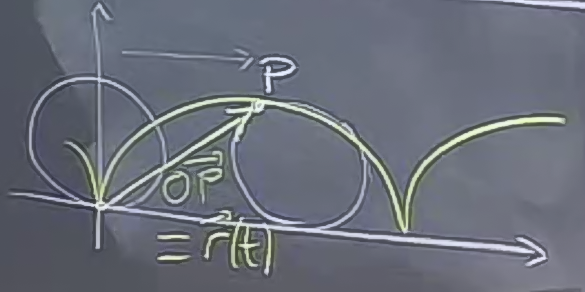

Hareket eden bir noktanın pozisyonunu üç boyutta zamana bağlı olarak aşağıdaki
gibi gösterebiliriz.

$$ (x(t), y(t), z(t)) $$

Bu noktayı takip etmenin diğer yollarından biri onu pozisyon vektörü
olarak görmektir, ki o zaman vektörün bileşenleri noktanın kordinatları olur. 

$$ 
\vec{r}(t) = < x(t),y(t),z(t) > 
$$

vektörü başlangıç (origin) noktası (0,0,0) ve bitiş noktası bizim noktamızın
konumu olan bir konum vektörünü temsil eder (resimde $\vec{OP}$ ile
gösterilmiştir).

Cycloid probleminde tekerlek yarıçapını 1 alalım ve birim hızda ilerliyor
olalım, ki böylece açıyı ($\theta$) ve zamanı ($t$) birbiri cinsinden temsile
edebilir hale gelelim.

$$ \vec{r}(t) = < t-\sin(t), 1-\cos(t) >$$

Şimdi, noktanın pozisyonunu zaman açısından bildiğimize göre, onun değişimini
inceleyebiliriz, mesela hızına, ivmesine bakabiliriz. İlk önce hıza
bakabiliriz. Fakat, hızı bir vektör olarak hesaplamadığınız sürece, hız sadece
bir sayıdan ibaret kalır, ayrıca eğer şu içinde GPS olan şatafatlı spor
arabalarından birine sahip değilseniz, hızınızın "hangi yönde" olduğunu
bulamazsınız. Sadece "gittiğiniz yönde'' (her ne yöne gidiyorsanız) ne kadar
hızlı olduğunuzu bulabilirsiniz.

O zaman biz hızımızı hesaplarken hem yönü, hem de hızı aynı anda düşünmeliyiz. 
Bu demektir ki vektör kavramı tekrar işimize yarayacak. Hızı
vektör olarak hesaplayabiliriz. 

Bunu nasıl yaparız? Pozisyon vektörünün zamana göre türevini alabiliriz. Temelde 
bunun sebebi hız kavramının tanımından kaynaklanır. Hız, herhangi bir uzayda 
zamana bağlı olarak pozisyonun değişim miktarıdır (ve elbette pozisyon belli bir 
yönde değiştiği için hızın bir yönü de vardır). Ve kalkülüs kullanarak, pozisyon 
vektörünün zamana bağlı türevini (değişimini) alırsak tam olarak hızı buluruz.

$$ \vec{v} = \frac{d\vec{r}}{dt} $$

Bu tür bir türevi bu derste ilk kez görüyoruz, ilk kez bir vektörün
türevini alıyoruz. Bu şekilde türev almak demek, o vektörün bileşenlerinin
teker teker türevini almak demektir. Yani

$$ =
<\frac{dx}{dt}, \frac{dy}{dt}, \frac{dz}{dt}>
$$

Cycloid örneğine dönersek

$$ \vec{r}(t) = < t-\sin(t), 1-\cos(t) >$$

ifadesinin türevini alırsak ne olur? 

$$ \vec{v} = \frac{d\vec{r}}{dt} = < 1-\cos(t),\sin(t) >$$

İşte bu türev bize hangi yönde ve ne kadar hızlı gittiğimizi gösteriyor. 

Bu arada bir vektörün büyüklüğünün (magnitude) her zaman mesafesel, uzaklıksal
anlamı olmayabileceğini de görmüş oluyoruz. Hız kavramı bir orandır, katedilmiş
bir mesafe, bir yer değildir, $t$ anında bir yönde olan bir büyüklüktür. Fakat
yine de bir büyüklüktür, bir yönü vardır, ve bu sebeple vektörler ile temsil
edilebilir.

Problemimize dönelim. Önceki derste tekerlekte izlenen noktanın en alta gelip
yükseldiği sıralarda hareketinin nasıl olduğunu irdelemiştik. Şimdi bu konuyu
hız kavramını kullanarak incelemeye uğraşalım. Üstteki vektöre $t=0$ koyarsam,
ne olur? Sonuç $< 0,0 >$, yani $\vec{v} = 0$. Tabii ki nokta $t=0$ öncesi hareket
ediyor, sonra da ediyor, yani bir hızı var, sadece "o anda'' hızı yok.

Peki hız vektör olarak daha fazla bilgi veriyor olmasına rağmen, ben yine de
klasik anlamda hızı, yani o tek sayıyı elde etmek istiyorsam ne yaparım?  Hız
vektörünün büyüklüğünü hesaplarım, $|\vec{v}|$.

$$ |\vec{v}| = \sqrt{ (1-\cos t)^2 + \sin^2t } $$

$$ = \sqrt{ 1-2\cos t + \cos^2t + \sin^2t } $$

$$ = \sqrt{ 2-2\cos t } $$

Bu formüle bakarak hızın nerede en fazla, en az olduğunu hesaplayabiliriz. Eğer
$t=0$ ise, sonuç sıfır olur. $t=\pi$ ise elimizde $\sqrt{4} = 2$ vardır, bu an
noktanın tekerleğin en üstünde olduğu andır, bu an aynı zamanda en hızlı hareket
ettiğimiz de andır. Hatta bu hız tekerleğin sağa doğru yatay gidiş hızının iki
katıdır, tekerleğin sağa doğru birim hızda ilerlediğini söylemiştik, fakat nokta
bunun üstüne bir de merkeze göre bir dönme hareketi içinde, ve bu iki etki
birbirine eklenerek $2$ hızına yol açıyor.

O nokta tepe noktasından aşağı inmeye başlayınca tabii ki noktamız dönüşün
"geriye doğru'' olan etkisiyle toplamı hızında düşme yaşıyor.

İvme

Bu konuyu işlemeden önce klasik olarak bilinen ivme kavramı ile burada
kullanacağımız ivme kavramı ile ciddi uyuşmazlıklar olduğunu
belirtmeliyim. Klasik anlayışta ivme mesela bir arabada giderken "hissettiğimiz
şey'' bizi koltuğa iten kuvvet, hızdaki değişim (hızın türevi) olarak bilinir ve
eğer bir arabada saatte 40 km ile gidiyorsam, ivme yok denir. Fakat şimdi bu
arabanın bir virajdan döndüğünü farzedelim, bu durumda bir kuvvet hissederiz,
hala saatte 40 ile gidiyor olabilirim, ama bir ivme vardır. Burada aslında yana
doğru bir hızlanma / ivme sözkonusudur. O zaman yine vektör kavramını
kullanmamız lazım.

İvme vektörünü şöyle belirtelim:

$$ \vec{a} = \frac{d\vec{v}}{dt} $$

Fizikteki ivme tanımı da budur, $F = ma$ derken kastedilen $a$ işte bu
$a$'dır. Bir vektördür. 

Cycloid'e dönelim. 

$$ \vec{v} = <1-\cos(t),\sin(t)>$$

Türevi alalım

$$ \frac{d\vec{v}}{dt} = <\sin(t), \cos t>$$

$t=0$ noktasında ivme nedir? $< 0,1 >$. 

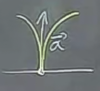

Yani $t=0$ anındaki ivme bir birim vektör, ve yönü tam yukarıya doğru. Bu ilginç
bir şey, o anda hız sıfır, fakat bir ivme mevcut.

Bu arada, hemen belirtelim

$$ \bigg|\frac{d\vec{r}}{dt}\bigg|  \ne \frac{d|\vec{r}|}{dt}$$

Yani bir vektörün türevinin büyüklüğü, o vektörün büyüklüğünün türevi ile aynı
şey değildir. Eşitsizliğin sağındaki kavram zaten çoğunlukla pek ise yarar bir
şey değildir, hesaplanabilir, biraz saç baş yoldurabilir ama mümkündür, fakat
çoğunlukla kullanılmaz.

Eğri Uzunluğu (Arc Length)

Eğri uzunluğu bir eğri üzerinde ne kadar yol katettiğimizi gösteren bir
büyüklüktür. Mesela bir arabadaki ne kadar yol katettiğinizi gösteren
kilometre sayacı bunu arabanın hızını belli bir zaman üzerinden entegre
ederek hesaplıyor.

$s$ = bir yol üzerinde katedilmiş mesafe

Bunun anlamı olması için tabii ki bir sabit, referans noktası
düşünmeliyiz. Orijin noktası bu nokta olabilir. Bu arada $s$ referans
noktasının neresinde olduğumuza göre negatif olarak ta
hesaplanabilir. Referansa kadar eksi, sonrası artı olabilir mesela.

Peki $s$ ile $t$, yani eğri uzunluğu ve zamanı nasıl birbirine bağlarız? 

$$ \frac{ds}{dt} = \textrm{ hız } = |\vec{v}| $$

Yani birim zamanda katedilen eğri uzunluğu hızdır [1, sf. 932].

Ama açık olmak gerekirse, aslında türevin mutlak değerini (absolute value) almak
daha doğru olur (dikkat, vektör büyüklüğü işareti değil, mutlak değer işareti bu
sefer)

$$ \bigg| \frac{ds}{dt} \bigg| = \textrm{ hız } = |\vec{v}| $$

Niye? Belki bir eğri üzerindeyiz ama o eğri üzerindeki hareketimiz bir ileri bir
geri şeklinde. Bu durumda eğri uzunluğunu sürekli saymak istemeyiz, onu
"çoğalan (ileri), azalan (geri)'' türünden bir büyüklük olarak görmek isteriz.

Eğri uzunluğu hesabı için hızı zaman üzerinden entegre ederiz. Mesela bir
cycloid'in (resimde sarı ile gösterilen) bir türünün uzunluğu ne kadar diye
hesaplamak istiyorsak, 

$$ \vec{v} = \sqrt{ 2-2\cos(t) } $$

ifadesinin 0 ile $2\pi$ arasında entegralini almamız lazım. 

$$ \int_o^{2\pi} \vec{v} = \int_o^{2\pi} \sqrt{ 2-2\cos(t) } \mathrm{d} t $$

Açıkça söylemek gerekirse bunun entegrali analitik olarak nedir bilmiyoruz,
ama ileriki derslerde bu hesabı yapmak için fiyakalı bir numara göreceğiz. 

Gidişatın Birim Teğet Vektörü

Notasyonda bu kavram çoğunlukla $\hat{T}$ olarak gösterilir. Şapka var
çünkü vektör birim vektör. $T$ çünkü "teğet''. 

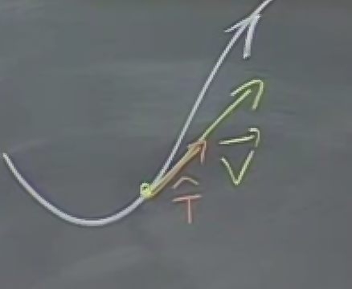

Vektör $\vec{v}$ gidişata (trajectory) zaten teğettir (dikkat, bu illa pozisyon
vektörü $\vec{r}$'a dik olacak anlamına gelmez, detaylar için bu dersin
sonundaki örnek sorulara bakın). $\hat{T}$ bir anlamda bu vektörün sadece
yönüdür, o zaman $\vec{v}$'nin yönü bize gerekli, demek ki onu birim vektör
haline getirirsek, $\hat{T}$'yi elde etmiş oluruz.

$$ \hat{T} = \frac{\vec{v}}{|\vec{v}|} $$

Bir sürü kavram birikti. Bunların birbiriyle bir alakası olmalı, onlardan
bahsedelim. 

$$ \vec{v} = \frac{d\vec{r}}{dt} = \frac{d\vec{r}}{ds}\frac{ds}{dt} $$

Üstte zincirleme kanununu (chain rule) kullandık. 

Biraz önce gördük ki $ds/dt = |\vec{v}|$. 

Eğer 

$$ \vec{v} = \frac{d\vec{r}}{ds}|\vec{v}| $$

işe, vektör $\vec{v}$'nin büyüklüğünü öyle bir şey ile çarpıyorum ki sonuç
olarak vektörün kendisi ortaya çıkıyor. O şey ne olabilir? Tabii ki
vektörün birim vektör olarak gösterilecek yönü olabilir. Bu birim vektörü
zaten hesaplamadık mı? Bu vektör $\hat{T}$'den başkası değil.

$$ \vec{v} = \hat{T}|\vec{v}| $$

ya da

$$ \vec{v} = \hat{T}\frac{ds}{dt} $$

Peki sezgisel olarak düşünürsek, $d\vec{r}/dt$ niye $\hat{T}$'ye eşit olmalı?
Alttaki grafiklere bakalım.

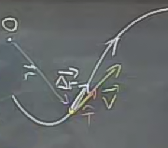


Yerimizi $t$ anında $\vec{r}(t)$, $\Delta t$ kadar bir adım atıyoruz, ve
$\vec{r}(t+\Delta t)$ noktasına geliyoruz. Bu noktada eğri üzerinde katedilen
mesafe $\Delta s$, o zaman

$$ \frac{\Delta s}{\Delta t} \approx hız $$

Yer vektörümüzün değişimi ise 

$$ \Delta \vec{r} \approx \hat{T} \Delta s $$

İki tarafı $\Delta t$ ile bölersek 

$$ \frac{\Delta \vec{r}}{\Delta t} \approx \hat{T} \frac{\Delta s}{\Delta t} $$

ve $\Delta t \to 0$ olarak limitini alırsak, o zaman üsttekiler türev
haline gelir, yaklaşıksal işaret eşitlik olur. Yani

$$ \frac{d\vec{r}}{dt} = \hat{T}\frac{ds}{dt} $$

Peki bu tür konularda vektörleri kullanalım. Aslında şimdiye kadar
gördüklerimizi diğer yollarla da temsil edebilirdik. Fakat vektör "dili''
özellikle hareketleri modellerken oldukça faydalı oluyorlar.

Örnek - Kepler'in İkinci Kanunu

Kanun 1609'da keşfedildi, yani pek yeni bir gelişme olduğu iddia
edilemez. Kepler gezegenlerin hareketini modellemeye uğraşıyordu. Bazı insanlar
gezegenler mükemmel bir çember içinde dönerler, vs. diyordu. Kepler gezegenlerin
yörüngesinin çember değil elips (ellipse) olduğunu öne sürdü. Kepler'in Kanunu
şöyle der:

Gezegenlerin hareketi bir düzlem üzerindedir, güneşten gezegene çekilebilecek
bir hayali çizginin kapsadığı alanın büyümesi / aşılması sabit bir orandadır. Bu
ilginç bir kanun çünkü bir kez yörüngenin şeklini bilirsek, o yörünge üzerinde
ne kadar hızlı gidebileceğimizi bize söylüyor.


Üstteki şekle bakarsak, güneş etrafında bir gezegen var, ve katedilen yol taralı
şekilde çizili. Kepler Kanunu şu anlama gelir, katedilen alan zamana
orantılıdır, eğer gezegen güneşe daha yakın olsa, daha hızlı gitmek zorundadır,
uzak olsa, daha yavaş gitmek zorundadır, ki katedilen alanın zamana oranı aynı
kalsın. Niye? Eğer yakın olursak, güneşe direk mesafe azalacaktır, boydan
kaybettiğimizi diğer yönden kazanmamız gerekir, yani aynı zamanda aynı alanı
katetmek için bu sefer yöründe üzerine daha hızlı gidilmelidir, ki aynı alana
erişebilelim. Tabii gezegenlerin aklı yoktur, böyle olsun diye uğraşmazlar,
Kepler gözlemlerini yaparken, modellerken değişmeyen bu büyüklüğü keşfetmiştir,
ve sayede bazı hesapları temiz sekilde yapabilmesi mümkün olmuştur.

Biz de şimdi bu kanunu, mekanik / fizikten bugün bildiklerimizi kullanarak
doğrulamaya çalışacağız. Newton, ki 1600'lu yılların sonlarında ortaya
çıktı, bu durumu yerçekimi formülleri ile açıklamayı başardı. 

Şimdi vektörler kullanarak bu modeli yaratacağız ve Kepler'in onları
kullanarak alan hesabının aslında ne kadar doğal / bariz olduğunu
göreceğiz. Fakat Kepler bu kanunu ortaya atarken işler hiçbir bu kadar
bariz değildi!

Tekrar bir pozisyon vektörü $\vec{r}$ yaratalım, başlangıcı güneş, bitiş noktası
gezegen olsun, katedilen yol $\Delta \vec{r}$ olsun. İlerlemeden önce iki
vektörün $\vec{r}_1$ ve $\vec{r}_2$ gibi iki vektörün farkının $\Delta r$ olup
olamayacağını kontrol edelim. Birinci vektörü $\vec{A}$, ikinciyi $\vec{B}$
olarak görürsek, $\vec{B} - \vec{A}$ nasıl hesaplanır?  Vektör toplamayı
biliyoruz, $\vec{B} - \vec{A}$ aslında $\vec{B} + (-\vec{A})$.

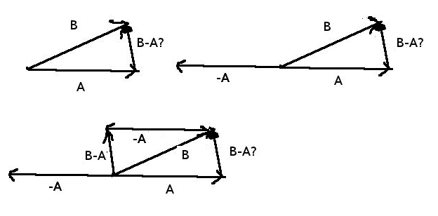

Üstteki resimde 3. şekle bakarsak, katedilen mesafenin hakikaten iki vektör
farkı olarak görülebileceğini anlarız. 

Devam edelim: Katedilen alanı nasıl hesaplarız. 

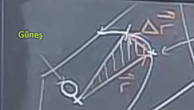

Şekilde çizdiklerimiz yeterince ipucu veriyor, yaklaşıksal olarak bir üçgen
oluştu. Alan bir kenarı $\vec{r}$, diğer kenarı $\Delta \vec{r}$ olan
paralelogramın yarısı. Paralelogram hesabını yapmayı biliyoruz nasılsa,

$$ 
\textrm{ $\Delta t$'de Kapsanan Alan } \approx
\frac{1}{2} |\vec{r} \times \Delta \vec{r}| 
$$

ki $\Delta t$ oldukça küçük olmalı. 

Ayrıca

$$ \Delta \vec{r} \approx \vec{v} \Delta t $$

O zaman alan

$$ \approx
\frac{1}{2} |\vec{r} \times \vec{v}| \Delta t
 $$

Peki bu alanın zamana sabit oranda olması ne demektir? Alanın $\Delta t$'ye
oranlı olması demektir, bu da üstteki formülde $|\vec{r} \times \vec{v}|$
teriminin sabit olması demektir.

2. kanunu düşünelim, gezegenin yörüngesinin hep aynı düzlem üzerinde olduğunu
söylüyordu. Bu demektir ki $\vec{r} \times \vec{v}$ ile ortaya çıkan ve bu
ikisine normal (dik) olan üçüncü vektörün "yönü'' hep aynı kalmalıdır. Çünkü
iki vektör bir düzlem tanımlar, bu iki vektöre dik olan düzleme de diktir, ve
düzlem hiç değişmiyorsa bu vektörün yönü de değişemez.


O zaman hem büyüklük aynı, hem yön aynı, o zaman Kepler'in 2. Kanunu $\vec{r}
\times \vec{v}$ bir sabit vektör demektir. Ne yönü ne büyüklüğü değişmeyecektir.

Türevler bağlamında bunu şöyle söyleyebiliriz

$$ \frac{d}{dt}(\vec{r} \times \vec{v}) = 0 $$

Türevler normal çarpımlar içine nüfuz ederken Çarpım Kanunu (Product Rule)
kullanılıyordu. Çapraz çarpımlar için de aynı kural geçerli, yani üstteki

$$ = \frac{\vec{dr}}{dt} \times \vec{v} + \vec{r} \times \frac{d\vec{v}}{dt} $$

Daha önce türettiğimiz eşitlikleri üsttekilerin yerine koyarsak

$$ =\vec{v} \times \vec{v} + \vec{r} \times \vec{a} = 0$$

Bir vektörün kendisi ile çapraz çarpımı her zaman sıfırdır. O zaman $\vec{v}
\times \vec{v} = 0$. Denklemden atılabilir. Geriye kalanlar

$$ = \vec{r} \times \vec{a} = 0$$

Üstteki ifade ne zaman doğru olabilir? Ya da genel olarak iki vektörün çapraz
çarpımı ne zaman sıfırdır? Eğer birbirlerine paraleller ise. Bu demektir ki ivme
$\vec{a}$ ile pozisyon $\vec{r}$ birbirine paraleldir. Yani Kepler'in 2. Kanunu
aslında bunu söylemektedir.

Ve biz bugün yerçekim gücünün $\vec{r}$'e paralel olduğunu biliyoruz, yani
mesela güneşin bir gezegeni kendine direk bir yönde çektiğini biliyoruz. Demek
ki üstteki ifadenin sıfır olduğu da doğrudur.

Not: Bu arada parallellik hem çekim, hem itme için geçerli olur (her iki durumda
da yön paraleldir). Hakikaten de elektriksel alanda parçacıkların çekilmesi ve
itilmesi bağlamında da Kepler'in Kanunu aynen işlemektedir.

Ekler

Yol Entegrali (Path Integral)

Eğri uzunluğu hesabını formülize etmenin bir diğer yolu daha var, bu da yol
entegral kavramı ile (dikkat bu kavram çizgi entegrali -line integral-
kavramından farklı). Diyelim ki [6, sf. 352] bir skalar fonksiyon $f$ verildi
öyle ki $f: \mathbb{R}^3 \to \mathbb{R}$ ve biz bu fonksiyonun $c$ eğrisi, ki
$c(t) = (x(t),y(t),z(t))$ olacak şekilde, üzerinden alınan entegrali merak
ediyoruz. Belki $f(x,y,z)$ bir sıcaklığı temsil ediyor ve bir $c$ kablosu
üzerindeki ortalama sıcaklığı merak ediyoruz (yani $c$ üzerinden bir $f$ toplamı
yapmak gerekiyor) gibi.

Yol entegrali şöyle hesaplanır,

$$
\int _{a}^{b} f(x(t),y(t),z(t)) || c'(t) || \mathrm{d} t
$$

Şöyle de temsil edilebilir,

$$
\int_{a}^{b} f(c(t)) || c'(t) || \mathrm{d} t
$$

ki $\vec{c}(t) = c(t)$, yani $c(t)$ vektör fonksiyonu.

Eğer $f = 1$ ise üstteki hesap eğri uzunluğunu verecektir. 

Eğer $c$ eğrisi bir kordinat düzlemi üzerindeyse mesela alttaki resimde olduğu
gibi $x-y$ düzleminde, o zaman yol entegrali görülen o sanki çit gibi duran
bölgenin alanını hesaplar

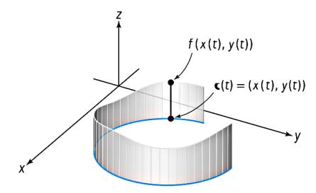

Hesap

$$
\int_{a}^{b} f(x(t),y(t)) \sqrt {x'(t)^2 + y'(t)^2} \mathrm{d} t
$$


Eğri Uzunluğu (Arc Length, Alternatif Anlatım)

Bir anlatım daha.. Elde $C$ eğrisi var, ve parametrik olarak tanımlı [1, sf. 417],

$$
x = f(t), \quad y = g(t), \quad a \le t \le b
$$

Fonksiyonun sürekli türevi alınabilir olduğunu farz edelim, bu durumda $C$ bir
pürüzsüz eğri olacaktır.  Eğriyi $P_0,P_1,...,P_n$ noktalarında $n$ tane parçaya
bölelim, öyle ki $P_k = (f(t_k),g(t_k))$. Bu parçaları düz çizgi ile
birleştirirsek,


Her çizgi parçasının uzunluğu 

$$
L_k = \sqrt{(\Delta x)^2 + (\Delta y)^2}
$$

$$
= \sqrt{[f(t_k) - f(t_{k-1})]^2 + [g(t_k) - g(t_{k-1})]^2 }
$$

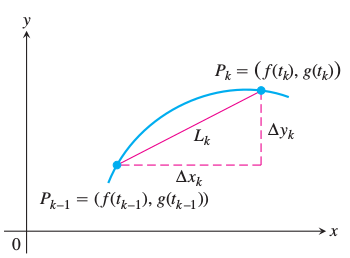

Eğer $\delta t_k$ yeterince ufaksa $L_k$ yaklaşık olarak $P_{k-1}$ ve $P_k$
arasındaki eğrinin uzunluğudur. Ve Ortalama Değer Teorisine göre $[t_{k-1},t_k]$
arasında $t_k^\ast$ ve $t_k^{**}$ mevcuttur öyle ki

$$
\Delta x_k = f(t_k) - f(t_{k-1}) = f'(t_k^\ast) \Delta t_k
$$

$$
\Delta y_k = g(t_k) - g(t_{k-1}) = g'(t_k^\ast) \Delta t_k
$$

O zaman eğrinin uzunluğu tüm bu uzunluklar $L_k$'lerin toplamı 

$$
\sum_{k=1}^{n} L_k = \sum_{k=1}^{n} \sqrt{(\Delta x_k)^2 + (\Delta y_k)^2} 
$$

$$
= \sum_{k=1}^{n} \sqrt{[f'(t_k^\ast)]^2 + [g'(t_k^{\ast\ast})]^2} \Delta t_k
$$

Üstteki toplam her ne kadar bir Riemann toplamı olmasa da (çünkü $f'$ ve $g'$
değişik noktalarda hesaplanıyorlar) ileri Calculus'taki bir teori onun limitini
garantiler, yani üstteki formülden alttaki entegrale geçiş yapılabilir,

$$
\int_{a}^{b} \sqrt{[f'(t)^2 + g'(t)^2} \mathrm{d} t
$$

Üç boyutlu eğri için tabii ki üstteki kalıp genişletilir.

Bazen tek boyutlu, klasik, parametrik olmayan durumda, mesela $y = f(x)$ için

$$
L = \int_{a}^{b} \sqrt{1 + \left( \frac{\mathrm{d} y}{\mathrm{d} x} \right)^2} \mathrm{d} x 
$$

formülünü görebilirsiniz, bu da parametrik formülasyona bağlanabilir, $y(x(t))
= f(x(t))$ ve $x(t) = t$ dersek $\frac{\mathrm{d} x}{\mathrm{d} t} = 1$ olacaktır,
formüldeki 1 terimi buradan geliyor.

Örnek

$y = \frac{2 x ^{3/2}}{3}$ fonksiyonunun $(1,2/3)$ ile $(2,\frac{4\sqrt{2}}{3})$ 
arasındaki uzunluğu nedir [4]? 

```python
x = np.linspace(0,3,100)
y = 2*x**(3/2) / 3.0
plt.plot(x,y)
plt.savefig('calc_multi_06_02.png')
```


$$
 \frac{2 x ^{3/2}}{3}, \quad f'(x) = \frac{3}{2} \frac{2}{3} x^{1/2} =
 \sqrt{x} = [f'(x)]^2 = x
$$

$a=1,b=2$

$$
L = \int_{a}^{b} \sqrt{ 1+ [f'(x)]^2} \mathrm{d} x = 
\int_{1}^{2} \sqrt{1 + x} \mathrm{d} x
$$

$u = 1 + x$, $u(1) = 1$, $u(2) = 3$ ile

$$
= \int_{2}^{3} \sqrt{u} \mathrm{d} u = \frac{u^{3/2}}{3/2} \bigg\vert_{2}^{3} = 
\frac{2}{3} [3 \sqrt{3} - 2\sqrt{2} ]
$$


```python
print (3*np.sqrt(3) - 2*np.sqrt(2))
```

```
2.3677252979604417
```

<hr>

Soru

Diyelim ki $P$ noktası bir küre (sphere) üzerinde hareket ediyor ve 

$$ OP = \vec{r}(t) = x(t)\hat{i} + y(t)\hat{j} + z(t)\hat{k}  $$

Hız vektörü $\vec{v}$'nin her zaman pozisyon vektörü $\vec{r}$'ye dik
olduğunu $x,y,z$ kordinatlarını kullanmadan ve alttaki eşitlikten 
faydalanarak

$$
\frac{d}{dt}\vec{a} \cdot \vec{b} =  
\frac{d\vec{a}}{dt} \cdot \vec{b} +
\vec{a} \cdot \frac{d\vec{b}}{dt} 
\qquad (1)
$$

olduğunu ispatlayin. 

Cevap

Eğer $\vec{r}$ ve $\vec{v}$ birbirine dik ise, o zaman $\vec{r} \cdot
\vec{v} = 0$ demektir. 

Bu arada hatırlayalım ki hız pozisyon vektörünün zamana göre türevidir. 

$$ \vec{v} = \frac{d\vec{r}}{dt} $$

Şuradan bir giriş yapalım. Eğer üzerinde olunan kürenin yarıçapı $a$ ise, 

$$ \vec{r} \cdot \vec{r} = a^2 $$

Üsttekinin formül (1)'e göre türevini alalım

$$ 
\frac{d}{dt}\vec{r} \cdot \vec{r} =  
\frac{d\vec{r}}{dt} \cdot \vec{r} +
\vec{r} \cdot \frac{d\vec{r}}{dt} = 0
 $$

Sağ taraf sıfır çünkü sabit $a^2$'nin türevi sıfır. Buradaki önemli gözlem
şudur, eşitliğin sağ tarafı "$t$'ye bağlı olmayan, sabit bir değerdir'', bunu
söyleyebiliyoruz, çünkü problem bir küre üzerinde gezinildiği bize söylemiş. Bu
önemli bir püf noktası, bu bilgi sayesinde türevi alıp sağ tarafı sıfır
yapabiliyoruz. Devam edelim

$$ 
2 \frac{d\vec{r}}{dt} \cdot \vec{r} = 0
$$

$$ \vec{v} \cdot \vec{r} = 0 $$

Demek ki iki vektör birbirine dik. 2 değeri formülden atıldı, sağ taraf
sıfır olduğu için önemli değil.

Soru IJ-4

Bir önceki soruda ispatlananın tam ters yönünü ispatlayın. Eğer $\vec{r}$
ve $\vec{v}$ dik ise, $P$'nin hareketi kesinlikle bir küre üzerinde olmak
zorundadır. 

Cevap

Biliyoruz ki

$$ \vec{r} \cdot \vec{r} = |r|^2 $$

Türevi alınca

$$ 
\frac{d}{dt}\vec{r} \cdot \vec{r} = 0 
 $$

Sağ taraf sıfır oldu çünkü orada bir sabit vardı. Diğer taraftan, eğer
diklik olduğunu biliyorsak şu doğru olmalı

$$ \vec{v} \cdot \vec{r} = 0 $$

$\vec{v}$ aynı zamanda pozisyonun türevidir, üstte yerine koyalım

$$ 
\frac{d\vec{r}}{dt} \cdot \vec{r} = 0
$$

Önceden görmüştük ki 

$$ 
2 \frac{d\vec{r}}{dt} \cdot \vec{r} =
\frac{d}{dt}(\vec{r} \cdot \vec{r})   
 $$

Bu denklemin sol tarafı iki üstteki formülün sol tarafına benziyor, o zaman

$$ \frac{d}{dt}(\vec{r} \cdot \vec{r}) = 0 $$

Şimdi şunu soralım: Türevi sıfır olan şey nedir? Bir sabittir. 

$$ \vec{r} \cdot \vec{r} = c \textrm{ adında bir sabit }$$

O zaman $|\vec{r}| = \sqrt{c}$. 

Eğer $\vec{r}$'nin uzunluğu hiç değişmiyor ise, o zaman pozisyon bir küre
üzerinde hareket ediyor olmalıdır.

Soru 1I-1

$P$ noktası sabit hız $v$ (dikkat bu vektör değil) ile sabit vektör
$a\hat{i}+b\hat{j}$ yönünde ilerliyor. Eğer $t=0$ anında $x_0,y_0$'da isek,
pozisyon vektörü $\vec{r}(t)$ nedir?

Cevap

Anahtar kelime "yön''. Sabit vektör "yönünde'' gitmemiz isteniyor o zaman
bu vektörün yönünü bulalım. Onu birim vektör haline getirirsek 

$$ \vec{u} = \frac{a\hat{i}+b\hat{j}}{\sqrt{a^2+b^2}} $$

Yön bu. Bu yönde ilerlemek için 

$$ \vec{r}(t) = < x_0,y_0 > + \vec{u}vt $$

$$  = < x_0,y_0 > + \frac{(x_0+avt)y+(y_0 + bvt)\hat{j}}{\sqrt{a^2+b^2}}$$

Problem 1I-3

Alttaki pozisyon vektörünün hareketini $t$ $-\infty$ ile $\infty$ arasında
giderken tarif edin. [Vektörün ucundan olan] P noktasının xy denklemini
verin, ve pozisyon vektörünün tanımladığı bu eğrinin hangi bölümünün
üzerinden geçildiğini gösterin. 

a) 

$$ \vec{r} = 2\cos^2t \hat{i} + \sin^2t \hat{j}  $$

Cevap

$$ x(t) = 2\cos^2t $$

$$ y(t) = \sin^2t $$

Şimdi $t$ bazlı denklemlerden $x,y$ bazlı denklemlere geçmek istiyorsak, $t$'yi
yoketmeliyiz, o zaman üsttekini bir lineer denklem sistemi olarak
görebiliriz. Eğer ikinci denklemi 2 ile çarpıp toplarsak

$$ x + 2y = 2 $$

elde ederiz, çünkü trigonometriden $\cos^2t + \sin^2t = 1$ olduğunu
biliyoruz. Elde ettiğimiz bir çizgiyi temsil eder, bu çizginin taranan kısmı
$\cos$ ve $\sin$'in nerelerde en büyük olduğuna bağlıdır. Bu iki fonksiyon uç
noktalarda birbirinin tersi değerlere sahiptirler, biri 0 iken öteki 1
değerindedir, ve tam tersi, vs. O zaman $x,y$ (0,1) ve (2,0) arasında gidip
gelinecektir, $t$ ne olursa olsun.

Şu kod olanları gösterecektir (aradan bazı seçilmiş resimler ile)

```python
xmax = 10.
xmin = -10.
D = 20
x = np.linspace(xmin, xmax, D)
plt.xlim(-10,10)
plt.ylim(-10,10)

for i,t in enumerate(np.linspace(-3., 3., 30)):
    if i % 4 == 0: # her dort resimden birini sec
        plt.plot (x,((2. - x)/2.))
        xx=2*np.cos(t)**2
        yy=np.sin(t)**2
        plt.quiver(0,0,xx,yy)
        plt.plot(xx,yy,'rd')
        plt.savefig('1i3_' + str(i) + '.png')
        plt.figure()
```

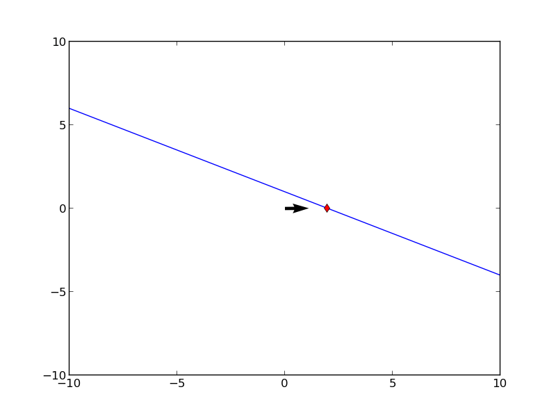
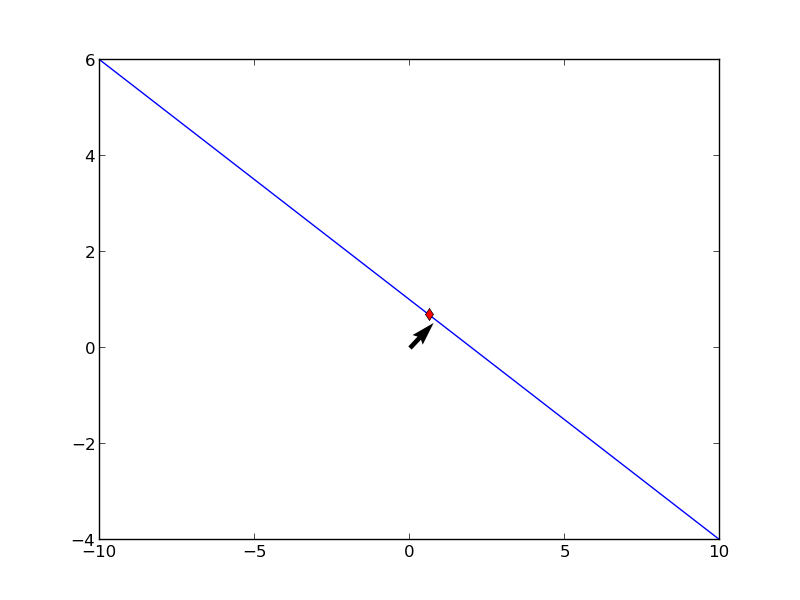


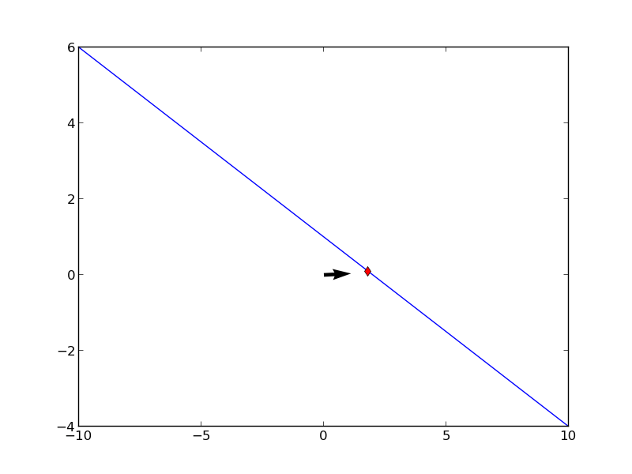

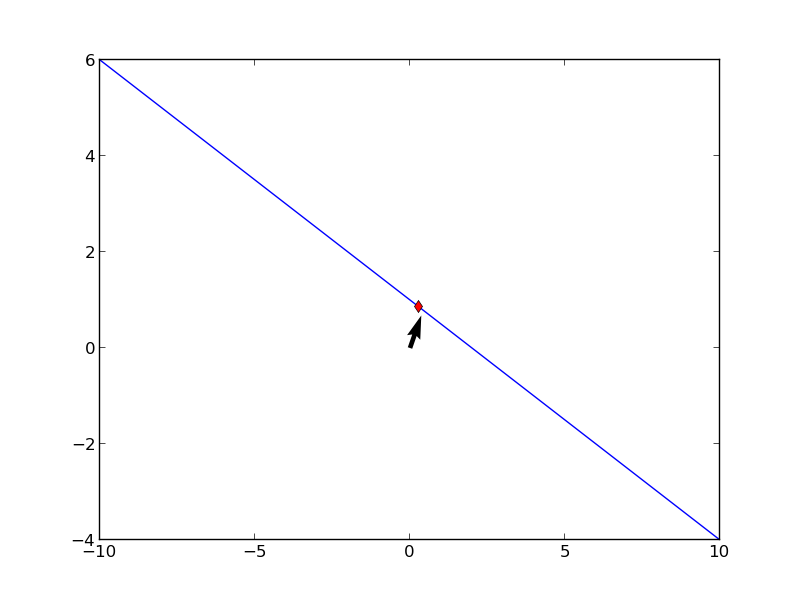
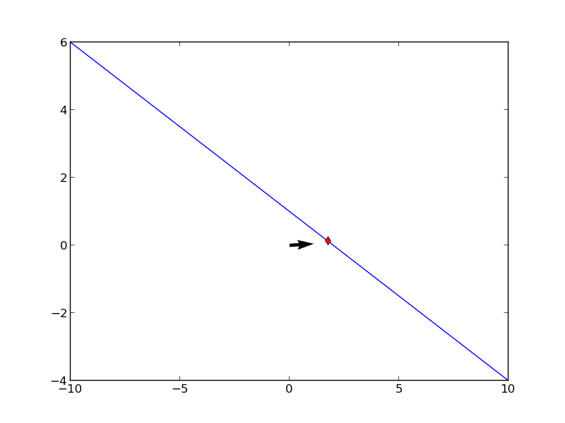

b) 

$$ \vec{r} = \cos 2t \hat{i} + \cos t \hat{j}  $$

Cevap

$$ x = \cos 2t $$

$$ y = \cos t $$

Bir trigonometrik eşitlik şöyledir

$$ \cos 2t = \cos^2 t - \sin^2t  $$

$$ = 2 \cos^2(t) - 1 $$

O zaman

$$ x = 2 \cos^2(t) - 1  $$

$$ y = \cos t $$

Eğer $y$'nin karesini alıp -2 ile çarparsak

$$ x = 2\cos^2(t) - 1  $$

$$ -2y^2 = -2\cos^2(t) $$

ve üstteki $x$ ile toplarsak $\cos$ terimleri iptal olur

$$ x-2y^2 = -1 $$

$$ x = 2y^2 -1 $$

Bu bir parabol. Uç noktaları bulmak için $y$ için -1,0,1 değerlerini koyup
sonuca bakarız, ve en uç noktaların (1,1) ve (1,-1) olacağını görürüz. 

Eğer $ds/dt = |\vec{v}|$ ilişkisi anlaşılmadıysa, başka bir yönden, biraz daha
detaylı bir açıklama şöyle. Katedilen mesafeyi parametrize edilmiş bir
$\vec{r}(t)$'nin taradığı sonsuz küçüklükteki parçaların birleşimi olarak
görelim.

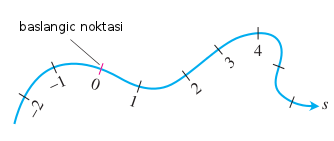

Bu parçalar parametrize halde $dx/dt$, $dy/dt$ ve $dz/dt$ olmayacak mıdır?
O zaman sonsuz küçüklükteki $ds$, bir parçanın uzunluğu şöyledir

$$ \sqrt{ 
\bigg(\frac{dx}{dt}\bigg)^2 + 
\bigg(\frac{dy}{dt}\bigg)^2 + 
\bigg(\frac{dz}{dt}\bigg)^2 }
$$

$a$ ve $b$ arasındaki $t$ için, bunu entegralini alabiliriz

$$ L = \int_a^b \sqrt{ 
\bigg(\frac{dx}{dt}\bigg)^2 + 
\bigg(\frac{dy}{dt}\bigg)^2 + 
\bigg(\frac{dz}{dt}\bigg)^2 
} \mathrm{d} t $$

Dikkatle bakarsak, mesela $dx/dt$ sonucu $\vec{r}(t)$'nin türevini
aldığımızda ele geçen $\vec{v}$ içindeki $\hat{i}$'in öğesidir, aynı
şekilde $\hat{j},\hat{k}$. O zaman üstteki sonucu $\vec{v}$ formuna da
çevirebiliriz: 

$$ L = \int_a^b |\vec{v}| \mathrm{d} t $$

Eğer bir uzunluk formülü $s$'i $t$'ye bağlı olarak yazmak istersek,
entegralin üst sınırını $t$ yaparız,

$$ s(t) = \int_{t_0}^t |\vec{v(\tau)}| \mathrm{d}\tau  $$

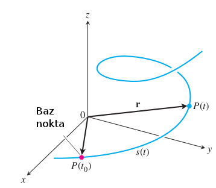

O zaman $ds/dt$ nedir? $s(t)$ formülünün türevidir. Calculus'un Temel
Teorisi'ne göre entegral yokolur ve elimize geçen

$$ \frac{ds}{dt} = |\vec{v}(t)|$$

ki bu sonuç mantıklı. 

Hız tanımında $t_0$'in hiçbir önemi kalmadığına dikkat, bu başlangıç noktası
$s(t)$ için önemliydi, çünkü toplam uzunluk için ona ihtiyaç vardır, fakat bir
parçacığın bir yolu katetme oranı (hız) başlangıçtan ne kadar uzakta olduğundan
bağımsız.

Soru 1J-7

Türevi alınabilen pozisyon vektörü $\vec{r}(t)$ veriliyor. $t$'nin aynı zamanda
$s$ sonucunu vermesinin şartları nelerdir?

Cevap

Şart hız büyüklüğünün yani $|v|=1$ olmasıdır, kontrol edelim. 

$$ \bigg|\frac{\mathrm{d} s}{\mathrm{d} t}\bigg| = |v| = 1 $$

$$ ds = dt $$

$$ \int \mathrm{d} s = \int \mathrm{d} t $$

$$ t = s + c $$

$t=0$ iken $s=0$ olduğuna göre $c=0$. O zaman 

$$ t = s $$

Egzersizler 13.3, Soru 11, [1] kitabından,

$\vec{r} (t) = 4 \cos t \hat{i} + 4 \sin t \hat{j} + 3t \hat{k}$ 
eğrisinin uzunluğunu, yani $s$'yi  $0 \le t \le \pi / 2$ 
aralığı için bul. 

Şu formülü kullanacağız

$$ s(t) = \int_{t_0}^t |\vec{v(\tau)}| \mathrm{d}\tau  $$

Önce $\vec{v}$ lazım. Biliyoruz ki

$$ \vec{v} = \frac{d\vec{r}}{dt} $$

O zaman $\vec{r}(t)$'nin türevi

$$ \vec{v} = -4\sin(t)\hat{i} + 4\cos(t)\hat{j} + 3\hat{k} $$

$$ |v| = \sqrt{16\sin^2t + 16\cos^2t  + 9} = 
\sqrt{16(\sin^2t + \cos^2t) + 9} = 
 $$

$$ = \sqrt{16(1) + 9} = \sqrt{25} = 5 $$

$$ s(t) = \int_0^t 5 \mathrm{d} \tau = 
5t 
$$

$$ s(\pi / 2) = 5(\pi/2) $$

Kaynaklar

[1] Thomas, *Thomas' Calculus, 11. Baski*

[2] *Paul's Online Notes*,
    [http://tutorial.math.lamar.edu/Classes/CalcII/ArcLength.aspx](http://tutorial.math.lamar.edu/Classes/CalcII/ArcLength.aspx)

[3] *Pheng Kim Ving*,
    [http://www.phengkimving.com/calc_of_one_real_var/12_app_of_the_intgrl/12_06_arc_len.htm](http://www.phengkimving.com/calc_of_one_real_var/12_app_of_the_intgrl/12_06_arc_len.htm)

[4] *Math 10560, Calculus II, Resources*, 
    
[5] *University of Notre Dame, Math 10560, Calculus II*,
    [https://www3.nd.edu/~apilking/Calculus2Resources/Lecture%2016/SlidesL16.pdf](https://www3.nd.edu/~apilking/Calculus2Resources/Lecture%2016/SlidesL16.pdf)

[6] Marsden, *Vector Calculus*
      

