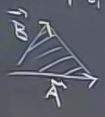
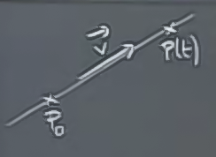

# Ders 7

Bugünün konusu "herşey''. Şimdiye kadar gördüğümüz her şey
yani. Vektörleri gördük, noktasal çarpımları (dot product) gördük. İki
vektörün noktasal çarpımı

$$ \vec{A} \cdot \vec{B} = \sum a_ib_i$$

şeklindedir, yani o vektörlerin tüm elemanlarının sırasıyla birbiriyle çarpılıp
toplanmasıdır. O da su ifadeye eşittir

$$ |\vec{A}||\vec{B}| \cos \theta $$

Noktasal çarpımı açıları ölçmek için kullanabiliriz, eğer $\cos \theta$ terimini
tek başına bırakırsak, geri kalanları çözebiliriz. Bu şekilde iki vektörün dik
olup olmadığını da anlarız. Çünkü o zaman sonuç sıfır olur, ve $\cos \theta = 0$
ise açı dik demektir.

Gördüğümüz bir diğer kavram çapraz çarpım (cross product) kavramıydı. 

$$ \vec{A} \times \vec{B} = 
\left|\begin{array}{rrr}
\vec{i} & \vec{j} & \vec{k}  \\
a_1 & a_2 & a_3 \\
b_1 & b_2 & b_3 
\end{array}\right|
$$

Eşitliğin sağındaki determinant işareti, matris işareti değil, buna
dikkat. Çapraz çarpımın uygulamalarından biri olarak uzayda bir üçgenin alanını
bulmayı söyleyebiliriz.

Bu alan

$$ \frac{1}{2}|\vec{A} \times \vec{B}| $$

ile hesaplanır. Çünkü $|\vec{A} \times \vec{B}|$'nin sonucu bir paralelkenar
verir, onun yarısı aradığımız üçgenin alanıdır.

Çapraz çarpımın bir diğer uygulama alanı ise, iki vektöre aynı anda dik olan
üçüncü bir vektörü bulmaktır. Ona bağlantılı olarak bir düzleme (plane) dik
olan bir vektörü bulmak, yani "normal vektörü'' bulmaktır. Düzlemin formülü
nedir? 

$$ ax + by + cz  = d $$

Normal vektör ise $\vec{N} = < a,b,c >$ olarak gösterilir. Normal vektörün
değerleri düzlem formülüne katsayı olarak giderler.

Çizgiler

Çizgilerin formülü için bir başlangıç noktasına ve o çizgiye paralel olan bir
vektöre ihtiyacımız var.

$$ P(t) = P_0 + t \vec{v} $$

Problem 3

$$ A = 
\left[\begin{array}{rrr}
1 & 3 & 2 \\
2 & 0 & -1 \\
1 & 1 & 0
\end{array}\right]
 $$

Bize matrisin tersi verilmiş ve iki öğesi boş bırakılmış

$$ A^{-1} = \frac{1}{2}
\left[\begin{array}{rrr}
1 & .. & .. \\
-1 & -2 & 5 \\
2 & 2 & -6
\end{array}\right]
 $$

Yani bizden beklenen tersine çevirme işlemini yapmak, ama boş bırakılan
değerlere bakalım, bu noktada bizden kafayı çalıştırıp, sadece o noktalara
tekabül eden minörleri hesaplamamız bekleniyor. O minörler hangileri? Şunlar (x
ile işaretli olanlar).

$$ A = 
\left[\begin{array}{rrr}
.. & .. & ..\\
x & .. & ..\\
x & .. & ..
\end{array}\right]
 $$

çünkü devriğini alma işlemini yapınca, o elemanlar A'nın tersindeki nokta nokta
olan yere geçmiş olacaklar.

Minörleri hesaplarsak

$$ A = 
\left[\begin{array}{rrr}
.. & .. & ..\\
-2 & .. & ..\\
-3 & .. & ..
\end{array}\right]
 $$

Şimdi kofaktörleri hatırlayalım (Ders 3)

$$ 
\begin{array}{rr}
+ - + \\
- + - \\
+ - + 
\end{array}
 $$

O zaman

$$ A = 
\left[\begin{array}{rrr}
.. & .. & ..\\
+2 & .. & ..\\
-3 & .. & ..
\end{array}\right]
 $$

Devriğini alalım

$$ A = 
\left[\begin{array}{rrr}
.. & +2 & -3\\
.. & .. & ..\\
.. & .. & ..
\end{array}\right]
 $$

Determinant'a bölelim. Determinantın ne olduğu verilmiş, 2, ama bu değer zaten
$1/2$ olarak $A$'nin tersi önünde duruyor. O zaman 2 ve -3 değerlerini olduğu
gibi boş olan yerlere taşırız.

$$ A^{-1} = \frac{1}{2}
\left[\begin{array}{rrr}
1 & 2 & -3 \\
-1 & -2 & 5 \\
2 & 2 & -6
\end{array}\right]
 $$

Örnek

$MX = 0$

Sistem

$$ x + 3y + z = 0 $$

$$ 2x - z  = 0$$

$$ x + y = 0 $$

Eğer noktasal çarpım olarak yazarsak 

$$ < x,y,z > \cdot < 1,3,1 > = 0 $$

$$ < x,y,z > \cdot < 2,0,-1 > = 0 $$

$$ < x,y,z > \cdot < 1,1,0 > = 0 $$

Bu ifade bize aslında üstte sağdaki üç vektöre dik olan bir vektörü bulmamızı

söylüyor, çünkü o vektörle $< x,y,z >$ noktasal çarpımı sıfır sonucu veriyor. İki
vektöre dik üçüncü bir vektör bulmayı zaten biliyoruz, ilk iki vektör $< 1,3,1 >$
ve $< 2,0,-1 >$'i kullanarak bunu yapabiliriz, onların çapraz çarpımını
alırız (üçüncü denklemi atlıyoruz -aslında hangi iki vektörü seçtiğimiz önemli
değil-),

$$ 
\left|\begin{array}{rrr}
\vec{i} & \vec{j} & \vec{k}  \\
1 & 3 & 1 \\
2 & 0 & -1
\end{array}\right| = < -3,3,-6 >
$$

Bir denklem atladık, 3 boyutta hepsi birbirine dik en fazla üç tane vektör
olabilir, o zaman iki vektöre dik üçüncü bir vektörü çapraz çarpımla elde
edersek, bu vektör atladığımız üçüncü vektöre paralel demektir.

Tüm çözümler de şöyledir

$$ x = -3t $$

$$ y = 3t $$

$$ z = -6t $$

