# Ders 8

İki değişkenli bir fonksiyonu gösterebilmek (plotting) için 


$x,y$ değerlerine tekabül eden $f(x,y)$'yi, z ekseni üzerindeki yükseklik olarak
kabul ederiz, ve oraya bir nokta koyarız. Tüm $x,y$'ler için bu yapılırsa bir
yüzey ortaya çıkar. Dikkat 3 boyutlu bir şekil görülecektir, fakat içi dolu
değildir, fonksiyon sadece yüzeydedir.

Örnek

$$ f(x,y) = -y $$

iki değişkenli de olsa illa her iki değişken fonksiyonda kullanılmalı diye
bir şart yok. Bu formül bir düzlem tanımlar. 

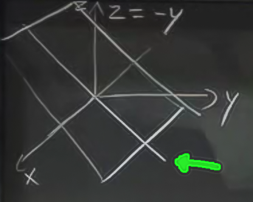

Hoca çizmek için önce yeşil okun gösterdiği çizgiden başladı, ki bu çizgi
$z=-y$, -1 eğimi olan bir çizgi. $x$ tanımlı olmadığına göre bu çizgi her $x$
için geçerli olmalı, ve üstteki düzlem ortaya çıkıyor. x-ekseni bu düzlemin
içinden geçiyor.

Örnek 

$$ f(x,y) = 1-x^2-y^2 $$

Grafiği anlamak için $yz$ düzleminde neler oluyor onu anlamaya
uğraşalım. Sadece $yz$ düzlemine bakmak demek, $x=0$ kabul etmek demektir,
o zaman geri kalanlar 

$$ z = 1-y^2 $$

bir parabolu tanımlar. 

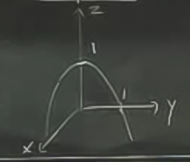

Peki $xz$ düzleminde neler olur?

$$ z = 1- x^2 $$

yine aşağı dönük bir parabol. 

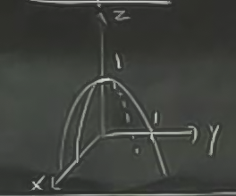

$xy$ düzlemiyle nerede kesişim olur? $z=0$ ise, 

$$ 1-x^2-y^2 = 0 $$

$$ x^2 + y^2 = 1 $$

Bu birim yarıçapı olan bir çemberdir (unit circle). 

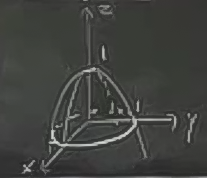

İlginç bir diğer fonksiyon

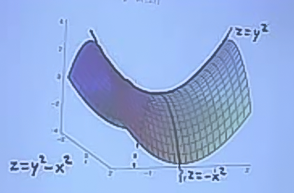

Bir at eğerine (saddle) benziyor, $yz$ düzleminden bakılınca yukarı giden bir
parabol $z=y^2$, ama $xz$ düzleminde aşağı dönük bir parabol, $z=-x^2$.

Kontur Grafikleri (Countour Plot)

İki değişkenli fonksiyonları çizmenin bir diğer yolu onun konturlarını
çizmektir. Konturlar yeryüzünü resmetmek için kullanılan haritalara benzerler, 3
boyutlu şekillerin yassılaştırılarak, sadece üstten görünüşlerini gösteren
grafikleme şekilleridirler.


Bir kontur grafiği üzerindeki çizgilerin her biri, bir yüksekliğe (elevation)
tekabül eder.  Mesela $f(x,y)=1$ eşitliği için olan tüm $x,y$ noktaları üstte en
dıştaki kapalı eğridir, $f=2$, $f=3$, vs aynı şekilde. Üç boyutlu "normal'' bir
grafikte yükseklik olarak (3. boyut) temsil edilen değerler yassılaştırılarak
onların üstten görünüşü resmedilir. Ayrıca bir $z$ "sabitlenerek'' ona tekabül
eden $x,y$ grafiklenir (bu sabit değerler çoğunlukla düzenli aralıklarla olacak
şekilde seçilir, 1,2,3,4,vs gibi), 3 boyutlu bir resimde tüm $z$ değerleri
grafiklenir. Farklılıklar bunlardır. Konturlar kullanarak 3 boyutlu bir
fonksiyonu iki boyutta kısmen temsil edebilmiş oluruz. 3 boyutlu fonksiyon ve
$z=1$ anındaki bir kesit örneği alttadır.

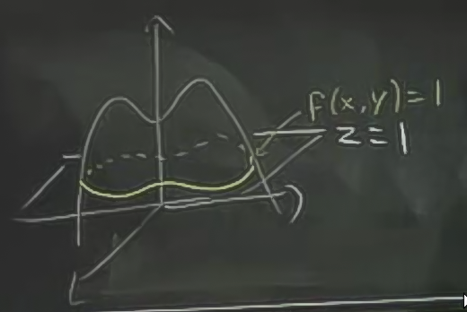

Bu tekniğe "seviye eğrileri (level curve)'' ismi de verilir. $z=1$ seviyesinde
kesit yapılınca o kesit üzerinde bir eğri oluşur, diğer seviyelerde de kesitler
yapılabilir, vs.

Bir topografik harita da aslında bir kontur grafiğidir. Mesela alttaki harita
ABD Jeolojik Ölçümler (US Geological Survey) haritalarından biri

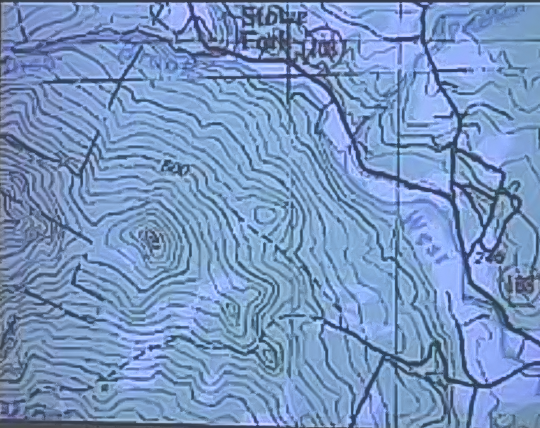

Mesela 500 yazan bir çizgi var, bu yüksekliği gösteriyor. Eğer o yükseklikte
kalmak istersek, hep o çizgi üzerinde yürüyebilirdik, ve hiç yukarı ya da aşağı
gitmemiş olurduk. Eğer çizgiler arasında gidip gelirsek, o zaman yükseklik
değişimi yapmış olurduk.

Tabii kontur grafiklerinin illa bir coğrafi yüksekliği temsil etmesi
gerekmez. Mesela alttaki grafik ABD haritasında herhangi kaç derece sıcaklık
olduğunu bölgesel olarak gösteriyor.

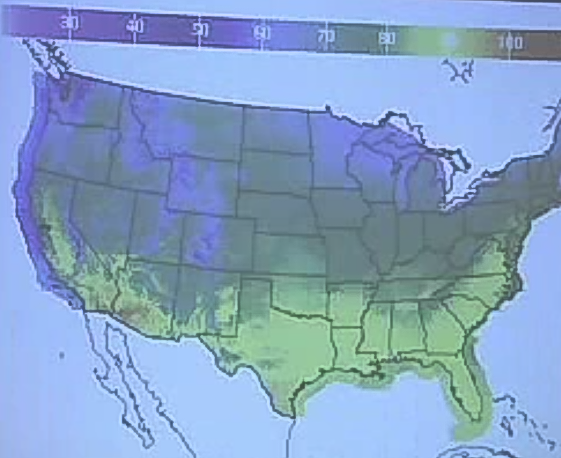

Renkler belli sıcaklıkları temsil ediyorlar, ve renkler arasında bazı sınırlar
var. Bu grafik te bir kontur grafiğidir.

Örnek

$$ f(x,y) = -y $$

Konturlar neye benzer? 

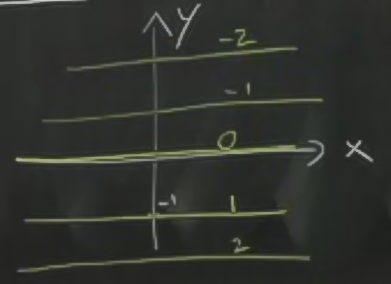

Konturlar değişik yükseklikleri temsil ediyor, ve üstteki resim için de bu
geçerli. Bu grafiğin 3D hali içinde yeşil ok olan en üstten 2. grafik. O
grafikte bir düz yokuş var, işte üstteki çizgiler, bu yokuştaki yükseklik
farkında tekabül ediyorlar.

Örnek

$$ f(x,y) = 1-x^2-y^2 $$

Bu fonksiyon sıfır ise birim çember olur dedik, yani

$$ x^2+y^2=1 $$

Eger $f=1$ ise

$$ x^2+y^2=0 $$

Eğer $f=-1$ ise

$$ x^2+y^2=2 $$

Eğer $f=-2$ ise

$$ x^2+y^2=3 $$

Grafik şöyle

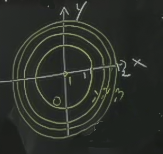

Seviye eğrilerinin dışa doğru nasıl daha sıklaştığına dikkat çekmek isterim. Bu
demektir ki dışa doğru gittikçe yükseklik artışı daha dik hale geliyor, çünkü
(yukarı doğru) aynı birim mesafeyi almak için gittikçe daha az mesafe katetmek
gerekiyor. Orta kısım neredeyse dümdüz.

Örnek

At eğeri grafiğinin konturları

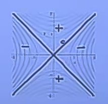

Kontur grafikleri bize $x,y$ değişirken neler olduğunu söyler. Mesela değerler
azalıyor mu, çoğalıyor mu? Bu tür bir sorunun cevabını kontur grafiği hızlı bir
şekilde sağlayabilir.

Mesela şu grafiğe bakalım


Eğer $x$ $\uparrow$, $f(x,y)$ $\uparrow$

Eğer $x$ $\downarrow$, $f(x,y)$ $\downarrow$

Eğer $y$ $\uparrow$, $f(x,y)$ $\uparrow$

Eğer $y$ $\downarrow$, $f(x,y)$ $\downarrow$

Bu tür nicelik analiz kontur grafiklerinin çizgilerine bakarak hemen
yapılabilir. Ama belki de ben daha detaylı bir analiz istiyorum, mesela bir
değişkendeki bir değişimin $f(x,y)$'daki değişimi ne kadar etkilediğini detaylı
şekilde görmek istiyorum.

Değişim oranlarının hesabı türevlerle yapılır. 

Kısmi Türevler (Partial Derivatives)

Tek değişkenli fonksiyonlar, mesela $f(x)$ gibi, o zaman $f(x)$'in türevi
bir limit olarak tanımlıdır

$$ f'(x) = \frac{df}{dx}  = 
\lim_{\Delta x \to 0} \frac{f(x+\Delta x) - f(x)}{\Delta x}
$$

Grafiksel olarak
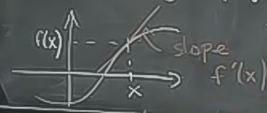
$x$ noktasındaki eğim (slope) $f'(x)$'e eşittir. 

Yaklaşıksallık Formülü

$$ f(x) \approx f(x_0) + f'(x_0)(x-x_0) $$

Bu formüle daha fazla terim eklesek, ortaya Taylor Formülü çıkardı. 

Benzer şeyleri iki değişkenli fonksiyonlar için nasıl yapabiliriz?

Buradaki problem iki değişkenin ikisinin birden değişebileceği. Bu sebeple
bize birden fazla türev şekli gerekiyor. 

Notasyon

Parçalı türev kıvrık bir "d'' sembolünü andırır

$$ \frac{\partial f}{\partial x} $$

Bu ibare "sadece $x$ değişiyor, diğerleri değişmiyor'' demek. O yüzden bu
klasik bir türev değil, kısmı bir türev. Tamamı

$$ \frac{\partial f}{\partial x}(x_0,y_0) = 
\lim_{\Delta x \to 0} \frac{f(x_o+\Delta x, y_o) - f(x_0,y_0)}{\Delta x}
$$

Gördüğümüz gibi $y$ üzerinde hiçbir değişiklik yapmıyorum. Sadece $x$'i
değiştirip, bu değişimin fonksiyonun tamamı üzerindeki oranını (rate of
change) hesaplıyorum. Aynı şekilde

$$ \frac{\partial f}{\partial y}(x_0,y_0) = 
\lim_{\Delta y \to 0} \frac{f(x_o, y_o+\Delta y) - f(x_0,y_0)}{\Delta y}
$$

Geometriksel olarak

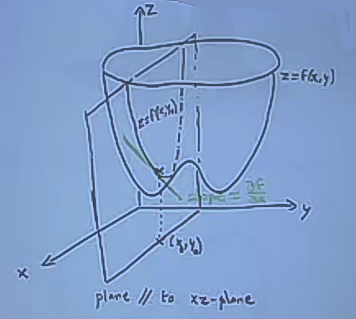

Üstteki $\partial f / \partial x$. Bir $x_0,y_0$ noktasına bakıyorum, sonra
$y$'nin hiç değişmemesi durumunun ortaya çıkaracağı bir düzlem hayal
ediyorum. Sonra bu düzlemin $f$'ten aldığı "kesiti'' düşünüyorum, işte bu
yansıma bir yeni fonksiyon yaratıyor, ve bu fonksiyona $x_0,y_0$ noktasında
teğet geçen çizginin eğimi (slope), $\partial f / \partial x$.

Peki bu hesap nasıl yapılır? Bu arada notasyon olarak 

$$ \frac{\partial f}{\partial x} = f_x $$

aynı şeyler. Soldaki fizik notasyonu, sağdaki uygulamalı matematik
notasyonu [burada hoca uygulamalı matematik, zaten notasyonu değiştirilmiş
fizik sadece diye espri yapıyor]. Her neyse, hesap için $y$ sabit tutulur,
$x$ değişken kalır. 

Örnek

$$ f(x,y) = x^3y  + y^2 $$

$$ \frac{\partial f}{\partial x} = 3x^2y + 0$$

$$ \frac{\partial f}{\partial y} = x^3 + 2y$$

Örnekler 

Python Matplotlib ile kesit seviyeleri çizmek için örnek bir program

```python
x=linspace(-3,3,40)
y=linspace(-3,3,40)
x,y=meshgrid(x,y)
z=sqrt(x**2+y**2)
z=x**2+y**2
cs=contour(x,y,z,15)
grid(True)
axis('scaled')
xlabel('x-axis')
ylabel('y-axis')
clabel(cs,inline=1,fontsize=9)
plt.savefig('levels.png')
```

$x^2+y^2$ fonksiyonun grafiği alttadır. 

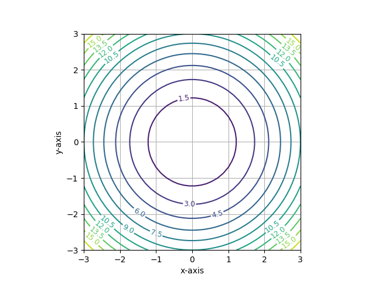

Soru 2D-5

$T = x^2 + 2y^2 + 2z^2$ fonksiyonu her $x,y,z$ noktasındaki sıcaklığı rapor
ediyor. 

a) Bu fonksiyonun eş sıcaklık (isotherms) fonksiyonu hangi şekle benzer?

Cevap 

Eş sıcaklık $T$ fonksiyonun bir sabite eşitlendiğinde elde edilen
fonksiyondur, o "şey'' ne ise, o cisim yüzeyinde sıcaklık hiç
değişmeyecektir. 

Bu cisim bir ellipsoid, bir ellipsoid bir yumurtaya benzeyen, bir elips'in
alıp bir nevi çevrilerek elde edilen bir şekildir. Peki şeklin ellipsoid
olduğunu nereden biliyoruz? Çünkü ellipsoid formülü

$$ \frac{x^2}{a^2} +  \frac{y^2}{b^2} + \frac{z^2}{c^2}  = 1  $$

şeklinde, ve $x^2 + 2y^2 + 2z^2 = c$ formülünü üstteki forma çevirmek
mümkün. İki tarafı $c$'ye böleriz,

$$ \frac{x^2}{c} +  \frac{2y^2}{c} + \frac{2z^2}{c}  = 1  $$

Böylece $1/a^2 = 1/c$ olur, vs.. 

Peki bir ellipsoid'i nasıl grafikleriz? Bu noktada sorunun istediğinden
daha ileri gidiyoruz. 

Grafiklerken, mesela $x^2 + 2y^2 + 2z^2 = 10$ için diyelim, ilk aklımıza
gelebilecek fikir formülü tekrar organize ederek $z$'yi yanlız bırakmak, ve
$x,y$ kombinasyonlarını bu fonksiyona geçerek sonuçları grafiklemek. 

Buradaki problem $z$ formülü ortaya bir karekök çıkartacak, ve bu karekök
sonucu hem eksi, hem artı olabilir. Daha iyi bir yöntem, kutupsal forma
geçmek, böylece hep artı olacak vektör büyüklüğü ve açılar üzerinden bir
çizim yapmak [1]. Şu formüle tekrar bakarsak

$$ \underbrace{\frac{x^2}{a^2} +  \frac{y^2}{b^2}}_{w^2}
 + \frac{z^2}{c^2}  = 1  $$

bunu

$$ w^2 + \frac{z^2}{c^2}  = 1  $$

olarak görelim, burada karelerinin toplamı '1' olan bir şey var. 

Bu "şeyler'' $\cos$ ve $\sin$ olabilirler, çünkü $\cos$ ve $\sin$ karelerinin
toplamı 1 değerini verir.

Eğer

$$ w = \sin \phi $$

$$ \frac{z}{c} = \cos \phi $$

dersek, karelerin toplamı üstteki gibi 1 olur. 

Şimdi $w$'nin detayına inelim

$$ w^2 = \sin^2\phi = \frac{x^2}{a^2} +  \frac{y^2}{b^2}  $$

Eşitliğin en sağına bakarsak, yine kareler toplamı görüyoruz. Ama bu sefer
karelerin toplamı 1 değil, $\sin^2\phi$ vermiş. Problem değil, karelerin
içine bir $\sin \phi$ biz sokarsak, o zaman sonuçta istediğimiz bir
ekstra $\sin^2\phi$ kendiliğinden gelecek. 

$$ \frac{x}{a} = \sin\phi \cos \theta  $$

$$ \frac{y}{b} = \sin\phi \sin\theta  $$

O zaman

$$ x = a \sin\phi \sin \theta  $$

$$ y = b \sin\phi \cos \theta  $$

$$ z = c \cos \phi $$

O zaman grafiklemeyi $\phi$, $\theta$ açılarının $0..\pi$ arasındaki
değerlerinin kombinasyonlarını kullanarak rahatça yapabiliriz. Alttaki kodda
`linspace` ile bu ayrıksal değerler bulunuyor, `outer` ile onların her
türlü kombinasyonla çarpımı alınıyor.

Not: $w$ ile $z/c$'nin aldığı $\cos, \sin$ değerleri ters şekilde de olabilir,
sonuç farketmiyor, yine ellipsoid grafikleniyor. 

```python
from __future__ import division

from mpl_toolkits.mplot3d import Axes3D

fig = plt.figure(figsize=plt.figaspect(1))  # Square figure
ax = fig.add_subplot(111, projection='3d')

# Katsayilar a0/c x**2 + a1/c y**2 + a2/c z**2 = 1 
coefs = (1, 4, 10)  

# Katsayilara tekabul eden caplar
rx, ry, rz = [1/np.sqrt(coef) for coef in coefs]

u = np.linspace(0, 2 * np.pi, 100)
v = np.linspace(0, np.pi, 100)

x = rx * np.outer(np.cos(u), np.sin(v))
y = ry * np.outer(np.sin(u), np.sin(v))
z = rz * np.outer(np.ones_like(u), np.cos(v))

ax.plot_surface(x, y, z,  rstride=4, cstride=4, color='b')

max_radius = max(rx, ry, rz)
ax.set_xlim(-max_radius, max_radius)
ax.set_ylim(-max_radius, max_radius)
ax.set_zlim(-max_radius, max_radius)

plt.savefig('ellipsoid.png')
```
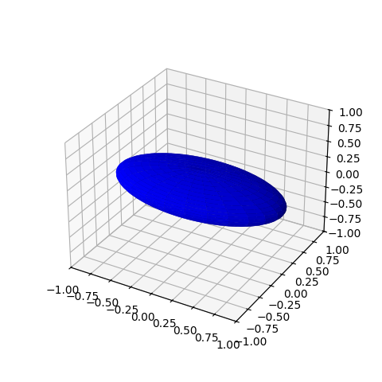

Kaynaklar

[1] Thomas, *Thomas' Calculus, 11. Baski*


