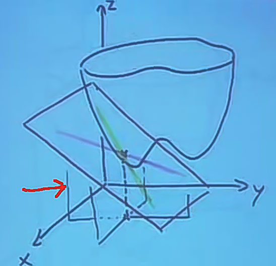
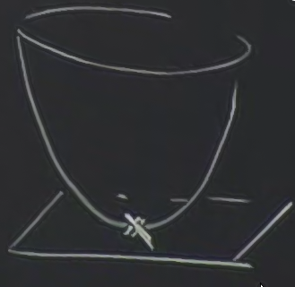
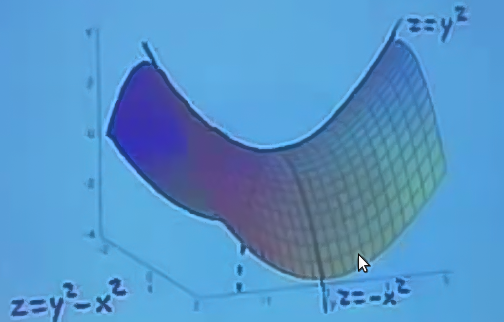
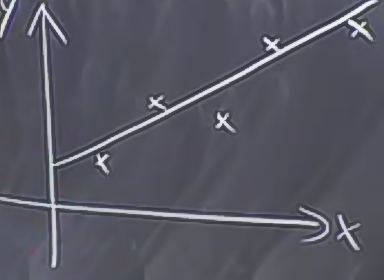
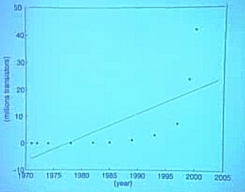
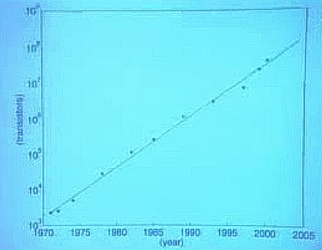

# Ders 9

Bu dersin konusu birden fazla değişken içeren fonksiyonların minimizasyonu ile
uğraşırken yardımcı olacak kısmi türev (partial derivative) kavramı. Çok
değişkenli bir fonksiyon $f(x,y)$'nin birden fazla türevi vardır. Mesela
bunlardan bir tanesi

$$ \frac{\partial f}{\partial x} = f_x $$

Bu türev $x$'in değiştirildiği ama $y$'nin sabit tutulduğu bir durumu
gösterir. 

$$ \frac{\partial f}{\partial y} = f_y $$

işe $y$'in değiştirildiği ama $x$'nin sabit tutulduğu bir durumu gösterir.

Şimdi her ikisinin birden değiştirildiği durumda ne olacağını gösteren
yaklaşıksal (approximate) formülü görelim. Değişim matematiksel olarak şöyle

$$ x \sim x + \Delta x $$

$$ y \sim x + \Delta x $$

O zaman $z$ için

$$ z = f(x,y) $$

yaklaşıksal değişim şöyle olur

$$
\Delta z \approx f_x\Delta x + f_y \Delta f_y
\qquad (1)
$$

Tekrar vurgulamak gerekirse bu yaklaşıksal bir formül, daha "doğru'' bir temsil
için 2., 3. türevleri içeren daha yüksek dereceden (higher order terms)
terimlerin de olması gerekir, fakat bu terimler 1. derece lineer bir
yaklaşıksallık için kullanılmaz.

Bu formülü nasıl doğrularız? Bunu yapmanın yollarından biri teğet düzlem
yaklaşıksallaması (tangent plane approximation). Mesela $z = f(x,y)$
fonksiyonuna olan teğet bir düzlemi düşünelim.

Hatırlarsak $\frac{\partial f}{\partial x}$ kısmi türevi $x$'in değiştiği ama
$y$'nin sabit tutulduğu bir durumu tarif ediyordu. Yukarıdaki grafiğe göre bu
bir anlamda iki çukurlu kap gibi duran $z$ fonksiyonun bir kesitine bakmak gibi
(unutmayalım, fonksiyon sadece kabın dışında tanımlı, içi boş). Bu kesit üzerine
$f$'in bir yansıması oluşuyor, o yansıma üstteki grafikte bir parabol
şeklinde. Bu parabolda $x$ değiştikçe o noktanın parabol üzerindeki çizgizel
teğeti de değişiyor (grafikteki yeşil çizgi) ki bu çizgisel eğim
$\frac{\partial f}{\partial x}$'e eşit.

Eğer aynı şeyi $x$'in sabit $y$'nin değiştiği durum için yapsaydım,
benzer bir kesit elde edecektim (resimde kırmızı okun gösterdiği düzlem). 

Ve, bu iki kesit üzerinden elde edilen ikinci teğet çizgi birinci ile beraber
kullanılınca bir düzlemi tanımlamak için kullanılabilir (iki çizgi paralel bir
düzlem tanımlamak için yeterlidir), ki teğet düzlem yaklaşıksallaması için
kullanılacak düzlem budur. Üstteki resimde bu yeni düzlem çapraz yatık olarak
gözüken düzlem.

Formülsel olarak bunu nasıl yapacağımızı gösterelim.

$f_x$ ve $f_y$ iki teğet çizgiyi tanımlamak için kullanılıyorsa, bu
formülleri bir araya koyarak düzlemi temsil edebilirim. Eğer

$$ \frac{\partial f}{\partial x}(x_0,y_0) = a $$

işe bu demektir ki birinci teğet çizgi (yeşil çizgi) $L_1$ şöyledir:

$$ 
L_1 = 
\left\{ \begin{array}{l}
z = z_0 + a(x - x_0) \\
y = y_0
\end{array} \right.
$$

Bu çizgi için $y$'yi sabit tutuyorum, $z$'deki değişimi $z_0$ üstüne eğim
$a$'nin katları kadar ($x$'in değişimi oranında çarparak) ekleyerek
hesaplıyorum. 

Benzer şekilde

$$ \frac{\partial f}{\partial y}(x_0,y_0) = b $$

$$ 
L_2 = 
\left\{ \begin{array}{l}
z = z_0 + b(y - y_0) \\
y = y_0
\end{array} \right.
$$

Hem $L_1$ hem de $L_2$ $z = f(x,y)$'ye teğettir. Bu iki çizgi beraber bir düzlem
oluşturur. Bu formül

$$
z = z_0 + a(x-x_0) + b(y-y_0) 
\qquad (2)
$$

formülüdür. 

Formül (1), ustteki formülün yaklaşıksal halidir. Eğer teğet düzlem üzerinde
olsaydık, $\approx$ işareti $=$ işaretine dönüşecekti. Bu yaklaşıksallık ufak
$\Delta x$ ve ufak $\Delta y$ için geçerli. Yani yaklaşıksal formül, $f$'nin
grafiği teğet düzleme yakın diyor.

Maksimum Minimum Problemleri 

Kısmi türevlerin kullanım alanlarından biri optimizasyon problemleridir. Mesela
çok değişkenli bir fonksiyonun maksimumunu bulmak gibi. Eğer fonksiyon tek
değişkenli olsaydı, hemen türevini alıp sonucu sıfıra eşitleyebilirdik, ve buna
göre bir çözüm arardık. Çok değişkenli fonksiyonlarda kısmı türevler kullanmak
lazım.

Bu derste iki değişkenli duruma bakacağız fakat aynı prensipler, 10, 15,
milyon tane değişken için aynı. 

Lokal bir minimum için hem $f_x=0$ hem $f_y=0$ olmalıdır. Bu niye doğudur? Yine
formül (1)'e bakarsak, hem $f_x=0$ hem $f_y=0$ olduğu zaman $\Delta z$ sıfır
olacaktır, yani birinci derecede düşünürsek $f(x,y)$'de değişim yok demektir.

Teğet düzlemlerin dilinden konuşursak, minimum anında teğet düzlem tamamen
yatay olacaktır. 

Formül (2) bağlamında düşünürsek, bu durum $a=0$ ve $b=0$ olduğu ana tekabül
ediyor ve o anda düzlemi tanımlayan $z = z_0$ formülüdür.

Tanım

Eğer $f_x(x_0,y_0)= 0$ ve $f_y(x_0,y_0)= 0$ ise o zaman $x_0,y_o$ $f$'in kritik
noktasıdır. Not: Birden fazla değişken için tabii ki tüm kısmı türevlerin o
noktada sıfır olması gerekir.

Örnek

$$ f(x,y) = x^2 - 2xy + 3y^2 + 2x - 2y $$

Bakalım bunu minimize ya da maksimize edebilecek miyiz? 

$$ f_x = 2x - 2y + 2 = 0$$

$$ f_y = -2x + 6y - 2 = 0 $$

Üstteki iki denklemi aynı anda çözmeliyiz. 

Bu tür durumlarda iki denklemi birbiriyle toplayıp basitleştirmeye çalışmak iyi
bir yöntemdir. Fakat unutmayalım, elimizde her zaman iki tane denklem olmalı,
iki denklemi ortadan kaldırıp birdenbire tek denklem ile yola devam edemeyiz.

Toplamı yaparsak

$$ 4y = 0 $$

elde ederiz. Bunu alıp birinci denkleme sokalım, sonuç

$$ 2x + 2 = 0 $$

$$ x = -1 $$

Demek ki kritik nokta $(x,y) = (-1,0)$. 

Peki bu kritik noktanın minimum mu maksimum mu olduğunu nereden bileceğiz?  Eğer
tek değişkenli bir fonksiyona bakıyor olsaydık, ikinci türeve
bakabilirdik. Benzer bir şeyi burada da yapabilirdik, ama sadece birinci
türevden bile elimizde iki tane var, ikinci türevlerden çok daha fazlası
olacak. O duruma bakacağız, şimdilik daha az otomatik olarak işi nasıl
anlayacağımızla ilgilenelim.

Elimizde birden fazla minimum olabilir. Türev(lerin) sıfır olduğu noktada bir
düzlük vardır, bu bir lokal minimumdur. Yani o noktaya yakın olduğumuz sürece
(ki lokallığın tanımı bu) bu minimum geçerlidir. Başka bir noktada, türev(lerin)
yine sıfır olduğu ama daha aşağı noktada bir minimum daha
olabilirdi. Maksimumlar için aynı durum geçerli.

Yanlız bir diğer seçenek daha var. Bu seçenek kritik noktanın ne maksimum, ne
minimum olduğu durumdur. Bu durumda kritik noktadan hangi "yöne doğru''
bakıyorsak, değişik bir cevap elde ederiz. Bu at eğeri gibi gözüken grafiğin
orta noktasına, 0,0,0 noktasına bakalım, burada teğet düzlem tam yatay. Bu
noktaya eğer noktası (saddle point) deniyor. Eğer $z=y^2$ yönüne doğru bakarsak
min durumdayız, eğer $z=-x^2$ yönüne doğru bakarsak maks durumdayız.

2. türevlerden bahsetmişik, ve bu derste kritik noktanın ne olduğunu daha
az otomatik bulacağımızı söyledik (2. türevler bir dahaki derste). 

Bu yöntemde kareler kullanacağız. Niye kareler? Çünkü karesel ifadeler en
az sıfır olabilirler -- bir değer ne olursa olsun, eksi bile olsa karesi
alınırsa artı olur, ve bu tür ifadeler sadece sıfırda "en az'' olurlar.

O zaman $f(x,y)$'i karelerin toplamı olarak tekrar temsil etmeye
uğraşalım. $f(x,y)$'de zaten kareler var ama tüm formülü bir şeylerin
karesi olarak gösterebilirsek, hedefimize erişebiliriz. Tek problem $xy$
terimi, ama $x^2 - 2xy..$ diye giden bir başka formül biliyoruz, Kareyi
Tamamlama ile onu kullanalım.

$$ f(x,y) = (x-y)^2 + 2y^2 + 2x - 2y $$

Basitleşti ama biraz daha basitleşebilir. Acaba $(x-y)^2$ içindeki $(x-y)$
ile dışarıdaki $2x - 2y$ arasındaki bir bağlantı kurabilir miyiz? İçeriye
bir +1 eklersek bu olabilir, o zaman dışarıdaki $2x - 2y$ iptal
olur. İçerideki 1'i dengelemek için ise dışarı bir -1 ekleriz.

$$  = ((x-y) + 1)^2 + 2y^2 - 1$$

İşte, tüm formül artık karelerden oluşuyor. Bu formül eğer 

$$  = \underbrace{((x-y) + 1)^2}_{\ge 0} + \underbrace{2y^2}_{\ge 0} - 1$$

işe ancak $\ge -1$ olabilir. Ve kritik nokta (-1,0)'da $f$'in değeri hakikaten
-1'dir. Üstteki iki terimin niye $\ge 0$ olduğundan bahsettik. Demek ki bu nokta
bir minimum.  Yani biraz cebirsel takla, ve ufak bir numarayla istediğimiz
sonuca erişmiş olduk.

Şimdi min/maks probleminin ilginç bir uygulamasını görelim. Bu uygulamayı
min/maks kategorisinde görmeyebilirsiniz, ama aslında problem min/maks ile
çok güzel bir şekilde çözülüyor.

Deneysel bilimlerde en az kareler interpolasyon (least squares interpolation)
adlı bir teknik kullanılır. Mesela bir deney yaparız, ve deneyden gelen verileri
alırız. Mesela kurbağaları inceliyoruz, ve kurbağa bacak uzunluğunu kurbağa göz
büyüklüğü arasında bir bağlantı arıyoruz. Ya da başka bir şeyi ölçüyoruz, genel
olarak bir $x$ değişkeni için onun etki ettiği, alakalı olduğu bir $y$
değişkenini ölçüyoruz.

Ölçülen iki değişkeni grafikleyince, şu ortaya çıkıyor diyelim.

Arada bir korelasyon olduğunu görüyoruz. Bu konu hakkında bilimsel bir makale
yazıyor olsaydık, bu grafikte şöyle bir çizgi çizerdik,

Fakat veri noktalarının tam ortasından geçen bu çizgiyi nasıl çizeceğiz?  Yani
çözmek istediğimiz problem verilen $(x_1,y_1), (x_2,y_2),...(x_n,y_n)$
şeklindeki deney verileri için "en iyi uyan (best fit)'' çizgi $y=ax + b$, en
iyi yaklaşıksallık nedir?

Bu problemde önemli bir püf noktasına işaret edelim: $y=ax + b$ denkleminde
bilinmeyenler nedir? Genellikle öğrenciler $x$ ve $y$ değişkenine
bakıyorlar. Fakat bu doğru değil. Bir optimal çizgi ortaya çıkarmak istiyorsak
ilgilendiğimiz $x$ ve $y$ değil, esas ilgilendiklerimiz $a$ ve $b$
katsayıları. Çizginin hangi şekilde olduğunu onlar kontrol ediyorlar, yani doğru
uyum için çizginin nereden geçtiğinin hesaplanması problemindeki bilinmeyenler
onlar. Yani uyum için en iyi $a$ ve $b$'yi bulmamız gerekiyor.

Bu noktada "en iyi $a$ ve $b$'' ifadesinin ne olduğuna karar vermemiz
lazım. En iyi, $a$ ve $b$'nin bir fonksiyonunun minimize edilmesi olabilir,
ki bu fonksiyon deneysel veri ile bir teorik çizgi arasındaki uyum
hatalarının toplamını temsil edebilir. Yani hata, o çizginin deney
noktalarından ne kadar uzakta olduğunun toplamı ile temsil edilebilir.

"Uzaklığı'' hesaplamanın da değişik yolları olabilir. Mesela her noktanın
bir çizgiye olan düz uzaklığı ölçülebilir. Ya da deneysel noktadan dikey
olarak yukarı / aşağı çıkıp çizgiye gelinceye kadar olan uzaklık. Ya da
uzaklığı en fazla olan tek noktanın mesafesi azaltılmaya uğraşılabilir (ama
bu son yöntem pek iyi bir seçim olmayabilir, çünkü belki deney sırasında
uykuya dalmışsınızdır, ve çok yanlış bir nokta ölçmüşsünüzdür, ve o nokta
tüm uyum hesabını bozukluğa uğratır).

Bu tür seçeneklerden bir tanesi en iyisidir, ve evrensel olarak kullanılan
yaklaşım da o'dur. En Az Kareler demiştik, bu yöntemde hata noktaların
çizgiye olan uzaklıkların karesinin toplamıdır. Bu yöntem iyi sonuçlar
veriyor ve hesap için oldukça temiz bir formül ortaya çıkartıyor. Demek ki
"en iyi'' tanımı hata noktaların çizgiden olan sapmasının karesinin
toplamının minimize edilmesi demek. Sapma nedir? Tahmin edilen ile gerçek
veri noktasının farkıdır. 

$$ y_i - (ax_i + b) $$

O zaman problem

$$ \textrm{Minimize Et } D = \sum_{i=1}^n \bigg[ y_i - (ax_i+b) \bigg]^2 $$

Tekrar vurgulayalım, bu fonksiyonda bilinmeyenler $a$ ve $b$. $x_i$ ve $y_i$
deneyden gelen veriler.

Minimize etmek için şimdiye kadar öğrendiklerimizi kullanabiliriz. Kritik
noktayı bulalım.

Yani istediğimiz 

$$ \frac{\partial D}{\partial a} =0 $$

$$ \frac{\partial D}{\partial b} =0 $$

eşitliklerini doğru olduğu an. Kritik nokta burada. Kısmı türevleri alalım.

$$ \frac{\partial D}{\partial a}  =
\sum_{i=1}^n 2 (y_i (ax_i+b)) (-x_i) 
= 0
$$

$$ \frac{\partial D}{\partial b} = 
\sum_{i=1}^n 2 (y_i (ax_i+b)) (-1) 
=0
$$

Çözmemiz gereken denklemler bunlar. 

Eğer dikkat edersek bu denklemler $a$ ve $b$ bağlamında lineer. Denklemlerde
biraz kalabalıklık var, onları açıp tekrar düzenleyerek bu lineerliği görmeye
uğraşalım.

İlk önce '2' terimini atalım, ona gerek yok. İki denklem ayrı ayrı şöyle
olur:

$$ \sum_{i=1}^n (x_i^2a + x_ib - x_iy_i) = 0$$

$$ \sum_{i=1}^n (x_i^2a + b - y_i) = 0$$

$a$ ve $b$ leri yanyana getirelim. Yine ayrı ayrı

$$  \bigg(\sum_{i=1}^n x_i^2\bigg)a + \bigg(\sum_{i=1}^n x_i\bigg) b = 
\sum_{i=1}^n x_iy_i$$

$$  \bigg(\sum_{i=1}^n x_i\bigg)a + nb = \sum_{i=1}^n y_i $$

Parantezler içindeki $x_i$'li ifadeler korkutucu görünüyor olabilir, fakat
bunlar deney verisinden gelen sayıların toplamından ibaret, onlar elimizde
sayısal olarak mevcut zaten. Deney verisini alıp, hepsini toplayınca bu sayıyı
elde edeceğiz.

Sonuç olarak elimize geçen 2 x 2 boyutlarında bir lineer sistem. Yani $x_i$ ve
$y_i$ içeren ifadeleri hesapladığımız anda bu sistemi elde ederiz, ve 2 x 2 bir
lineer sistemi çözmeyi zaten biliyoruz. Ve kritik noktayı böylece elde
ederiz. Bir sonraki derste göreceğimiz 2. kısmı türevleri kullanacağız yöntemle
de bu noktanın min/maks olduğunu anlarız. Bu testi uygulasak üstteki yöntemin
hakikaten bir min ürettiğini görebilirdik.

En Az Kareler interpolasyonu çok daha genel kullanımlarda da işe yarar. 

Örnek

Bilgisayar dünyasında Moore Kanunu denen bir kural vardır, bu kural bilgisayar
çiplerinin nasıl sürekli daha hızlı, daha iyiye doğru gittiğini anlatır. Ünlü
çip üreticisi İntel başkanı Andy Grove tarafından ortaya atılmıştır, bir
hipotezdir, fakat şaşırtıcı bir şekilde doğru çıkmıştır. Kuralın ölçtüğü bir
mikropçipin içine koyulabilecek transistör sayısıdır. Bu ölçümün bir örneği
alttadır.

Bu veriye lineer olarak uyum yapamazdık. Fakat logaritmik skalayı kullanırsak,
yani transistör sayısı yerine onun logaritmasını alıp grafiklersek,

veriler daha çizgisel olurlar. Bu demektir ki zaman ve transistör sayısı
arasındaki ilişki üstel (exponential) bir ilişkidir. Zaten kuralın söylediği de
bu, kural her 18 ayda bir çip içindeki transistör sayısının ikiye katlandığını
söyler. Bir sonraki büyüklüğün o büyüklüğün o anki halinin belli bir katı olması
(aynen nüfus artışında olduğu gibi) üstel bir ilişkiye işaret eder.

Peki en iyi üstel uyumu nasıl buluruz? Böyle bir uyumun formülsel hali
şudur. Düz çizgi formülü yerine bir üstel ifade içerir. 

$$ y = ce^{ax} $$

Fakat bu formülü direk hata hesabında kullanırsak, ele geçen formüller çok
karmaşık hale geliyor. Ama üstteki numarayı hatırlayalım, log skalasında bakınca
her şey lineer çıkıyor. O zaman uyumu şu şekilde yapabiliriz, üstteki formülün
log'unu alalım:

$$ ln(y) = ln(c) + ax $$

ki bu formül lineerdir. Bunun üzerinde En Az Kareler yöntemini
kullanabiliriz. 

Üstel ilişki yerine karesel bir ilişki de olabilirdi, mesela

$$ y = ax^2 + bx + c $$

o zaman en iyi parabolu uydurmaya uğraşıyor olabilirdik, bu uyum için $a$,
$b$ ve $c$'yi bulmamız gerekirdi. Yani şunu minimize edecektik:

$$ D(a,b,c) = \sum_{i=1}^n (y_i - ( ax_i^2 + bx_i + c ))^2  $$

Burada kısmi türevler 3 tane ayrı denklem üretir, ve ilişki yine lineer
çıkar, 3 x 3 boyütünde bir sistem elde ederiz. 

Yani söylediğimiz gibi, bu problemler ilk başta minimizasyon problemi gibi
gözükmeyebiliyordu, ama öyle olduklarını şimdi görmüş olduk. 

