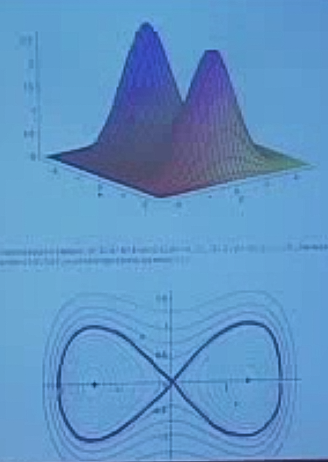
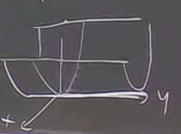

# Ders 10

Bugünkü konumuz kritik noktaların minima mı, maksima mı, yoksa eğer noktası
mı olduğunu anlama teknikleri. Kritik noktalar kısmi türevlerin hepsinin
sıfır olduğu noktadır, mesela 2 değişkenli fonksiyon için $f_x=0$, $f_y=0$
olmalıdır. 

3 değişik kritik nokta çeşidi gördük, lokal minima, lokal maksima, ve
eğer (saddle) noktaları. 

Bir fonksiyonun birden fazla kritik noktası olabilir. Mesela şöyle bir
fonksiyon

Soru: Bir kritik noktaya bakarken, hangi kategoriye ait olduğunu nasıl
anlayacağız? Bir diğer soru, global (lokal olmayan) minimum ve maksimum
noktalarını nasıl buluruz?  Üstteki resimdeki fonksiyonda iki lokal maksimum
var. Her ikisini de deneyebiliriz, hangisi daha yüksek ise onu alırız. Diğer
yandan, bu fonksiyonun minimumu herhangi bir "noktada'' değil, maksimumdan
uzakta, fonksiyonun en dış yerlerinde, sonsuzlukta.

Yani global minimum ve maksimum illa bir noktada olmayabilir, sonsuzlukta
olabilir, o zaman bu koşulu test etmeliyiz, fonksiyonumuzun sonsuzluğa
giderken nasıl davrandığını anlamalıyız.

Birinci soruyu cevaplayalım

İkinci Türev Testi

$w = ax^2 + bxy + cy^2$

Bu fonksiyonun kritik noktası orijinde. Eğer türevleri alırsak, ve sıfıra
eşitlersek, sonuç $x,y=0$ çıkar. Aynı şekilde eğer $w$'nin lineer
yaklaşıksallamasını yapsaydık eşitlik sağındaki bütün terimlerin $x,y$ küçük
iken $x,y$'den küçük olduğunu görürüz, o zaman grafiğin teğeti $w=0$
noktasındadır. Eğer orijinden ufak bir adım atarsak, o adımların fonksiyon
üzerindeki etkisi kare alma operasyonu yüzünden daha küçülür ($0.001^2 =
0.00001$ mesela). Herhangi bir noktadaki eğim fonksiyon / değişkenlerdeki artış
olduğuna göre, orijine yakın olan eğim yukarı doğru neredeyse yok gibidir.

Örnek

$$ w = x^2 + 2xy + 3y^2 $$

Üstteki formülü şu şekilde dönüştürürsek

$$ w = (x+y)^2 + 2y^2 $$

Üstte iki karenin toplamı var, karelerin ikisi de negatif olamaz, o zaman
minimum'un orijin olması gerekir (negatifleşmeden olabilecek en küçük değer
oradadır). 

Birazdan göreceğiz ki üstteki kare tamamlama (completing the square)
yöntemini $a,b,c$ katsayılarını içeren genel durum için de kullanabiliriz. 

Önce $a \ne 0$ farz etmem lazım, yoksa tekniğin geri kalanı mümkün olmaz. 

$$ w = a \bigg( x^2 + \frac{b}{a} xy \bigg) + cy^2 $$

Eğer bir kare denklemin orta teriminde $b/a \ xy$ (üstteki gibi) elde etmek
istiyorsam, kare içinde $x$ ve $b/2a \ y$ terimlerini kullanırım, çünkü bu iki
terimin birbirleri ile çarpılıp iki kere toplanmaları $b/a \ xy$ sonucunu
verir. O zaman

$$ = a \bigg( x + \frac{b}{2a}y  \bigg)^2  + ... $$

Hala işimiz bitmedi, kare içine koyulan $y$ yüzünden ortaya çıkan $y^2$ bazlı
terimi dengelemek gerekiyor,

$$ = a \bigg( x + \frac{b}{2a}y  \bigg)^2  + 
\bigg( c - \frac{b^2}{4a} \bigg)y^2
$$

$$ = \frac{1}{4a} 
\bigg[
4a^2 \bigg( x+\frac{b}{2a}y \bigg)^2 +
\bigg(4ac - b^2 \bigg)y^2
\bigg]
$$

Bu noktada kontrol etmemiz gereken 3 durum var:

1) $4ac - b^2 < 0 => $ Üstteki ikinci terim negatif, pozitif $y^2$'yi
çarpıyor yani negatiflik daha da büyüyor, birinci terim kesinlikle pozitif
(çünkü karesi alınmış ifadeler var). Bu durumda bir eğer noktamız var. 

2) $4ac - b^2 = 0 => $ İkinci terim yokolur. Geri kalanlar sonucunda
fonksiyonumuz sadece bir yönde tanımlı hale gelir, fonksiyonun "dejenere''
olduğu söylenir. Mesela $w = x^2$ fonksiyonu böyledir, $y$'ye hiç bağlantı
yoktur, alttaki gibi.

Grafikte görüldüğü gibi $y$ yönünde hiçbir değişim olmamaktadır, o yönde pek çok
kritik nokta vardır, bu noktalar "dejeneredir''.

Ana formülümüzdeki birinci terimde $x$ ve $y$ olması şaşırtıcı gelebilir, orada
$x$ ve $y$ olduğu için elimizde dejenere bir durum var, eğer o ifadeleri
kullanarak yeni bir eksen sistemi yaratsaydım, o yönde hiçbir değişiklik
olmadığını görürdüm.

3) $4ac - b^2 > 0 => $ Bu durumda üstteki formülde, kareli ifadeler 

$$w = \frac{1}{4a} 
\bigg[
+ .. \bigg( .. \bigg)^2 +
\bigg( .. \bigg)
\bigg]
$$

hep $>0$ demektir, bu durumda elimizde ya bir maksimum ya da bir minimum
var. İşler $a$'ya göre değişecek, o zaman onun işaretine bakarız. 

Eğer $a > 0$ bir minimum vardır

Eğer $a < 0$ bir maksimum vardır

[bazı bölümler atlandı]

Genel olarak maks, min işlemleri için 2. türevlere bakmak gerekir. 

Kaç türlü kısmi türev vardır? Mesela bir kez $x$'e göre kısmi türev alabilirim,
sonra elde ettiğim fonksiyonun bir daha $x$'e göre türevini alırım. 

$$ \frac{\partial f^2}{\partial x^2} = f_{xx}$$

Ya da

$$ 
\frac{\partial f^2}{\partial x \partial y} = f_{xy}
$$

Ya da 

$$ 
\frac{\partial f^2}{\partial y \partial x} = f_{yx}
$$

Burada bir iyi haber şu: Üstteki iki kısmi türev birbirine eşit, yani
$f_{xy} = f_{yx}$.

Ve en son olarak

$$ \frac{\partial f^2}{\partial y^2} = f_{yy}$$

2. Türev Testi

$f$'in kritik noktası $x_0,y_o$'da $A = f_{xx}(x_o,y_o)$, $B =
f_{xy}(x_o,y_o)$, $C = f_{yy}(x_o,y_o)$ ise, o zaman 

$$ AC - B^2 > 0 $$

hesabına bakılır. Bu hesabın da 2 tane alt seçeneği vardır. 

$A > 0$ ise lokal minimum. 

$A < 0$ ise lokal maksimum. 

$$ AC - B^2 < 0 $$

hesabı var ise, elimizde bir eğer noktası vardır. 

$$ AC - B^2 = 0 $$

işe hiçbir sonuca varamayız. Bir şekilde dejenere olduğunu biliriz, ama
nasıl bir kritik nokta olduğunu bilemeyiz. 

Şimdi formülümüz $w = ax^2 + bxy + cy^2$ üzerinde bulduğumuz özel şartı
kısmi türevler ile doğrulayıp doğrulayamayacağımıza bakalım. 

$$ w_{x} = 2ax + by$$

$$ w_{xx} = 2a$$

$$ w_{xy} = b$$

$$ w_{y} = bx + 2cy $$

$$ w_{yx} = b $$

O zaman

$$ A = 2a $$

$$ B = b $$

$$ C = 2c $$

$$ AC - B^2 = 4ac - b^2 $$

Gördüğümüz gibi $4ac - b^2$ tekrar elde ettik, yani ilk başta kare
tamamlayarak elde ettiğimiz irdelemeleri aynen kullanabiliriz. 

Tabii dejenere konumda hala ne yapılacağını bilmiyoruz. O durum için de
Taylor Yaklaşıksallamasını kullanacağız. 

Karesel yaklaşıksallama

$$ \Delta f \approx f_x (x - x_0) + f_y (y - y_0) $$

Fakat kritik noktalarda $f_x = f_y = 0$ olduğunu hatırlarsak, o zaman
üstteki ifadede tüm terimler iptal (sıfır) olur. Bu işimize yaramaz. Daha
fazla terim eklememiz lazım. 

$$ \Delta f \approx f_x (x - x_0) + f_y (y - y_0)   $$
$$
  + 
\frac{1}{2}f_{xx}(x-x_0)^2 + f_{xy}(x-x_0)(y-y_0) + 
\frac{1}{2}f_{yy}(y-y_0)^2 $$

Bu durumda genel durum (case) karesel duruma indirgenmiş olur. Üstteki
formülde 

$$ \Delta f \approx f_x (x - x_0) + f_y (y - y_0)   $$
$$
 + 
\underbrace{\frac{1}{2}f_{xx}}_{1/2 A = a}(x-x_0)^2 + 
\underbrace{f_{xy}}_{B=b}(x-x_0)(y-y_0) + 
\underbrace{\frac{1}{2}f_{yy}}_{1/2 C = c}(y-y_0)^2 $$

kullanilabilir. 

Dejenere durumda ne olacağı daha yüksek türevlere bağlıdır. Biz bu derste o
konuya girmeyeceğiz. 

Fakat şunu söylemek gerekir ki 

$$ AC - B^2 = 0 $$

şartının ortaya çıkması, yani "sonuca varamıyoruz'' noktasına gelmek
gerçek hayatta pek olmuyor. 

Örnek

$$ f(x,y)= x + y + \frac{1}{xy}, \ \ x,y > 0 $$

Min, maks nedir? 

Kritik noktaları bulalım. 

$$ f_x = 1 - \frac{1}{x^2y} = 0$$

$$ f_y = 1 - \frac{1}{xy^2} = 0$$

$$ x^2y = 1 $$

$$ xy^2 = 1 $$

İkinci formül birinciyi bölerse, 

$$ x/y = 1 $$

yer değiştirince

$$ x = y => x = 1 $$

$$ y^3 = 1 => y = 1 $$

Tek kritik nokta $(1,1)$

Soru

Bu nokta 

   * Lokal minimum
   * Lokal maksimum
   * Eğer noktası
   * ???

Cevaplayın. 

Cevap için 2. kısmi türevleri hesaplayalım. 

$$ f_{xx} = \frac{2}{x^3y} $$

$$  A = 2 $$
$$ f_{xy} = \frac{1}{x^2y^2} $$

$$ B = 1 $$

$$ f_{yy} = \frac{2}{xy^3} $$

$$ C = 2 $$

$$ AC - B^2 = 2 \cdot 2 - 1^2 = 3 > 0 $$

Demek ki bu ya bir lokal min, ya da lokal maks. 

$$ A > 0 $$

o zaman bu lokal min. Hatta bunun bir global min olduğunu da kontrol etmek
mümkün. 

Ya peki lokal maksimum? 

Maksimum herhangi bir kritik noktada değil, maksimum sonsuzlukta. 

$x \to \infty$, ya da $y \to \infty$, ya da $x,y \to 0$ iken, $f \to
\infty$. 

Genelde üstteki kontrolleri yapmak gerekir, neler olduğunu anlamak için
önce kritik noktalara bakılır, sonra sınırlarda (boundaries) neler olduğuna
bakılır.

