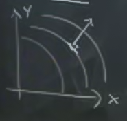
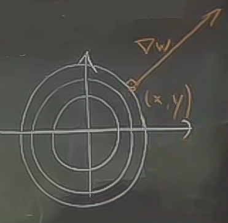
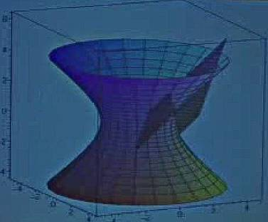
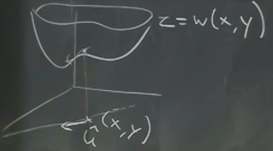
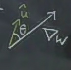
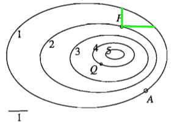
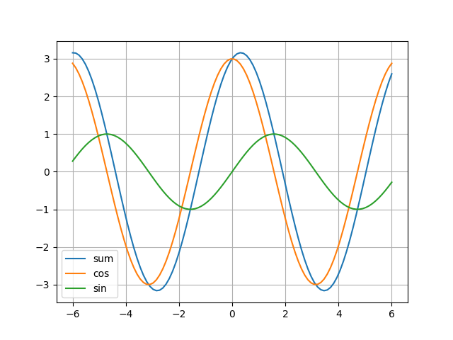

# Ders 12

Zincirleme Kanunu hatırlayalım

$$ \frac{dw}{dt}  = w_x \frac{dx}{dt} + 
w_y \frac{dy}{dt} + 
w_z \frac{dz}{dt}  $$

Bu formül, kısmi türevler üzerinden, $w$'daki değişimin $x,y,z$'deki
değişime ne kadar "hassas'' ne kadar "bağlı'' olduğnu gösteriyor.

Şimdi üsttekini daha azaltılmış, özetli (compact, concise) bir formda şöyle
yazacağım. 

$$ 
= \nabla w \cdot  \frac{d\vec{r}}{dt} 
$$

Gradyan vektörü tüm kısmi türevlerin bir araya konmuş halidir. 

$$ \nabla w = < w_x, w_y, w_z > $$

Tabii ki bunu söyleyince üstteki gradyan'ın $x,y,z$'ye bağlı olduğunu da
söylüyoruz, mesela $w$'nun belli bir nokta $x,y,z$'da gradyanını
alabilirsiniz, o zaman her değişik $x,y,z$ noktasında farklı bir vektör
elde edersiniz, ki bu vektörlerin tamamına ileride "vektör alanı (vector
field)'' ismini vereceğiz. Devam edelim, 

$$ \frac{d\vec{r}}{dt} = < \frac{dx}{dt}, \frac{dy}{dt}, \frac{dz}{dt} > $$

Yani hız vektörü (velocity vector) $d\vec{r}/{dt}$ yukarıdaki gibi
tanımlıdır.

Bugünkü amacımız gradyan vektörünü anlamak, ve nerelerde
kullanabileceğimizi incelemek. Gradyanları yaklaşıksal formüllerde
kullanmak mümkündür, vs. Üstte gördüğümüz onun notasyonu. 

Gradyanların belki de en "havalı'' özellikleri şudur. 

Teori

İddia ediyorum ki $\nabla w$ vektörü, $w = \textrm{ bir sabit }$ile elde
edilecek kesit yüzeyine (level surface) her zaman diktir.

Eğer fonksiyonumun bir kontur grafiğini çizersem



gösterilen noktada hesaplanacak gradyan vektörü o noktadaki kontura diktir.

Örnek 1

Lineer bir $w$ kullanalım. 

$$ w = a_1 x + a_2 y + a_3 z $$

Gradyan nedir? Kısmi türevleri alalım:

$$
\nabla w = < a_1, a_2, a_3 >
$$

Konturları nasıl elde ederim? $a_1 x + a_2 y + a_3 z  = c$ ki $c$ bir
sabittir, bu formülü tatmin eden tüm $x,y,z$ değerleri bir düzlem
oluştururlar. 

Bu düzlemin normalinin nasıl alınacağını biliyoruz, katsayılara bakarız,
$< a_1,a_2,a_3 >$. Bu vektörün gradyanla aynı çıktığına dikkat, ki normal vektör de
düzleme diktir zaten. Aynı çıkmaları mantıklı.

Aslında bu örnek gradyanın dikliğini bir anlamda ispatlıyor, çünkü düzlem olmasa
bile herhangi bir fonksiyonun birinci yaklaşıksallığı bir düzlem yaratır, o
düzlemin normalı, gradyanı eşitliği bizi yine gradyanın dikliğine götürür. Ama
bu yeterince ikna edici olmadıysa başka bir örneğe bakabiliriz.

Örnek 2

$$ w = x^2 + y^2 $$

Bu fonksiyonun kesit seviyeleri, değişik yarıçaplara sahip dairelerdir,
$x^2 + y^2 = c$ formülündeki değişik $c$ değerleri bu daireleri tanımlar. 

Gradyan vektörü

$$ \nabla w = <2x, 2y> $$



Seçilen $x,y$ noktasında $\nabla w$ gösterilmiş. Bu vektörün $x$ ve $y$
eksenlerinde boyunun, başladığı noktaya göre olan $x,y$ değerlerinin
yaklaşık iki katı olduğuna dikkat, ki bu da $< 2x,2y >$ vektörü ile uyumlu. 

Şimdi gradyanın niye kesit eğrilerine hep dik olduğunu ispatlayalım.

İspat

Önce kesit eğrileri "üzerinde'' hareket eden bir nokta hayal edeceğiz. Bu
nokta fonksiyonun sabit olduğu yerlerden geçiyor demektir, çünkü kontur
üzerinde fonksiyon değeri hep aynıdır. 

Eğri $\vec{r} = \vec{r}(t)$ hep $w = c$ üzerinde olacak. Resme bakalım,
hayali bir kesit yüzeyi üzerinde bir eğri bu (kırmızı renkli) ve bu eğrinin
üzerinde giden noktanın bir hızı olacak. Bu arada $w$ mesela $w = x^2 +
y^2$ belki, herhangi bir üç boyutlu fonksiyon. $\vec{r}$'nin $w$ üstünde
gitmesi demek, $\vec{r}$ ile $w$ parametrize edilebilir demek, $\vec{r}(t)
= < x(t),y(t),z(t) >$ ve onu kullanarak $w(\vec{r}(t)) = c$.


İddia o ki, 

$$ \vec{v} = \frac{d\vec{r}}{dt} $$

vektörü, kesit $w = c$'ye muhakkak teğet olmalı, çünkü hız eğriye teğet, ve
eğri kesit içinde. Bu arada $w$'nin aslında $w(\vec{r}(t))$ olduğunu
belirttik.

Bu sayede Zincirleme Kanununu kullanarak 

$$ \frac{dw(\vec{r})}{dt} = \nabla w \cdot \frac{d\vec{r}}{dt} = \frac{dc}{dt}$$

eşitliğini kurabiliriz. Noktasal çarpım nereden geldi? Bu ifade $w$'nin
her kısmi türevinin alıp, ona tekabül eden $\vec{r}(t)$ öğesinin türevi ile
çarpıp sonuçların toplanması demek. Sonuç Zincirleme Kanunu'ndaki görüntü
olacaktır. Ayrıca

$$  = \nabla w \cdot \vec{v} = 0$$

Sıfıra eşitliğin sebebi $w = c$ olması ve sabitin türevi $dc/dt$ sıfır oldu. 

Şimdi sıfır sonucundan ters yöne gidelim: iki vektörün noktasal çarpımı ne zaman
sıfır sonucu verir? Eğer vektörler birbirine dik ise. Demek ki $\nabla w \perp
\vec{v}$.

Hatta iddia ediyorum ki bu diklik $w=c$ üzerindeki her hareket (motion)
için geçerlidir. Yani $\vec{v}$, kesit yüzeyine teğet olan herhangi bir
vektör olabilir, üstteki diklik hep doğru olacaktır.


Bunun güzel bir uygulaması şu, artık istediğimiz her şeyin teğet düzlemini
bulabiliriz. 

Örnek

Yüzey $x^2 + y^2 - z^2 = 4$'un $(2,1,1)$ noktasındaki teğet düzlemini
bul. Alttaki şekil bir hiperboloid (hyperboloid) ve bu dersin altında
grafiklemek için gereken kodlar var.



Resimde teğet düzlem pek teğet gibi değil, diğer grafiğin içine girmiş gibi
duruyor, fakat problemin verdiği noktada düzlem teğet. 

Bu düzlemi nasıl bulacağız? Gradyanı hesaplayarak. 

Kesit seviyesi $w=4$ ve Yüzey $w = x^2 + y^2 - z^2$. 

$$ \nabla w = <2x, 2y, -2z> $$

Verilen nokta değerlerini bu gradyan vektörüne verirsek, sonuç
$< 4,2,-2 >$. Bu sonuç yüzeye ya da teğet düzleme normal (dik) olan 
vektörü verecek. 

Bu normal vektörü kullanarak düzlemin formülünü bulabiliriz. 

$$ 4x + 2y - 2z = ? $$

Soru işareti ne olur? $(2,1,1)$ noktasını formüle koyarsak, sonuç 8 çıkar.

$$ 4x + 2y - 2z = 8 $$

Alternatif Yöntem

Aslında tüm bunları gradyan olmadan da yapabilirdik, bir diferansiyel ile
ise başlayabilirdik

$$ dw = 2x dx + 2y dy -2z dz $$

$(2,1,1)$ noktasında

$$ = 4dx + 4dy - 2dz $$

Yaklaşıksal olarak 

$$ \Delta w \approx 4 \Delta x + 2\Delta y - 2\Delta z  $$

Ne zaman kesit yüzeyi, kontur üzerindeyiz? Eğer $w$'de hiç değişim yok ise, yani
$\Delta w = 0$ ise. Bu arada üstteki yaklaşıksallığın bir lineer yaklaşıksallık
olduğunu unutmayalım. $[\begin{array}{ccc} 2&1&1 \end{array}]$ noktasında bu teğeti kullanmak istersek,
$\Delta w = 0$ eşitliği bize $4 \Delta x + 2 \Delta y - 2 \Delta z$ teğet düzlemini
verecektir. Nasıl? $\Delta x$ değişimdir, teğet düzlem üzerinde değişimi
tanımlamak istiyorsak, $[\begin{array}{ccc} 2&1&1 \end{array}]$'den başlayarak
bir yere gittiğimizi düşünmemiz gerekir, ki mesela $x-2$ değişimini yapabiliriz,
vs. Tam formül

$$ 4(x-2) + 2(y-1) - 2(z-1) = 0 $$

Yönsel Türevler (Directional Derivatives) 

Elimdeki bir $w = w(x,y)$ formülünün kısmi türevini aldığım zaman $\partial
w/\partial x$, $\partial w/\partial y$ ile mesela, bu türevler x-ekseni ya da
y-ekseni yönünde değişim olduğu zaman $w$'nun nasıl değiştini ölçerler. Peki
başka yönlere göre, mesela bir birim vektör $\hat{u}$ yönünde türev alınamaz mı?
Cevap evet. Yönsel türevler bu ise yarıyorlar.



Yani $\hat{u}$ üzerinden geçen yolda ilerlerken $z$'nin nasıl değişeceğini merak
ediyorum. Düz çizgi üzerindeki gidişata (straight line trajectory) bakıyoruz.

$s$ adlı bir parametreye bağlı bir pozisyon vektörü $\vec{r(s)}$ hayal
edelim, öyle ki,

$$ d\vec{r}/ds = \hat{u} $$

sonucunu versin.

Niye üstte $t$ yerine $s$ kullandım? Çünkü çizgi boyunca birim hızda
ilerliyorum, o zaman parametrize ettiğim şey katedilen yol. $s$ bir anlamda eğri
uzunluğu (arc length), tabii tam eğri denemez çünkü çizgi düz, ama yine mesafe
kavramını kullanıyoruz.

O zaman $dw/ds$ nedir? Bunu hesaplamak için Zincirleme Kanunu'nun özel bir
durumunu kullanacağız.

Eğer $\hat{u} = <a,b>$ ise

$$ x(s) = x_0 + as $$

$$ y(s) = y_0 + bs $$

Bu formülleri $w$'ye sokarız, sonra $dw/ds$'i hesaplarız. 

Tanım: Yönsel Türev

$$ \frac{dw}{ds}_{|\hat{u}} $$

Daha önce kısmi türevleri incelerken onları geometrik olarak, x ve y
eksenine paralel düzlemlerin fonksiyonu kesmesi olarak görmüştük. Yönsel
türevler ise herhangi bir yöndeki (daha doğrusu $\hat{u}$ yönündeki) bir
düzlemin fonksiyonu kesmesi olarak görülebilir.


Tanım

$dw / ds_{|\hat{u}}$ = Bir grafiğin (fonksiyonun) $\hat{u}$ vektörünü içeren /
ona paralel olan, ve dikey düzlem (vertical plane) kesilmesi ile elde edilen, o
düzlemdeki yansımasının oluşturduğu eğrinin değişimi / eğimi (slope).

Zincirleme Kanunu uygulanırsa

$$ \frac{dw}{ds} = \nabla w \cdot \frac{d\vec{r}}{ds} 
= \nabla w \cdot \hat{u}
$$

Hatırlamamız gereken formül o zaman

$$ \frac{dw}{ds}_{|\hat{u}} =  \nabla w \cdot \hat{u} $$

Eşitliğin sağ tarafı "gradyanın $\hat{u}$ yönünde giden bileşeni, kısmı''
olarak ta nitelenebilir. 

Kavramların birbiriyle alakasını iyice görmek için suna bakalım

Örnek

$$ 
\frac{dw}{ds}_{|\hat{i}} =  \nabla w \cdot \hat{i} = 
\frac{\partial w}{\partial x} $$

Geometrik olarak

$$ \frac{dw}{ds}_{|\hat{u}} =  \nabla w \cdot \hat{u} $$

$$ =  |\nabla w||\hat{u}|\cos(\theta)  $$

$\hat{u}$ birim vektör olduğuna göre $|\hat{u}| = 1$, formülden atılır

$$ =  |\nabla w||\cos(\theta)  $$



Bu ifade "gradyanın $\hat{u}$ yönündeki bileşeni'' hesabının bir diğer
versiyonudur aslında. 

Şu soruyu soralım: hangi yöndeki değişim en büyüktür? $|\nabla w||\cos(\theta)$
ifadesinin en buyuk olduğu yer $\cos(\theta)=1$ olduğu zamandır, yani $\theta =
0$, ki bu durum $\hat{u} = dir(\nabla w)$, yani $\hat{u}$'nun gradyan ile aynı
yönde olduğu zamandır.

O zaman şu yorumu da yapabiliriz, gradyan belli bir noktada fonksiyonun en
çok artacağı yönü gösterir. 

Peki $|\nabla w|$, yani $\nabla w$'nun büyüklüğü neye eşittir? 

$$ |\nabla w| =   \frac{dw}{ds}_{|\hat{u}=dir(\nabla w)}  $$

En hızlı düşüş (azalış) hangi yöndedir? En fazla artışın tam tersi
yönünde. 

Yani min $dw/ds_{|\hat{u}}$ için $\cos(\theta) = -1$ olmalıdır, yani $\theta =
180^o$,  $\hat{u}$, $-\nabla w$  yönünde olduğu zaman.

Peki şu ne zaman doğrudur? 

$$ \frac{dw}{ds}_{|\hat{u}} = 0 $$

Yani fonksiyon hangi yönde değişmez? 

Bunun için $\cos(\theta) = 0$ olmalıdır, ki bu $\theta = 90^0$ olduğu
zamandır. Yani $\hat{u} \perp \nabla w$ ise. Bunu anlamanın bir diğer yolu, hiç
değişimin olmadığı yönün kesit yüzeyine teğet olduğudur, bu yüzeyde $w$ hiç
değişmediğine göre değişim olmaz, değişim yoksa, biz de teğet hareket ediyoruz
demektir.

Soru

P noktasında $\partial w/ \partial x$ ve $\partial w/\partial y$'yi 
kabaca hesapla. 

$$ \frac{\partial w}{\partial x} = \frac{dw}{ds} \bigg|_{\hat{i}} \approx
\frac{\Delta w}{\Delta s} \approx
\frac{-1}{5/3} = -0.6
$$

$$ \frac{\partial w}{\partial y} = \frac{dw}{ds} \bigg|_{\hat{j}} \approx
\frac{\Delta w}{\Delta s} \approx
\frac{-1}{1} = -1
$$

$\Delta = -1$ çünkü dik giderken kesit seviye 2'den 1'e geliyoruz, $w$ 1
azalıyor. Bu gidişat $s$'in kendi değişimi $\Delta s$, bunu da kabaca, sol alt
köşedeki skalaya bakarak tahmin ediyoruz, sağa doğru yatay gidiş 1'den büyük
gibi duruyor, ona 5/3 demişiz, yukarı doğru gidişat tam 1 gibi duruyor, ona 1
demişiz.

$\partial w / \partial y$ hesabında niye aşağı değil yukarı gitmişiz? Çünkü
$\hat{i}$'nin yönü yukarıdır, aşağı değil. 

Hiperboloid 

Parametrizasyonu türetelim. Diyelim ki $x^2 + y^2 - z^2 = 1$ gibi bir
paraboloid'imiz var. $x,y$'yi şöyle alalım

$$ x = r \cos u $$

$$ y = r \sin u $$

Yerine koyarsak

$$ r^2 - z^2 = 1 $$

elde ederiz. Şimdi kareleri birbirinden çıkartılınca 1 veren bir şeyler
bulmak lazım. Hiperbol $\sin$ ve $\cos$ (hyperbolic sine, cosine) böyle
fonksiyonlardır. 

$$ \cosh^2x - \sinh^2x = 1 $$

Bu eşitliği kullanarak 

$$ r = \cosh v $$

$$ z = \sinh(v) $$

Yine yerine koyalım

$$ x = \cos u \cosh v $$

$$ y = \sin u \cosh v $$

$$ z = \sinh v $$

Son formüllerimiz bunlar.

```python
from mpl_toolkits.mplot3d import Axes3D

fig = plt.figure(figsize=plt.figaspect(1))  # Square figure
ax = fig.add_subplot(111, projection='3d')

r=1;
u=np.linspace(-2,2,200);
v=np.linspace(0,2*np.pi,60);
[u,v]=np.meshgrid(u,v);

a = 1
b = 1
c = 1

x = a*np.cosh(u)*np.cos(v)
y = b*np.cosh(u)*np.sin(v)
z = c*np.sinh(u)

ax.plot_surface(x, y, z,  rstride=4, cstride=4, color='b')

plt.savefig('hyperboloid.jpg')
```


Bir diğer kod $a \cos,b \sin$ ifadelerinin toplamını gösteriyor

```python
from pylab import *

xmax = 6.
xmin = -6.
D = 100
x = linspace(xmin, xmax, D)

a = 3
b = 1

plot(x, (a*cos(x) + b*sin(x)))
plot(x, (a*cos(x)))
plot(x, (b*sin(x)))

grid()
legend(['sum', 'cos','sin'])
plt.savefig('1h7.png')
```




