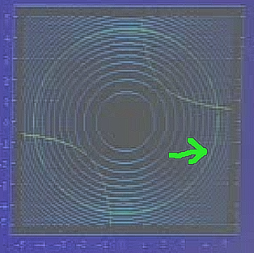
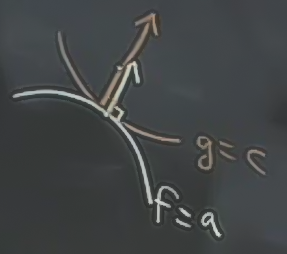
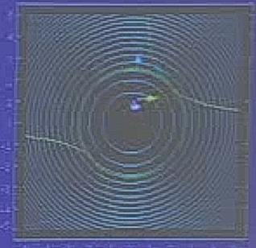
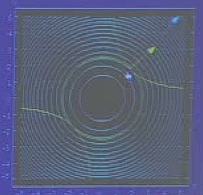
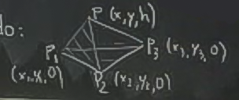

# Ders 13

Lagrange Çarpanları (Multipliers)

Amaç yine $f(x,y,z)$ gibi birden fazla değişken içeren bir fonksiyonu
maksimize etmek, değişik olan, $x,y,z$ değişkenlerinin birbirinden bağımsız
ol*ma*ması. Bu değişkenlerin arasındaki ilişki $g(x,y,z)=c$ gibi bir
fonksiyon tarafından gösteriliyor olabilir, $c$ bir sabittir. Yani
$f(x,y,z)$'i minimize ya da maksimize ediyoruz ve bunu sadece $g(x,y,z)=c$
şartına / sınırlama ifadesine (constraint) uyan $x,y,z$ değerleri için
yapıyoruz.

Bunun için hangi tekniği kullanırız? Yollardan biri, eğer sınırlama ifadesi
basit ise, belki bir değişkeni cebirsel olarak çözmek (diğerleri
bağlamında ifade ederek), sonra geri $f$'e sokarız, böylece klasik bir min
/ maks problemi elde ederiz, ki o tür bir problemi çözmeyi artık biliyoruz.

Fakat bazen $x,y,z$ değişkenleri için analitik çözüm mümkün olmaz, o zaman
farklı teknikler kullanmamız gerekir. Bu derste öğreneceğimiz teknikler
bunlar olacak. 

Uygulama bağlamında, Lagrange Çarpanları bizi niye ilgilendiriyor? Belki
fizik, termodinamik dersinde görmüşsünüzdür, sıcaklık, hacim ve basınç
değerleri vardır, ve bu değerler birbirinden bağımsız
değildir. Termodinamikte $PV=nRT$ denklemi vardır, gerçi burada analitik
olarak basitleştirme yapabilirdik, ama bazı şartlarda tüm değişkenleri
olduğu gibi tutmayı isteyebiliriz. 

Şimdiye kadar min / maks problemleri için gördüğümüz kritik nokta bulma
tekniklerinin burada ise yarayamacağını hemen belirtelim. O kritik noktalar
$g(x,y,z)=c$ sınırlama ifadesini tatmin etmiyor olabilirler. Başka bir şeye
ihtiyacımız var. 

Örnek

Hiperbol $xy =3$ üzerinde olan ve orijine en yakın noktayı bul. 

Aslında bu soruyu temel geometri kullanarak çözebiliriz, fakat burada
Lagrange Çarpanları kullanarak çözeceğiz, çünkü iyi bir örnek.

Neyi minimize edelim? Mesela $f(x,y) = \sqrt{x^2 + y^2}$ olur mu? Olabilir,
ama karekök ifadesinden kurtulursak daha iyi olur. 

O zaman

$$ min \ f(x,y) = x^2 + y^2 $$

$$ ki, \ xy = 3  $$

Yani sınırlama ifadesini $g(x,y) = xy$ olarak seçtik. 

Grafiğe bakalım. Yuvarlaklar $f(x,y)$ konturları, yeşil okla gösterilen
mesela $f(x,y) = 20$ konturu. Bu kontur üst sağ köşe ve sol alt köşede
gösterilen hiperbolu kesiyor mu? Evet. Fakat $f(x,y) = 10$, vs. diyerek
daha küçük yuvarlaklar elde edebilir miyim? Evet. Fakat bir noktadan sonra
bu halkalar hiperbolu kesmeyecektir. 

Aradığımız $x,y$ değerleri hiperbole teğet olan, olabilecek en küçük
yuvarlak.

Çözüm için teğetlik kavramından faydalanabiliriz. Eğer olabilecek en
minimal $f$, her iki fonksiyonun kesit eğrilerinin teğet olduğu noktada
ise, bu noktayı bulmaya uğraşabilirim. 

İki kesit eğrisi birbirine teğet ise, onların teğet düzlemi paraleldir,
eğer öyleyse, bu düzlemlerin normalleri birbirine paralel olmalıdır. 

Bu normallerin aynı boyda olması gerekmez, yukarıdaki gibi, ama paralel
olmaları gerekir. Bu durumda 

$$
\nabla f // \nabla g
$$

ifadesi doğru olmalıdır, yani $f$'in gradyanı $g$'nin gradyanına
paraleldir. Bazı örnekler [hocanın kullandığı program mouse ile tıklanan
yerde (mavi nokta) her iki fonksiyonun gradyanını hemen grafikliyebiliyor,
alttaki resimler birkaç örnek noktada yapılan tıklamalar]. 

Görüldüğü gibi minimal noktaların birinde (üstteki son resim) gradyanlar
paralel. 

Cebirsel olarak düşünürsek: vektörler ne zaman birbirine paralel olur?
Birbirlerinin katı oldukları zaman. Yani şu şekilde bir ifadeyi
yazabildiğimiz zaman

$$
\nabla f = \lambda \nabla g
$$

ki $\lambda$ bir sabit. 

Gradyanlar aynı çizgide olup tam zıt yönü gösteriyor olabilir, bu durumu
$\lambda$'nin negatif olup olmaması halledecektir.

Yani aradığımız $xy$ üzerinde sayısal değer $\lambda$ üzerinden $\nabla f =
\lambda \nabla g$ ifadesinin doğru olduğu bir nokta, ve $\lambda$ değerini
arıyoruz (unutmayalım, gradyanlar belli $x,y$ değerleri üzerinde alınır). Yani 2
değişken içeren sınırlama ifadesi $g(x,y)=c$ içeren bir min / maks problemi
yerine, bir denklem sistemi geçiriyoruz. Bu sistem nedir?  Üstteki gradyan
formülüdür, o da şu sisteme dönüşür:

$$ f_x = \lambda g_x $$

$$ f_y = \lambda g_y $$

Öyle değil mi? Çünkü $\nabla f$ ve $\nabla g$ birer vektördür, 

$$ 
\nabla f =
\left[\begin{array}{r}
f_x \\
f_y
\end{array}\right], \ \ 
\nabla g =
\left[\begin{array}{r}
g_x \\
g_y
\end{array}\right]
$$

O zaman iki üstteki denklem sistemi şuradan ileri gelmektedir

$$ 
\left[\begin{array}{r}
f_x \\
f_y
\end{array}\right]  = 
\lambda
\left[\begin{array}{r}
g_x \\
g_y
\end{array}\right]
$$

Fakat hala eksik bir şey var. Elimizde $x,y,\lambda$ bilinmeyenleri var,
ama sadece iki tane formül var. Eksik olan $g(x,y) = c$, çünkü $x,y$
birbirinden bağımsız değil ve $g$ üzerinden bağlantılılar. Şimdi oldu. 3
formül şöyle:

$$ f_x = \lambda g_x $$

$$ f_y = \lambda g_y $$

$$ g(x,y) = c $$

Örneğimiz 

$$ f(x,y) = x^2 + y^2 $$

$$ g(x,y) = xy  $$

üzerinde uygularsak

$$ 2x = \lambda y $$

$$ 2y = \lambda x $$

$$ xy = 3 $$

Bu sistemi çözmemiz gerekiyor. Yanlız şunu söyleyelim, bu sistemi çözmenin genel
(hep işleyen) bir yöntemi yoktur. Çözüm bazen çok basittir, bazen zordur, bazen
sadece sayısal / hesapsal açıdan çözülebilir (bilgisayar ile). Bu örnekte kolay.

$$ 2x - \lambda y = 0$$

$$ 2y - \lambda x = 0 $$

$$ xy = 3 $$

Matris formuna koyarsak

$$ 
\left[\begin{array}{rr}
2 & -\lambda \\
\lambda & -2
\end{array}\right]
\left[\begin{array}{r}
x \\ y
\end{array}\right]
=
\left[\begin{array}{r}
0 \\ 0
\end{array}\right]
$$

En basit çözüm $x=0,y=0$ sınırlama ifadesi $xy=3$'u çözmez. Diğer çözüm ne
zaman ortaya çıkar? Eğer matrisin determinantı sıfır ise. 

$$ 
\left|\begin{array}{rr}
2 & -\lambda \\
\lambda & -2
\end{array}\right| = -4 + \lambda^2 = 0
$$

$$ <=> \lambda^2 = 4 $$

$$ <=> \lambda = \pm 2 $$

Elimizde iki durum var. $\lambda$ ya 2, ya da -2. 

1) $\lambda = 2$ durumunda

$$ x = y $$

$$ x^2 = 3 $$

O zaman

$(x,y)$ = $(\sqrt{3}, \sqrt{3})$ ya da $(-\sqrt{3}, -\sqrt{3})$ 

2) $\lambda = -2$ durumunda

$$ x = -y $$

$$ -x^2 = 3 $$

Bu durumda çözüm yoktur (karesi alınıp eksi ile çarpılan hiçbir sayı 3
sonucunu vermez). 

Üstteki son iki resime bakınca, $\lambda = 2$'nin doğru olduğunu görüyoruz,
çözüm olan iki noktada bir gradyan ötekinin hakikaten tam iki katı. 

Bu metot niye işledi? Grafiklere baktık, teğetlik olduğunu gördük, fakat
bunun niye kesinlikle böyle olması gerektiğini söylemedik. 

Kısıtlı ifade gözönüne alınınca ele geçecek bir min / maks noktasında ve
$g = c$ kesit eğrisi boyunca, $f$'in değişim oranı $=0$ olmalıdır.

Şimdi aynı şeyi yönsel türev kullanarak söyleyelim. 

$g=c$'e teğet olan her $\hat{u}$ için $df / ds_{|\hat{u}} = 0$ olmalı. 

Yani şu resme bakarsak

Kesit yüzeyi (ki orada $g=c$) üzerindeki nokta ve o yüzeye teğet olan yön
$\hat{u}$ yönünde $f$'in değişimi sıfırdır. 

$df / ds_{|\hat{u}}$ formülünün $\nabla f \cdot \hat{u}$ formülüne eşit olduğunu 
 biliyoruz. 

O zaman teğet olan her $\hat{u}$, $\nabla f$'e dik olmalıdır, yani
$\hat{u} \perp \nabla f$. 

O zaman $\nabla f$, $g$'nin kesit seviyelerine diktir. 

$g$'nin kesit seviyelerine dik bir başka vektör daha biliyoruz, o 
da $g$'nin kendi gradyanı, yani $\nabla g$. 

O zaman $\nabla f // \nabla g$ olmalıdır çünkü her iki gradyan da $g$'nin
kesit seviyelerine aynı anda diktir. 

Tekrar edelim. Sınırlanmış min, maks noktasında $g$ kesit seviyesi üzerinde
ilerliyorsak, $f$'in (en azından birinci derecedeki yaklaşıksallamasındaki)
değişimi sıfırdır, yani $g=c$'ye teğet yöndeki herhangi bir $f$ türevi sıfır
olmalı. Min, maks olmak bu demek. O zaman $g=c$'ye teğet olan herhangi bir
$\hat{u}$, $f$'in gradyanı $\nabla f$'e dik olmalıdır, ve bu da $\nabla f$,
$g$'nin kesit seviyesine dik demektir. 

Yani resimde gördüğümüz tekrar söylemiş oluyoruz. Her iki kesit seviyesi
kısıtlanmış mın / maks noktasında birbirine teğet olmalı.

UYARI

Bu metot bir çözümün min mi, maks mi olduğunu söylemez. 

Kötü haber: 2. türev testini kullanamayız. 

Ne yapabiliriz? Elde edilen noktaları $f$'e verip sonuca teker teker
bakarız, birbirleri ile karşılaştırız. Mesela üstteki örnekten elde
ettiğimiz değerler minimum'dur, maks bu problemde sonsuzluktadır.

Zor Örnek

Diyelim ki bir piramit inşa etmek istiyoruz, hacim ve üçgensel taban bize
veriliyor. Amaç, tüm dış yüzey alanını minimize etmek. 

Çözüm için bulmamız gereken piramidin en üst noktası. Değişik yerlerde
olabilecek, ve nerede olduğuna göre hacimin, alanın değişebileceği
elimizdeki ayar noktası orası. Hacim formülü

Hacim = $\frac{1}{3}$ Baz alanı $\times$ yükseklik

Hacmi ve baz alanı sabitlediysek, o zaman formülde geri kalan yükseklik te
sabitlenmiş demektir. Minimize ederken onun üzerinde oynayamayız. O zaman
üst nokta sadece xy düzlemine paralel olarak sağa, sola, ileri, geri,
vs. şeklinde yer değiştirebilir, aşağı, yukarı çıkamaz. 

Eğer kordinatları üstteki gibi ortaya çıkartsak, ele geçen tüm üçgenlerin
alan hesabını vektör çapraz çarpımı ile hesaplamayı biliyoruz, onların
toplamını elde etmeye uğraşabilirdik, vs. Fakat üstteki yöntem işleri daha
fazla karıştırıyor. Kordinatları daha iyi temsil edecek bir yöntem
gerekiyor bize.

Temsili üstteki gibi yapalım, resimde sağda olan şekil piramidin kuşbakışı
görüntüsü. Piramit tabanında bir $Q$ noktası hayal edelim, $P_1$  ve $P_2$
arasından $Q$'ye giden uzaklık $u_3$ [resimde iyi çıkmadı, biz ekledik],
yüksekliği zaten biliyoruz, $h$. O zaman piramit kenarında ona tekabül eden
yükseklik $\sqrt{u_3^2 + h^2}$. 

$$ \textrm{Kenar alanı } = 
\frac{1}{2}a_1 \sqrt{u_1^2 + h^2} + 
\frac{1}{2}a_2 \sqrt{u_2^2 + h^2} + 
\frac{1}{2}a_3 \sqrt{u_3^2 + h^2} 
$$

Bu 3 değişken içeren bir fonksiyon, $f(u_1,u_2,u_3)$. 

Üç değişkeni birbiri ile nasıl ilişkilendiririz? Çünkü büyük bir ihtimalle
bunlar bağımsız değişkenler değiller.

Eğer üst resimdeki sağ şekle bakarsak, ve baz alanını üç parçaya bölersek,
elde ettiğimiz

$$ \textrm{Baz alanı} = 
\frac{1}{2}a_1u_1 +  
\frac{1}{2}a_2u_2 +  
\frac{1}{2}a_3u_3
$$

formülüdür. Bu formül kısıtlama ifadem, yani bu problemin $g$'sı. Kenar
alanı formülü de $f$'im. 

Lagrange

$$
\nabla f = \lambda \nabla g
$$

$$ \frac{\partial f}{\partial u_1} =
\frac{1}{2}a_1 \frac{u_1}{\sqrt{u_1^2 + h^2}} = 
\lambda \frac{1}{2}a_1
$$

$1/2a_1$'ler iptal olur

$$
\frac{\partial f}{\partial u_1} =
\frac{u_1}{\sqrt{u_1^2 + h^2}} = \lambda 
$$

Diğerleri benzer şekilde

$$
\frac{\partial f}{\partial u_2} =
\frac{u_2}{\sqrt{u_2^2 + h^2}} = \lambda 
$$

$$
\frac{\partial f}{\partial u_3} =
\frac{u_3}{\sqrt{u_3^2 + h^2}} = \lambda 
$$

Son üç formülün üçü de $\lambda$'ya eşit, o zaman üç formül birbirine
eşit. Bu mantığı izlersek, $u_1 = u_2 = u_3$ olması gerektiği sonucuna da
varırız. 

O zaman $Q$ noktası her kenardan eşit uzaklıkta, tam ortada olmalı.

Soru

Bir dikdörtgensel kutu birinci oktan (octant) içine konuyor, ki kutunun $Q$
köşesi tam orijinde, onun köşegen olarak tam zıttında duran $P$ noktası
ise $f(x,y,z)=c$ gibi bir yüzeye dokunuyor. Lagrange Çarpanları tekniğini
kullanarak hangi $P$ noktası için bu kutunun en büyük hacime sahip
olacağını hesaplayın, ve hesabınızın bir maksimum nokta ortaya çıkartıp
çıkarmadığını nasıl bildiğinizi ortaya koyun. 

Oktan kavramı alttaki şekilde gösteriliyor, Latin "octo'' bilindiği gibi
"sekiz'' anlamına geliyor, ki alttaki 3D kordinat sistemi 8 parçaya
bölünmüş. 1. oktan tüm işaretlerin, yani $x,y,z$'nin hepsinin + olduğu
bölge. 

Cevap

a) $f(x,y,z) = x + 2y + 3z = 18$

$$
\nabla (xyz) = \lambda \cdot \nabla f(x,y,z)
$$

$$ yz = \lambda, \ xz = 2\lambda, \ xy = 3\lambda $$

Bu formülleri aynı anda çözmek için üstteki üç denklemi sırasıyla $x,y,z$
ile çarparız böylece sol tarafı aynı olan üç tane denklem elde etmiş
oluruz. 

$$ xyz = \lambda x $$

$$ xyz = 2 \lambda y $$

$$ xyz = 3 \lambda z $$

Böylece üç denklemin sağ tarafı artık birbirine eşittir. 

$$ x = 2y = 3z $$

Daha önceden biliyoruz ki

$$ x + 2y + 3z = 18 $$

Birbirine eşit üç şeyin toplamı $18$ ise, o şeylerin her birinin büyüklüğü
$6$ demektir, yani 

$$ x = 2y = 3z = 6$$

Buradan $x,y,z$ teker teker bulunabilir,

$$ x = 6, y=3, z= 2 $$

Bu bir maksimumdur çünkü 1. oktanda kalıp olabileceğimiz en küçük değer
$x,y,z$ sıfır olduğu, yani orijinde olduğu zamandır. Bu noktalar orjinden
büyük değerler. 

