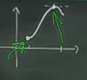
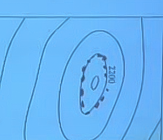
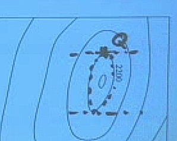

# Ders 15

Önceki derslerde gradyan kavramını gördük. Bu vektörün bileşenleri, 3
değişkenli bir fonksiyon için

$$ 
\nabla f = < f_x, f_y, f_z > 
$$

idi, ki bu bileşenler $f$'in tüm kısmı türevlerini
oluşturuyordu. Gradyanlar kısmı türevleri paketlemenin, sunmanın
yöntemlerinden biriydi sadece.

Gradyanları yaklaşıksallama formülleri için de kullanabiliyorduk, mesela
eğer $x,y,z$'yi "birazcık'' değiştirince bunun $f$ üzerindeki değişim
etkisi $\Delta f$'i [kabaca, niye kabaca olduğu altta] hesaplamak
istiyorsak bunun gradyan formundaki hali

$$ \Delta f \approx f_x \Delta x + f_y \Delta y + f_z \Delta z $$

Daha kısa olarak 

$$ = \nabla f \cdot \Delta \vec{r} $$

oluyordu, yani gradyan vektörünün, pozisyon vektörünün değişimi ile olan
noktasal çarpımı. Kısmı türevlerin tamı tamına ölçtüğü şey $f$'in bir
değişkendeki değişime ne kadar hassas olduğudur, ve bu hassaslığın ufak
değişimler ile çarpılıp toplanması bize tüm fonksiyondaki değişimi verir.

Üstteki yaklaşıksallama "teğet düzlem yaklaşıksallaması'' olarak bilinir,
bu arada, fonksiyonun yerine bir noktada teğet düzlemi koyuyoruz, o noktada
fonksiyon budur diyoruz, böylece fonksiyonun $x,y,z$ değişkenlerine aşağı
yukarı lineer olarak bağlı olduğunu farz ediyoruz, o sebeple zaten
değişimleri düz çarpım sonrası basit toplama maruz tutuyoruz. 

Hatırlarsak, $f(x,y,z)=c$ yüzeyine teğet olan düzlemi bulmak için normal
vektöre bakarız, biliyoruz ki normal vektörlerden biri fonksiyonun gradyan
vektörüdür, çünkü gradyanın kesit seviyelerine diktir, ve fonksiyonun daha
yüksek değerlerine, en yüksek artış yönüne işaret etmektedir. 

Bu noktada kültürel bir not eklemek istiyorum. Bunu belki haftalar önce
belirtmeliydim, daha iyi olurdu. Kısmı türevleri niye seviyoruz /
kullanıyoruz? Önemli bir sebep onların fizik için çok faydalı olmaları,
etrafımızdaki dünyayı anlamamıza yardımcı olmaları. Bu dünyadaki pek çok
oluş kısmı türevsel denklemler (partial differential equations -PDE-) ile
tarif edilir, modellenir.

PDE'ler bilinmeyen bir fonksiyonun kısmı türevlerini kullanarak onlar
arasında bir ilişki, fonksiyon kurar. 

Mesela Isı Denklemi (Heat Equation) bunlardan biridir. 

$$ \frac{\partial f}{\partial t}  = k (
\frac{\partial^2 f}{\partial x^2} + 
\frac{\partial^2 f}{\partial y^2} + 
\frac{\partial^2 f}{\partial z^2} )
$$

Bu denklemde çözmek, bulmak istediğimiz $f$ fonksiyonudur, ve bu
fonksiyon 4 değişkene bağlıdır: $f(x,y,z,t)$, ve temsil ettiği $x,y,z$
pozisyonundaki bir noktanın $t$ anındaki sıcaklığıdır. PDE
$\partial f/\partial t$ ise bu fonksiyonun zamana göre nasıl değiştiğini
tarif eder. 

Bu konuya ileride tekrar döneceğiz. 

Şimdi diğer konulara geçelim. Kritik noktalardan bahsetmiştik, bu
noktalarda kısmı türevler sıfır değerlerindeydi. Ayrıca eğer noktaları
(saddle points) vardı, ve ikinci türevleri kullanarak kritik noktanın min
mi, maks mi, eğer mi  olduğuna karar verebiliyorduk. 

Fakat tüm bunların min, maks bulmak için yeterli olmadığını da gördük,
çünkü min, maks sınır noktalarında, fonksiyonun ta en uçlarında da
olabiliyordu. 

Üstteki grafikte görülen sağdaki nokta kritik bir nokta, ve ikinci türevin bize
lokal maks olduğunu söyleyeceği noktadır. Mınimum ise soldaki noktadır,
fonksiyonun sol sınırındadır, ve kritik nokta değildir. Birden fazla değişken
için de durum aynıdır; bu durumlarda min, maks bulmak için değişkenlerin
olabilecekleri en az değere (mesela sıfır) ya da en fazla (mesela sonsuzluk)
çekmek gerekebilir. Yani zihnimizi açık tutup pek çok olasılığı gözden
geçirmemiz, düşünmemiz gerekir.

Diferansiyeller 

$f$'teki değişimi şöyle gösterdik

$$ df = f_xdx + f_ydy + f_zdz  $$

İlk bakışta bu temsil, kısmı türevleri paketlemenin bir başka yolundan
ibaret gözüküyor. Bunu da yapıyor muhakkak, ama daha fazlası da
var. Yaklaşıksal formüllerin formunu hatırlamanın iyi bir yolu, her
değişkendeki varyasyonu diğerlerinkiyle ilintilendiriyoruz. Bir önemli
fayda daha su, bu formülü aynı $d\_$ ile bölerek, değişik şekillerdeki
Zincirleme Kanunlarını ortaya çıkarabiliriz. 

Mesela diyelim ki $x,y,z$ diğer iki değişken $u,v$'ye bağlı. 

$$ x = x(u,v) $$

$$ y = y(u,v) $$

$$ z = z(u,v) $$

Bu durumda $f$, aslında $u,v$'nin bir fonksiyonu haline gelir. Ve bu
noktada kendimize $f$ fonksiyonu mesela "$u$'nun değişimine ne kadar
hassas'' gibi bir soru sorabiliriz. Bunun cevabını Zincirleme Kanununu $u$
üzerinden kullanarak verebiliriz.

$$ 
\frac{\partial f}{\partial u} = 
\frac{\partial f}{\partial x}\frac{\partial x}{\partial u} + 
\frac{\partial f}{\partial y}\frac{\partial y}{\partial u} + 
\frac{\partial f}{\partial z}\frac{\partial z}{\partial u} 
$$

Üstteki türde bir işlem bize değişken değişimi yaptığımız zaman faydalı
olur. Mesela kutupsal kordinat sisteminden $x,y$ kordinat sistemine geçiş
yapabiliriz, ve Zincirleme Kanunu üzerinden kutupsal formdaki değişimin $x,y$
dünyasındaki yansımalarını hesaplayabiliriz. 

Sonraki konumuz bağımsız olmayan değişkenler, mesela $x,y,z$, değişkenleri
$g(x,y,z)=c$ gibi bir fonksiyon üzerinden birbiriyle bağlantılı. Her
seferinde bu tür problemlerde istediğimiz değişkeni yanlız bırakıp, başka
bir yerlere koyamıyoruz, o zaman min, maks bağlamında Lagrange Çarpanları
tekniğini kullanıyoruz.

Bir diğer gördüğümüz teknik kısıtlanmış kısmı türevler tekniğiydi. Diyelim
ki yine elimizde $f(x,y,z)$ var ve $g(x,y,z)=c$ gibi bir bağlantı var. Bu
durumda $f$'in tek bir değişken değişip, diğerleri sabit iken (yani tipik
kısmı türev işlemi) nasıl değişeceğini bulabilir miyim? 

Bulamayabilirim, çünkü, belki kısıtlama ibaresi $g$ yüzünden geri kalan tüm
değişkenleri sabit tutamayacağım.

Örnek 

Şunu bul

$$ 
\bigg( 
\frac{\partial f}{\partial z}
\bigg)_{y}
$$

$y$ sabit

$z$ değişiyor

$$ x = x(y,z) $$

Üstteki $x$ ibaresini bu örnek için biz tanımladık, herhangi başka bir
kısıtlama ibaresi $g$ olabilirdi. 

1) Diferansiyelleri Kullanarak

Genel ifade neydi?

$$ df = f_xdx + f_ydy + f_zdz $$  

Bunu özel durumumuza nasıl uygularız? $y$ sabit, o zaman $dy = 0$. Yani

$$
df = f_xdx + f_zdz  
\qquad (1)
$$

Devam edelim, aslında $dx$'den de kurtulmak istiyoruz, çünkü o bağımlı bir
değişken, her şeyi $z$ formunda görmek istiyoruz. Bunun için önce $dg$'yi
bulalım. 

$$ dg = g_xdx + g_ydy + g_zdz = 0   $$

Niye sıfıra eşit? Çünkü $g$ kısıtlama ibaresi sabitti. 

$y$ değişmiyorsa, o zaman üstteki $dy$ de gidebilir. Kalanlar

$$ dg = g_xdx + g_zdz = 0  $$

$$ dx = -\frac{g_z}{g_x}dz $$

Yani 

$$ 
\bigg( \frac{\partial x}{\partial z}\bigg)_{y} = -\frac{g_z}{g_x}
$$

O zaman iki üstteki formülü alıp, (1). formülde $dx$ yerine 
koyarsak

$$ df = (-f_x\frac{g_z}{g_x} +  f_z) dz $$

Örnek Test 2A Problem 2

Kesit seviyeleri veriliyor, bunlar üzerinde b) için $h$ = 2000, $\partial
h/\partial x = 0$ ve $\partial h/\partial y < 0$ olduğu noktayı işaretle
denmiş. Hoca noktalar ile $h=2200$ seviyesini işaretliyor.

Sonra yatay çizgilerle $\partial h/\partial x$'i işaretlemiş, bu çizgiler
boyunca $y$ sabit, ve $x$ değişiyor. Değişirken, kesit seviyeleri arasından
geçiyoruz, önce azalıyoruz, sonra çoğalıyoruz, aradaki noktada (iki
noktada, bir üstte, bir altta) $h=2200$'e teğet geçiyoruz. 

Soru bir de  $\partial h/\partial y < 0$ olan noktayı istemiş, bu son şart,
elimizde iki noktadan yukarıda olanı, orası $Q$ olacak. 

İstenen bir diğer şey $\partial h/\partial y$ değerinin $Q$ noktasında
yaklaşıksal olarak değeri. Bunun için $Q$'den bir sonraki kesit
seviyesindeki bir noktaya $Q'$ zıplarız. Ve bu iki nokta arasındaki
ölçümlere göre bir yaklaşıksal hesap yaparız. 

$$ \Delta y \approx 1000 / 3 = 300 $$

1000, 3 nereden geldi? Problemin altında bir skala verilmiş, bu skala 1000
birimlik büyüklüğün ne olduğunu göstermiş. Çıplak gözle bakınca, iki nokta
arasındaki $y$ farkının kabaca bu skaladaki 1000 değerinin üçte birini
olduğunu görüyoruz. 3 ile bölmek oradan geliyor. 

$$ \Delta h = -100 $$

Bu yaklaşık değil, dikkat, tamı tamına -100. Çünkü kesit seviyeleri
arasındaki $h$ değerlerini problem kesin olarak veriyor.

$$ 
\frac{\Delta h}{\Delta y} = -\frac{100}{300}
$$

$$ = -\frac{1}{3} $$

Yani 

$$ 
\frac{\partial h}{\partial y} \approx -\frac{1}{3}
$$

