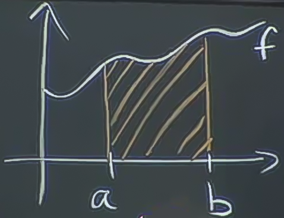
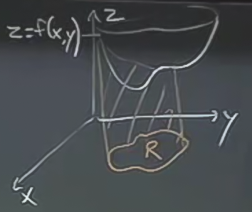
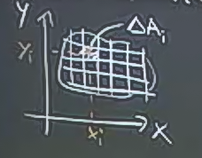
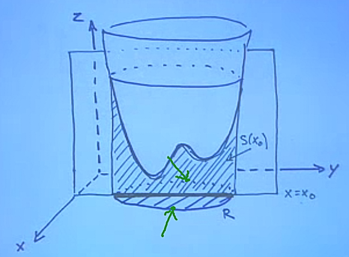
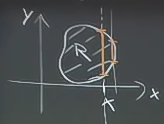
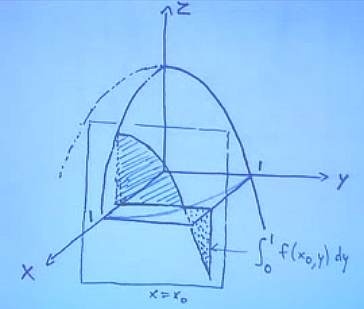
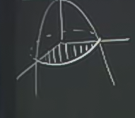
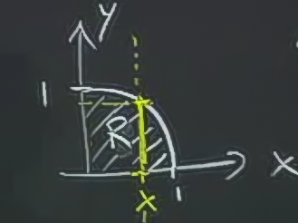
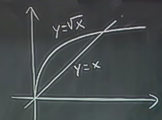
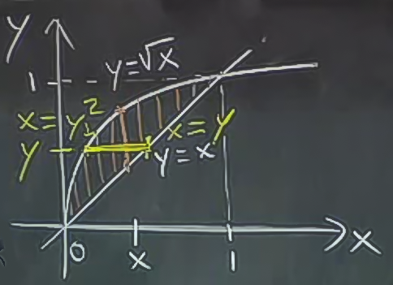

# Ders 16

Konumuz çift entegraller (double integrals). Bildiğimiz gibi şu şekilde bir
entegral aldığınızda

$$ \int_a^bf(x) \mathrm{d} x = \textit{f'in [a,b] arasındaki bölümdeki alanı} $$

anlamına gelir. 

Eğer $f$ negatif ise o zaman alan eksen altında yer alacaktır. 

İki değişkenli fonksiyonlar için benzer bir şey yapılabilir, 3 boyutlu uzayda
$z=f(x,y)$ fonksiyonumuzu grafiklediğimizi düşünelim, bu bir yüzey oluşturur,
yüzeyin altında kalan "hacim'' hesaplanabilir, ki bu hesap çift entegraller ile
mümkün olmaktadır.

Çift entegral için $f(x,y)$'miza bakıyoruz, sonra "üzerinden entegrasyon
işleminin yapılacağı'' bölge $R$'i seçiyoruz. Tek entegraldeki $[a,b]$ aralığı
gibi, ama bu sefer bölge bir çizgi değil, bir alan. Entegral şöyle gösteriliyor

$$ \int \int_R f(x,y) \mathrm{d} A $$

Formülde $dA$'nin anlamı "$A$ alanının bir parçası'' demek. Hesaplama vakti
gelince bu notasyonun daha somut halini göreceğiz.

Biraz daha matematiksel / teorik / detaylı (rigorous) olarak bakmak gerekirse;
tek entegralde $[a,b]$ aralığını ufak parçalara bölüp, o bölümlerin genişliğini
$f$ ile çarptığımızı ve sonuçları birbirine topladığımızı hayal ediyorduk.

Çift entegralde bu ufak kesit bir kenarı $\Delta x$ diğer kenarı $\Delta y$ olan
bir dikdörtgen alanı $\Delta A$. Sonra $\Delta A$'yi o noktadaki $f$ ile
çarpıyoruz, ve resimde çizgili gösterilen hacmi buluyoruz. Tüm entegral için bu
hacimleri topluyoruz. Entegral matematiksel olarak bir limit olarak
gösteriliyor, yani $\Delta A$ gitgide ufalıyor.

Toplam şöyle gösterilebilir

$$ \sum_i f(x_i,y_i) \Delta A_i $$

ve $\Delta A \to 0$ üzerinden limit alıyoruz, çift entegrali elde ediyoruz. 

Tabii ki entegral hesabını yaparken, tek ya da çift olsun, her seferinde ufak
parçalara bölüp, toplam ile uğraşmıyoruz. Entegral kavramının bize sağladığı
formülsel kolaylıkları kullanıyoruz.

Formülsel olarak çift entegral hesabı yapmak için "tarayıcı bir düzlem'' hayal
edebiliriz. Mesela alttaki resimde $yz$ düzlemine paralel düzlemin arkadan öne
doğru önüne geçerek her şeyi taradığını düşünelim, her düzlem $x=x_0$'a tekabül
ediyor, o zaman tarama sırasında farklı $x_0$'lar kullanıyoruz.

Tek bir $x_0$ "fotoğrafına'' bakarsak, o düzlemin üzerinde düşen $f$
yansımasının altındaki alanın normal (tek) bir entegral olarak
hesaplanabileceğini görebiliriz. Öne doğru her hareket bir $\Delta x$ ise,
oradan her ufak hareketin hacmini buluruz. Tüm bu ufak hacimleri toplarsak,
toplam hacmi elde ederiz. Fotoğraftaki her alana $S(x)$ adı verelim.

Yani 

$$ Hacim = \int S(x) \mathrm{d} x $$

Taramanın sınırları ise üstteki yeşil oklarla gösteriliyor, değerleri $x_{min}$,
$x_{maks}$ olarak gösterebiliriz, yani

$$ Hacim = \int_{x_{min}}^{x_{max}} S(x) \mathrm{d} x $$

$S(x)$'in kendisi de bir entegraldir, fakat $y$ değişkeni üzerinden, çünkü
fotoğraf sırasında $x$ sabit. 

$$ S(x) = \int f(x,y) \mathrm{d} y $$

$y$'nin alt üst limitleri $x=x_0$ olmak üzere (çünkü o kesit üzerindeyiz)
$R$'nin başlangıç ve bitiş değeridir. Yani

$$ S(x) = \int_{y_{min}(x)}^{y_{max}(x)} f(x,y) \mathrm{d} y $$

Bu önemli bir nokta: $y$'nin limit değerleri belli bir $x$ değerine
bağlı. Alttaki resimde bu daha iyi anlaşılabilir.

Üstteki resim önceki 3 boyutlu resmin bir kuşbakışı. Her kesit bir çizgi olarak
gözüküyor, eğer büyük kırmızı çizgi (kesit) üzerinde isek, başlangıç bitiş $y$
değerleri ile hesaplanan alan entegrali, küçük kırmızı çizgi (kesite)
üzerindekine nazaran değişik olacaktır.

$$ A = \int_{x_{min}}^{x_{max}} 
\bigg[ 
\int_{y_{min}(x)}^{y_{max}(x)} f(x,y) \mathrm{d} y 
\bigg] \mathrm{d} x
$$

Bu işleme tekrarlı entegral (iterated integral) ismi de veriliyor, çünkü
bir anlamda fonksiyonun üzerinden iki kere geçmemiz gerekiyor. 

Önemli bir nokta olduğu için tekrar vurgulayayım: Dış entegraldaki $x_{min},
x_{max}$ değerleri birer sayı sadece. İç entegraldaki $y_{max}(x)$ değerleri ise
dış entegraldaki $x$'e bağlı.

Örnek

$$ z = 1 - x^2 - y^2 $$

$$ 0 \le x \le 1 $$

$$ 0 \le y \le 1 $$

$$ \int_0^1 \int_0^1  1-x^2-y^2 \mathrm{d} y \mathrm{d} x $$

İlk önce iç entegrali hesaplayacağım, $x$ sabit kalacak. 

1) İç Entegral

$$
\int_0^1 (1-x^2-y^2) \mathrm{d} y
= \bigg[ y - x^2y - \frac{y^3}{3} \bigg]_0^1
$$

$$ = (1 - x^2 - \frac{1}{3}) - 0 = \frac{2}{3} - x^2$$

Son formül sadece $x$'in fonksiyonu, bu noktada artık $y$ kalmadı, çünkü $y$
entegrasyon değişkenimizdi. Ama hala $x$ var, çünkü kesit üzerindeki alan $x$'in
değerine bağlı.

2) Dış Entegral 

$$
\int_0^1 (\frac{2}{3} - x^2) \mathrm{d} x
= \bigg[ \frac{2}{3}x - \frac{1}{3}x^3 \bigg]_0^1 = \frac{1}{3}
 $$

Sonucu bulduk. 

İlk başta $dA$ notasyonunu kullanmıştık, $dA$ nereye kayboldu? $dA$ ufak kesit
dikdörtgen alan değil miydi? Hesabı yaparken $\mathrm{d} y \mathrm{d} x$ kullandık, $dy,dx$
dikdörtgenin kenarları gibi görülebilir, dikdörtgen alanı kenarlarının çarpımına
eşittir, o zaman

$$ \mathrm{d} A = \mathrm{d} y \mathrm{d} x $$

Peki niye $\mathrm{d} x \mathrm{d} y$ kullanmadık? Sıra istenilen şekilde seçilebilir, hangi
entegrali daha önce hesaplamak istediğimize göre önce $y$, sonra $x$, ya da
tam tersi kullanabiliriz. Bu seçim dikkatli yapılmalı, çünkü değişken
önceliği sınır değerlerini direk etkileyecek. 

Tabii teorik olarak öncelik farketmiyor, fakat pratikte bazen bir değişkene
göre entegrasyon diğerine göre çok zor olabiliyor, o zaman ötekinin
entegrasyonu öne alınıyor, vs.

Örnek

Üstteki örnekteki aynı fonksiyon, ama değişik bir bölge kullanalım. 

Yeni bölge çeyrek disk (quarter disk) olsun. $xy$ üzerindeki yansıması
şöyle. 

$$ R = \textit{çeyrek disk}  $$

$$ x^2 + y^2 \le 1 $$

$$ x \ge 0, y \ge 0 $$

Aynı entegral ama değişik sınır değerleri, çünkü ilk örneğin 3d resmine
bakarsak, $xy$ düzleminde bir çeyrek çember var, o çember içindeki bölgede
alan pozitif, dışında alan negatif. 

Sınır değerlerini hesaplarken, üstteki resme bakalım, $x$'e tekabül eden $y$ her
zaman 1'den küçük ve 0'dan büyük. Her $x$'e tekabül eden $y$'yi çember
formülünden bulabilirim

$$ x^2 + y^2 =1 $$

$$ y = \sqrt{1-x^2} $$

Entegre sınırlarım 0 ve $\sqrt{1-x^2}$. Böylece $y$ sınırlarının $x$'e
nasıl bağlı olduğunu görmüş olduk. 

Peki $x$'in sınırları nedir? 0 ve 1. 

$$ A = \int_0^1 \int_0^{\sqrt{1-x^2}}  (1-x^2-y^2) \mathrm{d} y \mathrm{d} x $$

Yani sınırları hesaplarken değişik sorular soruyoruz. Dış entegral için "ilk
kesit nerede, son kesit nerede?'' diye soruyoruz, iç entegral için "her $x$
değeri için alt $y$ üst $y$ nedir?'' sorusunu soruyoruz.

Hesabı yapalım. 

İç Entegral 

$$
\int_0^{\sqrt{1-x^2}}  (1-x^2-y^2) \mathrm{d} y
= [ y - x^2 - \frac{y^3}{3} ]_0^{\sqrt{1-x^2}}
$$

$$ =  (1-x^2)\sqrt{1-x^2} - \frac{(1-x^2)^{3/2}}{3}$$

$$ = \frac{2}{3} (1-x^2)^{3/2} $$

Dış Entegral

$$ \int_0^1 \frac{2}{3} (1-x^2)^{3/2} ud x $$

Yerine geçirme (subsitution) tekniğini kullanmamız lazım. 

$$ x = \sin\theta $$

$$ \mathrm{d} x = \cos\theta \mathrm{d}\theta$$

$$ (1-x^2)^{1/2} = \cos\theta $$

$$ 
\int_0^1 \frac{2}{3} (1-x^2)^{3/2} \mathrm{d} x = 
\int_0^{\pi/2} \frac{2}{3} \cos^3\theta \cos\theta \mathrm{d} \theta = 
\frac{2}{3} \int_0^{\pi/2} \cos^4\theta \mathrm{d}\theta
$$

En sondaki entegrali almak için çift açı (double angle) formüllerini
kullanmak lazım. 

$$ \cos^2\theta = \frac{1 + \cos 2\theta}{2} $$

O zaman 

$$ = 
\frac{2}{3} \int_0^{\pi/2} 
\bigg( \frac{1 + \cos 2\theta}{2} \bigg)^2 \mathrm{d}\theta 
$$

$$
= \frac{2}{3} \int_0^{\pi/2} (
\frac{1}{4} +  \frac{1}{2}\cos2\theta + 
\frac{1}{4}\cos^22\theta) \mathrm{d}\theta
$$

Biraz arap saçına döndü, ama hesabın sonunda sonuç $\pi/8$ çıkacak. 

Bu karışıklık aslında biraz zor bir yolu seçtiğimizin sinyali. Daha iyisi
kutupsal forma geçmemizdi. Bir sonraki derste önü göreceğiz. Bu derste daha
basit bir numara göreceğiz.

Entegrasyon sırasını değiştirebildiğimizi söylemiştik. $dy dx$ yerine $dx dy$
kullanacağız, ama sınır değerlerine dikkat, $dx dy$ değişimini yaptığımızda,
sınırları olduğu gibi alıp dışarıdan içeri taşıyamayız.

Tabii tüm sınırlar sabit değerler ise, o zaman değişim olur, mesela

$$
\int_0^1 \int_0^2 \mathrm{d} x \mathrm{d} y = \int_0^2 \int_0^1 \mathrm{d} y \mathrm{d} x
$$

Otomatik değişim burada işler çünkü üstteki resimde görüldüğü gibi, alan bir
dikdörtgen. Yani önce dikey, sonra yatay kesmemizle, önce yatay sonra dikey
kesmek "kazara'' aynı şey. Her zaman böyle olmayabilir.

Örnek 

$$ \int_0^1 \int_x^{\sqrt{x}} \frac{e^y}{y} \mathrm{d} y \mathrm{d} x $$

Bu örneği özellikle seçtik, çünkü bilindiği kadarıyla 

$$ \int \frac{e^y}{y} \mathrm{d} y $$

entegralinin analitik çözümü yoktur. Yani üstteki ifadeyi gördüğümüz anda
biliyoruz ki tıkandık. Hemen entegral değişimini düşünürüz, ve onun için,
sınır değerlerinin ne anlama geldiğini hesaplamaya başlarız. 

Bir sınır diyor ki $y$, $x$'ten $\sqrt{x}$'e gidiyor. Her iki fonksiyonun
grafiğini çizeriz. 

Bölgeyi anlamak için

Her $y$ için $x$ sınırları ne olur? 

Sarı çizgi örnek bir $y$ kesiti için $x$ başlangıç sınırının $y$'den
$y^2$'e gittiğini gösteriyor. $y$'nin sınırları ise dikey olarak en alt ve
en üst, ki bu değerler 0 ve 1. 

$$ = \int_0^1 \int_y^{y^2}  \frac{e^y}{y} \mathrm{d} x \mathrm{d} y $$

Gördüğümüz gibi entegral sıra değişimi küt diye yapılabilecek bir şey
değil. 

İç

$$
\bigg[ \frac{e^y}{y}x \bigg]_{x=y^2}^{y} =  e^y - e^yy
$$

Dış

$$ \int_0^1 e^y - ye^y \mathrm{d} y  $$

Biliyoruz ki 

$$ (ye^y)' = e^y + ye^y $$

$$ (-ye^y)' = -e^y - ye^y $$

Son ifade neredeyse dış entegraldekine eşit, sadece $e^y$'in işareti
istediğimiz gibi değil, onu telafi etmek için biz dışarıdan $2e^y$
eklersek, eksi işaret artıya döner. O zaman entegral 

$$ \bigg[ -ye^y + 2ey \bigg]_0^1 $$

$$ = e - 2 $$

