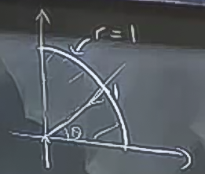
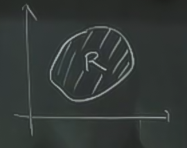
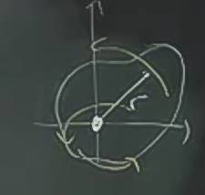
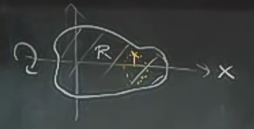
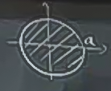
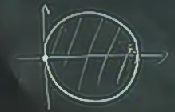

# Ders 17

Önceki derste 

$$ \int \int (1-x^2-y^2) \mathrm{d} A $$

$$ x^2+y^2 \le 1 $$

$$ x,y \ge 0 $$

entegralini hesapladık, fakat kullandığımız yöntem biraz karmaşıklığa yol
açtı. Daha iyi bir yöntem kutupsal forma geçmektir. 

Hatırlarsak $x,y$ kordinat sisteminde çift entegral için entegrasyon alanını
yatay, dikey şekilde parçalara ayırmıştık, $dA = \mathrm{d} y \mathrm{d} x$ haline
gelmişti. Kutupsal formda

$$ \int \int  ... \mathrm{d} r \mathrm{d} \theta$$

şeklinde bir form olur, önce $r$ üzerinden entegrasyon en kolayı. Bu
demektir ki $\theta$'yi sabitleriz, ve $r$ üzerinde hareket ederiz. 

Birim disk örneğinde bu hareket basit, $r=0$'dan başlanır, ve 1 değerine
gelinceye kadar hareket edilir. $\theta$ için 0'dan başlanır, üstteki alana
göre, $\pi/2$'ya gelinceye kadar hareket edilir. Sınırlar şöyle olur:

$$ \int_0^{\pi/2} \int_0^1  ... \mathrm{d} r \mathrm{d} \theta$$

Fakat, dikkat, bu önemli bir nokta, $dA$ büyüklüğü $\mathrm{d} r \mathrm{d} \theta$'ya eşit
*değildir*.

Üstteki resimdeki içi karalanmış ufak dikdörtgeni düşünelim, dikdörtgenin
kenarlarından biri biraz eğimlidir (çemberin parçası olduğu için) fakat kenarlar
küçüldükçe bu ufak alan dikdörtgen olarak görülebilir. Neyse, kenarların biri
$\Delta r$ (bu kolay), diğeri? Öteki kenar $\Delta \theta$ değil, çünkü o kenar
çemberin bir parçası, o zaman $r \Delta \theta$.

Bu demektir ki kenarları sonsuz küçülttüğümüz zamanda bile 

$$ dA = r \mathrm{d} r \mathrm{d} \theta $$

olacak. Entegral

$$ \int_0^{\pi/2} \int_0^1  f \mathrm{d} r \mathrm{d} \theta$$

$$ f =  (1-x^2-y^2)$$

Kutupsal forma tabii ki mekanik bir şekilde

$$ x = r\cos\theta $$

$$ y = r\sin\theta $$

eşitliklerini alıp $f$ içinde yerlerine koyabiliriz, fakat biraz dikkatli
bakarsak $-x^2-y^2$ aslında $-(x^2+y^2)$ ve $r^2=x^2+y^2$ olduğuna göre, bunu
kullanabiliriz

$$ f =   1-r^2 $$

Yani

$$ \int_0^{\pi/2} \int_0^1  1-r^2 \mathrm{d} r \mathrm{d} \theta$$

$$ \int_0^{\pi/2}  \bigg[ \frac{r^2}{2} - \frac{r^4}{4} \bigg]_0^1 \mathrm{d} \theta$$

$$
\int_0^{\pi/2} \frac{1}{4} \mathrm{d} \theta =
\frac{1}{4} \frac{\pi}{2} = \frac{\pi}{8}
$$

Önceki derse göre daha kolay oldu. 

Çift entegraller ne işe yarar? 

Önceki derste çift entegralleri hacim hesaplama bağlamında işledik. Fakat
hacim hesabı tek uygulama alanları değil, aynen tek değişkenli entegralin
sadece alan hesaplamada kullanılmadığı gibi. Çift entegralleri
belli bir bölgedeki fonksiyonları toplama olarak görmek daha iyi [1], belki bu
fonksiyonun o bölgedeki ortalamasını hesaplamak istiyoruz, vs. Bazı
kullanımları listeleyelim:

Uygulamalar 

1) Belli bir bölge $R$'nin alanını hesaplamak. 

Bazı durumlarda bu hesap tek entegral ile yapılabiliyor, ama çift entegral ile
daha kolay. Şöyle

$$ Alan(R) = \int \int_R 1 \mathrm{d} A $$

Eğer çift entegralleri illa hacim olarak görmek istiyorsak, üstteki hesap
yüksekliği 1, baz alanı $R$ olan bir "hacmi'' hesaplıyor. Hacim = baz alan X
yükseklik'tir, ama yükseklik 1 olduğu için, üstteki hesap aynı sadece baz alanın
ne olduğunu hesaplar! Güzel bir cinlik değil mi?

Ya da, diyelim ki yassı / düz bir objenin kütlesini hesaplamak istiyoruz, ve
yoğunluk $\delta = \textit{kütle} / \textit{birim alan}$ olarak verilmiş. Her
ufak parça için kütle

$$ \Delta m = \delta \cdot \Delta A $$

Tüm kütleyi üstteki ufak kütleleri toplayarak elde edebiliriz. 

$$ \int \int_R \delta \cdot \mathrm{d} A $$

Eğer yoğunluk objenin her noktasında aynıysa, $\delta$ değişkenini
formülden çıkartabiliriz tabii, ama her $x,y$ noktasında değişme durumu var
ise, üstteki entegral hesabı güzelce yapacaktır.

2) $R$ bölgesinde $f$'in ortalaması 

Bir ortalama hesabını normalde, mesela belli sayılar için, nasıl
yapacağımızı biliyoruz. Sayıları alıyoruz, toplamlarını kaç sayı olduğuyla
bölüyoruz. Benzer şekilde, içinde olduğunuz odanın ortalama sıcaklığını
hesaplamak istesek bir sürü noktada sıcaklık ölçümü alıp, onları toplayıp
bölmemiz gerekir. Fakat bu sıcaklık ölçümü için potansiyel olarak sonsuz
tane ölçüm olabilir. Bu hesabın matematiksel şekli ölçüm fonksiyonunu alan
üzerinden entegre etmek, sonra alan büyüklüğüyle bölmektir. 

Notasyon

$$ \textit{f'nin ortalaması} = \bar{f} $$

$$ \bar{f} = \frac{1}{Alan(R)} \int \int f \mathrm{d} A $$

2a) Üstteki ortalama birörnek (uniform) bir ortalama, her noktaya
aynı önemi veriyoruz. Eğer bazı noktalara daha fazla ağırlık vermek
istersek, ağırlıklı ortalama (weighted average) hesabı yapabiliriz.

$$ 
\textit{f'nin ağırlıklı ortalaması} = \frac{1}{\textrm{Kütle}(R)} 
\int \int_R f \ \delta \mathrm{d} A
$$

Ağırlıklı ortalama kütle merkezi (center of mass) hesaplarında ise
yarar. Belki bir objenin bazı tarafları diğerlerine göre daha ağır, bu
objenin kütle merkez hesabı bunu hesaba katmalı. 

2 Boyutta kütle merkezi $(\bar{x},\bar{y})$, 

$$  \bar{x}  = \frac{1}{\textrm{Kütle}} \int \int_R x \delta \mathrm{d} A  $$

$$  \bar{y}  = \frac{1}{\textrm{Kütle}} \int \int_R y \delta \mathrm{d} A  $$

3) Dönme direnci (moment of intertia): Bu kavram bir objenin dönüşe
karşı gösterdiği dirençtir, aynen itilmeye karşı direnişin kütle olduğu
gibi. Bir objeyi ne kadar ileri fırlatabileceğim onun kütlesine bağlıdır,
onu ne kadar döndürebileceğim dönme direncine bağlıdır. 

DD hesabı için bir eksen tanımlanması gereklidir, çünkü "neyin etrafında
dönüleceği'' ancak bir eksene göre anlamlıdır. Hesap nasıl yapılır? 

Ana fikir kinetik enerjiyi kullanmak. Eğer noktasal bir kütle $m$ hız $v$
ile hareket ediyorsa, kinetik enerji $1/2 mv^2$. 

İtmek yerine kütleyi bir eksen etrafında $r$ uzaklıkta $\omega$ rotasyonel
hızda dönecek şekilde hareket ettirirsem,

$$ \frac{1}{2}mv^2 = \frac{1}{2}mr^2\omega^2  $$

Dönme direncinin itilmeyle olan bağlantısı formülde gözüküyor, $m$ itilme
formülünde $v^2$'in katsayısı. $mr^2$ ise $\omega^2$'nin katsayısı.

Fakat bu basit bir noktasal kütle için. Daha çetrefil bir objeyi döndürmek
istiyorsak, bu objenin tüm DD'si objenin içindeki tüm noktasal DD'lerin
toplamı olacaktır. 

Yoğunluğu $\delta$ olan bir obje için 

$$ \Delta m = \delta \Delta A $$

DD

$$ \Delta m r^2 = r^2 \delta \Delta A $$

Üstteki parçaları bir bölge üzerinden toplarsam, tüm DD'yi bulurum. Nihai
formül

$$ I_0 = \int \int_R r^2 \delta \mathrm{d} A $$

Rotasyonel kinetik enerji $\frac{1}{2}I_0 \omega^2$

Peki diğer tür dönme hareketleri? Mesela objeyi $x$ ekseni etrafında da
döndürebilirdim. 

Hesap benzer kavramları kullanır, dönme eksenine olan uzaklık $r$
kullanılır. Üstteki resimde kırmızı noktayı ele alalım, uzaklığı kırmızı okla
gösteriliyor. Bu uzaklık aslında $|y|$ değil midir? $r^2$ lazım, o zaman $y^2$
kullanırız.

$$ I_x = \int \int y^2 \delta \mathrm{d} A $$

Örnek

$a$ yarıçapındaki bir dışkı orijin etrafında döndürmek istiyoruz 

Yoğunluk birörnek ve $\delta = 1$. Dönme direnci nedir? 

$$ I_0 = \int \int r^2 \mathrm{d} A $$

$r$ ne? İnsanın içinden hemen $a$ demek gelebilir, ama değil. Unutmayalım, "her
nokta'' için DD hesaplıyoruz, yani disk içindeki her nokta dikkate alınmalı, ve
bu noktaların hepsi $a$ uzaklığında değiller, uzaklıkları $\le a$.

Kutupsal kordinata geçmek iyi olur mu? Evet. 

$$ = \int_0^{2\pi} \int_0^a r^2 r \mathrm{d} r \mathrm{d}\theta $$

$$ = 2\pi \frac{a^4}{4} = \frac{\pi a^4}{2} $$

Ya orijin yerine üstteki yeşil noktada etrafında döndürmek isteseydim? Hani
frizbiyi alıp parmağınız etrafında döndürdüğünüzde olduğu gibi.

Bu hesap için iki seçenek var. Eğer kordinat sistemi olduğu gibi kalırsa, işler
biraz zor. Ama sistemi değiştirip yeşil noktayı yeni orijin haline getirirsek,
işler biraz daha kolay.

Formül yine aynı

$$ I_0 = \int \int r^2 r \mathrm{d} r \mathrm{d}\theta $$

Sınırlar nasıl hesaplanır? 

[Yeni] orijinden $i\sin$ gönderdiğimizi düşünelim, bu ışınlar çemberden nerede
dışarı çıkar? Yani işaretli yerin uzunluğu nedir? $2a \cos\theta$. Peki
$\theta$ sınırları nedir? $-\pi$ ile $\pi$, yani $y$ ekseninin tamamen sağ
tarafı. "Ama y ekseni üzerindeyken çembere girip çıkmıyoruz'' düşüncesi
akla gelebilir, fakat orada teğet halindeyiz, yani sınırlar doğru. 

$$ I_0 = \int_{-\pi/2}^{\pi/2} \int_0^{2a \cos\theta} r^2 r \mathrm{d} r \mathrm{d}\theta $$

İç

$$ = \bigg[ \frac{r^4}{4} \bigg]_{0}^{2a \cos\theta} =
4a^4 \cos^4\theta
$$

Dış

$$ I_0 = \int_{-\pi/2}^{\pi/2} 4a^4 \cos^4\theta \mathrm{d}\theta $$

Ders Notları 3B içinde bu formülün çabuk hesabı var. Sonuç

$$  = \frac{3}{2} \pi a^4 $$

Yani bir frizbiyi ortasından döndürmek yerine kenar noktası etrafında
döndürmek 3 kat daha zor. 

Kaynaklar

[1] Bu konu hakkında ek bölümdeki *Entegralleri Nasıl Düşünelim*
yazısının okunması da tavsiye edilir.

