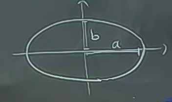
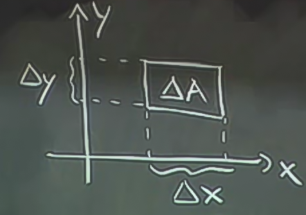
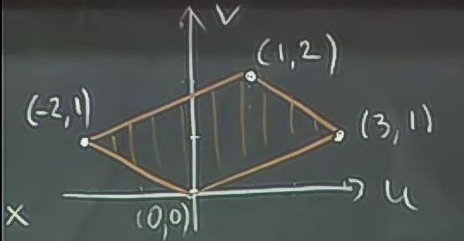
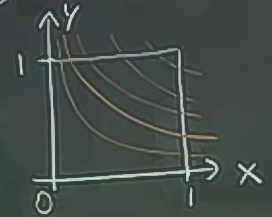
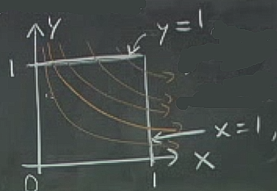
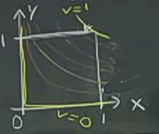
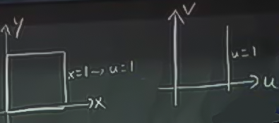
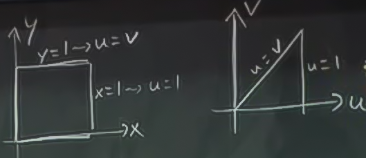
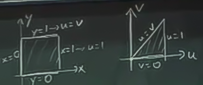

# Ders 18

Çift Entegrallerde Değişken Değişimi 

Örnek 

Bir elipsin alanını bulmak istediğimizi düşünelim. 

$$ \bigg(\frac{x}{a}\bigg)^2 + \bigg(\frac{y}{b}\bigg)^2 = 1 $$

Formül çember formülüne benziyor, tek fark $x,y$ kordinatları farklı
şekillerde tekrar ölçeklenmişler (rescale). Elipsin alanını hesaplayalım. 

Diyelim ki 

$$ \int \int \mathrm{d} x \mathrm{d} y $$

olarak başladık. Ve

$$ \bigg(\frac{x}{a}\bigg)^2 + \bigg(\frac{y}{b}\bigg)^2 < 1 $$

olmak üzere $x,y$ üzerinden entegral alacağız. Sınırları ayarlamak, vs. gibi
işlere hemen girişebiliriz, fakat bu iş arap saçına dönebilir. Bu işi yapmanın
en iyi yolu da değildir.

Bu şekil bir çember olsaydı hemen kutupsal kordinata geçebilirdik, fakat üstteki
durumda bunu hemen yapamayız. Fakat elips kenarlarından bir basılmış çemberdir,
o zaman çemberi $a,b$ ile tekrar ölçeklersek, elips problemimizi bir çember
problemine indirgeyebiliriz.

$$ \frac{x}{a} = u, \frac{y}{b} = v $$

O zaman alan şöyle tanımlanabilir 

$$ \int \int_{u^2 + v^2 < 1} \mathrm{d} x \mathrm{d} y $$

Ama hala $dx,dy$ ile ne yapacağımıza karar vermedik. 

$$ \mathrm{d} u = \frac{1}{a}dx,dv = \frac{1}{b} \mathrm{d} y $$

$$ \mathrm{d} u \mathrm{d} v = \frac{1}{ab} \mathrm{d} x \mathrm{d} y $$

$$ \mathrm{d} x \mathrm{d} y = ab \mathrm{d} u \mathrm{d} v $$

Entegrale sokarsak

$$ = ab \int \int_{u^2 + v^2 < 1} \mathrm{d} u \mathrm{d} v $$

$$ = ab \cdot \textit{birim diskin alanı} $$

$$ = \pi ab $$

Üstteki örnekte $u,v$ ile $x,y$ arasındaki ilişki oldukça basitti. Eğer ilişki
daha çetrefil ise neler yapmamız gerektiğini alttaki örnekte göreceğiz. Genel
olarak yapmaya çalıştığımız ölçekleme faktörünün (scaling factor) ne olduğunu
bulmak, ki $\mathrm{d} x \mathrm{d} y$ ve $\mathrm{d} u \mathrm{d} v$ arasındaki geçiş mümkün olsun.

Örnek 

$$ u = 3x - 2y $$

$$ v = x + y $$

Niye üstteki gibi $u,v$ kullanılmış? Belki entegre edilen fonksiyonu, belki
de sınırları basitleştirmek istiyoruz ($x,y$ için $A$, $u,v$ versiyonu için
$A'$ kullanalım). 

$dA = \mathrm{d} x \mathrm{d} y$, ya da $dA' = \mathrm{d} u \mathrm{d} v$ 

Fakat bir problem var. Alan hesabında entegralin ufak alan parçalarını
topladığını söylemiştik. 

Problem şöyle, üstteki dikdörtgen, bu örneğin dönüşüm formüllerine göre $u,v$
bağlamında alttaki gibi bir şekle dönüşecek, yani paralelogram
olacak. Parallelogram olacağını biliyoruz çünkü değişim formülleri lineer.

Bu tür değişimler matrisler üzerinden gösterilebilir bu arada, çünkü
matrislerin, bir transformasyon matrisinin resimlere ne yapabileceğini
biliyoruz, yatırıp, yassılaştırma yapabiliyorlar mesela, açılar,
büyüklükler tamamen değişiyor vs. 

Sonsuz küçüklükte olmasa da, neler olacağını daha iyi görmek için her
kenarı 1 uzunluğunda, alanı 1 olan kareye bakalım

ve bu karenin her noktasını $u,v$ formülleriyle dönüştürürsek

elde edilir. Hakikaten bu bir paralelogram. Alan hesaplamak için
determinant hesabı yaparız

$$ A' = 
\left|\begin{array}{rr}
3 & 1 \\
-2 & 1
\end{array}\right| = 5
$$

$x,y$ formundaki 1 büyüklüğündeki alan, 5 katına çıktı. Yani 

$$ dA = 5 \mathrm{d} A' $$

$$ du \mathrm{d} v = 5 \mathrm{d} x \mathrm{d} y $$

O zaman entegrasyon sırasında 

$$ \int \int ... \mathrm{d} x \mathrm{d} y = \int \int ..  \frac{1}{5} \mathrm{d} u \mathrm{d} v $$

haline gelmeli. 

Genel Durum 

$$ u = u(x,y) $$

$$ v = v(x,y)  $$

$$ \Delta u \approx u_x \Delta x + u_y \Delta y  $$

$$ \Delta v \approx v_x \Delta x + v_y \Delta y  $$

Matris formunda 

$$ 
\left[\begin{array}{r}
\Delta u \\
\Delta v 
\end{array}\right] \approx 
\left[\begin{array}{rr}
u_x & u_y \\
v_x & v_y
\end{array}\right] 
\left[\begin{array}{r}
\Delta x \\
\Delta y 
\end{array}\right] 
$$

Demek ki kenarları $\Delta x,\Delta y$ olan dikdörtgen transform edildiğinde,
kenarları $\Delta u,\Delta v$ olan paralelogramın şekli kısmı türevlere bağlı,
çünkü üstte transform eden matrisin içinde kısmi türevler var, ve kısmi
türevlerin değerleri belli $x,y$ noktalarında hesaplandığına göre,
transformasyon da belli $x,y$ noktalarına da bağlı. Eğer cebirsel olarak
türetseydik, alan büyüklüğü ölçeklenmesinin (üstte 5 olan) üstteki transform
matrisinin determinantı olduğunu görürdük.

$$< \Delta x,0 > \to < \Delta u, \Delta v > \approx < u_x \Delta x, v_x\Delta x > $$

$$ < 0, \Delta y > \to < \Delta u,\Delta v > \approx < u_y\Delta y,v_y \Delta y > $$

Eğer üstteki iki formülde sağ taraftaki vektörlerin determinantını alırsak,
ki o vektörler paralelogramın kenarlarıdır, o zaman 

$$ Alan' =  det(..)\Delta x \Delta y  $$

bulurduk. 

Değişkenin değişiminin Jacobian'ı denen bir kavramdan bahsedelim şimdi: 

$$ J = \frac{\partial (u,v)}{\partial(x,y)} $$

Bu çok garip bir notasyon. $\partial$ işareti kullanıyorum ama bu çerçevede
kısmi türev aldığım anlamında değil, $\mathrm{d} u \mathrm{d} v$ ve $\mathrm{d} x \mathrm{d} y$ arasındaki
oranı hesapladığımı bana hatırlatması için.

$$ J =  \left|\begin{array}{rr}
u_x & u_y \\
v_x & v_y
\end{array}\right|
$$

O zaman 

$$ du \mathrm{d} v = |J| dx \mathrm{d} y =
\bigg|\frac{\partial (u,v)}{\partial(x,y)}\bigg |
\mathrm{d} x \mathrm{d} y
$$

$|J|$ ifadesi Jacobian'ın, yani determinant hesabının mutlak değeri (absolute
value) anlamında. Eğer $J$ sonucu mesela -10 çıkarsa, biz 10 kullanacağız.

Örnek 

Kutupsal forma geçerken transformasyonun $r \mathrm{d} r \mathrm{d} \theta$ gerektirdiğini
bir örnek üzerinden görmüştük. Şimdi bu yeni metotu kullanarak aynı sonucu
bulmaya çalışalım. 

$$  x= r \cos \theta $$

$$  y= r \sin\theta $$

Değişken değişiminin Jacoban'ı

$$ J = \frac{\partial (x,y)}{\partial(r,\theta)}  =
\left|\begin{array}{rr}
x_r & x_\theta \\
y_r & y_\theta
\end{array}\right|   =
\left|\begin{array}{rr}
\cos\theta & -r\sin\theta\\
\sin\theta & r\cos\theta
\end{array}\right|
$$

En sağdaki determinantı hesaplayınca

$$ = r\cos^2\theta + r\sin^2\theta $$

$$ = r $$

O zaman 

$$ dx \mathrm{d} y = |r| dr \mathrm{d} \theta $$

$r$ her zaman pozitif olduğuna göre tam değer işaretine gerek yok

$$ = r \mathrm{d} r \mathrm{d} \theta$$

Yorum 

$u,v$ örneğinde hedef $J$ hesabının bölüm kısmındaydı, şimdi hedef
$r,\theta$ bölen kısmında. Bu problem olur mu? 

Olmaz, çünkü 

$$ J = \frac{\partial (u,v)}{\partial(x,y)} \cdot
\frac{\partial (x,y)}{\partial(u,v)} = 1
$$

yani $u,v \to x,y$ yönünde transformu yapan Jacobian ile $x,y \to u,v$ yönünde
transform yapan Jacobian birbirinin tersi. Bu sebeple transformu yaparken bu
yönlerden hangisini hesapladığınız önemli değil, en kolayı hangisiyse onu
hesaplarız, sonra eğer ters yön gerekiyorsa $1 / sonuc$ ile istediğiniz sonucu
elde ederiz. Zaten dikkat edilirse, $u,v$ transformunda $|J|$, $dx,dy$ yanında
çıktı, üstteki son örnekte $r$, $dr,d\theta$ yanında.

Örnek

$$ \int_0^1 \int_0^1 x^2y \mathrm{d} x \mathrm{d} y  $$

Aslında bu hesabı olduğu gibi yapmak çok kolay. Fakat biz işi zorlaştırarak,
değişken değişimi

$$ u =x  $$

$$ v = xy $$

sonrası hesabı yapmaya uğraşacağız. Bir değişken değişimi entegre edilen, ya da
sınır ifadelerini basitleştirmek için yapılır, ama üstteki değişim bunları
hiçbirini yapmıyor. Sadece örnek amaçlı bu zor yolu seçtik zaten.

Önce neyin entegre edildiğini bulalım. 

1) Alan öğesini bulalım, Jacobian'ı kullanalım. 

$$ \frac{\partial (u,v)}{\partial(x,y)}  = 
\left|\begin{array}{rr}
1 & 0 \\
y & x
\end{array}\right| = 
x
$$

Yani

$$ \mathrm{d} u \mathrm{d} v = x \mathrm{d} x \mathrm{d} y $$

Tabii $x$'in tam değeri olacak, ama tanımladığımız sınır içinde zaten $x$
pozitif. 

2) Entegre edilen formülün $u,v$ içeren hali 

$$ x^2y dx \mathrm{d} y =  x^2y  \frac{1}{x} \mathrm{d} u \mathrm{d} v = 
xy \mathrm{d} u \mathrm{d} v = 
v  \mathrm{d} u \mathrm{d} v 
$$

O zaman 

$$ \int \int_{???} v \mathrm{d} u \mathrm{d} v $$

Yeni sınırları bulalım. Üstteki entegrale bakalım, iç entegral $u$
değişiyor, $v$ sabit kalıyor demektir. O zaman $v=xy$ sabit demektir, her
sabit $xy$ için alttaki resimdeki kırmızı çizgilerden biri düşünülebilir

İç entegralin sınırlarını bulmak için su soruyu cevaplamak gerekir, sabit bir
$v$ için (çünkü iç entegralde o sabit), $u$ değerleri hangi iki üç değer
arasında hareket eder, ve entegrasyon bölgeme neresinden girip, neresinden
çıkarım?

Cevap için tek bir kırmızı çizgiye bakarım, onun üzerinde giderken bölgeye
bir taraftan girip, öteki taraftan çıkıyor olurum. 

Bölgenin en üst sınırını ele alalım, $y=1$. 

$$ y = \frac{v}{u}  $$

$$ u = v $$

O zaman $u$, $v$ ile aynı, $y=1$ iken hem $u,v$ 1'e eşit.

Sınırın en üstünden başlıyorum, $u$, $v$ ile aynı, kırmızı çizgiyi takip
ediyorum, ediyorum, aşağı doğru inerken $u$ büyüyor. Sağ kenardan dışarı
çıkıyorum. Sağ kenarda $x=1$, o zaman $u = 1$. Demek ki sınır

$$ \int \int _v^1 v \mathrm{d} u \mathrm{d} v $$

Dış Entegral 

$v$'nin en az, en fazla değerleri alttaki resimde sarı ile çizili

$$ \int_0^1 \int _v^1 v \mathrm{d} u \mathrm{d} v $$

Bu bizi bayağı zorladı. Ama eğer bu yöntem takip edilecekse, bazı tavsiyeler,
$u,v$ bağlamında kesitlerin ne olduğunu bulmak, sonra her birinin ayrı ayrı
üzerinde kalıp bölgeye nereden girilip çıkıldığına bakmak.

İşe yaramazsa, o zaman tüm bölge $u,v$ olarak çizilmeye
uğraşılabilir. Teker teker 

$u,v$ bağlamında bir üçgen elde edildi, ve bu üçgen uygun şekilde kesilerek çift
entegral hesaplanabilir.

Örnek

$e^{-x^2}$ Nasıl Entegre Edilir? 

$$ 
\int_{-\infty}^{\infty} e^{-x^2} \mathrm{d} x 
\qquad (1) 
$$

ifadesi özellikle olasılık matematiğinde çokça görülen bir ifadedir. Bu
hesabı yapmak için kutupsal kordinatlar kullanacağız. 

Şimdi üstteki ifadeyle alakalı şu ifadeye bakalım. 

$$ \int_{-\infty}^{\infty} \int_{-\infty}^{\infty} e^{-x^2-y^2} \mathrm{d} x \mathrm{d} y $$

İddia ediyorum ki bu son ifade (1)'in sadece karesi, yani (1)'in kendisiyle
çarpımı. Niye böyle? Çünkü $e$ ifadelerini çarpım olarak gösterirsek

$$
\int_{-\infty}^{\infty} \underbrace{\int_{-\infty}^{\infty} e^{-x^2} e^{-y^2} 
\mathrm{d} x} \mathrm{d} y
$$

çift entegral içinde işaretlenen blokta yer alan $e^{-y^2}$ $x$'ten
bağımsız, o zaman bloktaki entegralin dışına alınabilir. Yani şöyle olabilir

$$
\int_{-\infty}^{\infty} e^{-y^2} \int_{-\infty}^{\infty} e^{-x^2} \mathrm{d} x \mathrm{d} y
$$

Devam edelim: üstteki iç entegral (1) ifadesi değil mi? Evet. Şimdi bir
ilginç durum daha ortaya çıktı, 

$$
\int_{-\infty}^{\infty}  e^{-y^2} 
\underbrace{\int_{-\infty}^{\infty} e^{-x^2} \mathrm{d} x} \mathrm{d} y
$$

şimdi de işaretlenen blok $y$ entegraline göre sabit, o da ikinci entegralin
dışına çıkarılabilir! (1) yerine $I$ kullanırsak

$$ I \int_{-\infty}^{\infty}  e^{-y^2} \mathrm{d} y $$

İçinde $y$ içeren entegral nedir? O da $I$'dir! Niye, çünkü bu ifade 
(1)'in içinde $y$ olan versiyonundan ibaret. O zaman 

$$ I \cdot I = I^2 $$

Tüm bu taklaları niye attık peki? Çünkü çift entegralli ifadenin entegralini
almak daha kolay, eğer onu hesaplarsak, sonucun karekökünü aldığımız anda $I$'yi
bulmuş olacağız.

O zaman ifadeyi hesaplayalım, 

$$
I^2 = \int_{-\infty}^{\infty} \int_{-\infty}^{\infty} e^{-x^2-y^2} \mathrm{d} x \mathrm{d} y
$$

Başta söylediğimiz gibi kullanacağımız numara kutupsal forma geçmek. Entegralın
sınırlarına bakalım, tüm $x$ ve tüm $y$ ekseni üzerinden entegral
alıyoruz. Kutupsal formda bu $r$'nin 0'dan sonsuza ve $\theta$'nin 0'dan
$2\pi$'a gitmesi anlamına geliyor.

$$ r^2 = x^2 + y^2 $$

Peki $e^{-x^2-y^2}$ kutupsal formda nedir? 

$$ e^{-x^2-y^2} = e^{-(x^2+y^2)} = e^{-r^2} $$

Entegralı yazalım

$$
\int_{0}^{\infty} \int_{0}^{2\pi} e^{-r^2} r \mathrm{d} \theta \mathrm{d} r 
\qquad (2)
$$

Niye entegral sırasında $\theta$'yi önce yazdım? Çünkü entegral içindeki
ifadede $\theta$'ya bağlı hiçbir terim yok, o zaman iç entegral bana sadece
$2\pi$ verir. Geriye kalanlar

$$=  2\pi \int_{0}^{\infty} e^{-r^2} r \mathrm{d} r $$

Bu entegral çok daha kolay. Yerine koyma (subtitution) tekniği ile bu
problemi çözebiliriz. 

$$ u = -r^2 $$

$$ du =  -2r \mathrm{d} r$$

$$=  2\pi \int_{0}^{\infty} e^u \frac{-1}{2} \mathrm{d} u $$

$$=  -\pi \int_{0}^{\infty} e^u \mathrm{d} u $$

$$=  -\pi  e^u  \bigg|_{0}^{\infty} = -\pi  e^{-r^2}  \bigg|_{0}^{\infty} $$

$$ = \pi $$

Bu sonuç $I^2$. Eğer $I$ değerini istiyorsak, karekök almalıyız, yani
aradığımız sonuç $\sqrt{\pi}$. 

Tek değişkenli bir problemi aldık ve çift değişkenli problem haline
getirdik. İşleri kolaylaştıran (2) denklemindeki $r$ değişkeni oldu, onun
sayesinde yerine geçirme işlemi çok kolaylaştı, ve sonuca ulaştık. 

Kaynaklar

[1] Christine Breiner, {\em Integral of $exp(-x^2)$ | MIT 18.02SC Multivariable
  Calculus, Fall 2010}, [http://www.youtube.com/watch?v=fWOGfzC3IeY](http://www.youtube.com/watch?v=fWOGfzC3IeY)

