# Ders 19

Konumuz vektör alanları (vector fields) ve çizgi entegralleri (line
integrals). Bundan önceki derslerde çift entegral (double integral)
konusunu işledik, fakat o tür entegraller çizgi entegrallerinden tamamen
farklıdır, yani bu dersi takip ederken çift entegraller ile bağlantıları
düşünmemek daha iyi olur, kafalar karışmasın. 

Vektör Alanları

Vektör alanları bir vektördürler aslında, diyelim ki $\vec{F}$

$$ \vec{F} = M\hat{i} + N\vec{j} $$

Farklı olan $M,N$ kendilerinin $x,y$'nin bir fonksiyonu olmalarıdır. Bu
demektir ki kordinat sistemindeki her $x,y$ kombinasyonu için değişik bir
vektör olacaktır. Bir mısır tarlasında her noktada mısır vardır, vektör
alanında her noktada bir vektör vardır [hoca bu analojiyi mısırlar uzun,
yönleri olan şeyler olduğu için kullanıyor herhalde]. Daha önce
$\vec{r}(t)$ bağlamında $t$ değişkenine bağlılığı gördük, fakat o tek
değişken idi, zaten bir eğriyi vektör ile temsil etmek için öyle olması
gerekiyordu, burada birden fazla değişken $x,y$'ye bağımlılık var. 

Bu kavram bir sıvı, bir rüzgar içindeki akış vektörlerini temsil etmek için
kullanılabilir mesela. Ya da kuvvet alanı (force field) kavramı -- bu
kavram Star Wars filminden bir kavram değil. Yeryüzünde elimizde bir cismi
herhangi bir yerde tuttuğumuzda onun üzerinde etki eden bir kuvvet vektörü
var, bu vektör her noktada değişik, ve tüm bu vektörlerin toplamı bir
kuvvet alanı oluşturuyorlar, ki bu alan bir vektör alanıdır. 

Biz bu derste konuya pür matematiksel olarak bakıyoruz, sadece arka
plandaki bu fiziksel bağlantıyı motivasyon açısından aklımızda
tutabiliriz. 

Önce çizimden başlayalım

Örnek

$$ \vec{F} = 2\hat{i} + \hat{j} $$

Tam $x,y$'ye bağlantıdan bahsetmiştik, bağlantısız bir tane verdik! Ama
örneği şöyle görebiliriz, bu alan her $x,y$ için aynı vektöre sahip. Yani
yine $x,y$'yi merkez alarak düşünüyoruz, sadece vektörün her noktada aynı
olduğunu söylemiş oluyoruz.

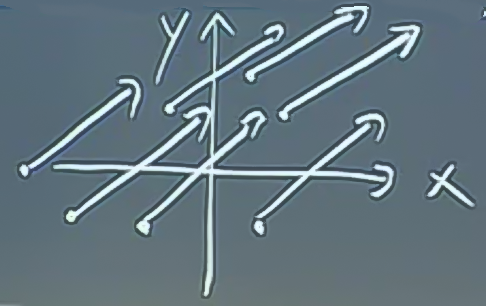

Örnek

$$ \vec{F} = x\hat{i} $$

Y-ekseni üzerinde, yani $x$'in sıfır olduğu noktada (zaten hiç $y$ yok)
vektör sıfır büyüklüğünde. Diğer noktalarda vektör yatay, $x$ büyüdükçe, ya
a eksi yönde küçüldükçe, sağa ya da sola doğru vektörün büyüklüğü de
değişecek.

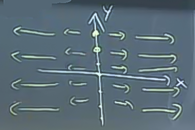

Aslında bu tür çizimleri çoğunlukla bilgisayara yaptırıyoruz, ama kabaca
vektör alanlarının neye benzediğini hayal edebilmek ise yarıyor. 

Örnek

$$ \vec{F} = x\hat{i} + y\hat{j} $$

Bu alanın ilginç bir geometrik sonucu var.  Orijinden herhangi bir noktaya
çizilebilecek bir vektörü (... ile belirtiliyor) alıp, kopyalarsak, bu
kopyayı o noktadan başlayacak şekilde yerleştirirsek, doğru sonucu elde
etmiş oluruz.

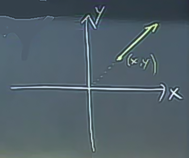

Hepsini çizince şu şekil ortaya çıkıyor. 

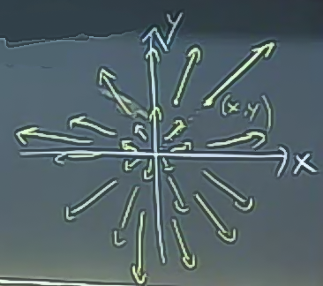

Bu çizim tekniği bu örnekte ise yaradı çünkü $x,y$ hem vektör büyüklüğünü,
hem de alan bağlamında önün başlangıç noktasını belirliyor. 

Örnek

$$ \vec{F} = -y\hat{i} + x\hat{j} $$

Yine orijinden başlama numarasını düşünürsek şimdi elimizde $< -y,x >$
vektörü var, acaba bu vektör $< x,y >$ göre nasıl bir vektör? 

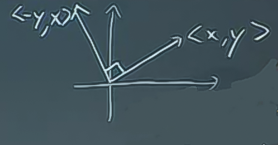

Bu iki vektörün arasında 90 derece vardır. O zaman bu $< x,y >$'ye dik olan
kopyayı almamız lazım, ve onu $x,y$'den başlatmamız lazım. 

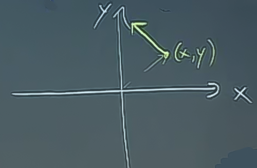

Hepsini çizersek

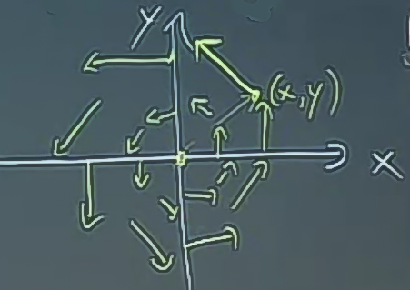

Bu alan mesela orijin etrafında her yuvarlakta sabit hızda bir akışı olan bir
sıvıyı temsil ediyor olabilir. Yani vektör alanı bir hız alanı (velocity field)
olabilir. İlginç sorulardan biri, sıvı içindeki bir parçacığın halkaların
birinde tam bir atmasının ne kadar zaman alacağı. Cevap $2\pi$ çünkü halkanın
uzunluğu $2\pi \cdot r$, yani $2\pi$ çarpı yarıçap (radius). Bu cevap birim
açısal hız (unit angular velocity), 1 radyan / zaman. Hızın büyüklüğü bir halka
içinde sabit, çünkü hızın büyüklüğü demek vektörün büyüklüğü demek, eğer halkayı
biz seçtiysek, o halkanın orijinden uzaklığı aynı olacaktır, bu uzaklığın
kopyası da aynı büyüklükte olacaktır.

Kuvvet alanlarına gelelim, yani şimdi vektör alandaki vektörler kuvvetleri
temsil edecekler. Şimdi şu senaryoyu düşünelim. Bir parçacığın üzerine bir
kuvvet uygulanıyor ve bu parçacık bir seyahat çizgisi üzerinde
ilerliyor. Fizikten bilindiği gibi kuvvetin yaptığı "iş (work)'' kuvvetin
o kuvvetin sayesinde ne kadar yer değişikliği olduğunun vektörü
(displacement vector) ile noktasal çarpımına eşittir. Eğer gidişat düz
olursa, ve kuvvet sabitse bu hesap basitçe yapılabilir, ama daha çetrefil
bir gidişat takip ediliyorsa ve kuvvet o sırada sürekli değişiyorsa, o
zaman üzerinden entegrasyon yapmamız gerekir.

İş ve Çizgi Entegrali

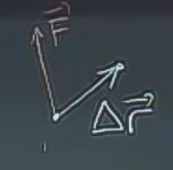

$$ W = (kuvvet)\cdot(mesafe) = \vec{F}\cdot\Delta\vec{r} $$

$W$ yapılan iş (work)'i temsil ediyor. 

Fakat senaryomuzda demiştik ki gidişat karmaşık ve güç sürekli
değişiyor.


O zaman iş hesabını yapmak için gidişatı ufak parçalara ayırmalıyım, o
parçalar için çarpımı yapıp sonuçları toplamalıyım. Parçalar olabileceği
kadar ufak olmalı tabii ki, bu ne demektir? Bir entegral demektir. Yani

Bir gidişat $C$ üzerinde yapılan iş 

$$ W = \int_C \vec{F} \cdot \mathrm{d}\vec{r} $$

Notasyonun hesapsal anlamına bakalım şimdi. Şöyle görebiliriz

$$ = \lim_{\Delta r_i \to 0} \sum_i  \vec{F} \cdot \Delta\vec{r}_i$$

$$ = 
\lim_{\Delta t \to 0} \sum_i  
\vec{F} \cdot \bigg( \frac{\Delta\vec{r}}{\Delta t} \Delta t 
\bigg)
$$

Aslında hem bölüme, hem bölene $\Delta t$ ekleyerek hiç bir şey
değiştirmedik, ama yeni ortaya çıkan terim $\Delta\vec{r} / \Delta t$ hız
vektörü $d\vec{r}/dt$'ye eşit. Limitin $\Delta t$'ye dönüştüğüne dikkat.

Yani ilk baştaki entegralimizi şu şekilde hesaplayabiliriz

$$ = \int_{t_1}^{t_2} \vec{F} \cdot \frac{d\vec{r}}{\mathrm{d} t} \mathrm{d} t $$

Örnek

Şu kuvvetin

$$ \vec{F} = -y\hat{i} + x\hat{j} $$

Şu parametrik eğri $C$ üzerinde

$$ x = t  $$

$$ y = t^2 $$

$$ 0 \le t \le 1 $$

yaptığı işi hesapla. 

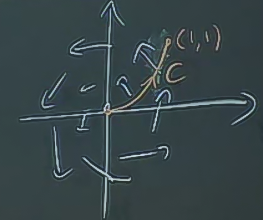

Bu arada, "$C$'yi nereden buldun?'' diye bir soru gelebilir, bu yanlış bir
soru. $C$'yi bulmadık, o bize sorunun içinde verildi, yani elimizdeki veri
bu. Kuvvet alanı ve eğri tamamen ayrı yerlerden, ayrı şekilde tanımlanmış
olabilir. 

$$
\int_C \vec{F} \cdot \mathrm{d}\vec{r} 
= \int_{0}^{1} \vec{F} \cdot \frac{\mathrm{d}\vec{r}}{\mathrm{d} t} \mathrm{d} t 
$$

$\vec{F}$ nedir? 

$$ \vec{F} = <-y,x> = <-t^2,t> $$

Hız nedir? 

$$ dx/dt = 1 $$

$$ dy/dt = 2t $$

O zaman 

$$ W = \int_{0}^{1}  <-t^2,t>\cdot<1,2t> \mathrm{d} t $$

$$ = \int_{0}^{1} (-t^2 + 2t^2) \mathrm{d} t $$

$$ = \int_{0}^{1} t^2 \mathrm{d} t = \frac{1}{3} $$

Başka Bir Yol

Vektör alanımızın bileşenlerinin

$$ \vec{F} = <M,N> $$

olduğunu düşünelim, ve

$$ d\vec{r} = <dx, dy> $$

Çünkü $\vec{r}$ parametrize edilmiş bir vektör, ve bileşenleri $x,y$
şeklinde. O zaman

$$  \vec{F} \cdot d\vec{r}  = M dx + N dy
$$

olacaktır. Bu eşitlik üzerinden problemlerin çoğunlukla şu şekilde
yazıldığını görürsünüz

$$  \int_C \vec{F} \cdot \mathrm{d}\vec{r}  = \int_C M \mathrm{d} x + N \mathrm{d} y $$

Eşitliğin sağındaki vektör alanı değil artık, ama aslında aşağı yukarı aynı
şeyler. Yani aradaki fark bir fonksiyonun gradyanı ile kısmi diferansiyelleri
arasındaki ilişkiye benziyor. Notasyon farklı, ama aslında aynı içeriğe
sahipler.

Peki bu yeni formdaki çizgi entegralini nasıl hesaplayalım? Hem $M$ hem $N$
içinde $x,y$ var, eğer entegrali sadece $dx$, sadece $dy$ için alırsak yine
$y$'ler, $x$'ler ortaya çıkacak, fakat biz bunu istemiyoruz, biz tek bir sayı
istiyoruz. Buradaki püf nokta şu, eğri boyunca $x,y$ birbiriyle bağlantılı. Yani
$M,N$ içeren bir formülü entegre ediyor olabiliriz, ama $C$ boyunca aslında
sadece tek bir parametre var. Bu tek değişken $x$ olabilir, $y$ olabilir, $t$
olabilir. O zaman

Metot: $x,y$ değişkenlerini tek bir değişken bağlamında belirt. O tek değişkeni
diğerlerinin yerine geçir. 

Biraz önceki örnek

$$
\int_C \vec{F} \cdot \mathrm{d}\vec{r} 
= \int_C -y \mathrm{d} x + x \mathrm{d} x
$$

Her şeyi yeni, tek bir değişken $t$ bağlamında belirtelim. Problem zaten
şunu vermişti

$$ x = t  $$

$$ y = t^2 $$

$dx,dy$'yi bulmak için

$$ dx = dt $$

$$ dy = 2tdt $$

O zaman entegral şuna dönüşür

$$ = \int_C -t^2 \mathrm{d} t + t \cdot 2t \mathrm{d} t$$

$$ = \int_0^1 t^2 \mathrm{d} t = \frac{1}{3}$$

$\int_C \vec{F} \cdot \mathrm{d} \vec{r}$ entegrali $C$'ye bağlıdır, parametrizasyonun
nasıl yapıldığına bağlı değildir. Yani hangi değişkeni istersek onu seçeriz,
mesela yukarıdaki örnekte

$$ 
\left\{ \begin{array}{l}
x  = \sin\theta \\
y  = \sin^2\theta 
\end{array} \right.
$$

$$ 0 \le \theta \le \frac{\pi}{2} $$

farz etmek te mümkündür. Sonra $dx,dy$ bulunurdu, bir sürü trigonometrik
işlemden sonra aynı sonucu bulabilirdik. Daha zor olurdu ama bulunurdu. O
zaman bir tavsiye, işimizi en kolaylaştıracak parametrizasyonu kullanmak en
iyisi. Üstte en sondaki parametrizasyon pek iyi değil. 

Geometrik Yaklaşım

Parametrizasyon, vs. ile her zaman bir çözüme varılabilir. Fakat bazen
geometrik olarak yaklaşmak çözümü daha hızlandırabiliyor. 

Vektör $\Delta \vec{r}$'yi düşünelim. 

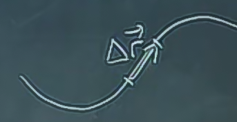

Eğer bu vektörü çok ufak alırsam, vektörün gidişata teğet olduğunu
düşünebiliriz. Yani birim teğet vektör ile aynı yönü gösterecek, uzunluğu
ise gidişat üzerinde alınan mesafenin ufak bir parçası $\Delta s$ olacak. 

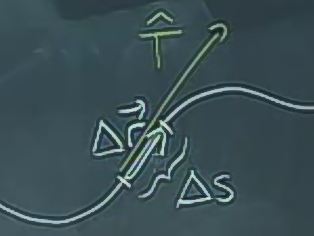

$$ d\vec{r} = <dx, dy> $$
 
olduğu söylemiştik, o zaman aynı şekilde

$$  d\vec{r} = \vec{T} \mathrm{d} s $$

Dikkat eşitliğin sağ tarafındaki noktasal çarpım değil, düz çarpım. Üstteki
ifadeyi şu şekilde de görebiliriz: $ds$ uzunluğunun $\vec{T}$ yönündeki
(yön sadece, çünkü $\vec{T}$ birim vektör) yansıması, bileşeni.

Her şeyi $dt$'ye bölünce elimize anlamlı bir ifade çıktığını görebiliyoruz

$$ \frac{d\vec{r}}{dt} = <\frac{dx}{dt}, \frac{dy}{dt}> 
= \vec{T} \ \frac{ds}{dt} 
$$

Hız vektörünün yönü gidişatın yönüne, $\vec{T}$'ye, teğet.

Yani geometrik düşünerek şunu da söylemem mümkün,

$$
\int_C \vec{F} \cdot \mathrm{d}\vec{r}  = \int_C M \mathrm{d} x + N \mathrm{d} y
= \int_C \vec{F} \cdot \vec{T} \mathrm{d} s
$$

$\vec{F} \cdot \vec{T}$'yi tek sayısal (scalar) bir nicelik olarak görebiliriz,
ki bu tek sayı, kuvvetin teğet yönünde olan etkisi, kuvveti o yöne "yansıtınca
(projection)'' ele geçen değerdir. Sonra bu yansımayı alıp tüm eğri boyunca
entegre ediyorum.

Örnek

$C$ = ortası orijinde olan $a$ yarıçapındaki çember, ve gidişat saat
yönünün tersi yönde.

$$ \vec{F} = x\hat{i} + y\vec{j} $$


Fiziği iyi olanlar sonucun ne olacağını tahmin edebilir, sıfır olacak çünkü
gidişat her zaman kuvvet vektörlerine dik. 

Yani $\vec{F} \perp \vec{T}$, o zaman $\vec{F} \cdot \vec{T} = 0$, yani

$$  \int_C \vec{F} \cdot \vec{T} \mathrm{d} s = 0$$

Sonuç basit şekilde hesaplandı. Burada iki saat parametrizasyon
yapabilirdik, vs. ve sonuç yine aynı çıkardı. 

Örnek

Üstteki aynı $C$, ama $\vec{F} = -y\hat{i} + x\hat{j}$. Bu durumda her iki
vektör aynı yöne işaret ediyor (ama aynı büyüklükte değiller, $\vec{T}$'nin
birim vektör olduğunu unutmayalım).

Yani $\vec{F} // \vec{T}$, o zaman $\vec{F} \cdot \vec{T} = |\vec{F}| =
a$.

Artık entegrali çok hızlı şekilde hesaplayabiliriz. 

$$
\int_C \vec{F} \cdot \vec{T} \mathrm{d} s 
=  \int_C a \mathrm{d} s  = a \int_C \mathrm{d} s 
= a \cdot C \textit{'nın uzunluğu}
$$

$C$'nin uzunluğu nedir? $2\pi a$. Yani üstteki entegral

$$ = 2\pi a^2 $$

Eğer bu hesabı parametrizasyon ile yapsaydık? 

$$ x = a\cos\theta $$

$$ y = a\sin\theta $$

$$ 0 \le \theta \le 2\pi $$

$$ \int_C -y \mathrm{d} x + x \mathrm{d} y $$

$$ = \int_C -(a\sin\theta)(-a\sin\theta \mathrm{d}\theta) + 
(a\cos\theta)(a \cos\theta \mathrm{d}\theta)
$$

$$ = \int_0^{2\pi} a^2 (\sin^2\theta + \cos^2\theta) \mathrm{d}\theta $$

$$ = \int_0^{2\pi} a^2 \mathrm{d}\theta $$

Aynı sonuca eriştik. 

Soru 

$C$ eğrisi xy düzleminde $x^2+y^2=1$ çemberi, ve yönü saat yönünün tersinde
olsun. Şu çizgi entegralini hesaplayın.

$$ \int_C (2x-y) \mathrm{d} x + (x+3y)) \mathrm{d} y $$

Parametrizasyon için kare toplamı 1 olan formülleri bulalım. Bunlar

$$ x = \cos t $$

$$ y = \sin t $$

$$ dx/dt = -\sin t$$

$$ dy/dt = \cos t $$

$$ =
\int_0^{2\pi} \bigg( 2\cos(t) - \sin t \bigg)(-\sin t ) \mathrm{d} t + 
\bigg(\cos t + 3\sin t \bigg) \cos t \mathrm{d} t
$$

$$ = 
\int_0^{2\pi}
\bigg(
-2\cos(t)\sin t + \sin^2 t + \cos^2(t) + 3 \sin t \cos t
\bigg) \mathrm{d} t
$$

$$ = 
\int_0^{2\pi} \bigg( \cos t \sin t + 1 \bigg) \mathrm{d} t
$$

$\cos t \sin t$'nin entegrali nedir? Birbirinin türevi olan terimler çarpım
olarak aynı formüle olunca bir numara yapmak mümkün oluyor. Şunu diyebiliyoruz
mesela, $u=\sin(t)$ ve $du=\cos(t)dt$, ve $\int u \mathrm{d} u = u^2/2$ olacağı için,

$$ \int \cos t \sin t \mathrm{d} t = \frac{\sin^2(t)}{2} $$

O zaman 

$$ = \frac{\sin^2(t)}{2} + t \bigg|_0^{2\pi}  $$

$$ =  2\pi $$

Ekler

Skalar Alanlar Uzerinden Cizgi Entegral

Çizgi entegrallerinin bir diğer şekli onları tek sayısal (skalar) alanlar
üzerinden hesaplamak. Başta gördüğümüz vektör alanı üzerinden idi, fakat
benzer bir hesabı $\vec{F}$ yerine $f(x,y)$ alanı üzerinden de yapabiliriz,
yani 3 boyutlu bir yüzey üzerinde giden bir eğrinin altındaki alan
hesabı. Alttaki figürlere bakarsak, ilk figürde bir üç boyutlu bir
yükseklik grafiğine kuşbakışı baktığımızı düşünelim; kırmızımsı renkler
dağ, daha yüksek, mavimsi deniz, derinliği gösteriyor [1]. 

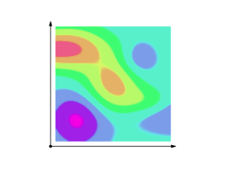
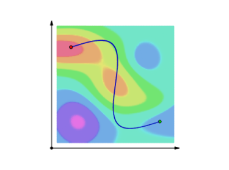

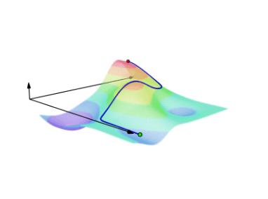


Formülü türetmek için $f(x,y)$ eğrisinin parçalara bölündüğünü düşünelim,
ve her $i$'inci parçayı $f$ ile çarpıp toplarsak [2], 

$$
\lim_{\Delta s_i \to 0} \sum_{i=1}^{N} f(x_i,y_i) \Delta s_i = \int_C f(x,y) 
\mathrm{d} s
$$

Çoğunlukla $t$ üzerinden parametrize edilmiş formüllerle iş yapacağız. O
zaman eğer diferansiyel $\mathrm{d} s$'i $(\mathrm{d} s/ \mathrm{d} t) \mathrm{d} t$ olarak yazarsak,
ve bir eğrinin uzunluğunu

$$
\frac{\mathrm{d} s}{\mathrm{d} t} = \sqrt{(\mathrm{d} x/\mathrm{d} t)^2 + (\mathrm{d} y/\mathrm{d} t)^2} 
$$
 
ile hesaplayabildiğimiz için, $t=a$, $t=b$ arasındaki entegral

$$
\int_C f(x,y) \mathrm{d} s = 
\int_C f(x,y) \frac{\mathrm{d} s}{\mathrm{d} t} \mathrm{d} t = 
\int_{t=a}^{t=b} f(x(t),y(t)) \sqrt{(\mathrm{d} x/\mathrm{d} t)^2 + (\mathrm{d} y/\mathrm{d} t)^2} \mathrm{d} t
$$


Örnek

$f(x,y) = x + y$ düzlemi olsun (sola yatık görülen düzlem). Bu düzlem
üzerinde ve $y = x^2$ eğrisi altında kalan alanın $0 \le x \le 2$ için
hesabı nedir?

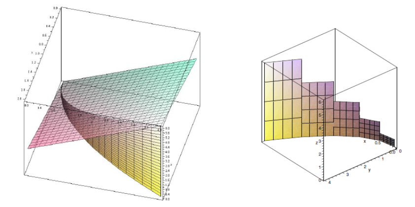

Eğriyi parametrize halde $x=t,y=t^2$ olarak yazabiliriz. $x=t$ olduğu için
$0 \le t \le 2$ olacak, ayrıca $\mathrm{d} x/ \mathrm{d} t = 1$, $\mathrm{d} y / \mathrm{d} t = 2t$ o
zaman

$$
\int_{0}^{2} f(t, t^2) \sqrt{1 + 4t^2} \mathrm{d} t
$$

$$
\frac{167}{48} \sqrt{17} - \frac{1}{12} - \frac{1}{64} \ln (4 + \sqrt{17})
$$

```python
print (167/48*np.sqrt(17) - 1/12. - 1/64 * np.log(4+np.sqrt(17)))
```

```
14.228908438910489
```


Kaynaklar

[1] Libre Texts, *Line Integrals*
   [https://bit.ly/2kOSKeZ](https://bit.ly/2kOSKeZ)

[2] Strang, *Calculus*


