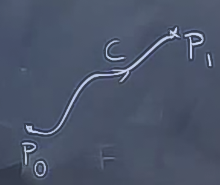
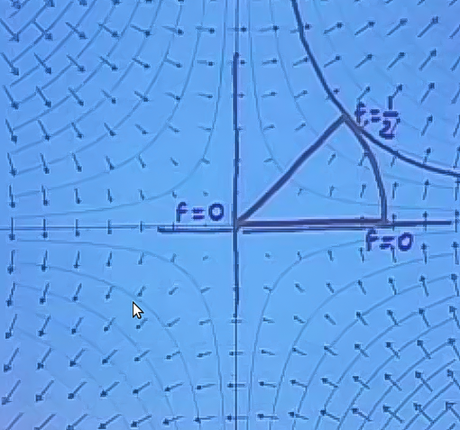

# Ders 20

Çizgi entegrallerini iş hesabında görmüştük. $\vec{F}$ tarafından $C$
eğrisi üzerinde yapılan iş

$$ \int_C \vec{F} \cdot \mathrm{d}\vec{r} =  \int_C \vec{F} \cdot \vec{T} \mathrm{d} s $$

idi. Eşitliğin sağı birim teğet vektörü kullanarak aynı hesabı gösteriyor, $ds$
ise eğri uzunluğu $s$'ten ortaya çıkıyor. Diğer bir form

$$ = \int_C M \mathrm{d} x + N \mathrm{d} y $$

ki $\vec{F} = < M,N >$ olmak uzere. 

Örnek 

Şöyle bir vektör alanı veriyorum

$$ \vec{F} = < y,x > $$

Bu alanın neye benzediği çok bariz değil, ama bu alanın bir bilgisayar
çizimi altta

Diyelim ki bu vektör alanında orijinden başlayarak $c_1,c_2,c_3$ vektörlerini
takip ederek hareket ettiğimde yapılan işi hesaplamak istiyorum. $c_1$ düz,
$c_2$ birim çember üzerinde bir parça, $0 \le \theta \le \pi / 4$ olmak üzere,
ve $c_3$ tekrar düz. Yani

$$ c = c_1 + c_2 + c_3 $$

O zaman iş hesap entegralinin üç parçası olacak. Her parça $i$ için 

$$ \int_{C_i} y \mathrm{d} x + x \mathrm{d} y $$

gerekiyor. 

1) Yatay x ekseninde, $(0,0)$'dan $(1,0)$'a. 

$$ y = 0, \mathrm{d} y = 0 $$

$$ \int_{c_1} y \mathrm{d} x + x \mathrm{d} y = 0 \mathrm{d} x + 0 = 0$$

Çizgi entegrali çok basit yani. Bu sıfır sonucunu başka şekilde de
görebilirdik, vektör alanına bakarsak x eksenine her zaman dik olduğunu
görürürüz. O zaman $\vec{F}\cdot \vec{T}$ hep sıfır sonucunu verecektir. 

2) $c_2$ bölümü. 

$x,y$'yi tek değişken bağlamında nasıl temsil edeceğimizi bulmamız
gerekiyor. Eğer bir çember üzerinde hareket ediyorsak, bu tek değişken açı
olabilir. 

$$ x = \cos\theta $$

$$ y = \sin\theta $$

$$ 0 \le \theta \le \pi / 4 $$

Türevleri alırsak

$$ dx = -\sin\theta \mathrm{d}\theta$$

$$ dy = \cos\theta \mathrm{d}\theta $$

Entegral

$$
\int_{c_2} y \mathrm{d} x + x \mathrm{d} y = 
\int_0^{\pi/4} \sin\theta (-\sin\theta \mathrm{d}\theta)  + 
\cos\theta \cos\theta d\theta
$$

$$ = \int_0^{\pi/4} \cos^2\theta - \sin^2\theta \mathrm{d}\theta $$

$$ = \int_0^{\pi/4} \cos(2\theta) \mathrm{d}\theta $$

$$ = \frac{1}{2}\sin 2\theta \bigg|_0^{\pi/4} $$

$$ = \frac{1}{2} $$

3) $c_3$ bölümü

$$ \int_{c_2} y \mathrm{d} x + x \mathrm{d} y $$

Başladığımız noktayı biliyoruz, geriye doğru orijine geleceğiz. Bu çizgiyi
parametrize etmek zor değil. 

$$ x = \frac{1}{\sqrt{2}} - \frac{1}{\sqrt{2}} t $$

$$ y = \frac{1}{\sqrt{2}} - \frac{1}{\sqrt{2}} t $$

$$ 0 \le t \le 1 $$

Ama üstteki doğru olsa da, gereğinden fazla çetrefil oldu. 

Daha kolay bir yöntem "orijinden'' ileri doğru bir yön düşünmek, ve sonra
"bunun tersi olsun'' diyerek istediğimiz gidişatı elde etmek. Yani

$$ x = t $$

$$ y = t $$

ki $t$, 0 ile $1/\sqrt{2}$ arasında. Bu bize $(-c_3)$'u verecek, yani
$c_3$'un tersini. O zaman entegrali şu şekilde görebiliriz

$$ \int_{-c_3} = - \int_{c_3}  $$

Buradaki numara 0'dan başlamanın cebirsel temsili kolaylaştırmış
olması. Devam edelim

$$ \mathrm{d} x = \mathrm{d} t $$

$$ \mathrm{d} y = \mathrm{d} t $$

$$
\int_{-c_3} y \mathrm{d} x + x \mathrm{d} y  = 
\int_{0}^{\frac{1}{\sqrt{2}}} t \mathrm{d} t + t \mathrm{d} t = 
\int_{0}^{\frac{1}{\sqrt{2}}} 2t \mathrm{d} t = 
t^2 \bigg|_{0}^{\frac{1}{\sqrt{2}}} =
\frac{1}{2}
$$

Üsttekinin tersine ihtiyacımız olduğuna göre 

$$
\int_{c_3} y \mathrm{d} x + x \mathrm{d} y  = -\frac{1}{2}
$$

Ya da iki üstteki entegralin sınırlarını tam ters yönde de alabilirdik, 0'dan
$1/\sqrt{2}$'a gitmek yerine, $1/\sqrt{2}$'dan 0'a gidebilirdik, o da aynı
sonucu verirdi.

Nihayet, yapılan tüm iş, tüm entegrallerin toplamı olacağına göre

$$ \int_C = \int_{c_1} + \int_{c_2} + \int_{c_3}  $$

$$ = 0 + \frac{1}{2} - \frac{1}{2} = 0$$

Peki çizgisel entegralleri hesaplamaktan kurtulabilir miyiz? 

Şimdi, gördüğümüzde vurgulamamış olsak, diyelim ki vektör alanı $\vec{F}$
bir fonksiyonun gradyanı, yani

$$ \vec{F}  = \nabla f$$

Bir gradyan alanımız var yani, ve bu durumda $f(x,y)$'ye bir potansiyel alanı
(potential field) diyebiliriz. Bu isim fizikle alakalı doğal olarak, $f$
fonksiyonu $x,y$ noktasında ne kadar enerji, potansiyel, vs. depolandığını
gösterir genellikle, ve bu noktadaki gradyan kuvveti verir. Daha doğrusu
gradyanın negatifi, fizikçiler gradyanı eksi ile çarparlar, yani matematikçiler
ile aralarında böyle bir fark vardır. Aklımızda tutalım. Biz eksi olmayan
yöntemi kullanacağız.

Çizgizel Entegraller İçin Calculus'un Temel Teorisi

$$
\int_{C} \nabla f \cdot \mathrm{d}\vec{r} = 
f(P_1) - f(P_0)
$$

Bu çok faydalı bir formül, ama sadece vektör alanı bir gradyan ise, ve $f$'i
biliyorsak ise yarar. İleriki bir derste bir vektör alanının bir gradyan olup
olmadığını nasıl anlayacağımızı göreceğiz, ve eğer bir gradyan ise, potansiyel
fonksiyonunu geri elde etmenin tekniklerini göreceğiz.

$$ \int_C f_x \mathrm{d} x + f_y \mathrm{d} y  = \int_C \mathrm{d} f = f(P_1) - f(P_0) $$

Üstteki en sağdaki eşitliğe bakınca $f$ noktaları arasındaki fark formülünü
nasıl elde ettiğimiz aslında pek şaşırtıcı değil. Bu formda elde ettiğimiz
sonuç tek değişkenli Calculus'taki sonuç ile aynı. 

İspat

Diyelim ki size bir eğri verdim ve alttaki entegrali hesaplamanızı
istedim. 

$$
\int_{C} \nabla f \cdot \mathrm{d}\vec{r} =  \int_C f_x \mathrm{d} x + f_y \mathrm{d} y
$$

Bunu nasıl yaparız? Bir parametre seçeriz ve her şeyi o parametre
bağlamında temsil ederiz. 

$$ C: x = x(t), y = y(t) $$

O zaman 

$$ dx = x'(t)dt, dy = y'(t)dt $$

$$
\int_{C} \nabla f \cdot \mathrm{d}\vec{r} =  
\int_C \bigg( f_x \frac{\mathrm{d} x}{\mathrm{d} t} + f_y \frac{\mathrm{d} y}{\mathrm{d} t} \bigg) \mathrm{d} t
$$

Parantez içindeki ifadeler tanıdık geliyor mu? Böyle bir sonucu Zincirleme
Kanunu sonucunda da görmüştük. 

$$ = \int_C \frac{\mathrm{d} f}{\mathrm{d} t} \mathrm{d} t $$

Diyelim ki $t_0 \le t \le t_1$

$$ = \int_{t_0}^{t_1} \frac{\mathrm{d} f}{\mathrm{d} t} \mathrm{d} t$$

Ve bildik Calculus'un Temel Teorisine göre üstteki $f$'in iki değer
arasındaki farkına eşittir. 

$$
= f\bigg( x(t), y(t) \bigg) \bigg|_{t_0}^{t_1} = f(P_1) - f(P_0)
$$

İspat tamamlandı. 

Örnek

Baştaki örneğe dönersek, orada görülen vektör alanı aslında raslantısal bir
şekilde bir gradyan alanı da olabilir mi acaba? Vektör alanı şöyleydi

$$ \vec{F} = <y,x> $$

Acaba aklımıza $x$'e göre türevi alınınca $y$, $y$'ye göre türevi alınınca
$x$ olan bir fonksiyon geliyor mu? Evet, mesela $xy$ fonksiyonu böyle bir
fonksiyon. Yani

$$ f(x,y) = xy $$

O zaman bu alanda bir çizgi entegralini hesaplamak için $f$'in başlangıç,
bitiş noktaları arasındaki farkı almak yeterli. 

Üstteki resmi nasıl okuruz? $c_1$ boyunca potansiyel hiç değişmedi, yapılan iş
sıfır. Sonra $c_2$ boyunca hareket ve $1/2$'ye geldik, yapılan iş $1/2$, gibi.

Bu güzel bir numara ve oldukça kullanışlı, çünkü çoğu vektör alanı bir
gradyan alanı olarak görülebiliyor, mesela fizikte potansiyelin
gradyanı. Ama unutmayalım, her vektör alanı gradyan değildir, gradyan
olmayan pek çok vektör alanı vardır. Mesela manyetik alanlar gradyan
değildir. 

Bu uyarıdan sonra, eğer $\vec{F}$ bir gradyan alanı ise, Temel Teorinin
diğer etkilerini de görelim. 

Sonuç 1: Yol Bağımsızlığı (path independence) Özelliği

Çizgi entegralini hesaplarken hangi yoldan geçtiğiniz önemli değil, eğer
başlangıç ve bitiş noktaları aynı ise. Bu özellik diğer vektör alanları
için doğru olmayabilir, ama gradyan alanları için işler.

Resimde durum için bu

$$ \int_{c_1}\nabla f \cdot \mathrm{d}\vec{r} =  \int_{c_2}\nabla f \cdot \mathrm{d}\vec{r} $$

Bu teorinin ispatı aslında kolay, Temel Teorinin yan etkilerinden biri
sadece. Başlangıç ve bitiş aynı ise, onların farkı hangi yoldan gidilirse
gidilsin aynı olacaktır.

Bu ne ise yarar? $f$'i bilmiyorsak bile eğer vektör alanının gradyan alanı
olduğunu biliyorsak, çizgi entegralleri birbirine eşittir diyebiliriz hemen. 

Sonuç 2: $\vec{F} = \nabla f$ Muhafazakardır (conservative)

Fizik bağlamında muhafazakarlık enerjinin muhafaza edilmesinden ileri
gelir, bu kavrama göre enerjiyi kuvvet alanımızda bedavaya elde
edemeyiz. Eğer alttaki gibi "kapalı'' bir gidişat hayal edersek

ki $C$ bir kapalı eğri, o zaman $C$ üzerinde yapılan iş

$$ \int_{C}\nabla f \cdot \mathrm{d}\vec{r} = 0$$

sıfıra eşittir. Muhafazakarlığın tanımı budur. 

Fiziksel, uygulamasal olarak bunun sonucu şudur: Muhafazakar bir alanda
kapalı devre, sürekli kendi kendine hareket eden bir gidişat olamaz. Çünkü
başlangıç ve bitiş arasında yapılan iş, hangi yol takip edilirse edilsin,
sıfıra eşittir. Hiç iş yapılmamaktadır. 

Manyetik alanlar böyle değildir, bu sebeple bu alanlardaki hareketle o alandan
enerji çekip çıkarabiliriz. Ama elektrik ve yerçekimsel alanlarda bu işlemez.

Her vektör alanının gradyan alanı olmadığını iyice vurgulamak için su
örneğe bakalım. 

$$ \vec{F} = <-y,x> $$

Bu alan bir çember etrafında dönen bir alandı. Birim çemberi (unit circle)
düşünürsek $\vec{F} // \vec{T}$ idi, o zaman $\vec{F}\cdot\vec{T} =
|\vec{F}|$. Demek ki

$$ \int_C \vec{F}\cdot\vec{T} \mathrm{d} s = \int_C 1 \mathrm{d} s = 2\pi $$

çünkü birim çember etrafında $|\vec{F}|$ uzunluğu birim çemberin uzunluğudur. Ve
bariz bir şekilde $2\pi \ne 0$, yani bu alan muhafazakar bir alan değil. Buradan
anlıyoruz ki bu alan hiçbir şeyin gradyanı da değil, olsaydı entegral sıfır
olurdu.

Ek olarak yol bağımsızlık özelliği de geçerli değil, üstteki resimde çemberin
sadece üst parçasında hareket edersek $\pi$, alt parçasında hareket edersek
$-\pi$ elde ederiz, bu sonuçlar birbirine eşit değil.

Biraz fizik yapalım şimdi.

Eğer bir kuvvet alanı $\vec{F}$ bir potansiyelin gradyani ise 

$$ \vec{F} = \nabla f $$

[hoca üstte eksi işareti kullanmadığı için burada espri yaparak "konumuz
-Fizik'' diyor]

$\vec{F}$'in yaptığı iş = potansiyelin iki nokta arasındaki farkı. 

Mesela yerçekimsel alan, elektriksel alan ve yerçekimsel potansiyel,
elektriksel potansiyel. 

Bu arada elektriksel potansiyele "voltaj'' ismi de veriliyor, parmağınızı
prize sokunca canınızı acıtan şey yani. 

[gerisi atlandı, aynı şeylerden bahsediliyor]

