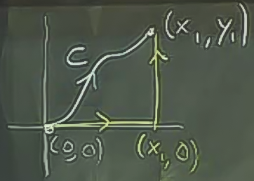
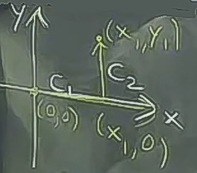
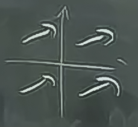
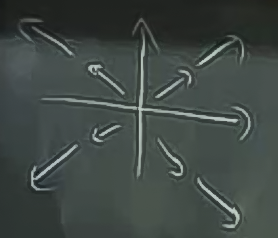

# Ders 21

Bir önceki ders yol bağımsızlığı özelliği ve muhafazakarlığın birebir ilişkide
olduğunu gördük. Bu derste bir alana bakarak o alanın gradyan alanı olup
olmadığını anlamamızı sağlayacak bir matematiksel kriter göreceğiz, ve eğer alan
bir gradyan alanı ise, onun bağlı olduğu potansiyel alanı hesaplamanın yolunu
işleyeceğiz.

Bir vektör alanı $\vec{F} = < M,N >$ eğer gradyan alanı ise 

$$ M = f_x, \quad N = f_y $$

Bunu biliyoruz. Kısmi türevlerin daha önce öğrendiğimiz özelliğine göre, şunu da
biliyoruz. $f_{xy} = f_{yx}$ mesela. O zaman elimizde bir gradyan alanı var ise

$$ M_y = N_x $$

doğru olmalı. 

Tek kontrol etmemiz gereken bu. Tabii vektör alanı $\vec{F} = < M,N >$ her yerde
tanımlı ve türevi alınabilir bir formda olmalı. Tanımlılık hakkında -
ödevlerimizden birisi bu konuyu işliyor mesela, size tek bir nokta haricinde her
yerde tanımlı bir vektör alanı veriyoruz, ve tüm bu anlattıklarımız o noktada
ise yaramaz hale geliyor. Bu konuyu daha derin şekilde inceleyeceğiz, mesela
"basit şekilde bağlı bölgeler (simply connected regions)'' konusuna bakacağız.

Şimdilik şu yeterli, eğer alan her yerde tanımlı ise ve $M_y = N_x$ ise,
alan bir gradyan alanıdır. 

Örnek 

$$ \vec{F} = -y\hat{i} + x\hat{j} $$

Bir önceki derste bu alanın muhafazakar olmadığına (yani gradyan alanı
olamayacağına) karar vermiştik, çünkü üstteki çember etrafında bir çizgi
entegrali alınca sonuç sıfır değil, pozitif bir değer çıkıyordu. Ama biz yine
de, biraz önce öğrendiğimiz tekniği kullanarak bunu kontrol edelim.

$$ \vec{F} = \underbrace{-y}_{M}\hat{i} + 
\underbrace{x}_{N}\hat{j} 
$$

$$ \frac{\partial M}{\partial y} = -1 $$

$$ \frac{\partial N}{\partial x} = 1 $$

Bu iki sonuç birbirinin aynısı değil. Demek ki alan bir gradyan alanı
değil. 

Örnek

$$ \vec{F} = (4x^2 + axy)\hat{i} + (3y^2 + 4x^2)\hat{j} $$

Hangi $a$ değerleri için bu alan bir gradyan alanı olur? 

$$ M_y = ax $$

$$ N_x = 8x $$

$a=8$. Bu arada, ikinci kısmı türevleri birbirine eşit yapınca, bu eşitlik her
noktada doğru olmalıdır. Yani cebirsel olarak $ax = 8x$ şeklinde bir eşitlik
hazırlayıp cebirsel numaralarla $x$'i bulmuyoruz, çünkü bu cebirsel çözümde
$x=0$ da işlerdi, ama bu doğru cevap olmazdı. Biz ikinci kısmı türevlerin "aynı
ifade'' olmasını istiyoruz.

Devam edelim. Alanımız artık şöyle

$$ \vec{F} = (4x^2 + 8xy)\hat{i} + (3y^2 + 4x^2)\hat{j} $$

Peki bu gradyan alanınıyla bağlantılı potansiyel alanı nasıl buluruz? 

Bir yöntem tahmin etmektir, çoğunlukla ise yarar. Ama daha sistematik olan iki
yöntem göreceğiz şimdi, sınavda bunlardan birini kullanın, çünkü tahmin her
zaman ise yaramıyor, hatta bazı durumlarda tahmin yanlış yollara bile
götürebiliyor.

1'inci Yöntem - çizgi entegralini hesaplayarak 

Alanımızda çizgi entegral alalım, benim en favori noktam, orijinden başlasın,
$x_1,y_1$ noktasına giden $C$ üzerinde yapılan işi hesaplasın.  Sonuç şöyle
olmalı

$$ \int_C \vec{F} \cdot \mathrm{d}\vec{r} = 
f(x_1,y_1) - f(0,0)
$$

Eğer bu doğruysa şunu da yazabilmeliyim (basit bir cebirsel manipülasyon)

$$ f(x_1,y_1) = \int_C \vec{F} \cdot \mathrm{d}\vec{r} + f(0,0) $$

ki $f(0,0)$ bir sabittir. Bu sabitin ne olduğunu bilmiyoruz, ama onun ne
olacağını aslında "tanımlayabiliriz''. 

Diyelim ki bir potansiyel fonksiyonumuz var. Bu fonksiyona 1 eklemek, ya da
hernangi başka bir sayı eklemek bu potansiyeli değiştirmez, çünkü gradyanlar
aynı kalacaktır (sabitler kısmi türev alınırken yokolacağı için). o zaman
$f(0,0)$'i bu eklenen sabit olarak görebiliriz, ya da entegrasyon sabiti olarak
görebiliriz. Aynen Calculus'ta anti-türev alındığı zaman olduğu gibi, cebirsel
olarak elde edilen formül "sabit haricinde'' elde edilen bir sonuçtur.

Fakat üstteki ihtiyaçlar bağlamında, bir entegral alınmıştır, ama sabit
haricinde formülde geri kalan aradığımız potansiyel fonksiyonu olarak
görülebilir.

O zaman çizgi entegralini hesaplayacağız. Bu hesapta üstteki resimdekinden daha
basit bir $C$ kullanmak daha iyi olur, mesela şöyle (sarı çizgi)

Bu $C$ niye daha basit. Çünkü iki parçanın ayrı ayrı entegralini alırken, bir
parçada $dy$, diğer parçada $dx$ sıfır olacak, çünkü o eksende değişim
olmayacak, böylece cebirsel olarak işimiz daha kolaylaşacak. Not: Beyaz yerine
sarı çizgiyi niye kullanabildik? Çünkü gradyan alanında çizgisel entegrali
hesaplıyoruz, başlangıç ve bitiş noktası aynı olan entegraller aynı değerdedir.

Parçaları şöyle tanımlayalım

$$ \vec{F} = < 4x^2 + 8xy, 3y^2 + 4x^2 >$$

Entegral

$$ \int_C \vec{F} \cdot \mathrm{d}\vec{r} = 
(4x^2 + 8xy) dx + (3y^2 + 4x^2) dy
$$

Parça $c_1$: $x$, 0'dan $x_1$'e gidiyor, $y=0$, $dy = 0$

$$
\int_{c_1} \vec{F} \cdot \mathrm{d}\vec{r} =  \int_0^{x_1} 4x^2 \mathrm{d} x 
$$

Bir sürü terim iptal oldu ve bu sayede üstteki ifade bayağı basitleşti. 

Bu arada niye $x,y$ yerine $x_1,y_1$ kullandığım herhalde belli oluyor,
$x,y$ entegrasyon değişkenlerim, $x_1,y_1$ ise sabitler. Neyse, sonuç

$$ = \frac{4}{3} x_1^3$$

Parça $c_2$: $y$, 0'dan $y_1$'e gidiyor, $x=x_1$, $dx = 0$. 

$$
\int_{c_2} \vec{F} \cdot \mathrm{d}\vec{r} = 
\int_0^{y_1} (3y^2 + 4x_1^2) \mathrm{d} y
$$

$$ = \bigg[ y^3 + 4x_1^2y \bigg]_0^{y_1} $$

$$ = y_1^3 + 4x_1^2y_1 $$

Bu iki sonucu birbirine ekleyince potansiyelin formülü ortaya çıkacak.

$$ f(x_1,y_1) = \frac{4}{3} x_1^3 + y_1^3 + 4x_1^2y_1 + c$$

Formüldeki $c$ bir sabit, baştan beri olduğunu farzettiğimiz entegrasyon
sabiti bu. 

Bu noktada $x_1,y_1$ yerine $x,y$ da kullanabiliriz artık

$$ f(x,y) = \frac{4}{3} x^3 + y^3 + 4x^2y + c$$

Bu sonucu kontrol edebilirsiniz, eğer gradyanı alırsanız, ilk baştaki vektör
alanını elde edersiniz.

2'inci Yöntem - anti türevleri kullanarak

Öyle bir fonksiyon arıyoruz ki 

$$ 
\left\{ \begin{array}{l}
f_x = 4x^2 + 8xy \\
f_y = 3y^2 + 4x^2
\end{array} \right.
$$

doğru olmalı. 

Ilk formülü $x$'e göre entegre edelim. 

$$ f = \frac{4}{3}x^3 + 4x^2y + g(y)
\qquad (1)$$

Burada $g(y)$ entegrasyon sabiti gibi, ama tam değil, çünkü $y$ değişkenine
bağlı. Ama yine de ilerleme kaydetmiş sayılırız çünkü $g(y)$ en azından $x$'e
bağlı değil.

Şimdi üstteki $f$'in $y$'ye göre kısmi türevini alırsam ne olur?

$$ f_y = 4x^2 + g'(y) $$

Bu formülü üç formül üstteki bloktaki $f_y$ ile uydurmak istiyorum şimdi. Bu
uydurma bana $g'(y)$'nin ne olduğunu söyleyecek.

$$ 4x^2 + g'(y) = 3y^2 + 4x^2 $$

ise, o zaman

$$ g' = 3y^2 $$

$$ g(y) = y^3 + c $$

Bu sefer sabit $c$ gerçek bir sabit, yani bir sayı, çünkü $g$ fonksiyonu $y$
haricinde başka hiçbir şeye bağlı değil.

Devam edelim, üstteki formülü alıp (1)'e sokarsak

$$ f = \frac{4}{3}x^3 + 4x^2y + y^3 + c$$

Ve daha önce 1. yöntem sırasında söylediğimiz gibi, $c$ olmasa da olur, formülün
geri kalanı aradığımız potansiyel alan için yeterli.

Bu yöntemin avantajı hiç entegral tanımı yazmamıza gerek yok. Ama işlemleri
dikkatli yapmamız lazım.

Bu arada, $g'$'yi uydurduktan sonra eğer formül içinde bir $x$ görürsek, bir
şeyler yanlış gitmiş demektir, belki de aradığımız alan muhafazakar değil.

Notasyon 

Kapalı bir eğri, yani başı ve sonu birleşen bir eğri üzerinden entegral
alınınca, bu kapalılığın bariz olması için çoğunlukla entegral işareti
değiştirilir ve şöyle kullanılır

$$ \oint_{C} \vec{F} \cdot \mathrm{d}\vec{r} = 0$$

Yani entegral işaretinin üzerinde bir çember var. Bu notasyon hesaplamada hiçbir
şey değiştirmiyor, sadece hatırlatıcı olarak kullanılıyor.

Ekler

Gradyan alanı var ise, her noktada $M_x = M_y$ olmalı demiştik. Bu ifadeye
tersinden bakarsak o da geçerli olur mu? Yani her noktada $M_x = M_y$ ise
gradyan alanı olmalı mı? Evet, \underline{ama} eğer $\vec{F}$ tüm düzlemde
tanımlı ise, ya da bir diğer deyişle, basitçe bağlı bölgede (simply connected
region) isek. Basitçe bağlı bölgelerin tanımı bir dahaki derste.

Tanım

Rotasyonel operatör, Curl'ün (dolam) ne olduğunu görelim şimdi.

$$ \mathrm{curl} (\vec{F}) = N_x - M_y $$

Yani bunlar zaten elimizde olan bilgiler, sadece bu bilgiyi değişik bir şekilde
paketledik, tek bir sayı haline getirdik.

$M_x = M_y$ şartını $\mathrm{curl}(\vec{F}) = 0$ olarak ta ifade edebiliriz. Curl'ün
ölçtüğü bir vektör alanının muhafazakar olmaktaki başarısızlığıdır. Başka bir
deyişle muhafazakarlığın testi $\mathrm{curl}(\vec{F})$'in sıfır olup olmadığı.

Bu kavramı zihnimizde canlandırabilmek için bir hız alanını düşünelim. Böyle bir
alanda curl rotasyonu ölçer. Curl gidişat sırasına ne kadar bükülme / kıvrılma
(twisting) olduğunu ölçer, burada İngilizce şatafatlı bir tanım "vorticity''.

Diyelim ki bir sabit vektör alanındayım, tüm vektörler aynı

$$ \vec{F} = < a,b > $$

O zaman curl tabii ki sıfır, çünkü kısmı türevleri alınca ikisi de sıfır
olacak. Ve resimden de bariz olduğu üzere, bu alanda hiç kıvrılma bükülme yok.

Ya da radyal vektör alanına bakalım

$$ \vec{F}= < x,y > $$

$$
\mathrm{curl} \vec{F} =
\frac{\partial }{\partial x}(y) -
\frac{\partial }{\partial y}(x) = 0
$$

ve hakikaten bu alanda da hiç rotasyon yok. 

Diğer yandan bizim favori alana bakarsak

$$ \vec{F} = < -y,x > $$

$$
\mathrm{curl} \vec{F} =
\frac{\partial }{\partial x}(x) -
\frac{\partial }{\partial y}(-y) = 2
$$

Bu hareket birim açısal hızda hareket eder, ve curl rotasyon bileşeninin açısal
hızının iki katını hesaplar.

Bir hareketin bileşenlerini düşünürsek, mesela bir yerden bir yere taşınma
(translation), yayılma (dilation), rotasyon, vs. Curl bu bileşenlerden bir
noktada rotasyonun ne kadar yüksek olduğunu ölçer.

Çetrefil bir hareket tabii ki her noktada farklı rotasyon sergileyebilir, bu
sebeple zaten curl belli bir noktada ölçülür, sabit olması şart değildir, her
yerde değişebilir. Mesela atmosferik modellemede curl'ün yüksek olduğu bölgeler
bir kasırga olabilir.

Curl'ün işareti rotasyonun saat yönünde olup olmadığını belirler. 

Tüm bunların kuvvet alanı bağlamında anlamı nedir? Çünkü baştan beri kuvvet
alanı, orada yapılan işten bahsediyoruz.

Bir kuvvet alanının curl'ü herhangi bir noktaya koyulabilecek bir test objesi
üzerinde uygulanacak dönme kuvvetini (torque) ölçer. Hatırlayalım, dönme kuvveti
bir kuvvet alanının rotasyonel dünyadaki karşılığıdır. Benzer şekilde açısal hız
(angular velocity) ve hız, kütle ve dönme direnci [1] (moment of inertia)
arasındaki parallellik olduğu gibi.

Kuvvet / kütle bize ivmeyi verir, ki bu hızın türevidir. Dönme kuvveti /
hızlanma eğilimi bize açısal ivmeyi verir, ve açısal hızın türevidir.

Yani hız alanına bir obje koyduğumuzu düşünelim, mesela bir sıvı üzerinde
yüzecek şekilde bir obje koyduk, bu hız alanının curl'ü bu objenin herhangi bir
anda ne kadar hızlı döndüğünü gösterir. Bir kuvvet alanının curl'ü açısal hızın
ne kadar hızlı arttığını ya da azaldığını hesaplar.

Ekler

Direnç (inertia) şöyle açıklanabilir: hareket eden şeyler hareketli kalmak,
duran şeyler durma halinde kalma eğilimindedirler. Bu hallerinden başka bir
duruma geçmeye gösterdikleri tepki, direnç olarak isimlendirilir. İngilizce
"inert'' kelimesi duruk, durgun, nötr çağrışımları yapar.

