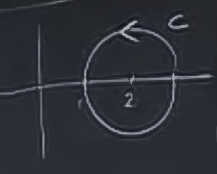
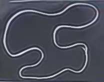
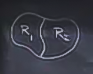
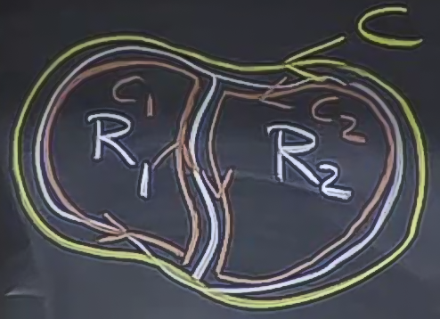
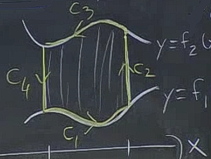
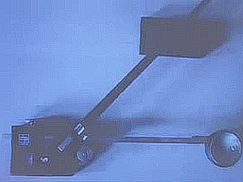
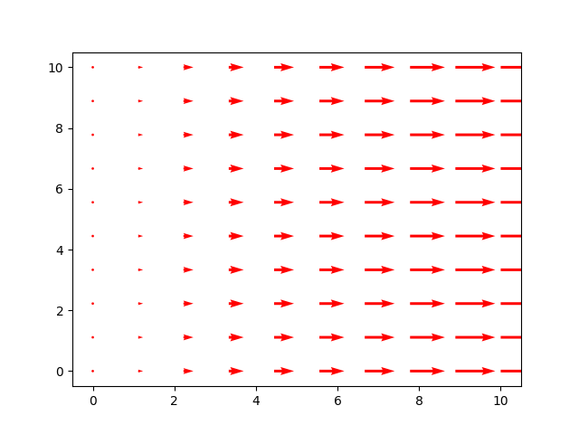
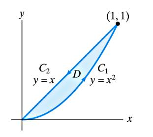
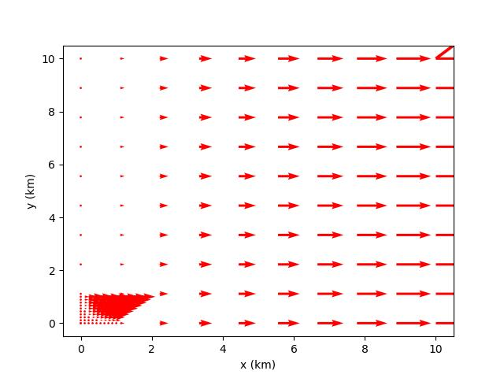

# Ders 22

Diyelim ki genel bir vektör alanımız var, ve bu alan muhafazakar değil, biz
kapalı bir eğri içinde çizgi entegrali hesaplamak istiyoruz, bu entegral
sıfır olmayacak. Bu hesabı iki metotla yapabiliriz. Ya direk entegral
hesabı yaparız, ya da Green'in Teoremi adlı bir tekniği kullanırız. 

Green'in Teorisi

Eğer $C$ eğrisi $R$ alanını tanımlayan kapalı bir eğriyse, bu eğri
üzerindeki hareket saat yönünün tersi ise, ve elimde eğrinin ve içindeki
alanın her noktasında tanımlı ve türevi alınabilir bir vektör alanı
$\vec{F}$ var ise, o zaman 

$$ \oint_C \vec{F} \cdot \mathrm{d}\vec{r} = \int \int_R \mathrm{curl} \vec{F} \mathrm{d} A $$

Diğer bir formda 

$$ \oint_C M \mathrm{d} x + N \mathrm{d} y = \int \int_R (N_x - M_y) \mathrm{d} A $$

Üstteki her iki formülde de eşitliğin iki tarafının birbirinden ne kadar
farklı hesaplar olduğuna dikkat edelim. Mesela bir üstteki formülün sol
tarafı bir çizgi entegrali, bir (mesela) $t$ üzerinden birbirine bağlı iki
$x,y$ değişkeninin, bir şekilde birbirine bağlı şekilde değişen $x,y$
değişkenleri üzerinden bir entegral hesabı bu. Ama aynı formülde eşitliğin
sağ tarafı eğrinin "içindeki'' bölgede, bu bölgedeki her nokta için
geçerli. Bu bölgede $x,y$ birbirinden bağımsız. 

Peki niye saat yönü tersi dedik? Bu aslında herhangi bir yön olabilir, ama
bu yön $N_x-M_y$ ile uyumlu, eğer saat yönü olursa, ona göre bir $M_x,N_y$
ifadesinin kullanılması gerekir. 

Örnek

$C$ eğrisi $(2,0)$ noktasında çizilmiş 1 yarıçaplı bir çember
olsun. Gidişat saat yönü tersinde. 



$$ \oint_C ye^{-x} \mathrm{d} x + (\frac{1}{2}x^2 - e^{-x}) \mathrm{d} y $$

Direk olarak

$$ x = 2 + \cos\theta, dx = -\sin\theta \mathrm{d}\theta $$

$$ y = \sin\theta, dy = \cos\theta \mathrm{d}\theta $$

Sonra üstteki iki satırdaki formülleri alıp entegrale koyardım, ve 0 ile
$\pi$ sınırları arasında entegrali hesaplardım. 

Tüm bu işlemler yerine Green'in Teorisini kullanalım. Yani çift entegral
hesabını yapalım. $M,N$ nedir? 

$$ \oint_C 
\underbrace{ye^{-x}}_{M} dx + 
\underbrace{(\frac{1}{2}x^2 - e^{-x})}_{N}dy
$$

Çift entegral o zaman şöyle

$$ \int \int_R (N_x - N_y) \mathrm{d} A = $$

$R$ nedir? Çemberin içindeki her şeydir (çizgili alan). 


$$= \int \int_R \bigg( x+ e^{-x} \bigg) - e^{-x} \mathrm{d} A $$

$$=  \int \int_R  x \mathrm{d} A $$

Peki bu çift entegrali nasıl hesaplayacağız? Tüm cebirsel işlemi
yapabiliriz, ya da, bir kısayol düşünelim. 

$$ = Alan(R) \ \bar{x} $$

Çünkü çift entegral bir alan hesabı yapıyor. $\bar{x}$ ise $R$ alanının
yatay ekşendeki kütle merkezi, ki örneğimiz için bu merkez 2
noktasında. Alan zaten $\pi$, sonuç

$$ = 2\pi $$

Bu arada $\bar{x}$'in tanımı

$$ \bar{x} = \frac{1}{Alan} \int \int x \mathrm{d} A $$


Şimdi Green Teorisinin niye işlediğini, yani ispatını görelim. 

Özel Durum 

$\mathrm{curl} \vec{F} = 0$

Bu durumda $\vec{F}$ muhafazakar. 

$$ \oint_C \vec{F} \cdot \mathrm{d}\vec{r} = \int \int_R \mathrm{curl} \vec{F} \mathrm{d} A $$

Ama curl sıfır ise, o zaman sıfırın entegrali alınır, bu da sıfırdır. 

$$ = 0 $$

Bu aynı zamanda eğer kapalı eğri içindeki her noktada $\mathrm{curl} \vec{F} = 0$ ise,
o zaman $\oint_C \vec{F} \cdot \mathrm{d}\vec{r} = 0$ olduğunun ispatıdır, bu da
$\vec{F}$'in muhafazakar olduğunun ispatıdır.

Problem Set 8 Problem 2 için Green Teorisi uygulanamıyor, çünkü $C$
içinde orijin var. 

İspat

Şunu ispatlamaya uğraşıyoruz

$$ \oint_C M \mathrm{d} x + N \mathrm{d} y = \int \int_R (N_x - M_y) \mathrm{d} A $$

İşimizi kolaylaştırmak için daha basit bir ifadeyi ispat edelim. Üstteki
formülün özel bir hali

$$ \oint_C M \mathrm{d} x  = \int \int_R -M_y \mathrm{d} A $$

bu durumda $N=0$, ve vektör alanında sadece $x$ bileşeni var. 

Peki bu özel şart niye yeterli? İddia o ki eğer bu daha basit ifadeyi ispat
edebilirsem, sadece $y$ bileşenin olduğu diğer şartı da ispat edebilirim,
sonra bu iki özel şartı toplarsam genel şartı elde ederim. 

Diğer özel şart

$$ \oint_C N \mathrm{d} y  = \int \int_R N_x \mathrm{d} A $$

Bir problem daha var, eğer eğri çetrefil ise çift entegrali oluşturmak zor
olabilir. 



O zaman daha basit eğrilerle ise başlamak daha iyi. 

Bir diğer gözlem daha, $R$'i daha basit bölgelere ayırabiliriz. 




Eğer 

$$ \oint_{c_1} M \mathrm{d} x  = \int \int_{R_1} -M_y \mathrm{d} A $$

$$ \oint_{c_2} M \mathrm{d} x  = \int \int_{R_2} -M_y \mathrm{d} A $$

ifadelerinin doğru olduğunu ispatlarsam, o zaman $C$ için olan ifadenin
doğruluğunu ispatlayabilirim, çünkü üstteki iki formülü toplayabilirim. 

Peki üstteki iki formülde sol taraf toplandığında $R$ bölgesini kabaca
ortadan bölen eğriyi iki kere toplamış olmaz mıyım? Aslında evet, ama o
eğri üzerindeki gidişata dikkat, biri yukarı, diğeri aşağı yönde. O zaman o
parça iki kere toplanınca birbirlerini iptal edecekler ve sonuç sıfır olacak.

O zaman 

$$
\oint_C M \mathrm{d} x = \oint_{C_1} + \oint_{C_2} =
\int \int_{R_1} + \int \int_{R_2} = \int \int_R -M_y \mathrm{d} A
$$

Örnek olarak şöyle bir şekli alalım. Bu şekli dikey ve "basit'' olarak ve
5 parçaya bölüyoruz.


Bu ne demek? 

$$ a < x < b, \ f_1(x) < y < f_2(x) $$

Kesik çizgilerin x bileşenini $a,b$ olarak alırsak, bu noktaların $y$
değerleri de dikey (kesik) çizgiler arasında kalıyor. 

Ana İşlem

Eğer $R$ dikey ve basit ise, ve $C$, saat yönü tersi olmak üzere $R$'nin
sınırını oluşturuyorsa, 

$$ \oint_C M \mathrm{d} x  = \int \int_R -M_y \mathrm{d} A $$

ifadesini ispatla. 


Üstteki de basit olarak bölünmüş bir bölgeyi gösteriyor. Çizgili bölümü
nasıl hesaplarız?



Eğriyi 4 parçaya ayırırız. 

$C_1$

$$ y = f_1(x) $$

$x$ değeri $a$'dan $b$'ye gidiyor. 

$$ \int_{c_1}M(x,y) \mathrm{d} x = \int_a^b M(x,f_1(x)) \mathrm{d} x$$

Burada tek değişken üzerinden entegral alabilirim. Tabii bu ispatta $M$
ifadesini bilmediğim için bunu yapamam, tanımı burada bırakırım. 

$C_2$

$x$ değeri $b$, $dx = 0$

$$ \int_{c_2}M(x,y) \mathrm{d} x = 0$$

Aynı şekilde $C_4$ sıfır olur. 

$C_3$

$$ y = f_2(x) $$

$x$ değeri $b$'dan $a$'ya gidiyor. 

$$
\int_{c_2}M(x,y) \mathrm{d} x = \int_b^a M(x,f_2(x)) \mathrm{d} x = - \int_a^b M(x,f_2(x)) \mathrm{d} 
x 
$$

Hepsini toplarsak

$$
\oint_C M \mathrm{d} x  =
\int_a^b M(x,f_1(x)) \mathrm{d} x - \int_a^b M(x,f_2(x)) \mathrm{d} x 
\qquad (1)
$$

Şimdi çift entegrale bakıyorum, ve bakalım bu çift entegrali üstteki
ifadeye eşitleyebilecek miyim. 

$$
\int \int_R -M_y \mathrm{d} A
= - \int_a^b \int_{f_1(x)}^{f_2(x)} \frac{\partial M}{\partial y} \mathrm{d} y \mathrm{d} x
$$

Daha önce söylemiştik, bölgeyi belli basit, belli bir şekilde seçmemizin
sebebi $dy,dx$'i ayarlamamızın kolay olması içindi. Yani çift entegral için
kesitler hazırlarken bu kesitlerin kolay olması için bölgeyi böyle
seçtik. 

İçteki entegral

$$ \int_{f_1(x)}^{f_2(x)} \frac{\partial M}{\partial y} \mathrm{d} y =
M(x,f_2(x)) - M(x,f_1(x))
 $$

Geri koyarsak

$$
\int \int_R -M_y \mathrm{d} A
= - \int_a^b M(x,f_2(x)) - M(x,f_1(x)) \mathrm{d} x
$$

Bu ifade (1) ifadesi ile aynı. İspat tamamlandı. Çünkü özel şart dikeysel
basit bölgelerde ispat geçerli, bu faraziyeyi ortadan kaldırırsak, tüm
bölgeler için ispat geçerli. $y$ bileşeni için de aynı şey geçerli, o zaman
genel teori ispatlanmış oldu.

Güzel Bir Örnek 

Green'in Teorisi için bir örnek şudur. Bilgisayarlar bu kadar yaygın olmadan
önce deneysel fizikçiler deneylerden sonra bir kağıt, düzey üzerinde
deneylerinin sonuçlarını baskı halinde alırlardı. Bu noktalar belli
bölgede, bir eğri içinde olurdu. Fakat bu bölgenin alanı lazımdı, bu hesap
nasıl yapılacaktı?



Üstteki planımeter denen alet buna yarıyordu. Kollardan birini alttaki gibi
bir çıktı üzerinde, onun eğrileri üzerinde gezdirip, başladığınız noktaya
dönünce, alet pat diye size hemen sonucu söylüyordu. Nasıl ?


Bunu çizgisel entegrali hesaplayarak yapıyordu. Green'in Teorisine göre
çizgisel entegral, alanı içeren entegrale eşit olduğu için doğru sonucu
veriyordu.

$$ \oint_C x \mathrm{d} y  = \int \int_R 1 \mathrm{d} A = Alan(R) $$

Alet eşitliğin solundaki hesabı yapıyor, bize aradığımız sağdaki sonucu
veriyordu yani. 

Eğer aletin nasıl işlediği hakkında bir spekülasyon yapmak gerekirse,
vektör alanı $x$'i ele alalım (çizmek için gerekli kod ile)

```python
x = linspace(0,10.,10)
y = linspace(0,10.,10)
x,y = meshgrid(x,y)
u = x*10
v = np.zeros(y.shape)
q = plt.quiver(x,y,u,v,angles='xy',scale=1000,color='r')
p = plt.quiverkey(q,1,16.5,50,"50 m/s",coordinates='data',color='r')
plt.savefig('field_x.png')
```



Bu vektörler mekanik alet içinde belki teller, ya da demir çubuklar olarak
gösteriliyor olabilir. Hareket ettirilen kol, kadran gezdirilirken "dikey
hareket farkı'' yani $dy$ bir şekilde alınıyor (belki de işi basitleştirmek
için önceden tanımlı bir sabit olarak kabul edildi), sonra gezdirilme
sırasında hangi tele (vektöre) "çarpıldıysa'' dikey fark bu vektörün
değeri ile bir şekilde çarpılıp, başka bir mekanik bileşende
toplanıyor. Başa dönülünce eldeki toplam aranan alan değeri olacaktır.

Not: En basit ok çizimi için alttaki kod kullanılabilir

```python
u = 200
v = 200
q = plt.quiver(10,10,u,v,angles='xy',scale=1000,color='r')
p = plt.quiverkey(q,1,16.5,50,"50 m/s",coordinates='data',color='r')
xl = plt.xlabel("x (km)")
yl = plt.ylabel("y (km)")
```

Ekler

Green'in Teorisi, Uzaklaşım, Stokes

Green'in Teorisi

Bu teorinin detayları, ispatı [2]'de bulunabilir. Tekrar üzerinden geçmek
gerekirse, [4, sf. 429] bazlı anlatalım, iki boyutta elimizde bir $D$ bölgesi
etrafındaki $C$ eğrisi var, ve $F(x,y) = M(x,y) *i* + N(x,y) *j*$
$D$ içinde vektör alanı olsun, o zaman alttaki ifade doğrudur,

$$
\int_C M \mathrm{d} x + N \mathrm{d} Y =
\int \int_D \left(
  \frac{\partial N}{\partial x} - \frac{\partial M}{\partial y}
  \mathrm{d} x \mathrm{d} y
\right)
$$

$\int_C$ ki bazen $\oint_C$ ile gösterilir, bir eğri üzerinden alınan bir
entegraldır. Eşitliğin sol tarafı bazen bir $\mathrm{d}\vec{s}$ üzerinden de
sunulabilir,

$$
\int_C \vec{F} \cdot \mathrm{d}\vec{s} = \int_C M \mathrm{d} x + N \mathrm{d} Y 
$$

Bu cebirsel bir özet sadece, $\mathrm{d}{\vec{s}} = [\begin{array}{cc} \mathrm{d} x & \mathrm{d} y \end{array}]^T$
sonuçta ve noktasal çarpım bize iki üstteki ifadeyi verecektir.

Örnek

Bir vektör alanı $\vec{F} = xy *i* + y^2 *j*$ olsun, ve bu
alanda birinci dörtlük içinde $y = x$ çizgisi ve $y=x^2$ parabolu arasındaki
bölgeyi düşünelim. Bu bölge ve alan üzerinden Green'in Teorisini doğrulamaya
uğraşalım.

Grafik şu şekilde,



Vektör alanı (100 ile çarpıp vektörleri büyüttük gözüksün diye),

```python
x = np.linspace(0,1.,10)
y = np.linspace(0,1.,10)
x,y = np.meshgrid(x,y)
SCALE = 100.0
u = x*y*SCALE; v = (y**2)*SCALE
v = np.zeros(y.shape)
q = plt.quiver(x,y,u,v,angles='xy',scale=1000,color='r')
p = plt.quiverkey(q,1,16.5,50,"50 m/s",coordinates='data',color='r')
plt.savefig('calc_multi_75_green_01.jpg')
```



Eğri iki parça olarak analiz edilecek, $C_1$ ve $C_2$.  Eğri üzerinden gereken
tüm entegral,

$$
\int_C \vec{F} \cdot \mathrm{d}{\vec{s}} = \int_C xy \mathrm{d} x + y^2 \mathrm{d} y
$$

Bu entegral iki parça üzerinden alınmalı ve sonuç toplanmalı,

$$
= \int_{C_1} xy \mathrm{d} x + y^2 \mathrm{d} y + \int_{C_2} xy \mathrm{d} x + y^2 \mathrm{d} y
\label{2}
$$

Eğriyi parametrize edelim, böylece $\mathrm{d} x$, $\mathrm{d} y$ üzerinden entegraller
kolaylaşsın,

$$
C_1: x = t, y = t^2, \quad 0 \le t \le 1
$$

$$
C_2: x = 1-t, y = 1-t, \quad 0 \le t \le 1
$$

$C_1$,$C_2$ gidişat yönlerine dikkat, mesela eğri ile yukarı çıkış var, ama düz
eğri ile aşağı iniyoruz, bu sebeple $t$ sıfırdan başlarken $x,y$ değerleri
$(1,1)$, öyle ayarladık, ve en sonda $t=1$ olduğu anda $x,y$ değerleri $(0,0)$
oluyor. 

Şimdi parametrize edilmiş değişkenlerle (2) formülünü tekrar yazalım,

$$
= \int_{0}^{1} ( t \cdot t^2 + t^4 \cdot 2t ) \mathrm{d} t +
\int_{0}^{1} ((1-t)^2 + (1-t)^2) (-\mathrm{d} t)
$$

$$
= \int_{0}^{1} (t^3 + 2t^5) \mathrm{d} t + \int _{0}^{1} 2 (1-t)^2 (-\mathrm{d} t)
$$

$$
= (\frac{1}{4} t^4 + \frac{2}{6} t^6) \big\vert_{0}^{1} +
(\frac{2}{3} (1-t)^3 ) \big\vert_{0}^{1}
$$

$$
= \frac{1}{4} + \frac{2}{6} - \frac{2}{3} = -\frac{1}{12}
$$

Green'in Teorisinin sağ tarafına bakalım şimdi, 

$$
\int \int_D \frac{\partial N}{\partial x} - \frac{\partial M}{\partial y} \mathrm{d} x \mathrm{d} y =
\int \int_D \left(
\frac{\partial }{\partial x}(y^2) - \frac{\partial }{\partial y}(xy) \mathrm{d} x \mathrm{d} y
\right)
$$

$$
= \int_{0}^{1} \int_{x^2}^{x} -x \mathrm{d} y \mathrm{d} x =
\int_{0}^{1} -x (x-x^2) \mathrm{d} x =
\int_{0}^{1} (x^3 - x^2) \mathrm{d} x = (\frac{1}{4} x^4 - \frac{1}{3} x^3 ) \bigg\vert_{0}^{1}
$$

$$
= \frac{1}{4} - \frac{1}{3} = -\frac{1}{12}
$$

Aynı sonuca eriştik.

[devam edecek]

Gauss-Green Eşitliği

Gauss-Green eşitliği iki boyutta şu şekilde gösterilebilir [1, sf. 262],

$$
\iint_R (\nabla u ) \cdot w \mathrm{d} x \mathrm{d} y =
\iint_R u (- \mathrm{div} w) \mathrm{d} x \mathrm{d} y + \int_C u w \cdot n \mathrm{d} s
$$

Türetmek için başlangıç noktası $uv$ üzerinde uzaklaşım almak. Aslında
ileride göreceğimiz gibi çok boyutta parçalı entegral tekniği Gauss-Green'in
uzantısı bir bakıma ve tek boyutta gördük ki [3] parçalı entegrale erişmek
için de Calculus'un çarpım kuralından başlanmıştı.

$$
\mathrm{div} (uw) = \mathrm{div} (u w_1 + u w_2) =
\frac{\partial u}{\partial x} w_1 +
\frac{\partial w_1}{\partial x} u +
\frac{\partial u}{\partial y} w_2 +
\frac{\partial w_2}{\partial y} u 
$$

Gruplarsak,

$$
= \left( 
\frac{\partial u}{\partial x} w_1 +
\frac{\partial u}{\partial y} w_2 \right) +
\left( 
\frac{\partial w_1}{\partial x} u +
\frac{\partial w_2}{\partial y} u \right)
$$

Daha kısa şekilde,

$$
\mathrm{div} (uw) = \nabla u \cdot w + u \mathrm{div}(w)
$$

Üstteki ifade üzerinde Uzaklaşım Teorisi'ni uygulayalım. Önce
$\iint_R \mathrm{div} (uw)$,

$$
\iint_R \mathrm{div} (uw) \mathrm{d} x \mathrm{d} y= \iint_R \nabla u \cdot w + u \mathrm{div}(w) \mathrm{d} x \mathrm{d} y
$$

$$
= \iint_R \nabla u \cdot w  \mathrm{d} x \mathrm{d} y + \iint_R u \mathrm{div}(w) \mathrm{d} x \mathrm{d} y
$$

Uzaklaşım Teorisi'ne göre sağ taraf $\int_C uw \cdot n \mathrm{d} s$ olmalı, yani

$$
\iint_R \nabla u \cdot w  \mathrm{d} x \mathrm{d} y + \iint_R u \mathrm{div}(w) \mathrm{d} x \mathrm{d} y = \int_C uw \cdot n \mathrm{d} s
$$

Eşitliğin sol tarafındaki ikinci terimi sağa geçirirsek,

$$
\iint_R \nabla u \cdot w  \mathrm{d} x \mathrm{d} y =
\iint_R u (-\mathrm{div} w) \mathrm{d} x \mathrm{d} y + \int_C uw \cdot n \mathrm{d} s
$$

[1] notasyonu ile $\nabla$ yerine $\mathrm{grad}$,

$$
\iint_R \mathrm{grad} u \cdot w  \mathrm{d} x \mathrm{d} y =
\iint_R u (-\mathrm{div} w) \mathrm{d} x \mathrm{d} y + \int_C uw \cdot n \mathrm{d} s
\qquad (3)
$$

Böylece Gauss-Green eşitliğine erişmiş olduk.

Green'in İlk Eşitliği 

Eğer (3) içinde $w$ için $\mathrm{grad} u$ sokarsak, bu bize Green'in İlk Eşitliği (Green's First
İdentity) denen formülü veriyor [1, sf. 281], 

$$
\iint_R \mathrm{grad} u \cdot \mathrm{grad} u  \mathrm{d} x \mathrm{d} y =
\iint_R u (-\mathrm{div} \mathrm{grad} u) \mathrm{d} x \mathrm{d} y + \int_C u \mathrm{grad} u \cdot n \mathrm{d} s
$$

Gradyanın uzaklaşımı bazen $\Delta$ notasyonu ile gösterilir, öyle yapalım,

$$
\iint_R | \mathrm{grad} u |^2  \mathrm{d} x \mathrm{d} y = - \iint_R u (\Delta u) \mathrm{d} x \mathrm{d} y +
\int_C u \mathrm{grad} u \cdot n \mathrm{d} s
$$

Eşitliğin sağından, solundan birkaç yer değişim sonrası,

$$
\iint_R u (\Delta u) \mathrm{d} x \mathrm{d} y =
- \iint_R | \mathrm{grad} u |^2  \mathrm{d} x \mathrm{d} y
+ \int_C u \mathrm{grad} u \cdot n \mathrm{d} s
$$

Böylece [1, sf. 281]'daki forma erişmiş olduk. Bu Green'in İlk Eşitliği.

Kaynaklar

[1] Strang, *Computational Science and Engineering*

[2] Bayramli, *Cok Degiskenli Calculus, Ders 23*

[3] Bayramlı, *Diferansiyel Denklemler, Ekler*

[4] Colley, *Vector Calculus*


