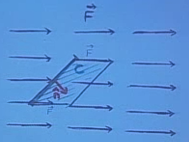
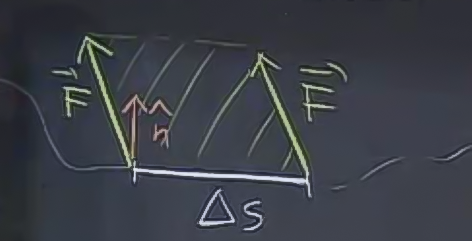
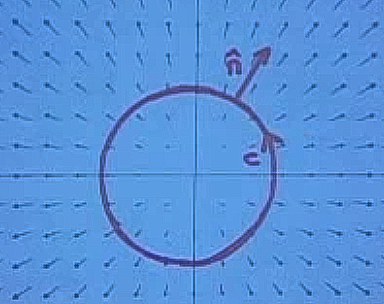
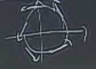
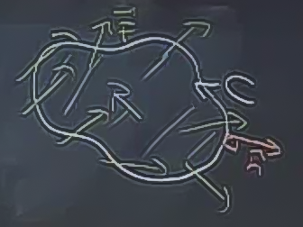
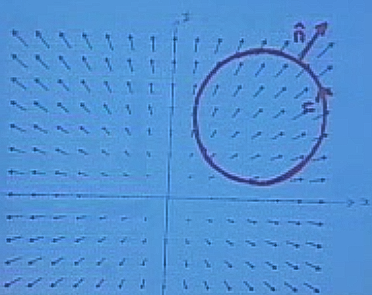

# Ders 23

Akış (Flux)

Aslında akış çizgisel entegrallerin değişik bir şeklidir. Diyelim ki $C$ kapalı
eğrisi ve $\vec{F}$ vektör alanı var, o zaman $C$ üzerinden $\vec{F}$'in akışı

$$ \int_C \vec{F} \cdot \hat{n} \mathrm{d} s $$

olarak gösterilir. Şimdi bu entegral içindeki öğelerin ne olduğunu tarif
edelim. 

$\hat{n}$ = $C$ eğrisine dik olan birim normal vektördür, $\vec{T}$'ye 90 derece
saat yönünde diktir. Saat yönünde dedik çünkü mesela üstteki resimde en soldaki
$\hat{n}$ yukarı da işaret ediyor olabilirdi, onu değil, aşağı doğru gideni
seçtik.

Entegral neyi hesaplar? Eğri üzerindeki her noktada, vektör alanı ile aynı
eğrinin normalleri ile yapılan çarpımların toplamını. Yani $C$'yi en ufak
parçalar $\Delta s$'lere ayırınca akış

$$
\lim_{\Delta s \to 0} 
\bigg( \sum \vec{F} \cdot \hat{n}  \Delta s \bigg)
$$

olur. Bu kavramı daha önce hesapladığımız "yapılan iş'' karşılaştırmak
gerekirse

$$ \int_C \vec{F} \cdot \mathrm{d}\vec{r} = \int_C \vec{F} \cdot \vec{T} \mathrm{d} s $$

İşi hesaplarken her noktada $\vec{F}$'in eğri $C$'nin teğetine yansımasını
hesaplıyorum. 

Yani eğri üzerinde hareket ederken "$\vec{F}$ ile ne kadar birlikte, ne
kadar ona ters şekilde'' hareket edildiğinin hesabını yapılan iş veriyor. 

Kıyasla akış hesabı, eğri üzerinde hareket ederken $\vec{F}$'in eğrinin "ne
kadar içinden geçtiğinin'' hesabı. Rüzgarlı bir havada bir yolda yürüyorum, akış
rüzgarın bana ne kadar yandan çarptığını gösteriyor. Akış hesabı bu çarpış sağa
doğru olunca onu pozitif, sağa doğru olunca onu negatif olarak hesaplar.

Yani yapılan iş $\vec{F}$'in teğetsel bileşenlerinin, yansımasının toplamı
ise, akış $\vec{F}$'in normal bileşenlerinin toplamıdır. Bu ufak fark
haricinde bu iki hesap birbirinin aynısıdır. Yani fiziksel anlamları çok
farklı olabilir fakat matematiksel anlamda ikisi de bir çizgisel entegral,
ve hesaplanışları, tanımları birbirine benzer. 

Anlatım bağlamında iş hesabı için $\vec{F}$'i bir kuvvet alanı olarak görmek
anlatımı rahatlatıyor ($\vec{F}$ başka bir şey de olabilir). Akış
bağlamında $\vec{F}$'i bir hız alanı (velocity field) olarak görmek
benzer bir rahatlık sağlıyor. 

Bir sıvıyı düşünürsek, akış birim zamanda $C$'nin içinden ne kadar sıvının
geçtiğini gösterir. Diyelim ki böyle bir alan alttaki gibi

Alan bir sabit alan, ama herhangi bir alana yeterince zoom edersek, o zaman
görüntüsünün üstteki gibi olacağını düşünebiliriz. Şimdi bu alan içinde
$C$'nin bir parçası $\Delta s$'i hayal edelim, ve birim zaman içinde bu
alanın parçamız içinden geçişini hayal edelim [hoca iki saydam üst üste
getirerek o parçayı oraya koydu, alanın geçişini göstermek için parçayı
sola hareket ettiriyor, yani alanın sağa doğru geçişini görüyoruz].

Bu geçiş birim zaman içinde üstteki gibi bir şekil oluşturacaktır, bu
şekil bir paralelogramdır. Paralelogramı daha iyi görebilmek için üstteki
resmi alıp 90 derece sola çevirelim, 

Alan hesabı için paralelogramın yüksekliği lazım, $\hat{n}$ bunun için
gerekiyor. 

$$ \textrm{Alan}  = \textrm{baz} \cdot \textrm{yükseklik} $$

$$ = \Delta s \cdot (\vec{F} \cdot \hat{n} )$$

Tüm bu hesapları her parça için toplarsak akışı elde ederiz. 

Yaklaşıksallığın bozulmaması için $\Delta s$'in oldukça küçük olması, ve
zaman biriminin de ufak olması gerekir, mesela mikrosantim ile nanosaniye
gibi, yoksa $\vec{F}$ sabit bir alan olarak görülemez. 

Örnek

$C$ orijinde oturan $a$ yarıçapındaki, saat yönü tersinde bir çember eğri. 

$$ \vec{F} = x\hat{i} + y\hat{j} $$

Geleneksel olarak saat yönü tersi, ve pozitif geçiş sağa doğru alındığı
için bunun sonucu olarak alan kapalı eğriden "dışarı'' çıkmış olur. 

Bir çemberde olduğum için normal sürekli çembere tam dik konumda, ve
$\vec{F}$'e sürekli paralel. O zaman 

$$ \vec{F} \cdot \hat{n} = |\vec{F}||\hat{n}| $$

Fakat $\hat{n}$ birim vektör olduğu için uzunluğu 1, o zaman

$$  = |\vec{F}| $$

Bu vektör alanının büyüklüğü nedir? Yani alanın her $x,y$ noktasındaki
vektörün büyüklüğü (magnitude) nedir? Vektör büyüklüğü karelerin toplamının
kareköküdür, $\sqrt{x^2 + y^2}$, ki bu büyüklük orijinden olan uzaklığa
eşittir. O zaman orijinde oturan çember üzerinde isek, uzaklık çemberin
yarıçapına eşittir, yani $a$. Yani üstteki formül şöyle olur

$$ \vec{F} \cdot \hat{n} = |\vec{F}| = a$$

Çizgi entegrali bayağı kolay o zaman

$$ \int_C \vec{F} \cdot \hat{n} \mathrm{d} s 
= \int_C a \mathrm{d} s  = a \cdot \textit{C'nin uzunluğu}
$$

C'nin uzunluğu $2\pi a$ olduğuna göre

$$ = 2\pi a^2 $$

Bu büyüklük beklenebileceği üzere pozitif, çünkü akış çemberden dışarı doğru.

Örnek

Aynı $C$ ama değişik $\vec{F}$ (bizim diğer favori vektör alanımız), 

$$ \vec{F} = < -y,x > $$

Fakat burada vektörler her zaman çembere teğet, o zaman o vektörlerin dik
bileşeni olamaz, yani sıfır olur. Burada akış olmadığını çıplak gözle bile
görebiliyoruz. $\vec{F} \cdot \hat{n} = 0$, o zaman akış = 0. 

Tabii ki hesabı yapmak için geometri her zaman yardım edemeyebilir, her durumda
işleyecek bir metot gerekli, aynen iş hesabını yaptığımızda $M \mathrm{d} x + N \mathrm{d} y$
hesabını yaptığımız gibi. Akış hesabında benzer bir yaklaşım var.

Bileşenleri Kullanarak Hesap

Hatırlarsak iş hesabında 

$$ d\vec{r} = \vec{T} \mathrm{d} s = < \mathrm{d} x, \mathrm{d} y > $$

olmuştu. O zaman düşünelim, üstte $\vec{T} ds$ kullandık, burada onun
yerine $\hat{n} \mathrm{d} s$ var, onu nasıl temsil edebiliriz? 

$\hat{n}$ aslında $\vec{T}$'nin saat yönünde 90 derece döndürülmüş hali
değil midir? O zaman 

$$ \hat{n}ds = < \mathrm{d} y,-\mathrm{d} x > $$

Dönüş saat yönünde olduğu için eksi işaret $dx$ önünde. 

Demek ki $\vec{F} = < M,N >$ için

$$
\int_C \vec{F} \cdot \hat{n} \mathrm{d} s =
\int_C  < M,N > \cdot < \mathrm{d} y,-\mathrm{d} x > =  \int_C -N \mathrm{d} x + M \mathrm{d} y
$$

Gerisi iş hesabında gördüğümüz gibi. $x,y$ birbiriyle alakalı, çoğunlukla
üçüncü bir değişken $t$, $\theta$, vs gibi, üstteki formülü bu ortak
değişken çerçevesinde tekrar yazıyoruz, sonra entegrali çözüyoruz. 

Peki Green'in Teorisi'nde yaptığımızı burada da yapabilir miyiz? Yani çizgi
entegralinin yerine bir çift entegral geçirmek. Cevap evet, akış hesabı için de
işleyen Green Teorisi'nin bir versiyonu var.

Akış İçin Green Teorisi

Eğer $C$ bir $R$ alanını çevreliyorsa ve yönü saat yönü tersinde ise, ve
$\vec{F}=< P,Q >$ $R$ içinde her yerde türevi alınabilir ise, o zaman 

$$ \oint_C \vec{F} \cdot \hat{n} \mathrm{d} s = 
\int \int_R \mathrm{div} \vec{F} \mathrm{d} A
$$

$div$ kelimesi uzaklaşım (divergence) kavramından geliyor ve formülü şöyle:

$$ \mathrm{div} < P,Q > = P_x + Q_y $$

Bu hesabı hatırlamak $curl$ formülünü hatırlamaktan daha basit aslında,
$x,y$ üzerinden kısmi türevler alınıyor ve bu türevler normal $P,Q$ sırası
üzerinde uygulanıyor, sonuç toplanıyor. 

Akış hesabı, o zaman, $C$ içinden geçerek $R$'den dışarı çıkan akış
hesabıdır. Üstteki resimde mesela $C$'nin sağ kısmına etki eden $\vec{F}$
pozitif etki ederler, sol kısmındakiler negatif olurlar (içeri giriyorlar)
ve bunların toplamı tüm akışı verecektir. 

Bu formüle "normal formdaki Green Teorisi'' ismi de veriliyor. İş hesabı
için olan anormal (!) olduğu için değil tabii, sadece o form teğetsel,
buradaki normal. 

İspat

Şunu ispat etmeye çalışıyoruz

$$
\oint_C -Q \mathrm{d} x + P \mathrm{d} y = \int \int_R (P_x + Q_y) \mathrm{d} A 
\qquad (1)
$$

Bu formülü bir önceki derste kullandığımız ispattaki forma indirgemeye
uğraşalım. Cebirsel olarak sol kısmı şöyle görelim

$$ \oint_C 
\underbrace{-Q}_{M}dx + 
\underbrace{P}_{N}dy 
$$

Yani 

$$ M = -Q $$

$$ N = P $$

Önceki dersten biliyoruz ki 

$$
\oint_C M \mathrm{d} x + N \mathrm{d} y = \int \int_R (N_x - M_y) \mathrm{d} A 
\qquad (2)
$$

Şimdi (1) içindeki $P_x$ ve $Q_y$ nedir, onları bulalım. 

$$ P_x = N_x $$

$$ Q_y = -M_y $$

Bunları (1) içinde yerine koyarsak (2) formülünü elde ettiğimizi görürüz. Demek
ki Green Teorisi'nin bu formu eskisi ile ilintili ve doğru.

Örnek

Önceki örnek ile aynı vektör alanı, ama bu sefer geometrik değil cebirsel
çözüm kullanacağız. 

$$ \vec{F} = x\hat{i} + y\hat{j} $$

Eğri $C$ bir çember ve yarıçapı $a$. 

Önce $\mathrm{div} \vec{F}$'i hesaplamak lazım. 

$$ \mathrm{div} \vec{F}  = 
\frac{\partial }{\partial x}(x) + 
\frac{\partial }{\partial y}(y) = 
1 + 1 = 2 
 $$

$$
\oint_C \vec{F} \hat{n} \mathrm{d} s = 
\int \int_R 2 \mathrm{d} A = 2 \int \int_R \mathrm{d} A = 
2 \cdot \textit{R'nin alanı}
$$

$$ = 2\pi a^2 $$

Bu daha önce bulduğumuz sonuç ile aynı.

Peki ya $C$ orijinde değil başka bir yerde olsaydı? Mesela 

Çizgi entegralını hesapladığımız durumda bu çemberin parametrizasyonunu
bulup, o noktadaki vektör alanı ile etkileşimini hesaplardık, vs. ve işler
uzardı. Ama Green'in Teorisine bakarsak orada çemberin merkezinin nerede
olduğuyla alakalı hiçbir varsayım yok. O zaman $C$ nerede olursa olsun
sonuç her zaman $2\pi a^2$ çıkacak. 

Şimdi genel bir soruya gelelim. 

Uzaklaşım yani $\mathrm{div}$ neyi ölçer? $\mathrm{curl}$'un rotasyonel bir hesap yaptığını
biliyoruz.

1) $\mathrm{div}$ akışın ne kadar "yayıldığını'', "genişlediğini'' ölçer
diyebiliriz. Mesela çemberli örnekte her şey dışarı çıkıyor, bir genişleme var,
$\mathrm{div}$ pozitif. Eğer akış tersine olsaydı (her şey içeri doğru) o zaman $\mathrm{div}$
negatif olurdu.

2) Kaynak sağlama oranı, yani birim zamanda, birim alanda bir alandan,
mesela ne kadar sıvının dış sisteme "çıktığı'', "eklendiği''. Mesela
üstteki örnekte $\mathrm{div} \vec{F} = 2$ demek, bu alandan dış sisteme sürekli
sıvı ekleniyor, sıvı dışarı çıkıyor anlamına gelir.

