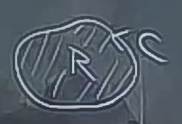
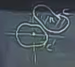
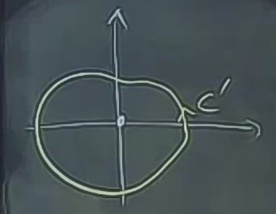
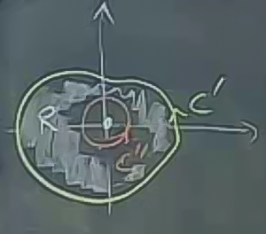
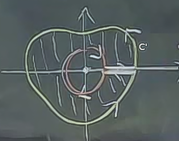
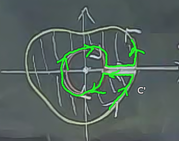
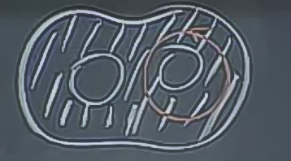

# Ders 24

Green'in Teorisinin iki şeklini görmüştük

$$ \oint_C \vec{F} \cdot \vec{T} \mathrm{d} s = \int \int_R \mathrm{curl} \vec{F} \mathrm{d} A $$

$$ \oint_C \vec{F} \cdot \vec{n} \mathrm{d} s = \int \int_R \mathrm{div} \vec{F} \mathrm{d} A $$

Bu eşitliklerin sol tarafı için $\vec{F}$'in sadece $C$ üzerinde tanımlı
olması yeterlidir. Fakat eşitliklerin anlamlı olması için, yani sağ
tarafının da doğru olması için $\vec{F}$'in $R$ içindeki her noktada tanımlı
olması gerekir. Eğer $R$ içinde tanımlı olmayan tek bir nokta bile varsa, o
zaman üstteki eşitlikleri kullanamayız.

Örnek 

$$ \vec{F} = \frac{ -y\hat{i} + x\hat{j}}{x^2+y^2} $$

Üstteki $\vec{F}$ orijinde tanımlı değildir, diğer her yerde $\mathrm{curl} \vec{F} =
0$.  İki olasılığa bakalım, diyelim ki "şekilsel'' olarak benzer alanlar
orijini içeren, bir de içermeyen şekillerde verilmiş

Orijin içermeyen alan için

$$
\oint_C \vec{F} \cdot \mathrm{d}\vec{r} = 
\int \int_R \underbrace{\mathrm{curl} \vec{F}}_{0} \mathrm{d} A  = 0
$$
 
Orijin içeren alan için Green Teori'sini kullanamayız, çünkü çift entegral
için alan tanımı her yerde tutmalı, ama burada alan tanımı orijinde
geçersiz. Ama "kullanamayız'' derken aslında "direk olarak kullanamayız''
demek daha doğru olur, dolaylı olarak Green Teori'sini kullanmanın bir yolu
var. Tüm alan için olmasa da alanın bir parçası için Green Teori'sini
kullanabilirim. 

Eğer şu alan için GT kullanamıyorsam

Üstteki bölgenin ortasındaki ufak bir bölgeyi çıkartırsam, geri kalan
üzerinde GT kullanabilirim

$$
\oint_{C'} \vec{F} \cdot \mathrm{d}\vec{r} - 
\oint_{C''} \vec{F} \cdot \mathrm{d}\vec{r}  =
\int \int_R \mathrm{curl} \vec{F} \mathrm{d} A 
$$
 
Fakat üstteki formülü nasıl uygulayacağız? Şöyle bir ek düşünelim, 

İki eğri arasında bir "köprü'' gibi bir geçiş noktası var, bu sonsuz
küçüklükteki bir aralık. Öyle ki bu aralık ile dış eğriden iç eğriye,
oradan tekrar dışarı çıkıyoruz. Kabaca şöyle gösterilebilir (yeşil çizgi)

Şimdi bu kesintisiz eğri üzerinden Green'in Teori'si kullanabilirim, çünkü
hem tam bir eğri var, hem de tanımsız olan orijin artık hesaba dahil
değil. 

Tüm çizgisel entegral suna eşit 

$$
\oint_{C'} - \oint_{C''} +
\textit{ince kesit bir ileri bir geri toplanıp iptal oluyor}
$$ 

İçerideki kısım entegralinin eksi olarak dahil edilmesinin sebebi, $C''$
üzerindeki dönüşün saat yönünde olması, saat yönü tersi olsaydı artı olarak
alınabilirdi. 

Uzaklaşım (divergence) üzerinden aynı numarayı kullanabiliriz. 

Tanım 

Düzlemdeki bağlangılı bir bölgenin basit şekilde bağlantılı (simply
connected) olduğu söylenir eğer, $R$ içindeki her kapalı eğrinin iç kısmı
yine $R$ içindeyse. 

Bağlantılı derken düz, tek bir parça kastediyoruz.

Mesela alttaki bölge basit şekilde bağlantılı değildir. 

Kırmızı ile gösterilen eğri içindekilerin tamamı $R$ içinde değildir. 

İlk verdiğimiz örnekteki problem, o zaman, tanımlanan bölgenin basitçe
bağlı bir bölge olmamasıydı, orijin noktasında bir delik vardı. 

Eğer $\mathrm{curl} \vec{F} = 0$ ve $\vec{F}$'in tanım alanı (domain of definition) 
basitçe bağlı 
bir bölge ise, o zaman $\vec{F}$ bir gradyan alanı ve muhafazakardır. 

[hoca eski konuların üzerinde geçiyor, bunlar atlandı]

