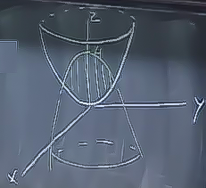
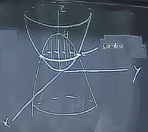
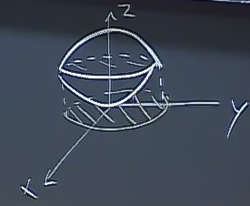
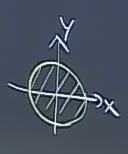
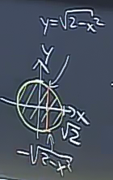
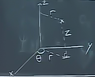
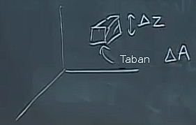
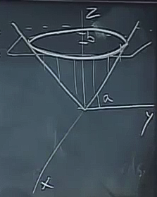
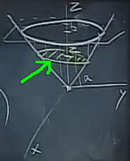
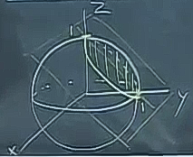

# Ders 25

Geçtiğimiz birkaç haftada düzlemde çift entegral, düzlemde çizgi entegrali
hesaplarını gördük. Artık bu dersten başlayarak benzer teknikleri göreceğiz, ama
bu teknikleri 3 boyutlu uzayda göreceğiz. Yani uzayda üçlü entegral, uzayda akı
(flux), uzayda iş (work), uzaklaşım (divergence), curl hesapları gibi. Bu yeni
hesaplar aslında şimdiye kadar gördüklerimizin ek bir eksen eklenmiş hali, bazı
farklılıklar var, ama kavramsal olarak aynı şeyler. O yüzden tavsiyem eğer
düzlemde yapılan hesapları tam anlamadıysanız, geri dönüp bu konuları bir daha
gözden geçirmeniz.

Üçlü Entegral (Triple Integral)

Eğer 3 boyutta size bir kütle verirsem, 

bu alan üzerinden üçlü entegral alabilirim, 

$$ \int \int \int _R f \mathrm{d} V $$

$V$, hacim (volume) anlamında, yani $dV$ ile $R$ kütlesinin içindeki sonsuz
ufaklıktaki hacimleri düşünüyoruz, ve onları topluyoruz. $dV$ büyüklüğü,
$dx,dy,dz$ sonsuz ufaklıklara tekabül eder, tabii sıralama her türlü
şekilde olabilir.

Eğer ikili olarak özyineli entegralleri nasıl hazırlayacağımızı biliyorsak,
üçlü entegraller de buna benziyor. İki önemli kavram var, biri entegrasyon
alanı, diğeri entegre edilen fonksiyon. Fonksiyon tabii ki entegrasyon
hesabını tamamlarken önemli, ama daha zor olan adım entegrali
hazırlayabilmek. O yüzden bugün hazırlık aşamasına odaklanacağım,
kullanacağım fonksiyonlar basit seyler olacaklar.

Örnek 

Bölge 

$$z = x^2 + y^2$$

ve 

$$z = 4 - y^2 - x^2$$

arasındaki bölge. Diyelim ki bu bölgenin sadece hacmini hesaplamak
istiyorum, yani $f = 1$ yeterli.

$$ \int \int \int 1 \mathrm{d} V $$

Hatırlarsak alan için çift entegrallerde $1 \mathrm{d} A$ kullanmıştık, benzer
numara. Bu arada, evet, bu hesabı çift entegral olarak hayal edebiliriz,
fakat buradaki amacımız üçlü entegrali kurmak. Grafiği çizelim, ilk $z$,

Bu bize en favori paraboloidimizi veriyor, yandan parabol gibi gözüküyor
tabii, ve en alt noktası orijinde. İkinci $z$ de bir paraboloid, ama açık
noktası aşağı bakıyor, $x=y=0$ bize $z=4$ verir [hoca $z=4$ ekseninde bir
işaret atıyor, ve oradan başlayarak ters parabol çiziyor], 

İlgilendiğimiz alan her iki paraboloidin kesiştiği bölge [resimde dikey
sarı renkli işaretlendi]. Peki bu bölgenin en geniş yatay dış sınırı neye
benzer?

Bu sınır bir çember oluşturacaktır. Şimdi bu şeyin hacmini bulalım. Bu
hesabı yapmak, basitleştirmek için pek çok yaklaşım kullanılabilir, üçlü
entegrale bile gerek yok, fakat bunu özellikle yapmak istiyorum. 

İlk önce bir entegrasyon sırası seçmek lazım. Ben ilk önce $z$ üzerinden
entegre etmek istiyorum. Bunun sebebi verili bir $x,y$ için alt ve üst $z$
değerlerini çok çabuk bulabiliriz, $x,y$ düzleminde herhangi bir değer
seçtiğimizi düşünelim, oradan yukarı dikey bir ışın fırlatıyoruz sanki ve
bu işin kesişim alanına nereden giriyor nereden çıkıyor, bunu hemen
bulabiliriz. Alt $z$ tabii ki birinci (çünkü kabın altı daha yakın) üst $z$
ikinci denklemden geliyor olacak. O zaman entegral

$$ 
\int \int \int .. \mathrm{d} z \mathrm{d} y \mathrm{d} x
$$

şeklinde, sınırları belirlersek,

$$ 
\int \int \int\limits_{x^2+y^2}^{4-x^2-y^2}  \mathrm{d} z \mathrm{d} y \mathrm{d} x
$$

İç entegralin sınırları görüldüğü gibi hem 2. hem 3. değişkene bağlı. Şimdi
orta ve dış entegral sınırları için hangi $x,y$ değişkenleriyle
ilgileniyorum, ona karar vermem lazım. Bu değişkenler kesişim şeklinin
$x,y$ düşen "gölgesi'' içinde olan değerler olmalıdır. O zaman kesişim
bölgesinin $x,y$'ye yansıtırsam, ortaya çıkan şekilde 2., 3. entegral
sınırlarını bulabilirim. 

Üstteki şekilde sadece kesişim bölgesini çıkarttım, ve onun yansımasını
resmettim, bu yansıma tabii ki bölgenin dış çeperi şeklinde olacak, ki bu
şekil bir çember idi. Şimdi geri kalan entegral sınırları için bu yansıma
içindeki tüm $x,y$ değerlerini kullanacağım. İşin bu kısmı aslında bir çift
entegral hazırlığı yapmak gibi. Yardımcı olması amacıyla sadece bu yansıma
bölgesini çekip çıkartabiliriz,

Şimdi soru şu: bu gölgenin büyüklüğünü nasıl buluruz. Bunun için iki
paraboloidin nerede kesiştiğini bulmak lazım. Ya da şöyle düşünebiliriz,
gölgeyi cebirsel olarak "ikinci paraboloidin yüzeyinin birincinin altında
olduğu yer'' olarak tanımlayabiliriz. Bu mantıklı çünkü gölge denen şey
tanım itibariyle yüzeyin alt $x,y$ düzlemine en yakın olduğu noktalarla
alakalı (gölge o bölgenin gölgesi).

$$ z_{alt} < z_{\textrm{üst}} $$

$$ x^2 + y^2 < 4 - x^2 -y^2 $$

$$ x^2 + y^2 < 2 $$

Bu bize $\sqrt{2}$ yarıçapına sahip bir disk verir. Sınırlara gelelim, o
zaman orta entegral için $y$ sınırlarında, verili bir $x$ için
$-\sqrt{2-x^2}$ ve $\sqrt{2-x^2}$, $x$ için $-\sqrt{2}$ ve $\sqrt{2}$.

$$ 
\int\limits_{-\sqrt{2}}^{\sqrt{2}}
\int\limits_{-\sqrt{2-x^2}}^{\sqrt{2-x^2}} 
\int\limits_{x^2+y^2}^{4-x^2-y^2} 
\mathrm{d} z \mathrm{d} y \mathrm{d} x
$$

Bir nokta daha, eğer hesaba iç entegralden başlarsak, 

$$ 
\int_{x^2+y^2}^{4-x^2-y^2} \mathrm{d} z = 
\big[ z \big]_{x^2+y^2}^{4-x^2-y^2} = 
4-2x^2-2y^2
$$

Bu sonucu geri kalan ifadeye sokarsak, ortaya bayağı karmaşık bir ifade
çıkacak, 

$$ 
\int_{-\sqrt{2}}^{\sqrt{2}} \int_{-\sqrt{2-x^2}}^{\sqrt{2-x^2}} 
4-2x^2-2y^2 \mathrm{d} y \mathrm{d} x
$$

Aslında üstteki formüle hacim hesabına çift entegral olarak yaklaşsaydık ta
erişecektik, kesişim objesinin üst ve alt sınırları arasındaki yüksekliği
üzerinden bir çift entegral almak isteyecektik, ve yükseklik $4-2x^2-2y^2$
formülü değil midir? Evet. Fakat tabii ki üçlü entegral ile her türlü hacim
hesabına genel olarak yaklaşabiliyoruz.

Karmaşıklık hakkında: belki daha iyi bir yaklaşım $x,y$ için kutupsal
kordinat sistemine geçmek. $z$'yi olduğu gibi tutabiliriz, ondan
memnunuz. O zaman entegralde $\mathrm{d} x$'i olduğu gibi tutarım, ama
$\mathrm{d} y \mathrm{d} x$ yerine $r \mathrm{d} r \mathrm{d}\theta$ koyarım. Sınırlar da değişir,
$x^2+y^2$ yerine $r^2$, vs. Üzerinden entegral alınan alan hala bir çember
ve yarıçapı $\sqrt{2}$, bir çember için kutupsal kordinatta entegral
kurmayı biliyoruz, hepsini bir araya koyarsak,

$$ 
\int_{0}^{2\pi} \int_{0}^{\sqrt{2}} \int_{r^2}^{4-r^2} 
\mathrm{d} z r \mathrm{d} r \mathrm{d}\theta
$$

Bu entegrali hesaplamak çok daha kolay. Kutupsal kordinatların bir diğer
ismi silindirsel kordinatlar (cylindrical coordinates). 

Silindirsel kordinatların ana fikri şu, bir noktayı uzayda temsil etmek
için $x,y,z$ yerine başka türlü üç sayı, $r,\theta,z$, kullanıyoruz. Bu
sayılardan biri $z$, noktanın $x,y$ düzleminden ne kadar yüksekte
olduğu. $r$ nokta $x,y$ düzlemine yansıtıldığı zaman yansıtılmış noktanın
$z$ ekseninden ne kadar uzakta olduğu, $\theta$ ise noktanın $x$ ekseni ile
oluşturduğu saat yönü tersindeki açısı. 

Silindirsel kordinata geçiş yapmak kutupsal forma geçişe benziyor, 

$$ x = r\cos\theta $$

$$ y = r\sin\theta $$

Bu arada niye bu kordinat sistemine silindirsel deniyor? Diyelim ki size
$r = a$ şeklinde bir denklem verdim, $a$ bir sabit. Mesela $a=1$ olsaydı bu
iki boyutta yarıçapı 2 olan bir çember olacaktı. Ama üç boyutta tek bir
denklem sadece bir çember değil bir yüzey verir. Bu yüzey ise $z$
ekseninden $a$ uzaklıktaki tüm noktaların kümesidir, bu küme de bir
silindir oluşturacaktır.

Benzer şekilde eğer bir $\theta=sabit$ formülü verilmiş olsaydı, o sabit
açıda $z$ ekseninden dışarı doğru / ona dik bir düzlem düşünecektik, iki
üstteki düzlemin bize ve yukarı aşağı doğru sonsuz devam eden halini hayal
edebiliriz.

Devam edelim, hacim öğesi $\mathrm{d} x \mathrm{d} y \mathrm{d} z$ iken şimdi $r \mathrm{d} r \mathrm{d}
\theta \mathrm{d} z$ haline geldi. Bunu zihnimizde canlandırmak için alttaki gibi
ufak hacmi çizelim, 

Bu ufak hacim $\Delta V = \Delta A \cdot \Delta z$ olur. Her şeyi sonsuz
küçük hale getirince $\mathrm{d} V = \mathrm{d} A \cdot \mathrm{d} z$ elde ederiz, $x,y$
düzlemindeki alan için [üstte taban] hangi formül varsa onu
kullanırız. Entegrasyon bağlamında hangisiyle başlarız? Çoğunlukla $z$ ile
başlamak iyi oluyor çünkü çoğu zaman ilgilendiğimiz hacmin üst ve alt
noktalarını biliyoruz. Ama bazı durumlarda $z$'yi sona bırakmak ta iyi
olabilir, probleme göre değişir.

Uygulamalar 

$\mathrm{d} V$'yi entegre ederek hacim hesaplayabildiğimizi gördük. Bir diğer
uygulama bir nesnenin, objenin toplam kütlesini (mass)
hesaplayabilmek. Mesela elimizde bu objenin yoğunluğu $\delta$ var, ki
$\delta = \frac{\Delta m}{\Delta V}$'dir, ya da$\mathrm{d} m = \delta \cdot \mathrm{d} V$
diyelim. Burada gerçek bir fiziksel yoğunluktan bahsediyoruz, $gram / m^3$
biriminde - o zaman

$$ 
\textrm{Kütle} = \iiint_R \delta \mathrm{d} V
$$

Eğer yoğunluk 1'e eşit ise, bu hesap tabii ki sadece yine hacmi
hesaplar. 

Bu tür hesabın daha önce bir düzlemde yaptığımız klasik işlemler, fonksiyon
ortalaması, kütle merkezi, dönme direnci (moment of inertia) hesabı gibi
şeyler için kullanılabilecek olması herhalde çoğumuza şaşırtıcı
gelmez. Mesela bir $R$ bölgesinde fonksiyon $f(x,y,z)$'nin ortalama değeri
$\bar{f}$

$$ 
\bar{f} = \frac{1}{Hacim(R)} \iiint_R f \mathrm{d} V
$$
 
ile hesaplanır. Eğer fonksiyon ortalamasını yoğunluk üzerinden hesaplamak
istersek (yani ağırlıklı ortalama)

$$ 
\frac{1}{\textrm{Kütle}(R)} \iiint_R f \delta \mathrm{d} V
$$

Eğer fonksiyon işin içinde olmasaydı, sadece yoğunluk üzerinden ağırlıklı
ortalamanın örneği için, katı bir cismi düşünelim, bildiğimiz gibi katı
cisimlerde bir ağırlık merkezi (center of mass) vardır, tamamen yuvarlak
bir tepsiyi düşünelim, boş iken ağırlık merkezi tam ortada, ama üzerinde
farklı yerlerde farklı objeler olunca (farklı yerlerdeki yoğunluklar
değişik) merkez daha solda ya da sağda olabilir. Bu merkez
$\bar{x},\bar{y},\bar{z}$ olsun, hesabı için, mesela $\bar{x}$,

$$ 
\bar{x} = \frac{1}{\textrm{Kütle}(R)} \iiint_R x \delta \mathrm{d} V
$$

$\bar{y},\bar{z}$ benzer şekillerde.

Bu arada eğer katı cismin belli bir simetrisi varsa onun sayesinde üstteki
tüm hesapları yapmamız gerekmeyebilir. Önce gördüğümüz iki paraboloid
kesişimindeki bölgeyi hatırlarsak, kütle merkezinin $z$ ekseni üzerinde
olacağı gayet bariz, bu durumda $\bar{x},\bar{y}$ hesabına gerek yok, çünkü
ikisi de sıfır. $\bar{z}$ de simetri üzerinden bulunabilir, bunu size ödev
olarak veriyorum. 

Dönme direnci: kavramsal olarak dönme direnci üç boyutta iki boyutta
olduğundan daha rahat anlaşılır, bu hesabın şimdiye kadar gördüğümüz pek
çok çeşidi şimdi burada bir araya gelecek. Bir eksen bazında dönme direnci

$$ 
\iiint_R (\textrm{eksene olan uzaklık})^2 \delta \mathrm{d} V
$$

Orijin merkezli bir objeyi hayal edelim, şekli önemli değil, bu objeyi
eksen bazlı döndürmek için üç olasılık var, $x,y,z$. Daha önce iki boyutta
döndürme yaptığımız zaman aslında $z$ etrafında döndürme yapmış oluyorduk,
şimdi üç boyutta bu daha açık hale geldi. 

Örnek olarak $z$ ekseni etrafındaki dönme direncini yapalım. $z$ eksenine
olan uzaklık $r$, onun karesi $r^2$, 

$$ 
I_z = \iiint_R r^2 \delta \mathrm{d} V
$$

Eğer silindirsel kordinat kullammak istemeseydik, $r^2 = x^2 + y^2$ olduğuna
göre, 

$$ 
 = \iiint_R x^2 + y^2 \delta \mathrm{d} V
$$

$x$ ekseni etrafında dönme direnci

$$ 
I_x = \iiint_R y^2 + z^2 \delta \mathrm{d} V
$$

Aynı şekilde

$$ 
I_y = \iiint_R x^2 + z^2 \delta \mathrm{d} V
$$

$x,y$ eksenlerine olan uzaklığın üstteki olduğunu, mesela $y$ için
$x^2+z^2$, cismi zihnimize evirip çevirerek anlayabiliriz.

Eğer üstteki formülleri $x,y$ düzleminde duran ama hiç $z$'si olmayan
dümdüz objeler için hayal edersek, geri kalanlar daha önce gördüğümüz eski
formüllerimiz olacak.

Örnek

$z=ar$ ve $z=b$ katı cismi için dönme direnci hesaplayalım. $z=ar$
yükseklik $z$ eksenine olan uzaklığa oranlıdır demektir, yani orijinden
başlarsam yukarı çıktıkça bu yüksekliğe oranlı şekilde $z$'den
uzaklaşıyorum. Bu durum yukarı nasıl çıkarsam çıkayım oluyor, ve o zaman
ortaya bir koni (cone) şekli çıkar. $z=b$ demek koni belli bir $z$'ye kadar
çıkıyor demek, örnekte $b$. Resim,

$z$ ekseni etrafındaki dönme direnci nedir? Belki bu objeyi alıp fırıldak
gibi $z$ etrafında döndüreceğiz, ve bu işin ne kadar zor olacağını merak
ediyoruz. Silindirsel kordinat kullanalım, yoğunluk her yerde aynı, ve 1
olsun, $\delta = 1$.

$$ 
I_z = \iiint r^2 r \mathrm{d} r \mathrm{d} \theta \mathrm{d} z
$$

$\mathrm{d} z$ önce olacak şekilde de yapabilirdim, üstteki hali bir kez görelim,
sonra $\mathrm{d} z$ önce ile karşılaştırabiliriz, hangisini daha çok sevdiğimize
o zaman karar veririz. Eğer üstteki sırada entegral alırsak, iç ve orta
entegral için $z$'nin değerini sabitlemiş oluyoruz. Bu her sabitlenmiş $z$
için cismi yatay düzleme paralel yönlerde kesmiş gibi oluyoruz, ve bu
kesitlerde ne olduğuna bakıyoruz. Bu neye benzer? Mesela herhangi bir
$z$'de kesite bakarsak, 

bir çember elde ettiğimizi görüyoruz. Çemberin yarıçapı nedir? $r = z/a$. O
zaman üçlü entegraldeki iç ve orta entegralde üstteki yarıçapı $z/a$ olan
her kesit çemberi üzerinden bir çift entegral hesaplarız,

$$ 
I_z = \int \int_{0}^{2\pi} \int_{0}^{z/a} r^2 r \mathrm{d} r \mathrm{d} \theta \mathrm{d} z
$$

Dış değişken $z$ için ne yapacağız? Kendimize soralım, alttan yukarı doğru
ilk kesit (kesitleri farklı $z$'ler tanımlıyor sonuçta) hangisi, son kesit
hangisi? En alt sıfır, en üst $b$. Yani,

$$ 
 = \int_{0}^{b} \int_{0}^{2\pi} \int_{0}^{z/a} r^2 r \mathrm{d} r \mathrm{d} \theta \mathrm{d} z
$$

$$ = \frac{\pi b^5}{10 a^4}$$

Bu kadar. $z$ önce gelecek şekilde olan entegralin hesabı size ödev olsun. 

Örnek

Orijinde merkezlenmiş birim top içinde olan $z > 1-y$ bölgesinin üçlü
entegrali nedir? 

Birim topun formülü $x^2 + y^2 + z^2 < 1$. Bölge $z > 1-y$ formülünde hiç
$x$ değişkeni yok, o zaman bölge $x$ eksenine paralel olmalı. Orijinde
yüksekliği 1, ve oradan 1 eğim ile aşağı iniyor. Ortaya alttaki gibi bir
durum çıkar,

Bir düzlem küreyi kesiyor, o kesit üzerinde bir çember oluşur (düzlem
küreyi nerede keserse kessin ortaya bir çember çıkar), kesişimin üst ve alt
noktaları vardır. 

Üstte kesişim bölgesine tahtanın içine doğru $z,y$ eksenleri bazlı
bakıyoruz (üst sol), bir de eğer bölgeyi $y,x$ eksenine yansıtsak ne çıkar
onu görüyoruz (üst sağ resim). Eğer üçlü entegrali kuruyor olsak ve diyelim
ki biz kaka insanlarız ve dikdörtgensel kordinat sistemi kullanıyoruz
[öğrenciler gülüyor], alt yüzey üst soldaki resimdeki yatık düzlem. 

İç entegral için alt sınır $1-y$ olur. Üst sınır küre üzerinde
$z = \sqrt{1-x^2-y^2}$. $x,y$ için sınırları bulmak için üst sağ resimdeki
şekli anlamamız gerekiyor, bu nasıl bir şekil? Orada hangi $x,y$ değerleri
için düzlem kürenin altında? Yani 

$$ 1-y < \sqrt{1-x^2-y^2} $$

değerlerini arıyoruz. Bu denklemi manipüle ederek daha basit bir sonuç
çıkartmak istiyoruz. Bunun yapmanın tek yolu herhalde iki tarafın karesini
almak. 

$$ (1-y)^2 < 1-x^2-y^2 $$

Bir sürü cebirsel takladan sonra elimize bayağı çetrefil bir formül
geçecek, ama bu formülü verili $x$ için hangi $y$ sınırları gelir,
vs. irdelemesi için kullanabiliriz, bunlar da entegralimızın sınırlarını
oluştururlar. Sonuçlar altta,

$$ 
\int_{0}^{1} 
\int_{-\sqrt{2y-2y^2}}^{\sqrt{2y-2y^2}} 
\int_{1-y}^{\sqrt{1-x^2-y^2}}
\mathrm{d} z \mathrm{d} x \mathrm{d} y
$$

Tabii ki sadece hacim hesabı için üstteki yöntemi kullamazdık, simetri
kullanarak objeyi çevirip o kesişim bölgesinin $z$ ekseni merkezli olmasını
sağlardık, böylece entegral kurma işlemini basitleştirmiş olurduk. Ama
entegre edilen fonksiyonun ne olduğuna bağlı olarak bu her zaman mümkün
olmayabiliyor. 

