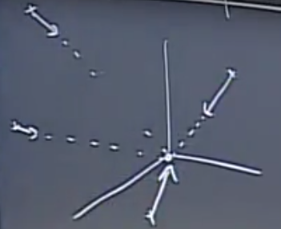
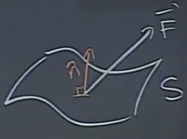
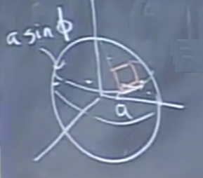
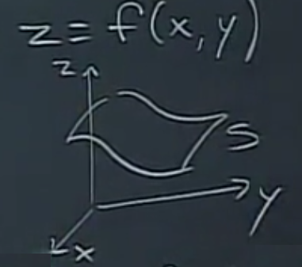
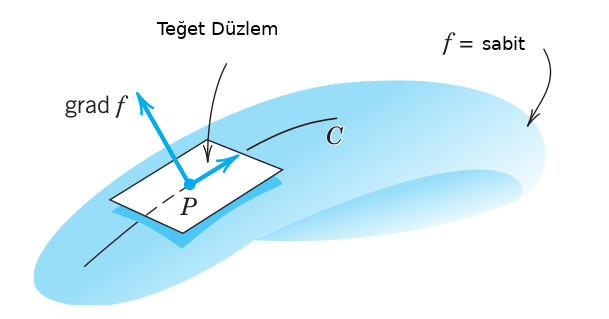

# Ders 27

Üçlü entegralleri gördük, pek çok kordinat sisteminde bu hesapları
yapabiliyoruz. Şimdi vektör alanlarını işleyeceğiz, özellikle akış (flux)
ve iş (work) kavramlarına bakacağız. 

Uzayda Vektör Alanları

Vektör alanı demek, her noktada bir vektör olması demek, bu vektörün
her ögesinin $x,y,z$ kordinatlarına bağlı olması demek. Alan $\vec{F}$
için mesela 

$$
\vec{F} = < P,Q,R >
$$

olabilir ve $P,Q,R$ birer fonksiyondur, $P(x,y,z)$ gibi. 

Örnekler

a)

Mesela kuvvet alanları, yerçekim kuvveti gibi, belli bir noktada belli
bir yöne bir kuvvet etkisi var, bu bir kuvvet alanı, vektör alanı olarak
gösterilebilir. Yerçekim alanı orijin (0,0,0)'a doğru olan bir çekim kuvveti
olsun, ve büyüklüğü $\frac{c}{\rho^2}$ gibi bir sabite oranlı olsun, ki
$\rho$ orijine olan uzaklık. Kabaca bir resimde gösterirsek,

Görüldüğü gibi çekim (ok) orijine doğru ve vektör büyüklüğü (çekim kuvveti)
uzaklık arttıkça küçülüyor. Birkaç vektör çizdik sadece fikir vermesi
için. Formülle belirtmek gerekirse,

$$
\vec{F} = \frac{-c < x,y,z >}{\rho^2}
$$

$< x,y,z >$'nin negatifi alındı, $< x,y,z >$ vektörü orijinden $x,y,z$'ye giden
vektör, oradan geri işaret eden vektör bunun negatif olurdu. Büyüklüğü ise
$-c / \rho^2$ ile çarparak ayarlıyoruz. 

Benzer örnekler çoğaltılabilir, elektrik alanları, manyetik alanlar, vs.

b) 

Hız alanları bir diğer örnek. Mesela sıvı akisini temsil etmek istiyorsak,
ya da atmosferdeki rüzgar akışını incelemek istiyorsak, bunları birer hız alanı
olarak gösterilebilir.

c)

Gradyan alanları

Bir fonksiyon $u = u(x,y,z)$'nin gradyani $\nabla u = < u_x, u_y, u_z >$
bir gradyan alanı oluşturur.

Tabii üstteki örnekleri çok kesin hatlarla birbirinden ayrı gibi görmemek lazım,
mesela elektrik ya da yerçekim alanları elektrik ya da yerçekimsel potansiyel
fonksiyonunun gradyan alanıdır. Gradyan matematiksel bir teknik, pek çok
yerde karşımıza çıkabiliyor.

Yani vektör alanları faydalı şeyler, bunu gördük. Onlarla ne yapacağız?
Akış konusu ile başlayalım.

Akış (Flux)

Daha önce akış kavramını iki boyutta görmüştük,

Bir vektör alanı $\vec{F}$ içinde eğri $C$ vardı, vektör alanının
eğriye dik olan bileşeni ile bir akış entegrali oluşturmuştuk, bu
bir çizgi entegraliydi, formülü

$$
\int_C \vec{F} \cdot \hat{n} \mathrm{d} s
$$

ki bu hesabın ölçtüğü vektör alanının ne kadar eğri içinden / üzerinden
geçtiğiydi. Sıvı mekanığinde mesela bu, bir hız alanı bağlamında, bize eğri
üzerinden ne kadar sıvı aktığını gösterebilirdi. Peki üç boyutta? Üç boyutta tek
eğri üzerinden, mesela esen rüzgar, hesabı biraz anlamsız olur. Bir eğri yerine
bir yüzey üzerinden, içinden olan alan bileşeni daha anlamlı.

O zaman 3D için bu entegrali değiştirmek lazım, çizgi entegrali yerine yüzey
entegrali gerekiyor.  Yüzey iki boyutlu bir nesne, o sebeple çift entegral
kullanmamız lazım, tabii bu entegrali doğru kurmamız gerekiyor, bu yüzeyin
$x,y,z$ kordinatları ile etkileşimi var, bir değişkenden kurtulmamız lazım bir
şekilde ki çift entegral hesaplayabilelim, vs. Kavramsal olarak çizgi
entegraliyle paralellikler var, iki boyutta iki değişken vardı, eğrinin ne
olduğu üzerinden bu değişkenler bire inmişti, burada üç değişken yüzey formülü
üzerinden ikiye indirgenecek.

3D akışı hesaplamak için, $\vec{F}$ ve yüzey $S$ ile düşünürsek (tek $\vec{F}$
vektörü aldatıcı olmasın her $x,y,z$ noktasında bir $\vec{F}$ var), yüzeye
her noktada dik olan $\vec{F}$ bileşenini bulmamız lazım, yani vektör alanımın
normal bileşeni lazım, daha teknik belirtelim birim normal vektör $\hat{n}$.

Normal vektör yönüne karar vermek lazım önce, resimde görüldüğü gibi yukarı, ya
da tam tersi aşağı da alınabilir. Akış entegrallerinde bu kararı vermek lazım,
yüzeyin bir tarafı seçilmeli, ve oraya doğru giden vektör pozitif olarak
alınmalı. Eğri durumunda da bu tür bir seçim yaptık, resme bakılırsa sağa doğru,
saat yönü gidişi pozitif olarak aldık. Her durumda işleyen bir kural yok ama
eğer bir bölge varsa orada dışarı "çıkan'' normaller daha iyi, o zaman bölgeden
dışarı çıkışı ölçmuş oluyoruz.  Eğer kapalı bir yüzey yoksa genel olarak yukarı
yönü seçmek daha akılda kalır bir yöntem olabilir.

Neyse yön seçildikten sonra akış entegrali,

$$
\int \int_S \vec{F} \cdot \hat{n} \mathrm{d} S
$$

$\mathrm{d} S$ yüzey alan ufak parçasıdır. Niye $\mathrm{d} A$ kullanmadım, çünkü bu
sembolü ileride kordinat yüzeyleri için kullanmak istiyorum, daha önce
çift entegrallerde gördüğümüz gibi.

Akış hesabına gelelim, her ufak yüzey parçası $\Delta S$ için oradaki vektör
alanı $\vec{F}$'nin yüzeye dik olan bileşenini hesaplıyorum (o noktadaki
$\hat{n}$ ile çarparak, bu bize $\vec{F}$'nin o noktadaki yüzeye dik bileşenini
verecektir), bu sonucu $\Delta S$ ile çarpıyorum, ve bunu her parça için
yaparak sonuçları topluyorum, çift entegral bu anlama geliyor.

Not: Bazı kaynaklarda bazen $\mathrm{d} \vec{S}$ gibi bir kullanım görüyorsunuz,
bu aslında $\hat{n} \mathrm{d} S$ demek oluyor. Vektör $ud \vec{S}$ yüzeye dik
olan ve büyüklüğü ufak yüzey alanına tekabül eden bir vektördür. Niye
kullanılıyor? Daha az sembol yazmak için değil sadece, bazen $ud \vec{S}$
hesabını yapmak ayrı ayrı $\hat{n}$ ve $\mathrm{d} S$ kullanmaktan daha
kolay oluyor.

Örnek

$\vec{F} = < x,y,z >$ alanının orijinde duran ve $a$ çaplı bir küre içinden
akışını hesaplayın.

Cevap

Soru öyle kurulmuş ki cevap basit, çünkü elde bir küre var, vektör alanı
$< x,y,z >$, o zaman her noktada normal vektör ve vektör alanı aynı yönü gösterir.

$$
\hat{n} = \frac{1}{a} < x,y,z >
$$

Üstteki birim vektör çünkü $\sqrt{x^2 + y^2 + z^2} = a$.

Şimdi $\vec{F} \cdot \hat{n}$'yi hesaplayalım, adım adım ilerliyoruz,
$\vec{F}$ her yerde $\hat{n}$ ile paralel olduğu için
$\vec{F} \cdot \hat{n} = |\vec{F}| |\hat{n}| = |\vec{F}|$. Vektör $|\hat{n}|$
yokoldu çünkü birim vektör, büyüklüğü 1. Peki $|\vec{F}|$ nedir? Her
noktada bu değer $\sqrt{x^2 + y^2 + z^2}$ yani $a$. O zaman
$\vec{F} \cdot \hat{n} = a$.

Böylece çift entegrali bir sabit üzerinden alınan entegrale çevirmiş oldum,

$$
\int \int_S \vec{F} \cdot \hat{n} \mathrm{d} S =
\int \int_S a \mathrm{d} S
$$

Bu örnekte şanslıydım, $a$'yi direk entegral dışına çıkartabilirim,

$$
= a \int \int_S \mathrm{d} S
$$

Geriye kalanlar $\mathrm{d} S$'in entegralidir, fakat bu da küre üzerindeki her ufak
parçanın toplanması demek değil midir? Eh bu da kürenin yüzey alan hesabı, o
hesabın nasıl yapılacağını biliyoruz, $4 \pi a^2$. Yerine koyarsak,

$$
= a \int \int_S \mathrm{d} S = a 4 \pi a^2 = 4 \pi a^3
$$

Örnek

Aynı küre ama bu sefer vektör alanı $\vec{H} = z \hat{k}$.

Cevap

Artık problem önceki gibi kolay değil, önce geometrik argüman kullanarak bazı
hesaplardan kurtulmuştum, şimdi $\vec{F} \cdot \hat{n}$ hesaplamam, sonra onu
$\mathrm{d} S$ ile nasıl entegre edeceğimi düşünmem gerekecek.

Hala $\hat{n} = \frac{ < x,y,z >}{a}$, o zaman

$$
\vec{H} \cdot \hat{n} = < 0,0,z > \cdot \frac{ < x,y,z >}{a} = \frac{z^2}{a}
$$

Tüm entegral

$$
\int \int_S \vec{H} \cdot \hat{n} \mathrm{d} S =
\int \int_S \frac{z^2}{a} \mathrm{d} S
$$

$z^2$'i küre yüzeyi üzerinden entegre etmemiz lazım. Nasıl yapacağız?  Bunun
için $ud S$'in üzerinden entegre edilecek iki değişken bağlamında neye tercüme
olduğunu bulmamız lazım. Küre yüzeyinde nerede olduğumuzu bulmanın en rahat yolu
nedir? Burada küresel kordinat sistemini kullanabiliriz.

Bir önceki dersten biliyoruz ki üstteki ufak parçaya bakarak konuşalım, bu parça
"ekvator çemberi''nden $\phi$ yukarıda, oradaki çemberin büyüklüğü
$a\sin\phi$, onun $\Delta \theta$ parçası, yani $\Delta S$'nin bir kenarı
$a\sin\phi \Delta \theta$. Diğer kenar dikey ve ana çember üzerinde, yani
$a \Delta \phi$. O zaman

$$
\Delta  \approx (a\sin\phi \Delta \theta) \cdot (a \Delta \phi)
$$

Yani

$$
\mathrm{d} S = a^2 \sin\phi \mathrm{d} \phi \mathrm{d} \theta
$$

Hala $z$ lazım. O da $z = a \cos\phi$, resimde daha rahat anlaşılabilir,

Tüm entegral hesabı,

$$
\int \int_S \frac{z^2}{a} \mathrm{d} S =
\int_{0}^{2\pi} \int_{0}^{\pi} \frac{a^2 \cos^2 \phi}{a} a^2 sin\phi
\mathrm{d} \phi \mathrm{d} \theta
$$

$$
= 2\pi a^3 \left[ -\frac{1}{3} \cos^3 \phi  \right]_{0}^{\pi} =
\frac{4}{3} \pi a^3
$$

Örnek

Yatay bir yüzey $z = a$ ile iş yapıyorum. Bu durumda $\hat{n}$ basit,
$\hat{z} = \pm \hat{k}$. Peki $\mathrm{d} S$? İki tane değişken üzerinden
o da basit, $\mathrm{d} S = \mathrm{d} x \mathrm{d} y$.

Örnek

Çapı $a$ olan bir silindirin yüzeyinde $\hat{n}$ nedir?

Cevap

$\hat{n} = \frac{\pm 1}{a} < x,y,0 >$

Peki $\mathrm{d} S$ nasıl hesaplanır?

Ufak yüzey parçasının dikey yeri $z$ ile bulunur, o dikey noktadaki
çember kesiti üzerinde nerede olduğumuzu $\theta$ ile belirleyebiliriz,

O zaman ufak parçanın bir kenarı $\Delta z$ diğer kenarı $a \Delta \theta$.

$$
\Delta S = a \Delta \theta \Delta z
$$

Yani

$$
\mathrm{d} S = a \mathrm{d} z \mathrm{d} \theta
$$

Örnek

Dünya sadece küreler, silindirlerden ibaret değil tabi, ya $z = f(x,y)$ ile
tanımlı bir yüzey verseydim size, onu nasıl kullanırdık? 

Şimdi $\hat{n} \mathrm{d} S$ nasıl, hangi değişkenlerle temsil edilir? Büyük ihtimalle
$x,y$ kullanarak değil mi, çünkü $z$'yi bu iki değişkenle temsil etmeyi
biliyorum.

$$
\hat{n} \mathrm{d} S = \pm < -f_x, -f_y, 1 > \mathrm{d} x \mathrm{d} y
$$

Peki $\mathrm{d} S$ nedir? $< -f_x, -f_y, 1 >$ vektörünün büyüklüğü çarpı $\mathrm{d} x \mathrm{d} y$.
Normal vektör nedir? $< -f_x, -f_y, 1 >$'u alıp birim büyüklüğe indirgersek
normalı elde ederiz. Yani dikkat edelim, üstteki formülde eşitliğin sağındaki
olduğu haliyle en azından $\hat{n}$ değil, sağındaki de $\mathrm{d} S$ değil.

Böylece entegrali alırken $x,y$ bazına geçebilmiş oluyoruz, tabii entegralin
sınırlarını hesaplarken yüzeyimizin $x,y$'deki yansımasını bulmamız gerekecek,
ki $\int \int ... \mathrm{d} x \mathrm{d} y$ hesabını doğru yapabilelim.

Ekler

Bir yüzeyin normalını nasıl hesaplarız? Hoca $z = f(x,y)$ üzerinden bir formül
verdi, o formülün nereden geleceği bir sonraki derste anlaşılacak, fakat genel
bağlamda [1, sf. 399] üzerinden şöyle hesaplanabilir. $F(x,y,z) = c$, ki $c$ bir
sabit, ile bir yüzeyi gösterirsek, $\nabla F$ gradyani o yüzeye olan normali
gösterir. Nasıl? O yüzeyde olan bir $C$ eğrisi düşünelim, formülü $\vec{r} =
r(t) = [x(t),y(t),z(t)]$ olsun bu formül yüzeyde olduğu için tabii ki

$$
f(t) = [x(t),y(t),z(t)] = c
$$

eşitliğini tatmin etmeli. Şimdi $C$'ye teğet bir vektör $r'(t) =
[x'(t),y'(t),z'(t)]$ düşünelim. Bir $P$ noktasındaki tüm teğet vektörler bir
düzlem oluşturur, bu düzleme dik olan vektör yüzeyin normali olacaktır. Bu
vektörü bulmak için üstteki formülün $t$'ye göre türevini alırız, ve Zincirleme
Kanununa göre

$$
\frac{\partial f}{\partial x} x' + 
\frac{\partial f}{\partial y} y' + 
\frac{\partial f}{\partial z} z'  = (\mathrm{grad} f) \cdot r' = 0
$$

Noktasal çarpım sıfır sonucunu verdiğine göre $(\mathrm{grad} f)$ ve $r'$ birbirine dik
demektir, $r'$'lerin bir noktada bir düzlem oluşturduğunu söyledik, o zaman
yüzeyin $P$ noktasındaki normalı $\mathrm{grad} f$ olmalıdır.

Hocanın formülüne su şekilde erisebiliriz, $z = f(x,y)$'yi

$$
F(x,y,z) = f(x,y) - z = 0
$$

olarak değiştirelim [2], o zaman mesela $a,b$ noktasındaki normal $\mathrm{grad} F(a,b)$
olur, üstteki formüle göre türevleri hesaplarsak,

$$
\left[\begin{array}{c}
F_x(a,b), \\ F_y(a,b), \\F_z(a,b)
\end{array}\right]
=
\left[\begin{array}{c}
f_x(a,b) \\
f_y(a,b) \\
-1
\end{array}\right]
= - \left[\begin{array}{c}
-f_x(a,b) \\
-f_y(a,b) \\
1
\end{array}\right]
$$

Kaynaklar

[1] Kreyzig, *Advanced Engineering Mathematics, 10th Ed*

[2] Math Stackexchange, [https://math.stackexchange.com/a/2590831/6786](https://math.stackexchange.com/a/2590831/6786)

