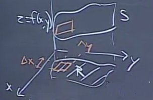
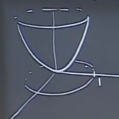
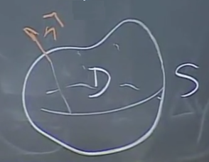

# Ders 28

Önceki derste bir yüzey içinden olan akış hesabını gördük. Bu bir çift
entegraldi,

$$
\int \int_S \vec{F} \cdot \hat{n} \mathrm{d} S
$$

ki $\hat{n}$ yüzeye olan birim normal, $\mathrm{d} S$ ise yüzeydeki alan öğesiydi.
Gördük ki farklı yüzeyler için farklı $\hat{n}$ ve farklı alan öğe formülü $\mathrm{d}
S$ olabiliyordu. Bulmamız gereken yüzeyin ufak bir parçası için $\hat{n} \mathrm{d}
S$'in ne olacağını bulmak.

Diyelim ki yüzeyin $xy$ düzlemine olan yansımasındaki / "gölgesindeki'' ufak
bir dikdörtgeni alıyoruz, ki bu dikdörtgenin kenarları $\Delta x$ ve $\Delta y$,
ve onun yüzey $S$'deki karşılığına bakıyoruz.

Yani soru yüzeydeki o ufak parçanın alanı ve normal vektörün ne olduğu. Dikkat
edersek eğer yeterince ufak ise yüzeydeki o ufak parça bir paralelograma
benzeyecek. Kabaca tabii, belki biraz kavisi vs olacak ama yaklaşık olarak
bir düz paralelogram. Ve hatırlarsak uzayda bir paralelogramın alanını
çapraz çarpım ile nasıl hesaplayacağımızı gördük.

O zaman, eğer yeşil okla gösterilen o iki kenarın vektörünü bulabilirsek, alanı
hesaplayabileceğiz demektir çünkü çapraz çarpım sonucu olan vektörün büyüklüğü,
paralelogram alanına eşittir. Daha da iyisi çapraz çarpım sonucunu yönü bize
aradığımız bir diğer vektör, yüzey normalini de verecektir. Önceki derste işte
bu sebeple $\hat{n} \mathrm{d} S$ hesabını bulmanın bazen daha rahat olduğunu
söylemiştim.

Vektörleri, ufak alanları daha iyi göstermek için bir resim,

$\vec{u}$ ve $\vec{v}$'yi bulalım, eğer onları bulabilirsek,

$$
\pm \vec{u} \times \vec{v} = \Delta S \cdot \hat{n}
$$

hesabını yapabiliriz.

Resme bakılınca $\vec{u}$ başlangıcı $x,y,f(x,y)$ bitişi $x+\Delta
x,y,f(x+\Delta x,y)$ noktasında.

Fakat $f(x+\Delta x,y)$ aslında bizde kısmi türev çağrışımı yapmıyor mu?
Evet. O zaman onu yaklaşık olarak şöyle temsil edebiliriz,
$f(x,y) + \Delta x f_x$. Demek ki soyle soylenebilir,

$$
\vec{u} \approx < \Delta x, 0, f_x \Delta x >
$$

Peki $\vec{v}$? Benzer sekilde,

$$
\vec{v} \approx < 0, \Delta y, f_y \Delta y >
$$

Paralelogramın iki kenarını bulmuş oldum. Şimdi çapraz çarpım yapalım. Ondan
önce biraz basitleştirerek,

$$
\vec{u} \approx < 1, 0, f_x  > \Delta x
$$

$$
\vec{v} \approx < 0, 1, f_y  > \Delta y
$$

Şimdi çapraz çarpım,

$$
\hat{n} \Delta S =
\vec{u} \times \vec{v} =
\left[\begin{array}{ccc}
i & j & k \\
1 & 0 & f_x \\
0 & 1 & f_y
\end{array}\right]
\Delta x \Delta y
$$

$$
= < -f_x, -f_y, 1 > \Delta x \Delta y
$$

Eğer diktörtgeni sonsuz küçültürsek, limite giderken daha önce gösterdiğimiz

$$
\hat{n} \mathrm{d} S = \pm < -f_x, -f_y, 1 > \mathrm{d} x \mathrm{d} y
$$

formülünü elde ederiz. İşaret $\pm$ çünkü yukarı mı aşağı mı giden normal
vektörü seçmek bize kalmış.

Bu formül önemli bir formül, çünkü genel bir $f(x,y)$'yi baz alıyor, bu
sebeple pek çok alanda kullanım bulabilir, hatırlamamız iyi olur.

Örnek

Dikey bir vektör alanı düşünelim, $\vec{F} = z \hat{k}$. Bu $\vec{F}$'in
paraboloid $z = x^2 + y^2$'in $xy$'deki birim diske tekabül eden alanı
içinden olan akışını hesaplayın.

Bahsedilen alanı biraz daha iyi tarif etmek gerekirse,

Yani paraboloidin alttan yukarı giden sonsuz yüzeyi değil, sadece $xy$'de
yansıması görülen disk içine düşen kısmı ile ilgileniyoruz. 

$\int \int_S \vec{F} \cdot \hat{n} \mathrm{d} S$ hesabını yapalım, $\vec{F}$ nedir?
$< 0, 0, z >$. $\hat{n}$ nedir? Daha doğrusu $\hat{n} \mathrm{d} S$ nedir?
$< -f_x, -f_y, 1 > \mathrm{d} x \mathrm{d} y$ demiştik, $< -2x, -2y, 1 > \mathrm{d} x \mathrm{d} y$.

$$
\int \int < 0, 0, z > \cdot < -2x, -2y, 1 > \mathrm{d} x \mathrm{d} y
$$

$$
= \int \int_S z \mathrm{d} x \mathrm{d} y
$$

$z$'de kurtulmamız lazım, bunun için $z = x^2 + y^2$ formülünü kullanabiliriz,
yerine koyalım,

$$
= \int \int_S (x^2 + y^2) \mathrm{d} x \mathrm{d} y
$$

Dikkat edelim, çözümde sadece yüzeyde olanlara baktığımız gerçeğini
kullanıyoruz, $z$ yerine üstteki formülü koyabildik çünkü bu eşitlik yüzeyde
doğru.

Entegralin $x,y$ değişken menzillerine gelelim, bu değişkenler hangi değerler
arasında? Biraz önce bahsettik, birim disk içinde kalmamız gerekiyor.
Kutupsal kordinata geçebilirim.

$$
\int_{0}^{2\pi} \int_{1}^{0} r^2 \cdot r \mathrm{d} r \mathrm{d} \theta = \pi / 2
$$

Daha genel durumlara bakalım şimdi. Diyelim ki elimde öyle bir yüzey var ki
$z$'yi $x,y$ değişkenlerinin bir fonksiyonu olarak ifade edemiyorum. Fakat
bir şekilde parametrize edebiliyorum, yani yüzeyimin parametrik denklemleri
elimde var, bu demektir ki $x,y,z$ değişkenlerini diğer iki parametrik değişken
üzerinden temsil edebiliyorum. Bu tür bir daha genel problemi nasıl çözerdik?
Diyelim ki bu parametrik tanim verilmis,

$$
S = \left\{ \begin{array}{l}
x = x(u,v) \\ y = y(u,v) \\ z = z(u,v)
\end{array} \right.
$$

Bir yüzeyin temel özelliklerinden birisi üzerinde hareket edebileceğim sadece
iki tane bağımsız yön olduğu için o yüzeyin $x,y,z$ değişkenlerini iki tane
bağımsız değişken üzerinden tanımlayabilmem, üç boyutta bir eğriyi tek $t$
üzerinden tanımlayabilmemiz gibi. Yüzeyi tanıdık notasyon üzerinden
$\vec{r} = \vec{r}(u,v)$ ile de gösterebiliriz.

Bu akış entegraline nasıl yansır? Elimizde iki değişken $u,v$ var, akış
entegrali de $\mathrm{d} u \mathrm{d} v$ üzerinden olacak. Yani hesap için $\hat{n} \mathrm{d} S$'i
$\mathrm{d} u \mathrm{d} v$ üzerinden temsil edebilmemiz lazım. 

Önceki örnekte $x,y$ içinde ufak parçalar düşünmüştük, ve onun yüzey üzerindeki
yansımasına bakmıştık, bu durumu hayal etmesi biraz kolaydı. Peki $u,v$ ile
parçalar neye benzer? Orada da ufak $u$ ve ufak $v$ düşünülebilir, onun yüzey
üzerinde yansımaları olacaktır, ve tüm parçalar bir tür ızgara oluştururlar.  O
parçalar yine birer paralelogramdır, ve alan hesabı için yine kenarlarını temsil
eden vektörlerin çapraz çarpımı kullanılabilir.

Bu iki vektörü $u,v$'deki ufak değişimler $\Delta u, \Delta v$ üzerinden
inceleyebiliriz.

Yönü kısmi türev ile hesaplıyoruz, büyüklüğü ile beraber tüm vektör için $\Delta u$
ile çarpıyoruz. O zaman vektörlerden biri $\frac{\partial \vec{r}}{\partial u} \Delta u$.
Diğer kenar $\frac{\partial \vec{r}}{\partial v} \Delta v$. 

Cift entegral icin gereken $\hat{n} \Delta S$ hesabi o zaman

$$
\hat{n} \Delta S =
\left( \frac{\partial \vec{r}}{\partial u} \Delta u \right) \times
\left( \frac{\partial \vec{r}}{\partial v} \Delta v \right) 
$$

$$
= \left( \frac{\partial \vec{r}}{\partial u} \right) \times
\left( \frac{\partial \vec{r}}{\partial v}  \right) \Delta u \Delta v
$$

O zaman

$$
\hat{n} \mathrm{d} S = \pm
\left( \frac{\partial \vec{r}}{\partial u} \right) \times
\left( \frac{\partial \vec{r}}{\partial v}  \right) \Delta u \Delta v
$$

[atlandı]

Uzaklaşım Teorisi (Divergence Theorem)

Bu teori Gauss-Green teorisi olarak ta bilinir. İsimdeki Green, Green
Teorisi'nden bildiğimiz Green, uzaklaşım teorisi bir anlamda Green'in teorisinin
akışa uygulanmış halidir denebilir.

Teori şöyle. Eğer $S$ kapalı bölge $D$ içindeki bir yüzey ise, ve $\hat{n}$
dışarı çıkma yönünü gösteriyor, ve $\vec{F}$ $D$ içinde tanımlı ve türevi
alınabilir halde, o zaman

$$
\int \oint \vec{F} \cdot \mathrm{d} \vec{S} =
\iiint_D \mathrm{div} \vec{F} \mathrm{d} V
$$

Üç boyutlu bir vektör alanının uzaklaşımı ne demek,

$$
\mathrm{div} (P \hat{i} + P \hat{j} + P \hat{k} ) = P_x + Q_y + R_z
$$

Örnek

Önceki derste $z \hat{k}$ alanının $a$ çaplı küre yüzeyinden akışını
$\frac{4}{3} \pi a^3$ olarak bulmuştuk. Şimdi bu hesabı Green'in Teorisi
ile daha hızlı bir şekilde yapabiliriz. Bu arada GT kullanabiliyoruz çünkü
elimizde kapalı bir yüzey var.

$$
\int \int_S z \hat{k} \cdot \hat{n} \mathrm{d} S =
\int \int \int \mathrm{div} (z\hat{k}) \mathrm{d} V
$$

Peki $\mathrm{div} (z\hat{k})$ nedir? $\hat{i},\hat{j}$ öğeleri yok, sadece
$\hat{k}$ için $z$ var, onun $z$ üzerinden türevi 1. O zaman
$\mathrm{div} (z\hat{k}) = 0 + 0 + 1 = 1$. Yerine koyalım,

$$
= \int \int \int 1 \mathrm{d} V
$$

Üstteki ifade kürenin hacminden ibaret, $\frac{4}{3} \pi a^3$. 

Ekler

Notasyonel bir not ekleyelim buraya, bazen sembol azaltmak için çift, ya da üçlü
entegral kastedilse bile tek entegral sembolü kullanıldığı görülebiliyor, burada
okuyucunun hacim $\mathrm{d} V$, ya da alan $\mathrm{d} A$ ile beraber olup olmadığına göre
durumu anlaması lazım. Mesela

$$
\int_A ... \mathrm{d} A = \int_\Omega ..  \mathrm{d} V
$$

Bu tür kullanımlarda entegral sınırlarında da hacim için
salt $\Omega$, ya da V gibi semboller görülebilir, yüzey entegrali için de
$\partial \Omega$ görülebiliyor, bu "$\Omega$'nin alanı'' demek, bilinen
türevlerle alakası yok.

