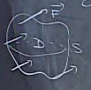
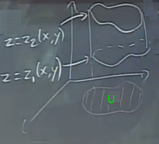
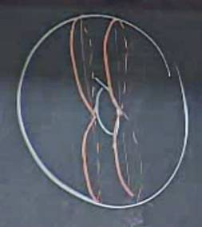

# Ders 29

Uzaklaşım Teorisi bize kapalı bir alandaki vektör alanının akışını (flux)
hesaplama imkanı veriyor, 

Formülün sol tarafında yüzey üzerinden bir entegral var, UT ile onu $\vec{F}$
uzaklaşımını üzerinden üçlü entegrale çevirebiliyoruz,

$$
\int \int_S \vec{F} \mathrm{d} \vec{S} =
\int \int \int_D \mathrm{div} \vec{F} \mathrm{d} V
$$

Mesela eger $\vec{F}$ bilesenleri $P,Q,R$ ise,

$$
\int \int_S < P,Q,R > \vec{n} \mathrm{d} S = \int \int \int_D \left( P_x + Q_y + R_z \right) \mathrm{d} V
$$

Peki Uzaklaşım Teorisinin fiziksel anlamı nedir?

Fiziksel olarak $\mathrm{div}(\vec{F})$ kaynak üretilis oranı olarak görülebilir,
ya da birim hacimde üretilen akış.

Örnek olarak sıkıştırılamayan bir sıvıyı düşünelim, mesela şu. Suyun sabitlenmiş
bir kütlesi her zaman aynı hacmi kaplar. Gazlar sıkıştırılabilir, onlar
farklıdır.  O zaman önümüzde bir sıkıştırılamayan akış (incopressible flow)
problemi varsa, ve verili bir kütle her zaman aynı hacmi kaplıyorsa, ve elimizde
bir $\vec{F}$ hızı var ise (şu durumunda vektör alanı her noktadaki akış hızı
olarak kabul edilebilir) o zaman Uzaklaşım Teorisi şunu söylüyor, belli bir
hacimdeki $\vec{F}$ uzaklaşımlarını topla, $\int \int \int_D \mathrm{div} \vec{F} \mathrm{d} V$, 
bu sayı yüzeyin akışına eşit olacaktır, $\int \int_S \vec{F} \cdot \vec{n} \mathrm{d} S$.
Akış birim zamanda $D$ bölgesini terkeden sıvı miktarı, tabi terkeden derken
giren eksi çıkan, akışın ölçtüğü bu ikisinin farkı.

Bölge bağlamında uzaklaşımın hesapladığı $D$ bölgesi içindeki tüm kaynakların
eksi alıcıların (sink) ürettiği / tükettiği birim hacimdeki sıvı, bunları
tüm hacim için entegre edince toplam üretilen sıvı ortaya çıkar, bu üretim
sıkıştırılamayan sıvı için tabii ki yüzeyden geçip dışarı çıkacaktır, yüzey
entegralinin de ölçtüğü budur.

Uzaklaşım Teorisi çok bariz bir şeyi belirtiyor demek ki, sınırdan geçen
her kütle bir yerden geliyor olmalı.

Teorinin ispatına gelelim. Bu ispatın daha kolay versiyonunu yapacağım şimdi,
tüm eşitlik yerine

$$
\int \int_S < 0,0,R > \cdot \hat{n} \mathrm{d} S =
\int \int \int_D R_z \mathrm{d} V
\qquad (1)
$$

eşitliğinin ispatını yapacağım. Buradan hareketle daha genel eşitliği
ispatlamak kolay, aynı ispatı sadece $x$, sadece $y$ bileşeni olan
vektör alanları için tekrarlarım, ve tüm bunları toplayınca ana eşitliği
elde etmiş olurum.

İkinci bir basitleştirme yapalım, çünkü ispatı hala herhangi bir yüzey için
yapabileceğimden emin değilim. Dikey, basit bir yüzey kullanacağım, öyle ki
bu yüzey üzerinden entegralde $z$ değişkenin sınırlarını kolay halledebileyim.

Bir üst yüzey var bir alt var, aralarında kalan yüzey dikey. Burada kullandığım
kavram, dikey basit bölge (vertically simple region) iki yüzey arasındaki bölge.

Başlayalım, üstteki formülün sağ ta rafındaki entegrali hesaplayalım. Bu
hesaptan bir sayı çıkmayacak tabii ki çünkü pek çok şeyi tanımsız bıraktık, ama
en azından bazı basitleştirmeler yapabiliriz, mesela bir ölçüde $z$ üzerinden
entegral alabilirim. 

$$
\iiint_D R_z \mathrm{d} V = \iint \int_?^? R_z \mathrm{d} z \mathrm{d} x \mathrm{d} y
$$

$z$'nin sınırları nedir? Hatırlarsak üçlü entegralde $z$ üzerinden entegral
alırken ise $x,y$ değişkenlerini sabitleyerek başlıyorduk, ve o sabitlenen
$x,y$'den yukarı çıkıp bir dikey kesite bakıyorduk ve sınırların nereye
geldiğini not ediyorduk. Üstteki bölge için bu altta $z_1$, üstte $z_2$. 

$$
= \iint \int_{z_1}^{z_2} R_z \mathrm{d} z \mathrm{d} x \mathrm{d} y
$$

Şimdi tüm mümkün $x,y$ için entegralin geri kalanını hesaplamak istiyorum,
bu üstteki dikey bölgenin gölgesindeki alan $U$ içinde olacak, 

$$
= \iint_U \left( \int_{z_1(x,y)}^{z_2(x,y)} R_z \mathrm{d} z  \right) \mathrm{d} x \mathrm{d} y  
$$

Üstteki entegrali hesaplamayı düşünürsek, en içteki entegral fazla kötü durmuyor
aslında, $R$'nin $z$'ye göre türevi var, sonra $z$ üzerinden entegral alınıyor.
Bu bize $R$'yi geri vermez mi? Evet. O zaman

$$
\iiint_D R_z \mathrm{d} V = \iint_U \bigg[ R(x,y,z_2(x,y)) - R(x,y,z_1(x,y))  \bigg]
\mathrm{d} x \mathrm{d} y
\qquad (2)
$$

Elde net formül olmadan daha fazla ilerleyemem, şimdi çift entegrale dönüyorum.
Bu entegralde $S$ var, ve $S$ alt, üst ve yan yüzeylerden oluşan kapalı bölge.

$$
\int \oint_{S = \textrm{alt+üst+kenarlar}} < 0,0,R > \cdot \hat{n} \mathrm{d} S =
\iint_{\textrm{üst}} + \iint_{\textrm{alt}} + \iint_{\textrm{kenarlar}} 
$$

Üst yüzey ile başlayalım. Akış entegralindeki $\hat{n} \mathrm{d} S$'i o yüzey
için hazırlamak lazım. İyi haber üst, alt yüzeyin $x,y$ üzerinden bir $z$
formülü var, ve bu tür formül olunca $\hat{n} \mathrm{d} S$'i nasıl hesaplayacağımızı
biliyoruz, mesela $z=z_2(x,y)$ için,

$$
\hat{n} \mathrm{d} S =
< -\frac{\partial z_2}{\partial x},
-\frac{\partial z_2}{\partial y},
1 >
\mathrm{d} x \mathrm{d} y
$$

Tabii üstteki $z_2$ üzerinden kısmi türevleri de hesaplayamıyoruz ama
iki üstteki formülde $< 0,0,R >$ ile bir noktasal çarpım var, $z_2$
türevi içeren ilk iki terim yokolacak, geriye 1 ile çarpılan $R$
kalacak,

$$
< 0,0,R > \cdot \hat{n} \mathrm{d} S = R \mathrm{d} x \mathrm{d} y
$$

Bu demektir ki 

$$
\iint_{\textrm{üst}} < 0,0,R > \cdot \hat{n} \mathrm{d} S =
\iint_{\textrm{üst}} R \mathrm{d} x \mathrm{d} y
$$

olur. $z$ için üst kısımdeki $z_2$ formülünü kullanırız,

$$
= \int \int_U R(x,y,z_2(x,y)) \mathrm{d} x \mathrm{d} y
$$

ve $z,y$ değişken sınırları için, bölgem tam $U$ üzerinde duruyor o zaman
sınırları $U$ belirler.

Alt kısım için aynı yöntem, $z = z_1(x,y)$ formülünü kullanıyoruz, ilk başta
alttakini yazabilirdik,

$$
\hat{n} \mathrm{d} S =
< -\frac{\partial z_1}{\partial x},
-\frac{\partial z_1}{\partial y},
1 >
\mathrm{d} x \mathrm{d} y
$$

Yanlız bir noktaya dikkat, işaret yönü (orientatıon) önemli. Uzaklaşım
Teorisi'ni tanımlarken normal vektörlerin tanımladığımız bölgelerden dışarı
doğru işaret etmesi gerektiğini söylemiştik. Bu durumda alt bölgede $\hat{n}$
aşağı doğru işaret eder. Bu sebeple üstteki vektörü ters donduruyoruz,

$$
\hat{n} \mathrm{d} S =
<\frac{\partial z_1}{\partial x},
\frac{\partial z_1}{\partial y},
-1 >
\mathrm{d} x \mathrm{d} y
$$

Devam ediyoruz, önceki noktasal çarpımı tekrarlayalım,

$$
< 0,0,R > \cdot \hat{n} \mathrm{d} S = -R \mathrm{d} x \mathrm{d} y
$$

Entegre ediyoruz,

$$
\int \int_U -R (x,y,z_1(x,y)) \mathrm{d} x \mathrm{d} y
$$

Şimdi sıra bölge kenarlarına geldi. Fakat kenarların $z$ eksenine paralel,
yukarı doğru dimdik olduğunu söylemiştik, o zaman bu kenarlardan akış olamaz,
demek ki kenar bölgeler için hesaba gerek yok. Zaten baştaki problem tanımı
(1)'de bu sebeple tanımı basit tutmuştum, vektör alanını $< 0,0,R > $,
sadece $z$ bileşenini içerek şekilde tanımlamıştım ki şimdi bu ek hesaptan
kurtulabileyim.

Sonuc

(2)'de $\iiint_D R_z \mathrm{d} V$ için bir formül elde etmiştik. Eğer akışı üst
ve alt bölgeler için toplarsam aynı sonuca eriseceğim.

$$
\iiint_D R_z \mathrm{d} V = \int \oint_{\textrm{üst+alt+kenarlar}} < 0,0,R >
\cdot \hat{n} \mathrm{d} S
$$

İspatın bu kısmını tamamlamış olduk. Fakat ustteki sadece dikey, basit bolgeler
icindir. Eger elimizde dikeysel basit bir bolge yok ise, o bolgeye dikeysel
basit bolgelere bolebilirim, ve her parca uzerinde ustteki ispati tekrarlarim.

Mesela bir simit şekli üzerinden entegre etmek istiyorum, bu basit bir bölge
değil, ortasında bir delik var. Simiti dört parçaya bölebilirim,

Tüm bu parçaların net bir üst ve alt sınırı var, kesintisiz şekilde birinden
diğerine gitmek mümkün (ortada delik olduğu durumda bu mümkün değildi, bir
içeride bir dışarıda olunacaktı, entegral sınırları yanlış şeyi hesaplayacaktı).
Yeni birkaç yüzey tanımlamış olduk bu arada, resimde kırmızı renkli elips
yüzeyleri, fakat bu yüzeyler bizim için önemli değil çünkü baktığımız şart
sadece dikey duruma bakıyor, yana bakan yüzeyde ne olduğu ile ilgilenmiyoruz,
orada akış sıfır demiştik, orası iptal.

Yayınım

Denklemler ile formüller arasındaki bağlantıyı daha iyi anlayabilmek için
Yayınım (Diffusion) Denklemine bakalım. Bu denklem (hareket etmeyen) bir sıvıya
eklenen bir dış maddenin sıvıda nasıl yayıldığını formülize eder, mesela havada
dumanın yayılması, ya da şu içinde mürekkebin yayılması. Yayınım denklemi bir
kısmı diferansiyel denklemdir, bilinmeyen $u$ değişkeni, bir noktadaki dış madde
konsantrasyonu bu, üç boyuttaki nokta $x,y,z$ için, muhakkak zaman da bir
faktör, $t$ var, o zaman $u(x,y,z,t)$.

Yayınım formülü bize $u$'nun $t$'ye göre türevini verecek, belli bir noktadaki
konsantrasyonun zamana göre değişimini formülize edecek ve bu değişimi
konsantrasyonun uzaysal değişimine bağlayacak, $\frac{\partial u}{\partial t}$
ile $\frac{\partial u}{\partial x}$, $\frac{\partial u}{\partial y}$,
$\frac{\partial u}{\partial z}$ arasında bir ilişki göreceğiz.

$$
\frac{\partial u}{\partial t} =
k \nabla^2 u =
k \nabla \cdot \nabla u
$$

Değişenler bağlamında açarsak,

$$
\frac{\partial u}{\partial t} = k \left(
\frac{\partial u^2}{\partial x^2} +
\frac{\partial u^2}{\partial y^2} +
\frac{\partial u^2}{\partial z^2}
\right)
$$

Üstteki denklem bu arada Isı Denklemi (Heat Equation) olarak ta bilinir, çünkü
bir dış maddenin sıvı içinde yayınımı işinin bir madde içinde yayılması ile
benzer mantığı takip eder. Isı Denklemi için $u$ sıcaklık seviyesi olur.

Yayınıma dönersek, onun açıklaması nedir? Önceden gördüğümüz kavramları
düşünelim, elimizde bir vektör alanı olmalı. Eğer havadaki dumanın yayınımına
bakıyorsam, $\vec{F}$'yi belli bir noktadaki duman akışı olarak görebilirim,
$x,y,z$'deki bir vektör olacak bu, ve bana dumanın hangi yönde ne hızda aktığını
söyleyecek.

Akışın hızını kontrol eden faktör nedir? Bu faktör bölgeler arasındaki duman
yoğunluk farkıdır, duman çok olan yerden az olan yere gitmeye meyilli olacaktır.
Hem fiziksel hem de kabaca biraz zihinsel egzersiz bize bunu söyler. Duman
yüksek konsantrasyonlu bölgelerden düşük konsantrasyonlu bölgelere akacaktır.
Konsantrasyon $u$ demiştik, demek ki gidişat, akış $u$'nun en hızlı azaldığı
yöne doğru olmalı. "En hızlı azalmak'' ne demek? Gradyanın negatifi.  O zaman
$\vec{F}$ gidişatı $-\nabla u$ yönünde olmalı, aradaki bağlantıyı direk
orantısal olarak kurabiliriz, bir sabit üzerinden mesela,

$$
\vec{F} = -k \nabla u
\qquad (3)
$$

Bir diğer ilişki değişimin nasıl halledileceği, eğer konsantrasyon farkı
sebebiyle akış varsa, bu akış sonrasında sistem nasıl etkilenir? Akış çıktığı
yerdeki konstrasyonu azaltacaktır, vardığı yerdeki konstrasyonu arttıracaktır.
Bu durumu $\vec{F}$ ile $\frac{\partial u}{\partial t}$ arasındaki bir
bağlantıyla temsil etmek gerekir. Uzaklaşım Teorisi burada devreye girecek.

Yine $D$ bölgesi ve onun etrafındaki $S$ yüzeyini düşünürsek ve önümüzdeki
problem için

$$
\int \int_S \vec{F} \cdot \vec{n} \mathrm{d} S
$$

formülü birim zamanda $S$ yüzeyinden geçen duman miktarını hesaplayabilir.  Bu
akışı nasıl hesaplanır? Uzaklaşım Teorisi tam da bunu söylüyor zaten, $D$ içine
bakıyorum, oradaki değişimin ne kadar olduğunu hesaplıyorum, bu hesap, sınırdan
akan miktar yani üstteki formül ile aynı olmalıdır.

$$
- \frac{\mathrm{d} }{\mathrm{d} t} \left(
\int \int \int_D u \mathrm{d} V
\right)
$$

Eksi işareti koyuldu çünkü çift entegralli akış yüzey dışına gidişatı pozitif
kabul ediyor, o zaman bölge içindeki değişimi eksi yapmam gerekir, bu birim
zamanda kaybettiğimiz dumanı bize verir.

Üstteki formül fiziksel duruma bakılarak ortaya çıkartıldı, fakat iki üstteki
formülün eşit olduğu başka bir şey daha var, Uzaklaşım Teorisini kullanırsak,

$$
\int \int \int_D \mathrm{div} \vec{F} \mathrm{d} V =
\int \int_S \vec{F} \cdot \vec{n} \mathrm{d} S
$$

eşitliği de doğru olmalıdır değil mi? O zaman şu ifade de doğrudur,

$$
\int \int \int_D \mathrm{div} \vec{F} \mathrm{d} V =
- \frac{\mathrm{d} }{\mathrm{d} t} \left( \int \int \int_D u \mathrm{d} V \right)
$$

Şimdi eşitliğin sağındaki zaman türevine bir daha bakalım, üçlü entegralde bir
$x,y,z$ bazlı fonksiyonu entegre ediyorum, sonra o sonucun $t$'ye göre türevini
alıyorum. Matematiksel olarak o işlem sırasını değiştirmek mümkündür, yani
parantez içinde toplam duman miktarını hesaplayıp sonra zamansal bazlı nasıl
değiştiğini bulmak yerine, duman toplamının farklı bileşenlerinin ayrı ayrı
zamansal değişimini toplamak ta aynı sonucu verir. Bileşenler muhakkak $x,y,z$
bazlı olan bileşenler. O zaman zaman türevini entegral içine çekebiliriz,

$$
\int \int \int_D \mathrm{div} \vec{F} \mathrm{d} V =
- \int \int \int_D \frac{\partial u}{\partial t} \mathrm{d} V 
$$

Türevi entegral içine alabilmeyi entegral yerine toplamlar bağlamında düşünürsek
belki daha açık olur, $\frac{\mathrm{d}}{\mathrm{d} t} \sum ...$ ifadesi var, ve temel
Calculus'tan biliyoruz ki $\sum \frac{\mathrm{d}}{\mathrm{d} t} ..$ cebiri de doğrudur,
yani terimlerin toplamının türevi yerine terimlerin türevinin toplamı aynı şey.

Mantık zincirine devam edelim, üstteki eşitlik herhangi bir bölge için
tanımlandı, aynı bölge eşitliğin iki tarafında var, entegral aynı, sonuç
aynı, o zaman şu sonuca varabiliriz, entegral içindeki formül aynı olmalı.

$$
\mathrm{div} \vec{F}  = - \frac{\partial u}{\partial t}
$$

Eğer üstteki formülü (3) ile birleştirirsek yayınım denklemini elde ederiz.

