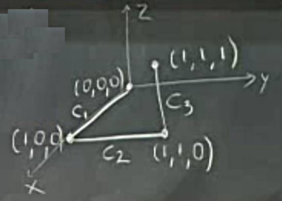
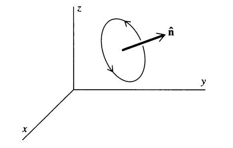
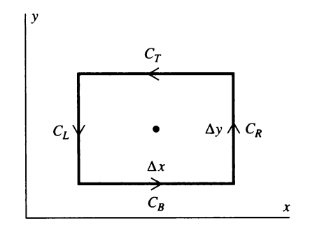
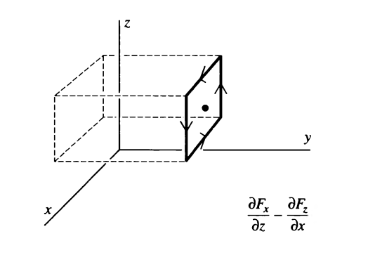
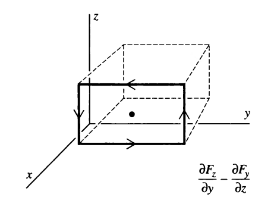

# Ders 30

Çizgi Entegralleri (Line Integrals)

Diyelim ki bir vektör alanı $F = P i + Qj + Rk$ var, ve bu alan bir kuvvet
alanını temsil ediyor olabilir. Aynı uzayda bir eğri $C$ var, ve bu alan içinde
yapılan iş $W = \int_C \vec{F} \cdot \mathrm{d} \vec{r}$ ile hesaplanabilir. Bu tanıdık
bir formülasyon tabii bir ek var, üçüncü kordinat $z$. Sonsuz küçük $\vec{r}$,

$$
\mathrm{d}\vec{r} = < \mathrm{d} x, \mathrm{d} y, \mathrm{d} z >
$$

olarak gösterilebilir, ve $\vec{F}$ ile noktasal çarpım yapınca tabii ki

$$
\int_C \vec{F} \cdot \mathrm{d} \vec{r} =
\int_C P \mathrm{d} x + Q \mathrm{d} y + R \mathrm{d} z
$$

sonucu elde edilir. Bu hala çizgisel entegral. Üstteki gerekli değerleri
soktuktan sonra temiz bir formüle dönüşecek. Metot düzlemde gördüğümüz durumla
aynı, eğriyi parametrize etmenin bir yolunu bulacağız, yani $x,y,z$
değişkenlerini tek bir değişken üzerinden göstereceğiz, sonra entegrasyonu
o tek değişken bağlamında yapacağız.

Örnek

$$
\vec{F} = < yz, xz, xy >
$$

$$
C: x=t^3, y=t^2, z=t, 0 \le t \le 1
$$

$\mathrm{d}\vec{r}$ elde etmek için $C$ öğelerinin $t$'ye göre türevini alırız,

$$
\mathrm{d} x = 3t^2, \mathrm{d} y = 2t \mathrm{d} t, \mathrm{d} z = \mathrm{d} t
$$

Nihai entegral hesabı için 

$$
\int_C \vec{F} \cdot \mathrm{d} \vec{r} =
\int_C yz \mathrm{d} x + xz \mathrm{d} y + xy \mathrm{d} z
$$

Biraz önce bulduğumuz $\mathrm{d} x$, $\mathrm{d} y$, $\mathrm{d} z$ değerlerini üste koyarsak,

$$
= \int_C t^3 3t^2 \mathrm{d} t + t^4 2t \mathrm{d} t + t^5 \mathrm{d} t
$$

$$
= \int_{0}^{1} 6 t^5 \mathrm{d} t = t^6 \big\vert_{0}^{1} = 1
$$

Yani klasik yaklaşımı daha yüksek boyutta uyguladık.

Eğer eğri geometrik bir tarif üzerinden verilmiş ise onu nasıl parametrize
edeceğimize kendimizin karar vermesi lazım. Parametrize etmek için en iyi
değişken nedir? Üstte gördüğümüz gibi bu parametre bir zamanımsı $t$ değişkeni
olabilir, ya da, kordinatlardan biri olabilir, yani $x,y,z$ değişkenlerinden
biri. Mesela üstteki örnekte $z$ de kullanabilirdim, o zaman eğri $x=z^3$,
$y=z^2$ olurdu (tabii ki $z=z$). Açıları da kullanılabiliriz, üstteki örnekte
değil ama eğer hareket bir çember, elips etrafında olsaydı bunu yapabilirdik.

Örnek

Aynı vektör alanı $F$ ama bu sefer $C$ alttaki gibi,

Nihai entegral üç parça halinde yapılmalı, $\int_C = \int_{C_1} + \int_{C_2} + \int_{C_3}$. 

$C_1,C_2$ icin $z=0$ v $\mathrm{d} z = 0$ cunku bu egri $xy$ duzleminde, o zaman 

$$
\int yz \mathrm{d} x + xz \mathrm{d} y + xy \mathrm{d} z = 0
$$

$C_3$ icin $x=1,y=1$ ve $\mathrm{d} x = 0, \mathrm{d} y = 0$. 

$$
\int_{C_3} \vec{F} \cdot \mathrm{d} \vec{r} =
\int_{C_3} xy \mathrm{d} z = \int_{0}^{1} \mathrm{d} z = 1
$$

O zaman tüm entegral şöyle,

$$
\int_C = \int_{C_1} + \int_{C_2} + \int_{C_3} = 0 + 0 + 1 = 1
$$

Şimdi ilginç bir nokta, eğer aynı nihai noktaya farklı bir eğri üzerinden
erişsek o eğri üzerinden hesaplanan çizgi entegrali aynı sonucu verir. Bu durum
aslında $F$'nin bir gradyan alanı, yani muhafazar olması ile alakalı. Eğer bir
alan gradyan alanı ise, aynen basit türevlerde olduğu gibi, Calculus'un Temel
Teorisi geçerlidir, türevin yol üzerindeki entegrali tümlenen fonksiyonun
başlangıç ve bitiş arasındaki farkına eşittir,

$$
\int_C \nabla f \cdot \mathrm{d} \vec{r} = f(P_1) - f(P_2)
$$

Peki $\vec{F} = < yz, xz, xy >$ alanının bir gradyan alanı olduğundan emin
miyiz? Evet çünkü bu alana gradyan alarak erişebileceğimizi biliyoruz, bir
tahmin yaparsak mesela $\vec{F} = \nabla (xyz)$ ile. O zaman örneğimize dönersek
çizgi entegralini sadece bitiş ve başlangıç noktalarını kullanarak
hesaplayabiliriz, $f(1,1,1) - f(0,0,0)$, $1 - 0 = 1$.

Gradyan alan testi şöyle yapılabilir, mesela $\vec{F} = <P,Q,R>$ verilmiş, bu
bir $<f_x, f_y, f_z>$ sonucu mu elde edilmiştir? Eğer öyleyse ikinci kısmı
türeve bakarız, $f_{xy} = f_{yx}$ olmalı, $f_{xz} = f_{zx}$ olmalı,
$f_{yz} = f_{zy}$ olmalı. Bu kısmi türev eşit olma durumu *aynı fonksiyonun*
farklı şekillerde ikinci türevinin alınıyor olmasının doğal sonucu tabii ki. Biz
bir probleme bakarken muhakkak aynı fonksiyonun birinci türevinden olup olmadığını
bilmiyoruz, ama ikinci türevleri farklı kombinasyonlarda alıp birbirlerine eşit
olup olmadığına baktığımızda durumu anlıyoruz. Eğer $< yz, xz, xy>$ verilmiş
ise bu ilk öğe $f_x$ sonucu mu? Ekstra ikinci türevi $f_{xy}$ alıp, $f_{yx}$ ile
karşılaştırıyoruz, bunu tüm diğerleri için yapınca kontrol tamamlanıyor.

(atlandı)

Dolam (Curl)

Üç boyutta iş hesabı için Green'in Teorisi'nin yerine geçen teori Stokes'un
Teorisi (Stokes' Theorem). Ama önce dolam konusu ile başlayalım.

Aslında dolamın hesapladığı vektör alanınızın muhafazakar olmakta ne kadar
başarısız olduğu. Eğer fiziksel hareketlilik bağlamında bakmak istiyorsak
dolam alanımızın dönmeye olan meyilini ölçer. Formülsel olarak dolam,

$$
\mathrm{curl} \vec{F} = (R_y - Q_z) i + (P_z - R_x) j + (Q_x - P_y) k
$$

olarak gösterilir. Tabii görür görmez öğrencinin unuttuğu bir formül..
oldukca karışık çünkü.

Formülün yapısı, başladığı kavram nedir? Şudur, bir alanının muhafazakar olması
için üstte gördüğümüz $i,j,k$ solundaki bölümlerin her birinin sıfır olması
gerekiyor, yani $\mathrm{curl} \vec{F} = 0$ olması gerekiyor.

Üç boyuttaki dolamın iki boyuttakinden farkı iki boyutta elimizde bir skalar,
tek sayı vardı, burada bir alan var. Yani bir alanın dolamı yeni bir alan verir,
her noktada yeni bir vektör elde ederiz, sağ el kuralı bağlamında bu vektör
dönüşten (ona oranlı) yukarı çıkan bir yönü gösterir. 

Formülü hatırlama noktasına gelirsek, aslında iyi bir teknik (ve cebirsel olarak
doğru) olan bir yöntem dolamı $\nabla \times \vec{F}$ olarak düşünmek. Yani
$F$'nin gradyanini alıyoruz, onu $F$ ile çapraz çarpınca elde edilen sonuç
dolamdır. 

Gradyan operatörü diğer kavramlarda da faydalı. Onu operatör olarak düşünüyoruz,

$$
\nabla = < \frac{\partial }{\partial },
           \frac{\partial }{\partial },
           \frac{\partial }{\partial } >
$$

Ters dönük üçgen, gradyan, ya da "del'' operotoru. Onu bir skalar fonksiyon
$f$'ye uygularsak,

$$
\nabla f = < \frac{\partial f}{\partial },
             \frac{\partial f}{\partial },
             \frac{\partial f}{\partial } >
$$

Eğer del operatörü ardından bir alan üzerinde noktasal çarpım varsa, bu del
ile elde edilen sonucun aynı alan ile noktasal çarpım yapılması anlamına
gelir, ki bu uzaklaşım (divergence) kavramıdır.

$$
\nabla \cdot < P,Q,R > =
\frac{\partial P}{\partial x} +
\frac{\partial Q}{\partial y} +
\frac{\partial R}{\partial z}
$$

Dolamı üsttekine benzer ilginç bir notasyon ile gösteriyoruz,

$$
\nabla \times \vec{F} =
\det
\left[\begin{array}{ccc}
i & j & k \\
\frac{\partial }{\partial x} & \frac{\partial }{\partial y} & \frac{\partial }{\partial z} \\
P & Q & R
\end{array}\right]
$$

Boş olan kısmı türev işaretleri determinantı hesaplarken devreye girecek, her
alt matrisi hesaplarken kısmı türev operatörü çaprazındaki hücreye uygulanır,

$$
\mathrm{curl} \vec{F} =
  \left(\frac{\partial R}{\partial y} - \frac{\partial Q}{\partial z}\right) i -
  \left(\frac{\partial R}{\partial x} - \frac{\partial P}{\partial z}\right) j +
  \left(\frac{\partial Q}{\partial x} - \frac{\partial P}{\partial y}\right) k   
$$

Dolam hesabı yapmak gerektiğinde hatırlayalım, bir üstteki koca formülü
hatırlamaya gerek yok, iki üstteki yapıyı hatırlarsak onun açılımı direk
üstteki sonuç olacaktır.

Bitirmeden önce, dolam hesabını gördük, onun geometrik yorumu ne olmalıdır?
Şöyle fade edebiliriz, dolam bir hız alanının dönüşsel bileşenini hesaplar.

Egzersiz olarak $z$ ekseni etrafında açısal hız $\omega$ ile dönen bir sıvı
hareketini düşünelim, hız alanı $\vec{v} = < -\omega y, \omega, 0 >$.  Bu
alanın dolamını hesaplarsanız $2 \omega k$ sonucunu elde ederdiniz.  Yani dolam
hesabı ile dönüşün açısal hızını elde etmiş olduk (iki katı daha doğrusu ama bu
fark etmiyor). Dolam dönüşün yönünü de gösteriyor, $z$ ekseni.

Daha çetrefil dönüşler olabilir muhakkak, bir kısım yer değişim olabilir mesala,
onunla beraber dönüşsel hareket olabilir, dolam hesabı tüm bu çetrefil hareketi
analiz edip içindeki dönüşün ne kadar olduğunu bize raporlayabilir.

Ekler

Dolam formülünü nasıl türetiriz? Bir vektör alanı $F = [F_1,F_2,F_3]$ için
hesabı şu şekilde,

$$
\mathrm{curl} F = \left[\begin{array}{ccc} 
\dfrac{\partial F_3}{\partial y} - \dfrac{\partial F_2}{\partial z} & 
\dfrac{\partial F_1}{\partial z} - \dfrac{\partial F_3}{\partial x} & 
\dfrac{\partial F_2}{\partial x} - \dfrac{\partial F_1}{\partial y} 
\end{array}\right]
\qquad (2)
$$

Bu hesap, isminin çağrıştırabileceği üzere bir vektör alanının döndürme etkisini
özetler. Mesela içinde dalgalar, akımlar olan bir sıvıya ufak bir küre attık. Bu
küre o sıvının hareketlerine, yani $F$'sine göre, belli bir şekilde dönmeye
başlayabilir, bu dönüşü özetlemenin iyi bir yolu curl hesabıdır.

Çizgi entegrali yardıma yetişiyor. Üç tane eksen üzerinden, o eksenler etrafında
ufak bir dönme yolunun yaptığı işi ayrı ayrı hesaplayabiliriz, ve sonucu aynı
boyutta bir vektörün boyutları olarak kabul edebiliriz, ve vektörün gösterdiği
yön etrafında sağ el kuralı dönüşün nasıl olduğunu tarif eder, vektörün
büyüklüğü ise dönüşün hızını. 

Hatırlarsak yapılan iş $W = \int_{t=a}^{t=b} F \cdot T \mathrm{d} s$ ile hesaplanır,
$T$ ile $F$'nin üzerinde gidilen eğrinin yansımasına bakıyoruz, $\mathrm{d} s$ bu
eğrinin ufak bir parçası [2, sf. 1153]. Aynı işlem $F \mathrm{d} \vec{r}$ ile de
gösterilebilir.

Devam edersek, şimdi diyelim ki $F$'nin ufak bir dikdörtgen etrafında yaptığı
dönüşsel işi, dolaşımını (circulation) hesaplayacağız. Sonra dikdörtgeni limite
götürüp sonsuz küçültünce bir analitik sonuca erişmiş olacağız.

Bu hesabı her eksen için yapmak istiyoruz, önce $z$'den başlayalım, dolaşım $xy$
düzleminde olacak [1, sf. 77].

Önce $C_B$ parçasını hesaplayalım. Üst sağdaki resimde görülüyor, ortaki
noktanın kordinat değeri $x,y,z$, $C_B$ üzerinde $F$'nin bileşeni $F_x$, oradaki
$F_x$ değeri $F_x(x,y-\frac{\Delta y}{2}, z)$. Bu kuvveti $C_B$ boyunca
katedilen yol $\Delta x$ ile çarpıyoruz,

$$
\int_{C_B} F \cdot T \mathrm{d} s =
\int_{C_B} F_x \mathrm{d} x \approx
F_x \left( x,y-\frac{\Delta y}{2}, z \right) \Delta x
$$

$C_T$ icin

$$
\int_{C_T} F_x \mathrm{d} x \approx -F_x \left(x,y+\frac{\Delta y}{2}, z \right) \Delta x
$$

Yukarı ve aşağı gidişi hesaplamadık çünkü o yollar $F_x$'e dik, yapılan iş
sıfır. Üstteki sonuçları toplarsak,

$$
\int_{C_T+C_B} F \cdot T \mathrm{d} s  = - \left[
F_x \left( x,y+\frac{\Delta y}{2},z \right) -
F_x \left( x,y-\frac{\Delta y}{2},z \right)
\right] \Delta x
$$

$$
= - \dfrac{
\left[
  F_x \left( x,y+\dfrac{\Delta y}{2},z \right) -
  F_x \left( x,y-\dfrac{\Delta y}{2},z \right)
\right]  
}{\Delta y}
\Delta x \Delta y
$$

$\Delta x \Delta y$ carpani tabii ki dikdortgenin alani. Onu sol tarafa alirsak,

$$
\frac{1}{\Delta S}\int_{C_T+C_B} F \cdot T \mathrm{d} s \approx
- \dfrac{
\left[
  F_x \left( x,y+\dfrac{\Delta y}{2},z \right) -
  F_x \left( x,y-\dfrac{\Delta y}{2},z \right)
\right]  
}{\Delta y}
$$

Benzer analizi dikdörtgenin sağ ve sol tarafına, $C_L$ ve $C_R$ için uygularsak,

$$
\frac{1}{\Delta S}\int_{C_L+C_R} F \cdot T \mathrm{d} s \approx
- \dfrac{
\left[
  F_y \left( x+\dfrac{\Delta x}{2},y,z \right) -
  F_y \left( x-\dfrac{\Delta x}{2},y,z \right)
\right]  
}{\Delta x}
$$

Son iki sonucu toplarız, $\Delta S$'nin limitini alırız, böylece dikdörtgen
$x,y,z$ noktasına sonsuz küçültülmüş olur, ki bu durumda $\Delta x \to 9$ ve
$\Delta y \to 0$, böylece nihai eriştiğimiz sonuç,

$$
\lim_{\Delta \to 0} \frac{1}{\Delta S} \oint F \cdot T \mathrm{d} s =
\frac{\partial F_y}{\partial x} - \frac{\partial F_x}{\partial y}
$$

Entegralde $\int$ yerine $\oint$ kullandık ki dolaşım hesabı olduğu daha iyi
belli olsun.

Tabii bu tek eksen, $z$ ekseni etrafındaki dolaşım. Aynı işlemi diğer eksenlere
de uygularsak,

Tüm bu bileşenleri bir araya koyunca (2)'de gösterilen curl vektörüne ulaşmış
oluyoruz, $z$ ekseni etrafındaki 3. öğe, üstteki soldaki 2. sağdaki 1. öğe,

$$
\mathrm{curl} F = \left[\begin{array}{ccc} 
\dfrac{\partial F_z}{\partial y} - \dfrac{\partial F_y}{\partial z} & 
\dfrac{\partial F_x}{\partial z} - \dfrac{\partial F_z}{\partial x} & 
\dfrac{\partial F_y}{\partial x} - \dfrac{\partial F_x}{\partial y} 
\end{array}\right]
$$

$F_1,F_2,F_3$ yerine $F_x,F_y,F_z$ kullanmış olduk.

Kaynaklar

[1] Schey, *Div, Grad, Curl, All That, 4th Ed*

[2] Thomas, *Thomas Calculus, 11th Ed*

