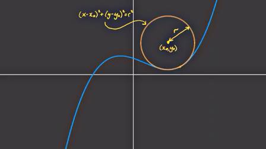
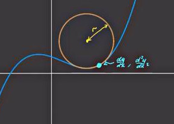

# Eğrilik (Curvature)

Bir eğrimiz var, bu eğriye herhangi bir noktada ona en iyi uyan, onun eğimini en
iyi gösteren bir çemberi nasıl buluruz? Alttaki gibi bir uyumdan bahsediyoruz,

Bu yazıda bu ideal çemberin yarıçapını bulmayı göreceğiz, elde edilecek
formül eğrinin o noktadaki türevleri üzerinden yapılacak.

Çemberin bir $x_0,y_0$ merkezli olduğunu düşünelim, ve yarıçapı $r$ olsun. Bu
çemberin formülü şekildeki gibi olur,

Şimdi cebirsel numaralara gelelim. Çember 

$$
(x-x_0)^2 + (y-y_0)^2 = r^2
$$

formülünün $x$'e göre türevini alalım. Karedeki 2 aşağı iner, ve parantez içinin
türevi alınır,

$$
2 (x-x_0) [1] + 2(y-y_0) \frac{\mathrm{d} y}{\mathrm{d} x} = 0
$$

$$
(x-x_0) + (y-y_0) \frac{\mathrm{d} y}{\mathrm{d} x} = 0
$$

Şimdi üstteki formülün bir kez daha türevini alalım,

$$
1 + (y-y_0) \frac{\mathrm{d}^2y}{\mathrm{d} x^2} +
\left(  \frac{\mathrm{d} y}{\mathrm{d} x}  \right) \frac{\mathrm{d} y}{\mathrm{d} x}  = 0
$$

$$
1 + (y-y_0) \frac{\mathrm{d}^2y}{\mathrm{d} x^2} +
\left(  \frac{\mathrm{d} y}{\mathrm{d} x}  \right)^2 = 0
$$

Böylece çember formülünden başlayarak üç tane formül elde etmiş olduk.

$$
(x-x_0)^2 + (y-y_0)^2 = r^2
\qquad (1)
$$

$$
(x-x_0) + (y-y_0) \frac{\mathrm{d} y}{\mathrm{d} x} = 0
\qquad (2)
$$

$$
1 + (y-y_0) \frac{\mathrm{d}^2y}{\mathrm{d} x^2} +
\left( \frac{\mathrm{d} y}{\mathrm{d} x}  \right)^2 = 0
\qquad (3)
$$

(3) formülünü $y-y_0$ solda olacak şekilde tekrar düzenleyelim,

$$
y-y_0 = - \frac{1 + \left( \frac{\mathrm{d} y}{\mathrm{d} x}  \right)^2}{\frac{\mathrm{d}^2y}{\mathrm{d} x^2}}
$$

Benzer bir işlemi (2) üzerinde $x-x_0$ için yapalım,

$$
x-x_0 = -(y-y_0)\frac{\mathrm{d} y}{\mathrm{d} x}
$$

Üstteki formülde $y-y_0$ ifadesi var, onu iki üstteki formülde bulmuştuk,
oraya sokalım,

$$
= \frac{1 + \left( \frac{\mathrm{d} y}{\mathrm{d} x}  \right)^2}{\frac{\mathrm{d}^2y}{\mathrm{d} x^2}}
\frac{\mathrm{d} y}{\mathrm{d} x}
$$

Böylece hem $x-x_0$ hem de $y-y_0$ için bir formül elde etmiş olduk.

Bu formülleri cember formülü $r$ içine koyalım,

$$
\left[
    \frac{1 + \left( \frac{\mathrm{d} y}{\mathrm{d} x}  \right)^2}
         {\frac{\mathrm{d}^2y}{\mathrm{d} x^2}} \frac{\mathrm{d} y}{\mathrm{d} x}
\right]^2
+
\left[
  - \frac{1 + \left( \frac{\mathrm{d} y}{\mathrm{d} x}  \right)^2}
         {\frac{\mathrm{d}^2y}{\mathrm{d} x^2}}
\right] = r^2
$$

Ortak ifadeyi dışarı çekersek, 

$$
\left[
    \dfrac{1 + \left( \dfrac{\mathrm{d} y}{\mathrm{d} x}  \right)^2}
         {\dfrac{\mathrm{d}^2y}{\mathrm{d} x^2}}
\right]^2
\left(  \left(\dfrac{\mathrm{d} y}{\mathrm{d} x}  \right)^2 + 1 \right) = r^2
$$

$$
\frac{\left( 1 +  \left( \dfrac{\mathrm{d} y}{\mathrm{d} x} \right)^2  \right)^3}
     { \left( \dfrac{\mathrm{d}^2y}{\mathrm{d} x^2}   \right)^2  }
     = r^2
$$

Karekök alırsak,

$$
r =
\frac{\left( 1 +  \left( \dfrac{\mathrm{d} y}{\mathrm{d} x} \right)^2  \right)^{3/2}}
     { \dfrac{\mathrm{d}^2y}{\mathrm{d} x^2}   }
$$

Böylece sonuca erişmiş olduk. Çemberin türevlerini kullanarak o çemberin
yarıçapını formülize eden bir ifadeye eriştik. Eğrinin her noktada birer birinci
ve ikinci derece türevi vardır ve bu türevleri baz alarak oluşturulmuş bir
çember o noktada tabii ki o eğriyi en yakın yaklaşık olarak temsil eden
çember olacaktır. 

Kaynaklar

[1] Radius of Curvature Proof - approximating a curve with a circle!,
    [https://www.youtube.com/watch?v=ZCJfq77sFE8](https://www.youtube.com/watch?v=ZCJfq77sFE8)

