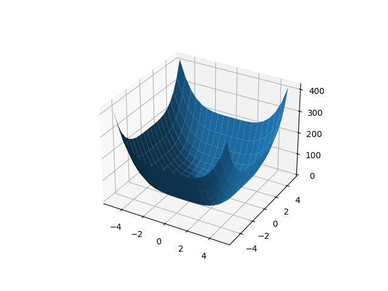
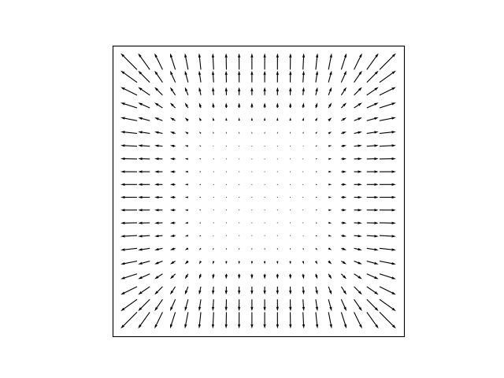
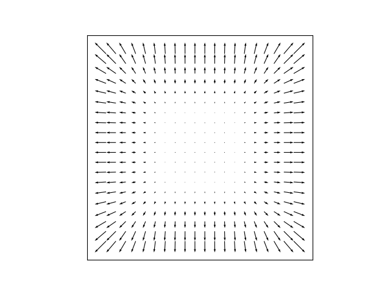
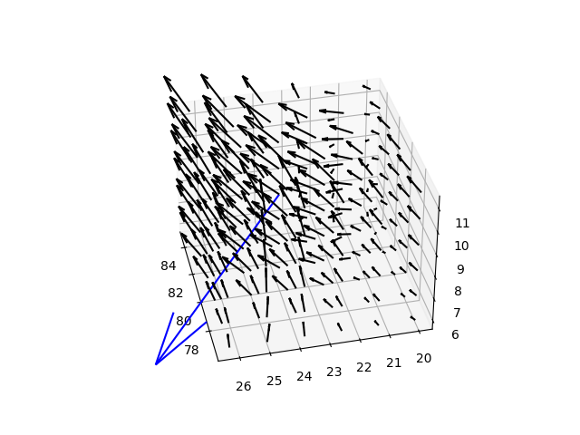

# Div, Curl, Laplasyan (Laplacian)

Elimizde iki türlü fonksiyon olabilir, ya skalar (tek sayı) fonksiyonu, ya da
vektör fonksiyonu. Bu fonksiyonların skalar alan (scalar field) ve vector alanı
(vector field) oluşturduğu söylenebilir. Alan tarifi fonksiyonların çıktısı ile
alakalıdır, eğer fonksiyon çok boyutlu girdi alıp tek boyut (tek sayı)
döndürüyorsa skalar alan, çok boyutlu vektör döndürüyorsa vektör alanı
tanımlıyor demektir.

Mesela bir skalar alan $f(x,y,z)$ fonksiyonu ile tanımlanıyor olabilir, ve
$f(x,y,z) = 2y^3 + 4 xz + 3x$ olabilir.

Skalar alanın gradyanı bir vektördür,

$$
\nabla f = \left[
  \frac{\partial f}{\partial x}, 
  \frac{\partial f}{\partial y}, 
  \frac{\partial f}{\partial z}
\right]
$$

yani bir vektör alanı oluşturmuş oluyoruz, fonksiyon çok boyutlu sonuç
donduruyor, skalar alanın gradyanı bir vektör alanı tanımlamış oluyor. Her
farklı $x,y,z$ değeri için bir vektör sonucu alıyoruz.

Fonksiyonel olarak analitik şekilde

$$
f = \left[\begin{array}{r} f_1(x,y,z) \\ f_2(x,y,z) \\ f_3(x,y,z) \end{array}\right]
$$

olabilir.

Mesela skalar alan

$$
U(x,y) = \frac{1}{3} (x^4 + y^4)
\qquad (1)
$$

olsun,

```python
from mpl_toolkits.mplot3d import Axes3D
fig, ax = plt.subplots(1, 1, subplot_kw={'projection': '3d'})
xx = np.linspace(-5.0,5.0,20)
yy = np.linspace(-5.0,5.0,20)
x,y = np.meshgrid(xx,yy);
U = 1/3*( (x**4) + (y**4))
ax.plot_surface(x,y,U)
plt.savefig('calc_multi_70_div_curl_lap_01.png')
```



Gradyanı analitik olarak bulabiliriz,

$$
\nabla U = \frac{4}{3} [\begin{array}{cc} x^3 & y^3 \end{array}]^T
$$

Gradyan vektör alanı [6],

```python
u, v = 4/3*x**3, 4/3*y**3
fig, ax = plt.subplots()
ax.quiver(x,y,u,v)
ax.xaxis.set_ticks([])
ax.yaxis.set_ticks([])
ax.axis([-6, 6, -6, 6])
ax.set_aspect('equal')
plt.savefig('calc_multi_70_div_curl_lap_03.png')
```



Üstte analitik sonucu grafikledik. Gradyanı pür sayısal olarak
hesaplayabilirdik, bu fonksiyon yaklaşık türev hesabını üç boyut için yapıyor,
`gradient` çağrısını kullanıyoruz, 

```python
uu,vv = np.gradient(U)
fig, ax = plt.subplots()
ax.quiver(x,y,vv,uu)
ax.xaxis.set_ticks([])
ax.yaxis.set_ticks([])
ax.axis([-6, 6, -6, 6])
ax.set_aspect('equal')
plt.savefig('calc_multi_70_div_curl_lap_04.png')
```



Benzer bir sonuç elde ettik.

Çizgizel Entegral (Line Integral)

Bu konu [11]'de gayet güzel bir şekilde anlatılıyor. 

Uzaklaşım (Divergence)

Bu hesap $\mathrm{div} f$, ya da $\nabla \cdot f$ ile gösterilir. Vektör alanı
uzaklaşımı,

$$
\mathrm{div} f = \left(
\frac{\partial f_1}{\partial x} + 
\frac{\partial f_2}{\partial y} + 
\frac{\partial f_3}{\partial z} 
\right)
$$

Gradyan $\nabla$ işareti görülüyor [4, sf. 403], fakat bu notasyonel bir
rahatlık sadece.

$$
\nabla \cdot f = \left(
\frac{\partial }{\partial x},
\frac{\partial }{\partial y},
\frac{\partial }{\partial z} 
\right) 
\cdot
\left[ f_1, f_2, f_3 \right]
$$

$$
= \left( \frac{\partial }{\partial x} \right)(f_1) + 
\left( \frac{\partial }{\partial y} \right)(f_2) + 
\left( \frac{\partial }{\partial z} \right)(f_3) 
$$

$$
= \frac{\partial f_1}{\partial x} +
\frac{\partial f_2}{\partial y} +
\frac{\partial f_3}{\partial z}
$$

Uzaklaşımın fiziksel yorumu bir vektör alanındaki ufak bir alanda görülen akış
(flux) olabilir. Onu bir vektör alanının genişleme ya da küçülme oranı olarak ta
görebiliriz. Eğer yeteri kadar ufak bir alandan çıkan vektörler girenlerden
fazla / büyük ise o nokta bir kaynaktır, uzaklaşım sıfırdan büyüktür, tersi ise
uzaklaşım sıfırdan küçüktür.

Örnek olarak elimizde iki boyutlu bir vektör alanı olduğunu farzedelim, $x,y$
kordinatları $U(x,y) = [u_1(x,y), u_2(x,y)]$ ile bir vektör döndürülüyor, mesela

$$
U(x,y) = [\cos(x + 2y), \sin(x - 2y)]
$$

Bu alanın uzaklaşımı analitik olarak

$$
\mathrm{div} U = - 2\cos(x - 2y) - \sin(x + 2y)
$$

Bu bize her noktada bir tek sayı değeri veriyor, o noktada akışın çıkmakta mı
(kaynak -source-) yoksa yokolmakta mı (alıcı -sink) olduğunu bu sayı ile
irdeleyebiliyoruz. Biz uzaklaşımı altta sayısal olarak hesapliyoruz, ve hem
vektör alanını hem de uzaklaşım tek sayısını bir renk kodu ile aynı grafikte
gösterirsek,

```python
import numpy as np
import matplotlib.pyplot as plt

NY = 20; ymin = -2.; ymax = 2.
dy = (ymax -ymin )/(NY-1.)
NX = NY
xmin = -2.; xmax = 2.
dx = (xmax -xmin)/(NX-1.)

def divergence(f):
    num_dims = len(f)
    tmp = [np.gradient(f[i], axis=i) for i in range(num_dims)]
    return np.ufunc.reduce(np.add, tmp)

y = np.array([ ymin + float(i)*dy for i in range(NY)])
x = np.array([ xmin + float(i)*dx for i in range(NX)])

x, y = np.meshgrid( x, y, indexing = 'ij', sparse = False)

Fx  = np.cos(x + 2*y)
Fy  = np.sin(x - 2*y)

F = [Fx, Fy]
g = divergence(F)

plt.pcolormesh(x, y, g, shading='nearest', cmap=plt.cm.get_cmap('coolwarm'))
plt.colorbar()
plt.quiver(x,y,Fx,Fy)
plt.savefig('calc_multi_70_div_curl_lap_05.png')
```


Sonuç [7]'deki analitik hesaba yakın. Üstteki kodda `gradient` ile her
boyut üzerinde sayısal gradyan hesabı yapılıyor ve sonuçlar toplanıyor. Not:
vektör alanının kendisi de bir gradyan işleminin sonucu olabilir, o noktaya
nasıl gelindiğinden bahsetmiyoruz, biz elde nereden gelmiş olursa olsun bir
vektör alanı olduğunu farz ediyoruz.

Oklara ve renklere bakarsak hakikkaten de mavi renkli bölgelere daha fazla giriş
olduğundan şüphe yok, bu iyi, hesap doğru işliyor demektir. Aynı şekilde kırmızı
bölglerde daha fazla kaçıs var.

Laplasyan (Laplacian)

Diyelim ki $f$ skalar alanı iki kez türevi alınabilir halde. O zaman $f$'nin
gradyanı $\nabla f$ de türevi alınabilir bir vektör alanıdır, ve onun da
uzaklaşımı hesaplanabilir, ve böylece bir tane daha skalar alan daha elde
edilebilir [3, sf. 56]. Bu skalar alan, $\nabla \cdot \nabla f$ sonucuna $f$'nin
Laplasyanı ismi verilir, ve kendi sembolü de vardır $\nabla^2 f$, bazen
düz üçgen ile de gösterilebilr, $\Delta f$.

Reel değerli bir fonksiyon $f(x,y,z)$ için [1, sf. 178], $f$'nin gradyani bir
vektör alanı, ve onun uzaklaşımını alıyoruz,

$$
\mathrm{div} \nabla f = \nabla \cdot \nabla = \nabla^2 f =
\left(
\frac{\partial }{\partial x},
\frac{\partial }{\partial y},
\frac{\partial }{\partial z} 
\right) \cdot
\left(
\frac{\partial f}{\partial x},
\frac{\partial f}{\partial y},
\frac{\partial f}{\partial z} 
\right)
$$

$$
= \frac{\partial }{\partial x}\left(\frac{\partial f}{\partial x}\right)+
\frac{\partial }{\partial y}\left(\frac{\partial f}{\partial y}\right)+
\frac{\partial }{\partial z}\left(\frac{\partial f}{\partial z}\right)
$$

$$
= \frac{\partial^2 f}{\partial x^2} +
\frac{\partial^2 f}{\partial y^2} +
\frac{\partial^2 f}{\partial z^2} 
$$

Kabaca bir tarif olarak gradyan vektörlerinin en yüksek değerlere sahip olduğu
yerler değişimin en çok olduğu yönlere değil mi? Bir tepe altından tepe yönüne
doğru, tepe noktasında çok yüksek değerler vardır, altta daha alçak değerler,
gradyan yukarıya gösterir. Bu gradyan alanını üzerinde uzaklaşım hesaplayınca
alanın her noktası için sayısal bir akış sayısı hesaplamış oluruz. "Gradyan
akışının en yüksek olduğu yerler'' bulunmuş oluyor. Laplasyan hesabı bu sebeple
averajdan sapmanın en fazla olduğu noktaları mdoellemek için kullanılır.

Üstte bir operatör tanımlamış olduk, bu operatör bazen $(\mathcal{L})(x,y,..)$
ile de gösterilebilir, mesela iki boyut için

$$
(\mathcal{L})(x,y) =
\frac{\partial^2 }{\partial x^2} + 
\frac{\partial^2 }{\partial y^2} 
$$

Sayısal olarak Laplasyan hesabını görelim.

Örnek

Analitik olarak biliyoruz ki (1)'in Laplasyanı

$$
\nabla^2 U(x,y) = 4 x^2 + 4 y^2
$$

foksiyonuna eşit. Bakalım sayısal olarak yaklaşık olarak aynı sonucu alabilecek
miyiz? Burada `del2` çağrısı var (iyi isim, çünkü $\nabla$ işaretine 'del'
denir, 'del2' ile onun karesi çağrıştırılıyor),

```python
import numpy as np

def del2(M):
    dx = 1
    dy = 1
    rows, cols = M.shape
    dx = dx * np.ones ((1, cols - 1))
    dy = dy * np.ones ((rows-1, 1))

    mr, mc = M.shape
    D = np.zeros ((mr, mc))

    if (mr >= 3):
        ## x direction
        ## left and right boundary
        D[:, 0] = (M[:, 0] - 2 * M[:, 1] + M[:, 2]) / (dx[:,0] * dx[:,1])
        D[:, mc-1] = (M[:, mc - 3] - 2 * M[:, mc - 2] + M[:, mc-1]) \
            / (dx[:,mc - 3] * dx[:,mc - 2])

        ## interior points
        tmp1 = D[:, 1:mc - 1] 
        tmp2 = (M[:, 2:mc] - 2 * M[:, 1:mc - 1] + M[:, 0:mc - 2])
        tmp3 = np.kron (dx[:,0:mc -2] * dx[:,1:mc - 1], np.ones ((mr, 1)))
        D[:, 1:mc - 1] = tmp1 + tmp2 / tmp3

    if (mr >= 3):
        ## y direction
        ## top and bottom boundary
        D[0, :] = D[0,:]  + \
            (M[0, :] - 2 * M[1, :] + M[2, :] ) / (dy[0,:] * dy[1,:])

        D[mr-1, :] = D[mr-1, :] \
            + (M[mr-3,:] - 2 * M[mr-2, :] + M[mr-1, :]) \
            / (dy[mr-3,:] * dx[:,mr-2])

        ## interior points
        tmp1 = D[1:mr-1, :] 
        tmp2 = (M[2:mr, :] - 2 * M[1:mr - 1, :] + M[0:mr-2, :])
        tmp3 = np.kron (dy[0:mr-2,:] * dy[1:mr-1,:], np.ones ((1, mc)))
        D[1:mr-1, :] = tmp1 + tmp2 / tmp3

    return D / 4

```

Ayrıksal Laplasyanı grafiklersek,

```python
from del2 import del2
L = 4*del2(U);
fig, ax = plt.subplots(1, 1, subplot_kw={'projection': '3d'})

ax.plot_surface(x,y,L)
plt.savefig('calc_multi_70_div_curl_lap_02.png')
```


Evet, üstteki resim $4 x^2 + 4 y^2$ gibi duruyor [5].

Dolam (Curl)

Bu kavram [12]'de anlatildi.  Bir üç boyutlu vektör alanı, ve onun analitik
olarak curl hesabını verelim,

```python
import sympy
x, y, z = sympy.symbols('x y z', real=True)
pi = sympy.symbols('pi', constant=True)
Fx = sympy.sin(sympy.pi * x) * sympy.cos(sympy.pi * y) * sympy.cos(sympy.pi * z)
Fy = -sympy.cos(sympy.pi * x) * sympy.sin(sympy.pi * y) * sympy.cos(sympy.pi * z)
Fz = (sympy.sqrt(2.0 / 3.0) * sympy.cos(sympy.pi * x) * sympy.cos(sympy.pi * y) * sympy.sin(sympy.pi * z))
cx = sympy.diff(Fz, y) - sympy.diff(Fy, z) 
cy = sympy.diff(Fx, z) - sympy.diff(Fz, x)
cz = sympy.diff(Fy, x) - sympy.diff(Fx, y)

xx_1d = np.linspace(-5.0, 5.0, 20)
yy_1d = np.linspace(-5.0, 5.0, 20)
zz_1d = np.linspace(-5.0, 5.0, 20) # Define a 1D array for z
x_grid, y_grid, z_grid = np.meshgrid(xx_1d, yy_1d, zz_1d, indexing='ij')

i,j,k=2,2,1
x0,y0,z0 = x_grid[i,j,k], y_grid[i,j,k], z_grid[i,j,k]

i,j,k=1,3,1
x0,y0,z0 = x_grid[i,j,k], y_grid[i,j,k], z_grid[i,j,k]
c1,c2,c3 = cx.subs([(x, x0), (y, y0), (z, z0)]).evalf(),\
           cy.subs([(x, x0), (y, y0), (z, z0)]).evalf(),\
           cz.subs([(x, x0), (y, y0), (z, z0)]).evalf()
print ( c1,c2,c3  )
```

```text
0.455274319076588 0.140555584590781 -0.501266364998131
```

```python
from mpl_toolkits.mplot3d import axes3d

fig, ax = plt.subplots(1, 1, subplot_kw={'projection': '3d'})
ax.view_init(elev=21, azim=-44)
xx, yy, zz = np.meshgrid(np.arange(-0.8, 1, 0.2),
                         np.arange(-0.8, 1, 0.2),
                         np.arange(-0.8, 1, 0.8))

u = np.sin(np.pi * xx) * np.cos(np.pi * yy) * np.cos(np.pi * zz)
v = -np.cos(np.pi * xx) * np.sin(np.pi * yy) * np.cos(np.pi * zz)
w = (np.sqrt(2.0 / 3.0) * np.cos(np.pi * xx) * np.cos(np.pi * yy) *  np.sin(np.pi * zz))

ax.quiver(xx, yy, zz, u, v, w, length=0.1, color = 'black')
ax.quiver(x0, y0, z0, c1, c2, c3, length=0.3, color = 'blue')
plt.savefig('calc_multi_70_div_curl_lap_11.png')
```


Sağ el kuralından ve akıntıya bakarak bu sonucun doğru olduğunu görebiliriz.

Şimdi sayısal olarak curl kodlamasına bakalım, bu kod da `gradient`
çağrıları yaparak ve sonuçları işleyerek bir curl hesabı yapıyor. 

```python
import numpy as np
import scipy.io as sio

def curl(x,y,z,u,v,w):
    dx = x[0,:,0]
    dy = y[:,0,0]
    dz = z[0,0,:]

    dummy, dFx_dy, dFx_dz = np.gradient (u, dx, dy, dz, axis=[1,0,2])
    dFy_dx, dummy, dFy_dz = np.gradient (v, dx, dy, dz, axis=[1,0,2])
    dFz_dx, dFz_dy, dummy = np.gradient (w, dx, dy, dz, axis=[1,0,2])

    rot_x = dFz_dy - dFy_dz
    rot_y = dFx_dz - dFz_dx
    rot_z = dFy_dx - dFx_dy

    l = np.sqrt(np.power(u,2.0) + np.power(v,2.0) + np.power(w,2.0));

    m1 = np.multiply(rot_x,u)
    m2 = np.multiply(rot_y,v)
    m3 = np.multiply(rot_z,w)

    tmp1 = (m1 + m2 + m3)
    tmp2 = np.multiply(l,2.0)

    av = np.divide(tmp1, tmp2)

    return rot_x, rot_y, rot_z, av
```

Örnek veri Matlab / Octave problemlerinden iyi bilinen rüzgar verisi
[10]. Alttaki kodda ufak bir bölgedeki rüzgar hızını grafikliyoruz, ve ortasında
curl hesabı yapıyoruz.

```python
from mpl_toolkits.mplot3d import axes3d
import scipy.io as sio

mat = sio.loadmat('wind.mat')
x = mat['x']; y = mat['y']; z = mat['z']
u = mat['u']; v = mat['v']; w = mat['w']

rot_x, rot_y, rot_z, av = curl(x,y,z,u,v,w)

# i,j,k etrafinda ufak bir bolgeyi grafikle
i=5;j=7;k=8;S = 3
x1 = x[i-S:i+S, j-S:j+S, k-S:k+S]; 
y1 = y[i-S:i+S, j-S:j+S, k-S:k+S]; 
z1 = z[i-S:i+S, j-S:j+S, k-S:k+S];
u1 = u[i-S:i+S, j-S:j+S, k-S:k+S]; 
v1 = v[i-S:i+S, j-S:j+S, k-S:k+S]; 
w1 = w[i-S:i+S, j-S:j+S, k-S:k+S];

fig, ax = plt.subplots(1, 1, subplot_kw={'projection': '3d'})

ax.view_init(elev=36, azim=167)

ax.quiver(x1, y1, z1, u1, v1, w1, length=0.05, color = 'black')

i=5;j=7;k=8;
x0=x[i,j,k]
y0=y[i,j,k]
z0=z[i,j,k]
cx0=rot_x[i,j,k]
cy0=rot_y[i,j,k]
cz0=rot_z[i,j,k]
ax.quiver(x0, y0, z0, 0, cy0, cz0, length=1.0, color = 'blue')

plt.savefig('calc_multi_70_div_curl_lap_12.png')
```




Kaynaklar 

[1] Corral, *Vector Calculus*

[2] 3Blue1Brown, *Uzaklaşım (Divergence) ve Curl, Maxwell Denklemlerinin Dili*,
    [https://www.youtube.com/watch?v=8kX2f2olQao](https://www.youtube.com/watch?v=8kX2f2olQao)

[3] Matthews, *Vector Calculus*

[4] Kreyszig, *Advanced Engineering Mathematics 10th Ed*

[5] Mathworks del2, [https://www.mathworks.com/help/matlab/ref/del2.html#bt1j8dn-5](https://www.mathworks.com/help/matlab/ref/del2.html#bt1j8dn-5)

[6] Kazarinoff, [https://pythonforundergradengineers.com/quiver-plot-with-matplotlib-and-jupyter-notebooks.html](https://pythonforundergradengineers.com/quiver-plot-with-matplotlib-and-jupyter-notebooks.html)

[7] Petersdorff, *Example for curl and div of a 2D vector field*, [http://www2.math.umd.edu/~petersd/241/html/ex27b.html#4](http://www2.math.umd.edu/~petersd/241/html/ex27b.html#4)

[8] Schey, *Div, Grad, Curl, All That, 4th Ed*

[9] Thomas, *Thomas Calculus, 11th Ed*

[10] Bayramlı, *Octave ile Ruzgar Verisi, wind.dat, Curl Ornekleri*,
     [https://burakbayramli.github.io/dersblog/sk/2020/09/octave-3d-wind.html](https://burakbayramli.github.io/dersblog/sk/2020/09/octave-3d-wind.html)

[11] Bayramlı, *Cok Boyutlu Calculus, Ders 19*
     
[12] Bayramlı, *Cok Boyutlu Calculus, Ders 22*
     


