# Green'in Teorisi, Düzlem Kesişmeleri, Eğriler

Çizgi Parçası ve bir 3D Üçgenin Kesişmesi

Bir çizgi parçasını temsil etmek için $s$ başlangıç noktasından $t$ varış
noktasına giden bir ışın (ray) hayal edelim, bu çizgi parçası üzerindeki
herhangi bir $x$ noktası [9, sf. 84]

$$
x = s + \lambda (t-s) \quad 0 \le \lambda \le 1
\qquad (1)
$$

ile temsil edilebilir, ki $x,s,t$ üç boyutlu vektörler olmak üzere, yani
$\vec{x},\vec{s},\vec{t}$.

Bir üçgenin tüm yüzeyini, yani üç noktası arasında kalan tüm alanı üç boyutta
temsil etmek gerekli, çünkü kesişim bu alanda bir yerde olacak, bunun için
ağırlık merkezli (barycentric) kordinat sistemi kullanabiliriz, üçgen içindeki
herhangi bir $x$ noktasını üç köşe noktasının farklı ağırlıklarla çarpılıp
toplanmış hali olarak görebiliriz, yani üç köşe $p_0,p_1,p_2$ için

$$
x = \mu_0 p_0 + \mu_1 p_1 + \mu_2 p_2,
\quad \mu_0 + \mu_1 + \mu_2 = 1, \mu_i \ge 0
$$

Formülden $\mu_0$'i atmak mümkün, onu diğerleri bazında gösterebiliriz,
$\mu_0 = 1-\mu_1-\mu_2$, üstteki formülü tekrar düzenleyince,

$$
x = p_0 + \mu_1 (p_1 - p_0) + \mu_2 (p_2 - p_0)
\qquad (2)
$$

Böylece, (1),(2) ile, bizi çizgi parçası biri üçgen sathi ile ilgili iki
formül elde ettik. Kesişme noktası bu iki formülün $x$'leri aynı olduğu
yerdedir değil mi? $r=t-s$, $d_1=p_1-p_0$, $d_2 = p_2-p_0$ diyelim,
ve (1) ile (2)'yi $x$ üzerinden birbirine eşitleyelim,

$$
s + r\lambda = p_0 + \mu_1 d_1 + \mu_2 d_2
$$

formülü bulunabilir. Üstteki formülü matris notasyonunda tekrar düzenlemek
mümkündür,

$$
[\begin{array}{ccc} -r & d_1 & d_2 \end{array}]
\left[\begin{array}{ccc}
\lambda \\ \mu_1 \\ \mu_2 
\end{array}\right] = s - p_0
$$

Dikkat, $-r,d_1,d_2$ vektör oluşturmuş gibi gözüküyor ama böyle değil, bu
değişkenlerin her birinin kendisi vektör, onların değerlerinin asağı doğru
açılmış hali solda bir matris yaratıyor, o matrise $A$ diyelim, yani

$$
\left[\begin{array}{ccc}
\uparrow & \uparrow & \uparrow  \\
 -r & d_1 & d_2 \\
\downarrow & \downarrow & \downarrow 
\end{array}\right]
\left[\begin{array}{ccc}
\lambda \\ \mu_1 \\ \mu_2 
\end{array}\right] = s - p_0
$$

$$
A
\left[\begin{array}{ccc}
\lambda \\ \mu_1 \\ \mu_2 
\end{array}\right] = s - p_0
$$

Sistemi çözmek için

$$
\left[\begin{array}{ccc}
\lambda \\ \mu_1 \\ \mu_2 
\end{array}\right] = A^{-1} (s - p_0)
$$

Yani $A$'nin tersini alıp eşitliğin sağ tarafını soldan çarpınca kesişme
noktasındaki $\lambda,\mu_1,\mu_2$ elde ediliyor.

Bu değerleri kullanarak kesişme noktasının kordinat yerini artık bulabiliriz,
mesela çizgi parçası formülünden yola çıkarsak $x = s + \lambda (t-s)$ formülüne
bulunan $\lambda$ değerini sokunca, ki $t,s$ zaten biliniyor, kesişim noktası
$x$ elde edilebilir.

Önemli bir nokta eğer kesişme *yoksa* üstteki çözümün ne vereceği. Bu
durumda $A$ matrisi özgün (singular) olur, yani tersi alınamaz. O zaman eğer bir
lineer cebir paketi kullanıyorsak bir hata mesajı alırız. Tabii özgünlüğün basit
bir kontrol yöntemi var, $A$'nin determinantını alırız, eğer sıfır ise matris
özgündür, çözüm / kesişme yoktur.

Bu hesabın farklı bazı ekleri için  `raytri.c` koduna bakılabilir.

Not: Üstteki kod ve [9] lineer cebir sistemini Cramer'in Kuralı ile çözüyor, o
cebirsel açılım sırasında ortaya çıkan determinantlar kullanılıyor. Detaylar
için koda ve kaynağa başvurulabilir.

Örnek

Gerekli grafik rutinleri,

```python
import mpl_toolkits.mplot3d as a3
import matplotlib.colors as colors
import pylab as pl
import numpy as np

def plot_tri3d(corners, axx):
   tri = a3.art3d.Poly3DCollection([corners])   
   tri.set_edgecolor('k')
   tri.set_color('red')
   tri.set_alpha(0.2)
   axx.add_collection3d(tri)
   axx.view_init(elev=20, azim=250)
   axx.set_xlim(-5,8)
   axx.set_ylim(-5,8)
   axx.set_zlim(-5,8)

def plot_line(p0,p1,axx):
   axx.plot([p0[0],p1[0]],[p0[1],p1[1]],[p0[2],p1[2]])   
```

Bir çizgi parçası ve bir üçgen yaratalım,

```python
vtx1 = np.array([[0,5,0],[8,4,0 ],[0,0,0]])

import mpl_toolkits.mplot3d as a3
fig = plt.figure()
ax = fig.add_subplot(111, projection='3d') 
plot_tri3d(vtx1,ax)
s = np.array([2,3,-2])
t = np.array([5,3,2])
plot_line(s,t,ax)
plt.savefig('calc_multi_75_app_14.jpg')
```


Kesişmeyi bulmak için,

```python
import numpy.linalg as lin
r = t - s
d1 = vtx1[1,:]-vtx1[0,:]
d2 = vtx1[2,:]-vtx1[0,:]
A = np.zeros((3,3))
A[:,0] = -r
A[:,1] = d1
A[:,2] = d2
print ('A',A)
print (u'A determinantı', lin.det(A))
res = np.dot(lin.inv(A),(s-vtx1[0,:]))
lam,mu1,mu2 = list(res)
```

```text
A [[-3.  8.  0.]
 [ 0. -1. -5.]
 [-4.  0.  0.]]
A determinantı 159.99999999999994
```

```python
print (mu1,mu2,mu1+mu2)
xintersect = s + lam * (t-s)
print (u'kesişme noktası',xintersect)
```

```text
0.4375 0.3125 0.75
kesişme noktası [3.5 3.  0. ]
```

```python
fig = plt.figure()
ax = fig.add_subplot(111, projection='3d') 
plot_tri3d(vtx1,ax)
plot_line(s,t,ax)
ax.plot(xintersect[0],xintersect[1],xintersect[2],'rd')
plt.savefig('calc_multi_75_app_15.jpg')
```

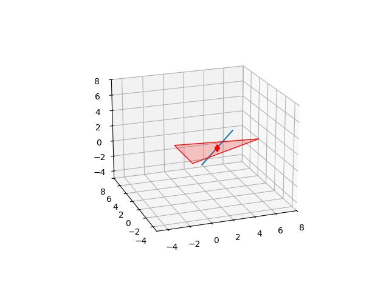

Örnek

Kesişmenin olmadığı bir örneğe bakalım,

```python
fig = plt.figure()
ax = fig.add_subplot(111, projection='3d') 
plot_tri3d(vtx1,ax)
s = np.array([-3,4,3])
t = np.array([0,0,3])
r = t - s
A = np.zeros((3,3))
A[:,0] = -r
A[:,1] = d1
A[:,2] = d2
print ('A',A)
print ('A determinant', lin.det(A))
plot_line(s,t,ax)
plt.savefig('calc_multi_75_app_16.jpg')
```

```text
A [[-3.  8.  0.]
 [ 4. -1. -5.]
 [ 0.  0.  0.]]
A determinant 0.0
```

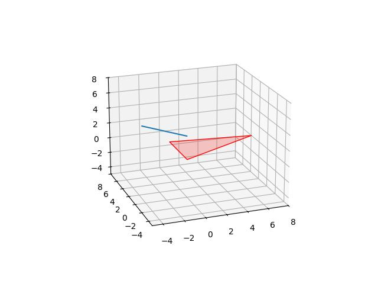

İki 3D Üçgenin Hızlı Kesişme Kontrolü

Üç boyutta iki üçgenin hızlı bir kesişme kontrolü için, ya da *kesişmeme*
durumunda kesişme ihtimalini hızlı bir şekilde eleyebilmek için [7] bir yöntem
nokta / düzlem [8] mesafe mantığını kullanmak. Bu yöntemde verili iki üçgen var
diyelim, $T_1$, ki $(u_0,u_1,u_2)$ köşelerinden oluşuyor, ve $T_2$, ki
$(v_0,v_1,v_2)$ köşelerinden oluşuyor, ikinci üçgen için önce üç noktanın ima
ettiği düzlemi oluştururuz.

$$
n_2 = (v_1-v_0) \times (v_2 - v_1)
$$

$$
d_2 = -n_2 \cdot v_0
$$

Sonra $T_1$'in tüm köşelerinden bu düzleme olan işaretli mesafeyi hesaplarız.

$$
m_i = n_2 \cdot u_i + d_2
$$

Eğer tüm $m_i < 0$ ya da tüm $m_i > 0$ ise, bu üçgen / üçgen kesişmesinin
olmadığı sonucuna varabiliriz. Bu hızlı, kabaca yapılan bir ilk test olarak
faydalı olabilir.

Yöntem direk üçgen / üçgen bazında bir test değildir, üçgen noktaları ve diğer
üçgenin olduğu *düzlem* bazında bir testtir fakat kesişme olmadığı durumda
muhakkak kesişme olmadığı sonucuna hızlıca varabildiği için tercih edilen bir
ilk test olabilir. Anlatımda biraz karışıklık olduysa açmaya uğraşalım, üstteki
test kesişme olmadığı her zaman negatif sonuç verir. Fakat negatif sonuç
alınmadıysa bu illa kesişme olduğu anlamına gelmez. Metot negatif sonuçlarda
yüzde yüz başarılı, bu sebeple kesişme eleme fazında yardımcı olur, kesin
kesişme sonucuna varmak için farklı yöntemler gerekir, mesela daha önce
paylaşılan çizgi / üçgen kesişme yaklaşımı gibi.

Örnek

```python
vtx1 = np.array([[0,5,0],[8,0,0 ],[0,0,0]])
vtx2 = np.array([[6,8,3],[6,8,-2],[6,-4,-2]])
fig = plt.figure()
ax = fig.add_subplot(111, projection='3d') 
plot_tri3d(vtx1,ax)
plot_tri3d(vtx2,ax)
plt.savefig('calc_multi_75_app_12.jpg')
```

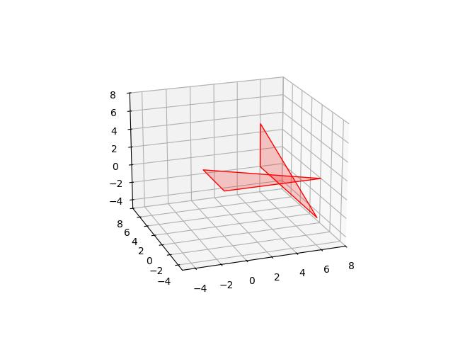

```python
# ikinci ucgen ile duzlem yarat
n2 = np.cross( vtx2[1,:]-vtx2[0,:], vtx2[2,:]-vtx2[0,:]  )
d2 = -np.dot(n2,vtx2[0,:])
print (n2,d2)
```

```text
[-60   0   0] 360
```

```python
for i in range(3):
    sdi = np.dot(n2,vtx1[i,:])+d2
    print ('%d. noktaya uzaklik = %d' % (i,sdi))
```

```text
0. noktaya uzaklik = 360
1. noktaya uzaklik = -120
2. noktaya uzaklik = 360
```

Örnek

```python
fig = plt.figure()
ax = fig.add_subplot(111, projection='3d') 
vtx3 = vtx2 + 3
plot_tri3d(vtx1,ax)
plot_tri3d(vtx3,ax)
plt.savefig('calc_multi_75_app_13.jpg')
```


```python
# ucuncu ucgen ile duzlem yarat
n3 = np.cross( vtx3[1,:]-vtx3[0,:], vtx3[2,:]-vtx3[0,:]  )
d3 = -np.dot(n3,vtx3[0,:])
print (n3,d3)
```

```text
[-60   0   0] 540
```

```python
for i in range(3):
    sdi = np.dot(n2,vtx1[i,:])+d3
    print ('%d. noktaya uzaklik = %d' % (i,sdi))
```

```text
0. noktaya uzaklik = 540
1. noktaya uzaklik = 60
2. noktaya uzaklik = 540
```

Daha detaylı kod `muller.c` ve `muller.py` dosyalarında bulunabilir.

Çizgi Düzlem Kesişmesini Vektörler ile Hesaplamak

Üstteki yöntem cebirsel manipülasyon gerektiriyor, fakat sayısal hesap için
sembolik cebir işlemlerine girmeden vektör matematiği ile direk bir sonuç
bulamaz mıyız? [3,4]'ü temel alalım: alttaki durumu düşünelim, 

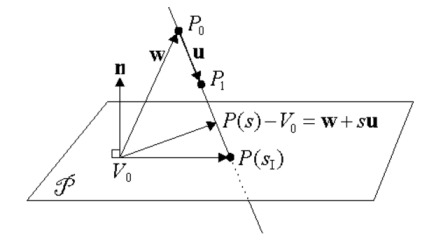

Grafiğe göre $P(s)$ $P_1$ ve $P_0$ arasındaki birim vektörün $s$ kadar
uzatılmış hali olsun, o aralığı $u$ kabul edersek $P(s)-V_0 = w + su$
olur. Düzlem ile kesişmenin olduğu noktayı $P(s_I)$ diye tanımlayalım,
aradığımız nokta burası. O noktada $n$ ile $P(s_I)$ dikgen olacaktır, yani
$P(s) - V_0 = w + su$ vektörü $n$'e dikgen olacaktır, ki $w=P_0-V_0$. Bu
durumda $n \cdot (w+su) = 0$ olur. Bunu kullanarak,

$$ s_I = \frac{-n \cdot w}{n \cdot u} = 
\frac{n \cdot (V_0 - P_0)}{n \cdot (P_1-P_0)} = 
\frac{-(ax_0 + by_0 + cz_0 + d)}{n \cdot u}
$$

```python
n = np.array([1., 1., 1.])
V0 = np.array([1., 1., -5.])
P0 = np.array([-5., 1., -1.])
P1 = np.array([1., 2., 3.])

w = P0 - V0;
u = P1-P0;
N = -np.dot(n,w);
D = np.dot(n,u)
sI = N / D
I = P0+ sI*u
print (I)
```

```text
[-3.90909091  1.18181818 -0.27272727]
```

Grafiklersek

```python
import sys; sys.path.append('../../phy/phy_072_rot')
import plot3d

fig, ax = plt.subplots(1, 1, subplot_kw={'projection': '3d'})
w = 10
ax.set_xlim(-w,w);ax.set_ylim(-w,w);ax.set_zlim(-w,w)
ax.set_xlabel("X")
ax.set_ylabel("Y")
ax.set_zlabel("Z")
v = P1-P0
ax.quiver(P0[0], P0[1], P0[2], v[0], v[1], v[2], color='red')
ax.scatter(V0[0], V0[1], V0[2], color='black')
ax.scatter(V0[0]+n[0], V0[1]+n[1], V0[2]+n[2], color='black')
ax.scatter(I[0], I[1], I[2], color='black')
ax.quiver(V0[0], V0[1], V0[2], n[0], n[1], n[2], color='blue')
plot3d.plot_plane(ax, list(V0), list(n), color='y')
plt.savefig('calc_multi_75_app_07.jpg')
```

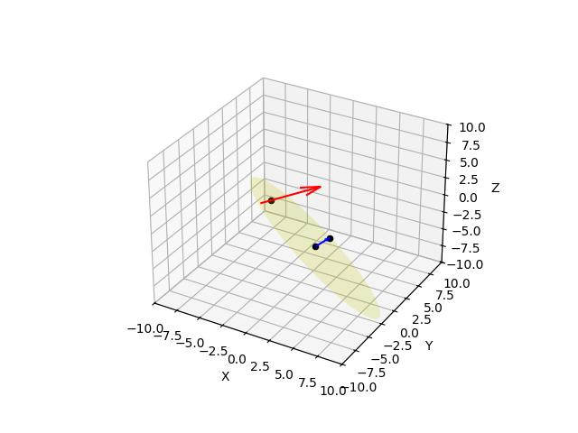

Green'in Teorisi, Uzaklaşım, Stokes, Yol ve Çizgi Entegralleri

Yüzeyler (Surfaces)

Üç boyut içindeki iki boyut yüzeyler parametrize edilerek gösterilir,
tek boyutlu eğri bir parametre $t$ ile parametrize ediliyordu, alan için
iki değişken $u,v$ gerekir. Notasyonel olarak $r$'nin taradığı bir yüzey

$$
r(u,v) = < x(u,v), y(u,v), z(u,v) >
$$

Mesela $r(u,v) = < u, u^2, v >$ bir yüzey olabilir.

Yüzey alan hesabı için tüm yüzeyi kenarları $\Delta u$, $\Delta v$ olan hücreler
yaratabiliriz. Her noktada iki tane teğet vektör bulunabilir, bunlar $t_u$ ve
$t_v$ olsun,

$$
t_u = < \frac{\partial x}{\partial u},
        \frac{\partial y}{\partial u},
        \frac{\partial z}{\partial u} >, \quad
t_v = < \frac{\partial x}{\partial v},
        \frac{\partial y}{\partial v},
        \frac{\partial z}{\partial v} >        
$$

Yaklaşık olarak her hücrenin alanı $\Delta S_{ij}$ her hücredeki $t_u$ ve $t_v$
(ya da yeni notasyonla onlara $t_u^{ij}$ ve $t_v^{ij}$ diyelim) yönündeki
$\Delta u$ ve $\Delta v$'nin oluşturduğu paralelogram alanıdır, bu paralelogram
bildiğimiz gibi iki vektörün çapraz çarpımından gelen üçüncü vektörün
büyüklüğüdür, o zaman 

$$
\Delta S_{ij} \approx || \Delta u t_u^{ij} \times \Delta v t_v^{ij} ||
$$

$$
= ||  t_u^{ij} \times t_v^{ij} || \Delta u \Delta v
$$
        


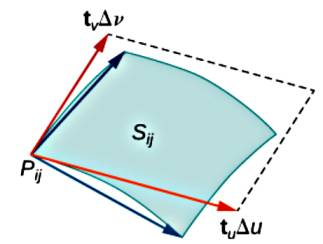

Tüm ufak hücre alanlarını toplarız, ve hücre sayısı sonsuza yaklaşırken toplam
alan limitine bakabiliriz,

$$
\lim_{m,n \to \infty} \sum_{i=1}^{m} \sum_{j=1}^{n} || t_u^{ij} \times t_v^{ij} || \Delta u \Delta v
$$

Bu limit yüzey alan çift entegral hesabına yaklaşır / onu tanımlar, [2, sf. 769],

$$
= \iint_D || t_u \times t_v || \mathrm{d} u \mathrm{d} v = \iint_D || t_u \times t_v || \mathrm{d} A
$$

Yüzey Entegrali (Surface Integral)

Yukarıda gördüklerimiz parametrize edilmiş yüzeyin alanını hesaplamak içindir.
Yüzey entegrali bir yüzey *üzerinden* alınan entegrallere verilen isimdir,
mesela tek sayı / skalar değerli bir fonksiyon $f$'nin pürüzsüz bir yüzey $S$
üzerinden alınan yüzey entegrali, o fonksiyonun her noktadaki alan büyüklüğü ile
çarpılıp sonuçların toplanmasıdır, cebirsel olarak yine $t_u,t_v$ kavramlarını
kullanırsak,

$$
\iint_S f(x,y,z) \mathrm{d} S 
= \lim_{m,n \to \infty} \sum_{i=1}^{m} \sum_{j=1}^{n} f(P_{ij}) || t_u^{ij} \times t_v^{ij} || \Delta u \Delta v
$$

$$
= \lim_{m,n \to \infty} \sum_{i=1}^{m} \sum_{j=1}^{n} f(P_{ij}) \Delta S_{ij} 
$$

O zaman yüzey entegralleri alttaki şekilde hesaplanabilir,

$$
\iint_S f(x,y,z) \mathrm{d} S =
\iint_D f(r(u,v)) || t_u \times t_v || \mathrm{d} A
$$

Çizgi entegrali (line integrals) daha düşük boyuttaki benzer bir kavram idi.

Vektör Alanları Üzerinden Yüzey Entegrali

Skalar fonksiyona benzer şekilde bir vektör alanı $F$ ve yüzey $S$ üzerinden de
entegral hesaplanabilir. Yine bir ufak çarpımlar toplamından bahsediyoruz, bu
tür bir hesap pek çok uygulama için faydalı olabilir. Mesela bir su akışı
içindeki geçirgen bir yüzeyi düşünürsek, kütle akışını (mass flux) nasıl
hesaplarız? 

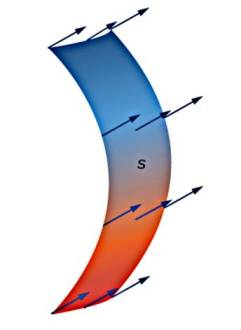

Her noktada yüzey $S$'ye dik olan alan $N$ olsun, her noktadaki akış hızı $v$
diyelim, o zaman bir noktadaki birim zaman ve birim alandaki kütle akışı $\rho v
\cdot N$. Ölçüm birimlerini kontrol edelim, hız $m/s$, yoğunluk $\rho$ 
$g/m^3$, çarparsak $g/s \cdot m^2$ elde ederiz, yani birim alan ve zamandaki
kütle akışı.

Şimdi $\rho v \cdot N$ değerini $\Delta S_{ij}$ ile çarparsak $S$ üzerindeki
hayali ufak hücreden birim zamanda akan kütleyi buluruz, tüm bu akışları
toplarız,

$$
\sum_{i=1}^{m} \sum_{j=1}^{n} (\rho v \cdot N) \Delta S_{ij}
$$

Tüm akışı elde etmiş oluruz. Izgara hücreleri $S_{ij}$ ufaldıkça üstteki toplam
gerçek kütle akışına yaklaşır, yani

$$
\iint_S \rho v \cdot N \mathrm{d} S = \lim_{m,n \to \infty}
\sum_{i=1}^{m} \sum_{j=1}^{n} (\rho v \cdot N) \Delta S_{ij}
$$

Devam edelim $\rho v$ yerine herhangi bir vektör alanı $F$ kullanalım, o zaman
şu genel tanımı artık yapabiliriz, $F$'nin $S$ yüzeyi üzerinden entegrali

$$
\iint_S \vec{F} \cdot \mathrm{d} \vec{S} = \iint_S \vec{F} \cdot \vec{N} \mathrm{d} S
$$

olarak gösterilir.

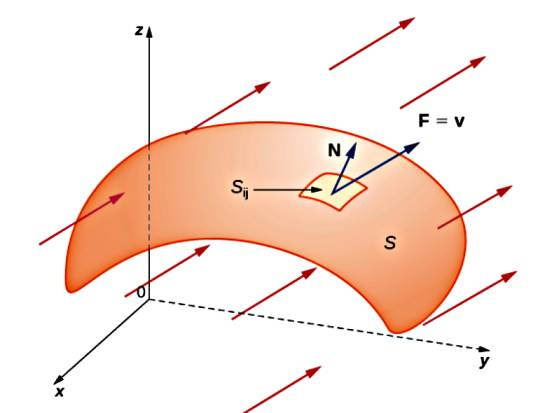

Dikkat her yerde vektör notasyonu kullanmıyoruz, olmadığı yerde formül
çerçevesine göre anlaşılabilir.

$N$ yüzey normalı, öne dik olan birim vektör, hesabı için önceden gördüğümüz
$t_u,t_v$ vektörlerini kullanabiliriz,

$$
N = \frac{t_u \times t_v}{ || t_u \times t_v || }
$$

Üstteki ifadeyi yüzey entegralinde kullanırsak [2, sf. 778],

$$
\iint_S \vec{F} \cdot \vec{N} \mathrm{d} S =
\iint_S \vec{F} \cdot \frac{t_u \times t_v}{ || t_u \times t_v || } \mathrm{d} S
$$

Daha önce gördük

$$
\mathrm{d} S = || t_u \times t_v || \mathrm{d} u \mathrm{d} v = || t_u \times t_v || \mathrm{d} A
$$

İki üste geçirince

$$
= \iint_D \vec{F}(r(u,v)) \cdot \frac{t_u \times t_v}{ || t_u \times t_v || }
|| t_u \times t_v || \mathrm{d} A
$$

Basitleştirme sonrası,

$$
= \iint_D \vec{F}(r(u,v)) \cdot (t_u \times t_v) || t_u \times t_v || \mathrm{d} A
$$

Soru

$F = < -y, x, 0 >$ olarak veriliyor, $S$ yüzeyi $r(u,v) = < u, v^2 - u, u+v >$.

$\iint_S F \cdot N \mathrm{d} S$ yüzey entegralini hesaplayın.

Cevap

Teğet vektörler $t_u = < 1, -1, 1 >$, ve $t_v = < 0, 2v, 1 >$.

$t_u \times t_v$ çapraz çarpımı

```python
import sympy

u,v = sympy.symbols('u v')
t_u = sympy.Matrix([[1,-1,1]])
t_v = sympy.Matrix([[0,2*v,1]])
print (t_u.cross(t_v))
```

```text
Matrix([[-2*v - 1, -1, 2*v]])
```

Yüzey entegral hesabı şöyle hesaplanabilir,

$$
\int _{0}^{4} \int _{0}^{3} F(r(u,v)) \cdot (t_u \times t_v) \mathrm{d} u \mathrm{d} v
$$

Verili $F = < -y, x, 0 >$, ve yüzey $r(u,v) = < u, v^2 - u, u+v >$ demiştik,
o zaman 

$$
F(r(u,v)) = < u-v^2, u, 0 > 
$$

olur. Tüm entegral

$$
= \int _{0}^{4} \int _{0}^{3} < u-v^2, u, 0 >  \cdot < -1-2v, -1, 2v >
\mathrm{d} u \mathrm{d} v
$$

$$
= \int_{0}^{4} \int_{0}^{3} (2v^3 + v^2 -2uv -2u )
\mathrm{d} u \mathrm{d} v
$$

$$
= \int_{0}^{4} [ 2v^3u + v^2u - vu^2 - u^2 ]_{0}^{3} \mathrm{d} v
$$

$$
= \int_{0}^{4} (6v^3 + 3v^2 - 9v -9 ) \mathrm{d} v
$$

$$
= \left[ \frac{3v^4}{2} + v^3 - \frac{9v^2}{2} - 9v \right]_{0}^{4}
$$

$$
= 340
$$

```python
from mpl_toolkits.mplot3d import Axes3D
from matplotlib import cm
import numpy as np
fig = plt.figure()
ax = fig.add_subplot(111, projection='3d')
u = np.linspace(0, 3, 100)
v = np.linspace(0, 4, 100)
u,v = np.meshgrid(u,v)

x = u; y = v**2 - u; z = u + v

ax.plot_surface(x, y, z, rstride=4, cstride=4, cmap = cm.copper)
x = np.linspace(0, 3, 5)
y = np.linspace(0, 10, 5)
z = np.linspace(0, 6, 5)

fu = -y; fv = x; fw = z*0

xx,yy,zz = np.meshgrid(x,y,z)
ax.quiver(xx, yy, zz, fu, fv, fw, length=0.2, color = 'red')
ax.view_init(elev=18, azim=-46)
plt.savefig('calc_multi_75_app_03.jpg')
```

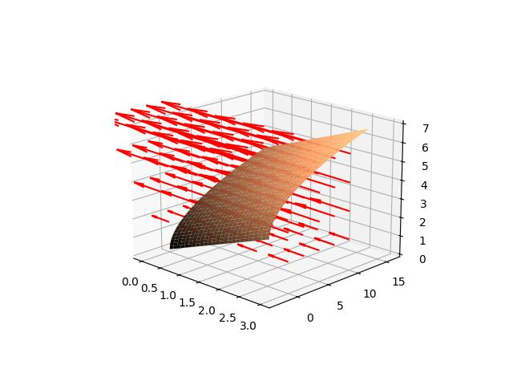

Çizgi Düzlem Kesişmesi

Elimizde $P = 2x + y - 4z = 4$ düzlemi var. Bu düzlemin 

$$ x = t \quad y = 2 + 3t \quad z = t$$

çizgisi ile kesiştiği yer neresidir? 

Cevap kolay; çizgi denkleminde $t$ bazlı tanımlı $x,y,z$ değerleri $P$'ye
sokarsak, tek bilinmeyeni $t$ olan bir denklem çıkar, 

$$ 2(t) + (2+3t)-4(t) = 4 \Rightarrow t = 2$$

İki Nokta Arasında Parametrize Edilmiş Eğri

Diyelim ki $(1,1)$ ve $(4,4)$ noktalarından geçen ve dışarıdan tanımlı
parametrelerle yeterince eğilip, bükülebilecek bir eğri tanımlamamız
lazım. Polinomlar üzerinden tanımlanan bir eğri ile bunu başarabiliriz, 

$$
x(t) = a_0 + a_1 t + a_2 t^2 + a_3 t^3
$$

$$
y(t) = b_0 + b_1 t + b_2 t^2 + b_3 t^3
$$

Bu şekilde bir eğri yeterince eğilip bükülebilir, ve istenen şekle
sokulabilir. Fakat baş ve sonun verili noktalardan geçmesini nasıl garanti
ederiz? Bunun için bu noktaları üstteki denkleme sokalim, ve $0 \le t \le
1$ olacak sekilde kısıtlama yapalim, $t=0$'da

$$
1 = a_0 + a_1 (0) + a_2 (0)^2 + a_3 (0)^3
$$

$$
1 = b_0 + b_1 (0) + b_2 (0)^2 + b_3 (0)^3
$$

Yani  $a_0=1$ ve $b_0=1$. Peki $t=1$ icin?

$$
4 = 1 + a_1 (1) + a_2 (1)^2 + a_3 (1)^3 
$$

$$
4 = 1 + b_1 (1) + b_2 (1)^2 + b_3 (1)^3 
$$

$$
3 = a_1 + a_2 + a_3, \quad 3 = b_1 + b_2 + b_3
$$

Demek ki üstteki iki formüle mutabık kaldığımız sürece
$a_1,a_2,a_3,b_1,b_2,b_3$ ie istediğimiz şekilde oynayarak istediğimiz
eğriyi ortaya çıkartabiliriz. 

```python
t = np.linspace(0,1.0,100)

a1,a2 = -1.1, 1.9
b1,b2 = 1.1, 1.4

sx,sy=(1.0,1.0)
ex,ey=(4.0,4.0)

a3 = ex - sx - (a1+a2)
b3 = ey - sy - (b1+b2)

x = 1.0 + a1*t + a2*t**2 + a3*t**3
y = 1.0 + b1*t + b2*t**2 + b3*t**3

plt.xlim(0,5.0)
plt.ylim(0,5.0)
plt.plot(x,y)
plt.savefig('calc_multi_75_app_08.jpg')
```

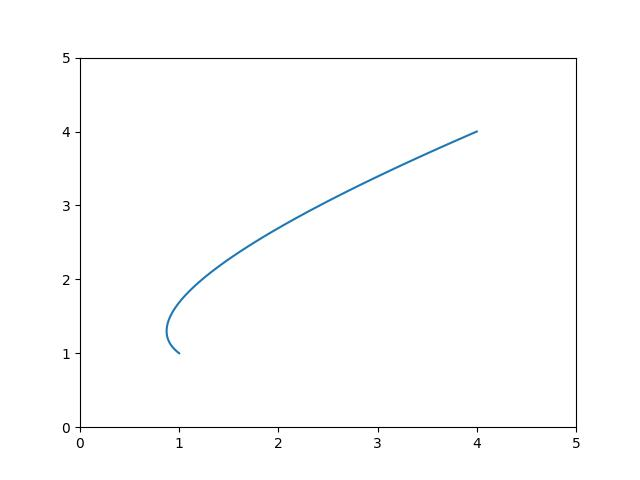

Max ve Sigmoid Bazlı Yaklaşım

Daha önce [6]'da görülen spline tekniğinin parametrik hali de
olabilir. Mesela 

```python
ax, bx, cx, dx = (1, -1.4, 2, 2.5)
ay, by, cy, dy = (1, 1.4, 1, 2.5) 
def f(t):
    x = ax + \
        bx*np.max([0,t-2]) + \
        cx*np.max([0,t-3]) + \
        dx*np.max([0,t-4])
	   
    y = ay + \
        by*np.max([0,t-2]) + \
        cy*np.max([0,t-3]) + \
        dy*np.max([0,t-4])
    return x,y	   
    
tmp = np.linspace(0,5,100)
res = np.array([f(tt) for tt in tmp])
plt.plot(res[:,0],res[:,1])
plt.savefig('calc_multi_75_app_09.jpg')
```

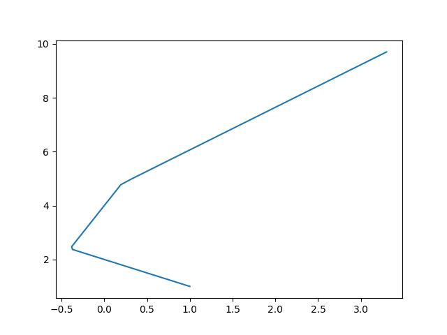

Başlangıcı $a_x,a_y$ olan kesik bir eğriyi görüyoruz. Bu tür eğrileri aynen
[6]'da olduğu gibi sigmoid bazlı yapabiliriz,

```python
rho = 7.0
def sig(x,a):
   return (x-a)*1/(1+np.exp(-rho*(x-a)))

def maxk(x,a):
   return np.max([0,x-a])

ax,bx,cx,dx,ex = (1, 2.4, 1, -3.5, -2.1)
ay,by,cy,dy,ey = (1, 0.4, -0.1, 0.5, -3)
def f(t):
    x = ax + \
        bx*maxk(t,2) + \
        cx*maxk(t,3) + \
        dx*maxk(t,3.5) + \
        ex*maxk(t,4.0)
	   
    y = ay + \
        by*maxk(t,2) + \
        cy*maxk(t,3) + \
        dy*maxk(t,3.5) + \
        ey*maxk(t,4.0)
    return x,y	   
    
def g(t):
    x = ax + \
        bx*sig(t,2) + \
        cx*sig(t,3) + \
        dx*sig(t,3.5) + \
        ex*sig(t,4.0)
	   
    y = ay + \
        by*sig(t,2) + \
        cy*sig(t,3) + \
        dy*sig(t,3.5) + \
        ey*sig(t,4.0)
    return x,y	   
    
tmp = np.linspace(0,5,100)
```

```python
res = np.array([f(tt) for tt in tmp])
plt.plot(res[:,0],res[:,1])
plt.savefig('calc_multi_75_app_10.jpg')
```

```python
res = np.array([g(tt) for tt in tmp])
plt.plot(res[:,0],res[:,1])
plt.savefig('calc_multi_75_app_11.jpg')
```

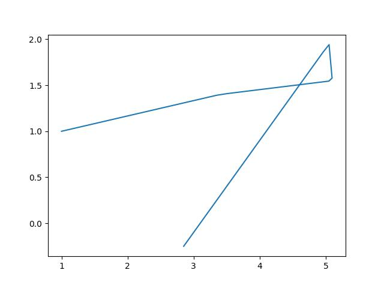


Herhangi bir şekli katsayılarla yaratmak mümkün. 

Bitiş noktalasını nasıl ayarlarız? Burada yine polinom örnekteki gibi
cebirsel bir yöntem seçebilirdik, fakat çoğunlukla başlangıç ve bitiş
arasındaki eğriler bir optimizasyon bağlamında kullanılır. Bu durumda
bitiş noktaları ile katsayılar arasında bir optimizasyon kısıtlaması
yaratmak ve bitiş noktalarını böyle ayarlamak daha iyidir. 

Çünkü biliyoruz parametrize ortamda mesela önceki örnekte $0 \ge t \ge
5$. O zaman egrinin bitisinde $t=5$ olacağını biliyoruz. Bu durumda mesela 

$$
    x = a_x + \
        b_x \sigma(t,2) + \
        c_x \sigma(t,3) + \
        d_x \sigma(t,3.5) +
        e_x \sigma(t,4.0)
$$

ifadesine $t$ tüm ilmik noktalarının ötesinde olduğu için artık tüm
$\sigma$ ifadeleri 1 veriyor. Eğer 1 veriyorsa, yani tüm sigmoid'ler aktif
ise, eğri bitişinde bilinen $t$ üzerinden elimizdeki $x$ 
$x = a_x + b_x(5-2) + c_x(5-3) + d_x(5-3.5) + e_x(5-4.0)$
olmalı. Optimizasyonda bu eşitliğin belli bir değer (istediğimiz bitiş
noktası kordinatı) olmasını şart tutarak amacımız erişebiliriz.

Kaynaklar

[1] Marsden, *Vector Calculus*

[2] Strang, *Calculus Volume 3, OpenStaxa*

[3] Sunday, *Intersection of Lines and Planes*, 
[http://geomalgorithms.com/a05-_intersect-1.html](http://geomalgorithms.com/a05-_intersect-1.html)

[4] Khaled, *Straight Line and Plane Intersection Matlab Code*, 
[https://uk.mathworks.com/matlabcentral/fileexchange/17751-straight-line-and-plane-intersection](https://uk.mathworks.com/matlabcentral/fileexchange/17751-straight-line-and-plane-intersection)

[5] *Distance between Point and Line*, 
[https://brilliant.org/wiki/distance-between-point-and-line/](https://brilliant.org/wiki/distance-between-point-and-line/)

[6] Bayramlı, *Hesapsal Bilim, Spline Eğrileri ve Baz Fonksiyonlar*

[7] Rotenberg, *CSE169: Computer Animation*,
    [https://cseweb.ucsd.edu/classes/wi19/cse169-a/slides/](https://cseweb.ucsd.edu/classes/wi19/cse169-a/slides/)

[8] Bayramlı, *Çok Değişkenli Calculus - Ders 4*

[9] Bergen, *Collision Detection*
    

