# Poligon Alanı, Nokta Bulutları, Noktaları Çevreleyen Bölgeler

Poligon, Üçgen Alanı

[8] notlarından iki vektörün temsil ettiği bir üçgenin alanının bu iki vektörün
çapraz çarpmından gelen vektörün uzunluğu olduğunu biliyoruz. 

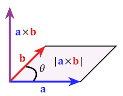

O iki vektörün temsil ettiği üçgenin alanı ise paralelogramın yarısıdır,

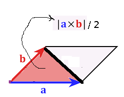

Bir üçgenin alanını içindeki üç tane alt üçgen üzerinden de hesaplayabilirdik,
elimizde üç nokta var ise, mesela $(x_1,y_1)$, $(x_2,y_2)$, $(x_3,y_3)$, üçgenin
ortasında orijin olduğunu kabul edersek, orijinden o noktalara giden üç vektör
üzerinden 3 tane üçgen ile büyük üçgenin alanını hesaplayabiliriz [9, sf. 272],


$$
Alan = 1/2 \left( 
\left|\begin{array}{cc}
x_1 & y_1 \\ x_2 & y_2 
\end{array}\right| + 
\left|\begin{array}{cc}
x_2 & y_2 \\ x_3 & y_3 
\end{array}\right| + 
\left|\begin{array}{cc}
x_3 & y_3 \\ x_1 & y_1
\end{array}\right| \right)
$$

Üç tane determinant hesabı gösteriliyor, açılımı

$$
\frac{1}{2} (x_1 y_2  - x_2 y_1) + 
\frac{1}{2} (x_2 y_3  - x_3 y_2) + 
\frac{1}{2} (x_3 y_1  - x_1 y_3) 
$$

Benzer şekilde herhangi bir poligon alanı da hesaplanabilir,

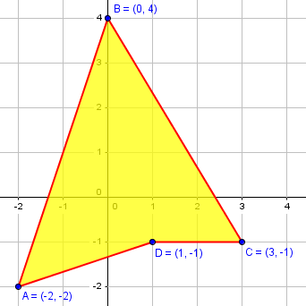

Bu poligon içinde üçgenleri toplayarak tüm poligon alanı hesaplanır,

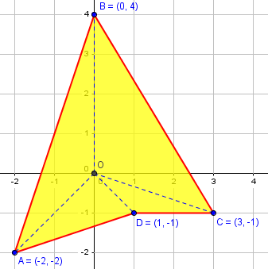

```python
import numpy.linalg as lin
pts = [[-2, -2],[0, 4],[3, -1],[1, -1]]
s = \
lin.det(np.vstack((pts[0],pts[1]))) + \
lin.det(np .vstack((pts[1],pts[2]))) + \
lin.det(np.vstack((pts[2],pts[3]))) + \
lin.det(np.vstack((pts[3],pts[0])))
print (np.abs(s) / 2)
```

```
13.0
```

Vektörlerin illa ki bir orijinden çıktığı varsayımı da şart değil, üstteki
hesabı orijin merkezli olmayan noktalar için yaparsak yine aynı sonucu elde
ediyoruz, bunun ispatını vermiyoruz fakat düşünürsek her türlü üçgeni alanını
değiştirmeden sadece kaydırıp orijin merkezli hale getirebilirdik, ve yakın
orantılı sayılarla yapılan benzer hesaplar hala geçerli olurdu.

Bu konu hakkında karşımıza çıkabilecek bir isim Ayakkabı Bağı (Shoelace)
tekniği, bu teknik üstteki yaklaşımın cebirsel olarak açılımıdır sadece,
değişkenler belli şekilde yanyana dizilince bir çapraz ayakkabı bağı şekli
çıktığı için bu isim verilmiş, tabii bu çaprazlığın üstteki determinantın
gerektirdiği çapraz çarpımla yakın ilişkisi olduğu da görülebilir.

Dışbükey Zarf (Convex Hull)

Yaklaşık olarak işleyen yaklaşımlardan biri [3, sf. 154]'de. Bu yaklaşıma
göre veri noktalarında önce minimum $x$ ve maksimum $x$ değerleri bulunur
(yani en sol ve en sağ uç noktalar), ardından bu noktalar arası dikey
şeritlere bölünür.

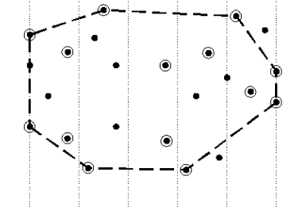

Sonra algoritma solda sağa giderek her şerit içinde dikey en maksimum ve
minimum iki noktayı bulur. Bu noktalar sırasıyla üst ve alt zarf noktaları
olacaktır. Algoritma tamamlanınca bu minimal, maksimal noktalarının hepsini
alıp üzerinde standart dışbükey zarf algoritmalarından birini
işletiriz. Fakat eldeki noktaların sayısı artık oldukça azaldığı için
algoritmanın tamamı çok hızlı çalışacaktır. Algoritmanın karmaşıklığı
$O(N)$.

```python
xmin = np.min(points[:,0])
xmax = np.max(points[:,1])
print xmin, xmax
bins = np.linspace(xmin,xmax,10)
bidx = np.digitize(points[:,0], bins)
mins = []; maxs = []
for idx in np.unique(bidx):
    tmp=points[bidx==idx]
    mins.append(tmp[np.argmin(points[bidx==idx,1])])
    maxs.append(tmp[np.argmax(points[bidx==idx,1])])
mins=np.array(mins)
maxs=np.array(maxs)
```

```
6.85483870968 13.2291666667
```

```python
plt.plot(points[:,0], points[:,1], 'o')
plt.plot(mins[:,0], mins[:,1], 'dr')
plt.plot(maxs[:,0], maxs[:,1], 'dr')
plt.xlim(6,12); plt.ylim(8,15)
plt.savefig('enc_02.png')
```


```python
approx = np.vstack((mins,maxs))
hull = ConvexHull(approx)
plt.plot(approx[:,0], approx[:,1], 'o')
for simplex in hull.simplices:
    plt.plot(approx[simplex, 0], approx[simplex, 1], 'k-')
plt.xlim(6,12); plt.ylim(8,15)
plt.savefig('enc_10.png')
```


Nokta, Bölge İçinde mi Dışında mı?

Diyelim ki 2 boyutta olmak üzere, elimizde dışbükey bir bölgeyi temsil eden
noktalar var, ve elimizdeki bir başka noktanın bu bölge içinde mi dışında
mı olduğunu merak ediyoruz. Bölgeyi tanımlayan analitik bir fonksiyon yok,
mesela bir elips formülü gibi bir tanım olsaydı, direk herhangi bir
kordinatı geçip $<1$, ya da $>1$ cevabını alabilirdik. Burada noktalar var,
ama araları birleşik değil.

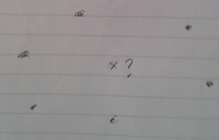

Çapraz çarpımla bu sorunu çözebiliriz [4]. Bir nokta bir vektörün sağında
mı solunda mı sorusunun cevabını çapraz çarpımdan alabiliriz, tabii nokta
vektör olarak gösterilebildiğine göre, bir vektör diğerinin sağında mı
solunda mı sorusu.. Ama bunu da açalım, sağda olmak demek, "saat yönüne
180 dereceden az gitmek'' demek. Neyse, sağda solda olmanın fark ettiğini
biliyoruz, bir, sağ el kuralından, iki, $A \times B = -B \times A$. Tüm bu
tanımlar tabii ki temelde gidip determinant kullanan hesaba
bağlanıyor. Söylediklerimizin hepsi o tanım üzerinde test edilebilir, bkz
[5].

O zaman çapraz çarpım bize sağda, solda olmayı söylüyorsa, şu hesabı yaparsak ne
olur? Verili bir $x$ noktası ve bir kapalı bölge oluşturan $p_1,..,p_N$ var, biz
her $i = 1,..,N$ için 

$$ (x-p_i) \times (p_{i+1}-p_i) $$

hesabını yaparız (not bu hesap dışbükey bölgeler için işler). Bu hesap şu
vektörleri baz alıyor,

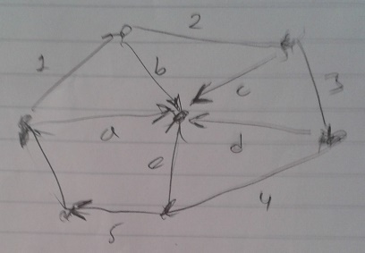

$p_{i+1}-p_i$  kapalı bölgeyi çevreleyen vektörler, $x-p_i$ ise bölge
noktasından içeride (ya da dışarıda) olan noktaya giden vektör. Eğer bir nokta
bölge içindeyse 1-a, 2-b çapraz çarpımları hep aynı işaretli olmalı, yani $x$
her zaman 1'ın 2'nin, vs. sağında. Ama nokta dışarıda olsaydı,

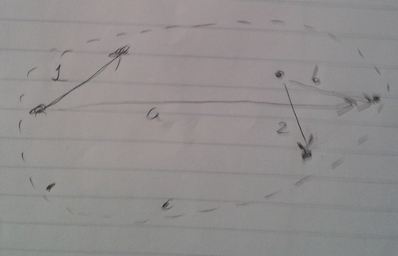

1-a ile 2-b çapraz çarpımlarının işareti farklı mesela. Bunu kullanabiliriz, tüm
çapraz çarpımları alıp sonuç vektöründeki tüm öğelerin aynı işarette olup
olmadığını kontrol ederiz. Eğer öyle ise nokta içeridedir, yoksa dışarıda. Örnek
kod ve bazı veriler üzerinde görelim. 

```python
import pandas as pd
from math import sqrt, fabs

def plot_line(pt1,pt2,color):
    plt.plot(np.array([pt1[0],pt2[0]]),np.array([pt1[1],pt2[1]]),color=color)
    
def plot_quad(c,color='r'):
    plot_line(c[1],c[0],color)
    plot_line(c[2],c[1],color)
    plot_line(c[3],c[2],color)
    plot_line(c[0],c[3],color)

rect1 = [[6,8],[12,10],[13,15],[6,14]]
plot_quad(rect1)
plt.xlim(0,20); plt.ylim(0,20)

pt1 = np.array([10,10])
pt2 = np.array([15,5])

plt.plot(pt1[0],pt1[1],'gd')
plt.plot(pt2[0],pt2[1],'gd')

plt.savefig('enc_07.png')
```

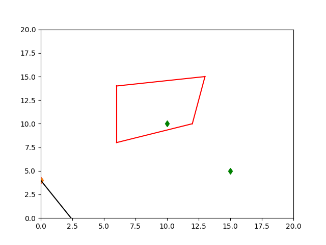

İki nokta seçtik, biri kapalı 4 nokta içinde, diğeri dışında. 

```python
def same_sign(arr): return np.all(arr > 0) if arr[0] > 0 else np.all(arr < 0)

def inside_quad(rect, pt):
    pts = np.array(rect)
    a =  pts - pt
    d = np.zeros((4,2))
    d[0,:] = pts[1,:]-pts[0,:]
    d[1,:] = pts[2,:]-pts[1,:]
    d[2,:] = pts[3,:]-pts[2,:]
    d[3,:] = pts[0,:]-pts[3,:]
    res = np.cross(a,d)
    return same_sign(res), res

print inside_quad(rect1, pt1)
print inside_quad(rect1, pt2)
```

```
(True, array([  4.,  10.,  32.,  24.]))
(False, array([-36., -20.,  72.,  54.]))
```

Sonuç beklenen şekilde geldi. 

Sargılanan Sayı Algoritması (Winding Number Algoritm)

Eğer bir nokta bir polygon içinde ise o noktadan her köşe noktasına birer
çizgi çeksek ve ortaya çıkan açılara baksak, bu açılar 360'a toplanacaktır.
Fakat nokta dışarıda ise bu doğru olmazdı, 

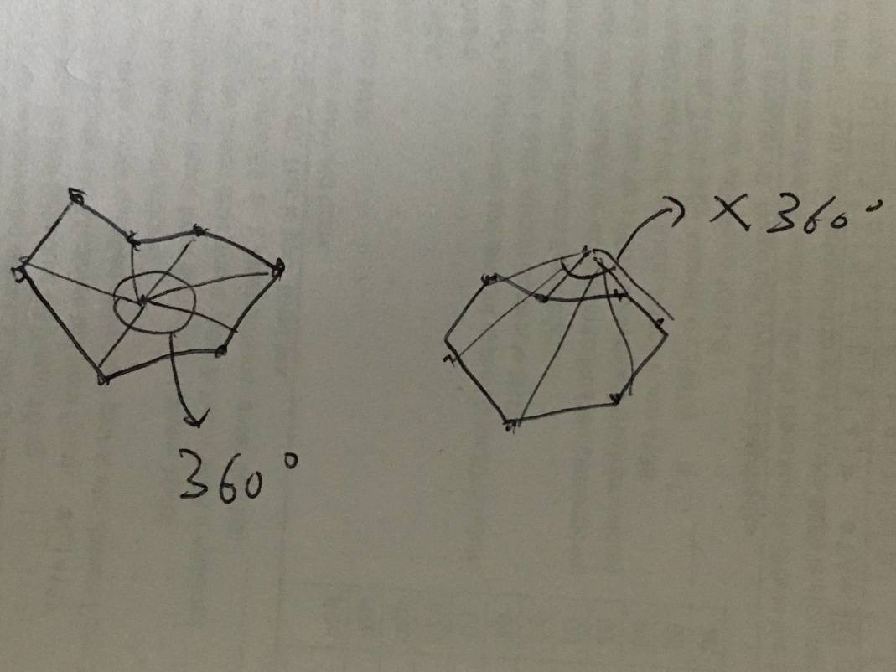

Sargılanan sayı algoritması bunu temel alıyor, bkz [6], örnek kod alttadır,

```python
import math

def offsetCoords(polygon, newOrigin):
    offsetPolygon = []
    for v in polygon:
        offsetPolygon.append((v[0]-newOrigin[0], v[1]-newOrigin[1]))
    return offsetPolygon

def dotProduct(v1, v2):
    return v1[0]*v2[0]+v1[1]*v2[1]

def vectorLen(v):
    return (v[0]**2+v[1]**2)**.5

def angleBetweenVectors(v1, v2):
    cosine = dotProduct(v1, v2) / (vectorLen(v1) * vectorLen(v2))
    return math.acos(cosine)

def isWithin(point, polygon):
    if point in polygon:
        return False
    sumAngles = 0
    for i in range(len(polygon) - 1):
        sumAngles += angleBetweenVectors(polygon[i], polygon[i+1])
    if math.isclose(sumAngles, math.pi*2):
        return True
    else:
        return False

polygon = [(2,0), (4,1), (4,4), (2,5), (1,2), (2,0)]

coords = (3,3)

point = (float(coords[0]), float(coords[1]))

offsetPolygon = offsetCoords(polygon, point)
offsetPoint = (0, 0)

result = 'Is POINT {} within POLYGON {}? {}.'.format(point, polygon, isWithin(offsetPoint, offsetPolygon))

print(result) 
```

```
Is POINT (3.0, 3.0) within POLYGON [(2, 0), (4, 1), (4, 4), (2, 5), (1, 2), (2, 0)]? True.
```

Dış Geometrik Objenin İç Noktalara Uyum Skoru

Bazen önceden bilinen bir çokgenin (dörtgen, beşgen, vs.) onun içinde olan
noktaları ne kadar iyi "kapsadığını'' bir skor ile belirtmek
gerekebilir. Mesela gürültülü bir nokta bulutundan yaklaşık dışbükey zarf
çıkarttık, ve şimdi eldeki bir hipotez dörtgenin bu veriye ne kadar iyi
uyduğunu bulmak istiyoruz. 

Şöyle bir yaklaşım düşünülebilir. Her nokta için o noktanın kapsayan tüm
kenarlara ne kadar uzak olduğunu ölçeriz, bunlar arasında minimum olan
uzaklığı alırız. Eğer bir kenar bir noktanın yanındaysa onu kapsıyor
demektir, ayrıca bir noktanın en yakınındaki kenar uzakta ise kapsama iyi
değil demektir. Kenarlar dışına düşmek ne olacak? Bu durum noktanın içeride
olup olmadığı sorusu ile halledilir, dışarı düşen noktalara cezalandırma
amaçlı yapay yüksek bir uzaklık atanabilir. Ardından tüm bu minimum
uzaklıklar toplanır ve genel bir skor ortaya çıkartılır.

```python
def pdis(a, b, c):
    t = b[0]-a[0], b[1]-a[1]           # Vektor ab
    dd = sqrt(t[0]**2+t[1]**2)         # ab uzunlugu
    t = t[0]/dd, t[1]/dd               # ab birim vektoru
    n = -t[1], t[0]                    # ab'ye normal birim vektor
    ac = c[0]-a[0], c[1]-a[1]          # vector ac
    return fabs(ac[0]*n[0]+ac[1]*n[1]) # ac'nin n'e yansimasi (minimum uzaklik)

def score_quad_fit(c, pt):
    arr = np.array([pdis(c[1],c[0],pt), pdis(c[2],c[1],pt), \
                    pdis(c[3],c[2],pt), pdis(c[0],c[3],pt) ])
    i,tmp = inside_quad(c, pt)
    if i==False: i=10.
    return np.min(arr) * i

plt.plot(approx[:,0], approx[:,1], 'o')

rect1 = [[6,8],[12,10],[13,15],[6,14]]
plot_quad(rect1,'b')
r1total = np.array([score_quad_fit(rect1,p) for p in points]).sum()

rect2 = [[7,9],[12,10],[11,14],[6,12]]
plot_quad(rect2,'r')
r2total = np.array([score_quad_fit(rect2,p) for p in points]).sum()

rect3 = [[7,9],[11,10],[10,14],[6,12]]
plot_quad(rect3,'k')
r3total = np.array([score_quad_fit(rect3,p) for p in points]).sum()

print 'mavi',r1total
print 'kirmizi',r2total
print 'siyah',r3total

plt.xlim(4,14); plt.ylim(6,17)
plt.savefig('enc_11.png')
```

```
mavi 65.8765373106
kirmizi 36.3649774766
siyah 53.192955306
```

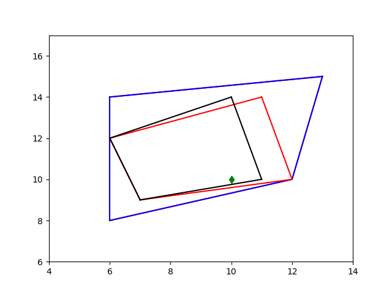

Üstteki çıktılara göre mavi renkli dörtgenin kapsaması en kötü, en iyisi
kırmızı olan. Daha küçük siyah dörtgen de fena kapsamıyor fakat bu dörtgen
sağdaki bazı noktaları dışarıda bırakmış. Bu noktalar rutinimiz tarafından
10 skor ile cezalandırılıyor.

Kaynaklar 

[3] Preparata, *Computational Geometry An Introduction*

[4] Mathematics Stack Exchange, *Determine If 2D Pixel Inside a Region Without Formula*,[http://math.stackexchange.com/questions/1956626/determine-if-2d-pixel-inside-a-region-without-formula](http://math.stackexchange.com/questions/1956626/determine-if-2d-pixel-inside-a-region-without-formula)

[5] Bayramlı, *Çok Değişkenli Calculus, Ders 3*

[6] Stackoverflow, [https://stackoverflow.com/a/43822141/423805](https://stackoverflow.com/a/43822141/423805)

[8] Bayramlı, *Çok Değişkenli Calculus, Ders 2*

[9] Strang, *Introduction to Linear Algebra, 4th Ed*

[10] Math Doctors, *Polygon Coordinates and Areas*,
     [https://www.themathdoctors.org/polygon-coordinates-and-areas/](https://www.themathdoctors.org/polygon-coordinates-and-areas/)


