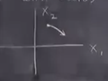
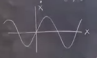
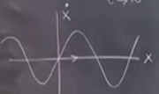
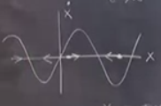
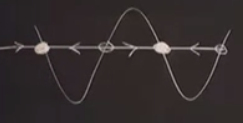
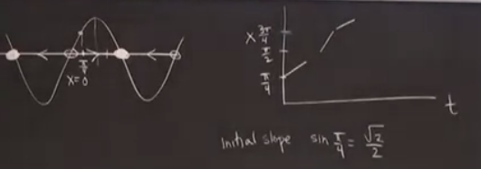
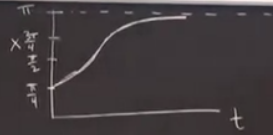
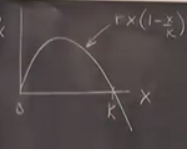
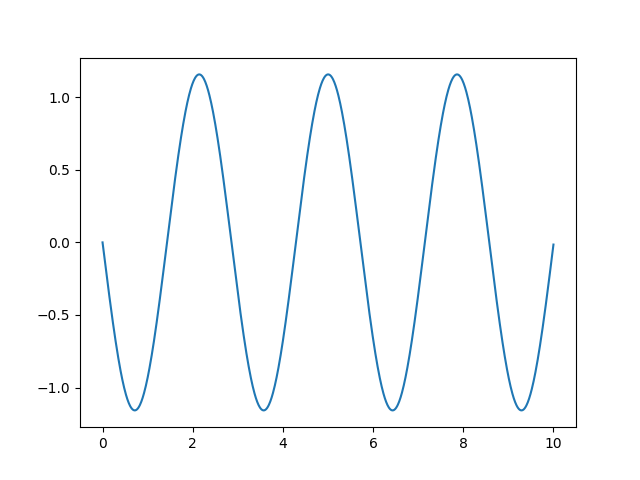

# Ders 1

Bu ders için önkoşul bilgi: en önemlisi Calculus. Bir başkası bir eğriyi
taslaksal olarak çizmek, zihinde hayal edebilmek. Derste bir belli parametreleri
olan bir fonksiyondan bahsettiğim zaman bu fonksiyonları bilgisayara ihtiyaç
duymadan taslak olarak çizebilmek önemli. Bu çizimi belli aileye ait eğriler
için bir parametreye göre / değişirken yapabilmek iyi olur, Calculus'un o
tarafıyla kendimizi rahat hissetmemiz lazım. Lineer Cebir'den özdeğerler ve
özvektörler gerekli. Biraz İleri Calculus iyi olur, mesela bir Jacobian'ın ne
olduğu. Kısmi türev nasıl alınır bu kesin lazım... Biraz çok değişkenli Taylor
Serileri bilgisi, ama çok değil. Derste bir noktada Fourier analizi
kullanacağız, ama bu konuyu bildiğiniz farzedilmeyecek, derste o konuyu da
anlatacağız.

Genel bilim bilgisi faydalı olur tabii, mesela Kimya, Biyoloji gibi
konular, genel mühendislik te öyle, ama bu bilgi de şart değil; Gereken
bilim bilgisini o bilim dalına dokunduğumuz zaman o anda göstereceğim. 

Dersimizin sene olarak seviyesi 1. sene üstlisans diyebilirim. Bazen lisans
öğrencileri dersi almak istiyorlar, onlara evet diyorum, bu mümkün. Fakat
bu ders biraz aldatıcı, gözyanıltıcı olabilir. Dışarıdan ilk bakışta
basitmiş gibi gözüküyor, fakat içinde bazı incelikler, kavisler var, bunlar
insanı zorlayabilir. Zorluk şurada aslında, bu ders sizi değişik bir stilde
düşünmeye zorlayacak. İçinde bir sürü ispatlar, hesaplar olan bir ders
değil bu, zihinde canlandırma, geometrikleştirme gerekecek, ve sezgi
(intuition) çok önemli.

Bilgisayarı bol bol kullanın; bir diferansiyel denklemi Matlab [Python!]  ile
çözmeyi rahatça yapabilmek iyi olur, paketler üzerinden, kendi kodunuzu yazarak,
nasıl yapacağınız size kalmış, sadece şunu bilelim, gayrı lineer sistemleri
çözmek için bazen bilgisayar hesabı gerekli.

Artık derse başlayabiliriz. 

Önce biraz tarih: konumuz nasıl başladı? Nasıl gelişti? Ana gelişme
noktaları şunlar, 

1666: Newton

Basit Diferansiyel Denklemler (Ordinary Differential Equations
-ODE-). Isaac Newton bu noktada 23 yaşında, bu onun için büyük bir sene,
Calculus'u o yıl icat etti, optik konusunun kurallarını keşfetti, evrensel
yerçekim gücünü keşfetti, başka işler de yaptı.. bu sene onun için iyi
geçti yani. Newton ODE'leri tamamen keşfetti denemez tabii, ama o ana kadar
ODE alanında en ileri giden o'ydu. Hangi tür hesaplar için? Kepler
gezegenlerin eliptik şekilde hareketini teorize etmişti, Newton bunları
Calculus kullanarak modelleyebildi. Dinamik (dynamics) alanının başlangıcı
burası. Daha ilginci Newton bizim bugün 2-cisim problemi (2-body problem)
dediğimiz problemi çözdü, yani güneş ile dünyanın etkileşimi nasıldır,
vs. ve eliptik yörünge zaten bu çözümden ortaya çıktı. Fakat Newton 3-cisim
problemini denediğinde, yani dünya, güneş, ay üçlüsü için, bu problemi
çözemediğini farketti. Newton etrafındaki tanıdıklarına "hiçbir problem
bende tıbbi başağrısı yaratmamıştı'' demiş, 3-cisim problemi onu hakikaten
zorlamış olmalı. Bu problemi diğer bilimciler de çözmeye uğraştı. 

1800 Sonları:

Bu noktaya ileri sarıyoruz; ve hala kimse 3-cisim problemini
çözemedi. Okkalı bilim adamlarından kim varsa denedi: Euler, Gauss, vs. Ve
nihayet matematikçi Poincare meselenin ne olduğunu keşfetti - problemin
analitik (closed form solution) çözümü mümkün değildi. Poincare Calculus'a
ek olarak geometri kullanarak bizim bugün kaos dediğimiz matematiksel
olguyu görmüştür. Kaos'u ilk gözlemleyen, belirten o'dur.  Bu geometrik
yaklaşımda faz alanı (phase space) dediğimiz bir kavram var, bunu ileride
göreceğiz.

Not - Tabii kaos deyince kaos'u tanımlamak lazım.

Kaos deterministik sistemlerde ortaya çıkar. Bu ilginç gelebilir, çünkü
kaos kelimesini çoğunlukla kargaşa, karmaşa ile özdeşleştiririz, ve bu
rasgelelik kavramlarını çağrıştırır. Fakat tamamen deterministik olarak,
yani hiç rasgelelik (stochastics) içermeyecek şekilde matematiksel kaos
ortaya çıkabilir. Bu tür deterministik sistemlerde dönemsiz (aperiodic),
yani kendini tekrar etmeyen, ve bir noktada durmayıp devam edebilen
durumlar oluyor, ve bu durum dış dünyaya "tahmin edilemez'' şekilde
yansıyor. 

Bir diğer özellik kaotik sistemlerin "başlangıç anına olan hassas
bağlantısı''dır, bu özelliğe sahip sistemler başlangıç noktasından bir süre
sonra bir konuma geldiler diyelim, eğer başlangıç şartlarını azıcık bile
değiştirsek (simülasyonu başa sardık mesela) ve sistemi tekrar işletsek bu
tür sistemler aynı süre ardından tamamen başka bir konumda
olabiliyorlar. Bu iki simülasyon başlangıç ardından az bir süre aşağı
yukarı aynı gidebiliyorlar, fakat bir süre sonra, üstel bir hızda,
birbirlerinden farklılaşıyorlar. "Hassas bağlantı'' ile söylemek
istediğimiz bu, başlangıçtaki ufak farklılıklar aşırı bir hızda
alternatiften ayrışıyorlar, bu da öngörülemezliğin ana sebeplerinden
biri. Rasgelelik değil bu, tekrar belirtelim, yakın vade tahminler hala
mümkün olabiliyor.

Poincare bunları 3-cisim probleminde görebiliyordu. Bu noktada Poincare'nin
konu hakkındaki yayınladıklarının Kaos'ta bir patlama yaratacağını
düşünüyor olabiliriz, bunlar olmadı çünkü kimse Poincare'nin yaptıklarını
anlamadı. Bana göre sebeplerden biri Poincare'nin resim çizme yeteneğinin
çok kötü olması; deha bir matematikçiydi, hatta görsel / geometrik olarak
düşünebiliyordu, fakat iş çizmeye gelince bunu yapamıyordu, ki kaosu
öğretmek için bu biraz gerekli.

Kaos'un bir türlü patlama yapamamasındaki bir diğer sebep zamanlama: Poincare
zamanında, 1800'lu yılların sonu 1900'lerin başında, klasik mekanik alanı
hareketin ve bereketin olduğu yerler değil. Aksiyon diğer matematik alanlarında,
hatırlarsak 1900'lu yıllar başında kuantum mekaniği başlıyor, izafiyet kuramı
üzerinde çalışılıyor.. ve artık kimse 3-cisim problemine bakmak istemiyor. 200
senedir bakılmış bu probleme, ve herkes bıkmış, başka şeyler yapılmak isteniyor.

1920 - 1950s: Gayrı-Lineer Titreşirler (Non-linear Oscillators). 

Bu dönemde mühendislik ve fizikte mesela radyonun keşfi var, ki radyolar vakum
tüpü teknolojisiyle işlerler (tüpler bugünkü transistörlerin babası sayılır), ve
radyoda kullanılan tüplerde gayrı lineer bir titreşir kullanılmıştır. Radar,
lazer hep gayrı lineer dinamiğe bağlı olarak çalışan şeyler. Bu dönemde gayrı
lineerlik hakkında bir kitap okumak isteseniz sadece titreşirler konusunu
görürdünüz, çünkü kaos dediğimiz gibi artık unutulmuş durumdaydı.

1950: Bilgisayar keşfedildi. 

Bu keşifte 2. Dünya Savaşı'nın etkisi oldu, ardından Soğuk Savaş. Bilgisayar
gayrı lineer sistemler alanında faydalı bir araç oldu, görsel olarak grafiklemek
olsun, çözümde, simülasyonda olsun, pek çok fayda getirdi.

1960'lı Yıllar: 

MIT'den meteorolog ve matematikçi Lorenz, ki kendisi dersimizin kahramanlarından
biri, bu bilgisayarlar sayesinde bazı buluşlar yaptı. Lorenz'in en önemli
buluşlarından biri taşınım (convection) sistem modelinde kaos bulması. Lorenz'in
asıl ilgilendiği hava tahminiydi, o konuyu araştırırken sıvı dinamiğinden
esinlenen havadaki taşınım kurallarını modelleyen bir yaklaşımı inceliyordu, ve
bu modelin öngörülemez bir şekilde davrandığını gördü. Konu hakkında yazdığı
makalede kaos kelimesini kullanmadı, "deterministik dönemsiz akım''
kelimelerini kullandı; bu makaleyi tavsiye ederim, çok güzel yazılmış,
anlaşılabilir bir makale. Bu noktada diyebilirsiniz ki, tamam kaos patlaması
artık şimdi başlayacak, ama Lorenz'in bulduklarıyla da kimse ilgilenmedi. Sebep
kısmen Lorenz'in yayınlarının fizikçilerin okumadığı meteoroloji dergisinde
çıkması, ama diğeri Lorenz'in sıvı mekaniği'ndeki arkadaşlarının bile modele
bakıp "bu ne biçim model?'' diye yapılanı beğenmemeleri! Yani yapılanların,
Lorenz'in buluşunun öneminin kavranamaması.

Bu sırada Smale, diğer bir köşede, KAM baş harfleriyle bilinen bir (üçlü)
matematikçi grubunun yaptıkları da var, bu araştırma pür matematiksel
olarak devam eden bir araştırmaydı, bugün daha matematiksel bir kaos dersi
alsanız Smale ve KAM o derste sürekli işlenir. Bu kişiler Poincare'nin
yolundan gittiler, o araştırmayı canlı tutmaya çalıştılar, ve onlar da çok
önemli, derin işler yaptılar. Ama ana akım bilim onlarla da pek
ilgilenmedi. 

1975: 

Nihayet kaos patlaması başlıyor. Bir sürü buluş 70'li yıllarda ardı ardına
gelmeye başladı. Robert May adlı nüfus bioloğu yinelenen eşlemlerinde (iterated
maps) kaos keşfetti, ki bu modellerde zaman ayrıksal ve $x_{n+1}= f(x_n)$
değişim olarak gösteriliyor, bu yaklaşım nüfus dinamiğini daha basit bir şekilde
temsil etmeye yarıyor. $f()$'i mesela hesap makinesinde ardı ardına
işletebileceğimiz bir hesap gibi görebiliriz, belki hesap makinesinde bunu
yapmışsınızdır, sürekli kosinüs (cos) düğmesine basmak mesela [böylece kosinüs
  çıktısı bir sonraki kosinüs hesabı için girdi oluyor]. Bu ardı ardına işletim
bir tür yinelen eşlenim olarak görülebilir. Lorenz sisteminden sonra bu dinamiğe
bakacağız.

May 1960'da bir makale yazdı, başlığı "çok çetrefil dinamiği olan basit lineer
sistemler'', bu makale ünlü *Nature* dergisinde çıktı, ve artık pek çok kişi
önlerinde araştırılacak koca yeni bir alan olduğunu farketmeye başladı. May
diğer yandan pedagojik olarak ta önemli bir mesaj veriyordu, "öğrencilerimize
habire lineer sistemler öğretiyoruz, yeni problemlerden haberleri olmalı,
lineerliğe girince pek çok bilinen alt-üst oluyor'' vs. May kendini duyurmayı
başardı. May'in ilgi alanı lojistik denklemlerdi denebilir.

Diğer yanda Mandelbrot var, o fraktallar konusuna baktı, ki bu konunun da kaos
ile çok yakından bağlantıları olduğu ortaya çıktı.

Winfree - biyolojide lineer titreşirleri inceliyordu. Winfree benim hocamdır, bu
sebeple onun yaptıklarına daha yakınlık hissediyorum tabii (!), fakat Winfree
matematikte, kaosta önemli ilerlemeler yaptı, mesela topolojiyi matematiksel
biyolojiye getirmek gibi.

Nihayet, pür matematikçi Ruelle ve Takens - kaos alanında yapılmaya
başlananların klasik mekaniğin en büyük çözülmemiş problemi türbülansı analiz
etmekle yakın bağlantılarının olabileceğini düşünmeye başladılar, ve konuya o
yandan yaklaştılar. Türbülans bilindiği gibi Navier Stokes denklemlerinde,
gerçek akışkan sistemlerde türbülansın nasıl davrandığı. Belki türbülans kaosun
farklı bir formundan ibaretti?

70'lerde bu iş iyice büyüdü. İsmini de bu sırada aldı (Jim York
isimlendirdi). 

1978:

Bu sürecin zirve yaptığı an herhalde Feigenbaum adlı genç bir fizikçinin
lojistik eşlemi ve diğer tür yinelen eşlemlerinin arasında, ve faz geçişleri
(phase transitions) arasında bağlantıyı bulması. Feigenbaum "kaosa giden
evrensel yol''u keşfetti, birbirinden tamamen farklı, kimi biyolojik, kimi
kimyasal sistemlerin sayısal olarak kaosa tıpatıp aynı şekilde gidebildiğini
gördü. Yani düzenli konumdan kaosa evrilişin matematiksel kuralları
vardı. Feigenbaum tüm bunları istatistiki fizikteki faz geçişine bağlayınca, pek
çok insana bu inanılmaz geldi.

Bu nokta kaosun, ve bu dersin tepe noktalarından biri, dersin süreci içinde
bunları göreceğiz. Feigenbaum'un yaptığı ana iş şudur: tekrar normalizasyon
(renormalization) tekniğini kullanmaktır, ki bu buluş daha sonra tekrar
normalizasyon grubu denklemleri olarak geliştirildi, bunu yapan bilimci
fizikte Nobel ödülü aldı.

1980'li Yıllar:

Artık patlama noktasındayız. Kaos, fraktallar her yerde. James Gleick adlı
yazar kaos hakkında *Kaos* adında bir kitap yazdı, müthiş satış
yaptı. Steven Spielberg'in *Jurassic Park* filminde (erken 90'li
yıllar, ama senaryo 80'li yıllarda yazılmış) karakterlerden biri kaos
teorisyeni, "dinazorları şuraya koyarsanız, ne olacağı belli
olmayabilir'', gibi şeyler söylüyor. Yani artık popüler kültüre de girişler
yapılmış.

Diğer yandan deneysel olarak kaosun teorik bulguları da sürekli doğrulanıyor. 

1990'li Yıllar: 

Zirveden iniş, daha doğrusu, artık kaos başka alanlara dönüşüyor, onları
etkiliyor. Dönüşümlerden biri çetrefil sistemler (complex systems). Kaos
3-4 değişkenleri sistemlere bakıyordu, çetrefil sistemler "milyon, milyar
sayıda değişken olsa ne olur?'' gibi sorular sormaya başladı. 

2000'li Yıllardan Bugüne: 

Artık hareket ve bereket çetrefil sistemlerde, ve çizit teorisi'nde
(network theory). Artık sırf kaoscu olan yok, ilgi başka alanlara kaydı.

Soru

Uzay Yarışı başladığında [Sovyetler ve Amerikalılar arasında] kimse
Poincare'nin buluşlarını kullandı mı? 

Cevap

Kaosun bulguları uzay taşıtlarının en az enerji ile ilerlemesini sağlayacak
gidiş yollarını (trajectory) bulmakta faydalı oldu. Uzaydaki gezegen çekim
alanlarının etkileşiminden kaotik gidiş yolları ortaya çıkıyor, ve ne
yaptığınızı biliyorsanız kaosun başlangıç anına olan hassas bağlantı
prensibini kullanarak bu alanlar üzerinden sörf yapabilirsiniz. Bir kere
yakıtsız kalan bozuk bir uzay aracını mühendisler bu şekilde dünyaya geri
getirdiler.

Soru

Mandenbrot kaosta yapılanlardan etkilendi mi? 

Cevap

Onun yaptıkları paralel bir yolda gerçekleşti bence. O borsayı inceledi,
bulutların şekillerine baktı, vs. Mandelbrot kümesini keşfetti, ki bu kavram
yinelenen eşlenimlerle çok yakından alakalı, yani Mandelbrot kaosa pek çok
yönden yakınlaştı, fakat onun ana hedefi başkaydı. Ana bağlantı kaosta
incelediğimiz pek çok geometrik şeklin fraktal olması.

Tarih böyle. Şimdi işin matematiğine gelelim. 

Önce tüm dönem işleyeceğimiz konuların bir resmini çizmek istiyorum. Böylece her
an bu resmin neresindeyiz onu görebileceğiz. Ayrıca konuya "dinamik''
kelimesiyle atıf yapacağım, çünkü zamana bağlı olarak değişen her şeyi benim
gözümde dinamik alanına giriyor.

Dinamiğin Mantıki Yapısı 

1) Diferansiyel denklemleri çoğunlukla böyle yazarız;
$\dot{\underline{x}} = \underline{f}(\underline{x})$. $\underline{x}$
bir vektor, $\underline{x} \in \mathbb{R}^n$, yani $\underline{x} = (x_1,...,x_n)$.
$\mathbb{R}^n$ faz uzayımız, ya da konum uzayımız, yani sistemimizin aldığı
değerler hep bu"evren'' içinden. $f$ bir fonksiyon ve çoğunlukla lineer bir
fonksiyon. Bileşenler şöyle,

$$ \dot{x}_1 = f_1(x_1,...,x_n)$$

$$ \vdots $$

$$ \dot{x}_n = f_n(x_1,...,x_n)$$

Yani bu sistem birbiriyle bağlantılı (coupled) n tane ODE sistemi, $f$'ler
incelediğimiz problem ile alakalı fonksiyonlar. "Sistem lineer'' deriz eğer
eşitliğin sağ tarafındaki tüm $x_i$'ların üstellik derecesi 1'den fazla değil
ise, ve $x_i$'lar birbiriyle çarpılmıyor, ya da $x_i$'lerin lineer olmayan
fonksiyonları kullanılmıyor ise. Gayrı lineer bir terim mesela $x_1^2$
olabilirdi, ya da $x_2x_3$, ya da $\sin(x_4)$.

Soru

Sadece otonom sistemlerle mi ilgileneceğiz? Yani eşitliğin sağ tarafında zamanın
olmadığı türden sistemlerle? Üstteki sistemde görüldüğü gibi eşitliğin sağ
tarafında zaman, $t$ yok, bu durumda sistem otonom oluyor.

Cevap

Evet, bu derste çoğunlukla otonom sistemlerle iş yapıyor olacağız. Bazı
durumlarda, modele dışarıdan güç etkisi olduğu durumlarda mesela, zaman
faktörünü denkleme eklemek doğal oluyor, fakat bu tür örneklere çoğunlukla
bakmayacağız. Aslında o tür sistemleri bile otonom hale getirebilirsiniz,
ek bir $\dot{t} = 1$ değişkeni eklersiniz mesela, böylece 

$$ \dot{x}_1 = f_1(x_1,...,x_n)$$

$$ \vdots $$

$$ \dot{x}_n = f_n(x_1,...,x_n)$$

$$ \dot{t} = 1$$

olur, ve yeni değişken sanki $x_i$'ların uzantısı gibi kabul
edilebilir. Otonom sistemleri tercih etmemizin sebebi problemlere geometrik
olarak yaklaşmamızda bize yardım edecek, faz uzayını vektörler, vektör
alanları ile temsil etmek istiyoruz, ve bu alanlar zamana göre değişmez ise
bu problem çözümünü kolaylaştırıyor. Yani çizdiğimiz resmin donmuş olmasını
istiyoruz, zaman göre oynamasını istemiyoruz. Eğer zaman bağlantısı olsaydı
o zaman vektörler zamana göre habire oynuyor olacaklardı. 

Not: Burada ufak bir nüans var, zaman, evet, otonom durumda da denklemlerin
içinde; fakat eşitliğin solunda olan $\dot{x}$ yani $\frac{\partial x}{\partial
  t}$ ve onun $x$'e olan bağlantısı bağımsız değişkenin sistemin o anki konumu
olduğunu gösterir.  Bağımsız $t$ değildir [1].

Örnek

Basit harmonik titreşir (simple harmonic oscillator)

$$
m\ddot{x} + kx = 0
$$

Farketmiş olabilirsiniz, bu sistem önce belirttiğimiz, tercihimiz olan
model tipine uymuyor, bu denklemde ikinci derece türev var,
$\ddot{x}$. Fakat bu sistemi ufak bir numara ile 1. derece türevli hale,
$\dot{\underline{x}} = \underline{f}(\underline{x})$ formuna çevirebiliriz. 

$$ x_1 = x $$

$$
x_2 = \dot{x}
$$

Bu durumda sistem

$$
\dot{x}_1 = x_2
$$

$$
\dot{x}_2 = -\frac{kx_1}{m}
$$

İstediğimiz forma eriştik; iki tane 1. dereceden birbiriyle bağlantılı
denklem. Sistem lineer çünkü $x_1,x_2$ tek üstelliğe sahip sadece. Bu
sistem lineer 2. seviye sistem olarak kabul edilir. Kıyasla bir sarkaç
(pendulum) 

$$ \ddot{x} + \sin(x) = 0 $$

için aynı numara, 

$$
\dot{x}_1 = x_2
$$

$$
\dot{x}_2 = -\sin(x_1)
$$

Bu sistem gayrı lineer olurdu, çünkü eşitliğin sağ tarafında $\sin$ var, $x_1$
1. üstellikte değil. Bu arada bazı giriş fizik derslerinde $\sin(x)$ yerine
yaklaşıksal olarak $x$ kullanmak size öğretilmiş olabilir, bu yaklaşıksallık
ufak açılar için ise yarar, fakat bunu yapmak üstteki problemin özünü tamamen
dışarı atmak demektir; sistemde mesela şarkaçın ta dönüp dönüp 180 derece yukarı
çıkması durumunda ne yapacağız? Bu tür problemlere nasıl yaklaşacağımızı bu
derste göreceğiz.

Çözüme nasıl erilişir? Sarkaç problemine baktıysanız analitik çözümde
"elliptik fonksiyonlar'' denen bir kavram kullanılır, her nedense bu
yaklaşımı neredeyse kimse öğretmiyor bu günlerde, biz de bu fonksiyonları
kullanmayacağız ama, ilginç bir durum.. Çözüm için grafiksellemeye
başvuracağız, Poincare'nin yaklaşımını takip ediyoruz yani, sistemleri
grafiksel olarak görmek.

Çözmek için nihai çözüm noktaları $x_1(t),x_2(t)$'nin bir kordinat
sisteminde hareket ettiğini düşünebilirim, bir başlangıç noktasından bir
gidiş noktasını takip edecek şekilde,



$x_1(t),x_2(t)$ formülasyonu parametrik denklemler olarak görülebilir, biz
çözümü pür cebirsel görmek yerine üstteki "faz uzayında'' iş yapıyor
olacağız. Poincare'nin bu noktadaki iyi fikri şuydu, bu yapı geri yönde de
işletilebilir. Daha doğrusu gidiş yolu hakkında bir fikir sahibi olursak bu
bize çözüm hakkında anlayış kazandırır, denklemleri cebirsel olarak çözmeye
gerek kalmaz. Numara bu. Bunun için kullanılan araç faz portreleri (phase
portraits). Faz portresiyle söylemek istediğimiz birbirinden niteliksel
olarak tüm farklı gidiş yollarının resmedilmiş hali. Ve bunu yaparken
diferansiyel denklem sistemini analitik olarak çözmemek. Bu sınıfın aşağı
yukarı tüm amacının da bu olduğunu söyleyebilirim. 

Dünyayı lineer ve gayrı lineer denklemlere bölersek ve bu denklemlerin
derecelerini de hesaba alırsak, bunu gösterecek bir tablo yaratalım,

$$ 
\begin{array}{cccccc}
\hline
 & n=1 & n=2 & n=3 & n >> 1 & n = sonsuz \\
\hline 
Lineer & 
Elektrik Devre & 
\textrm{Basit Harmonik Titreşir} & 
& 
& 
\textrm{Dalga Denklemleri, Elektrik ve Manyetiklik, Schrödinger}\\
\hline 
\textrm{Gayrı Lineer} & 
\textrm{Lojistik Büyüme Denklemi, Skydiving} & 
Sarkaç & 
\textrm{Lorenz Sistemleri, Fraktallar, Yinelenen Eşlemleri} & 
& 
\textrm{Genel İzafiyet, Türbülans, Fibrilasyon}\\
\hline
\end{array}
$$

Fibrilasyon kalpteki ölümcül bir titreşim şekli. Skydiving uçaktan atlayıp uzun
süre paraşütsüz iniş yapmak, bu kişilerin yeryüzüne düşüşü, havanın direnci
gayrı lineer denklemler ile modellenebiliyor.

Bu sınıfın gidişatı nasıl olacak? Tablonun sol üst köşesi elektrik
devreler, harmonik titreşirler 1. sınıf lisans fizik dersi. Sonra
geleneksel olarak bu öğrenciler tablonun sağ üst köşesine zıplarlar, dalga
denklemi, ısı denklemi, vs., yani lineer kısmi türevsel denklemler. Fakat
biz sol üstten sol altta gideceğiz, mesela Lorenz sistemleri, ki kaos ilk
kez burada ortaya çıkıyor. Hatta öyle bir teori var ki 1. ve 2. boyutta
kaos ortaya çıkamaz, en az 3 boyut lazım (topolojik sebeplerden
dolayı). Aynı noktada fraktallar, yinelenen eşlenimler var, bunlar sürekli
değil ayrıksal sistemler olmalarına rağmen boyut olarak aynı noktadalar. 

Sınıfta sol alttan sağa doğru bir gidiş yapacağız; sınıf konularımızın
tablonun sol alt köşesi olduğunu söyleyebiliriz.

Sağ altta $n \gg 1$'den başlayarak, yani aşırı büyük $n$ değerleri için, ve
oradan sağa doğru olan kısım en çok araştırmanın olduğu yer. Bu nokta artık
bilimin uç noktası diyebiliriz, bu konularda yapılacak çok iş var, ve o
noktalarda çok ciddi araştırmalar oluyor. Kıyasla sol alt köşenin işi bitti
denebilir. Bizim dersin konusu da orası!

Bu noktaya kadar tüm gördüklerimiz kitabımın [2] 1. bölümünü
oluşturuyor. Şimdi artık bir örneği çözmeye başlayabiliriz.

Tek boyutlu sistem, $x \in \mathbb{R}$ ve

$$
\dot{x} = f(x)
$$
Mesela 

$$
\dot{x} = \sin(x)
$$

Bu 1. derece ama gayrı lineer. 

Geleneksel yaklaşım, formülsel olarak bakmak, mesela değişkenleri ayırma
yöntemi, 

$$ \frac{dx}{\sin(x)} = \mathrm{d} t $$

Bu ayırılabilir bir diferansiyel denklem yani, sonra iki tarafın entegrali
alınır, 

$$ \int \frac{\mathrm{d} x}{\sin(x)} = \int \mathrm{d} t $$

Eşitliğin sağ tarafındaki entegral basit, sonuç $t + C$, ki $C$ bir sabit,
ama öteki biraz daha zor olabilir, hafızamızı yoklamamız lazım, ya da
sembolik işlem yapabilen bir yazılıma sormak, neyse bir şekilde
hatırlıyoruz ki,

$$ \int \csc(x) \mathrm{d} x = - \ln |\csc (x) + \cot (x)| $$

Okkalı bir fonksiyon. Neyse, bunu kullanarak ve başlangıç konumu
$x=x_0,t=0$ değerlerinden üstteki sabiti hesaplarız (ve bir sürü cebiri
atlıyorum tabii), ve takla ata ata suna erişiriz,

$$ t = \ln \bigg| \frac{\csc(x_0) + \cot(x_0)}{\csc(x) + \cot(x)} \bigg|   $$

Bu örneği sizi korkutmak için seçtim tabii ki :) Bu örnekle şunu göstermek
istedim; Evet bu sonuç doğru, ama pek aydınlatıcı değil. Hatta yardımcı / işe
yarar olduğu da söylenemez çünkü ana amacımız $x$'i $t$ bazında çözmekti değil
mi? Fakat üstteki ifade bunu basitleştirmedi.. Trigonometriniz çok iyi ise
yapılabilir tabii; bu ifadeyi tersine çevirmek mümkün, fakat, şunu unutmayalım,
başlangıç noktamız basit bir $\sin$ fonksiyonu idi, biraz daha çetrefil bir
fonksiyondan başlasaydık üstteki entegrali bile hesaplamak mümkün olmazdı. Yani
üstteki yaklaşım bizi yapılabileceğin sınırına getirdi, bazı basit soruların
cevapları hemen verecek hale getiremedi, mesela $x_0 = \pi / 4$ için $\lim_{t
  \to \infty} x(t)$ nasıl davranır? Bu sorunun cevabının üstteki "çözümden''
hemen dökülmesi lazım, ama bunu yapmak çok zor.

Biz bu problemi grafiksel olarak çözeceğiz. İki boyutta bir grafik düşünelim, y
ekseninde $\dot{x}$, x ekseninde $x$ var. $x$'in hayali bir parçacığın pozisyonu
olduğunu düşünelim, ve bu parçacık x eksenine sınırlı olsun, yani sadece onun
üzerinde sağa, sola hareket edebiliyor, yukarı çıkamıyor. Bu durumda
$\dot{x}$'in o parcacığın "hızı'' olduğu düşünülebilir. Bunları bir araya
koyarsak, $\dot{x} = \sin(x)$ x ekseninde olan bir hız vektör alanı. Eğer $x$
noktasında isek hız $\dot{x}$. Bu hız parçacığa nasıl hareket edeceğini
söylecek, böylece sonraki noktaya gidilecek, vs.



Peki ortadaki kamburun altında $x$ nedir? Burada $\dot{x}$ pozitif, o zaman
$x$ artıyor, vektör sağa doğru, 



Diğer bölgeleri de bu mantığı takip ederek doldurabiliriz, 



Farketmiş olabilirsiniz, $\dot{x}$'in sıfır olduğu yerler var, bu noktalar
özel noktalar, onlara sabit noktalar (fixed points) diyoruz ve $x^\ast$ ile
gösteriyoruz. Noktalar özel çünkü orada $\dot{x}=0$, yani hız sıfır, demek
ki hareket yok. 

Daha büyük bir grafikte tekrar çizelim, ve sabit noktaları daire ile
gösterelim. Bu arada, iki tür sabit nokta olduğunu görüyoruz, okların ona
doğru olduğu bir tip, okları ondan dışarı gittiği bir diğer tip. Okların
işaret ettiği türü içi dolu daire ile gösterelim, diğeri boş olsun,



Şimdi diyelim ki $x=\pi/4$ noktasından başladık, 



Üstteki grafikte tam gözükmeyebilir, ama soldaki faz uzayında x ekseninde
işaretledik. Bu noktada $\sin(\pi/4)$'in değeri belli, o zaman hız o
kadar. Şimdi $t,x$ için bir grafik çizelim (üstte sağda), bu hızı bu yeni
grafikte eğimin büyüklüğü olarak görebiliriz, ardı ardına iki tane daha
çizersek neler olduğunu görebiliriz. Parçacık faz uzayında sağa doğru
gidiyor gittikçe hızı artıyor, $\sin(\pi)$ altında hız 1, sonra düşmeye
başlıyor. Tabii tam değerleri gösteremiyoruz, bu sebeple bu metot
sayısal değil niteliksel. 

Devam edelim, $x$ parçacığı sağa gittikçe sabit noktaya yaklaşır, hiçbir
zaman ona erişemez, ama limitte bir noktaya yaklaşır, ki bu değer $\lim_{t
  \to \infty} x(t) = \pi$. Zaman serisi $x(t)$'nin gidiş yolunu da
görebiliyoruz,  üst sağdaki parçaları birleştirelim, 



$x$ önce içbükey yukarı (concave up) bir şekilde artıyor, $\pi/4$
noktasından sonra içbükey aşağı bir şekilde artıyor, ve $\pi$'ye
yaklaşıyor. 

İşte faz uzayını kullanmanın faydası burada. Çok fazla iş yapmadan neler
olduğunu görebildik. 

Bu arada yukarıda içi dolu daireler / sabit noktalar stabil sabit noktalar
olarak isimlendirilir. Eğer o noktaların üzerinde isek ve sistemi sarsarsak
(perturb), tekrar geri o noktaya döneriz, çünkü oraya doğru bir "çekim''
vardır. Kıyasla okların ondan dışarı doğru aktığı sabit noktalar stabil
olmayan sabit noktalardır, sistemi o noktalarda sarsarsak bu değişim,
sarsıntı katlana katlana bir etki yaratacak ve o noktadan bir kaçıs
oluşturacaktır.

Örnek

Nüfus biyolojisindeki lojistik denklemden bahsettik. 

$$
\dot{x} = rx \big( 1- \frac{x}{k}\big)
$$

ki $r,k > 0$. 

Bu denklemi nasıl rasyonalize ederiz / açıklarız? $x$ nüfusun büyüklüğü
olsun, belki belli sayıda bakterilerden bahsediyoruz, deney ortamında
duruyorlar, beslenecekleri yiyecekleri var, belki her 20 dakikada bir
bölünerek çoğalıyorlar, vs. Eğer $x$ bu ise, o zaman $\dot{x}$ büyüme hızı
olurdu, birim zamanda üretilen organizma sayısı. Denkleme göre nüfus ne
kadar fazla ise ona oranla büyüme oranı da o kadar hızlı
olacak. Biyologlara göre daha iyi bir ölçü normalize edilmiş bir büyüme
hızı, $\dot{x}/x$, bir tür kişi, kafa başına büyüme oranı [hoca ekonomiye
de atıf yaptı bu arada], tabii bakterilerde kafa olmayabileceği için belki
terminoloji tam doğru değil ama, anlıyorsunuz işte.  

Bu sistemi grafikleyelim, 



Eğri bir parabol, parabolun kökleri 0 ve $K$. 

Oklar ve sabit noktalarla çizersek, 


Bu nüfusun / sistemin taşıma kapasitesi $K$, grafiğe göre nüfusu herhangi
bir yerden, $x_0 > 0$'dan başlatırsak, nüfus büyüye büyüye en sonunda
$K$'ye erişecek, $x(t) \to K, t \to \infty$. Azıcık bakteri bile varsa
bölüne bölüne nihai nüfus kapasitesine erişecekler. Taşıma kapasitesi
deney ortamındaki yiyecekle alakalı, o ortam bu kadar nüfusu
"taşıyabiliyor''. Daha fazlası mümkün değil. Ondan fazlasında ölümler
başlıyor, ve tekrar $K$'ye bir dönüş oluyor (sağından da ok ona doğru). 

Gördüğümüz gibi bu sonuca ulaşmak için çok az efor gerekti. Bu metotun
avantajı işte burada. 

Ekler

Sarkaç problemini sayısal olarak çözelim, denklem

$$ \ddot{\theta}(t) = + \alpha \sin(\theta(t)) = 0  $$

Bu denklemi birinci derece ODE sistemine çevirebiliriz, dışarıdan
$v(t) = \dot{\theta}$ değişkenini tanımlayalım, 

$$
\dot{\theta} = v(t)
$$

$$
\dot{v} = \alpha \sin (\theta(t))
$$

Başlangıç şartları $\theta(0) = \pi/6$, $v(0) = 0$, ve $\alpha = -5$ olsun,

```python
import scipy as sp
from scipy.integrate import odeint

def f(y,t):
    alpha = -5.0
    r = np.array([0,0],float)
    r[0] = y[1]
    r[1] = alpha*np.sin(y[0])
    return r

T = 10; n = 1000
theta0 = np.pi/6; v0 = 0
tspan = np.linspace(0,T,n+1)
initc = np.array([theta0,v0])
y = odeint(f,initc,tspan)
theta = y[:,0]
v = y[:,1]

plt.plot(tspan,v,label='velocity(t)')

plt.savefig('1_10.png')
```



Kaynaklar

[1] Wikipedia, *Autonomous system (mathematics)*, [https://en.wikipedia.org/wiki/Autonomous_system_(mathematics)](https://en.wikipedia.org/wiki/Autonomous_system_(mathematics))

[2] Strogatz, *Nonlinear Dynamics and Chaos*

[3] Strogatz, *YouTube Video'lari*, [https://www.youtube.com/watch?v=ycJEoqmQvwg&list=PLbN57C5Zdl6j_qJA-pARJnKsmROzPnO9V](https://www.youtube.com/watch?v=ycJEoqmQvwg&list=PLbN57C5Zdl6j_qJA-pARJnKsmROzPnO9V)


